# Linux环境专栏

## 一、Linux环境编程项目精讲介绍

分为下面几个部分


---


### Linux开发环境

- 项目目的：了解Linux环境搭建，了解LinuxC编程
- 项目知识点：Linux安装，命令使用，shell编程
- 项目：shell脚本实现检测局域网内哪些ip地址机器宕机
- 推荐书籍：鸟哥私房菜
- 课后作业题：Shell脚本实现获取本机ip地址


---


### Linux C编程

#### **1. LinuxC编程统计文件单词数量（文件操作）**

- 项目目的：了解Linux编程环境搭建，了解Linux C编程
- 项目知识点：文件操作，文件指针，
- 推荐书籍：嗨翻c语言
- 课后练习题：**统计每个单词出现的次数**


#### **2. LinuxC编程实现通讯录（结构体）**

- 项目目的：了解结构体定义，数据结构
- 项目知识点：链表操作，添加节点，遍历，查找
- 推荐书籍：大话数据结构
- 课后练习题：**按照姓名首字母存储通讯录，使用数组加链表**


---


### Linux环境编程

#### **3.并发下的计数方案（锁）**

- 项目目的：了解并发，了解计数方案
- 项目知识点：互斥锁，自旋锁，原子操作
- 推荐书籍：Unix高级环境编程
- 课后练习题：了解CAS，并实现CAS


#### **4.CPU与进程的关系（进程与进程通信）**

- 项目目的：了解进程，进程间通信共享内存，管道，sockpair
- 项目知识点：进程操作，进程与CPU粘合，进程间通信
- 推荐书籍：Unix高级环境编程
- 课后练习题：**实现一个进程间通信组件**


#### **5.实现线程池（线程）**

- 项目目的：了解线程，了解线程加锁，互斥锁mutex，条件变量cond
- 项目知识点：线程队列，任务队列，互斥锁，条件变量
- 推荐书籍：Unix高级环境编程
- 课后练习题：**对线程池的数量进行控制**


#### **6.数据库操作**

- 项目目的：了解数据库操作，程序代码操作
- 项目知识点：数据库封装，sql语句封装，网络连接封装
- 推荐书籍：MySQL高效编程
- 课后练习题：**封装一个数据库连接池**


---


### 网络编程

#### **7.DNS请求器器（UDP编程）**

- 项目目的：了解UDP通信，了解DNS协议
- 项目知识点：UDP通信，DNS协议，协议解析
- 推荐书籍：DNS与BIND
- 课后练习题：实现异步DNS


#### **8.实现http请求器（TCP客户端）**

- 项目目的：了解TCP通信，了解HTTP协议
- 项目知识点：TCP编程，HTTP请求协议
- 推荐书籍：图解HTTP
- 课后练习题：实现异步HTTP请求


#### **9.百万级并发服务器（TCP服务器）**

- 项目目的：网络I0，服务器后端编程
- 知识点：tcp，网络io，Linux系统
- 推荐书籍：Linux高性能服务器原理内参
- 课后练习题：测试搭建百万并发服务器


---


### 项目实战

#### **10.实现网络爬虫**

- 项目目的：了解爬虫产品开发，功能分解，产品架构
- 项目功能：Page下载器，Page分析器，调度器
- 依赖库：pcre，libxml2，liburi，libuv，curl
- 课后练习题：实现求职网站上面，职位爬取


---


## 二、Linux系统安装

没什么好说的VMware17安装，以及安装了Ubuntu16.0的系统。

> 用户名：zhenxing
>
> 密码：123456


---


## 三、Linux开发环境ssh与Samba配置

### 1. 安装ssh

按照视频，老版本可能安装好了ssh，但是这边没有装。

所以手动安装如下：

```bash
# 0. 更新
sudo apt-get update

# 1. 安装SSH服务
sudo apt-get install openssh-server

# 2. 启动SSH并开放防火墙
sudo service ssh start
sudo ufw allow 22/tcp

# 3. 检查SSH配置
sudo nano /etc/ssh/sshd_config

# 4. 测试网络连通性（从主机）
ping 192.168.5.128
```


---


### 2. 安装samba

首先是第一步安装samba

```bash
# 0. 更新
sudo apt-get update

# 1. 安装samba
sudo apt-get install samba

# 2. 安装vim
sudo apt-get install vim
```


第二步配置相关文件

```bash
# 1. 配置共享文件夹
mkdir share 
sudo chmod 777 share/ -R

# 2. 修改配置文件
sudo vim /etc/samba/smb.conf
	#添加
	[share]
        comment = My Samba
        path = /home/zhenxing/share
        browseable =yes
        writeable=yes

# 3. 激活配置文件
sudo smbpasswd -a zhenxing

```


回到windows电脑中，在文件管理器中反斜杠搜索地址即可共享

```bash
\\192.168.5.128
```


---

### 3. 更新gcc环境

```bash
sudo apt-get install build-essential
```


---


## 四、Linux的命令操作

### 1. 处理目录

接下来我们就来看几个常见的处理目录的命令：

- ls：列出目录

- cd：切换目录

- pwd：显示目前的目录

- mkdir：创建一个新的目录

- rmdir：删除一个空的目录

- cp：复制文件或目录

- rm：移除文件或目录

- mv：移动文件与目录，或修改文件与目录的名称


你可以使用man /命令/ 来查看各个命令的使用文档


---


### 2. 处理文件

Linux系统中使用以下命令来查看文件的内容：

- cat：由第一行开始显示文件内容
- tac：从最后一行开始显示，可以看出tac是cat的倒著写！
- nl：显示的时候，顺道输出行号！
- more：一页一页的显示文件内容
- less：与more类似，但是比more更好的是，他可以往前翻页！
- head：只看头几行
- tail：只看尾巴几行

你可以使用man[命令]来查看各个命令的使用文档，如：man cp。


==可以使用vim进行编辑文件，或者查看文件==


---

# Shell脚本编程案例 


简单来说就是编写一个脚本输出hello world

```bash
# !/bin/bash

echo "hello world"

```


之后的话还要设置权限以及使用

```bash
chmod +x first.sh 

ls -l

bash first.sh 
```


---

再补充一点循环的功能，实现相加：

```bash
# !/bin/bash

sum=0
for i in {1..100}; do 
        let sum+=i
done
echo $sum

```


---

小项目，实现检测当前局域网内有那些ip宕机了：

```bash
ping-c 2 -i 0.5 192.168.199.128
```

首先这是常见的ping通指令


```bash
#! /bin/bash

for i in {1..254}; do
    ping -c 2 -i 0.5 192.168.5.$i /dev/null
    if [ $? -eq 0 ]; then
        echo "192.168.5.$i is up"
    else
        echo "192.168.5.$i is down"
    fi
done


```


---


## 课后作业

写一个bash脚本对于ifconfig的输出字段中的eth0的ip地址进行获取

```bash
#! /bin/bash

interface="ens3"

ip_address=$(ifconfig $interface 2>/dev/null | grep -w 'inet' | awk '{print $2}' | cut -d ':' -f2)

if [ -z "$ip_address" ]; then
    echo "错误：未找到接口 $interface 或未分配IP！"
    exit 1
else
    echo "$interface IP地址: $ip_address"
fi
```


详细解析一下这几个部分的用法吧：

#### **分解步骤：**

|       命令/操作       |                          作用                          |               输入示例               |         输出示例          |
| :-------------------: | :----------------------------------------------------: | :----------------------------------: | :-----------------------: |
| `ifconfig $interface` | 输出 `ens3` 接口的网络配置信息（若接口不存在则报错）。 | `ens33: ... inet addr:192.168.1.100` |  接口配置信息的完整文本   |
|     `2>/dev/null`     |         屏蔽错误输出（如接口不存在时的报错）。         |    隐藏 `ens3: error fetching...`    |             -             |
|   `grep -w 'inet'`    |   匹配包含完整单词 `inet` 的行（避免匹配 `inet6`）。   |      `inet addr:192.168.1.100`       | `inet addr:192.168.1.100` |
|  `awk '{print $2}'`   |            提取第二个字段（分隔符为空格）。            |      `inet addr:192.168.1.100`       |   `addr:192.168.1.100`    |
|   `cut -d ':' -f2`    |  以 `:` 为分隔符，取第二个字段（去除 `addr:` 前缀）。  |         `addr:192.168.1.100`         |      `192.168.1.100`      |


---

# 统计文件单词数量（文件操作）

## 1. 状态机实现文件单词统计

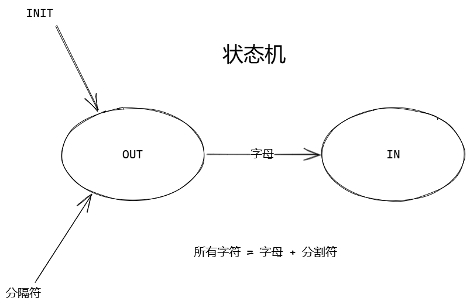

简单来说用状态机分析一下如上图。

但是感觉画的不对，应该正确的是这样的：

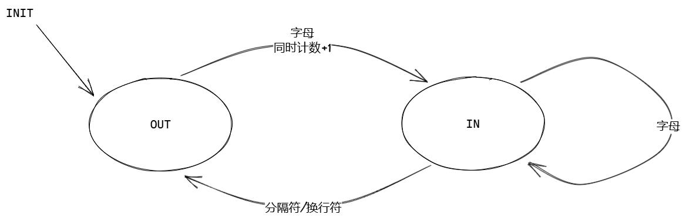

视频中给出的代码如下：

```c


#include <stdio.h>


#define OUT		0
#define IN		1

#define INIT	OUT

int splite(char c) {
	if ((' ' == c) || ('\n' == c) || ('\t' == c) ||
			('\"' == c) || ('\'' == c) || ('+' == c) ||
			(',' == c) || ';' == c || '.' == c)
		return 1;
	else
		return 0;
	
}

int count_word(char *filename) {

	int status = INIT;
	int word = 0;

	FILE *fp = fopen(filename, "r");
	if (fp == NULL) return -1;

	char c;
	while ((c = fgetc(fp)) != EOF) {

		if (splite(c)) { //
			status = OUT;
		} else if (OUT == status) {
			status = IN;
			word ++;
		}

	}

	return word;

}


int main(int argc, char *argv[]) {

	if (argc < 2) return -1;

	printf("word: %d\n", count_word(argv[1]));

}


```

感觉写的不太对，这样写下去，所有的分隔符都得包含在里面，不然就会报错。


```c
#include <stdio.h>

#define OUT 0
#define IN 1

#define INIT OUT

int count_word(char *filename)
{
    int status = INIT;
    FILE *fp = fopen(filename, "r");
    if (fp == NULL)
        return -1;

    int word_num = 0;
    int c;
    while ((c = fgetc(fp)) != EOF)
    {
        if (('a' <= c && c <= 'z') || ('A' <= c && c <= 'Z'))
        {
            if (status == OUT)
            {
                status = IN;
                word_num++;
            }
        }
        else
        {
            if (status == IN)
            {
                status = OUT;
            }
        }
    }
    fclose(fp);
    return word_num;
}

int main(int argc, char *argv[])
{
    if (argc < 2)
        return -1;
    printf("nums: %d", count_word(argv[1]));
}
```

==感觉我这样判断字母才是对的。==


---


## 2. 课后作业——解决连字符的问题

> 连字符问题我觉得分为两种：
>
> 1. 段内的连字符：JNJ-code这种
>
> 2. 换行的连字符：
>
>    acon-
>
>    da
>
> 这两种情况都需要解决


```c
#include <stdio.h>

#define OUT 0   // 空闲状态
#define IN 1    // 正在读单词
#define TEMP 2  // 刚读到 '-'，待判定
#define TEMP1 3 // 在 '-' 之后遇到 '\n'，待判定

int is_letter(int c)
{
    return ('a' <= c && c <= 'z') || ('A' <= c && c <= 'Z');
}

int count_word(const char *filename)
{
    int state = OUT;
    FILE *fp = fopen(filename, "r");
    if (!fp)
        return -1;

    int word_num = 0;
    int c;
    while ((c = fgetc(fp)) != EOF)
    {
        switch (state)
        {
        case OUT:
            if (is_letter(c))
            {
                state = IN;
                word_num++;
            }
            // 其他情况都留在 OUT
            break;

        case IN:
            if (is_letter(c))
            {
                // 继续在词中
            }
            else if (c == '-')
            {
                state = TEMP; // 可能的连字符
            }
            else
            {
                state = OUT; // 遇到非字母非'-'，词结束
            }
            break;

        case TEMP:
            if (is_letter(c))
            {
                state = IN; // 段内连字符，如 JNJ-code
            }
            else if (c == '\n')
            {
                state = TEMP1; // 换行连字符，如 acon-\n 后面待判
            }
            else
            {
                state = OUT; // 既不是字母也不是换行，回到 OUT
            }
            break;

        case TEMP1:
            if (is_letter(c))
            {
                state = IN; // 连字符换行后字母，继续 IN
            }
            else
            {
                state = OUT; // 不是字母，视为词已结束
            }
            break;
        }
    }

    fclose(fp);
    return word_num;
}

int main(int argc, char *argv[])
{
    if (argc < 2)
    {
        fprintf(stderr, "Usage: %s filename\n", argv[0]);
        return 1;
    }
    int n = count_word(argv[1]);
    if (n < 0)
    {
        perror("fopen");
        return 1;
    }
    printf("nums: %d\n", n);
    return 0;
}

```

功能验证没有问题。


---


## 3. 课后作业——统计单词出现的频率

我个人的第一想法是，使用一个树来做统计。每个节点对应一个27个子节点的树==（26个字母+一个连字符）==，以此来存储英文单词。

（主要换行的连字符-我们可以丢弃，但是单词间有的时候也有连字符：jnj-box这种）


> 但是我的做法里面有个小问题我还不知道怎么去解决，就是对于每句话的首字母大写，我的做法是把**每个单词中的所有大写字母转化为小写**，但是这种转化是否合适呢？或者说本质上我们就应该定义52个节点来作为大小写的分开判断？
>
> **这边简化流程，我决定将所有的字母变为小写来保存单词，同时例如 Jnj-box 则保存为jnj-box。毕竟拓展起来也不难**


最终代码：

```c
#include <stdio.h>
#include <stdlib.h>

#define OUT 0   // 空闲状态
#define IN 1    // 正在读单词
#define TEMP 2  // 刚读到 '-'，待判定
#define TEMP1 3 // 在 '-' 之后遇到 '\n'，待判定

typedef struct letter_node
{
    int count;
    struct letter_node *children[27];
} letter_node;

letter_node *create_node(void)
{
    letter_node *temp_node = malloc(sizeof(letter_node));
    temp_node->count = 0;
    for (int i = 0; i < 27; ++i)
    {
        temp_node->children[i] = NULL;
    }
    return temp_node;
}

int is_letter(int c)
{
    return ('a' <= c && c <= 'z') || ('A' <= c && c <= 'Z');
}

int count_word(const char *filename, letter_node *Dummy_node)
{
    int state = OUT;
    FILE *fp = fopen(filename, "r");
    if (!fp)
        return -1;

    int word_num = 0;
    int c;

    letter_node *temp_node;

    while ((c = fgetc(fp)) != EOF)
    {
        switch (state)
        {
        case OUT:
            if (is_letter(c))
            {
                state = IN;
                word_num++;
                c = c >= 'A' && c <= 'Z' ? c - 'A' + 'a' : c;
                if (Dummy_node->children[c - 'a'] == NULL)
                {
                    Dummy_node->children[c - 'a'] = create_node();
                }
                temp_node = Dummy_node->children[c - 'a'];
            }
            // 其他情况都留在 OUT
            break;

        case IN:
            if (is_letter(c))
            {
                c = c >= 'A' && c <= 'Z' ? c - 'A' + 'a' : c;
                if (temp_node->children[c - 'a'] == NULL)
                {
                    temp_node->children[c - 'a'] = create_node();
                }
                temp_node = temp_node->children[c - 'a'];
                // 继续在词中
            }
            else if (c == '-')
            {
                state = TEMP; // 可能的连字符
            }
            else
            {
                temp_node->count++;
                temp_node = NULL;
                state = OUT; // 遇到非字母非'-'，词结束
            }
            break;

        case TEMP:
            if (is_letter(c))
            {
                if (temp_node->children[26] == NULL)
                {
                    temp_node->children[26] = create_node();
                }
                temp_node = temp_node->children[26];

                c = c >= 'A' && c <= 'Z' ? c - 'A' + 'a' : c;

                if (temp_node->children[c - 'a'] == NULL)
                {
                    temp_node->children[c - 'a'] = create_node();
                }

                temp_node = temp_node->children[c - 'a'];

                state = IN; // 段内连字符，如 JNJ-code
            }
            else if (c == '\n')
            {
                state = TEMP1; // 换行连字符，如 acon-\n 后面待判
            }
            else
            {
                temp_node->count++;
                temp_node = NULL;
                state = OUT; // 既不是字母也不是换行，回到 OUT
            }
            break;

        case TEMP1:
            if (is_letter(c))
            {
                c = c >= 'A' && c <= 'Z' ? c - 'A' + 'a' : c;

                if (temp_node->children[c - 'a'] == NULL)
                {
                    temp_node->children[c - 'a'] = create_node();
                }

                temp_node = temp_node->children[c - 'a'];

                state = IN; // 连字符换行后字母，继续 IN
            }
            else
            {
                temp_node->count++;
                temp_node = NULL;
                state = OUT; // 不是字母，视为词已结束
            }
            break;
        }
    }

    if (temp_node != NULL)
        temp_node->count++;
    fclose(fp);
    return word_num;
}

// 前向声明辅助函数
void traverse(letter_node *node, char *word, int depth);

void print_result(letter_node *Dummy_node)
{
    char buffer[1024]; // 假设单词最大长度为1023字符
    for (int i = 0; i < 26; ++i)
    { // 遍历所有可能的首字母（a-z）
        letter_node *child = Dummy_node->children[i];
        if (child != NULL)
        {
            buffer[0] = 'a' + i;        // 设置首字母
            traverse(child, buffer, 1); // 深度从1开始
        }
    }
}

void traverse(letter_node *node, char *word, int depth)
{
    if (node == NULL)
        return;

    // 如果当前节点有计数，输出单词
    if (node->count > 0)
    {
        word[depth] = '\0'; // 终止字符串
        printf("%s: %d\n", word, node->count);
    }

    // 遍历所有子节点（a-z和连字符）
    for (int i = 0; i < 27; ++i)
    {
        if (node->children[i] != NULL)
        {
            char c;
            if (i < 26)
            {
                c = 'a' + i;
            }
            else
            {
                c = '-';
            }
            word[depth] = c; // 添加当前字符到单词中
            traverse(node->children[i], word, depth + 1);
        }
    }
}

int main(int argc, char *argv[])
{
    letter_node *Dummy_node = create_node();
    if (argc < 2)
    {
        fprintf(stderr, "Usage: %s filename\n", argv[0]);
        return 1;
    }
    int n = count_word(argv[1], Dummy_node);
    if (n < 0)
    {
        perror("fopen");
        return 1;
    }
    printf("nums: %d\n", n);
    printf("==========================\n");
    printf("单词统计如下：\n");
    print_result(Dummy_node);
    printf("==========================\n");
    return 0;
}

```


经过检查是对的，最终结果测试案例

```
Foreword.
 After several ' " ; , . ! { -+  } ye-ars of cont date-!
emplation and of thought upon the matter her-
ein contained-
  overflowed
```

对于上述这段文字的话，

最终输出结果如下：

```bash
zhenxing@ubuntu:~/share/01_count$ ./homework_count_per a.txt 
nums: 17
==========================
单词统计如下：
after: 1
and: 1
cont: 1
contained: 1
date: 1
emplation: 1
foreword: 1
herein: 1
matter: 1
of: 2
overflowed: 1
several: 1
the: 1
thought: 1
upon: 1
ye-ars: 1
==========================
```

实现我的功能设想：

1. 实测对大文件b.txt也可以实现，但是单词太多了，输出结果都显示不全。可能需要**保存到 log.txt 中去比较好。**（TODO）

2. **实测b.txt文件中也含有连字符单词的情况，所以这个的连字符处理方式是没有问题的。**

3. 部分重复代码实际上可以抽象成函数，这样更简洁。

   ```c
   c = c >= 'A' && c <= 'Z' ? c - 'A' + 'a' : c;
   if (temp_node->children[c - 'a'] == NULL)
   {
       temp_node->children[c - 'a'] = create_node();
   }
   temp_node = temp_node->children[c - 'a'];
   ```

   

---


# 实现通讯录（结构体）

## 1. 通讯录实现的架构设计与需求分析

> 通讯录的需求分析  -->  产品
>
> 1. 添加一个人员
> 2. 打印显示所有人员
> 3. 删除一个人员
> 4. 查找一个人员
> 5. 保存文件
> 6. 加载文件


---

思考一些需要解决的问题：

> **Q1：人员如何存储？**
>
> R1：使用链表的方式
>
> ---
>
> **Q2：文件存储的时候，文件用什么格式？**
>
> R2：人员数据的格式
>
> ---
>
> **Q3：人员信息有什么？**
>
> R3：姓名、电话


---


1. **文件数据存储如下：（key-value）**
   **name:xxx, phone:xxx, age: xx, addr: xx**
   **name:yyy, phone:yyy**

2. 实现链表
3. 对链表read、write
4. 对数据进行解包和打包
5. 设置一个接口层

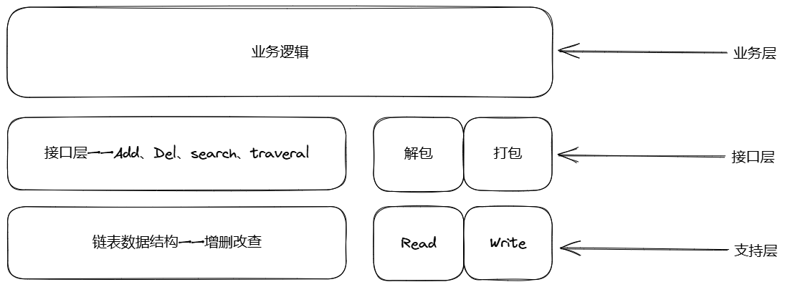


---


## 2. 链表的实现与数据结构的定义

整体来说是要构建一个双向链表进行存储。

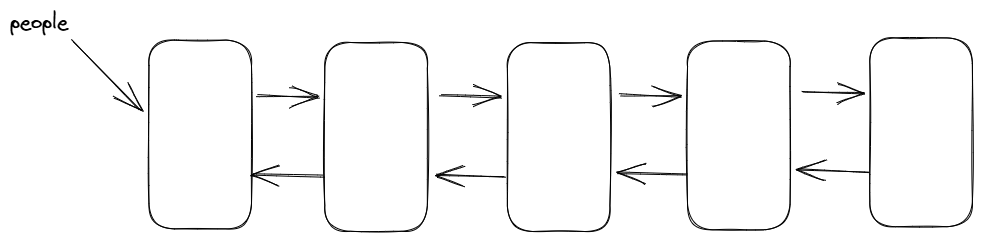

> 链表而言
>
> 1. Insert
>
> 2. Remove
>
> 使用**宏定义**的方式来实现


---


```c
// 整体用双向链表来进行存储

#define NAME_LENGTH 16
#define PHONE_LENGTH 32

#define LIST_INSERT(item, list) \
    do                          \
    {                           \
        item->prev = NULL;      \
        item->next = list;      \
        list = item;            \
    } while (0)


#define LIST_REMOVE(item, list)            \
    do                                     \
    {                                      \
        if (item->prev != NULL)            \
            item->prev->next = item->next; \
        if (item->next != NULL)            \
            item->next->prev = item->prev; \
        if (list == item)                  \
            list = item->next;             \
        item->prev = item->next = NULL;    \
    } while (0)


typedef struct Person
{
    char name[NAME_LENGTH];
    char phone[PHONE_LENGTH];
    person *next;
    person *prev;
} person;


typedef struct Contacts
{
    person *people;
    int count;
} contacts;


```


---


> 思考题：实现业务逻辑与数据结构的分离？


## 3. 架构接口层的实现

就是构造一些常见的接口操作了，插入删除，查询，遍历这种。

```c
// 整体用双向链表来进行存储
#include <stdio.h>
#include <stdlib.h>

#define NAME_LENGTH 16
#define PHONE_LENGTH 32

#define INFO printf

#define LIST_INSERT(item, list) \
    do                          \
    {                           \
        item->prev = NULL;      \
        item->next = list;      \
        list = item;            \
    } while (0)

#define LIST_REMOVE(item, list)            \
    do                                     \
    {                                      \
        if (item->prev != NULL)            \
            item->prev->next = item->next; \
        if (item->next != NULL)            \
            item->next->prev = item->prev; \
        if (list == item)                  \
            list = item->next;             \
        item->prev = item->next = NULL;    \
    } while (0)

typedef struct Person
{
    char name[NAME_LENGTH];
    char phone[PHONE_LENGTH];
    struct Person *next;
    struct Person *prev;
} person;

typedef struct Contacts
{
    person *people;
    int count;
} contacts;

int person_insert(person *people, person *ps)
{
    if (ps == NULL)
        return -1;
    LIST_INSERT(ps, people);
    return 0;
}

int person_delete(person *people, person *ps)
{
    if (ps == NULL)
        return -1;
    LIST_REMOVE(ps, people);
    return 0;
}

person *person_search(person *people, const char *name)
{
    while (people != NULL)
    {
        if (strcmp(people->name, name) == 0)
            return people;
        people = people->next;
    }
    return NULL;
}

int person_traversal(person *people, person *ps)
{
    while (people != NULL)
    {
        INFO(INFO("name:%s,phone:%s\n", people->name, people->phone));
        people = people->next;
    }
    return 0;
}

```


---


## 4. 业务逻辑的分析与实现

首先使用枚举先将所有功能给定义出来：

```c
enum{
    OPER_INSERT = 1,
    OPER_PRINT = 2,
    OPER_DELETE = 3,
    OPER_SEARCH = 4,
    OPER_SAVE = 5,
    OPER_LOAD = 6
};
```


之后先说一个小改动：

> 当你要往链表头部插入新节点时，本质上是要修改“链表的起点”这个指针——也就是让它从原来的第一个节点，变成你新插入的节点。
>
> - 如果函数签名是 `int person_insert(person *people, person *ps)`，你传进去的是“链表头指针”的一个**拷贝**，函数内部修改这个拷贝，并不会影响到外部真正存储头指针的变量。
> - 改成 `int person_insert(person **ppeople, person *ps)`，你传进去的是“链表头指针”那个变量本身的地址（地址的地址），函数内部可以通过 `*ppeople` 直接改写外部变量，这样插入新节点后，外部的头指针就真正指向了新节点。
>
> ```c
> // 修改前未使用双指针版本代码！
> // int person_insert(person *people, person *ps)
> // {
> //     if (ps == NULL)
> //         return -1;
> //     LIST_INSERT(ps, people);
> //     return 0;
> // }
> 
> int person_insert(person **ppeople, person *ps)
> {
>     if (ps == NULL)
>         return -1;
>     LIST_INSERT(ps, *ppeople);
>     return 0;
> }
> 
> ```


---


最终实现功能：

```c
int insert_entry(contacts *cts)
{
    if (cts == NULL)
        return -1;

    person *p = (person *)malloc(sizeof(person));
    if (p == NULL)
        return -2;

    // name
    // TODO: Linux下如何解决scanf数组输入溢出的问题
    INFO("Please input name:");
    scanf("%s", p->name);

    // phone
    INFO("Please input phone:");
    scanf("%s", p->phone);

    // add person

    if (0 != person_insert(&cts->people, p))
    {
        INFO("insert person failed\n");
        free(p);
        return -3;
    }

    // add count
    cts->count++;
    INFO("insert person success\n");
    INFO("name:%s,phone:%s\n", p->name, p->phone);
    return 0;
}

int print_entry(contacts *cts)
{
    if (cts == NULL)
        return -1;

    // print all
    INFO("print all:\n");
    person_traversal(cts->people);
}

int delete_entry(contacts *cts)
{
    if (cts == NULL)
        return -1;

    char name[NAME_LENGTH];
    INFO("Please input name:");
    scanf("%s", name);

    person *ps = person_search(cts->people, name);
    if (ps == NULL)
    {
        INFO("person not found\n");
        return -2;
    }

    // delete person
    if (0 != person_delete(&cts->people, ps))
    {
        INFO("delete person failed\n");
        return -3;
    }

    // delete count
    cts->count--;
    INFO("delete person success\n");
    free(ps);
    return 0;
}

int search_entry(contacts *cts)
{
    if (cts == NULL)
        return -1;

    char name[NAME_LENGTH] = {0};
    INFO("Please input name: ");
    scanf("%s", name);

    person *ps = person_search(cts->people, name);
    if (ps == NULL)
    {
        INFO("person not found\n");
        return -2;
    }

    // print person
    INFO("name:%s, phone:%s\n", ps->name, ps->phone);
    return 0;
}
```


---


## 5. 通讯录人员操作代码的调试

这部分操作就是编译了一下，添加了一个显示提示：

```c
void manu_info(){
    INFO("\n\n**************************************************\n");
    INFO("***************  Welcome to Contacts  ************\n");
    INFO("***************  1. Insert Entry   ***************\n");
    INFO("***************  2. Print Entry    ***************\n");
    INFO("***************  3. Delete Entry   ***************\n");
    INFO("***************  4. Search Entry   ***************\n");
    INFO("***************  5. Save Entry     ***************\n");
    INFO("***************  6. Load Entry     ***************\n");
    INFO("***************  0. Exit           ***************\n");
    INFO("***************  Please select:    ***************\n");
    INFO("**************************************************\n\n");
}

```


---

## 6. 通讯录添加人员操作的调试与运行

这部分没什么好说的，结果如下：

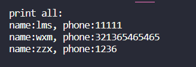

---


## 7. 通讯录删除人员操作的调试与BUG解决

这部分主要是解决bug：

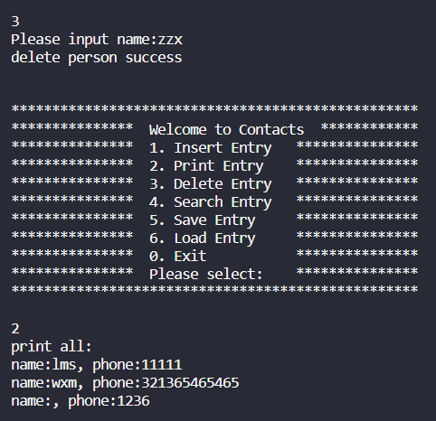

**删除没有删除成功！！！**

> 问题出在插入元素的时候，对前向指针的链接没有设置好：
>
> ```c
> #define LIST_INSERT(item, list) \
>     do                          \
>     {                           \
>         if((list) != NULL) (list)->prev = (item);      \
>         (item)->prev = NULL;      \
>         (item)->next = (list);      \
>         (list) = (item);            \
>     } while (0)
> 
> #define LIST_REMOVE(item, list)            \
>     do                                     \
>     {                                      \
>         if (item->prev != NULL)            \
>             item->prev->next = item->next; \
>         if (item->next != NULL)            \
>             item->next->prev = item->prev; \
>         if (list == item)                  \
>             list = item->next;             \
>         item->prev = NULL;                 \
>         item->next = NULL;                 \
>     } while (0)
> ```
>
> 之前是：
>
> ```c
> #define LIST_INSERT(item, list) \
>     do                          \
>     {                           \
>         item->prev = NULL;      \
>         item->next = list;      \
>         list = item;            \
>     } while (0)
> 
> #define LIST_REMOVE(item, list)            \
>     do                                     \
>     {                                      \
>         if (item->prev != NULL)            \
>             item->prev->next = item->next; \
>         if (item->next != NULL)            \
>             item->next->prev = item->prev; \
>         if (list == item)                  \
>             list = item->next;             \
>         item->prev = item->next = NULL;    \
>     } while (0)
> 
> ```
>
> 显然是错误的，缺少一句 `if((list) != NULL) (list)->prev = (item);`


---


## 8. 文件保存与加载的接口层实现

> 学习常见的文件操作函数：
>
> **`fopen`**：打开一个文件，返回一个文件指针（`FILE*`）用于读写操作。
>
> **`fprintf`**：向文件中格式化写入内容，类似 `printf`，但是写到文件里。
>
> **`fflush`**：把缓冲区里的数据立即写入到文件或刷新输出流（比如及时保存）。
>
> **`fclose`**：关闭打开的文件，释放相关资源。
>
> **`feof`**：检查文件流是否已经读到文件末尾（End Of File）。
>
> **`fgets`**：从文件中读取一行字符串，安全地读到缓冲区里。


---


最终代码如下：

```c
int save_file(person *people, const char *filename)
{
    FILE *fp = fopen(filename, "w");
    if (fp == NULL)
        return -1;

    while (people != NULL)
    {
        fprintf(fp, "Name: %s,Phone: %s\n", people->name, people->phone);
        fflush(fp); // 刷新文件流,从而将缓冲区的内容写入文件。落盘
        people = people->next;
    }
    fclose(fp);
    return 0;
}

int parser_token(char *buffer, int length, char *name, char *phone)
{
    if (buffer == NULL || name == NULL || phone == NULL)
        return -1;
    int i = 0, j = 0, status = 0;
    for (i = 0; i < buffer[i] != ','; i++)
    {
        if (buffer[i] == ' ')
        {
            status = 1;
        }
        else if (status == 1)
        {
            name[j++] = buffer[i];
        }
    }
    status = 0;
    j = 0;
    for (i = i + 1; i < buffer[i] != ','; i++)
    {
        if (buffer[i] == ' ')
        {
            status = 1;
        }
        else if (status == 1)
        {
            phone[j++] = buffer[i];
        }
    }
    INFO("name:%s, phone:%s\n", name, phone);
    return 0;
}

int load_file(person **ppeople, int *count, const char *filename)
{
    FILE *fp = fopen(filename, "r");
    if (fp == NULL)
        return -1;
    while (!feof(fp))
    {
        char buffer[BUFFER_LENGTH] = {0};
        char name[NAME_LENGTH] = {0};
        char phone[PHONE_LENGTH] = {0};
        fgets(buffer, BUFFER_LENGTH, fp);

        if (0 != parser_token(buffer, BUFFER_LENGTH, name, phone))
        {
            continue;
        }
        person *p = (person *)malloc(sizeof(person));
        if (p == NULL)
            return -2;
        memcpy(p->name, name, NAME_LENGTH);
        memcpy(p->phone, phone, PHONE_LENGTH);
        p->next = NULL;
        p->prev = NULL;
        if (0 != person_insert(ppeople, p))
        {
            INFO("insert person failed\n");
            free(p);
            return -3;
        }
        (*count)++;
    }
    fclose(fp);
    
    return 0;
}
```


---


## 9. 文件保存业务实现


```c
int save_file(person *people, const char *filename)
{
    FILE *fp = fopen(filename, "w");
    if (fp == NULL)
        return -1;

    while (people != NULL)
    {
        fprintf(fp, "Name: %s,Phone: %s\n", people->name, people->phone);
        fflush(fp); // 刷新文件流,从而将缓冲区的内容写入文件。落盘
        people = people->next;
    }
    fclose(fp);
    return 0;
}

int parser_token(char *buffer, int length, char *name, char *phone)
{
    if (buffer == NULL || name == NULL || phone == NULL)
        return -1;
    if (length < MIN_TOKEN_LENGTH) // 8
        return -2;
    int i = 0, j = 0, status = 0;
    for (i = 0;  buffer[i] != ','; i++)
    {
        if (buffer[i] == ' ')
        {
            status = 1;
        }
        else if (status == 1)
        {
            name[j++] = buffer[i];
        }
    }
    status = 0;
    j = 0;
    for (i = i + 1; i < BUFFER_LENGTH; i++)
    {
        if (buffer[i] == ' ')
        {
            status = 1;
        }
        else if (status == 1)
        {
            phone[j++] = buffer[i];
        }
    }
    INFO("name:%s, phone:%s\n", name, phone);
    return 0;
}

int load_file(person **ppeople, int *count, const char *filename)
{
    FILE *fp = fopen(filename, "r");
    if (fp == NULL)
        return -1;
    while (!feof(fp))
    {
        char buffer[BUFFER_LENGTH] = {0};
        char name[NAME_LENGTH] = {0};
        char phone[PHONE_LENGTH] = {0};
        fgets(buffer, BUFFER_LENGTH, fp);

        if (0 != parser_token(buffer, strlen(buffer), name, phone))
        {
            continue;
        }
        person *p = (person *)malloc(sizeof(person));
        if (p == NULL)
            return -2;
        memcpy(p->name, name, NAME_LENGTH);
        memcpy(p->phone, phone, PHONE_LENGTH);

        if (0 != person_insert(ppeople, p))
        {
            INFO("insert person failed\n");
            free(p);
            return -3;
        }
        (*count)++;
    }
    fclose(fp);
    return 0;
}
```


---


## 10. 通讯录调试与运行

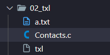


完整代码及备注如下：

```c
// 整体用双向链表来进行存储
#include <stdio.h>
#include <stdlib.h>
#include <string.h>

#define NAME_LENGTH 16
#define PHONE_LENGTH 32
#define BUFFER_LENGTH 80
#define MIN_TOKEN_LENGTH 8

#define INFO printf

#define LIST_INSERT(item, list)    \
    do                             \
    {                              \
        if ((list) != NULL)        \
            (list)->prev = (item); \
        (item)->prev = NULL;       \
        (item)->next = (list);     \
        (list) = (item);           \
    } while (0)

#define LIST_REMOVE(item, list)            \
    do                                     \
    {                                      \
        if (item->prev != NULL)            \
            item->prev->next = item->next; \
        if (item->next != NULL)            \
            item->next->prev = item->prev; \
        if (list == item)                  \
            list = item->next;             \
        item->prev = NULL;                 \
        item->next = NULL;                 \
    } while (0)

/**
 * @brief 个人信息节点
 */
typedef struct Person
{
    char name[NAME_LENGTH];
    char phone[PHONE_LENGTH];
    struct Person *next;
    struct Person *prev;
} person;

/**
 * @brief 通讯录数据结构
 */
typedef struct Contacts
{
    person *people;
    int count;
} contacts;

// TODO：实现数据结构与逻辑实现的分离

enum
{
    OPER_INSERT = 1,
    OPER_PRINT = 2,
    OPER_DELETE = 3,
    OPER_SEARCH = 4,
    OPER_SAVE = 5,
    OPER_LOAD = 6
};

/**
 * @brief 往链表头部插入一个新的联系人节点
 * @param ppeople 链表头指针的地址
 * @param ps 要插入的联系人节点
 * @return 成功返回0，失败返回-1
 */
int person_insert(person **ppeople, person *ps)
{
    if (ps == NULL)
        return -1;
    LIST_INSERT(ps, *ppeople);
    return 0;
}

/**
 * @brief 从链表中删除一个联系人节点
 * @param ppeople 链表头指针的地址
 * @param ps 要删除的联系人节点
 * @return 成功返回0，失败返回-1
 */
int person_delete(person **ppeople, person *ps)
{
    if (ps == NULL)
        return -1;
    LIST_REMOVE(ps, *ppeople);
    return 0;
}

/**
 * @brief 根据名字在联系人链表中查找联系人
 * @param people 链表头指针
 * @param name 要查找的名字
 * @return 找到返回对应节点指针，未找到返回NULL
 */
person *person_search(person *people, const char *name)
{
    while (people != NULL)
    {
        if (strcmp(people->name, name) == 0)
            return people;
        people = people->next;
    }
    return NULL;
}

/**
 * @brief 遍历打印所有联系人
 * @param people 链表头指针
 * @return 成功返回0
 */
int person_traversal(person *people)
{
    while (people != NULL)
    {
        INFO("name:%s, phone:%s\n", people->name, people->phone);
        people = people->next;
    }
    return 0;
}

/**
 * @brief 将联系人链表保存到指定文件
 * @param people 链表头指针
 * @param filename 文件名
 * @return 成功返回0，失败返回-1
 */
int save_file(person *people, const char *filename)
{
    FILE *fp = fopen(filename, "w");
    if (fp == NULL)
        return -1;

    while (people != NULL)
    {
        fprintf(fp, "Name: %s,Phone: %s\n", people->name, people->phone);
        fflush(fp); // 刷新文件流,从而将缓冲区的内容写入文件。落盘
        people = people->next;
    }
    fclose(fp);
    return 0;
}

/**
 * @brief 从读取的一行字符串中解析出名字和电话号码
 * @param buffer 读取到的字符串缓冲区
 * @param length 字符串长度
 * @param name 解析出的名字
 * @param phone 解析出的电话号码
 * @return 成功返回0，参数错误返回-1，字符串太短返回-2
 */
int parser_token(char *buffer, int length, char *name, char *phone)
{
    if (buffer == NULL || name == NULL || phone == NULL)
        return -1;
    if (length < MIN_TOKEN_LENGTH) // 8
        return -2;
    int i = 0, j = 0, status = 0;
    for (i = 0;  buffer[i] != ','; i++)
    {
        if (buffer[i] == ' ')
        {
            status = 1;
        }
        else if (status == 1)
        {
            name[j++] = buffer[i];
        }
    }
    status = 0;
    j = 0;
    for (i = i + 1; i < BUFFER_LENGTH; i++)
    {
        if (buffer[i] == ' ')
        {
            status = 1;
        }
        else if (status == 1)
        {
            phone[j++] = buffer[i];
        }
    }
    INFO("name:%s, phone:%s\n", name, phone);
    return 0;
}

/**
 * @brief 从文件中加载联系人到链表
 * @param ppeople 链表头指针的地址
 * @param count 联系人数量指针
 * @param filename 文件名
 * @return 成功返回0，文件打开失败返回-1，内存分配失败返回-2
 */
int load_file(person **ppeople, int *count, const char *filename)
{
    FILE *fp = fopen(filename, "r");
    if (fp == NULL)
        return -1;
    while (!feof(fp))
    {
        char buffer[BUFFER_LENGTH] = {0};
        char name[NAME_LENGTH] = {0};
        char phone[PHONE_LENGTH] = {0};
        fgets(buffer, BUFFER_LENGTH, fp);

        if (0 != parser_token(buffer, strlen(buffer), name, phone))
        {
            continue;
        }
        person *p = (person *)malloc(sizeof(person));
        if (p == NULL)
            return -2;
        memcpy(p->name, name, NAME_LENGTH);
        memcpy(p->phone, phone, PHONE_LENGTH);

        if (0 != person_insert(ppeople, p))
        {
            INFO("insert person failed\n");
            free(p);
            return -3;
        }
        (*count)++;
    }
    fclose(fp);
    return 0;
}

/**
 * @brief 插入新的联系人
 * @param cts 通讯录指针
 * @return 成功返回0，失败返回负值
 */
int insert_entry(contacts *cts)
{
    if (cts == NULL)
        return -1;

    person *p = (person *)malloc(sizeof(person));
    if (p == NULL)
        return -2;

    // name
    // TODO: Linux下如何解决scanf数组输入溢出的问题
    INFO("Please input name:");
    scanf("%s", p->name);

    // phone
    INFO("Please input phone:");
    scanf("%s", p->phone);

    // add person

    if (0 != person_insert(&cts->people, p))
    {
        INFO("insert person failed\n");
        free(p);
        return -3;
    }

    // add count
    cts->count++;
    INFO("insert person success\n");
    INFO("name:%s,phone:%s\n", p->name, p->phone);
    return 0;
}

/**
 * @brief 打印所有联系人
 * @param cts 通讯录指针
 * @return 成功返回0
 */
int print_entry(contacts *cts)
{
    if (cts == NULL)
        return -1;

    // print all
    INFO("print all:\n");
    person_traversal(cts->people);
}

/**
 * @brief 删除指定联系人
 * @param cts 通讯录指针
 * @return 成功返回0，失败返回负值
 */
int delete_entry(contacts *cts)
{
    if (cts == NULL)
        return -1;

    char name[NAME_LENGTH];
    INFO("Please input name:");
    scanf("%s", name);

    person *ps = person_search(cts->people, name);
    if (ps == NULL)
    {
        INFO("person not found\n");
        return -2;
    }

    // delete person
    if (0 != person_delete(&cts->people, ps))
    {
        INFO("delete person failed\n");
        return -3;
    }

    // delete count
    cts->count--;
    INFO("delete person success\n");
    free(ps);
    return 0;
}

/**
 * @brief 查找指定联系人
 * @param cts 通讯录指针
 * @return 成功返回0，未找到返回-2
 */
int search_entry(contacts *cts)
{
    if (cts == NULL)
        return -1;

    char name[NAME_LENGTH] = {0};
    INFO("Please input name: ");
    scanf("%s", name);

    person *ps = person_search(cts->people, name);
    if (ps == NULL)
    {
        INFO("person not found\n");
        return -2;
    }

    // print person
    INFO("name:%s, phone:%s\n", ps->name, ps->phone);
    return 0;
}

/**
 * @brief 保存联系人到文件
 * @param cts 通讯录指针
 * @return 成功返回0
 */
int save_entry(contacts *cts)
{
    if(cts == NULL)
        return -1;
    INFO("Please input filename:");
    char filename[BUFFER_LENGTH] = {0};
    scanf("%s", filename);
    save_file(cts->people, filename);
}

/**
 * @brief 从文件中加载联系人
 * @param cts 通讯录指针
 * @return 成功返回0
 */
int load_entry(contacts *cts)
{
    if (cts == NULL)
        return -1;
    INFO("Please input filename:");
    char filename[BUFFER_LENGTH] = {0};
    scanf("%s", filename);
    load_file(&cts->people, &cts->count, filename);
}

/**
 * @brief 打印菜单信息
 */
void manu_info()
{
    INFO("\n\n**************************************************\n");
    INFO("***************  Welcome to Contacts  ************\n");
    INFO("***************  1. Insert Person  ***************\n");
    INFO("***************  2. Print Person   ***************\n");
    INFO("***************  3. Delete Person  ***************\n");
    INFO("***************  4. Search Person  ***************\n");
    INFO("***************  5. Save Files     ***************\n");
    INFO("***************  6. Load Files     ***************\n");
    INFO("***************  0. Exit           ***************\n");
    INFO("***************  Please select:    ***************\n");
    INFO("**************************************************\n\n");
}

/**
 * @brief 主函数，程序入口
 * @return 正常退出返回0
 */
int main()
{
    contacts *cts = (contacts *)malloc(sizeof(contacts));
    cts->people = NULL;
    cts->count = 0;
    while (1)
    {
        manu_info();
        int select = 0;
        scanf("%d", &select);
        switch (select)
        {
        case OPER_INSERT:
            insert_entry(cts);
            break;
        case OPER_PRINT:
            print_entry(cts);
            break;
        case OPER_DELETE:
            delete_entry(cts);
            break;
        case OPER_SEARCH:
            search_entry(cts);
            break;
        case OPER_SAVE:
            save_entry(cts);
            break;
        case OPER_LOAD:
            load_entry(cts);
            break;
        default:
            goto exit;
        }
    }
exit:
    free(cts);
    cts = NULL;
    INFO("exit\n");
    return 0;
}

```


---


## 11. 课后作业——按首字母顺序排序

我的做法是定义了一个首字母排序链表的函数：

```c
**
 * @brief 按照名字的首字母对联系人链表进行排序
 * @param ppeople 链表头指针的地址
 * @return 成功返回0，失败返回-1
 */

int sort_list_by_initial(person **ppeople)
{
    if (ppeople == NULL || *ppeople == NULL)
        return -1;

    person *sorted = NULL;
    person *current = *ppeople;

    while (current != NULL)
    {
        person *next = current->next;
        // 将 current 与原链表断开
        current->prev = current->next = NULL;

        // 在 sorted 链表中找到插入位置
        person *iter = sorted;
        person *prev = NULL;
        char cur_initial = tolower(current->name[0]);
        while (iter != NULL && tolower(iter->name[0]) <= cur_initial)
        {
            prev = iter;
            iter = iter->next;
        }

        if (prev == NULL)
        {
            // 插入到头部
            current->next = sorted;
            if (sorted) sorted->prev = current;
            sorted = current;
        }
        else
        {
            // 插入到 prev 之后
            current->next = prev->next;
            if (prev->next) prev->next->prev = current;
            prev->next = current;
            current->prev = prev;
        }

        current = next;
    }

    *ppeople = sorted;
    return 0;
}
```


然后在两个接口函数中，插入接口以及读入接口中分别调用这个函数进行排序，这样的话可读性更强

==同样做了异常排序抛出错误码==

```c
/**
 * @brief 插入新的联系人
 * @param cts 通讯录指针
 * @return 成功返回0，失败返回负值
 */
int insert_entry(contacts *cts)
{
    if (cts == NULL)
        return -1;

    person *p = (person *)malloc(sizeof(person));
    if (p == NULL)
        return -2;

    // name
    // TODO: Linux下如何解决scanf数组输入溢出的问题
    INFO("Please input name:");
    scanf("%s", p->name);

    // phone
    INFO("Please input phone:");
    scanf("%s", p->phone);

    // add person

    if (0 != person_insert(&cts->people, p))
    {
        INFO("insert person failed\n");
        free(p);
        return -3;
    }
//====================================================
    if (0 != sort_list_by_initial(&cts->people))
    {
        INFO("sort list failed\n");
        free(p);
        return -4;
    }
//====================================================
    // add count
    cts->count++;
    INFO("insert person success\n");
    INFO("name:%s,phone:%s\n", p->name, p->phone);
    return 0;
}
```


```c
/**
 * @brief 从文件中加载联系人
 * @param cts 通讯录指针
 * @return 成功返回0，失败返回负值
 */
int load_entry(contacts *cts)
{
    if (cts == NULL)
        return -1;
    INFO("Please input filename:");
    char filename[BUFFER_LENGTH] = {0};
    scanf("%s", filename);
    load_file(&cts->people, &cts->count, filename);
    //==========================================================
    if (0 != sort_list_by_initial(&cts->people))
    {
        INFO("sort list failed\n");
        return -2;
    }
    //==========================================================
    INFO("load file success\n");

    return 0;
}
```

至此实现功能。


**当然其实有些问题没有解决：**

> 通讯录同名问题，
>
> // TODO：实现数据结构与逻辑实现的分离
>
> // TODO: Linux下如何解决scanf数组输入溢出的问题

**时间不够以后实现吧**


---


# 并发下的技术方案（锁） 

## 1.多线程并发锁的项目介绍

以火车站买票为例，讲解并发和多线程的概念。

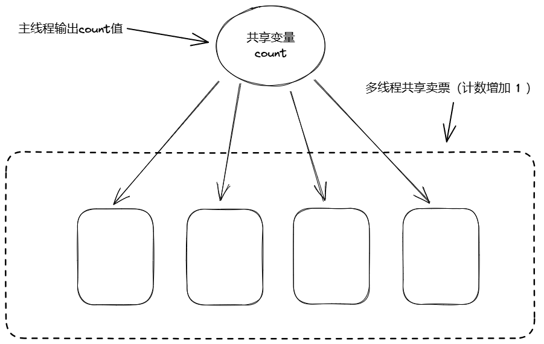


代码实现这个demo如下：

```c
#include <stdio.h>
#include <stdlib.h>
#include <string.h>
#include <ctype.h>
#include <pthread.h>
#include <unistd.h>


#define THREAD_COUNT       10

void *thread_callback(void *arg)
{
    int *pcount = (int *)arg;

    int i = 0;

    while(i++<100000){
        (*pcount)++;
        usleep(1);
    }
}

int main(){
    pthread_t threadid[THREAD_COUNT] = {0};

    int i = 0;
    int count = 0;
    for (i = 0; i < THREAD_COUNT; i++)
    {
        // count这个是要传递给线程的参数，传递给thread_callback函数
        // 这里传递的是地址
        // 也可以传递一个结构体
        pthread_create(&threadid[i], NULL, thread_callback, &count);
    }
    for(i = 0; i < 100; i++)
    {
        printf("count = %d\n", count);
        sleep(1);
    }
    return 0;
}

```


输出结果如下：

```c
count = 9
count = 57520
count = 107284
count = 156971
count = 210393
count = 268805
count = 327916
count = 391440
count = 435511
count = 498803
count = 560886
count = 618795
count = 670150
count = 734534
count = 810670
count = 886915
count = 960624
count = 999888
count = 999888
count = 999888
count = 999888
count = 999888
```


> ==**这边为什么锁死在999888呢？**==
>
> 我个人觉得是这一百万有那么几个撞到一起了，对共享变量进行了覆盖操作
>
> 下一章说！！！！


---


## 2.多线程并发锁的方案—互斥锁

> 从汇编的角度来分析刚刚的问题：
>
> ```c
> count++   ==>   
> 
> move[count],  eax;
> inc eax;
> mov eax,  [count];
> ```
>
> 正常情况：
>
> 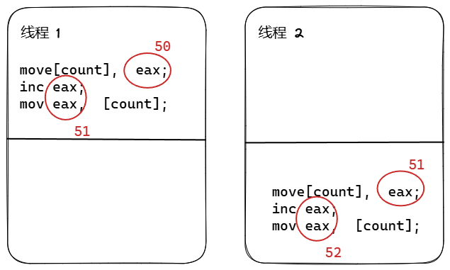
>
> 非正常情况：
>
> 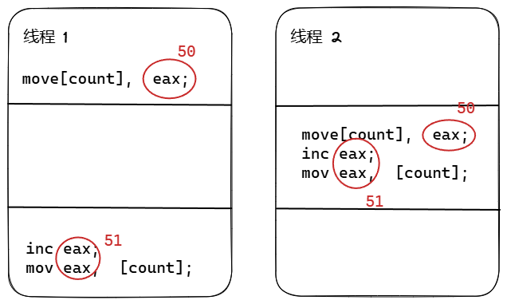


---


> **如何来解决这个问题呢？**
>
> 本质上`count`是一个临界变量，这种操作，我们就需要加锁来进行操作
>
> 第一个使用**互斥锁**！！！


互斥锁的代码如下：

```c
......
pthread_mutex_t mutex;

void *thread_callback(void *arg)
{
    int *pcount = (int *)arg;
    int i = 0;
    while (i++ < 100000)
    {
#if 0
        (*pcount)++;

#else
        pthread_mutex_lock(&mutex);
        (*pcount)++;
        pthread_mutex_unlock(&mutex);
#endif
        usleep(1);
    }
}

int main()
{
    pthread_t threadid[THREAD_COUNT] = {0};

    int i = 0;
    int count = 0;

    pthread_mutex_init(&mutex, NULL);
	......
}

```


**加锁/解锁指令**：单次操作约需 **20-100ns**（现代CPU）

**性能测试数据**：

|    操作类型    | 耗时（百万次） |
| :------------: | :------------: |
|  无锁原子操作  |      12ms      |
|   互斥锁保护   |     210ms      |
| 无保护（错误） |      8ms       |


---


## 3.多线程并发锁的方案—自旋锁

**在4核CPU上测试不同方案的吞吐量（操作/秒）：**

|      方案       | 吞吐量 | CPU利用率 |
| :-------------: | :----: | :-------: |
| 无保护（错误）  | 1.2亿  |   400%    |
|     互斥锁      | 860万  |    95%    |
|     自旋锁      | 2100万 |   380%    |
| 读写锁（80%读） | 4100万 |   320%    |
|    原子操作     | 9800万 |   390%    |

==自旋锁优化互斥锁的性能消耗！！！！！==

代码实现如下：

```c
#define WITHOUT_LOCK 0
#define MUTEX_FLAG 0
#define SPINLOCK_FLAG 1


#if MUTEX_FLAG
    pthread_mutex_t mutex;
#elif SPINLOCK_FLAG
    pthread_spinlock_t spinlock;
#endif


#if WITHOUT_LOCK
        (*pcount)++;
#elif MUTEX_FLAG
        pthread_mutex_lock(&mutex);
        (*pcount)++;
        pthread_mutex_unlock(&mutex);
#elif SPINLOCK_FLAG
        pthread_spin_lock(&spinlock);
        (*pcount)++;
        pthread_spin_unlock(&spinlock);
#endif
        usleep(1);
    }
}

#if MUTEX_FLAG
    pthread_mutex_init(&mutex, NULL);
#elif SPINLOCK_FLAG
    pthread_spin_init(&spinlock, PTHREAD_PROCESS_SHARED);
#endif

```


---

> **自旋锁跟互斥锁的区别！**
>
> 简单来说：
>
> **互斥锁：**其他线程到达这里的时候会先休眠，释放CPU性能
>
> **自旋锁：**其他线程到达这里的时候会在原地进行while遍历，等待在这里，所以需要多核的CPU，否则就起不到等待的效果！！！！需求CPU性能比较高。
>
> - **原子性操作**：通过CPU的`LOCK`前缀指令（如x86的`lock cmpxchg`）实现原子测试并设置
> - **忙等待循环**：不会让出CPU，持续检测锁状态（对比Mutex会让线程休眠）
> - **内存屏障**：隐含的`memory barrier`保证操作顺序性
>
> |      指标      |      自旋锁      |        互斥锁        |
> | :------------: | :--------------: | :------------------: |
> |   获取锁耗时   |     20-50 ns     |      100-200 ns      |
> | 上下文切换次数 |        0         | 至少2次（休眠+唤醒） |
> |  最佳适用场景  | 锁持有时间 < 1μs |   锁持有时间 > 1μs   |
> |   CPU利用率    |  高（持续轮询）  |  低（主动让出CPU）   |


### 选择锁的黄金法则 

1. **先思考锁的粒度**

   - 自旋锁适合保护`i++`这样的单指令操作
   - 互斥锁适合保护`文件写入`这种复杂操作

   

2. **参考等待时间阈值**

   mermaid

   ```mermaid
   graph LR
   A{预计等待时间} -->|≤1μs| B[自旋锁]
   A -->|＞1μs| C[互斥锁]
   ```

3. **混合锁策略**（现代操作系统常用）

   - 先自旋等待1000次循环（约1μs）
   - 仍未获得锁则转为休眠等待


---


## 4.多线程并发锁的方案—原子操作


简单来说就是，如果我们的汇编只有一条操作，这就不不会存在竞争的问题了。

```c
move[count],  eax;
inc eax;
mov eax,  [count];

===> 一条指令
```


具体的实现如下：

```c
int inc(int *value, int add){
    int old;
    __asm__ volatile(
        "lock; xaddl %2, %1"
        : "=a"(old)
        : "m"(*value), "a"(add)
        : "cc", "memory"
    );
}

void *thread_callback(void *arg)
{
    int *pcount = (int *)arg;

    int i = 0;

    while (i++ < 100000)
    {
#if WITHOUT_LOCK
        (*pcount)++;
#elif MUTEX_FLAG
        pthread_mutex_lock(&mutex);
        (*pcount)++;
        pthread_mutex_unlock(&mutex);
#elif SPINLOCK_FLAG
        pthread_spin_lock(&spinlock);
        (*pcount)++;
        pthread_spin_unlock(&spinlock);
#elif INC_FLAG
        inc(pcount, 1);
#endif
        usleep(1);
    }
}
```


1. **无锁（WITHOUT_LOCK）**

```c
(*pcount)++; // 无同步
```

- 优势：
  - 速度最快，无任何同步开销。
- 劣势：
  - **线程不安全**：`++`操作不是原子的，多线程并发会导致竞争条件（Race Condition），最终结果不可预测。
  - 仅适用于单线程场景，多线程中完全不可靠。
- **结论**：
  ❌ 绝对不适用于多线程环境。

------

2. **互斥锁（MUTEX_FLAG）**

```c
pthread_mutex_lock(&mutex);
(*pcount)++;
pthread_mutex_unlock(&mutex);
```

- 优势：
  - **线程安全**：通过锁保证临界区的原子性。
  - 适用于复杂操作：可保护多个变量或复杂逻辑的临界区。
  - 公平性：等待锁的线程会休眠（让出CPU），避免忙等待浪费资源。
- 劣势：
  - **性能开销大**：加锁/解锁涉及内核态切换，上下文切换代价高，尤其在高竞争场景下。
  - 可能引发死锁：需谨慎设计锁的获取顺序。
- **适用场景**：
  ✅ 临界区较复杂（如涉及I/O、多变量操作）或可能阻塞的场景。

------

3. **自旋锁（SPINLOCK_FLAG）**

```c
pthread_spin_lock(&spinlock);
(*pcount)++;
pthread_spin_unlock(&spinlock);
```

- 优势：
  - **线程安全**：通过忙等待保证原子性。
  - **低延迟**：无上下文切换，适合极短临界区。
  - 多核高效：在锁很快被释放时，忙等待的代价低于休眠唤醒的开销。
- 劣势：
  - **CPU资源浪费**：线程在等待锁时持续占用CPU（忙等待）。
  - 单核性能差：可能导致死锁（持有锁的线程无法运行）。
- **适用场景**：
  ✅ 多核CPU、临界区极短（如简单赋值）且低竞争的场景。

------

4. **原子操作（INC_FLAG）**

```c
inc(pcount, 1); // 通过 lock xaddl 实现原子递增
```

- 优势：
  - **线程安全**：硬件级原子指令（如`lock xaddl`）确保操作不可分割。
  - **性能最优**：无锁机制，直接利用CPU指令，无上下文切换或忙等待。
- 劣势：
  - **功能受限**：仅支持简单操作（如加减、交换），无法保护复杂逻辑。
  - 平台依赖性：需特定CPU指令支持（但x86普遍支持）。
- **适用场景**：
  ✅ 简单原子操作（如计数器递增），追求极致性能。

------

**总结对比**

|   方式   | 线程安全 |       性能       |          适用场景          |
| :------: | :------: | :--------------: | :------------------------: |
|   无锁   |    ❌     | 最高（但不可靠） |             无             |
|  互斥锁  |    ✅     |        低        | 复杂临界区、可能阻塞的操作 |
|  自旋锁  |    ✅     |        中        | 极短临界区、多核低竞争环境 |
| 原子操作 |    ✅     |     **最高**     |  简单原子操作（如计数器）  |

------

**最终选择建议**

- **最优选择**：**原子操作（INC_FLAG）**
  在代码中仅需原子递增的场景下，原子操作是最佳选择，既安全又高效。
- **次优选择**：自旋锁（若原子操作不可用）
  适用于极短操作，但需确保多核低竞争。
- **保守选择**：互斥锁
  通用性强，但性能开销较大，适合复杂逻辑保护。

**避免使用无锁方式**，除非能接受结果错误。


---


## 课后作业——CAS（compare and swap）

在并发编程中，**CAS（Compare-And-Swap，比较并交换）** 是一种关键的原子操作，用于实现无锁数据结构。以下是CAS的实现及其应用详解：

1. **作用**：
   比较内存位置的值与预期值，若相等则更新为新值；否则不修改。无论是否成功，返回该位置的旧值。
2. **原子性**：
   操作由硬件（如x86的`lock cmpxchg`指令）保证不可分割，确保多线程环境下的线程安全。


> 想象你和朋友一起修改黑板上的数字：
>
> 1. **你要做**：把数字从 `5` 改成 `6`。
>
> 2. **传统加锁方式**：你先把黑板锁住，确认是 `5` 后改成 `6`，再解锁。其他人必须等你完成才能操作。
>
> 3. **CAS 无锁方式：**你直接看黑板的数字是`5`，然后快速写下 `6`，但写之前再看一眼黑板：
>   - 如果还是 `5`，说明没人动过，修改成功！
>    - 如果变成其他数字（比如 `7`），说明有人抢先改了，你重新开始（再看数字→计算→尝试修改）。
>
> **核心思想**：不用锁，而是通过“看一眼→修改前再确认”的方式，避免冲突。


---


代码实现如下：

```c
#include <stdio.h>
#include <stdlib.h>
#include <string.h>
#include <ctype.h>
#include <pthread.h>
#include <unistd.h>

#define THREAD_COUNT 10

// 自定义CAS函数（使用GCC内置原子操作）
int cas(int* ptr, int oldval, int newval) {
    return __atomic_compare_exchange_n(ptr, &oldval, newval, 0, __ATOMIC_SEQ_CST, __ATOMIC_SEQ_CST);
}

void* thread_callback(void* arg) {
    int* pcount = (int*)arg;
    int i = 0;
    while (i++ < 100000) {
        int old_val, new_val;
        do {
            old_val = *pcount;       // 读取当前值
            new_val = old_val + 1;   // 计算新值
        } while (!cas(pcount, old_val, new_val)); // 循环直到CAS成功
        usleep(1);
    }
    return NULL;
}

int main() {
    pthread_t threadid[THREAD_COUNT] = {0};
    int i = 0;
    int count = 0;

    for (i = 0; i < THREAD_COUNT; i++) {
        pthread_create(&threadid[i], NULL, thread_callback, &count);
    }

    // 输出逻辑完全不变
    for (i = 0; i < 100; i++) {
        printf("count = %d\n", count);
        sleep(1);
    }

    return 0;
}
```


**优势对比**

|   方式   | 性能 | 线程安全 | 代码复杂度 |
| :------: | :--: | :------: | :--------: |
|  互斥锁  |  低  |    ✅     |    简单    |
|  自旋锁  |  中  |    ✅     |    简单    |
| 原子操作 |  高  |    ✅     |    中等    |
| **CAS**  |  高  |    ✅     |    较高    |

- **CAS 适用场景**：简单原子操作（如计数器），且追求极致性能时。
- **注意**：如果操作复杂（比如修改多个变量），CAS 会很难实现，此时建议用锁。


---


## 5.线程池的使用场景与原理分析

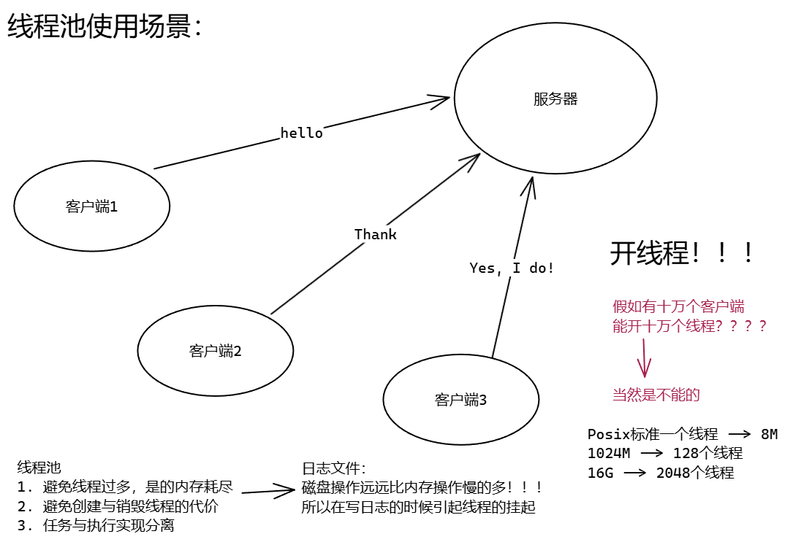

**【可以将写日志的任务交给线程池】**

针对一个日志段准备好了，将执行任务的操作交给一个线程池，（落盘操作）。


> **【形象解释】**
>
> 银行营业厅，办理业务的人，对于柜员而言，这些都是**任务**。
>
> **营业厅里面的公示牌：**防止多个办业务的人，在一一个柜员里面办业务。两个柜员同时为一个人办业务服务。
>
> 管理组件使得营业厅能够正常有序的工作。


---


## 6.线程池的结构体定义


---


## 7.线程池的架构分析与实现


---


## 8.线程池初始化的实现


---


## 9.线程池的线程回调函数实现


---


## 10.线程池的任务添加与线程池销毁


---


## 11.线程池入口函数实现以及调试


---


## 12.线程池代码gdb调试与bug修改


