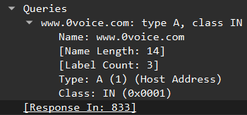
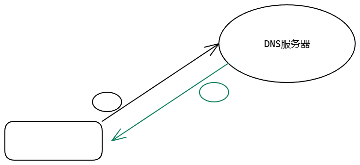

# Linux环境专栏

## 一、Linux环境编程项目精讲介绍

分为下面几个部分


---


### Linux开发环境

- 项目目的：了解Linux环境搭建，了解LinuxC编程
- 项目知识点：Linux安装，命令使用，shell编程
- 项目：shell脚本实现检测局域网内哪些ip地址机器宕机
- 推荐书籍：鸟哥私房菜
- 课后作业题：Shell脚本实现获取本机ip地址


---


### Linux C编程

#### **1. LinuxC编程统计文件单词数量（文件操作）**

- 项目目的：了解Linux编程环境搭建，了解Linux C编程
- 项目知识点：文件操作，文件指针，
- 推荐书籍：嗨翻c语言
- 课后练习题：**统计每个单词出现的次数**


#### **2. LinuxC编程实现通讯录（结构体）**

- 项目目的：了解结构体定义，数据结构
- 项目知识点：链表操作，添加节点，遍历，查找
- 推荐书籍：大话数据结构
- 课后练习题：**按照姓名首字母存储通讯录，使用数组加链表**


---


### Linux环境编程

#### **3.并发下的计数方案（锁）**

- 项目目的：了解并发，了解计数方案
- 项目知识点：互斥锁，自旋锁，原子操作
- 推荐书籍：Unix高级环境编程
- 课后练习题：了解CAS，并实现CAS


#### **4.CPU与进程的关系（进程与进程通信）**

- 项目目的：了解进程，进程间通信共享内存，管道，sockpair
- 项目知识点：进程操作，进程与CPU粘合，进程间通信
- 推荐书籍：Unix高级环境编程
- 课后练习题：**实现一个进程间通信组件**


#### **5.实现线程池（线程）**

- 项目目的：了解线程，了解线程加锁，互斥锁mutex，条件变量cond
- 项目知识点：线程队列，任务队列，互斥锁，条件变量
- 推荐书籍：Unix高级环境编程
- 课后练习题：**对线程池的数量进行控制**


#### **6.数据库操作**

- 项目目的：了解数据库操作，程序代码操作
- 项目知识点：数据库封装，sql语句封装，网络连接封装
- 推荐书籍：MySQL高效编程
- 课后练习题：**封装一个数据库连接池**


---


### 网络编程

#### **7.DNS请求器器（UDP编程）**

- 项目目的：了解UDP通信，了解DNS协议
- 项目知识点：UDP通信，DNS协议，协议解析
- 推荐书籍：DNS与BIND
- 课后练习题：实现异步DNS


#### **8.实现http请求器（TCP客户端）**

- 项目目的：了解TCP通信，了解HTTP协议
- 项目知识点：TCP编程，HTTP请求协议
- 推荐书籍：图解HTTP
- 课后练习题：实现异步HTTP请求


#### **9.百万级并发服务器（TCP服务器）**

- 项目目的：网络I0，服务器后端编程
- 知识点：tcp，网络io，Linux系统
- 推荐书籍：Linux高性能服务器原理内参
- 课后练习题：测试搭建百万并发服务器


---


### 项目实战

#### **10.实现网络爬虫**

- 项目目的：了解爬虫产品开发，功能分解，产品架构
- 项目功能：Page下载器，Page分析器，调度器
- 依赖库：pcre，libxml2，liburi，libuv，curl
- 课后练习题：实现求职网站上面，职位爬取


---


## 二、Linux系统安装

没什么好说的VMware17安装，以及安装了Ubuntu16.0的系统。

> 用户名：zhenxing
>
> 密码：123456


---


## 三、Linux开发环境ssh与Samba配置

### 1. 安装ssh

按照视频，老版本可能安装好了ssh，但是这边没有装。

所以手动安装如下：

```bash
# 0. 更新
sudo apt-get update

# 1. 安装SSH服务
sudo apt-get install openssh-server

# 2. 启动SSH并开放防火墙
sudo service ssh start
sudo ufw allow 22/tcp

# 3. 检查SSH配置
sudo nano /etc/ssh/sshd_config

# 4. 测试网络连通性（从主机）
ping 192.168.5.128
```


---


### 2. 安装samba

首先是第一步安装samba

```bash
# 0. 更新
sudo apt-get update

# 1. 安装samba
sudo apt-get install samba

# 2. 安装vim
sudo apt-get install vim
```


第二步配置相关文件

```bash
# 1. 配置共享文件夹
mkdir share 
sudo chmod 777 share/ -R

# 2. 修改配置文件
sudo vim /etc/samba/smb.conf
	#添加
	[share]
        comment = My Samba
        path = /home/zhenxing/share
        browseable =yes
        writeable=yes

# 3. 激活配置文件
sudo smbpasswd -a zhenxing

```


回到windows电脑中，在文件管理器中反斜杠搜索地址即可共享

```bash
\\192.168.5.128
```


---

### 3. 更新gcc环境

```bash
sudo apt-get install build-essential
```


---


## 四、Linux的命令操作

### 1. 处理目录

接下来我们就来看几个常见的处理目录的命令：

- ls：列出目录

- cd：切换目录

- pwd：显示目前的目录

- mkdir：创建一个新的目录

- rmdir：删除一个空的目录

- cp：复制文件或目录

- rm：移除文件或目录

- mv：移动文件与目录，或修改文件与目录的名称


你可以使用man /命令/ 来查看各个命令的使用文档


---


### 2. 处理文件

Linux系统中使用以下命令来查看文件的内容：

- cat：由第一行开始显示文件内容
- tac：从最后一行开始显示，可以看出tac是cat的倒著写！
- nl：显示的时候，顺道输出行号！
- more：一页一页的显示文件内容
- less：与more类似，但是比more更好的是，他可以往前翻页！
- head：只看头几行
- tail：只看尾巴几行

你可以使用man[命令]来查看各个命令的使用文档，如：man cp。


==可以使用vim进行编辑文件，或者查看文件==


---

# Shell脚本编程案例 


简单来说就是编写一个脚本输出hello world

```bash
# !/bin/bash

echo "hello world"

```


之后的话还要设置权限以及使用

```bash
chmod +x first.sh 

ls -l

bash first.sh 
```


---

再补充一点循环的功能，实现相加：

```bash
# !/bin/bash

sum=0
for i in {1..100}; do 
        let sum+=i
done
echo $sum

```


---

小项目，实现检测当前局域网内有那些ip宕机了：

```bash
ping-c 2 -i 0.5 192.168.199.128
```

首先这是常见的ping通指令


```bash
#! /bin/bash

for i in {1..254}; do
    ping -c 2 -i 0.5 192.168.5.$i /dev/null
    if [ $? -eq 0 ]; then
        echo "192.168.5.$i is up"
    else
        echo "192.168.5.$i is down"
    fi
done


```


---


## 课后作业

写一个bash脚本对于ifconfig的输出字段中的eth0的ip地址进行获取

```bash
#! /bin/bash

interface="ens3"

ip_address=$(ifconfig $interface 2>/dev/null | grep -w 'inet' | awk '{print $2}' | cut -d ':' -f2)

if [ -z "$ip_address" ]; then
    echo "错误：未找到接口 $interface 或未分配IP！"
    exit 1
else
    echo "$interface IP地址: $ip_address"
fi
```


详细解析一下这几个部分的用法吧：

#### **分解步骤：**

|       命令/操作       |                          作用                          |               输入示例               |         输出示例          |
| :-------------------: | :----------------------------------------------------: | :----------------------------------: | :-----------------------: |
| `ifconfig $interface` | 输出 `ens3` 接口的网络配置信息（若接口不存在则报错）。 | `ens33: ... inet addr:192.168.1.100` |  接口配置信息的完整文本   |
|     `2>/dev/null`     |         屏蔽错误输出（如接口不存在时的报错）。         |    隐藏 `ens3: error fetching...`    |             -             |
|   `grep -w 'inet'`    |   匹配包含完整单词 `inet` 的行（避免匹配 `inet6`）。   |      `inet addr:192.168.1.100`       | `inet addr:192.168.1.100` |
|  `awk '{print $2}'`   |            提取第二个字段（分隔符为空格）。            |      `inet addr:192.168.1.100`       |   `addr:192.168.1.100`    |
|   `cut -d ':' -f2`    |  以 `:` 为分隔符，取第二个字段（去除 `addr:` 前缀）。  |         `addr:192.168.1.100`         |      `192.168.1.100`      |


---

# 统计文件单词数量（文件操作）

## 1. 状态机实现文件单词统计


简单来说用状态机分析一下如上图。

但是感觉画的不对，应该正确的是这样的：


视频中给出的代码如下：

```c


#include <stdio.h>


#define OUT		0
#define IN		1

#define INIT	OUT

int splite(char c) {
	if ((' ' == c) || ('\n' == c) || ('\t' == c) ||
			('\"' == c) || ('\'' == c) || ('+' == c) ||
			(',' == c) || ';' == c || '.' == c)
		return 1;
	else
		return 0;
	
}

int count_word(char *filename) {

	int status = INIT;
	int word = 0;

	FILE *fp = fopen(filename, "r");
	if (fp == NULL) return -1;

	char c;
	while ((c = fgetc(fp)) != EOF) {

		if (splite(c)) { //
			status = OUT;
		} else if (OUT == status) {
			status = IN;
			word ++;
		}

	}

	return word;

}


int main(int argc, char *argv[]) {

	if (argc < 2) return -1;

	printf("word: %d\n", count_word(argv[1]));

}


```

感觉写的不太对，这样写下去，所有的分隔符都得包含在里面，不然就会报错。


```c
#include <stdio.h>

#define OUT 0
#define IN 1

#define INIT OUT

int count_word(char *filename)
{
    int status = INIT;
    FILE *fp = fopen(filename, "r");
    if (fp == NULL)
        return -1;

    int word_num = 0;
    int c;
    while ((c = fgetc(fp)) != EOF)
    {
        if (('a' <= c && c <= 'z') || ('A' <= c && c <= 'Z'))
        {
            if (status == OUT)
            {
                status = IN;
                word_num++;
            }
        }
        else
        {
            if (status == IN)
            {
                status = OUT;
            }
        }
    }
    fclose(fp);
    return word_num;
}

int main(int argc, char *argv[])
{
    if (argc < 2)
        return -1;
    printf("nums: %d", count_word(argv[1]));
}
```

==感觉我这样判断字母才是对的。==


---


## 2. 课后作业——解决连字符的问题

> 连字符问题我觉得分为两种：
>
> 1. 段内的连字符：JNJ-code这种
>
> 2. 换行的连字符：
>
>    acon-
>
>    da
>
> 这两种情况都需要解决


```c
#include <stdio.h>

#define OUT 0   // 空闲状态
#define IN 1    // 正在读单词
#define TEMP 2  // 刚读到 '-'，待判定
#define TEMP1 3 // 在 '-' 之后遇到 '\n'，待判定

int is_letter(int c)
{
    return ('a' <= c && c <= 'z') || ('A' <= c && c <= 'Z');
}

int count_word(const char *filename)
{
    int state = OUT;
    FILE *fp = fopen(filename, "r");
    if (!fp)
        return -1;

    int word_num = 0;
    int c;
    while ((c = fgetc(fp)) != EOF)
    {
        switch (state)
        {
        case OUT:
            if (is_letter(c))
            {
                state = IN;
                word_num++;
            }
            // 其他情况都留在 OUT
            break;

        case IN:
            if (is_letter(c))
            {
                // 继续在词中
            }
            else if (c == '-')
            {
                state = TEMP; // 可能的连字符
            }
            else
            {
                state = OUT; // 遇到非字母非'-'，词结束
            }
            break;

        case TEMP:
            if (is_letter(c))
            {
                state = IN; // 段内连字符，如 JNJ-code
            }
            else if (c == '\n')
            {
                state = TEMP1; // 换行连字符，如 acon-\n 后面待判
            }
            else
            {
                state = OUT; // 既不是字母也不是换行，回到 OUT
            }
            break;

        case TEMP1:
            if (is_letter(c))
            {
                state = IN; // 连字符换行后字母，继续 IN
            }
            else
            {
                state = OUT; // 不是字母，视为词已结束
            }
            break;
        }
    }

    fclose(fp);
    return word_num;
}

int main(int argc, char *argv[])
{
    if (argc < 2)
    {
        fprintf(stderr, "Usage: %s filename\n", argv[0]);
        return 1;
    }
    int n = count_word(argv[1]);
    if (n < 0)
    {
        perror("fopen");
        return 1;
    }
    printf("nums: %d\n", n);
    return 0;
}

```

功能验证没有问题。


---


## 3. 课后作业——统计单词出现的频率

我个人的第一想法是，使用一个树来做统计。每个节点对应一个27个子节点的树==（26个字母+一个连字符）==，以此来存储英文单词。

（主要换行的连字符-我们可以丢弃，但是单词间有的时候也有连字符：jnj-box这种）


> 但是我的做法里面有个小问题我还不知道怎么去解决，就是对于每句话的首字母大写，我的做法是把**每个单词中的所有大写字母转化为小写**，但是这种转化是否合适呢？或者说本质上我们就应该定义52个节点来作为大小写的分开判断？
>
> **这边简化流程，我决定将所有的字母变为小写来保存单词，同时例如 Jnj-box 则保存为jnj-box。毕竟拓展起来也不难**


最终代码：

```c
#include <stdio.h>
#include <stdlib.h>

#define OUT 0   // 空闲状态
#define IN 1    // 正在读单词
#define TEMP 2  // 刚读到 '-'，待判定
#define TEMP1 3 // 在 '-' 之后遇到 '\n'，待判定

typedef struct letter_node
{
    int count;
    struct letter_node *children[27];
} letter_node;

letter_node *create_node(void)
{
    letter_node *temp_node = malloc(sizeof(letter_node));
    temp_node->count = 0;
    for (int i = 0; i < 27; ++i)
    {
        temp_node->children[i] = NULL;
    }
    return temp_node;
}

int is_letter(int c)
{
    return ('a' <= c && c <= 'z') || ('A' <= c && c <= 'Z');
}

int count_word(const char *filename, letter_node *Dummy_node)
{
    int state = OUT;
    FILE *fp = fopen(filename, "r");
    if (!fp)
        return -1;

    int word_num = 0;
    int c;

    letter_node *temp_node;

    while ((c = fgetc(fp)) != EOF)
    {
        switch (state)
        {
        case OUT:
            if (is_letter(c))
            {
                state = IN;
                word_num++;
                c = c >= 'A' && c <= 'Z' ? c - 'A' + 'a' : c;
                if (Dummy_node->children[c - 'a'] == NULL)
                {
                    Dummy_node->children[c - 'a'] = create_node();
                }
                temp_node = Dummy_node->children[c - 'a'];
            }
            // 其他情况都留在 OUT
            break;

        case IN:
            if (is_letter(c))
            {
                c = c >= 'A' && c <= 'Z' ? c - 'A' + 'a' : c;
                if (temp_node->children[c - 'a'] == NULL)
                {
                    temp_node->children[c - 'a'] = create_node();
                }
                temp_node = temp_node->children[c - 'a'];
                // 继续在词中
            }
            else if (c == '-')
            {
                state = TEMP; // 可能的连字符
            }
            else
            {
                temp_node->count++;
                temp_node = NULL;
                state = OUT; // 遇到非字母非'-'，词结束
            }
            break;

        case TEMP:
            if (is_letter(c))
            {
                if (temp_node->children[26] == NULL)
                {
                    temp_node->children[26] = create_node();
                }
                temp_node = temp_node->children[26];

                c = c >= 'A' && c <= 'Z' ? c - 'A' + 'a' : c;

                if (temp_node->children[c - 'a'] == NULL)
                {
                    temp_node->children[c - 'a'] = create_node();
                }

                temp_node = temp_node->children[c - 'a'];

                state = IN; // 段内连字符，如 JNJ-code
            }
            else if (c == '\n')
            {
                state = TEMP1; // 换行连字符，如 acon-\n 后面待判
            }
            else
            {
                temp_node->count++;
                temp_node = NULL;
                state = OUT; // 既不是字母也不是换行，回到 OUT
            }
            break;

        case TEMP1:
            if (is_letter(c))
            {
                c = c >= 'A' && c <= 'Z' ? c - 'A' + 'a' : c;

                if (temp_node->children[c - 'a'] == NULL)
                {
                    temp_node->children[c - 'a'] = create_node();
                }

                temp_node = temp_node->children[c - 'a'];

                state = IN; // 连字符换行后字母，继续 IN
            }
            else
            {
                temp_node->count++;
                temp_node = NULL;
                state = OUT; // 不是字母，视为词已结束
            }
            break;
        }
    }

    if (temp_node != NULL)
        temp_node->count++;
    fclose(fp);
    return word_num;
}

// 前向声明辅助函数
void traverse(letter_node *node, char *word, int depth);

void print_result(letter_node *Dummy_node)
{
    char buffer[1024]; // 假设单词最大长度为1023字符
    for (int i = 0; i < 26; ++i)
    { // 遍历所有可能的首字母（a-z）
        letter_node *child = Dummy_node->children[i];
        if (child != NULL)
        {
            buffer[0] = 'a' + i;        // 设置首字母
            traverse(child, buffer, 1); // 深度从1开始
        }
    }
}

void traverse(letter_node *node, char *word, int depth)
{
    if (node == NULL)
        return;

    // 如果当前节点有计数，输出单词
    if (node->count > 0)
    {
        word[depth] = '\0'; // 终止字符串
        printf("%s: %d\n", word, node->count);
    }

    // 遍历所有子节点（a-z和连字符）
    for (int i = 0; i < 27; ++i)
    {
        if (node->children[i] != NULL)
        {
            char c;
            if (i < 26)
            {
                c = 'a' + i;
            }
            else
            {
                c = '-';
            }
            word[depth] = c; // 添加当前字符到单词中
            traverse(node->children[i], word, depth + 1);
        }
    }
}

int main(int argc, char *argv[])
{
    letter_node *Dummy_node = create_node();
    if (argc < 2)
    {
        fprintf(stderr, "Usage: %s filename\n", argv[0]);
        return 1;
    }
    int n = count_word(argv[1], Dummy_node);
    if (n < 0)
    {
        perror("fopen");
        return 1;
    }
    printf("nums: %d\n", n);
    printf("==========================\n");
    printf("单词统计如下：\n");
    print_result(Dummy_node);
    printf("==========================\n");
    return 0;
}

```


经过检查是对的，最终结果测试案例

```
Foreword.
 After several ' " ; , . ! { -+  } ye-ars of cont date-!
emplation and of thought upon the matter her-
ein contained-
  overflowed
```

对于上述这段文字的话，

最终输出结果如下：

```bash
zhenxing@ubuntu:~/share/01_count$ ./homework_count_per a.txt 
nums: 17
==========================
单词统计如下：
after: 1
and: 1
cont: 1
contained: 1
date: 1
emplation: 1
foreword: 1
herein: 1
matter: 1
of: 2
overflowed: 1
several: 1
the: 1
thought: 1
upon: 1
ye-ars: 1
==========================
```

实现我的功能设想：

1. 实测对大文件b.txt也可以实现，但是单词太多了，输出结果都显示不全。可能需要**保存到 log.txt 中去比较好。**（TODO）

2. **实测b.txt文件中也含有连字符单词的情况，所以这个的连字符处理方式是没有问题的。**

3. 部分重复代码实际上可以抽象成函数，这样更简洁。

   ```c
   c = c >= 'A' && c <= 'Z' ? c - 'A' + 'a' : c;
   if (temp_node->children[c - 'a'] == NULL)
   {
       temp_node->children[c - 'a'] = create_node();
   }
   temp_node = temp_node->children[c - 'a'];
   ```

   

---


# 实现通讯录（结构体）

## 1. 通讯录实现的架构设计与需求分析

> 通讯录的需求分析  -->  产品
>
> 1. 添加一个人员
> 2. 打印显示所有人员
> 3. 删除一个人员
> 4. 查找一个人员
> 5. 保存文件
> 6. 加载文件


---

思考一些需要解决的问题：

> **Q1：人员如何存储？**
>
> R1：使用链表的方式
>
> ---
>
> **Q2：文件存储的时候，文件用什么格式？**
>
> R2：人员数据的格式
>
> ---
>
> **Q3：人员信息有什么？**
>
> R3：姓名、电话


---


1. **文件数据存储如下：（key-value）**
   **name:xxx, phone:xxx, age: xx, addr: xx**
   **name:yyy, phone:yyy**

2. 实现链表
3. 对链表read、write
4. 对数据进行解包和打包
5. 设置一个接口层


---


## 2. 链表的实现与数据结构的定义

整体来说是要构建一个双向链表进行存储。


> 链表而言
>
> 1. Insert
>
> 2. Remove
>
> 使用**宏定义**的方式来实现


---


```c
// 整体用双向链表来进行存储

#define NAME_LENGTH 16
#define PHONE_LENGTH 32

#define LIST_INSERT(item, list) \
    do                          \
    {                           \
        item->prev = NULL;      \
        item->next = list;      \
        list = item;            \
    } while (0)


#define LIST_REMOVE(item, list)            \
    do                                     \
    {                                      \
        if (item->prev != NULL)            \
            item->prev->next = item->next; \
        if (item->next != NULL)            \
            item->next->prev = item->prev; \
        if (list == item)                  \
            list = item->next;             \
        item->prev = item->next = NULL;    \
    } while (0)


typedef struct Person
{
    char name[NAME_LENGTH];
    char phone[PHONE_LENGTH];
    person *next;
    person *prev;
} person;


typedef struct Contacts
{
    person *people;
    int count;
} contacts;


```


---


> 思考题：实现业务逻辑与数据结构的分离？


## 3. 架构接口层的实现

就是构造一些常见的接口操作了，插入删除，查询，遍历这种。

```c
// 整体用双向链表来进行存储
#include <stdio.h>
#include <stdlib.h>

#define NAME_LENGTH 16
#define PHONE_LENGTH 32

#define INFO printf

#define LIST_INSERT(item, list) \
    do                          \
    {                           \
        item->prev = NULL;      \
        item->next = list;      \
        list = item;            \
    } while (0)

#define LIST_REMOVE(item, list)            \
    do                                     \
    {                                      \
        if (item->prev != NULL)            \
            item->prev->next = item->next; \
        if (item->next != NULL)            \
            item->next->prev = item->prev; \
        if (list == item)                  \
            list = item->next;             \
        item->prev = item->next = NULL;    \
    } while (0)

typedef struct Person
{
    char name[NAME_LENGTH];
    char phone[PHONE_LENGTH];
    struct Person *next;
    struct Person *prev;
} person;

typedef struct Contacts
{
    person *people;
    int count;
} contacts;

int person_insert(person *people, person *ps)
{
    if (ps == NULL)
        return -1;
    LIST_INSERT(ps, people);
    return 0;
}

int person_delete(person *people, person *ps)
{
    if (ps == NULL)
        return -1;
    LIST_REMOVE(ps, people);
    return 0;
}

person *person_search(person *people, const char *name)
{
    while (people != NULL)
    {
        if (strcmp(people->name, name) == 0)
            return people;
        people = people->next;
    }
    return NULL;
}

int person_traversal(person *people, person *ps)
{
    while (people != NULL)
    {
        INFO(INFO("name:%s,phone:%s\n", people->name, people->phone));
        people = people->next;
    }
    return 0;
}

```


---


## 4. 业务逻辑的分析与实现

首先使用枚举先将所有功能给定义出来：

```c
enum{
    OPER_INSERT = 1,
    OPER_PRINT = 2,
    OPER_DELETE = 3,
    OPER_SEARCH = 4,
    OPER_SAVE = 5,
    OPER_LOAD = 6
};
```


之后先说一个小改动：

> 当你要往链表头部插入新节点时，本质上是要修改“链表的起点”这个指针——也就是让它从原来的第一个节点，变成你新插入的节点。
>
> - 如果函数签名是 `int person_insert(person *people, person *ps)`，你传进去的是“链表头指针”的一个**拷贝**，函数内部修改这个拷贝，并不会影响到外部真正存储头指针的变量。
> - 改成 `int person_insert(person **ppeople, person *ps)`，你传进去的是“链表头指针”那个变量本身的地址（地址的地址），函数内部可以通过 `*ppeople` 直接改写外部变量，这样插入新节点后，外部的头指针就真正指向了新节点。
>
> ```c
> // 修改前未使用双指针版本代码！
> // int person_insert(person *people, person *ps)
> // {
> //     if (ps == NULL)
> //         return -1;
> //     LIST_INSERT(ps, people);
> //     return 0;
> // }
> 
> int person_insert(person **ppeople, person *ps)
> {
>     if (ps == NULL)
>         return -1;
>     LIST_INSERT(ps, *ppeople);
>     return 0;
> }
> 
> ```


---


最终实现功能：

```c
int insert_entry(contacts *cts)
{
    if (cts == NULL)
        return -1;

    person *p = (person *)malloc(sizeof(person));
    if (p == NULL)
        return -2;

    // name
    // TODO: Linux下如何解决scanf数组输入溢出的问题
    INFO("Please input name:");
    scanf("%s", p->name);

    // phone
    INFO("Please input phone:");
    scanf("%s", p->phone);

    // add person

    if (0 != person_insert(&cts->people, p))
    {
        INFO("insert person failed\n");
        free(p);
        return -3;
    }

    // add count
    cts->count++;
    INFO("insert person success\n");
    INFO("name:%s,phone:%s\n", p->name, p->phone);
    return 0;
}

int print_entry(contacts *cts)
{
    if (cts == NULL)
        return -1;

    // print all
    INFO("print all:\n");
    person_traversal(cts->people);
}

int delete_entry(contacts *cts)
{
    if (cts == NULL)
        return -1;

    char name[NAME_LENGTH];
    INFO("Please input name:");
    scanf("%s", name);

    person *ps = person_search(cts->people, name);
    if (ps == NULL)
    {
        INFO("person not found\n");
        return -2;
    }

    // delete person
    if (0 != person_delete(&cts->people, ps))
    {
        INFO("delete person failed\n");
        return -3;
    }

    // delete count
    cts->count--;
    INFO("delete person success\n");
    free(ps);
    return 0;
}

int search_entry(contacts *cts)
{
    if (cts == NULL)
        return -1;

    char name[NAME_LENGTH] = {0};
    INFO("Please input name: ");
    scanf("%s", name);

    person *ps = person_search(cts->people, name);
    if (ps == NULL)
    {
        INFO("person not found\n");
        return -2;
    }

    // print person
    INFO("name:%s, phone:%s\n", ps->name, ps->phone);
    return 0;
}
```


---


## 5. 通讯录人员操作代码的调试

这部分操作就是编译了一下，添加了一个显示提示：

```c
void manu_info(){
    INFO("\n\n**************************************************\n");
    INFO("***************  Welcome to Contacts  ************\n");
    INFO("***************  1. Insert Entry   ***************\n");
    INFO("***************  2. Print Entry    ***************\n");
    INFO("***************  3. Delete Entry   ***************\n");
    INFO("***************  4. Search Entry   ***************\n");
    INFO("***************  5. Save Entry     ***************\n");
    INFO("***************  6. Load Entry     ***************\n");
    INFO("***************  0. Exit           ***************\n");
    INFO("***************  Please select:    ***************\n");
    INFO("**************************************************\n\n");
}

```


---

## 6. 通讯录添加人员操作的调试与运行

这部分没什么好说的，结果如下：


---


## 7. 通讯录删除人员操作的调试与BUG解决

这部分主要是解决bug：


**删除没有删除成功！！！**

> 问题出在插入元素的时候，对前向指针的链接没有设置好：
>
> ```c
> #define LIST_INSERT(item, list) \
>     do                          \
>     {                           \
>         if((list) != NULL) (list)->prev = (item);      \
>         (item)->prev = NULL;      \
>         (item)->next = (list);      \
>         (list) = (item);            \
>     } while (0)
> 
> #define LIST_REMOVE(item, list)            \
>     do                                     \
>     {                                      \
>         if (item->prev != NULL)            \
>             item->prev->next = item->next; \
>         if (item->next != NULL)            \
>             item->next->prev = item->prev; \
>         if (list == item)                  \
>             list = item->next;             \
>         item->prev = NULL;                 \
>         item->next = NULL;                 \
>     } while (0)
> ```
>
> 之前是：
>
> ```c
> #define LIST_INSERT(item, list) \
>     do                          \
>     {                           \
>         item->prev = NULL;      \
>         item->next = list;      \
>         list = item;            \
>     } while (0)
> 
> #define LIST_REMOVE(item, list)            \
>     do                                     \
>     {                                      \
>         if (item->prev != NULL)            \
>             item->prev->next = item->next; \
>         if (item->next != NULL)            \
>             item->next->prev = item->prev; \
>         if (list == item)                  \
>             list = item->next;             \
>         item->prev = item->next = NULL;    \
>     } while (0)
> 
> ```
>
> 显然是错误的，缺少一句 `if((list) != NULL) (list)->prev = (item);`


---


## 8. 文件保存与加载的接口层实现

> 学习常见的文件操作函数：
>
> **`fopen`**：打开一个文件，返回一个文件指针（`FILE*`）用于读写操作。
>
> **`fprintf`**：向文件中格式化写入内容，类似 `printf`，但是写到文件里。
>
> **`fflush`**：把缓冲区里的数据立即写入到文件或刷新输出流（比如及时保存）。
>
> **`fclose`**：关闭打开的文件，释放相关资源。
>
> **`feof`**：检查文件流是否已经读到文件末尾（End Of File）。
>
> **`fgets`**：从文件中读取一行字符串，安全地读到缓冲区里。


---


最终代码如下：

```c
int save_file(person *people, const char *filename)
{
    FILE *fp = fopen(filename, "w");
    if (fp == NULL)
        return -1;

    while (people != NULL)
    {
        fprintf(fp, "Name: %s,Phone: %s\n", people->name, people->phone);
        fflush(fp); // 刷新文件流,从而将缓冲区的内容写入文件。落盘
        people = people->next;
    }
    fclose(fp);
    return 0;
}

int parser_token(char *buffer, int length, char *name, char *phone)
{
    if (buffer == NULL || name == NULL || phone == NULL)
        return -1;
    int i = 0, j = 0, status = 0;
    for (i = 0; i < buffer[i] != ','; i++)
    {
        if (buffer[i] == ' ')
        {
            status = 1;
        }
        else if (status == 1)
        {
            name[j++] = buffer[i];
        }
    }
    status = 0;
    j = 0;
    for (i = i + 1; i < buffer[i] != ','; i++)
    {
        if (buffer[i] == ' ')
        {
            status = 1;
        }
        else if (status == 1)
        {
            phone[j++] = buffer[i];
        }
    }
    INFO("name:%s, phone:%s\n", name, phone);
    return 0;
}

int load_file(person **ppeople, int *count, const char *filename)
{
    FILE *fp = fopen(filename, "r");
    if (fp == NULL)
        return -1;
    while (!feof(fp))
    {
        char buffer[BUFFER_LENGTH] = {0};
        char name[NAME_LENGTH] = {0};
        char phone[PHONE_LENGTH] = {0};
        fgets(buffer, BUFFER_LENGTH, fp);

        if (0 != parser_token(buffer, BUFFER_LENGTH, name, phone))
        {
            continue;
        }
        person *p = (person *)malloc(sizeof(person));
        if (p == NULL)
            return -2;
        memcpy(p->name, name, NAME_LENGTH);
        memcpy(p->phone, phone, PHONE_LENGTH);
        p->next = NULL;
        p->prev = NULL;
        if (0 != person_insert(ppeople, p))
        {
            INFO("insert person failed\n");
            free(p);
            return -3;
        }
        (*count)++;
    }
    fclose(fp);
    
    return 0;
}
```


---


## 9. 文件保存业务实现


```c
int save_file(person *people, const char *filename)
{
    FILE *fp = fopen(filename, "w");
    if (fp == NULL)
        return -1;

    while (people != NULL)
    {
        fprintf(fp, "Name: %s,Phone: %s\n", people->name, people->phone);
        fflush(fp); // 刷新文件流,从而将缓冲区的内容写入文件。落盘
        people = people->next;
    }
    fclose(fp);
    return 0;
}

int parser_token(char *buffer, int length, char *name, char *phone)
{
    if (buffer == NULL || name == NULL || phone == NULL)
        return -1;
    if (length < MIN_TOKEN_LENGTH) // 8
        return -2;
    int i = 0, j = 0, status = 0;
    for (i = 0;  buffer[i] != ','; i++)
    {
        if (buffer[i] == ' ')
        {
            status = 1;
        }
        else if (status == 1)
        {
            name[j++] = buffer[i];
        }
    }
    status = 0;
    j = 0;
    for (i = i + 1; i < BUFFER_LENGTH; i++)
    {
        if (buffer[i] == ' ')
        {
            status = 1;
        }
        else if (status == 1)
        {
            phone[j++] = buffer[i];
        }
    }
    INFO("name:%s, phone:%s\n", name, phone);
    return 0;
}

int load_file(person **ppeople, int *count, const char *filename)
{
    FILE *fp = fopen(filename, "r");
    if (fp == NULL)
        return -1;
    while (!feof(fp))
    {
        char buffer[BUFFER_LENGTH] = {0};
        char name[NAME_LENGTH] = {0};
        char phone[PHONE_LENGTH] = {0};
        fgets(buffer, BUFFER_LENGTH, fp);

        if (0 != parser_token(buffer, strlen(buffer), name, phone))
        {
            continue;
        }
        person *p = (person *)malloc(sizeof(person));
        if (p == NULL)
            return -2;
        memcpy(p->name, name, NAME_LENGTH);
        memcpy(p->phone, phone, PHONE_LENGTH);

        if (0 != person_insert(ppeople, p))
        {
            INFO("insert person failed\n");
            free(p);
            return -3;
        }
        (*count)++;
    }
    fclose(fp);
    return 0;
}
```


---


## 10. 通讯录调试与运行


完整代码及备注如下：

```c
// 整体用双向链表来进行存储
#include <stdio.h>
#include <stdlib.h>
#include <string.h>

#define NAME_LENGTH 16
#define PHONE_LENGTH 32
#define BUFFER_LENGTH 80
#define MIN_TOKEN_LENGTH 8

#define INFO printf

#define LIST_INSERT(item, list)    \
    do                             \
    {                              \
        if ((list) != NULL)        \
            (list)->prev = (item); \
        (item)->prev = NULL;       \
        (item)->next = (list);     \
        (list) = (item);           \
    } while (0)

#define LIST_REMOVE(item, list)            \
    do                                     \
    {                                      \
        if (item->prev != NULL)            \
            item->prev->next = item->next; \
        if (item->next != NULL)            \
            item->next->prev = item->prev; \
        if (list == item)                  \
            list = item->next;             \
        item->prev = NULL;                 \
        item->next = NULL;                 \
    } while (0)

/**
 * @brief 个人信息节点
 */
typedef struct Person
{
    char name[NAME_LENGTH];
    char phone[PHONE_LENGTH];
    struct Person *next;
    struct Person *prev;
} person;

/**
 * @brief 通讯录数据结构
 */
typedef struct Contacts
{
    person *people;
    int count;
} contacts;

// TODO：实现数据结构与逻辑实现的分离

enum
{
    OPER_INSERT = 1,
    OPER_PRINT = 2,
    OPER_DELETE = 3,
    OPER_SEARCH = 4,
    OPER_SAVE = 5,
    OPER_LOAD = 6
};

/**
 * @brief 往链表头部插入一个新的联系人节点
 * @param ppeople 链表头指针的地址
 * @param ps 要插入的联系人节点
 * @return 成功返回0，失败返回-1
 */
int person_insert(person **ppeople, person *ps)
{
    if (ps == NULL)
        return -1;
    LIST_INSERT(ps, *ppeople);
    return 0;
}

/**
 * @brief 从链表中删除一个联系人节点
 * @param ppeople 链表头指针的地址
 * @param ps 要删除的联系人节点
 * @return 成功返回0，失败返回-1
 */
int person_delete(person **ppeople, person *ps)
{
    if (ps == NULL)
        return -1;
    LIST_REMOVE(ps, *ppeople);
    return 0;
}

/**
 * @brief 根据名字在联系人链表中查找联系人
 * @param people 链表头指针
 * @param name 要查找的名字
 * @return 找到返回对应节点指针，未找到返回NULL
 */
person *person_search(person *people, const char *name)
{
    while (people != NULL)
    {
        if (strcmp(people->name, name) == 0)
            return people;
        people = people->next;
    }
    return NULL;
}

/**
 * @brief 遍历打印所有联系人
 * @param people 链表头指针
 * @return 成功返回0
 */
int person_traversal(person *people)
{
    while (people != NULL)
    {
        INFO("name:%s, phone:%s\n", people->name, people->phone);
        people = people->next;
    }
    return 0;
}

/**
 * @brief 将联系人链表保存到指定文件
 * @param people 链表头指针
 * @param filename 文件名
 * @return 成功返回0，失败返回-1
 */
int save_file(person *people, const char *filename)
{
    FILE *fp = fopen(filename, "w");
    if (fp == NULL)
        return -1;

    while (people != NULL)
    {
        fprintf(fp, "Name: %s,Phone: %s\n", people->name, people->phone);
        fflush(fp); // 刷新文件流,从而将缓冲区的内容写入文件。落盘
        people = people->next;
    }
    fclose(fp);
    return 0;
}

/**
 * @brief 从读取的一行字符串中解析出名字和电话号码
 * @param buffer 读取到的字符串缓冲区
 * @param length 字符串长度
 * @param name 解析出的名字
 * @param phone 解析出的电话号码
 * @return 成功返回0，参数错误返回-1，字符串太短返回-2
 */
int parser_token(char *buffer, int length, char *name, char *phone)
{
    if (buffer == NULL || name == NULL || phone == NULL)
        return -1;
    if (length < MIN_TOKEN_LENGTH) // 8
        return -2;
    int i = 0, j = 0, status = 0;
    for (i = 0;  buffer[i] != ','; i++)
    {
        if (buffer[i] == ' ')
        {
            status = 1;
        }
        else if (status == 1)
        {
            name[j++] = buffer[i];
        }
    }
    status = 0;
    j = 0;
    for (i = i + 1; i < BUFFER_LENGTH; i++)
    {
        if (buffer[i] == ' ')
        {
            status = 1;
        }
        else if (status == 1)
        {
            phone[j++] = buffer[i];
        }
    }
    INFO("name:%s, phone:%s\n", name, phone);
    return 0;
}

/**
 * @brief 从文件中加载联系人到链表
 * @param ppeople 链表头指针的地址
 * @param count 联系人数量指针
 * @param filename 文件名
 * @return 成功返回0，文件打开失败返回-1，内存分配失败返回-2
 */
int load_file(person **ppeople, int *count, const char *filename)
{
    FILE *fp = fopen(filename, "r");
    if (fp == NULL)
        return -1;
    while (!feof(fp))
    {
        char buffer[BUFFER_LENGTH] = {0};
        char name[NAME_LENGTH] = {0};
        char phone[PHONE_LENGTH] = {0};
        fgets(buffer, BUFFER_LENGTH, fp);

        if (0 != parser_token(buffer, strlen(buffer), name, phone))
        {
            continue;
        }
        person *p = (person *)malloc(sizeof(person));
        if (p == NULL)
            return -2;
        memcpy(p->name, name, NAME_LENGTH);
        memcpy(p->phone, phone, PHONE_LENGTH);

        if (0 != person_insert(ppeople, p))
        {
            INFO("insert person failed\n");
            free(p);
            return -3;
        }
        (*count)++;
    }
    fclose(fp);
    return 0;
}

/**
 * @brief 插入新的联系人
 * @param cts 通讯录指针
 * @return 成功返回0，失败返回负值
 */
int insert_entry(contacts *cts)
{
    if (cts == NULL)
        return -1;

    person *p = (person *)malloc(sizeof(person));
    if (p == NULL)
        return -2;

    // name
    // TODO: Linux下如何解决scanf数组输入溢出的问题
    INFO("Please input name:");
    scanf("%s", p->name);

    // phone
    INFO("Please input phone:");
    scanf("%s", p->phone);

    // add person

    if (0 != person_insert(&cts->people, p))
    {
        INFO("insert person failed\n");
        free(p);
        return -3;
    }

    // add count
    cts->count++;
    INFO("insert person success\n");
    INFO("name:%s,phone:%s\n", p->name, p->phone);
    return 0;
}

/**
 * @brief 打印所有联系人
 * @param cts 通讯录指针
 * @return 成功返回0
 */
int print_entry(contacts *cts)
{
    if (cts == NULL)
        return -1;

    // print all
    INFO("print all:\n");
    person_traversal(cts->people);
}

/**
 * @brief 删除指定联系人
 * @param cts 通讯录指针
 * @return 成功返回0，失败返回负值
 */
int delete_entry(contacts *cts)
{
    if (cts == NULL)
        return -1;

    char name[NAME_LENGTH];
    INFO("Please input name:");
    scanf("%s", name);

    person *ps = person_search(cts->people, name);
    if (ps == NULL)
    {
        INFO("person not found\n");
        return -2;
    }

    // delete person
    if (0 != person_delete(&cts->people, ps))
    {
        INFO("delete person failed\n");
        return -3;
    }

    // delete count
    cts->count--;
    INFO("delete person success\n");
    free(ps);
    return 0;
}

/**
 * @brief 查找指定联系人
 * @param cts 通讯录指针
 * @return 成功返回0，未找到返回-2
 */
int search_entry(contacts *cts)
{
    if (cts == NULL)
        return -1;

    char name[NAME_LENGTH] = {0};
    INFO("Please input name: ");
    scanf("%s", name);

    person *ps = person_search(cts->people, name);
    if (ps == NULL)
    {
        INFO("person not found\n");
        return -2;
    }

    // print person
    INFO("name:%s, phone:%s\n", ps->name, ps->phone);
    return 0;
}

/**
 * @brief 保存联系人到文件
 * @param cts 通讯录指针
 * @return 成功返回0
 */
int save_entry(contacts *cts)
{
    if(cts == NULL)
        return -1;
    INFO("Please input filename:");
    char filename[BUFFER_LENGTH] = {0};
    scanf("%s", filename);
    save_file(cts->people, filename);
}

/**
 * @brief 从文件中加载联系人
 * @param cts 通讯录指针
 * @return 成功返回0
 */
int load_entry(contacts *cts)
{
    if (cts == NULL)
        return -1;
    INFO("Please input filename:");
    char filename[BUFFER_LENGTH] = {0};
    scanf("%s", filename);
    load_file(&cts->people, &cts->count, filename);
}

/**
 * @brief 打印菜单信息
 */
void manu_info()
{
    INFO("\n\n**************************************************\n");
    INFO("***************  Welcome to Contacts  ************\n");
    INFO("***************  1. Insert Person  ***************\n");
    INFO("***************  2. Print Person   ***************\n");
    INFO("***************  3. Delete Person  ***************\n");
    INFO("***************  4. Search Person  ***************\n");
    INFO("***************  5. Save Files     ***************\n");
    INFO("***************  6. Load Files     ***************\n");
    INFO("***************  0. Exit           ***************\n");
    INFO("***************  Please select:    ***************\n");
    INFO("**************************************************\n\n");
}

/**
 * @brief 主函数，程序入口
 * @return 正常退出返回0
 */
int main()
{
    contacts *cts = (contacts *)malloc(sizeof(contacts));
    cts->people = NULL;
    cts->count = 0;
    while (1)
    {
        manu_info();
        int select = 0;
        scanf("%d", &select);
        switch (select)
        {
        case OPER_INSERT:
            insert_entry(cts);
            break;
        case OPER_PRINT:
            print_entry(cts);
            break;
        case OPER_DELETE:
            delete_entry(cts);
            break;
        case OPER_SEARCH:
            search_entry(cts);
            break;
        case OPER_SAVE:
            save_entry(cts);
            break;
        case OPER_LOAD:
            load_entry(cts);
            break;
        default:
            goto exit;
        }
    }
exit:
    free(cts);
    cts = NULL;
    INFO("exit\n");
    return 0;
}

```


---


## 11. 课后作业——按首字母顺序排序

我的做法是定义了一个首字母排序链表的函数：

```c
**
 * @brief 按照名字的首字母对联系人链表进行排序
 * @param ppeople 链表头指针的地址
 * @return 成功返回0，失败返回-1
 */

int sort_list_by_initial(person **ppeople)
{
    if (ppeople == NULL || *ppeople == NULL)
        return -1;

    person *sorted = NULL;
    person *current = *ppeople;

    while (current != NULL)
    {
        person *next = current->next;
        // 将 current 与原链表断开
        current->prev = current->next = NULL;

        // 在 sorted 链表中找到插入位置
        person *iter = sorted;
        person *prev = NULL;
        char cur_initial = tolower(current->name[0]);
        while (iter != NULL && tolower(iter->name[0]) <= cur_initial)
        {
            prev = iter;
            iter = iter->next;
        }

        if (prev == NULL)
        {
            // 插入到头部
            current->next = sorted;
            if (sorted) sorted->prev = current;
            sorted = current;
        }
        else
        {
            // 插入到 prev 之后
            current->next = prev->next;
            if (prev->next) prev->next->prev = current;
            prev->next = current;
            current->prev = prev;
        }

        current = next;
    }

    *ppeople = sorted;
    return 0;
}
```


然后在两个接口函数中，插入接口以及读入接口中分别调用这个函数进行排序，这样的话可读性更强

==同样做了异常排序抛出错误码==

```c
/**
 * @brief 插入新的联系人
 * @param cts 通讯录指针
 * @return 成功返回0，失败返回负值
 */
int insert_entry(contacts *cts)
{
    if (cts == NULL)
        return -1;

    person *p = (person *)malloc(sizeof(person));
    if (p == NULL)
        return -2;

    // name
    // TODO: Linux下如何解决scanf数组输入溢出的问题
    INFO("Please input name:");
    scanf("%s", p->name);

    // phone
    INFO("Please input phone:");
    scanf("%s", p->phone);

    // add person

    if (0 != person_insert(&cts->people, p))
    {
        INFO("insert person failed\n");
        free(p);
        return -3;
    }
//====================================================
    if (0 != sort_list_by_initial(&cts->people))
    {
        INFO("sort list failed\n");
        free(p);
        return -4;
    }
//====================================================
    // add count
    cts->count++;
    INFO("insert person success\n");
    INFO("name:%s,phone:%s\n", p->name, p->phone);
    return 0;
}
```


```c
/**
 * @brief 从文件中加载联系人
 * @param cts 通讯录指针
 * @return 成功返回0，失败返回负值
 */
int load_entry(contacts *cts)
{
    if (cts == NULL)
        return -1;
    INFO("Please input filename:");
    char filename[BUFFER_LENGTH] = {0};
    scanf("%s", filename);
    load_file(&cts->people, &cts->count, filename);
    //==========================================================
    if (0 != sort_list_by_initial(&cts->people))
    {
        INFO("sort list failed\n");
        return -2;
    }
    //==========================================================
    INFO("load file success\n");

    return 0;
}
```

至此实现功能。


**当然其实有些问题没有解决：**

> 通讯录同名问题，
>
> // TODO：实现数据结构与逻辑实现的分离
>
> // TODO: Linux下如何解决scanf数组输入溢出的问题

**时间不够以后实现吧**


---


# 并发下的技术方案（锁） 

## 1.多线程并发锁的项目介绍

以火车站买票为例，讲解并发和多线程的概念。


代码实现这个demo如下：

```c
#include <stdio.h>
#include <stdlib.h>
#include <string.h>
#include <ctype.h>
#include <pthread.h>
#include <unistd.h>


#define THREAD_COUNT       10

void *thread_callback(void *arg)
{
    int *pcount = (int *)arg;

    int i = 0;

    while(i++<100000){
        (*pcount)++;
        usleep(1);
    }
}

int main(){
    pthread_t threadid[THREAD_COUNT] = {0};

    int i = 0;
    int count = 0;
    for (i = 0; i < THREAD_COUNT; i++)
    {
        // count这个是要传递给线程的参数，传递给thread_callback函数
        // 这里传递的是地址
        // 也可以传递一个结构体
        pthread_create(&threadid[i], NULL, thread_callback, &count);
    }
    for(i = 0; i < 100; i++)
    {
        printf("count = %d\n", count);
        sleep(1);
    }
    return 0;
}

```


输出结果如下：

```c
count = 9
count = 57520
count = 107284
count = 156971
count = 210393
count = 268805
count = 327916
count = 391440
count = 435511
count = 498803
count = 560886
count = 618795
count = 670150
count = 734534
count = 810670
count = 886915
count = 960624
count = 999888
count = 999888
count = 999888
count = 999888
count = 999888
```


> ==**这边为什么锁死在999888呢？**==
>
> 我个人觉得是这一百万有那么几个撞到一起了，对共享变量进行了覆盖操作
>
> 下一章说！！！！


---


## 2.多线程并发锁的方案—互斥锁

> 从汇编的角度来分析刚刚的问题：
>
> ```c
> count++   ==>   
> 
> move[count],  eax;
> inc eax;
> mov eax,  [count];
> ```
>
> 正常情况：
>
> 
>
> 非正常情况：
>
> 


---


> **如何来解决这个问题呢？**
>
> 本质上`count`是一个临界变量，这种操作，我们就需要加锁来进行操作
>
> 第一个使用**互斥锁**！！！


互斥锁的代码如下：

```c
......
pthread_mutex_t mutex;

void *thread_callback(void *arg)
{
    int *pcount = (int *)arg;
    int i = 0;
    while (i++ < 100000)
    {
#if 0
        (*pcount)++;

#else
        pthread_mutex_lock(&mutex);
        (*pcount)++;
        pthread_mutex_unlock(&mutex);
#endif
        usleep(1);
    }
}

int main()
{
    pthread_t threadid[THREAD_COUNT] = {0};

    int i = 0;
    int count = 0;

    pthread_mutex_init(&mutex, NULL);
	......
}

```


**加锁/解锁指令**：单次操作约需 **20-100ns**（现代CPU）

**性能测试数据**：

|    操作类型    | 耗时（百万次） |
| :------------: | :------------: |
|  无锁原子操作  |      12ms      |
|   互斥锁保护   |     210ms      |
| 无保护（错误） |      8ms       |


---


## 3.多线程并发锁的方案—自旋锁

**在4核CPU上测试不同方案的吞吐量（操作/秒）：**

|      方案       | 吞吐量 | CPU利用率 |
| :-------------: | :----: | :-------: |
| 无保护（错误）  | 1.2亿  |   400%    |
|     互斥锁      | 860万  |    95%    |
|     自旋锁      | 2100万 |   380%    |
| 读写锁（80%读） | 4100万 |   320%    |
|    原子操作     | 9800万 |   390%    |

==自旋锁优化互斥锁的性能消耗！！！！！==

代码实现如下：

```c
#define WITHOUT_LOCK 0
#define MUTEX_FLAG 0
#define SPINLOCK_FLAG 1


#if MUTEX_FLAG
    pthread_mutex_t mutex;
#elif SPINLOCK_FLAG
    pthread_spinlock_t spinlock;
#endif


#if WITHOUT_LOCK
        (*pcount)++;
#elif MUTEX_FLAG
        pthread_mutex_lock(&mutex);
        (*pcount)++;
        pthread_mutex_unlock(&mutex);
#elif SPINLOCK_FLAG
        pthread_spin_lock(&spinlock);
        (*pcount)++;
        pthread_spin_unlock(&spinlock);
#endif
        usleep(1);
    }
}

#if MUTEX_FLAG
    pthread_mutex_init(&mutex, NULL);
#elif SPINLOCK_FLAG
    pthread_spin_init(&spinlock, PTHREAD_PROCESS_SHARED);
#endif

```


---

> **自旋锁跟互斥锁的区别！**
>
> 简单来说：
>
> **互斥锁：**其他线程到达这里的时候会先休眠，释放CPU性能
>
> **自旋锁：**其他线程到达这里的时候会在原地进行while遍历，等待在这里，所以需要多核的CPU，否则就起不到等待的效果！！！！需求CPU性能比较高。
>
> - **原子性操作**：通过CPU的`LOCK`前缀指令（如x86的`lock cmpxchg`）实现原子测试并设置
> - **忙等待循环**：不会让出CPU，持续检测锁状态（对比Mutex会让线程休眠）
> - **内存屏障**：隐含的`memory barrier`保证操作顺序性
>
> |      指标      |      自旋锁      |        互斥锁        |
> | :------------: | :--------------: | :------------------: |
> |   获取锁耗时   |     20-50 ns     |      100-200 ns      |
> | 上下文切换次数 |        0         | 至少2次（休眠+唤醒） |
> |  最佳适用场景  | 锁持有时间 < 1μs |   锁持有时间 > 1μs   |
> |   CPU利用率    |  高（持续轮询）  |  低（主动让出CPU）   |


### 选择锁的黄金法则 

1. **先思考锁的粒度**

   - 自旋锁适合保护`i++`这样的单指令操作
   - 互斥锁适合保护`文件写入`这种复杂操作

   

2. **参考等待时间阈值**

   mermaid

   ```mermaid
   graph LR
   A{预计等待时间} -->|≤1μs| B[自旋锁]
   A -->|＞1μs| C[互斥锁]
   ```

3. **混合锁策略**（现代操作系统常用）

   - 先自旋等待1000次循环（约1μs）
   - 仍未获得锁则转为休眠等待


---


## 4.多线程并发锁的方案—原子操作


简单来说就是，如果我们的汇编只有一条操作，这就不不会存在竞争的问题了。

```c
move[count],  eax;
inc eax;
mov eax,  [count];

===> 一条指令
```


具体的实现如下：

```c
int inc(int *value, int add){
    int old;
    __asm__ volatile(
        "lock; xaddl %2, %1"
        : "=a"(old)
        : "m"(*value), "a"(add)
        : "cc", "memory"
    );
}

void *thread_callback(void *arg)
{
    int *pcount = (int *)arg;

    int i = 0;

    while (i++ < 100000)
    {
#if WITHOUT_LOCK
        (*pcount)++;
#elif MUTEX_FLAG
        pthread_mutex_lock(&mutex);
        (*pcount)++;
        pthread_mutex_unlock(&mutex);
#elif SPINLOCK_FLAG
        pthread_spin_lock(&spinlock);
        (*pcount)++;
        pthread_spin_unlock(&spinlock);
#elif INC_FLAG
        inc(pcount, 1);
#endif
        usleep(1);
    }
}
```


1. **无锁（WITHOUT_LOCK）**

```c
(*pcount)++; // 无同步
```

- 优势：
  - 速度最快，无任何同步开销。
- 劣势：
  - **线程不安全**：`++`操作不是原子的，多线程并发会导致竞争条件（Race Condition），最终结果不可预测。
  - 仅适用于单线程场景，多线程中完全不可靠。
- **结论**：
  ❌ 绝对不适用于多线程环境。

------

2. **互斥锁（MUTEX_FLAG）**

```c
pthread_mutex_lock(&mutex);
(*pcount)++;
pthread_mutex_unlock(&mutex);
```

- 优势：
  - **线程安全**：通过锁保证临界区的原子性。
  - 适用于复杂操作：可保护多个变量或复杂逻辑的临界区。
  - 公平性：等待锁的线程会休眠（让出CPU），避免忙等待浪费资源。
- 劣势：
  - **性能开销大**：加锁/解锁涉及内核态切换，上下文切换代价高，尤其在高竞争场景下。
  - 可能引发死锁：需谨慎设计锁的获取顺序。
- **适用场景**：
  ✅ 临界区较复杂（如涉及I/O、多变量操作）或可能阻塞的场景。

------

3. **自旋锁（SPINLOCK_FLAG）**

```c
pthread_spin_lock(&spinlock);
(*pcount)++;
pthread_spin_unlock(&spinlock);
```

- 优势：
  - **线程安全**：通过忙等待保证原子性。
  - **低延迟**：无上下文切换，适合极短临界区。
  - 多核高效：在锁很快被释放时，忙等待的代价低于休眠唤醒的开销。
- 劣势：
  - **CPU资源浪费**：线程在等待锁时持续占用CPU（忙等待）。
  - 单核性能差：可能导致死锁（持有锁的线程无法运行）。
- **适用场景**：
  ✅ 多核CPU、临界区极短（如简单赋值）且低竞争的场景。

------

4. **原子操作（INC_FLAG）**

```c
inc(pcount, 1); // 通过 lock xaddl 实现原子递增
```

- 优势：
  - **线程安全**：硬件级原子指令（如`lock xaddl`）确保操作不可分割。
  - **性能最优**：无锁机制，直接利用CPU指令，无上下文切换或忙等待。
- 劣势：
  - **功能受限**：仅支持简单操作（如加减、交换），无法保护复杂逻辑。
  - 平台依赖性：需特定CPU指令支持（但x86普遍支持）。
- **适用场景**：
  ✅ 简单原子操作（如计数器递增），追求极致性能。

------

**总结对比**

|   方式   | 线程安全 |       性能       |          适用场景          |
| :------: | :------: | :--------------: | :------------------------: |
|   无锁   |    ❌     | 最高（但不可靠） |             无             |
|  互斥锁  |    ✅     |        低        | 复杂临界区、可能阻塞的操作 |
|  自旋锁  |    ✅     |        中        | 极短临界区、多核低竞争环境 |
| 原子操作 |    ✅     |     **最高**     |  简单原子操作（如计数器）  |

------

**最终选择建议**

- **最优选择**：**原子操作（INC_FLAG）**
  在代码中仅需原子递增的场景下，原子操作是最佳选择，既安全又高效。
- **次优选择**：自旋锁（若原子操作不可用）
  适用于极短操作，但需确保多核低竞争。
- **保守选择**：互斥锁
  通用性强，但性能开销较大，适合复杂逻辑保护。

**避免使用无锁方式**，除非能接受结果错误。


---


## 课后作业——CAS（compare and swap）

在并发编程中，**CAS（Compare-And-Swap，比较并交换）** 是一种关键的原子操作，用于实现无锁数据结构。以下是CAS的实现及其应用详解：

1. **作用**：
   比较内存位置的值与预期值，若相等则更新为新值；否则不修改。无论是否成功，返回该位置的旧值。
2. **原子性**：
   操作由硬件（如x86的`lock cmpxchg`指令）保证不可分割，确保多线程环境下的线程安全。


> 想象你和朋友一起修改黑板上的数字：
>
> 1. **你要做**：把数字从 `5` 改成 `6`。
>
> 2. **传统加锁方式**：你先把黑板锁住，确认是 `5` 后改成 `6`，再解锁。其他人必须等你完成才能操作。
>
> 3. **CAS 无锁方式：**你直接看黑板的数字是`5`，然后快速写下 `6`，但写之前再看一眼黑板：
>   - 如果还是 `5`，说明没人动过，修改成功！
>    - 如果变成其他数字（比如 `7`），说明有人抢先改了，你重新开始（再看数字→计算→尝试修改）。
>
> **核心思想**：不用锁，而是通过“看一眼→修改前再确认”的方式，避免冲突。


---


代码实现如下：

```c
#include <stdio.h>
#include <stdlib.h>
#include <string.h>
#include <ctype.h>
#include <pthread.h>
#include <unistd.h>

#define THREAD_COUNT 10

// 自定义CAS函数（使用GCC内置原子操作）
int cas(int* ptr, int oldval, int newval) {
    return __atomic_compare_exchange_n(ptr, &oldval, newval, 0, __ATOMIC_SEQ_CST, __ATOMIC_SEQ_CST);
}

void* thread_callback(void* arg) {
    int* pcount = (int*)arg;
    int i = 0;
    while (i++ < 100000) {
        int old_val, new_val;
        do {
            old_val = *pcount;       // 读取当前值
            new_val = old_val + 1;   // 计算新值
        } while (!cas(pcount, old_val, new_val)); // 循环直到CAS成功
        usleep(1);
    }
    return NULL;
}

int main() {
    pthread_t threadid[THREAD_COUNT] = {0};
    int i = 0;
    int count = 0;

    for (i = 0; i < THREAD_COUNT; i++) {
        pthread_create(&threadid[i], NULL, thread_callback, &count);
    }

    // 输出逻辑完全不变
    for (i = 0; i < 100; i++) {
        printf("count = %d\n", count);
        sleep(1);
    }

    return 0;
}
```


**优势对比**

|   方式   | 性能 | 线程安全 | 代码复杂度 |
| :------: | :--: | :------: | :--------: |
|  互斥锁  |  低  |    ✅     |    简单    |
|  自旋锁  |  中  |    ✅     |    简单    |
| 原子操作 |  高  |    ✅     |    中等    |
| **CAS**  |  高  |    ✅     |    较高    |

- **CAS 适用场景**：简单原子操作（如计数器），且追求极致性能时。
- **注意**：如果操作复杂（比如修改多个变量），CAS 会很难实现，此时建议用锁。


---


## 5.线程池的使用场景与原理分析


**【可以将写日志的任务交给线程池】**

针对一个日志段准备好了，将执行任务的操作交给一个线程池，（落盘操作）。


> **【形象解释】**
>
> 银行营业厅，办理业务的人，对于柜员而言，这些都是**任务**。
>
> **营业厅里面的公示牌：**防止多个办业务的人，在一一个柜员里面办业务。两个柜员同时为一个人办业务服务。
>
> 管理组件使得营业厅能够正常有序的工作。


---


## 6.线程池的结构体定义

还是要通过链表的形式来实现：


```c
typedef struct nTask
{
    void (*task_func)(void *arg);
    void *user_data;c
    
    nTask *next;
    nTask *prev;
} nTask;

```


---


## 7.线程池的架构分析与实现

> 这个线程池的代码可以生动地类比为银行中的客户服务流程，以下是从银行用户和柜员角度的概念解释：
>
> ------
>
> ### **1. 银行客户（nTask）**
>
> - **结构体角色**：每个客户代表一个待办任务（如存款、转账）。
> - **任务属性：**
>   - `task_func`：客户要办理的具体业务（如取款函数）。
>   - `user_data`：客户提供的业务材料（如金额、账户信息）。
>   - `next/prev`：客户在排队队列中的位置，前一个和后一个客户是谁。
>
> ------
>
> ### **2. 银行柜员（nWorker）**
>
> - **结构体角色**：每个柜员对应一个线程，负责处理客户请求。
> - 工作流程：
>   - **空闲时**：柜员在等待区休息（线程通过`pthread_cond_wait`休眠）。
>   - **工作时**：当有客户到来时，柜员被唤醒（`pthread_cond_signal`），从队列中取出客户任务并处理（执行`task_func`）。
>   - `threadid`：柜员的工号，唯一标识一个柜员（线程ID）。
>
> ------
>
> ### **3. 银行大堂经理（nManager）**
>
> - **结构体角色**：协调整个银行（线程池）的运作。
> - 核心职责：
>   - **管理客户队列（`tasks`）**：维护等待中的客户列表（双向链表），确保先到先服务。
>   - **调度柜员（`workers`）**：管理所有柜员的列表，动态调整资源。
>   - **锁和信号（`mutex`和`cond`）：**
>     - **锁（`mutex`）**：类似叫号机，保证同一时间只有一个柜员操作队列（避免多个柜员抢同一个客户）。
>     - **信号（`cond`）**：当新客户到来时广播通知柜员（“有客户需要服务！”），或柜员处理完任务后检查是否需要继续等待。


整体接口如下四个：

```c

typedef struct nTask
{
    void (*task_func)(void *arg);
    void *user_data;

    nTask *next;
    nTask *prev;
} nTask;

typedef struct nWorker
{
    pthread_t threadid;

    nWorker *next;
    nWorker *prev;
} nWorker;

typedef struct nManager
{
    nTask *tasks;
    nWorker *workers;

    pthread_mutex_t mutex;
    pthread_cond_t cond;
} nManager;

// 创建一个线程池
void *nThreadPoolCallback(void *arg)
{
}

int nThreadPoolCreate(nManager *pool, int nWorkers)
{
}

int nThreadPoolDestroy(nManager *pool, int nWorkers)
{
}

int nThreadPoolPushTask(nManager *pool, nTask *task)
{
}
```


---


## 8.线程池初始化的实现

> ### **详细步骤解析（结合银行场景）**
>
> 1. **检查银行大厅有效性**
>    - 代码：`if (pool == NULL) return -1;`
>    - 类比：银行经理要先确认营业厅地址有效，否则无法开业。
> 2. **确保至少1个柜员**
>    - 代码：`if (numWorkers <1) numWorkers=1;`
>    - 类比：即使经理忘记招人，至少要有一个柜员值班，否则无法营业。
> 3. **安装排队系统（mutex初始化）**
>    - 代码：`pthread_mutex_init(&pool->mutex, NULL);`
>    - 类比：安装叫号机，保证客户不会一窝蜂挤到柜台（并发安全）。
> 4. **安装叫号显示屏（cond初始化）**
>    - 原代码错误：原代码中`blank_cond`是局部变量，正确应初始化`pool->cond`
>    - 正确代码：`pthread_cond_init(&pool->cond, NULL);`
>    - 类比：柜员需要看显示屏才知道是否有客户，未初始化=显示屏没电！
> 5. **招聘柜员（循环创建nWorker）**
>    - **分配工位**：`worker = malloc(sizeof(nWorker))`
>      → 给柜员分配工作台（内存空间）
>    - **绑定银行**：`worker->manager = pool`
>      → 告诉柜员他们属于这个银行，可以访问大厅资源
>    - **创建线程**：`pthread_create`
>      → 人力资源部安排柜员上岗，执行`nThreadPoolCallback`（待命状态）
>    - **加入队列**：`LIST_INSERT(worker, pool->workers)`
>      → 将新柜员加入空闲队列，等待叫号屏通知


```c
int nThreadPoolCreate(ThreadPool *pool, int numWorkers)
{
    if(pool == NULL)
        return -1;

    //
    if(numWorkers<1) numWorkers = 1;
    
    // 线程池的条件变量，用于通知工作线程有新的任务到来
    pthread_cond_t blank_cond = PTHREAD_COND_INITIALIZER;  

    // 线程池的互斥锁，用于保护任务队列的访问
    pthread_mutex_init(&pool->mutex, NULL);
    int i = 0;
    for(i = 0; i < numWorkers; i++)
    {
        nWorker *worker = (nWorker *)malloc(sizeof(nWorker));
        if(worker == NULL){
            perror("malloc failed");
            return -2;
        }
        memset(worker, 0, sizeof(nWorker));
        // 创建工作线程
        worker->manager = pool;

        if(pthread_create(&worker->threadid, NULL, nThreadPoolCallback, (void *)worker) != 0)
        {
            perror("pthread_create failed");
            free(worker);
            return -3;
        }
        // 将工作线程添加到线程池的工作线程列表中
        LIST_INSERT(worker, pool->workers);
        return 0;
    }
}
```


---


## 9.线程池的线程回调函数实现

```
// Callback function != Task function
// This function is executed by the worker thread when it starts 
// and waits for tasks to be added to the task queue.
// When a task is added, the worker thread will execute the task function.
void *nThreadPoolCallback(void *arg)
{
    nWorker *worker = (nWorker *)arg;


    while (1)
    {
        pthread_mutex_lock(&worker->manager->mutex);

        while (worker->manager->tasks == NULL){
            pthread_cond_wait(&worker->manager->cond, &worker->manager->mutex);
        }
        
        nTask *task = worker->manager->tasks;
        LIST_REMOVE(task, worker->manager->tasks);

        pthread_mutex_unlock(&worker->manager->mutex);
        task->task_func(task->user_data);
    }

    free(worker);
    return NULL;
}
```


---


## 10.线程池的任务添加与线程池销毁


具体的代码实现如图下如下：

```c
int nThreadPoolDestroy(ThreadPool *pool, int numWorkers)
{
    nWorker *worker = NULL;
    for(worker = pool->workers; worker != NULL; worker = worker->next)
    {
        worker->terminate = 1;
    }
    pthread_mutex_lock(&pool->mutex);
    pthread_cond_broadcast(&pool->cond); // 唤醒所有工作线程
    pthread_mutex_unlock(&pool->mutex);

    pool->workers = NULL;
    pool->tasks = NULL;

    return 0;
}

int nThreadPoolPushTask(ThreadPool *pool, nTask *task)
{
    pthread_mutex_lock(&pool->mutex);

    LIST_INSERT(task, pool->tasks);

    pthread_cond_signal(&pool->cond); // 唤醒一个工作线程

    pthread_mutex_unlock(&pool->mutex);
}
```


---


## 11.线程池入口函数实现以及调试

ok,接下来是按照视频编写的入口函数实现：

```c
#define THREAD_INIT_COUNT 20
#define TASK_INIT_SIZE 1000

void task_entry(void *arg)
{
    nTask *task = (nTask *)task;
    int idx = *(int *)task->user_data;
    printf("idx: %d", idx);
    free(task->user_data);
    free(task);
}

int main(void)
{
    ThreadPool pool;

    nThreadPoolCreate(&pool, THREAD_INIT_COUNT);

    int i = 0;
    for (int i = 0; i < TASK_INIT_SIZE; ++i)
    {
        nTask *task = (nTask *)malloc(sizeof(nTask));
        if (task == NULL)
        {
            perror("malloc error");
            exit(1);
        }
        memset(task, 0, sizeof(nTask));

        task->task_func = task_entry;
        task->user_data = malloc(sizeof(int));

        *(int *)task->user_data = i;

        nThreadPoolPushTask(&pool, task);
    }
}
```


> 接下来编译是通过了，但是存在一些问题需要解决，留到下一个阶段去解决
>
> **其实问题不算少的**


---


## 12.线程池代码gdb调试与bug修改

> gdb调试：
>
> 适合小项目的调试，可以进行单步调试。

首先给出我写的代码的版本：

```c
#include <stdio.h>
#include <stdlib.h>
#include <string.h>
#include <unistd.h>
#include <pthread.h>

#define LIST_INSERT(item, list)    \
    do                             \
    {                              \
        if ((list) != NULL)        \
            (list)->prev = (item); \
        (item)->prev = NULL;       \
        (item)->next = (list);     \
        (list) = (item);           \
    } while (0)

#define LIST_REMOVE(item, list)            \
    do                                     \
    {                                      \
        if (item->prev != NULL)            \
            item->prev->next = item->next; \
        if (item->next != NULL)            \
            item->next->prev = item->prev; \
        if (list == item)                  \
            list = item->next;             \
        item->prev = NULL;                 \
        item->next = NULL;                 \
    } while (0)

typedef struct nTask
{
    void (*task_func)(void *arg);
    void *user_data;

    struct nTask *next;
    struct nTask *prev;
} nTask;

typedef struct nWorker
{
    pthread_t threadid;
    int terminate; // 线程是否终止

    struct nManager *manager;

    struct nWorker *next;
    struct nWorker *prev;
} nWorker;

typedef struct nManager
{
    struct nTask *tasks;
    struct nWorker *workers;

    pthread_mutex_t mutex;
    pthread_cond_t cond;
} ThreadPool, nManager;

// Callback function != Task function
// This function is executed by the worker thread when it starts
// and waits for tasks to be added to the task queue.
// When a task is added, the worker thread will execute the task function.
void *nThreadPoolCallback(void *arg)
{
    nWorker *worker = (nWorker *)arg;

    while (1)
    {
        pthread_mutex_lock(&worker->manager->mutex);

        while (worker->manager->tasks == NULL)
        {
            if (worker->terminate)
                break;
            pthread_cond_wait(&worker->manager->cond, &worker->manager->mutex);
        }
        if (worker->terminate)
        {
            pthread_mutex_unlock(&worker->manager->mutex);
            // 线程池被销毁，退出线程
            break;
        }

        nTask *task = worker->manager->tasks;
        LIST_REMOVE(task, worker->manager->tasks);

        pthread_mutex_unlock(&worker->manager->mutex);
        task->task_func(task);
    }

    free(worker);
    return NULL;
}

int nThreadPoolCreate(ThreadPool *pool, int numWorkers)
{
    if (pool == NULL)
        return -1;

    //
    if (numWorkers < 1)
        numWorkers = 1;

    memset(pool, 0, sizeof(ThreadPool));

    // 线程池的条件变量，用于通知工作线程有新的任务到来
    pthread_cond_t blank_cond = PTHREAD_COND_INITIALIZER;

    // 线程池的互斥锁，用于保护任务队列的访问
    pthread_mutex_init(&pool->mutex, NULL);

    int i = 0;
    for (i = 0; i < numWorkers; i++)
    {
        nWorker *worker = (nWorker *)malloc(sizeof(nWorker));
        if (worker == NULL)
        {
            perror("malloc failed");
            return -2;
        }
        memset(worker, 0, sizeof(nWorker));
        // 创建工作线程
        worker->manager = pool;

        if (pthread_create(&worker->threadid, NULL, nThreadPoolCallback, (void *)worker) != 0)
        {
            perror("pthread_create failed");
            free(worker);
            return -3;
        }
        // 将工作线程添加到线程池的工作线程列表中
        LIST_INSERT(worker, pool->workers);
    }
    return 0;
}

int nThreadPoolDestroy(ThreadPool *pool, int numWorkers)
{
    nWorker *worker = NULL;
    for (worker = pool->workers; worker != NULL; worker = worker->next)
    {
        worker->terminate = 1;
    }
    pthread_mutex_lock(&pool->mutex);
    pthread_cond_broadcast(&pool->cond); // 唤醒所有工作线程
    pthread_mutex_unlock(&pool->mutex);

    pool->workers = NULL;
    pool->tasks = NULL;

    return 0;
}

int nThreadPoolPushTask(ThreadPool *pool, nTask *task)
{
    pthread_mutex_lock(&pool->mutex);

    LIST_INSERT(task, pool->tasks);

    pthread_cond_signal(&pool->cond); // 唤醒一个工作线程

    pthread_mutex_unlock(&pool->mutex);
}

#if 1

#define THREAD_INIT_COUNT 20
#define TASK_INIT_SIZE 1000

void task_entry(void *arg)
{
    nTask *task = (nTask *)arg;
    int idx = *(int *)task->user_data;
    printf("idx: %d", idx);
    free(task->user_data);
    free(task);
}

int main(void)
{
    ThreadPool pool;

    nThreadPoolCreate(&pool, THREAD_INIT_COUNT);

    // printf("create success");

    int i = 0;
    for (int i = 0; i < TASK_INIT_SIZE; ++i)
    {
        nTask *task = (nTask *)malloc(sizeof(nTask));
        if (task == NULL)
        {
            perror("malloc error");
            exit(1);
        }
        memset(task, 0, sizeof(nTask));

        task->task_func = task_entry;
        task->user_data = malloc(sizeof(int));

        *(int *)task->user_data = i;

        nThreadPoolPushTask(&pool, task);
    }
}

#else

#endif
```


> 分析问题：
>
> #### ❌ 差异 & 问题一：打印缺少换行符
>
> ```c
> printf("idx: %d", idx);
> ```
>
> 标准输出缓冲区没有 `\n` 时不会立刻刷出，在多线程中尤其明显。加上 `\n` 后，输出才会及时出现。
>
> ------
>
> #### ❌ 差异 & 问题二：线程未释放资源
>
> `nThreadPoolDestroy()` 中只是设置了 `terminate`，但没有调用 `pthread_join` 等待线程退出。
>
> ------
>
> #### ✅ 其他差异（非错误但建议调整）
>
> - 你初始化条件变量 `cond` 是多余的，可以直接用 `pthread_cond_init`。
> - 你的线程函数返回了 `NULL`，这是对的，官方代码漏了 `return NULL;`。
> - `main()` 中未调用销毁函数 `nThreadPoolDestroy()`，也未 `getchar()` 等待线程执行完。


修改后完整代码：

```c
#include <stdio.h>
#include <stdlib.h>
#include <string.h>
#include <unistd.h>
#include <pthread.h>

/// 链表插入宏（头插法）
#define LIST_INSERT(item, list) \
    do { \
        if ((list) != NULL) (list)->prev = (item); \
        (item)->prev = NULL; \
        (item)->next = (list); \
        (list) = (item); \
    } while (0)

/// 链表移除宏
#define LIST_REMOVE(item, list) \
    do { \
        if (item->prev != NULL) item->prev->next = item->next; \
        if (item->next != NULL) item->next->prev = item->prev; \
        if (list == item) list = item->next; \
        item->prev = NULL; \
        item->next = NULL; \
    } while (0)

/// @brief 任务结构体
typedef struct nTask {
    void (*task_func)(void *arg); ///< 任务函数指针
    void *user_data;              ///< 用户自定义数据参数

    struct nTask *next, *prev;
} nTask;

/// @brief 工作线程结构体
typedef struct nWorker {
    pthread_t threadid;           ///< 线程 ID
    int terminate;                ///< 是否终止线程

    struct nManager *manager;     ///< 指向线程池结构体

    struct nWorker *next, *prev;
} nWorker;

/// @brief 线程池结构体
typedef struct nManager {
    struct nTask *tasks;          ///< 任务链表
    struct nWorker *workers;      ///< 线程链表

    pthread_mutex_t mutex;        ///< 互斥锁
    pthread_cond_t cond;          ///< 条件变量
} ThreadPool, nManager;

/**
 * @brief 工作线程函数
 * 
 * 每个线程启动后，进入循环，等待并执行任务。
 * 
 * @param arg 指向 nWorker 的指针
 * @return void* 
 */
void *nThreadPoolCallback(void *arg) {
    nWorker *worker = (nWorker *)arg;

    while (1) {
        pthread_mutex_lock(&worker->manager->mutex);

        // 如果没有任务，等待条件变量
        while (worker->manager->tasks == NULL) {
            if (worker->terminate) break;
            pthread_cond_wait(&worker->manager->cond, &worker->manager->mutex);
        }

        if (worker->terminate) {
            pthread_mutex_unlock(&worker->manager->mutex);
            break;
        }

        // 从队列中获取任务
        nTask *task = worker->manager->tasks;
        LIST_REMOVE(task, worker->manager->tasks);

        pthread_mutex_unlock(&worker->manager->mutex);

        task->task_func(task); // 执行任务
    }

    free(worker);
    return NULL;
}

/**
 * @brief 创建线程池
 * 
 * 初始化线程池并启动若干工作线程
 * 
 * @param pool 线程池结构体指针
 * @param numWorkers 线程数量
 * @return int 0 成功，非0失败
 */
int nThreadPoolCreate(ThreadPool *pool, int numWorkers) {
    if (pool == NULL) return -1;
    if (numWorkers < 1) numWorkers = 1;

    memset(pool, 0, sizeof(ThreadPool));

    // 初始化条件变量和互斥锁
    pthread_cond_t blank_cond = PTHREAD_COND_INITIALIZER;
    memcpy(&pool->cond, &blank_cond, sizeof(pthread_cond_t));

    pthread_mutex_t blank_mutex = PTHREAD_MUTEX_INITIALIZER;
    memcpy(&pool->mutex, &blank_mutex, sizeof(pthread_mutex_t));

    // 创建工作线程
    for (int i = 0; i < numWorkers; i++) {
        nWorker *worker = (nWorker *)malloc(sizeof(nWorker));
        if (!worker) return -2;

        memset(worker, 0, sizeof(nWorker));
        worker->manager = pool;

        if (pthread_create(&worker->threadid, NULL, nThreadPoolCallback, worker) != 0) {
            free(worker);
            return -3;
        }

        LIST_INSERT(worker, pool->workers);
    }

    return 0;
}

/**
 * @brief 销毁线程池
 * 
 * 设置终止标志，并唤醒所有线程
 * 
 * @param pool 线程池指针
 * @return int 0 成功
 */
int nThreadPoolDestroy(ThreadPool *pool, int numWorkers) {
    for (nWorker *worker = pool->workers; worker != NULL; worker = worker->next) {
        worker->terminate = 1;
    }

    pthread_mutex_lock(&pool->mutex);
    pthread_cond_broadcast(&pool->cond); // 唤醒所有线程
    pthread_mutex_unlock(&pool->mutex);

    pool->workers = NULL;
    pool->tasks = NULL;

    return 0;
}

/**
 * @brief 将任务推入线程池
 * 
 * @param pool 线程池
 * @param task 新任务
 * @return int 0 成功
 */
int nThreadPoolPushTask(ThreadPool *pool, nTask *task) {
    pthread_mutex_lock(&pool->mutex);
    LIST_INSERT(task, pool->tasks);
    pthread_cond_signal(&pool->cond); // 唤醒一个线程
    pthread_mutex_unlock(&pool->mutex);
    return 0;
}

/// 测试常量
#define THREAD_INIT_COUNT 20
#define TASK_INIT_SIZE 1000

/**
 * @brief 任务入口函数
 * 
 * @param arg 指向任务结构体
 */
void task_entry(void *arg) {
    nTask *task = (nTask *)arg;
    int idx = *(int *)task->user_data;
    printf("任务编号：%d\n", idx);
    free(task->user_data);
    free(task);
}

/**
 * @brief 主函数入口
 * 
 * 初始化线程池并推送多个任务
 * 
 * @return int 
 */
int main(void) {
    ThreadPool pool;
    nThreadPoolCreate(&pool, THREAD_INIT_COUNT);

    for (int i = 0; i < TASK_INIT_SIZE; ++i) {
        nTask *task = (nTask *)malloc(sizeof(nTask));
        memset(task, 0, sizeof(nTask));

        task->task_func = task_entry;
        task->user_data = malloc(sizeof(int));
        *(int *)task->user_data = i;

        nThreadPoolPushTask(&pool, task);
    }

    getchar(); // 阻塞防止线程退出
    return 0;
}

```


实现流程如下：


> ### 🔹 `pthread_create`
>
> 创建一个新线程：
>
> ```c
> pthread_create(&threadid, NULL, thread_func, arg);
> ```
>
> - 第1个参数：线程 ID
> - 第2个参数：线程属性（通常填 NULL）
> - 第3个参数：线程函数（启动时运行）
> - 第4个参数：传给线程函数的参数
>
> ### 🔹 `pthread_mutex_lock`
>
> 加锁。确保同一时间只有一个线程访问共享资源。
>
> ### 🔹 `pthread_mutex_unlock`
>
> 释放锁，让其他线程可以访问共享资源。
>
> ### 🔹 `pthread_cond_wait`
>
> 等待条件变量。当某个条件为“真”时（如有新任务），线程被唤醒。
>  需要与 `pthread_mutex_lock()` 一起使用。
>
> ### 🔹 `pthread_cond_signal`
>
> 唤醒一个等待线程。
>
> ### 🔹 `pthread_cond_broadcast`
>
> 唤醒所有等待线程。


# 数据库mysql项目实战 (16小节)

## 1. 数据库mysql安装与远程连接，常见问题

主要就是几个指令：

```bash
sudo apt-get install mysql-server-5.7    // 安装mysql

mysql -u root -p  // 访问mysql

show databases;

use mysql;


```


整体来说就是——**远程连接数据库**


> 报错解决：
>
> 
>
> 这边解决的话主要是要修改mysql的配置文件：
>
> 
>
> 首先第一步修改conf文件中的bind-adress改为0.0.0.0
>
> 
>
> 这时候发生第二个报错：
>
> 
>
> 服务器限制了root的远程登陆：
>
> 所以我们需要开放权限！！！！
>
> ```mysql
> show databases;
> 
> use mysql;
> 
> show tables;
> 
> select * from user;
> ```
>
> 
>
> 
>
> 可以看到我们的root被限制在localhost中进行登录
>
> ```mysql
> select Host, User from user where User='root'
> ```
>
> 
>
> ==不要修改root！！！！！！！！！！！！！！！！==
>
> 

---


## 2. 数据库用户授权与登录

**这边选择重新创建一个用户：**

```mysql
CREATE USER 'admin'@'%' IDENTIFIED BY 'Zzx123456@'; // % 的含义是任何地址都可以登录
GRANT ALL PRIVILEGES ON *.* TO 'admin'@'%' WITH GRANT OPTION;  // 允许他操作所有的数据库
FLUSH PRIVILEGES;
EXIT;
```


**成功连接！！！**

`GRANT ALL PRIVILEGES ON *.* TO 'admin'@'%' WITH GRANT OPTION;`这个是赋予所有的增删改查的权限，但是可以只给部分权限；

`grant select on mysql.* to 'admin'@'%'` 这边只赋予select 的权限

如果用下面的权限我们创建不了新的用户：必须使用拥有所有权限的用户来创建。

```mysql
create user 'test'@'%' identified by 'Zzx123456@'
```


---


## 3. 数据库建模与建库建表

数据库建模，建立一个数据表格的联系！！！

```mysql
DROP DATABASE ZZX_DB; # 删除数据库

CREATE DATABASE ZZX_DB; # 创建数据库

SHOW DATABASES;

USE ZZX_DB; # 使用数据库

CREATE TABLE TBL_USER( # 创建user表，尽量使用大写
    U_ID INT PRIMARY KEY AUTO_INCREMENT,
    U_NAME VARCHAR(32), 
    U_GENGDER VARCHAR(8)
);

SHOW TABLES; # 显示table
```


---


## 4. mysql数据库编程连接与插入数据（上）


安装开发工具

```bash
sudo apt-get install libmysqlclient-dev
```


插入的mysql语句如下：

```mysql
SELECT * FROM TBL_USER;
INSERT TBL_USER(U_NAME, U_GENGDER) VALUE("zzx", "man");
```


---


## 5. mysql数据库编程连接与插入数据（下）

整体的插入代码如下：

```c
#include <mysql.h>
#include <stdio.h>
#include <stdlib.h>
#include <string.h>
// C U R D

#define ZZX_DB_SERVER_IP "192.168.5.128"
#define ZZX_DB_SERVER_PORT 3306

#define ZZX_DB_SERVER_NAME "admin"
#define ZZX_DB_SERVER_PASSWORD "Zzx123456@"
#define ZZX_DB_DEFAULTDB "ZZX_DB"

#define SQL_INSERT_TBL_USER "INSERT TBL_USER(U_NAME, U_GENGDER) VALUE('wxm' , 'woman');"

int main()
{

    MYSQL mysql;

    if (mysql_init(&mysql) == NULL)
    {
        printf("mysql_init() failed: %s\n", mysql_error(&mysql));
    }

    if (mysql_real_connect(&mysql, ZZX_DB_SERVER_IP,
                           ZZX_DB_SERVER_NAME,
                           ZZX_DB_SERVER_PASSWORD,
                           ZZX_DB_DEFAULTDB,
                           ZZX_DB_SERVER_PORT,
                           NULL,
                           0) == 0)
    {
        printf("mysql_real_connect() failed: %s\n", mysql_error(&mysql));
    }
    else
    {
        printf("mysql_real_connect() success\n");
    }

    // mysql --> insert
    if (mysql_real_query(&mysql, SQL_INSERT_TBL_USER, strlen(SQL_INSERT_TBL_USER)) != 0)
    {
        printf("mysql_real_query() failed: %s\n", mysql_error(&mysql));
    }
    else
    {
        printf("mysql_real_query() success\n");
    }
}
```


执行指令：

```bash
gcc -o Mysql Mysql.c -I /usr/include/mysql/ -lmysqlclient
```


#### **`mysql_init()`**

**作用**：初始化一个 `MYSQL` 对象，用于存储数据库连接的基本信息。

- **参数**：通常传入一个 `MYSQL*` 指针；如果传入 `NULL`，会动态分配内存。
- **返回值：**
  - 成功：返回指向 `MYSQL` 结构的指针。
  - 失败：返回 `NULL`（如内存不足）。

```c
MYSQL mysql;  // 定义一个 MYSQL 对象
if (mysql_init(&mysql) == NULL) {
    printf("mysql_init() failed: %s\n", mysql_error(&mysql));
}
```

------

#### **2. `mysql_real_connect()`**

**作用**：建立与 MySQL 数据库的实际连接。
**参数**：

```c
MYSQL *mysql_real_connect(
    MYSQL *mysql,           // mysql_init() 初始化的对象
    const char *host,       // 数据库服务器 IP（如 "localhost" 或 "192.168.5.128"）
    const char *user,       // 用户名（如 "admin"）
    const char *passwd,     // 密码（如 "Zzx123456@"）
    const char *db,         // 默认数据库名（如 "ZZX_DB"）
    unsigned int port,      // 端口号（3306）
    const char *unix_socket,// 通常为 NULL
    unsigned long client_flag // 连接选项（通常为 0）
);
```

**返回值**：

- 成功：返回传入的 `MYSQL*` 指针。
- 失败：返回 `NULL`。

```c
if (mysql_real_connect(&mysql, ZZX_DB_SERVER_IP,
                       ZZX_DB_SERVER_NAME,
                       ZZX_DB_SERVER_PASSWORD,
                       ZZX_DB_DEFAULTDB,
                       ZZX_DB_SERVER_PORT,
                       NULL, 0) == NULL) {
    printf("Connection failed: %s\n", mysql_error(&mysql));
}
```

------

#### **3. `mysql_real_query()`**

**作用**：执行 SQL 语句（无结果集的查询，如 `INSERT/UPDATE/DELETE`）。
**参数**：

```c
int mysql_real_query(
    MYSQL *mysql,          // 已连接的 MYSQL 对象
    const char *stmt_str,  // SQL 语句字符串
    unsigned long length   // SQL 语句长度
);
```

**返回值**：

- 成功：返回 `0`。
- 失败：返回非零值（通过 `mysql_error()` 获取错误信息）。

**使用示例**：

```c
#define SQL_INSERT_TBL_USER "INSERT INTO TBL_USER(U_NAME, U_GENGDER) VALUES('wxm', 'woman');"
if (mysql_real_query(&mysql, SQL_INSERT_TBL_USER, strlen(SQL_INSERT_TBL_USER)) != 0) {
    printf("Query failed: %s\n", mysql_error(&mysql));
}
```

------

#### **4. `mysql_error()`**

**作用**：获取最后一次 MySQL 操作的错误信息。
**示例**：

```c
printf("Error: %s\n", mysql_error(&mysql));
```

------

#### **5. `mysql_close()`（补充代码缺失部分）**

**作用**：关闭连接并释放 `MYSQL` 对象占用的资源。
**必要性**：务必在程序结束时调用，防止内存泄漏。

```c
mysql_close(&mysql);  // 代码中应添加在 main() 函数末尾
```


---


## 6. mysql数据库的查询操作 (1)

```c
int zzx_mysql_select(MYSQL *mysql){
    // 1. 发送查询请求
    if (mysql_real_query(mysql, SQL_SELECT_TBL_USER, strlen(SQL_INSERT_TBL_USER)) != 0)
    {
        printf("mysql_real_query() failed: %s\n", mysql_error(mysql));
        return -1;
    }
    else
    {
        printf("mysql_real_query() success\n");
    }

    // 2. 存储结果集
    MYSQL_RES *result = mysql_store_result(mysql);
    if (result == NULL)
    {
        printf("mysql_store_result() failed: %s\n", mysql_error(mysql));
        return -2;
    }
    else
    {
        printf("mysql_store_result() success\n");
    }

    // 3. 分析有多少行列
    int rows = mysql_num_rows(result);
    printf("rows = %d\n", rows);

    int fields = mysql_num_fields(result);
    printf("fields = %d\n", fields);
    
    // 4. 遍历结果集
    MYSQL_ROW row;
    while ((row = mysql_fetch_row(result)) != NULL)
    {
        for (int i = 0; i < fields; i++)
        {
            printf("%s ", row[i] ? row[i] : "NULL");
        }
        printf("\n");
    }

    // 5. 释放结果集
    mysql_free_result(result);
    return 0;

}
```


最终结果：

```bash
zhenxing@ubuntu:~/share/mysql$ ./Mysql 
mysql_real_connect() success
mysql_real_query() success
mysql_store_result() success
rows = 8
fields = 3
1 zzx man 
2 wxm woman 
3 wxm woman 
4 wxm woman 
5 wxm woman 
6 wxm woman 
7 wxm woman 
8 wxm woman 
zzx_mysql_select() success
```


---


## 7. mysql数据删除与存储过程调用

直接使用：

```mysql
DELETE FROM TBL_USER WHERE U_NAME= 'wxm';
```

这边会报错：

```mysql
0	10	01:01:02	DELETE FROM TBL_USER WHERE U_NAME= 'wxm'	Error Code: 1175. You are using safe update mode and you tried to update a table without a WHERE that uses a KEY column. 
 To disable safe mode, toggle the option in Preferences -> SQL Editor and reconnect.	0.000 sec
```


这边是因为mysql在5.6之后只支持**==主键删除！！！==**，也就是我们的`U_ID`, 所以要修改！！！


```mysql
SET SQL_SAFE_UPDATES = 0;
DELETE FROM TBL_USER WHERE U_NAME= 'wxm';
SET SQL_SAFE_UPDATES = 1;
```


再引入一个概念——**存储过程**

```mysql
DELIMITER ##
CREATE PROCEDURE PROC_DELETE_USER(IN UNAME VARCHAR(32))
BEGIN
SET SQL_SAFE_UPDATES=0;
DELETE FROM TBL_USER WHERE U_NAME=UNAME;
SET SQL_SAFE_UPDATES=1;
END##
```

这边简单来说就是要定义一个结束符`##`，也可以是其他的`@@`之类的


==**这边需要再benchmark中小闪电运行一下！！！**==


---


## 8. mysql数据库 图片存储 read_image


> 整个流程：
>
> 1. 准备好一张图片。并且将图片读取进来read
> 2. xxxx,xxxx,mysql_write_image
> 3. mysql_read_image
> 4. 写入磁盘


代码实现：

```c
int read_image()(char *filename, char *buffer){
    if (filename == NULL || buffer == NULL)
    {
        printf("Invalid arguments\n");
        return -1;
    }
    
    FILE *fp = fopen(filename, "rb");
    if (fp == NULL)
    {
        printf("Failed to open file: %s\n", filename);
        return -2;
    }
    // file size
    fseek(fp, 0, SEEK_END);
    int length = ftell(fp);
    fseek(fp, 0, SEEK_SET);
    // read file
    int read_size = fread(buffer, 1, length, fp);
    if (read_size != length)
    {
        printf("Failed to read file: %s\n", filename);
        fclose(fp);
        return -3;
    }
    fclose(fp);
    printf("Read file: %s, size: %d\n", filename, length);
    return read_size;
}


int write_image(char *filename, char *buffer, int length){
    if(filename == NULL || buffer == NULL || length <= 0){
        printf("Invalid arguments\n");
        return -1;
    }
    FILE *fp = fopen(filename, "wb+");
    if(fp == NULL){
        printf("Failed to open file: %s\n", filename);
        return -2;
    }
    int write_size = fwrite(buffer, 1, length, fp);
    if(write_size != length){
        printf("Failed to write file: %s\n", filename);
        fclose(fp);
        return -3;
    }
    fclose(fp);
    printf("Write file: %s, size: %d\n", filename, length);
    return write_size;
}
```


---


## 9. mysql数据库 图片存储 mysql_write


首先需要再数据库中加入一列图片格式

```mysql
ALTER TABLE TBL_USER ADD U_IMG BLOB;
```


同时引入一个`STATEMENT`概念，声明；

```C
#define SQL_INSERT_IMG_USER "INSERT TBL_USER(U_NAME, U_GENGDER, U_IMG) VALUE('wxm' , 'woman', ?);"
```


后面具体的函数实现如下：

```c
int mysql_write_image(MYSQL *handle, char *buffer, int length){
    if (handle == NULL || buffer == NULL || length <= 0){
        printf("Invalid arguments\n");
        return -1;
    }
    
    MYSQL_STMT *stmt = mysql_stmt_init(handle);
    int ret = mysql_stmt_prepare(stmt, SQL_INSERT_IMG_USER, strlen(SQL_INSERT_IMG_USER));
    if(ret != 0){
        printf("mysql_stmt_prepare() failed: %s\n", mysql_error(handle));
        mysql_stmt_close(stmt);
        return -2;
    }

    MYSQL_BIND param = {0};

    param.buffer_type = MYSQL_TYPE_LONG_BLOB;
    param.buffer = NULL;
    param.is_null = 0;
    param.length = NULL;
    ret = mysql_stmt_bind_param(stmt, &param);
    if(ret != 0){
        printf("mysql_stmt_bind_param() failed: %s\n", mysql_error(handle));
        mysql_stmt_close(stmt);
        return -3;
    }

    ret = mysql_stmt_send_long_data(stmt, 0, buffer, length);
    if(ret != 0){
        printf("mysql_stmt_send_long_data() failed: %s\n", mysql_error(handle));
        mysql_stmt_close(stmt);
        return -4;
    }

    ret = mysql_stmt_execute(stmt);
    if(ret != 0){
        printf("mysql_stmt_execute() failed: %s\n", mysql_error(handle));
        mysql_stmt_close(stmt);
        return -5;
    }

    ret = mysql_stmt_close(stmt);
    if(ret != 0){
        printf("mysql_stmt_close() failed: %s\n", mysql_error(handle));
        return -6;
    }

    printf("mysql_write_image() success\n");
    return 0;
}
```


这边来个形象的介绍这个代码！！！

> 这个函数的作用就像一个快递员，负责把图片打包并安全地送到MySQL数据库的指定位置。下面我会用快递流程的比喻，结合代码逐部分讲解：
>
> ---
>
> ### **一、整体功能**
> 这是一个专门给数据库"寄快递"的函数，把二进制图片数据（比如用户头像）安全存入MySQL数据库。就像快递员要检查包裹、填快递单、分批运输一样，函数会做参数检查、准备SQL语句、分段发送图片数据，最终完成数据库写入。
>
> ---
>
> ### **二、分步拆解**
>
> #### **1. 参数检查（安检环节）**
> ```c
> if (handle == NULL || buffer == NULL || length <= 0){
>     printf("Invalid arguments\n");
>     return -1;
> }
> ```
> - **功能**：就像快递员先检查包裹是否完整。这里检查三个关键参数：
>   - `handle`：数据库连接是否有效（有没有拿到快递站的地址）
>   - `buffer`：图片数据是否存在（包裹里有没有东西）
>   - `length`：数据大小是否合法（包裹重量是否合理）
> - **错误处理**：任意一项不通过，直接返回-1，拒绝服务。
>
> ---
>
> #### **2. 准备快递单（初始化预处理语句）**
> ```c
> MYSQL_STMT *stmt = mysql_stmt_init(handle);
> ```
> - **功能**：相当于向快递站申请一张空白快递单。
> - **作用**：`mysql_stmt_init()`创建了一个预处理语句对象，后续所有操作（填单、发货）都基于这个对象。
>
> ---
>
> #### **3. 填写快递单（准备SQL模板）**
> ```c
> int ret = mysql_stmt_prepare(stmt, SQL_INSERT_IMG_USER, strlen(SQL_INSERT_IMG_USER));
> ```
> - **功能**：预先在快递单上写好收件人信息和格式。假设`SQL_INSERT_IMG_USER`是类似：
>   ```sql
>   INSERT INTO user_images (image_data) VALUES (?)
>   ```
>   `?` 是一个占位符，表示稍后要填入图片数据。
> - **作用**：`mysql_stmt_prepare()`将SQL语句编译成模板，提高效率且防SQL注入（安全措施）。
>
> ---
>
> #### **4. 打包说明（绑定参数）**
> ```c
> MYSQL_BIND param = {0};
> param.buffer_type = MYSQL_TYPE_LONG_BLOB; // 声明包裹类型是"大件二进制"
> param.buffer = NULL;       // 暂时不需要具体数据
> param.is_null = 0;         // 明确说这个包裹不是空的
> param.length = NULL;       // 长度稍后通过其他方式传递
> 
> ret = mysql_stmt_bind_param(stmt, &param);
> ```
> - **功能**：告诉数据库快递的包裹类型是"大件二进制"（BLOB），但先不放入实物（`buffer=NULL`），因为大件要分批运输。
> - **关键点**：这里只是声明参数类型，实际数据通过后续的`send_long_data`发送，避免一次性加载大图到内存。
>
> ---
>
> #### **5. 分批发货（发送图片数据）**
> ```c
> ret = mysql_stmt_send_long_data(stmt, 0, buffer, length);
> ```
> - **功能**：像用多辆卡车运输大件货物。把图片数据`buffer`分批次发送到数据库，防止内存爆满。
> - **细节**：
>   - 参数`0`对应SQL中的第一个`?`（索引从0开始）。
>   - 如果图片很大，可以多次调用此函数，每次发送一部分。
>
> ---
>
> #### **6. 正式寄出（执行SQL）**
> ```c
> ret = mysql_stmt_execute(stmt);
> ```
> - **功能**：所有货物到齐后，正式按下"发货"按钮，让数据库执行插入操作。
> - **对比**：相当于快递员确认所有包裹已装车，开始运输。
>
> ---
>
> #### **7. 清理现场（关闭语句）**
> ```c
> ret = mysql_stmt_close(stmt);
> ```
> - **功能**：就像快递员送完货后回收快递单，释放资源。
> - **重要性**：防止内存泄漏，必须清理预处理语句。
>
> ---
>
> ### **三、错误处理（异常流程）**
> - **错误码**：-1到-6分别代表不同阶段的错误，比如：
>   - -2：填快递单失败（SQL语法错误）
>   - -4：运输途中翻车（网络中断）
> - **统一动作**：每次出错都立即关闭当前快递单（`mysql_stmt_close`），避免占用资源。
>
> ---
>
> ### **四、核心函数总结表**
> | 函数名                      | 比喻           | 作用                               |
> | --------------------------- | -------------- | ---------------------------------- |
> | `mysql_stmt_init`           | 申请快递单     | 创建预处理语句对象                 |
> | `mysql_stmt_prepare`        | 填写快递单模板 | 编译SQL语句，设定参数占位符        |
> | `mysql_stmt_bind_param`     | 声明包裹类型   | 绑定参数类型（这里是BLOB）         |
> | `mysql_stmt_send_long_data` | 分批运输大件   | 分段发送二进制数据，适合处理大文件 |
> | `mysql_stmt_execute`        | 正式发货       | 执行预处理语句，插入数据           |
> | `mysql_stmt_close`          | 回收快递单     | 释放资源                           |
>
> ---
>
> ### **五、为什么用预处理语句？**
> 1. **防SQL注入**：通过参数化查询，分离SQL与数据（比如用户上传的图片名中有特殊字符也不怕）。
> 2. **高效复用**：一次编译多次执行，适合频繁插入操作。
> 3. **支持大文件**：`send_long_data`专门处理BLOB类型，避免内存问题。
>
> ---
>
> 通过这个流程，即使是大图片也能安全高效地存入数据库，每个环节都有明确的检查和错误处理，就像一个专业可靠的快递系统。


---


## 10. mysql数据库 图片存储 mysql_read

```c
int mysql_read_image(MYSQL *handle, char *buffer, int length)
{
    if (handle == NULL || buffer == NULL || length <= 0)
    {
        printf("Invalid arguments\n");
        return -1;
    }

    MYSQL_STMT *stmt = mysql_stmt_init(handle);
    int ret = mysql_stmt_prepare(stmt, SQL_SELECT_IMG_USER, strlen(SQL_INSERT_IMG_USER));
    if (ret != 0)
    {
        printf("mysql_stmt_prepare() failed: %s\n", mysql_error(handle));
        mysql_stmt_close(stmt);
        return -2;
    }
    MYSQL_BIND result = {0};
    result.buffer_type = MYSQL_TYPE_LONG_BLOB;
    unsigned long total_length = 0;
    result.length = &total_length;

    ret = mysql_stmt_bind_result(stmt, &result);
    if (ret != 0)
    {
        printf("mysql_stmt_bind_result() failed: %s\n", mysql_error(handle));
        mysql_stmt_close(stmt);
        return -3;
    }

    ret = mysql_stmt_execute(stmt);
    if (ret != 0)
    {
        printf("mysql_stmt_execute() failed: %s\n", mysql_error(handle));
        mysql_stmt_close(stmt);
        return -4;
    }

    ret = mysql_stmt_store_result(stmt);
    if (ret != 0)
    {
        printf("mysql_stmt_store_result() failed: %s\n", mysql_error(handle));
        mysql_stmt_close(stmt);
        return -5;
    }

    // 如果只有一项可以不要while
    while (1)
    {
        ret = mysql_stmt_fetch(stmt);
        if (ret != 0 && ret != MYSQL_DATA_TRUNCATED)
        {
            printf("mysql_stmt_fetch() failed: %s\n", mysql_error(handle));
            break;
        }
        int start = 0;
        while (start < (int)total_length)
        {
            result.buffer = buffer + start;
            result.buffer_length = 1;
            mysql_stmt_fetch_column(stmt, &result, 0, start);
            start += result.buffer_length;
        }
    }
    mysql_stmt_free_result(stmt);
    ret = mysql_stmt_close(stmt);
    if (ret != 0)
    {
        printf("mysql_stmt_close() failed: %s\n", mysql_error(handle));
        return -6;
    }
    printf("mysql_read_image() success\n");
    return total_length;
}
```


---


## 11. mysql数据库图片存储 逻辑实现与程序运行，思考练习

```c
// mysql --> insert image
    printf("case: mysql --> insert image\n");
    char buffer[FILE_IMAGE_LENGTH] = {0};
    int length = read_image("test.jpg", buffer);
    if (length < 0)
    {
        printf("read_image() failed\n");
        goto Exit;
    }
    printf("read_image() success\n");

    mysql_write_image(&mysql, buffer, length);

    printf("mysql_write_image() success\n");

    memset(buffer, 0, FILE_IMAGE_LENGTH);
    length = mysql_read_image(&mysql, buffer, FILE_IMAGE_LENGTH);
    write_image("test1.jpg", buffer, length);
    if (length < 0)
    {
        printf("mysql_read_image() failed\n");
        goto Exit;
    }
    printf("mysql_read_image() success\n");

```

测试成功！！！！


## 12. 课后作业


实现一个Mysql连接池


# DNS协议与请求 (8小节)

本章节主要目的——学习DNS协议，熟悉UDP编程。


## 1. DNS协议分析与项目介绍

首先使用命令查看我们的网站域名对应的地址;

```bash
zhenxing@ubuntu:~/share$ nslookup www.baidu.com
Server:         192.168.5.2
Address:        192.168.5.2#53

Non-authoritative answer:
www.baidu.com   canonical name = www.a.shifen.com.
Name:   www.a.shifen.com
Address: 180.101.49.44
Name:   www.a.shifen.com
Address: 180.101.51.73
```

- 有的域名对应一个地址，有的对应多个地址
- 有的对应ipv地址，有的对应ipv6地址。


使用wireshark进行DNS抓包：


> 具体来看：
>
> 
>
> 抓包如上，整体来看与协议也是完全符合的：
>
> 


---


> 这边实际上就可以看到真正的细节了：
>
> 
>
> 


---


> 这边需要理解一下这个递归的概念：
>
> 


---

> 
>
> 
>
> 
>
> 


---


整个流程就是通过网关地址223.5.5.5不断的去递归查找到我们需要的域名对应的地址


---


最后我们会得到一个回复的DNS包（可以看到多了一个answer）





## 2. DNS请求头定义与域名查询原则


> 首先对于我们的请求的name部分的话，我们要了解一点：
>
> **DNS会自动将域名变为这一级域名的长度：**
>
> ```
> Ovoice.com;
> Name:60voice3com
> 
> www.0voice.com
> Name:3www60voice3com
> ```
>
> 简单来说这边这样做，是因为我们根据域名来查询地址的时候，是通过树状结构（多叉的哈夫曼树）来进行查询的。
>
> 给过来这些数字，可以方便我们从树结构中去寻找我们需要的地址。


参照这个定义两个结构体出来

```c
typedef struct dns_header{
    unsigned short id;
    unsigned short flags;

    unsigned short questions;
    unsigned short answers;
    
    unsigned short authority;
    unsigned short additional;
} dns_header_t;

typedef struct dns_question{
    int length;
    unsigned short qtype;
    unsigned short qclass;
    unsigned char *name;
} dns_question_t;
```


---


## 3. DNS header填充与函数实现

```c
int dns_create_header(dns_header_t *header)
{
    if (header == NULL)
    {
        printf("Invalid arguments\n");
        return -1;
    }
    memset(header, 0, sizeof(dns_header_t));

    srandom(time(NULL));
    
    //htons函数将主机字节序转换为网络字节序
    header->id = random() % 65536;
    header->flags = htons(0x0100);
    header->questions = htons(1);
    header->answers = htons(0);
    header->authority = htons(0);
    header->additional = htons(0);
    return 0;
}
```

这边主要有两个点：

- 随机数生成
- 网络字节序转换！！！


---


## 4. DNS question填充与函数实现

```c
//hostname: www.0voice.com
//FinalName: 3www60voice3com
int dns_create_question(dns_question_t *question, const char *hostname)
{
    if (question == NULL || hostname == NULL)
    {
        printf("Invalid arguments\n");
        return -1;
    }
    memset(question, 0, sizeof(dns_question_t));
    question->length = strlen(hostname) + 2;
    question->name = (unsigned char *)malloc(question->length);
    if(question->name == NULL)
    {
        printf("malloc() failed\n");
        return -2;
    }
    question->qtype = htons(1);
    question->qclass = htons(1);


    // 1. 先将hostname分割成各个域名
    const char delim[2] = ".";
    char *qname = question->name; // qname指向question->name
    char *hostname_dup = strdup(hostname);  // 复制一份hostname
    char *token = strtok(hostname_dup, delim); // www.0voice.com

    while(token != NULL)
    {
        size_t len = strlen(token);
        *qname++ = len; // 先存储长度
        strncpy((char *)qname, token, len+1); // 这边可以+1也可以不加
        qname += len; // qname指向下一个位置
        token = strtok(NULL, delim); // 继续分割，不需要指定了，所以这不是线程安全的，存储上次结果
    }
    free(hostname_dup); // 释放复制的内存
    return 0;
}
```


下面用中文对这段代码做详细讲解，并顺便介绍用到的标准库函数。


------


> 
>
> ## 1. 函数签名与参数校验
>
> - **函数原型**：
>
>   ```c
>   int dns_create_question(dns_question_t *question,
>                           const char *hostname);
>   ```
>
>   - `question`：输出参数，指向要填充的 DNS 查询结构体。
>   - `hostname`：点分格式的主机名，如 `"www.0voice.com"`。
>
> - **参数校验**：
>
>   ```c
>   if (question == NULL || hostname == NULL) {
>       printf("Invalid arguments\n");
>       return -1;
>   }
>   ```
>
>   - `printf`：来自 `<stdio.h>`，打印错误信息到标准输出。
>   - 返回 `-1` 表示调用者传入了空指针。
>
> ------
>
> ## 2. 清零结构体
>
> ```c
> memset(question, 0, sizeof(dns_question_t));
> ```
>
> - **`memset`**（在 `<string.h>` 中）：
>   - 将给定内存区域（`question` 起始、长度 `sizeof(dns_question_t)`）全部填充为 0。
>   - 目的是将结构体所有字段初始化为 0，避免垃圾数据。
>
> ------
>
> ## 3. 计算并分配存放 QNAME 的缓冲区
>
> ```c
> question->length = strlen(hostname) + 2;
> question->name   = (unsigned char *)malloc(question->length);
> if (question->name == NULL) {
>     printf("malloc() failed\n");
>     return -2;
> }
> ```
>
> 1. **`strlen(hostname)`**（在 `<string.h>`）：返回主机名字符串长度（不包括末尾 `\0`）。
> 2. +2：一个字节用于末尾的 0 长度标签（结束标志），另一个是安全余量。
> 3. **`malloc`**（在 `<stdlib.h>`）：
>    - 申请 `length` 字节的动态内存，返回 `void*`，失败时返回 `NULL`。
>    - 这里强制转换为 `unsigned char*`，以便按字节操作。
>
> ------
>
> ## 4. 设置查询类型和类
>
> ```c
> question->qtype  = htons(1);
> question->qclass = htons(1);
> ```
>
> - **`htons`**（在 `<arpa/inet.h>`）：“host to network short”，
>   - 将 16 位整数从主机字节序转换为网络字节序（大端）。
>   - `1` 表示 DNS A 记录（`QTYPE=A`）和 Internet 类（`QCLASS=IN`）。
>
> ------
>
> ## 5. 复制并分割主机名
>
> ```c
> char *hostname_dup = strdup(hostname);
> char *token = strtok(hostname_dup, delim);
> ```
>
> - **`strdup`**（POSIX 或 `<string.h>` 扩展）：分配新内存并复制一份字符串，返回指向拷贝的指针，必须后续 `free`。
> - **`strtok`**（在 `<string.h>`）：将字符串按指定分隔符（这里是 `"."`）分割：
>   - 首次调用传入要分割的字符串，后续调用传 `NULL` 以继续处理同一字符串。
>   - 会修改源字符串，将分隔符替换为 `'\0'`，并返回每次分割出的子串指针。
>
> ------
>
> ## 6. 构造 DNS 格式的 QNAME
>
> ```c
> while (token != NULL) {
>     size_t len = strlen(token);
>     *qname++ = len;                         // 写入长度字节
>     strncpy((char *)qname, token, len + 1); // 拷贝标签内容（含终结 '\0' 可选）
>     qname += len;                           // 移动到下一个写入位置
>     token = strtok(NULL, delim);
> }
> ```
>
> - **循环逻辑**：
>
>   1. `len = strlen(token)`：计算当前标签长度。
>   2. `*qname++ = len;`：先写一个长度值字节（例如 `3` 表示“www”）。
>   3. `strncpy(...)`：拷贝 `len` 个字符。加 `+1` 是为了把 C 字符串的 `\0` 一并拷过来（虽然 DNS 协议不需要这个 `\0`，但调试方便）。
>   4. `qname += len;`：跳过刚刚写入的标签内容，准备写下一个长度字节。
>   5. `strtok(NULL, delim)`：继续拿下一个标签。
>
> - **最终结果**（以 `www.0voice.com` 为例）：
>
>   ```
>   [03] 'w' 'w' 'w'
>   [06] '0' 'v' 'o' 'i' 'c' 'e'
>   [03] 'c' 'o' 'm'
>   [00]                ← 结束标志
>   ```
>
> ------
>
> ## 7. 释放临时内存并返回
>
> ```c
> free(hostname_dup);
> return 0;
> ```
>
> - **`free`**（在 `<stdlib.h>`）：释放之前 `strdup` 分配的堆内存。
> - 返回 `0` 表示成功。
>
> ------
>
> ## 常用标准库函数一览
>
> | 函数      | 头文件               | 作用                                             |
> | --------- | -------------------- | ------------------------------------------------ |
> | `printf`  | `<stdio.h>`          | 格式化输出到标准输出                             |
> | `memset`  | `<string.h>`         | 填充指定内存区域为某个字节值                     |
> | `strlen`  | `<string.h>`         | 计算 C 字符串长度（不含末尾 `\0`）               |
> | `malloc`  | `<stdlib.h>`         | 分配指定字节数的堆内存，返回指针或 `NULL`        |
> | `free`    | `<stdlib.h>`         | 释放之前由 `malloc`/`strdup` 分配的内存          |
> | `htons`   | `<arpa/inet.h>`      | 将 16 位整数从主机字节序转换为网络（大端）字节序 |
> | `strdup`  | `<string.h>` / POSIX | 分配并复制一份字符串，返回新内存指针，需 `free`  |
> | `strtok`  | `<string.h>`         | 按分隔符分割字符串（就地修改），逐次返回每个子串 |
> | `strncpy` | `<string.h>`         | 拷贝固定长度字符到目标缓冲区，若源短则补 `\0`    |
>
> 通过这些函数，程序就能将以“点”分隔的主机名转成 DNS 协议要求的“长度前缀 + 标签”格式，并封装成一个完整的查询问题。


## 5. DNS协议 UDP编程的实现

需要明白，UDP是一个广播形式的包，不管对方接不接受，都一直在广播。

- **能不能被接收到是不需要被保证的！！**

```c
// dns_header_t *header
// dns_question_t *question
// char *request

int dns_build_requestion(dns_header_t *header, dns_question_t *question, char *request)
{
}

int dns_client_commit(const char *domain)
{
    int fd = socket(AF_INET, SOCK_DGRAM, 0);
    if (fd < 0)
    {
        printf("socket() failed\n");
        return -1;
    }
    struct sockaddr_in server_addr = {0};
    server_addr.sin_family = AF_INET;
    server_addr.sin_port = htons(DNS_SERVER_PORT);
    server_addr.sin_addr.s_addr = inet_addr(DNS_SERVER_IP);

    dns_header_t header = {0};
    dns_create_header(&header);

    dns_question_t question = {0};
    dns_create_question(&question, domain);

    char request[1024] = {0};

    int length = dns_build_requestion(&header, &question, request);

    sendto(fd, request, length, 0, (struct sockaddr *)&server_addr, sizeof(server_addr));

}

```


---


## 6. DNS build_requesticon的实现

```c
// dns_header_t *header
// dns_question_t *question
// char *request

int dns_build_requestion(dns_header_t *header, dns_question_t *question, char *request)
{
    if (header == NULL || question == NULL || request == NULL)
    {
        printf("Invalid arguments\n");
        return -1;
    }
    memset(request, 0, sizeof(request));

    // header --> request
    memcpy(request, header, sizeof(dns_header_t)); // 复制header到request
    int offset = sizeof(dns_header_t);             // 计算偏移量

    // question --> request
    memcpy(request + offset, question->name, question->length); // 复制question到request
    offset += question->length;                                 // 更新偏移量

    memcpy(request + offset, &question->qtype, sizeof(question->qtype)); // 复制qtype到request
    offset += sizeof(question->qtype);                                   // 更新偏移量

    memcpy(request + offset, &question->qclass, sizeof(question->qclass)); // 复制qclass到request
    offset += sizeof(question->qclass);                                    // 更新偏移量

    // 计算请求的长度
    return offset;
}
```


补充请求发起函数内容：

```c
int dns_client_commit(const char *domain)
{
    int fd = socket(AF_INET, SOCK_DGRAM, 0);
    if (fd < 0)
    {
        printf("socket() failed\n");
        return -1;
    }
    struct sockaddr_in server_addr = {0};
    server_addr.sin_family = AF_INET;
    server_addr.sin_port = htons(DNS_SERVER_PORT);
    server_addr.sin_addr.s_addr = inet_addr(DNS_SERVER_IP);

    connect(fd, (struct sockaddr *)&server_addr, sizeof(server_addr));
    
    dns_header_t header = {0};
    dns_create_header(&header);

    dns_question_t question = {0};
    dns_create_question(&question, domain);

    char request[1024] = {0};

    int length = dns_build_requestion(&header, &question, request);

    // request
    int slen = sendto(fd, request, length, 0, (struct sockaddr *)&server_addr, sizeof(server_addr));
    if (slen < 0)
    {
        printf("sendto() failed\n");
        return -2;
    }
    printf("sendto() %d bytes\n%s\n", slen, request);

    // recvfrom
    char response[1024] = {0};
    struct sockaddr_in client_addr = {0};

    int n = recvfrom(fd, response, sizeof(response), 0, (struct sockaddr *)&client_addr, (socklen_t *)&slen);

    if (n < 0)
    {
        printf("recvfrom() failed\n");
        return -3;
    }
    printf("recvfrom() %d bytes\n%s\n", n, response);
}

int main(int argc, char *argv[])
{
    if (argc < 2)
        return -1;
    dns_client_commit(argv[1]);
    // dns_client_commit("www.0voice.com");
}

```


> UDP编程，`connect()`是需要的，
>
> 为我们后续的`sendto()`探探路，保证可以完整实现。
>
> !!!!!!!!!!!!!!!!!!!!!!!!!!!!!!!!!!!!!!!!!


---


## 7. DNS代码编译视频

这边首先是对有个地方的低劣，就是我们的域名本省是应该要有个终止符0x00的，但是我们这边没有显式的添加，我手动添加后，就会无响应

分析后：

> ### 原始 `length` 是怎么算的？
>
> ```
> question->length = strlen(hostname) + 2;
> ```
>
> - 对于 `www.baidu.com` 来说，`strlen(hostname)`＝13
> - `+2` 正好凑成：
>   - **3 个标签长度字节**（`0x03`、`0x05`、`0x03`）
>   - - **11 个标签内容字节**（“www”，“baidu”，“com”共 11 字节）
>   - - **1 个终止 `0x00` 字节**
>   - 总共 `3+11+1 = 15` 字节
>
> 也就是说，`strlen + 2` 本身就等于 `标签长度字节数 + 标签内容字节数 + 终止 0`。

老师这边考虑到了终止符的问题


> #### int n = recvfrom(fd, response, sizeof(response), 0, (struct  sockaddr* *)&client_addr, (*socklen_t* *)&slen);为什么要强转(struct *sockaddr* *)&client_addr
>
> 这边有个历史原因：
>
> - 编译过程中，struct *sockaddr_in* server_addr = {0};表示本地地址
> -  sockaddr* 在网络中的话，我们需要用这个来表示地址，所以需要强转


```c
#include <stdio.h>
#include <stdlib.h>
#include <string.h>


#define DNS_SERVER_PORT 53
#define DNS_SERVER_IP   "114.114.114.114"

#define DNS_HOST  0x01
#define DNS_CNAME 0x05

/**
 * DNS 报文头结构体
 */
typedef struct dns_header
{
    unsigned short id;         ///< 报文标识
    unsigned short flags;      ///< 标志位
    unsigned short questions;  ///< 问题数
    unsigned short answers;    ///< 回答数
    unsigned short authority;  ///< 授权记录数
    unsigned short additional; ///< 附加记录数
} dns_header_t;

typedef struct dns_question
{
    int length;           ///< 域名部分长度（字节数）
    unsigned short qtype; ///< 查询类型
    unsigned short qclass;///< 查询类
    unsigned char *name;  ///< 查询的域名（以 DNS 格式存储）
} dns_question_t;

typedef struct dns_item
{
    char *domain; ///< 解析到的域名
    char *ip;     ///< 对应 IP 地址
} dns_item_t;

/**
 * @brief 初始化 DNS 报文头
 * @param[out] header 指向待初始化的 dns_header_t 结构
 * @return 0 成功；-1 参数无效
 */
int dns_create_header(dns_header_t *header)
{
    if (header == NULL)
    {
        printf("Invalid arguments\n");
        return -1;
    }
    memset(header, 0, sizeof(dns_header_t));

    srandom(time(NULL));
    header->id        = random() % 65536;  // 随机事务 ID
    header->flags     = htons(0x0100);     // 标准查询
    header->questions = htons(1);          // 一个问题
    header->answers   = htons(0);
    header->authority = htons(0);
    header->additional= htons(0);
    return 0;
}

/**
 * @brief 构造 DNS 查询部分
 * @param[out] question 指向待填充的 dns_question_t 结构
 * @param[in] hostname 要查询的主机名（如 "www.example.com"）
 * @return 0 成功；-1 参数无效；-2 内存分配失败
 */
int dns_create_question(dns_question_t *question, const char *hostname)
{
    if (question == NULL || hostname == NULL)
    {
        printf("Invalid arguments\n");
        return -1;
    }
    memset(question, 0, sizeof(dns_question_t));
    question->length = strlen(hostname) + 2;
    question->name   = (unsigned char *)malloc(question->length);
    if (question->name == NULL)
    {
        printf("malloc() failed\n");
        return -2;
    }
    question->qtype  = htons(1);  // A 记录
    question->qclass = htons(1);  // IN 类

    const char delim[2] = ".";
    unsigned char *qname = question->name;
    char *hostname_dup = strdup(hostname);
    char *token = strtok(hostname_dup, delim);

    while (token != NULL)
    {
        size_t len = strlen(token);
        *qname++ = len;                       // 标签长度
        strncpy((char *)qname, token, len);   // 复制标签内容
        qname += len;
        token = strtok(NULL, delim);
    }
    free(hostname_dup);
    return 0;
}

/**
 * @brief 构建整个 DNS 请求报文
 * @param[in] header 已填充的报文头
 * @param[in] question 已填充的查询段
 * @param[out] request 输出缓冲区，用于存放完整请求
 * @return 请求长度（字节数）；-1 参数无效
 */
int dns_build_requestion(dns_header_t *header, dns_question_t *question, char *request)
{
    if (header == NULL || question == NULL || request == NULL)
    {
        printf("Invalid arguments\n");
        return -1;
    }
    memset(request, 0, sizeof(request));

    memcpy(request, header, sizeof(dns_header_t));
    int offset = sizeof(dns_header_t);

    memcpy(request + offset, question->name, question->length);
    offset += question->length;

    memcpy(request + offset, &question->qtype, sizeof(question->qtype));
    offset += sizeof(question->qtype);

    memcpy(request + offset, &question->qclass, sizeof(question->qclass));
    offset += sizeof(question->qclass);

    return offset;
}

/**
 * @brief 判断当前字节是否为指针标志
 * @param[in] in 当前字节
 * @return 非零表示是指针
 */
static int is_pointer(int in)
{
    return ((in & 0xC0) == 0xC0);
}

/**
 * @brief 递归解析 DNS 名称（处理指针压缩）
 * @param[in] chunk DNS 报文起始地址
 * @param[in] ptr 指向当前名称部分
 * @param[out] out 输出缓冲区，存放解析后的名称
 * @param[in,out] len 已解析长度
 */
static void dns_parse_name(unsigned char *chunk, unsigned char *ptr, char *out, int *len)
{
    int flag = 0, n = 0;
    char *pos = out + (*len);

    while (1)
    {
        flag = ptr[0];
        if (flag == 0) break;

        if (is_pointer(flag))
        {
            n = ptr[1];
            ptr = chunk + n;
            dns_parse_name(chunk, ptr, out, len);
            break;
        }
        else
        {
            ptr++;
            memcpy(pos, ptr, flag);
            pos += flag;
            ptr += flag;
            *len += flag;
            if (ptr[0] != 0)
            {
                *pos++ = '.';
                (*len)++;
            }
        }
    }
}

/**
 * @brief 解析 DNS 响应报文中的 Answer 部分
 * @param[in] buffer 接收到的原始报文
 * @param[out] domains 返回动态分配的 dns_item_t 数组
 * @return 解析到的记录数；-1 分配失败
 */
static int dns_parse_response(unsigned char *buffer, struct dns_item **domains)
{
    unsigned char *ptr = buffer;
    ptr += 4;
    int querys  = ntohs(*(unsigned short *)ptr);
    ptr += 2;
    int answers = ntohs(*(unsigned short *)ptr);
    ptr += 6;

    // 跳过 question 段
    for (int i = 0; i < querys; i++)
    {
        while (*ptr != 0) ptr += (*ptr + 1);
        ptr += 5;
    }

    struct dns_item *list = calloc(answers, sizeof(struct dns_item));
    if (!list) return -1;

    int cnt = 0;
    for (int i = 0; i < answers; i++)
    {
        char aname[128] = {0}, ip[20] = {0}, netip[4];
        int len = 0, type, ttl, datalen;

        dns_parse_name(buffer, ptr, aname, &len);
        ptr += 2;

        type = htons(*(unsigned short *)ptr);
        ptr += 4;
        ttl  = htons(*(unsigned short *)ptr);
        ptr += 4;
        datalen = ntohs(*(unsigned short *)ptr);
        ptr += 2;

        if (type == DNS_CNAME)
        {
            char cname[128] = {0};
            len = 0;
            dns_parse_name(buffer, ptr, cname, &len);
            ptr += datalen;
        }
        else if (type == DNS_HOST && datalen == 4)
        {
            memcpy(netip, ptr, datalen);
            inet_ntop(AF_INET, netip, ip, sizeof(ip));
            printf("%s has address %s\n", aname, ip);
            printf("\tTime to live: %d minutes , %d seconds\n", ttl/60, ttl%60);

            list[cnt].domain = strdup(aname);
            list[cnt].ip     = strdup(ip);
            cnt++;
            ptr += datalen;
        }
    }

    *domains = list;
    return cnt;
}

/**
 * @brief 执行一次 DNS 查询并打印结果
 * @param[in] domain 要查询的域名
 * @return 0 成功；-1~其他 失败
 */
int dns_client_commit(const char *domain)
{
    int fd = socket(AF_INET, SOCK_DGRAM, 0);
    if (fd < 0) { printf("socket() failed\n"); return -1; }

    struct sockaddr_in server_addr = {0};
    server_addr.sin_family = AF_INET;
    server_addr.sin_port   = htons(DNS_SERVER_PORT);
    server_addr.sin_addr.s_addr = inet_addr(DNS_SERVER_IP);

    connect(fd, (struct sockaddr *)&server_addr, sizeof(server_addr));

    dns_header_t header  = {0};
    dns_create_header(&header);

    dns_question_t question = {0};
    dns_create_question(&question, domain);

    char request[1024] = {0};
    int length = dns_build_requestion(&header, &question, request);

    int slen = sendto(fd, request, length, 0,
                      (struct sockaddr *)&server_addr, sizeof(server_addr));
    if (slen < 0) { printf("sendto() failed\n"); return -2; }
    printf("sendto() %d bytes\n", slen);

    char response[1024] = {0};
    int n = recvfrom(fd, response, sizeof(response), 0, NULL, NULL);
    if (n < 0) { printf("recvfrom() failed\n"); return -3; }
    printf("recvfrom() %d bytes\n", n);

    struct dns_item *domains = NULL;
    int cnt = dns_parse_response((unsigned char *)response, &domains);
    if (cnt < 0) { printf("dns_parse_response() failed\n"); return -4; }

    printf("cnt = %d\n", cnt);
    return 0;
}

int main(int argc, char *argv[])
{
    if (argc < 2) return -1;
    dns_client_commit(argv[1]);
}

```

最终编译成功，可以接收，输出结果


---


## 8. DNS运行调试，DNS Response协议解析

补充一个解析流程：

```c
见上文！！！！
```


---


> ### **这边我们接收到的数据实际上跟我们直接调用命令行查询还是不一样的，**
>
> ```bash
> zhenxing@ubuntu:~/share/06_DNS$ ./dns  www.baidu.com
> sendto() 31 bytes
> 6410010000003777777562616964753636f6d00101
> wwwbaiducom
> recvfrom() 90 bytes
> www.a.shifen.com has address 180.101.49.44
>         Time to live: 0 minutes , 0 seconds
> www.a.shifen.com has address 180.101.51.73
>         Time to live: 0 minutes , 0 seconds
> cnt = 2
> ```
>
> 这边我们受限于我们的qtype是1，也就是只接收ipv4的协议地址，所以接收不到ipv6的地址，所以说解析出来的不全，这点需要考虑考虑


> ### 总结UDP编程好处！！与TCP相比
>
> 1. UDP的传输速度快，例如迅雷下载的时候，对网络带宽没有限制
> 2. UDP的响应速度快，这个不需要三四握手


---


# http客户端请求 (6小节)

## 1. http项目介绍与Http协议讲解


请求如下：

```http
GET /hello.txt HTTP/1.1
User-Agent: curl/7.16.3 libcurl/7.16.3 OpenSSL/0.9.7l zlib/1.2.3
Host: www.example.com
Accept-Language: en, mi
```


对应数据格式：


这里面都是http的请求字段：


这边请求头的字段名根据自己的需求来选择需要什么


---


服务器响应：

```http
HTTP/1.1 200 OK
Date: Mon, 27 Jul 2009 12:28:53 GMT
Server: Apache
Last-Modified: Wed, 22 Jul 2009 19:15:56 GMT
ETag: "34aa387-d-1568eb00"
Accept-Ranges: bytes
Content-Length: 51
Vary: Accept-Encoding
Content-Type: text/plain
```


输出结果：

```http
Hello World! My payload includes a trailing CRLF
```


---


## 2. http项目，hostname转换ip

写第一个函数：

```c
char *host_to_ip(const char *hostname){
    // 这个实际上就是实现dns解析
    struct hostent *host_entry = gethostbyname(hostname);
    
    // * 点分十进制：14.215.177.39 --> unsigned int来进行表示
    // * inet_ntoa((struct in_addr*) --> char*来进行表示
    // * 0x12121212 --> 18.18.18.18
    if(host_entry != NULL){
        return inet_ntoa(*(struct in_addr*)*host_entry->h_addr_list);
    }
    return NULL;
}
```


---


## 3. http项目tcp socket链接


```c
int http_create_socket(char *ip)
{
    int sockfd = socket(AF_INET, SOCK_STREAM, 0);

    struct sockaddr_in sin = {0};
    sin.sin_family = AF_INET;
    sin.sin_port = htons(80);
    sin.sin_addr.s_addr = inet_addr(ip);

    if(0!=connect(sockfd, (struct sockaddr *)&sin, sizeof(struct sockaddr_in))){
        perror("connect");
        close(sockfd);
        return -1;
    }
    fcntl(sockfd, F_SETFL, O_NONBLOCK);
}
```


> ## 1. `socket(AF_INET, SOCK_STREAM, 0)`
>
> - **功能**：创建一个新的网络套接字（socket），用于后续的网络通信。
> - **参数**：
>   - `AF_INET`：地址族（Address Family）——IPv4 网络协议。
>   - `SOCK_STREAM`：套接字类型——面向连接、可靠的 TCP 流。
>   - `0`：协议编号，通常填 0 让系统自动选择与 `SOCK_STREcAM` 对应的 TCP 协议。
> - **返回值**：成功时返回一个非负的文件描述符（socket 描述符）；失败时返回 -1，并设置 `errno`。
> - **新手提示**：套接字本质上就是一个文件描述符，可以用来读写，就像操作文件一样。
>
> ```c
> int sockfd = socket(AF_INET, SOCK_STREAM, 0);
> ```
>
> ------
>
> ## 2. `struct sockaddr_in sin = {0};`
>
> - **功能**：定义并初始化一个 IPv4 地址结构体，用来保存对方服务器的 IP 和端口。
> - **细节**：
>   - `sockaddr_in` 是专门用于 IPv4 的地址结构，包含 `sin_family`、`sin_port`、`sin_addr` 等字段。
>   - `= {0}` 会将结构体所有字段清零，等价于 `memset(&sin, 0, sizeof(sin));`。
>
> ------
>
> ## 3. `sin.sin_family = AF_INET;`
>
> - **功能**：设置地址族，与 `socket()` 中的 `AF_INET` 一致，表示这是一个 IPv4 地址。
>
> ------
>
> ## 4. `sin.sin_port = htons(80);`
>
> - **功能**：设置目标端口号，这里是 HTTP 默认端口 80。
> - **`htons`**：Host TO Network Short，主机字节序（Little Endian）转网络字节序（Big Endian）。网络通信统一使用大端，确保不同机器间不出错。
>
> ------
>
> ## 5. `sin.sin_addr.s_addr = inet_addr(ip);`
>
> - **功能**：将点分十进制的 IP 字符串（如 `"192.168.1.1"`）转换为 32 位网络字节序整数，并赋给 `sin_addr.s_addr`。
> - **`inet_addr`**：早期的 IP 地址转换函数，返回值为 `in_addr_t`。如果输入非法，返回 `INADDR_NONE`（= 0xFFFFFFFF）。
>
> > **提示**：现代代码推荐用更安全的 `inet_pton(AF_INET, ip, &sin.sin_addr)`，它支持更多错误检查。
>
> ------
>
> ## 6. `connect(sockfd, (struct sockaddr *)&sin, sizeof(struct sockaddr_in))`
>
> - **功能**：向远端服务器发起 TCP 三次握手，建立连接。
> - **参数**：
>   - `sockfd`：第一步创建的套接字描述符。
>   - `(struct sockaddr *)&sin`：目标地址的指针，需要强制转换为通用的 `struct sockaddr *`。
>   - `sizeof(struct sockaddr_in)`：地址结构的大小。
> - **返回值**：成功返回 0；失败返回 -1 并设置 `errno`。
>
> ```c
> if (0 != connect(...)) {
>     // 失败处理
> }
> ```
>
> ------
>
> ## 7. `perror("connect");`
>
> - **功能**：打印出错信息到标准错误（stderr），格式为 `connect: <错误描述>`，根据全局 `errno` 给出具体原因（如 “Connection refused”、“No route to host” 等）。
> - **常见用法**：在系统调用失败后立即调用，以便调试。
>
> ------
>
> ## 8. `close(sockfd);`
>
> - **功能**：关闭套接字描述符，释放内核资源。
> - **为什么要关？**：如果连接失败，就不再使用这个描述符，必须及时关闭以免资源泄露。
>
> ------
>
> ## 9. `return -1;`
>
> - **功能**：函数返回错误码 `-1` 给调用者，表示创建或连接失败。
>
> ------
>
> ## 10. `fcntl(sockfd, F_SETFL, O_NONBLOCK);`
>
> - **功能**：改变文件描述符的属性，把套接字设置为非阻塞模式（non-blocking）。
> - **参数**：
>   - `sockfd`：要操作的文件描述符。
>   - `F_SETFL`：命令，设置文件状态标志（file status flags）。
>   - `O_NONBLOCK`：新的标志，表示非阻塞读写。
> - **效果**：后续对 `sockfd` 的 `read`/`write`/`connect` 等调用，如果无法立即完成就会立即返回 `-1` 并将 `errno` 设为 `EAGAIN` 或 `EWOULDBLOCK`，而不是阻塞等待。


---


## 4. http项目 send http请求


```c
int http_send_request(const char *hostname, const char *resource){
    char* ip = host_to_ip(hostname);
    int sockfd = http_create_socket(ip);
    if(sockfd < 0){
        return -1;
    }
    char buffer[BUFFER_SIZE] = {0};
    sprintf(buffer,
        "GET %s %s\r\nHost: %s\r\n",
        resource,HTTP_VERSION,
        hostname,CONNECTION_TYPE
    );

    send(sockfd, buffer, strlen(buffer), 0);

}
```


形象举例子：


---


## 5. http项目 select使用讲解与http response接收

> **select检测，网络io里面有没有可读的数据**

```c
    // select
    fd_set fdread;
    FD_ZERO(&fdread);
    FD_SET(sockfd, &fdread);

    struct timeval tv;

    tv.tv_sec = 5;
    tv.tv_usec = 0;

    char *result = malloc(sizeof(int));
    memset(result, 0, sizeof(int));
    while (1)
    {
        int selection = select(sockfd + 1, &fdread, NULL, NULL, &tv);
        if (!selection || !FD_ISSET(sockfd, &fdread))
        {
            printf("timeout\n");
            break;
        }
        else
        {
            memset(buffer, 0, BUFFER_SIZE);
            int len = recv(sockfd, buffer, BUFFER_SIZE, 0);
            if(len ==0){
                break;
            }
            result = realloc(result, (strlen(result) + len + 1)*sizeof(char));
            strncat(result,buffer, len);
        }
    }c
    close(sockfd);
    return result;
}

int main(int argc,char*argv[]){
    if (argc<3)return -1;
    char *response =http_send_request(argv[1],argv[2]);
    printf("response :%s\n",response);
    free(response);
}
```


---


## 6. http项目编译调试，网页请求与API接口请求

加备注的完整代码如下：

``` c
#include <stdio.h>
#include <stdlib.h>
#include <string.h>

#include <sys/socket.h>
#include <time.h>
#include <arpa/inet.h>
#include <netinet/in.h>
#include <unistd.h>

#include <netdb.h>
#include <fcntl.h>

#define HTTP_VERSION "HTTP/1.1"
#define CONNECTION_TYPE "Connection: close\r\n"

#define BUFFER_SIZE 4096

/**
 * @brief 将主机名解析为点分十进制 IP 字符串
 *
 * 通过 gethostbyname() 实现 DNS 解析，将返回的网络字节序地址
 * 转换成可读的点分十进制字符串。
 *
 * @param hostname 要解析的主机名（如 "www.example.com"）
 * @return 成功时返回静态缓冲区中的 IP 字符串（如 "93.184.216.34"），
 *         失败时返回 NULL
 */
char *host_to_ip(const char *hostname)
{
    struct hostent *host_entry = gethostbyname(hostname);
    if (host_entry != NULL)
    {
        return inet_ntoa(*(struct in_addr *)*host_entry->h_addr_list);
    }
    return NULL;
}

/**
 * @brief 创建一个与指定 IP、端口 80 的 TCP 非阻塞 socket 并连接
 *
 * @param ip 点分十进制的 IP 地址字符串
 * @return 成功时返回 socket 描述符，失败时返回 -1
 */
int http_create_socket(char *ip)
{
    int sockfd = socket(AF_INET, SOCK_STREAM, 0);

    struct sockaddr_in sin = {0};
    sin.sin_family = AF_INET;
    sin.sin_port = htons(80);
    sin.sin_addr.s_addr = inet_addr(ip);

    if (0 != connect(sockfd, (struct sockaddr *)&sin, sizeof(struct sockaddr_in)))
    {
        perror("connect");
        close(sockfd);
        return -1;
    }
    // 设置为非阻塞模式
    fcntl(sockfd, F_SETFL, O_NONBLOCK);
    return sockfd;
}

/**
 * @brief 向指定主机和资源发送 HTTP GET 请求并接收完整响应
 *
 * @param hostname 目标主机名（用于 Host 头）
 * @param resource 要请求的资源路径（如 "/index.html"）
 * @return 返回包含 HTTP 响应的完整字符串，调用者需 free()；失败时返回 NULL
 */
char * http_send_request(const char *hostname, const char *resource)
{
    char *ip = host_to_ip(hostname);
    int sockfd = http_create_socket(ip);
    if (sockfd < 0)
    {
        return NULL;
    }

    char buffer[BUFFER_SIZE] = {0};
    // 构造 GET 请求报文
    sprintf(buffer,
            "GET %s %s\r\n"
            "Host: %s\r\n"
            "Connection: %s\r\n\r\n",
            resource, HTTP_VERSION,
            hostname, CONNECTION_TYPE);

    send(sockfd, buffer, strlen(buffer), 0);

    // 使用 select 等待可读
    fd_set fdread;
    FD_ZERO(&fdread);
    FD_SET(sockfd, &fdread);

    struct timeval tv;
    tv.tv_sec = 5;    /**< 等待最久 5 秒 */
    tv.tv_usec = 0;

    // 初始分配少量空间
    char *result = malloc(sizeof(int));
    memset(result, 0, sizeof(int));

    while (1)
    {
        int selection = select(sockfd + 1, &fdread, NULL, NULL, &tv);
        if (!selection || !FD_ISSET(sockfd, &fdread))
        {
            printf("timeout\n");
            break;
        }
        else
        {
            memset(buffer, 0, BUFFER_SIZE);
            int len = recv(sockfd, buffer, BUFFER_SIZE, 0);
            if (len == 0)
            {
                // 对端关闭
                break;
            }
            // 扩展缓冲区并追加
            result = realloc(result, (strlen(result) + len + 1) * sizeof(char));
            strncat(result, buffer, len);
        }
    }
    close(sockfd);
    return result;
}

/**
 * @brief 程序入口
 *
 * @param argc 参数个数，至少 3（程序名、主机名、资源路径）
 * @param argv 参数数组，argv[1]=hostname，argv[2]=resource
 * @return 成功返回 0，失败返回 -1
 */
int main(int argc, char *argv[])
{
    if (argc < 3)
        return -1;

    char *response = http_send_request(argv[1], argv[2]);
    printf("response :%s\n", response);
    free(response);
    return 0;
}

```


最终结果：

```bash
zhenxing@ubuntu:~/share/07_http$ ./http www.baidu.com /
```


调用网上的api接口：

```bash
zhenxing@ubuntu:~/share/07_http$ ./http api.seniverse.com/v3/weather/now.json?key=your_private_key&location=beijing&language=zh-Hans&unit=c
[1]+  Exit 127                r_private_key
[1] 97074
[2] 97075
[3] 97076
[1]   Exit 255                ./http api.seniverse.com/v3/weather/now.json?key=your_private_key
[2]-  Done                    location=beijing
[3]+  Done                    language=zh-Hans
```


---


# TCP服务器 

## 1. TCP服务器的介绍

> **TCP的服务器**
>
> 1. **基础部门，网络编程**
> 2. **并发服务器，**
>    - **一请求一线程**
>    - **IO多路复用，epoll**


---


## 2. TCP并发网络网络编程 一请求一线程

整体来说，我们需要一个listen进行监听（迎宾），然后再构建其他的通信的线程


具体代码实现如下：

```c

#define BUFFER_LENGTH 1024


void *client_routine(void* arg){
    int clientfd = *(int *)arg;
    while(1){
        char buffer[BUFFER_LENGTH] = {0};
        int len = recv(clientfd, buffer, BUFFER_LENGTH, 0); // 接收数据
        if(len <0){
            // 在阻塞的IO当中不会存在下面的情况
            // if(errno == EAGAIN || errno == EWOULDBLOCK){
            //     printf("recv timeout\n");
            // }
            close(clientfd);
            break;
        }else if(len == 0){
            printf("client close\n");
            close(clientfd);
            break;
        }else{
            printf("recv: %d, bytes: %s\n", len, buffer);
            send(clientfd, buffer, len, 0); // 回送数据
        }
    }
    close(clientfd);
    printf("client thread exit\n");
    pthread_exit(NULL); // 退出线程
    return NULL;
}


int main(int argc, char*argv[]){
    if(argc < 2){
        printf("Param Error!\n");
        return -1;
    }
    int port = atoi(argv[1]);

    int sockfd = socket(AF_INET, SOCK_STREAM, 0);

    struct sockaddr_in addr;
    memset(&addr, 0, sizeof(struct sockaddr_in));
    addr.sin_family = AF_INET; // IPv4
    addr.sin_port = htons(port);
    addr.sin_addr.s_addr = INADDR_ANY; // 绑定到所有可用的地址

    if(bind(sockfd, (struct sockaddr*)&addr, sizeof(struct sockaddr_in)) < 0){
        perror("bind");
        return -2;
    }

    if(listen(sockfd, 5)<0)
    {
        perror("listen");
        return -3;
    } // 监听队列长度为5

    while(1){
        struct sockaddr_in client_addr;
        memset(&client_addr, 0, sizeof(struct sockaddr_in));
        socklen_t addr_len = sizeof(struct sockaddr_in);

        int clientfd = accept(sockfd, (struct sockaddr*)&client_addr, &addr_len); // 阻塞等待连接
        pthread_t thead_id;
        pthread_create(&thead_id, NULL, client_routine, &clientfd); // 创建线程处理连接
    }
    getchar();
    close(sockfd);
    printf("server exit\n");
    return 0;
}
```


---


## 3. 并发网络编程调试与运行

```bash
zhenxing@ubuntu:~/share/08_tcp_server$ ./tcp_server 4646
client 4 thread start
client 5 thread start
recv: [CLIENT 2] Test 2!, bytes: 18
recv: [CLIENT 1] Test 1!, bytes: 18
client close
client 5 thread exit
client close
client 4 thread exit
```


> 多个客户端，如何区分哪个客户端发送的？？
> 	sockfd解决不了的。
> 	需要我们自己定义应用协议


我们之前使用的是一用户一线程的方式，这是不行的，这种方式有几种缺点

> 首先我们要分析为什么不使用多线程的方法。
>
> > 创建多线程的话，假设一个线程消耗8M内存，有1w个客户端同时进行连接，我们消耗的缓冲区就已经是80G了，这显然是不可以接受的!
>
> 那我们可以使用一个线程的方式来解决问题吗？
>
> ==可以！使用select、poll、epoll！==


---


## 4. TCP并发网络编程io多路复用epoll 水平触发与边沿触发


> * 首先时epll的组成如下：
>
>   * epoll_create();
>   * epoll_ctl();
>   * epoll_wait();
> * 第二点就是epoll并没有使用到mmap技术！！！


---


## 5. 并发网络编程调试与程序运行

```c
#include <stdio.h>  // 标准输入输出函数
#include <string.h> // 字符串操作函数
#include <stdlib.h> // 标准库函数

#include <unistd.h> // UNIX标准函数（如read、write、close）
#include <errno.h>  // 错误码定义（如errno）
#include <fcntl.h>  // 文件控制相关函数和数据结构

#include <sys/socket.h>  // 套接套接字操作相关函数和数据结构
#include <netinet/in.h>  // IPv4地址结构sockaddr_in定义
#include <netinet/tcp.h> // TCP协议相关函数和数据结构
#include <arpa/inet.h>   // inet_pton函数
#include <pthread.h>     // 线程相关函数和数据结构
#include <sys/epoll.h>   // epoll相关函数和数据结构

#define BUFFER_LENGTH 1024
#define EPOLL_SIZE 1024


void *client_routine(void *arg)
{
    int clientfd = *(int *)arg;
    printf("client %d thread start\n", clientfd);
    while (1)
    {
        char buffer[BUFFER_LENGTH] = {0};
        int len = recv(clientfd, buffer, BUFFER_LENGTH, 0); // 接收数据
        if (len < 0)
        {
            // 在阻塞的IO当中不会存在下面的情况
            // if(errno == EAGAIN || errno == EWOULDBLOCK){
            //     printf("recv timeout\n");
            // }
            close(clientfd);
            break;
        }
        else if (len == 0)
        {
            printf("client close\n");
            close(clientfd);
            break;
        }
        else
        {
            printf("recv: %s, bytes: %d\n", buffer, len);
            send(clientfd, buffer, len, 0); // 回送数据
        }
    }
    printf("client %d thread exit\n", clientfd);
    close(clientfd);
    pthread_exit(NULL); // 线程退出
    return NULL;
}

int main(int argc, char *argv[])
{
    if (argc < 2)
    {
        printf("Param Error!\n");
        return -1;
    }
    int port = atoi(argv[1]);

    int sockfd = socket(AF_INET, SOCK_STREAM, 0);

    struct sockaddr_in addr;
    memset(&addr, 0, sizeof(struct sockaddr_in));
    addr.sin_family = AF_INET; // IPv4
    addr.sin_port = htons(port);
    addr.sin_addr.s_addr = INADDR_ANY; // 绑定到所有可用的地址

    if (bind(sockfd, (struct sockaddr *)&addr, sizeof(struct sockaddr_in)) < 0)
    {
        perror("bind");
        return -2;
    }

    if (listen(sockfd, 5) < 0)
    {
        perror("listen");
        return -3;
    } // 监听队列长度为5

#if 0
    while (1)
    {
        struct sockaddr_in client_addr;
        memset(&client_addr, 0, sizeof(struct sockaddr_in));
        socklen_t addr_len = sizeof(struct sockaddr_in);

        int clientfd = accept(sockfd, (struct sockaddr *)&client_addr, &addr_len); // 阻塞等待连接
        pthread_t thead_id;
        pthread_create(&thead_id, NULL, client_routine, &clientfd); // 创建线程处理连接
    }

    return 0;

#elif 1
    int epfd = epoll_create(1);
    struct epoll_event events[EPOLL_SIZE] = {0};
    struct epoll_event ev;
    ev.events = EPOLLIN; // 读事件
    ev.data.fd = sockfd; // 监听套接字
    epoll_ctl(epfd, EPOLL_CTL_ADD, sockfd, &ev); // 添加监听套接字到epoll

    while(1){
        int nready = epoll_wait(epfd, events, EPOLL_SIZE, -1); // 等待事件发生
        // 这边-1表示阻塞等待
        // 如果设置为5表示超时5秒，最终返回-1
        int i = 0;
        for(i = 0; i<nready;++i){
            if(events->data.fd == sockfd){
                struct sockaddr_in client_addr;
                memset(&client_addr, 0, sizeof(struct sockaddr_in));
                socklen_t addr_len = sizeof(struct sockaddr_in);
                int clientfd = accept(sockfd, (struct sockaddr *)&client_addr, &addr_len); // 阻塞等待连接
                ev.events = EPOLLIN; // 读事件
                ev.data.fd = clientfd; // 客户端套接字
                epoll_ctl(epfd, EPOLL_CTL_ADD, clientfd, &ev); // 添加客户端套接字到epoll
            }else{
                int clientfd = events[i].data.fd;
                char buffer[BUFFER_LENGTH] = {0};
                int len = recv(clientfd, buffer, BUFFER_LENGTH, 0); // 接收数据
                if (len < 0)
                {  
                    close(clientfd);
                    epoll_ctl(epfd, EPOLL_CTL_DEL, clientfd, NULL); // 删除客户端套接字

                    break;
                }
                else if (len == 0)
                {
                    printf("client close\n");
                    close(clientfd);
                    epoll_ctl(epfd, EPOLL_CTL_DEL, clientfd, NULL); // 删除客户端套接字
                    break;
                }
                else
                {
                    printf("recv: %s, bytes: %d\n", buffer, len);
                    send(clientfd, buffer, len, 0); // 回送数据
                }
            }   

        }
    }

#endif

}
```


避免使用多线程，同样实现同样的功能。


---


# 百万并发的服务器

## 1. 百万并发项目介绍与并发概念讲解

> 在我们已经写好的tcp_server.c，并发量100万。
> 一秒钟处理的请求数量，qps


> 准备好4个虚拟机
> 其中-个4G内存，2核cpu --> Server
> 另外三个2G内存，1核cpu --> Client


---


## 2. 百万并发 connection refused问题解决

> 这边，每个进程默认只有1024个io可以创建
>
> 


所以要先修改open files的值

```bash
ulimit -n 1048576
```

==这种修改是临时修改，一重启就丢失！！！！==


> 如果要修改完整的话：
>
> 修改文件
>
> 
>
> 


---


## 3. 百万并发 request address问题分析与解决

> ```
> connect: Cannot assign requested address
> error: Cannot assign requested address
> ```
>
> 是客户端地址，服务端地址
> sockfd-->网络地址之间有什么关系？
> socket与ip地址有什么关系？


其实我们的发送过程就是先找`五元数据`，然后根据这个五元数据进行发送。


接收过程则是相反，

整体的五元组就是一一对应的。


---


## 4. 百万并发 request address解决方案的实现

可以使用100个端口同时监听来实现百万并发！！！


---


## 5. 百万并发 nf_conntrack_max的分析

只有一个服务器可以跑多了：


其他的就会卡在下面这个65535这：


最终会：


> 这边一个65535是什么原因呢
>
> 检查一下几点：
>
> 1. fs.file-max =397320， fd个数与fd的最大。
> 2. nf_conntrack_max检查


> 要修改 `file-max` 和 `nf_conntrack_max` 参数，请按照以下步骤操作：
>
> ------
>
> ### **1. 修改 `file-max`（系统最大文件句柄数）**
>
> #### **临时修改**（重启后失效）：
>
> ```
> echo 1048576 | sudo tee /proc/sys/fs/file-max
> ```
>
> #### **永久修改**：
>
> 1. 编辑/etc/sysctl.conf
>
>    ```
>    sudo nano /etc/sysctl.conf
>    ```
>
> 2. 添加以下内容：
>
>    ```
>    fs.file-max = 1048576
>    ```
>
> 3. 使配置生效：
>
>    ```
>    sudo sysctl -p
>    ```
>
> ------
>
> ### **2. 查询和修改 `nf_conntrack_max`（连接跟踪表最大条目数）**
>
> #### **查询当前值**：
>
> ```
> cat /proc/sys/net/ipv4/netfilter/ip_conntrack_max
> # 或
> sysctl net.nf_conntrack_max
> 
> 
> 没有反应
> sudo modprobe nf_conntrack
> ```
>
> #### **临时修改**（重启后失效）：
>
> ```
> sudo modprobe nf_conntrack
> 
> echo 1048576 | sudo tee /proc/sys/net/netfilter/nf_conntrack_max
> # 或
> sudo sysctl -w net.nf_conntrack_max=1048576
> ```
>
> #### **永久修改**：
>
> 1. 编辑/etc/sysctl.conf：
>
>    ```
>    sudo nano /etc/sysctl.conf
>    ```
>
> 2. 添加以下内容（例如设置为524288）
>
>    ```
>    net.nf_conntrack_max = 524288
>    ```
>
> 3. 使配置生效：
>
>    ```
>    sudo sysctl -p
>    ```


==视频中的解决办法！！！！！==

```bash
sudo vim /etc/sysctl.conf
#net.ipv4.conf.all.log_martians = 1
net.ipv4.tcp_mem=262144524288786432
net.ipv4.tcp_wmem =1024 1024 2048
net.ipv4.tcp_rmem = 1024 1024 2048
fs.file-max=1048576
net.nf_conntrack_max=1048576
    
sudo sysctl -p
```


---


## 6. 百万并发 tcp wmem与rmem的调参与实现


> 卡在80w了妈的。
>
> 不确定是不是发生了**内存回收！！！**
>
> 
>
> 还是使用视频方法吧
>
> ==视频中的解决办法！！！！！==
>
> ```bash
> sudo vim /etc/sysctl.conf
> #net.ipv4.conf.all.log_martians = 1
> net.ipv4.tcp_mem=262144524288786432
> net.ipv4.tcp_wmem =2048 2048 4096
> net.ipv4.tcp_rmem = 2048 2048 4096
> fs.file-max=1048576
> net.nf_conntrack_max=1048576
>     
> sudo sysctl -p
> ```


> 操！！！！没有用  应该是内存回收了！！！但是怎么显示不对啊
>
> 
>
> ==**调整tcp协议栈！！！！**==
>
> 


> 办法都试完了 ！！！！最后还是增大了内存到8g，才实现了百万连接！！！
>
> **感觉虽然是内存优化，但是实际现存不够还是不行！！！！**


有个小点，关闭连接的时候，会大量并发，瞬间顶满CPU：


最终完整实现！！！


