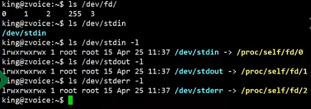
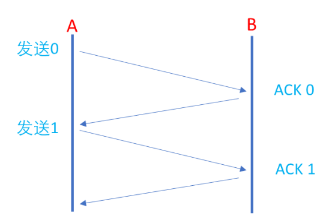
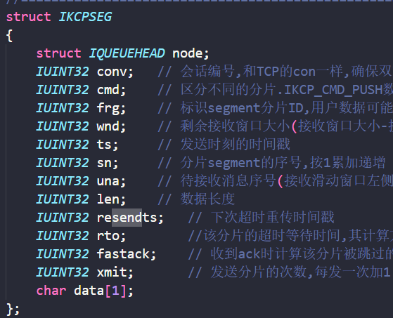
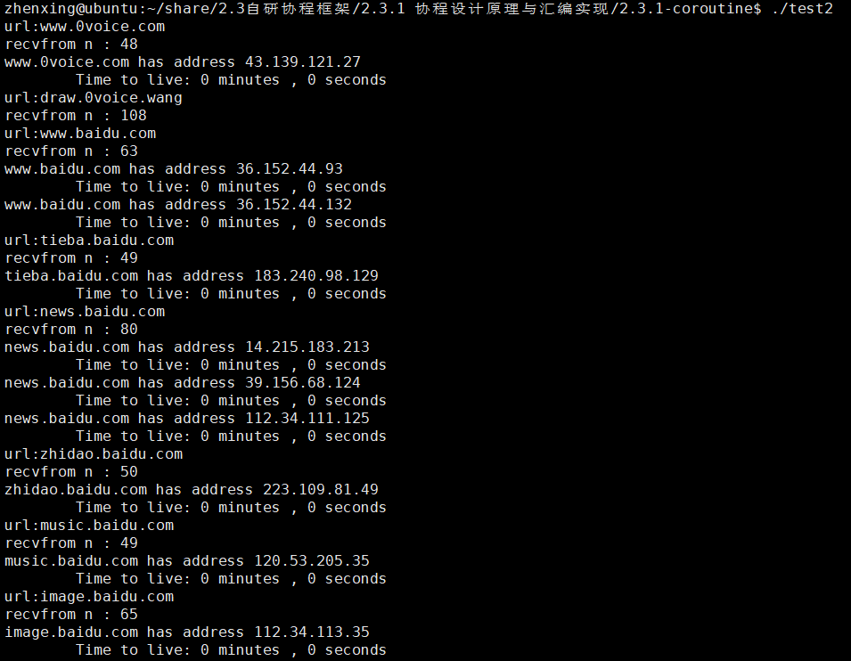
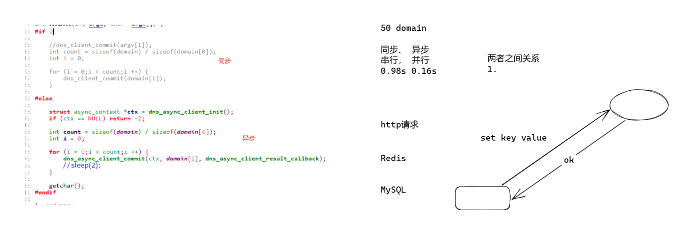
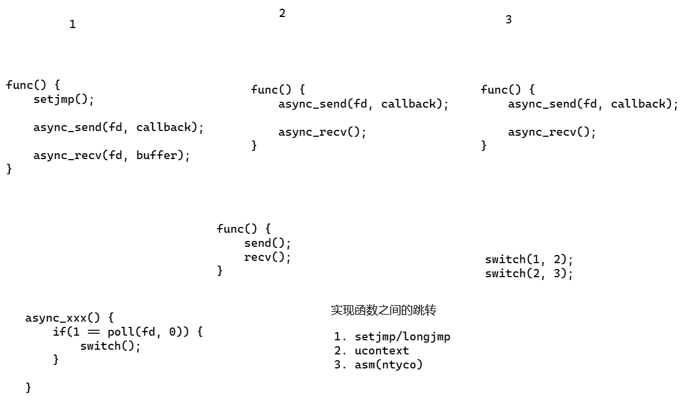

# 0_前言

> ### **课上能不能直接写到简历**
>
> 1. 项目做到上线
>
> 2. 如何写？
>    	a. 名字自行命名。
>    	b. 用课上的技术，解决现实的具体。
>
>    
>
>    按照这个说法就是：
>
>    > 比如的训练集有很多数据图片，我就可以做图床
>    > 我要存一些我的pdf，论文什么的就可以做kv存储
>
>  ==**简单来说就是高一点使用价值出来**==


---


# 2.1 网络编程


## 2.1.1 网络IO与IO多路复用

### 一、引入

> 1. 使用微信的时候，发送文字，发送视频，发送语音，与网络io什么关系
> 2. 抖音的视频资源，如何到达你的ApP。
> 3. github/gitlab，git clone,为什么能够到达本地
> 4. 共享电动车能够开锁。
> 5. 通过手机操作你家的空调，


```cpp
#include <iostream>
int main()
{
    return 0;
}
```

首先思考这个代码是怎么被执行的（编译）

```
gcc -o test main.c
```


==**客户端与服务端进行通信**==


---


### 二、初始化写一个TCP连接

> Linux与windows映射：samba
> 编写代码：代码编辑器（vscode)
> 编译：gcc/g++
> 运行：ubuntu
> 终端工具ssh:xshell，putty，crt


1.  **代码实现**

```c
#include <sys/socket.h>
#include <errno.h>
#include <netinet/in.h>

#include <stdio.h>
#include <string.h>
#include <unistd.h>

int main()
{
    int sockfd = socket(AF_INET, SOCK_STREAM, 0);
    struct sockaddr_in servaddr;
    memset(&servaddr, 0, sizeof(servaddr));
    servaddr.sin_family = AF_INET;
    servaddr.sin_addr.s_addr = htonl(INADDR_ANY); // 监听所有接口——0.0.0.0
    servaddr.sin_port = htons(4646);              // 监听端口4646，0-1023端口为系统保留端口
    if (-1 == bind(sockfd, (struct sockaddr *)&servaddr, sizeof(servaddr)))
    {
        printf("bind error: %s\n", strerror(errno));
        return -1;
    }

    listen(sockfd, 10); // 监听队列长度为10
    getchar(); // 等待用户输入以便查看结果
    
    return 0;
}
```


---


2. **性能查看**

- **正常启动**


```bash
zhenxing@ubuntu:~/share/advanced/2.1.1网络IO与IO多路复用$ netstat -anop | grep 4646
(Not all processes could be identified, non-owned process info
 will not be shown, you would have to be root to see it all.)
tcp        0      0 0.0.0.0:4646            0.0.0.0:*               LISTEN      1699/tcp         off (0.00/0/0)

```


- **同时查看两个的时候：**


会有端口被占用的情况发生。


- **网络调试助手创建连接**

  


连接成功


---


3. **具体的代码解析如下：**

> **1.`socket()` - 创建通信端点**
>
> ```c
> int sockfd = socket(AF_INET, SOCK_STREAM, 0);
> ```
>
> **作用**：创建一个用于网络通信的套接字（类似文件描述符），是后续所有操作的基础。
>
> **参数详解**
>
> - **`AF_INET`**：指定使用IPv4协议族（Address Family）。其他常见值如 `AF_INET6`（IPv6）、`AF_UNIX`（本地通信）。
> - **`SOCK_STREAM`**：指定使用面向连接的TCP协议。特点是有序、可靠、双向字节流。若使用UDP则为 `SOCK_DGRAM`。
> - **`0`**：自动选择协议类型。对于TCP，等价于 `IPPROTO_TCP`；UDP则为 `IPPROTO_UDP`。
>
> **返回值**
>
> - **成功**：返回非负整数，即套接字描述符（类似文件句柄）。
> - **失败**：返回-1，错误码存储在 `errno`中（可通过 `perror`打印）。
>
> **类比**：就像安装了一部电话机，但尚未插线（未绑定地址）或开机（未监听）。
>
> **2. `memset()` - 内存初始化**
>
> ```c
> memset(&serveraddr, 0, sizeof(struct sockaddr_in));
> ```
>
> **作用**：将 `serveraddr`结构体的所有字节置为0，避免残留数据干扰后续操作。
>
> **关键性**：网络编程中结构体可能存在填充字节，未清零可能导致 `bind()`失败。
>
> **参数**
>
> - **目标地址**：`&serveraddr`。
> - **填充值**：`0`（全部字节置0）。
> - **长度**：`sizeof(struct sockaddr_in)`（确保覆盖整个结构体）。
>
> **3. `bind()` - 绑定套接字与地址**
>
> ```c
> bind(sockfd, (struct sockaddr *)&serveraddr, sizeof(struct sockaddr));
> ```
>
> **作用**：将套接字关联到特定的IP地址和端口，使客户端能通过该地址访问服务。
>
> **参数解析**
>
> - **`sockfd`**：由 `socket()`返回的描述符。
> - **`(struct sockaddr *)&serveraddr`**：将 `sockaddr_in`强制转换为通用地址结构体 `sockaddr`（历史原因，需统一接口）。
> - **`sizeof(struct sockaddr)`**：地址结构体的大小。此处有潜在问题（应使用 `sizeof(serveraddr)`）。
>
> **地址结构体字段**
>
> - **`sin_family`**：必须与 `socket()`的地址族一致（此处为 `AF_INET`）。
> - **`sin_addr.s_addr`**：IP地址（`INADDR_ANY`表示监听所有本地网卡）。
> - **`sin_port`**：端口号（需用 `htons()`转换为网络字节序）。
>
> **常见错误**
>
> - **`EADDRINUSE`**：端口被占用。
> - **`EACCES`**：绑定到特权端口（<1024）无root权限。
>
> **类比**：为电话机分配电话号码（IP+端口），允许他人拨打。
>
> **4. `listen()` - 开启监听模式**
>
> ```c
> listen(sockfd, 10);
> ```
>
> **作用**：将套接字设置为被动模式，准备接受客户端的连接请求。
>
> **参数详解**
>
> - **`sockfd`**：已绑定地址的套接字。
> - **`10`**：内核维护的未完成连接队列的最大长度（实际值可能被系统调整，如Linux默认为128）。
>
> **队列类型**
>
> - **未完成队列（SYN队列）**：客户端发送SYN后处于 `SYN_RCVD`状态。
> - **已完成队列（ACCEPT队列）**：已完成三次握手，等待 `accept()`取出。
>
> **返回值**：成功返回0，失败返回-1（需检查错误）。
>
> **类比**：电话机开机并设置为响铃模式，等待来电。
>
> **5. `getchar()` - 阻塞程序退出**
>
> ```c
> getchar(); // 等待用户输入
> ```
>
> **作用**：防止程序立即结束，保持服务器运行以便测试。
>
> **实际应用**：真实服务器应使用事件循环（如 `while(1)` + `accept()`）持续处理请求。
>
> **潜在问题**：此处仅为演示，无实际连接处理逻辑。


---


### 三、添加接收功能

> **前面有一些注意事项**
>
> 1. 端口被绑定以后，不能再次被绑定。
> 2. 执行listen，可以通过netstat看到io的状态。
> 3. 进入listen可以被连接，并且会产生新连接状态。
> 4. io与tcp连接


```c
struct sockaddr_in clientaddr;
    socklen_t len = sizeof(clientaddr);

    // 当我们运行代码的时候首先会阻塞在这个地方，而不是阻塞在下面的getchar();
    printf("accepting...\n");
    int clientfd = accept(sockfd, (struct sockaddr *)&clientaddr, &len);

    printf("Accept finished!\n");
    printf("[Sockfd:%d, Clientfd:%d]\n", sockfd, clientfd);

    char buffer[1024];
    memset(buffer, 0, sizeof(buffer));

    // 接下来会阻塞在recv函数上，等待客户端发送数据
    printf("Recv data...\n");
    int count = recv(clientfd, buffer, 1024, 0);
    printf("-recv count: %d\n", count);
    printf("-recv data: %s\n", buffer);

    count = send(clientfd, "Hello, client!", 15, 0);
    printf("-send count: %d\n", count);
    printf("-send data: Hello, client!\n");

```


---


这部分就是最简单的tcp的连接和发送信息的流程：

> 简单解析一下这部分的话
>
>  **1.`struct sockaddr_in clientaddr`**
>
> - **作用**：定义一个IPv4地址结构体，用于存储**客户端**的连接信息（IP和端口）。
> - 关键字段：
>   - `sin_family`：地址族（自动填充为 `AF_INET`）。
>   - `sin_port`：客户端的端口号（网络字节序）。
>   - `sin_addr`：客户端的IP地址（可通过 `inet_ntoa()`转换为字符串）。
>
> ---
>
> **2. `socklen_t len = sizeof(clientaddr)`**
>
> - **作用**：声明一个变量表示地址结构体的大小，供 `accept()`函数使用。
> - **传递方式**：必须传递指针（`&len`），因为 `accept()`可能修改此值以反映实际写入的地址大小。
>
> ---
>
> **3. `accept()` - 接受客户端连接**
>
> ```c
> int clientfd = accept(sockfd, (struct sockaddr *)&clientaddr, &len);
> ```
>
> - **作用**：从监听队列中取出一个已完成的连接，并返回一个新的套接字描述符（`clientfd`）。
> - 参数详解：
>   - **`sockfd`**：监听套接字（由 `socket()`创建并通过 `bind()`+`listen()`启用）。
>   - **`(struct sockaddr *)&clientaddr`**：存储客户端地址信息的结构体（需强制类型转换）。
>   - **`&len`**：输入时为地址结构体大小，输出时为实际写入的地址大小。
>
> - 返回值：
>   - **成功**：返回一个新的套接字描述符（`clientfd`），用于与客户端通信。
>   - **失败**：返回-1（需检查 `errno`）。
> - **阻塞机制**：若监听队列中没有已完成的连接，`accept()`会阻塞直到有客户端连接。
> - **类比**：电话接线员从等待队列中接听一个来电，并为该通话分配专用线路（`clientfd`）。
>
> ---
>
> **4. `recv` 函数深度解析**
>
> ```c
> int count = recv(clientfd, buffer, 128, 0);
> ```
>
> **函数作用**
>
> - 从已连接的套接字（`clientfd`）接收数据，将数据存入 `buffer`。
> - **类比**：类似于从水管（连接）中读取水流（数据）。
>
> ---
>
> **参数详解**
>
> |    参数    |                             说明                             |
> | :--------: | :----------------------------------------------------------: |
> | `clientfd` |           已连接的套接字描述符（由 `accept` 返回）           |
> |  `buffer`  |                     存储接收数据的缓冲区                     |
> |   `128`    |                  缓冲区最大容量（避免溢出）                  |
> |    `0`     | 标志位（常见选项：`MSG_WAITALL`阻塞收满数据，`MSG_DONTWAIT`非阻塞） |
>
> ---
>
> **返回值意义**
>
> |  返回值  |                   含义                    |
> | :------: | :---------------------------------------: |
> | **`>0`** | 实际接收的字节数（可能小于请求的128字节） |
> | **`0`**  |    对方已关闭连接（需关闭 `clientfd`）    |
> | **`-1`** |          出错（需检查 `errno`）           |


---


这边的连接运行没有问题：


但是就是不支持多客户端的连接


---


### 四、添加循环调用多个客户端

这边用最简单的方式来做

```c
#elif 1
    while(1)
    {
        printf("accepting...\n");
        clientfd = accept(sockfd, (struct sockaddr *)&clientaddr, &len);
        printf("Accept finished!\n");
        printf("[Sockfd:%d, Clientfd:%d]\n", sockfd, clientfd);

        char buffer[1024];
        memset(buffer, 0, sizeof(buffer));

        // 接下来会阻塞在recv函数上，等待客户端发送数据
        printf("Recv data...\n");
        int count = recv(clientfd, buffer, 1024, 0);
        if (count <= 0)
        {
            printf("Client disconnected or error occurred.\n");
            break;
        }
        printf("-recv count: %d\n", count);
        printf("-recv data: %s\n", buffer);

        count = send(clientfd, "Hello, client!", 15, 0);
        printf("-send count: %d\n", count);
        printf("-send data: Hello, client!\n");
    }

#endif
```


> 在TCP连接模型中，客户端连接请求（connect）和服务器的`accept()`是两个独立的过程，你的代码中循环处理连接的方式是关键。让我详细解释流程和概念：
>
> ### 核心概念
>
> 1. **连接队列**：
>    - 当客户端发起连接时（`connect()`），服务器内核会完成三次握手
>    - 完成握手的连接会进入**已完成连接队列**（代码中`listen(sockfd, 10)`设置队列长度为10）
>    - 此时连接已建立，但尚未被应用程序处理
> 2. **`accept()`的作用**：
>    - 从已完成队列中取出一个连接
>    - 返回新的套接字(`clientfd`)用于与客户端通信
>    - **不是**创建新连接，而是"取出"已建立的连接
>
> ### 你的代码流程
>
> ```
> while(1) {
>     // 阻塞点1：等待新连接到来
>     clientfd = accept(...);  // 步骤A：从队列取连接
>     
>     // 阻塞点2：等待该连接发数据
>     recv(clientfd, ...);     // 步骤B：处理具体连接
>     send(clientfd, ...);
> }
> ```
>
> ### 工作场景模拟
>
> 假设有两个客户端（ClientA, ClientB）同时连接：
>
> 1. **时序场景**：
>
>    ```
>    时刻0: ClientA连接 -> 进入队列
>    时刻1: accept()取出ClientA
>    时刻2: 执行到recv()阻塞（等待ClientA发数据）
>    
>    时刻3: ClientB连接 -> 进入队列
>    （此时recv仍在阻塞，但ClientB的连接已在队列中）
>    
>    时刻4: ClientA发送数据 -> recv()返回
>    时刻5: send()响应后循环回到accept()
>    时刻6: accept()立即取出ClientB
>    ```
>
> 2. **关键观察**：
>
>    - **连接成功与accept分离**：ClientB在时刻3已完成连接，即使此时服务器卡在`recv`
>    - **队列的作用**：ClientB的连接被暂存在内核队列中（最长存放10个连接）
>    - **非阻塞处理**：服务器代码在`recv`阻塞时，仍能接收新连接（只是暂不处理）
>
> ### 为什么不会丢失连接
>
> ```mermaid
> graph TD
>     subgraph 内核空间
>         Queue[已完成连接队列 max=10]
>     end
>     
>     subgraph 用户空间
>         accept -->|取出连接| Queue
>         recv -->|操作连接| clientfd
>     end
>     
>     Client1 -->|connect| Queue
>     Client2 -->|connect| Queue
>     Client3 -->|connect| Queue
> ```
>
> - 只要队列未满（<10个连接），新连接都能立即成功
> - `accept()`只是从队列取连接，不参与建立连接的过程
> - 当阻塞在`recv`时，内核仍在独立维护连接队列
>
> ### 关键结论
>
> 1. **连接建立不依赖`accept()`**：客户端`connect()`成功时，连接已在内核中建立
> 2. **`accept()`本质是出队操作**：从内核管理的队列取出已建立连接
> 3. **阻塞位置的影响：**
>    - 阻塞在`accept()`：说明队列空（无新连接）
>    - 阻塞在`recv()`：连接已建立但等待数据（此时队列可继续收新连接）
> 4. **队列满时的行为**：当队列满时（已有10个完成连接），新连接会被拒绝


### 五、多线程方式解决上述难点

```cc
#elif 1
    while(1)
    {
        printf("accepting...\n");
        clientfd = accept(sockfd, (struct sockaddr *)&clientaddr, &len);
        printf("Accept finished!\n");
        printf("[Sockfd:%d, Clientfd:%d]\n", sockfd, clientfd);

        pthread_t thread_id;
        if (pthread_create(&thread_id, NULL, client_thread, &clientfd) != 0)
        {
            printf("Failed to create thread: %s\n", strerror(errno));
            close(clientfd);
            continue; // 如果线程创建失败，继续等待下一个连接
        }
        
    }
```

多线程部分代码

```c
void *client_thread(void *arg)
{
    int clientfd = *(int *)arg; // 从参数中获取客户端文件描述符

    char buffer[1024];
    memset(buffer, 0, sizeof(buffer));

    while (1)
    {
        // 接下来会阻塞在recv函数上，等待客户端发送数据
        printf("[Clientfd:%d]-Recving data...\n", clientfd);
        int count = recv(clientfd, buffer, 1024, 0);
        if (count <= 0)
        {
            printf("Client disconnected or error occurred.\n");
            close(clientfd); // 关闭客户端连接
            printf("[Clientfd:%d]-Connection closed.\n", clientfd);
            pthread_exit(NULL); // 退出线程
        }
        printf("[Clientfd:%d]-recv count: %d\n", clientfd, count);
        printf("[Clientfd:%d]-recv data: %s\n", clientfd, buffer);

        count = send(clientfd, "Hello, client!", 15, 0);
        printf("[Clientfd:%d]-send count: %d\n",clientfd, count);
        printf("[Clientfd:%d]-send data: Hello, client!\n",clientfd);
    }
}
```


---


## 2.1.2 事件驱动reactor的原理与实现

### 一、不使用多线程

首先明确一下  我们的fd的话，一开始的时候是被占用的：

**linux中的很多操作都是通过==fd==实现的**





> **需要实现的目标：**
>
> 1. select/poll/epoll
> 2. reactor.c


首先我们要分析为什么不使用多线程的方法。

> 创建多线程的话，假设一个线程消耗8M内存，有1w个客户端同时进行连接，我们消耗的缓冲区就已经是80G了，这显然是不可以接受的!

那我们可以使用一个线程的方式来解决问题吗？

==可以！使用select、poll、epoll！==


---

### 二、使用select方法

> 网络IO
>
> 1. accept --> listenfd
> 2. recv/send --> clientfd、
>
> 我们的代码也就是要按照这样的方法来写


代码实现

```c
#elif 1 // select方法
    // @param maxfd: 设置内部循环的最大fd编号
    // @param rset: fd_set 本质是 1024 位的位图，用来标志这个io是否可读
    // @param wset: fd_set，用来标志这个io是否可写
    // @param eset: fd_set，用来标志这个io是否可读
    // @param timeout: 超时控制
    // *int nready = select(maxfd, rset, wset,eset,timeout)这个函数需要五个参数

    fd_set rfds, rset;
    FD_ZERO(&rfds);
    FD_SET(sockfd, &rfds);

    int maxfd = sockfd; // 最大文件描述符
    while (1)
    {
        rset = rfds;                                             // rset是rfds的副本，select会修改rset，所以每次循环都需要重新赋值
        // nready表示有多少个文件描述符就绪, +1是因为select的第一个参数是最大文件描述符加1
        // select会阻塞，直到有文件描述符就绪或者超时
        // timeout参数为NULL表示无限等待，直到有文件描述符就绪
        printf("Waiting for select...\n");
        int nready = select(maxfd + 1, &rset, NULL, NULL, NULL);
        if (FD_ISSET(sockfd, &rset))
        {
            struct sockaddr_in clientaddr;
            socklen_t len = sizeof(clientaddr);
            memset(&clientaddr, 0, len); // 清空客户端地址结构体

            int clientfd = accept(sockfd, (struct sockaddr *)&clientaddr, &len);

            FD_SET(clientfd, &rfds);
            printf("New connection accepted: [Sockfd:%d, Clientfd:%d]\n", sockfd, clientfd);

            if (maxfd < clientfd)
                maxfd = clientfd;
        }

        int i = 0;
        for (i = sockfd + 1; i <= maxfd; ++i)
        {
            if (FD_ISSET(i, &rset))
            {
                char buffer[1024] = {0};
                int count = recv(i, buffer, 1024, 0);
                if (count == 0)
                {
                    // 客户端断开连接
                    printf("Clientfd:%d disconnected\n", i);
                    // !不关闭事件会一直循环循环
                    // close(i);
                    FD_CLR(i, &rfds);
                    close(i);

                    continue;
                }
                send(i, buffer, count, 0);
                printf("Clientfd %d\ncount: %d\nbuffer: %s\n", i, count, buffer);
            }
        }
    }
```


==**注意select方法仅适用于兼容性要求高的场景。**==

> select():
>
> 1. connect, select返回

> select()的缺点是什么：
>
> 1. 参数量五个很多
> 2. 每次都需要把待检测的io集合rset完全拷贝进内核
> 3. 对io的数量是有限制的。

> 性能缺陷分析：
>
> 1. io集合rset完全拷贝
> 2. io需要从头到尾遍历


---


### 三、使用poll方法

* 其实简单讲讲就是poll和select函数并没有区别，只是两者的接口不一样。


**==其实写法跟select几乎一样！！！！==**


```c
#elif 1
    // poll方法
    struct pollfd fds[1024] = {0};

    fds[sockfd].fd = sockfd;
    fds[sockfd].events = POLLIN;
    int maxfd = sockfd;
    while (1)
    {
        int nready = poll(fds, maxfd + 1, -1);
        if (fds[sockfd].revents & POLLIN)
        {
            struct sockaddr_in clientaddr;
            socklen_t len = sizeof(clientaddr);
            int clientfd = accept(sockfd, (struct sockaddr *)&clientaddr, &len);

            printf("New connection accepted: [Sockfd:%d, Clientfd:%d]\n", sockfd, clientfd);
            fds[clientfd].fd = clientfd;
            fds[clientfd].events = POLLIN;

            maxfd = clientfd;
        }
        int i = 0;
        for (i = sockfd + 1; i <= maxfd; ++i)
        {
            if (fds[i].revents & POLLIN)
            {
                char buffer[1024] = {0};
                int count = recv(i, buffer, 1024, 0);
                if (count == 0)
                {
                    printf("Clientfd:%d disconnected\n", i);
                    // !不关闭事件会一直循环循环
                    fds[i].fd = -1;
                    fds[i].events = 0;
                    close(i);

                    continue;
                }
                send(i, buffer, count, 0);
                printf("clientfd: %d\ncount: %d\nbuffer: %s\n", i, count, buffer);
            }
        }
    }
```

c

> ### poll 系统调用详解
>
> poll 是 Linux/Unix 系统中实现 I/O 多路复用的一种机制，用于同时监控多个文件描述符的状态变化，尤其适合网络编程中处理多连接场景。
>
> #### poll 的核心数据结构
>
> #### `struct pollfd`
>
> ```c
> #include <poll.h>
> 
> struct pollfd {
>     int   fd;         // 要监控的文件描述符
>     short events;     // 请求监控的事件（位掩码）
>     short revents;    // 实际发生的事件（位掩码）
> };
> ```
>
> 
>
> #### 核心函数
>
> #### `poll()` 函数
>
> ```c
> int poll(struct pollfd *fds, nfds_t nfds, int timeout);
> ```
>
> 参数说明：
>
> - `cfds`: `struct pollfd` 数组指针
> - `nfds`: 数组中文件描述符的数量
> - `timeout`: 超时时间（毫秒）
>   - `-1`：永久阻塞直到事件发生
>   - `0`：立即返回（非阻塞）
>   - `>0`：等待指定毫秒数
>
> 返回值：
>
> - `>0`：就绪的文件描述符数量
> - `0`：超时
> - `-1`：出错（errno 被设置）
>
> #### 事件标志位
>
> | 事件标志  |             描述              |
> | :-------: | :---------------------------: |
> |  POLLIN   | 有数据可读（包括新连接到来）  |
> |  POLLPRI  |  紧急数据可读（如带外数据）   |
> |  POLLOUT  |         可以写入数据          |
> | POLLRDHUP | 对端关闭连接（Linux 2.6.17+） |
> |  POLLERR  |           发生错误            |
> |  POLLHUP  |           对端挂断            |
> | POLLNVAL  |       文件描述符未打开        |


---


### 四、使用epoll方法


**简单来说epoll使得linux开始被用为服务器！！！！**

```c
#elif 1
    // 使用epoll方法
    // create只要参数不为0和负即可
    int epfd = epoll_create(1);

    struct epoll_event ev;
    ev.events = EPOLLIN;
    ev.data.fd = sockfd;
    epoll_ctl(epfd, EPOLL_CTL_ADD, sockfd, &ev);  // 将sockfd添加到epoll中
    printf("Epoll created and sockfd added!\n");
    printf("Epollfd: %d\n", epfd);
    printf("Sockfd: %d\n", sockfd);
    printf("Waiting for connections...\n");

    struct epoll_event events[1024] = {0};
    while (1)
    {
        int nready = epoll_wait(epfd, events, 1024, -1);
        int i = 0;
        for (i = 0; i < nready; ++i)
        {
            int connfd = events[i].data.fd;
            if (sockfd == connfd)
            {
                struct sockaddr_in clientaddr;
                socklen_t len = sizeof(clientaddr);

                int clientfd = accept(sockfd, (struct sockaddr *)&clientaddr, &len);
                printf("New connection accepted: [Sockfd:%d, Clientfd:%d]\n", sockfd, clientfd);

                ev.events = EPOLLIN;
                ev.data.fd = clientfd;
                epoll_ctl(epfd, EPOLL_CTL_ADD, clientfd, &ev);

                printf("sockfd: %d\n", clientfd);
            }
            else if (events[i].events & EPOLLIN)
            {
                char buffer[128] = {0};
                int count = recv(connfd, buffer, 128, 0);
                if (count == 0)
                {
                    printf("Clientfd:%d disconnected\n", connfd);
                    // !不关闭事件会一直循环循环

                    epoll_ctl(epfd, EPOLL_CTL_DEL, connfd, NULL);// 从epoll中删除事件
                    close(connfd);

                    continue;
                }
                send(connfd, buffer, count, 0);
                printf("[Clientfd: %d, Count: %d]\nbuffer: %s\n", connfd, count, buffer);
            }
        }
    }
```


> ==**相比较select而言，对于大并发优势在哪里？**==
>
> 1. 100w
> 2. 积累起来的，就绪就ok了
> 3. 就绪是我们需要事件.


> 下面是一些关键函数的注解：
>
> 1. `epoll_create`
>
> ```c
> int epfd = epoll_create(1);
> ```
>
> * **作用** ：创建epoll实例
> * **参数** ：
>   * `size`：历史遗留参数，现代内核忽略该值（>0即可）
>
> * **返回值** ：epoll文件描述符
>
> 2. `epoll_ctl`
>
> ```c
> epoll_ctl(epfd, EPOLL_CTL_ADD, sockfd, &ev);
> ```
>
> * **作用** ：管理epoll监控列表
> * **参数** ：
>   * `op`：操作类型（ADD/MOD/DEL）
>   * `fd`：待监控的文件描述符
>   * `event`：关联的事件结构体
>
> * **事件类型** ：
>   * `EPOLLIN`：数据可读
>   * `EPOLLOUT`：数据可写
>   * `EPOLLET`：边缘触发模式
>
>
> 3. `epoll_wait`
>
> ```c
> int nready = epoll_wait(epfd, events, 1024, -1);
> ```
>
> * **作用** ：等待事件发生
> * **参数** ：
> * `events`：输出参数，存储就绪事件
> * `maxevents`：最大接收事件数（需<=数组长度）
> * `timeout`：-1表示阻塞等待，0立即返回，>0超时时间(ms)
>


> ==**接下来是个重点！！！**==
>
> **水平触发(LT)**以及**边沿触发(ET)**的区别：
>
> - 水平触发LT：只要IO之中还有数据，他就会一直接收，一直触发，然后分条直到全部输出为止
>
>   - > 输入：01234567890123456789
>     >
>     > 输出：count: 15
>     >
>     > ​	    buffer: 012345678901234
>     >
>     > ​	    count: 5
>     >
>     > ​	    buffer: 56789
>
> - 边沿触发ET：即使IO中还有数据，他也只会读一次，剩下的数据存着，直到下一次有数据输入进来（==理论上可能越积越多==）
>
>   - > 输入：01234567890123456789
>     >
>     > 输出：count: 15
>     >
>     > ​	    buffer: 012345678901234
>     >
>     > 输入：111012345
>     >
>     > 输出：count: 14
>     >
>     > ​	    buffer: 56789111012345
>
> - 具体应用场景来说：
>
>   - **LT触发的话**：在tcp的情况下可以设置接受的长度；甚至可以==分包==——截成不同的段落。
>
>   
>
>   -  **ET触发的用处**：
>
>   
>
>   - 如果要将一个大小为2g的文件一口度进来，就这样用while  全都进来。


### 五、思考

==思考！！！==

#### 0. 整集和就绪集合用什么数据结构存储


> # epoll 数据结构详解
>
> ## 1. epoll 的整集存储数据结构
>
> epoll 使用高效的内核数据结构来管理监控的文件描述符集合：
>
> ### **红黑树 (Red-Black Tree)**
>
> - **存储位置**：内核空间
>
> - **数据结构类型**：自平衡二叉搜索树
>
> - **存储内容：**
>
>   ```
>   struct epitem {
>       struct rb_node rbn;       // 红黑树节点
>       struct list_head rdllink; // 就绪队列链表节点
>       struct epoll_filefd ffd; // 包含 fd + file* 指针
>       struct eventpoll *ep;     // 所属的epoll实例
>       struct epoll_event event; // 监控的事件设置
>       // ...
>   };
>   ```
>
> - 特性：
>
>   - O(log n) 时间复杂度的插入、删除和查找操作
>   - 通过 `epoll_ctl(EPOLL_CTL_ADD)` 添加的新描述符都会插入红黑树
>   - 每个 fd 对应一个 epitem 节点
>
> ### **设计优势**
>
> 1. **高效查询**：对数时间复杂度确保万级连接下仍保持高效
> 2. **内核管理**：所有操作在内核完成，避免用户-内核空间频繁拷贝
> 3. **动态扩展**：连接数不受限制，只受系统文件描述符上限约束
>
> 
>
> ## 2. epoll 的就绪集合数据结构
>
> ### **就绪队列 (Ready List)**
>
> - **数据结构**：双向链表 (linked list)
>
> - 内核实现：
>
>   ```
>   struct eventpoll {
>       // 红黑树根节点（存储所有监控项）
>       struct rb_root_cached rbr;
>       
>       // 就绪队列（双向链表）
>       struct list_head rdllist;
>       
>       // 等待队列
>       wait_queue_head_t wq;
>       // ...
>   };
>   ```
>
> - 工作流程：
>
>   1. 当事件发生时，内核将对应的 epitem 加入 `rdllist`
>   2. `epoll_wait()` 调用时，内核拷贝就绪事件的 `epoll_event` 结构到用户空间
>   3. 就绪链表被清空，等待新事件
>
> ### **用户空间获取接口**
>
> ```
> int epoll_wait(int epfd, struct epoll_event *events,
>                int maxevents, int timeout);
> ```
>
> - `events`：用户预分配的缓冲区
> - `maxevents`：每次调用最多返回的事件数量
> - 关键特点：
>   - 仅拷贝就绪事件（**O(1) 事件复杂度**）
>   - 返回实际就绪事件数 `n`，用户只需遍历 `0` 到 `n-1`
>   - 避免全量扫描（select/poll 的 O(n) 问题）
>
> ## 三种 I/O 多路复用对比
>
> | 特性                 | select           | poll             | epoll            |
> | -------------------- | ---------------- | ---------------- | ---------------- |
> | **整集数据结构**     | 固定大小位图     | 结构体数组       | 内核红黑树       |
> | **整集最大数量**     | FD_SETSIZE(1024) | 无硬限制         | 系统文件限制     |
> | **就绪集合存储**     | 覆写传入的位图   | 修改结构体数组   | 内核维护链表     |
> | **就绪集合获取方式** | 遍历检查位图     | 遍历检查结构体   | 内核填充用户数组 |
> | **时间复杂度**       | O(n)             | O(n)             | O(1)事件通知     |
> | **内存拷贝**         | 每次调用完整拷贝 | 每次调用完整拷贝 | 仅就绪事件拷贝   |
> | **事件注册**         | 每次调用重新设置 | 每次调用重新设置 | 一次注册永久有效 |
>
> ## epoll 底层原理深度解析
>
> ### 1. 高效的就绪通知机制
>
> - **回调函数注册**：通过 `epoll_ctl()` 向内核注册回调
> - 事件触发流程：
>   1. 网卡收到数据 → 触发硬件中断
>   2. 内核网络栈处理数据包
>   3. 将对应 socket 标记为就绪
>   4. 调用 `ep_poll_callback()` 将 epitem 加入就绪队列
>   5. 唤醒等待的进程
>
> ### 2. 水平触发 (LT) vs 边沿触发 (ET)
>
> ```
> // ET模式设置
> ev.events = EPOLLIN | EPOLLET;
> ```
>
> - **水平触发 (默认)**：
>   - 只要缓冲区有数据，每次 `epoll_wait()` 都返回
>   - 类似 select/poll 行为
> - **边沿触发**：
>   - 仅在状态变化时通知一次
>   - 需要一次性读取所有数据（循环读取直到 EAGAIN）
>   - 减少系统调用次数，提高性能
>
> ### 3. epoll 系统调用分析
>
> | 系统调用     | 操作                 | 内核操作                        |
> | ------------ | -------------------- | ------------------------------- |
> | epoll_create | 创建 epoll 实例      | 分配 eventpoll 结构体           |
> | epoll_ctl    | 添加/修改/删除监控项 | 操作红黑树 (插入/删除/更新节点) |
> | epoll_wait   | 等待事件             | 检查就绪队列，无事件则休眠      |
>
> epoll 的这种设计使其能够轻松应对 C10K 甚至 C100K 问题，是现代高性能网络服务器的基石。


#### 1. **`epoll` 是否使用 `mmap`？**

> **答案：是的，`epoll` 内部使用 `mmap` 优化性能。**
>
> 具体机制：
>
> - **内核与用户空间的数据传递**：
>   `epoll` 通过 `mmap` 在内核和用户空间之间**共享内存**，避免数据从内核态到用户态的拷贝（零拷贝技术）。当调用 `epoll_wait` 时，事件数据直接通过 `mmap` 映射的内存区域返回，无需传统 `read`/`write` 的多次拷贝。
> - **性能优势**：
>   这种设计使得 `epoll` 在处理大量文件描述符时效率远高于 `select`/`poll`，尤其是高并发场景（如百万级连接）。
>
> 验证方法：
>
> - 通过
>
>   ```
>   strace
>   ```
>
>   跟踪系统调用可以发现，
>
>   ```
>   epoll_create
>   ```
>
>   时会调用
>
>   ```
>   mmap
>   ```
>
>   ```bash
>   strace -e trace=mmap,epoll_create your_program
>   ```
>


> ------
>


#### 2. **`epoll` 是否线程安全？**

> **答案：`epoll` 本身是线程安全的，但需要合理使用。**
>
> 详细说明：
>
> - **线程安全的操作**：
>
>   - **`epoll_wait`**：
>     多个线程可以同时调用 `epoll_wait` 监听同一个 `epoll` 实例，内核会保证事件分发的原子性。
>   - **`epoll_ctl`**：
>     对同一个 `epoll` 实例的修改操作（如 `EPOLL_CTL_ADD`/`EPOLL_CTL_MOD`/`EPOLL_CTL_DEL`）需要**加锁保护**，否则可能引发竞争条件。
>
> - **非线程安全的场景**：
>   如果多个线程同时对同一个文件描述符调用 `epoll_ctl`，可能导致不可预知的行为。例如：
>
>   ```c
>   // 线程1：添加事件
>   epoll_ctl(epfd, EPOLL_CTL_ADD, fd, &ev);
>     
>   // 线程2：删除事件
>   epoll_ctl(epfd, EPOLL_CTL_DEL, fd, NULL);
>   ```
>
>   若不加锁，这两个操作可能在内核中交错执行，导致状态不一致。
>
> 正确用法：
>
> - 使用互斥锁保护 `epoll_ctl`：
>
>   ```c
>   pthread_mutex_lock(&epoll_mutex);
>   epoll_ctl(epfd, EPOLL_CTL_ADD, fd, &ev);
>   pthread_mutex_unlock(&epoll_mutex);
>   ```
>
> - **每个线程使用独立的 `epoll` 实例**：
>   如果不需要共享事件监听，可以为每个线程创建独立的 `epoll` 实例，避免竞争。
>
> ------
>
> 代码示例：线程安全的 `epoll` 使用
>
> ```c
> #include <pthread.h>
> #include <sys/epoll.h>
> 
> #define MAX_EVENTS 10
> 
> int epfd;
> pthread_mutex_t epoll_mutex = PTHREAD_MUTEX_INITIALIZER;
> 
> void* thread_func(void* arg) {
>     struct epoll_event events[MAX_EVENTS];
>     while (1) {
>         // 多个线程可以安全调用 epoll_wait
>         int nready = epoll_wait(epfd, events, MAX_EVENTS, -1);
>         for (int i = 0; i < nready; i++) {
>             // 处理事件
>         }
>     }
> }
> 
> void add_fd_to_epoll(int fd) {
>     struct epoll_event ev;
>     ev.events = EPOLLIN;
>     ev.data.fd = fd;
>     
>     // 加锁保护 epoll_ctl
>     pthread_mutex_lock(&epoll_mutex);
>     epoll_ctl(epfd, EPOLL_CTL_ADD, fd, &ev);
>     pthread_mutex_unlock(&epoll_mutex);
> }
> ```
>


> ------
>


#### 3. **补充：ET 模式下的线程安全问题**

> - **边沿触发（ET）模式**：
>   在 ET 模式下，必须确保一次性读取所有数据（循环调用 `recv` 直到返回 `EAGAIN`）。如果多个线程处理同一个 socket 的 `EPOLLIN` 事件，可能导致数据被多个线程重复处理。此时需要设计合理的任务分发机制（如 Leader-Follower 模式）。
> - **非阻塞 IO 的必要性**：
>   ET 模式下必须将 socket 设为非阻塞模式，否则 `recv` 可能阻塞整个线程，影响其他事件处理。
>
> ------
>
> 4. `epoll`实现方式划分
>
> 
>
> 分析：
>
> - 左边明显是**面向IO**的写法
>   - 会越来越累赘，越来越复杂
> - 右边是**面向事件**的写法
>   - 这样的写法本质上就是==reactor==
>   - 核心的作用相较于面向IO的写法


#### 4. 我们目前的做法是否有什么不妥：


==**简单来说我们还是io事件触发**==

> io的生命周期，无数多个事件组成
>
> 而作为一个server端，7*24工作
>
> ​	**我们应该是针对事件 --> 执行不同的回调函数**
>
> 这样更符合我们的业务开发 --> 这就是==**reactor模式！！！**==
>
> 
>
> 当有事情发生的时候！！！
>
> 我们就调用某个回调函数！！！
>
> 由**IO管理**变为**事件管理**


---


## 2.1.3服务器百万并发实现

### 一、引入

> **我们今天的主要任务：**
>
> 1. 实现reactor模式
> 2. 实现百万并发


> 简单来说就是：
>
> **不同的io事件，对应不同的回调**
>
> 1. register
> 2. callback
>
> 


### 二、reactor代码实现


---


# 2.2 网络原理


## 2.2.1 PosixAPI与网络协议栈

> ### 本小节任务
>
> 1. 将Posix API内容学完
> 2. 完善之前的reactor代码完善——优化1048576的代码


简单来说对于客户端和服务端而言：

==**大概是用到了这些的API**==


### 一、建立连接

####  **1. socket():**

> 1. 插座，插，座
> 2. 网络io，<fd-tcp control block>
>    - 分配fd, int  (使用bitmap的算法，简单来说1，2，3依次检测，置1被用，置0可用)
>    - tcb, alloc()
>
> ---
>
> - 用法：
>
>   ```
>   int socket(int domain, int type, int protocol);
>   ```
>
>   - `domain`: AF_INET(IPv4) / AF_INET6(IPv6)
>   - `type`: SOCK_STREAM(TCP) / SOCK_DGRAM(UDP)
>
> - 原理：
>
>   - 内核创建套接字结构体（包含发送/接收缓冲区、协议族、状态等）
>   - 返回文件描述符映射到内核套接字对象
>
> - 注意事项：
>
>   - 需检查返回值（-1表示失败）
>   - 创建后默认是阻塞模式


---


#### **2. bind(fd , );**

> a. ip, port
>
> 简单来说就是把这里的ip端口地址绑定到前面的tcb上面去（其实就是一个set的过程）
>
> ==所以我们的客户端可以不设置，当我们进行connect时，如果没有指定端口的话，他会自动选择一个端口，所以在客户端这里可以不设置==
>
> ---
>
> - 用法：
>
>   ```
>   int bind(int sockfd, const struct sockaddr *addr, socklen_t addrlen);
>   ```
>
>   - 服务器必须绑定，客户端通常由系统自动分配端口
>
> - 原理：
>
>   - 将IP+Port与套接字关联
>   - 内核检查端口可用性（避免端口冲突）
>
> - 注意事项：
>
>   - 使用`setsockopt(sockfd, SOL_SOCKET, SO_REUSEADDR)`解决`TIME_WAIT`状态端口占用问题


---


#### 3. listen();

> a. tcb->status = TCP_STATUS_LISTEN;
> b.     tcb->syn_queue
> 	tcb->accept_queue
>
> 这个函数简单来说是要将tcb状态设置为listen状态；
>
> 同时在这里分配一个全连接队列和一个半连接队列
>
> ---
>
> - 用法：
>
>   ```
>   int listen(int sockfd, int backlog);
>   ```
>
>   - backlog：已完成连接队列的最大长度（Linux中实际是未完成+已完成队列）
>   - ==**listen(fd, backlog);**==
>     1. **syn队列**
>     2. **syn + accept队列总长度，未分配fd的tcb的数量**
>     3. **accept队列长度**——==增加建立连接的吞吐量==
>
> - 原理：
>
>   - 将主动套接字转为被动套接字
>   - 创建SYN队列（半连接队列）和ACCEPT队列（全连接队列）
>
> - 注意事项：
>
>   - Linux内核2.2后backlog参数含义变化（实际值由`/proc/sys/net/core/somaxconn`决定）


---


#### 4. 三次握手


> **具体我们的三次握手是做了什么呢？**
>
> 结合这个tcp包来看，
>
> 1. 当我们解析了以太网、ip头以及tcp头之后的话，如果解析到了我们的syn位被置了1且seqnum这个有值（1234只是举例可以随机）
>    接收正确的话就会**创建一个半连接  SYN队列（半连接队列）**
> 2. 第二次的话就会令ack=1，acknum置为seqnum+1，
>    同时syn置1，seqnum随机
> 3. 第三次就会返回ack = 1，acknum为之前的seqnum+1.
>    三次握手成功之后就会**创建一个全连接队列  ACCEPT队列（全连接队列）**
>
> ==不丢失、不重复、不乱序==
>
> 


> ==**三次握手的函数有那些？**==
>
> 1. listen()的backlog本身类似饭店吃饭排队取的号
> 2. 当我们监听到listen信息的时候就会先产生半连接==syn==
> 3. 三次握手之后才会使全连接accept()
>
> 准确来说三次握手对于服务端是在内核协议栈中自动实现的，不受我们的控制，自动实现


> ==**DDOS攻击！！**==
>
> 1. 本质上就是靠tcp连接只进行第一步，就是对面服务端linsten到了第一个数据。之后的话，客户端不给他第三次回复


> 部分问题：
>
> **a. tcp连接的生命周期，从什么时候开始？**
>
> ​	真实起点：
>
> - **客户端视角**：从调用`connect()`发送SYN包开始（进入`SYN_SENT`状态）
>
> - **服务端视角**：从收到SYN包并创建半连接条目开始（进入`SYN_RECV`状态）
>
> - ##### **关键澄清**
>
>   - IP地址绑定发生在`bind()`阶段（早于连接建立）
>   - 真正的TCP连接生命周期始于三次握手，终结于四次挥手
>
> - ==**listen(fd, backlog);**==
>
>   1. **syn队列**
>   2. **syn + accept队列总长度，未分配fd的tcb的数量**
>   3. **accept队列长度**——==增加建立连接的吞吐量==
>
> - ==**accept();**==
>
>   1. 分配fd 
>   2. fd --> tcb 
>   3. 默认是使用阻塞模式的
>
> 
>
> ---
>
> **b. 如果使用ET（边沿触发）模式的话，如何接收所有信息**
>
> ```c
> while(1) {
>     fd = accept();
>     if (fd == -1) {
>         break;
>     }
> }
> ```
>
> 
>
> ---
>
> 
>
> **c. 第三握手数据包，如何从半连接队列查找匹配的节点**
>
> **半连接队列核心机制**
>
> - **数据结构**：内核维护`syn_table`哈希表存储半连接请求
>
> - **条目结构**
>
>  ```c
> struct inet_request_sock {
>     __be32          ir_rmt_addr;  // 客户端IP
>     __be16          ir_rmt_port;  // 客户端端口
>     __u32           ir_mark;      // 路由标记
>     struct tcp_options_received rx_opt; // 接收的TCP选项
>     u32             snt_isn;      // 服务端初始序列号
> };
>  ```
>
> ##### **ACK包匹配流程**
>
> 1. 提取五元组：
>
>   - 源IP、源端口、目的IP、目的端口、协议类型
>
> 2. 哈希快速定位：
>
>   ```c
> hash = inet_ehashfn(saddr, sport, daddr, dport);
> bucket = hash & (INET_LHTABLE_SIZE - 1);
>   ```
>
> 3. 序列号验证：
>
>   - 检查ACK号是否等于`irs->snt_isn + 1`
>
> 4. 状态升级：
>
>   - 将条目从`syn_table`迁移到`ehash`（已连接哈希表）
>
> 
>
> ---
>
> **c. syn泛洪**
>
> **攻击原理**
>
> ```mermaid
> graph LR
>    A[攻击者] -->|发送伪造源IP的SYN包| B(服务端半连接队列)
>    B -->|队列满| C[拒绝新连接]
> ```
>
> ##### **内核防御机制**
>
> 1. **SYN Cookies**
>
>   - **触发条件**：当半连接队列超过`net.ipv4.tcp_max_syn_backlog`
>
>   - 算法流程：
>
>     ```markdown
>     cookie = hash(saddr, daddr, sport, dport) + 序列号计数器
>     将cookie编码到SYN+ACK的初始序列号中
>     ```
>
>   - 验证过程：
>
>     ```c
>     if (ack_seq - 1 == hash(saddr, sport, daddr, dport) + counter)
>         accept connection
>     ```
>
> 2. **动态队列调整**
>
>   - 参数控制：
>
>     ```bash
>     sysctl -w net.ipv4.tcp_syncookies=2 # 始终启用
>     sysctl -w net.ipv4.tcp_synack_retries=3 # 减少重试次数
>     ```
>
> **系统监控命令**
>
> ```bash
> # 查看半连接队列溢出
> netstat -s | grep "SYNs to LISTEN"
> # 查看当前SYN_RECV状态连接
> ss -n state syn-recv
> ```
>
> 


---


### **二、传输数据**


首先理解一下啊，**Application：应用** 以及 **kernel：协议栈**


> **Q: 怎么知道我们有没有发送成功？**
>
> **A:** 有的人会说只要我们的send和write返回-1就代表我们发送成功了，但其实我们的返回-1只代表我们的数据从Application发送到了协议栈上去kernel，存到了我们之前有提到的**wmem**中去。
>
> **很有可能我们从application发送了多次，但是kernel只发送一次**
>
> ---
>
> 这里还会有个概念MTU(最大传输单元)
>
> 这里代表我们的最大传输的大小，例如我们这里可能就是1500
>
> 可以修改：
>
> ```bash
> sudo ifconfig eth0 mtu 1460
> ```
>
> 


> **Q：这两种写法有区别吗？**
>
> ```c
> recv(fd, buffer, 1000,0);
> 
> for(i = 0;i < 10;i ++) {
> recv(fd, buffer, 100, 0);
> }
> ```
>
> **A：其实区别不大，正常情况下的话**
>
> 只要我们的缓冲区开辟的够大的话是不影响的


> **Q：传输过程中是怎么保证传输稳定性的**
>
> **A：**通过慢启动和拥塞控制
>
> 
>
> 简单来说是前后都会发送seqnum和acknum，每次通讯的话，两者都是要这样的实现的。
>
> ---
>
> 以下是关于TCP中五个关键机制的详细解释：
>
> 1. **慢启动（Slow Start）**
>
> - **目的**：在连接初始阶段或从拥塞中恢复时，逐步探索可用带宽，避免突然大量数据导致网络拥塞。
> - 机制：
>   - **拥塞窗口（cwnd）**：初始值为1个MSS（最大报文段大小），每收到一个ACK，cwnd指数增长（如翻倍）。
>   - **阈值（ssthresh）**：当cwnd达到阈值时，进入**拥塞避免**阶段，转为线性增长（每RTT增加1个MSS）。
>   - **触发条件**：连接建立时或发生超时重传后启动。
> - **示例**：初始cwnd=1，发送1个报文；收到ACK后cwnd=2，发送2个报文；再收到2个ACK后cwnd=4，依此类推。
>
> ------
>
> 2. **拥塞控制（Congestion Control）**
>
> - **目标**：根据网络拥塞动态调整发送速率，避免网络过载。
> - 核心算法：
>   - **慢启动与拥塞避免**：如上所述，cwnd先指数增长，超过ssthresh后线性增长。
>   - 快速重传与快速恢复（如Reno算法）：
>     - **快速重传**：收到3次重复ACK时立即重传丢失报文，而非等待超时。
>     - **快速恢复**：cwnd减半后进入拥塞避免阶段，避免重置为1。
>   - 处理策略：
>     - **超时重传**：触发慢启动，ssthresh设为当前cwnd的一半，cwnd重置为1。
>     - **重复ACK**：触发快速恢复，cwnd减半后线性增长。
>
> ------
>
> 3. **滑动窗口（Sliding Window）**
>
> - **作用**：实现流量控制，确保发送方不会淹没接收方，同时提高传输效率。
> - 机制：
>   - **接收窗口（rwnd）**：接收方通告剩余缓冲区大小，发送方据此调整发送量。
>   - **实际窗口**：取拥塞窗口（cwnd）和接收窗口（rwnd）的较小值。
>   - **滑动操作**：已确认的数据从窗口中移除，后续数据填入，形成“滑动”效果。
> - **示例**：若窗口大小为4，发送方连续发送4个报文；收到第1个ACK后，窗口滑动，发送第5个报文。
>
> ------
>
> 4. **延迟确认（Delayed Acknowledgment）**
>
> - **目的**：减少ACK报文数量，提升网络效率。
> - 机制：
>   - **延迟策略**：接收方等待最多200ms，或积累两个报文后发送一个ACK。
>   - **捎带确认**：若有数据需发送，ACK可附带在数据包中。
>     **比如12345接收到125  提示需要发送3**
> - **权衡**：可能增加发送方的RTT估计值，导致超时重传延迟，但减少了小包开销。
>
> ------
>
> 5. **超时重传（Retransmission Timeout, RTO）**
>
> - **功能**：确保数据可靠传输，通过重传丢失或损坏的报文。
> - 机制：
>   - **RTT动态计算**：使用加权平均（如EWMA）平滑RTT波动，计算RTO。
>   - **超时处理**：若ACK未在RTO内到达，重传数据并触发拥塞控制（如cwnd重置为1）。
>   - **与快速重传对比**：超时重传反应更强烈（认为严重拥塞），而快速重传基于重复ACK，恢复更快。
>
> ------
>
> **协同工作机制**
>
> - **启动阶段**：慢启动快速提升速率，拥塞控制防止过载。
> - **流量控制**：滑动窗口基于接收方能力调整，拥塞窗口基于网络状况调整。
> - **效率优化**：延迟确认减少ACK数量，滑动窗口允许批量发送；超时重传和快速重传保障可靠性。
> - **拥塞响应**：丢包时，超时重传触发慢启动，重复ACK触发快速恢复，平衡响应速度与网络稳定性。
>
> 通过上述机制，TCP在保证可靠性的同时，最大限度利用网络资源，适应动态变化的网络环境。


---


### **三、 断开连接**

> 四次挥手
>
> 1. 主动方
> 2. 被动方


> ==**close**==
>
> fd --> 回收
> fin --> 
>
> ---
>
> - **用法**：`int close(int sockfd);`
> - 原理：
>   - 发送FIN包（TCP四次挥手）
>   - 释放内核资源（缓冲区、套接字结构体）
> - 注意事项：
>   - 可能产生`TIME_WAIT`状态（服务端需处理地址重用）
>   - shutdown()可半关闭连接，但只会让代码越来越复杂


> **四次挥手流程**
>
> 假设客户端主动关闭连接，服务器被动关闭：
>
> 1. **客户端发送FIN** → 进入`FIN_WAIT_1`状态。  
> 2. **服务器回复ACK** → 进入`CLOSE_WAIT`状态，客户端收到后进入`FIN_WAIT_2`。  
> 3. **服务器发送FIN** → 进入`LAST_ACK`状态。  
> 4. **客户端回复ACK** → 进入`TIME_WAIT`状态，服务器关闭后客户端等待`2MSL`后关闭。
>
> ---
>
> **各状态详解**
>
> 1. **FIN_WAIT_1（客户端）**
>
> - **触发条件**：客户端调用`close()`发送`FIN`报文，请求终止连接。
> - **行为**：  
>   - 等待服务器的`ACK`确认。  
>   - 如果直接收到服务器的`FIN`（极少数情况），说明双方同时关闭，会直接进入`CLOSING`状态。
> - **比喻**：你（客户端）对朋友（服务器）说：“我要挂电话了”（FIN），然后等待对方回应。
>
> ---
>
> 2. **CLOSE_WAIT（服务器）**
>
> - **触发条件**：服务器收到客户端的`FIN`后，回复`ACK`确认。
> - **行为**：  
>   - 服务器进入半关闭状态，仍可向客户端发送未完成的数据。  
>   - 当服务器也准备关闭时，发送自己的`FIN`报文，进入`LAST_ACK`状态。
> - **常见问题**：如果服务器长时间处于`CLOSE_WAIT`，通常是代码未正确调用`close()`，导致资源泄露。  
> - **比喻**：朋友回复：“好的，我知道你要挂了”（ACK），但继续说完自己的话。
>
> ---
>
> 3. **FIN_WAIT_2（客户端）**
>
> - **触发条件**：客户端收到服务器的`ACK`后进入此状态。
> - **行为**：  
>   - 等待服务器发送`FIN`报文。  
>   - 如果长时间未收到`FIN`，可能触发超时（根据系统配置）。
> - **比喻**：你等待朋友说完最后一句话（FIN），然后才能完全挂断。
>
> ---
>
> 4. **LAST_ACK（服务器）**
>
> - **触发条件**：服务器发送自己的`FIN`报文，请求终止连接。
> - **行为**：  
>   - 等待客户端的最后一个`ACK`确认。  
>   - 收到`ACK`后，服务器立即关闭连接。
> - **比喻**：朋友说：“我也说完了，挂了吧”（FIN），等待你的最终确认。
>
> ---
>
> 5. **TIME_WAIT（客户端）**
>
> - **触发条件**：客户端发送最后一个`ACK`后进入此状态。
> - **行为**：  
>   - 等待`2MSL`（Maximum Segment Lifetime，报文最大生存时间，通常30秒~2分钟）。  
>   - **两个作用**：  
>     - 确保最后一个`ACK`能到达服务器（若丢失，服务器会重发`FIN`，客户端可重发`ACK`）。  
>     - 让旧连接的报文在网络中消失，避免与新连接冲突。
> - **常见问题**：高并发服务器可能出现大量`TIME_WAIT`，可通过调整内核参数（如`net.ipv4.tcp_tw_reuse`）优化。  
> - **比喻**：你挂断电话后等2分钟再离开，防止朋友没听到你的“再见”（ACK），需要重说一遍。
>
> ---
>
> 6. **CLOSED（双方）**
>
> - **最终状态**：客户端等待`2MSL`超时后关闭，服务器收到最后一个`ACK`后关闭。
>
> ---
>
> **状态转换图**
>
> ```
> 客户端流程：
> ESTABLISHED → FIN_WAIT_1 → FIN_WAIT_2 → TIME_WAIT → CLOSED
> 
> 服务器流程：
> ESTABLISHED → CLOSE_WAIT → LAST_ACK → CLOSED
> ```
>
> ---
>
> **关键问题解答**
>
> **1. 为什么是四次挥手？**  
>
> - **两次挥手不够**：一方发送`FIN`后，另一方可能还有数据要发送（半关闭状态）。  
> - **三次挥手不够**：双方`FIN`的发送和确认需要独立处理，确保双向数据流完全关闭。
>
> **2. TIME_WAIT为什么需要等待2MSL？**  
>
> - **确保最后一个ACK到达**：若服务器未收到`ACK`，会重发`FIN`，客户端在`2MSL`内可处理。  
> - **清除旧连接报文**：防止相同四元组（源IP、源端口、目标IP、目标端口）的新连接收到旧数据。
>
> **3. 如果最后一次ACK丢失怎么办？**  
>
> - 服务器会重传`FIN`，客户端在`TIME_WAIT`状态下收到后，会**重发ACK**并重置`2MSL`计时器。
>
> ---
>
> **实际场景案例**
>
> #### **场景1：服务器出现大量CLOSE_WAIT**
>
> - **原因**：服务器未正确调用`close()`关闭连接。  
> - **解决**：检查代码逻辑，确保`FIN`被正确发送（如Java中`socket.close()`）。
>
> #### **场景2：客户端TIME_WAIT过多**
>
> - **影响**：占用端口资源，可能导致新连接无法建立。  
> - **优化**：  
>   - 开启`tcp_tw_reuse`（允许复用TIME_WAIT连接）。  
>   - 调整`MSL`时间（需谨慎）。
>
> ---
>
> **总结**
>
> 四次挥手通过四个步骤和状态转换，确保了TCP连接的可靠关闭：
>
> 1. **双向确认**：双方各自发送`FIN`和`ACK`，确认数据完整。  
> 2. **半关闭设计**：允许一方在收到`FIN`后继续发送剩余数据。  
> 3. **容错机制**：`TIME_WAIT`状态防止最后一个`ACK`丢失或旧数据干扰。
>
> 这个过程就像一场礼貌的道别，双方确认彼此都说完话后，才真正挂断电话 📞！


> **Q1: ack没有收到，先收到fin**
>
> 
>
> 这种情况的话会走上面的链路，最终的结果是一样的
>
> 
>
> **Q2: 双方同时调用close**
>
> 也就是双方一起发送FIN
>
> 
>
> 这个地方其实可以解释==服务端无缘无故出现大量的time_wait==，但却没有进入关闭。主要可能就是双方一起调用了close的问题


> **Q3: 如果我们不区分客户服务段，如果我们同时发送三次握手会怎么样？什么时候会发生？**
>
> **A:** 用TCP实现P2P  **简单来说就是点对点  没有服务器，客户端的概念**
>
> ```c
> fd = socket();
> localaddr, remoteaddr;
> bind(8000); // optional
> connect();
> ```
>
> 
>
> 
>
> 


### 四、实现p2p的点对点通讯

> 1. 实现pear to pear通讯
> 2. 创建两台虚拟机


---


## 2.2.2 UDP的可靠传输协议QUIC

> **整体大纲：**
>
> 1. UDP如何做到可靠性传输
> 2. UDP与TCP，我们如何选择
> 3. UDP如何可靠，KCP协议在哪些方面有优势
> 4. KCP协议精讲（重点讲解），项目
> 5. QUIC时代是否已经到来


### 一、如何做到可靠性传输

> 1. ACK机制
> 2. 重传机制重传策略
>    
>    **这边就是需要明确一下RTT的定义——RTT=T1+T2**
> 3. 序号机制3 2 1 --> 2 3 1  **(TCP本身协议中就有需要、UDP需要在应用层中来加)**
> 4. 重排机制2 3 1 --> 3 2 1
> 5. 窗口机制、流量控制（**UDP没有流控所以可以攻**击）、带宽有限


---


### 二、UDP和TCP

#### 2.1 UDP和TCP我们如何选择呢


1. **报文传输（如UDP协议）**
   - 特点：每次发送的数据都是一个**独立的数据包**（Datagram）
   - 发送函数：`sendto("hello")` → 直接发送完整报文
   - 接收函数：`recvfrom()` 每次接收一个完整报文
   - 示例：发送两次`sendto("hello")`和`sendto("darren")`，接收端会收到两次独立报文："hello"和"darren"
2. **字节流传输（如TCP协议）**
   - 特点：数据像水管里的流水，**没有明确边界**
   - 发送函数：`send("hello")` → 数据进入发送缓冲区
   - 接收函数：`recv()` 可能一次读取多个发送操作的数据
   - 示例：连续发送两次`send("hello")`和`send("darren")`，接收端可能一次性收到"hellodarren"


---


#### 2.2 TCP和UDP格式对比


---


#### 2.3 ARQ协议(Automatic Repeat-reQuest)

> ARQ协议(AutomaticRepeat-reQuest)，即自动重传请求，**是传输层的错误纠正协议之一。**
> 它通过使用确认和超时两个机制，在不可靠的网络上实现可靠的信息传输。
> ARQ协议主要有3种模式：
> (1）即停等式(stop-and-wait)ARQ
> (2）回退n帧(go-back-n)ARQ,
> (3）选择性重传(selectiverepeat)ARQ

##### 2.3.1 ARQ协议-停等式(stop-and-wait)（==一般不用==）

停等协议的工作原理如下:
1、发送方对接收方发送数据包，然后等待接收方回复ACK并且开始计时。
2、在等待过程中，发送方停止发送新的数据包。
3、当数据包没有成功被接收方接收，接收方不会发送ACK.这样发送方在等待一定时间后，重新发送数据包。
4、反复以上步骤直到收到从接收方发送的ACK.




##### 2.3.2 ARQ协议-回退n帧(go-back-n)


如上图所示，**序号为2的分组丢失因此分组2及之后的分组都将被重传。**
**总结：GBN采用的技术包括序号、累积确认、检验和以及计时/重传。**


##### 2.3.3 ARQ协议-选择重传(Selective-repeat)

**==kcp可靠传输 基于udp==**


**只重传没有确认的数据。**


---


#### 2.4 RTT和RTO

**RTO（RetransmissionTimeOut）**即重传超时时间。（**常见设置为两倍的RTT**）
**RTT(Round-TripTime)：**往返时延。表示从发送端发送数据开始，到发送端收到来自接收端的确认
(接收端收到数据后便立即发送确认），总共经历的时延。

|   **特性**   |        **RTT**         |            **RTO**            |
| :----------: | :--------------------: | :---------------------------: |
|   **目的**   |      测量网络延迟      |       控制重传等待时间        |
|  **动态性**  |   随网络状态实时变化   | 基于 RTT 动态计算（非固定值） |
| **影响场景** | TCP 拥塞控制、QoS 优化 |     重传效率、网络可靠性      |
|  **示例值**  |    40ms（图中示例）    |    通常为 RTT 的 1.5~2 倍     |


---


#### 2.5 流量控制

（1）发送方的速率与接收方的速率是不一定相等。
（2）如果缓存区满了发送方还在疯狂着发送数据，接收方只能把收到的数据包丢掉，大量的丢包会极大着浪费网络资源。
（3）对发送方发送速率的控制，称之为流量控制。

==**UDP要自己控制发送速率**              **tcp不用管**==


> **流量控制-如何控制？**
>
> 1. 接收方每次收到数据包，可以在发送确定报文的时候，同时告诉发送方自己的缓存区还剩余多少是空闲的。
> 2. 把缓存区的剩余大小称之为接收**窗口**大小，用变量win来表示接收**窗口**的大小。
> 3. 发送方收到之后，便会调整自己的发送速率，也就是调整自己发送窗口的大小
> 4. 当发送方收到接收窗口的大小为0时，发送方就会停止发送数据，防止出现大量丢包情况的发生。

> **发送方何时再继续发送数据？**
> 1.当接收方处理好数据，接受窗口win>0时，接收方发个通知报文去通知发送方。
> 2.当发送方收到接受窗口win=0时，这时发送方停止发送报文，并且同时开启一个定时器，每隔一段时间就发个测试报文去询问接收方，打听是否可以继续发送数据了。==**(图示方法)**==


> ==**流量控制-小结**==
>
> 1. 接收窗口的大小固定吗？
>    不是固定的，需要根据网络情况动态调整，丢包多的时候需要减小接收窗口。
> 2. 接收窗口越大越好吗？
>    接收窗口过大容易导致丢包，==（一口气大量数据进来的话，可能会服务器对ip进行封死）==
> 3. 发送窗口和接收窗口相等吗？
>    一般接收窗口>=发送窗口。
>
> 


---


#### 2.6 拥塞控制


拥塞控制和流量控制虽然采取的动作很相似，但拥塞控制与网络的拥堵情况相关联，而流量控制与接收方的缓存状态相关联。
**拥塞控制是根据丢包情况调整发送窗口，调整发送数据的速率。**

---


#### 2.7 UDP并发编程


---


### 三、 UDP如何可靠，KCP协议在哪些方面有优势

> **以10%-20%带宽浪费的代价换取了比 TCP快30%-40%的传输速度。**
>
> 
>
> **一、核心矛盾点解析**
>
> 用户的问题本质是：**为什么KCP协议声称比TCP快30%-40%，但在网络通畅时TCP的传输速率反而更高？**
> 关键在于理解两种协议的设计目标与适用场景的差异：
>
> |   **特性**   |             **TCP**              |            **KCP（基于UDP）**             |
> | :----------: | :------------------------------: | :---------------------------------------: |
> | **设计目标** | 可靠性优先（保证数据完整、有序） |       速度优先（容忍部分带宽浪费）        |
> | **适用场景** |  稳定网络环境（低丢包、低延迟）  | 高延迟/高丢包网络（如移动网络、跨国传输） |
> | **带宽效率** |        高（拥塞控制优化）        |         较低（主动重传导致冗余）          |
>
> ------
>
> **二、KCP为何更快？——牺牲带宽换速度**
>
> 1. **激进的重传策略**
>
> - **TCP**：采用保守的RTO（超时重传时间）计算，例如首次丢包后等待至少200ms重传，后续依次为2倍。
> - **KCP**：大幅缩短RTO（可设置为1.5倍），**快速重传**丢包数据，减少等待时间。
> - **代价**：频繁重传导致带宽浪费（图中提到的10%-20%）。
>
> 2. **无拥塞控制束缚**
>
> - **TCP**：通过滑动窗口和拥塞控制算法（如Cubic）**限制发送速率**，避免网络过载。
> - **KCP**：不严格限制发送速率，允许更**激进地占用带宽**，尤其在高丢包场景下优势明显。
> - **示例**：在30%丢包率的网络中，KCP可能通过快速重传保持高吞吐，而TCP会因频繁触发拥塞控制降低速率。
>
> 3. **精简的确认机制**
>
> - **TCP**：依赖ACK确认每个数据包，延迟敏感。
> - **KCP**：支持**选择性确认（SACK）** 和 **NACK（否定确认）**，可批量处理丢包信息，减少通信轮次。
>
> ------
>
> **三、为何网络通畅时TCP更快？——带宽利用率的反转**
>
> 1. **TCP的带宽压榨能力**
>
> - 在稳定网络中，TCP的拥塞控制算法会逐渐增大发送窗口，最终**占满可用带宽**。
> - 例如：TCP Cubic算法在无丢包时会指数级扩大窗口，达到物理带宽上限。
>
> 2. **KCP的冗余开销拖累**
>
> - 即使网络通畅，KCP仍会因以下原因浪费带宽：
>   - **预防性冗余**：为应对潜在丢包，可能主动发送重复数据。
>   - **控制报文占比高**：更频繁的ACK/NACK交互占用带宽。
> - **示例**：若物理带宽为100Mbps，TCP可用满100Mbps，而KCP因10%冗余实际有效带宽仅90Mbps。
>
> 3. **协议栈优化差异**
>
> - **TCP**：经过数十年优化，内核层实现效率极高（如TSO/GRO硬件加速）。
> - **KCP**：用户态实现，数据拷贝和协议处理开销较大，难以完全发挥硬件性能。
>
> ------
>
> **四、场景化对比（附表格说明）**
>
> |        **场景**         |       **TCP表现**        |         **KCP表现**          |         **关键原因**         |
> | :---------------------: | :----------------------: | :--------------------------: | :--------------------------: |
> | **网络稳定（0%丢包）**  |    速率高（占满带宽）    |     速率较低（冗余开销）     | TCP无冗余，KCP有固定带宽浪费 |
> |  **高丢包（>5%丢包）**  | 速率骤降（触发拥塞控制） | 速率较高（快速重传弥补丢包） |     KCP抗丢包能力强于TCP     |
> | **高延迟（RTT>200ms）** |  速率受限（窗口增长慢）  |   速率较高（激进发送策略）   |   KCP不严格依赖RTT计算窗口   |
>
> ------
>
> **五、技术选型建议**
>
> 1. **选择TCP的场景**：
>    - 需要最大化带宽利用率（如局域网内文件传输）
>    - 网络质量稳定（企业专线、光纤宽带）
>    - 对传输延迟不敏感（非实时系统）
> 2. **选择KCP的场景**：
>    - 高延迟/高丢包网络（4G/5G移动网络、卫星通信）
>    - 实时性要求高（游戏、视频会议）
>    - 可接受适度带宽浪费（如P2P加速、跨国传输）
>
> ------
>
> **六、总结**
>
> - **KCP的"快"**：本质是**用带宽换时间**，通过牺牲10%-20%带宽换取重传延迟的降低，在恶劣网络中表现优于TCP。
> - **TCP的"慢"**：并非绝对速度慢，而是在高丢包/高延迟场景下，其保守设计导致实际吞吐量下降。
> - **性能反转**：在网络通畅时，TCP的优化机制和零冗余特性使其反超KCP。理解这一矛盾，需结合具体网络条件评估协议选择。


#### 3.1 RTO翻倍vs不翻倍：

**TCP超时计算是RTOx2，这样连续丢三次包就变成RTOx8了，**十分恐怖，而KCP启动快速模式后不x2，只是x1.5（实验证明1.5这个值相对比较好），提高了传输速度。
以RTO=100ms为例：


> **这边UDP的优势的话**
>
> 主要是因为TCP的RTO增长是==写死在协议栈中的==，不能被随意改动，否则可能存在不兼容问题（除非将网络断开）
>
> 而使用UDP的话会可以自己设置倍率方便很多

简单来说——==KCP可以自定义重传策略！！！！==


#### 3.2 选择性重传vs全部重传：

TCP丢包时会全部重传从丢的那个包开始以后的数据，KCP是选择性重传，只重传真正丢失的数据包。

==以王者荣耀举例我们可以定制重传策略以及定制丢包策略==

简单来说就是可以丢弃例如两秒前的数据如果发送失败就不需要重发了，只重发当前需要的帧。


#### 3.3 快速重传 (跳过多少个包马上重传)

**（如果使用了快速重传，可以不考虑RTO）**：发送端发送了1,2,3,4,5几个包，然后收到远端的ACK:1,3,4,5，当收到ACK3时，KCP知道2被跳过1次，收到ACK4时，知道2被跳过了2次，此时可以认为2号丢失，不用等超时，直接重传2号包，大大改善了丢包时的传输速度。fastresend=2

> **这边存在带宽浪费问题**
>
> 如果我们只是纯属的慢一点了，待会就传过去了，但是还是默认丢失，直接重传
>
> 简单来说可能13425这样  2包可能是单纯满了  但是这样就会浪费带宽


#### 3.4 延迟ACKVS非延迟ACK：

TCP为了充分利用带宽，延迟发送ACK（NODELAY-针对发送的都没用），这样超时计算会算出较大RTT时间，延长了丢包时的判断过程。KCP的ACK是否延迟发送可以调节。

==但本质上来说的话，过多的ACK包的话也会浪费我们的带宽！！==


#### 3.5 UNA vs ACK+UNA:

ARQ模型响应有两种，UNA（此编号前所有包已收到，如TCP）和ACK（该编号包已收到），光用UNA将导致全部重传，光用ACK则丢失成本太高，以往协议都是二选其一，而KCP协议中，除去单独的ACK包外，所有包都有UNA信息。


#### 3.6 非退让流控：

KCP正常模式同TCP一样使用公平退让法则，即发送窗口大小由：

发送缓存大小、接收端剩余接收缓存大小、丢包退让及慢启动这四要素决定。但传送及时性要求很高的小数据时，可选择通过配置跳过后两步，仅用前两项来控制发送频率。

以牺牲部分公平性及带宽利用率之代价，换取了开着BT都能流畅传输的效果。


---


### 四、kcp代码测试

#### 4.1 KCP精讲-名词说明

> 用户数据：应用层发送的数据，如一张图片2Kb的数据
>
> - **MTU：**最大传输单元。即每次发送的最大数据，1500。包含头部为1500，实际使用sendto: 1400
> - **RTO：**RetransmissionTimeOut，重传超时时间。
> - **cwnd: **congestionwindow，拥塞窗口，表示发送方可发送多少个kCP数据包。与接收方窗口有关，与网络状况（拥塞控制）有关，与发送窗口大小有关。
> - **rwnd: **receiverwindow,接收方窗口大小，表示接收方还可接收多少个kCP数据包
> - **snd_queue: **待发送kCP数据包队列
> - snd_buf:
> - **snd_nxt:** 下一个即将发送的kcp数据包序列号
> - **snd_una: **下一个待确认的序列号，即是之前的包接收端都已经收到。


对于服务端而言如下：

```bash
zhenxing@ubuntu:~/share/2.2.3-udp-kcp-quic/build$ ./chat_server 0.0.0.0 10001
[ /home/zhenxing/share/2.2.3-udp-kcp-quic/udp_socket.cc : UdpSocket : 8 ] : addr: 0.0.0.0:10001 
[ /home/zhenxing/share/2.2.3-udp-kcp-quic/kcp_session.cc : KcpSession : 18 ] : addr: 127.0.0.1:25731 
[ /home/zhenxing/share/2.2.3-udp-kcp-quic/kcp_session.cc : KcpSession : 19 ] : kcp_opt.conv: 4012616776 
[ /home/zhenxing/share/2.2.3-udp-kcp-quic/kcp_session.cc : KcpSession : 20 ] : kcp_opt.is_server: 1 
[ /home/zhenxing/share/2.2.3-udp-kcp-quic/kcp_session.cc : KcpSession : 21 ] : kcp_opt.keep_alive_timeout:  5000 
[ /home/zhenxing/share/2.2.3-udp-kcp-quic/kcp_session.cc : KcpSession : 22 ] : kcp_opt.sndwnd: 32 
[ /home/zhenxing/share/2.2.3-udp-kcp-quic/kcp_session.cc : KcpSession : 23 ] : kcp_opt.rcvwnd: 128 
[ /home/zhenxing/share/2.2.3-udp-kcp-quic/kcp_session.cc : KcpSession : 24 ] : kcp_opt.nodelay: 0 
[ /home/zhenxing/share/2.2.3-udp-kcp-quic/kcp_session.cc : KcpSession : 25 ] : kcp_opt.resend: 0 
[ /home/zhenxing/share/2.2.3-udp-kcp-quic/kcp_session.cc : KcpSession : 26 ] : kcp_opt.nc: 0 

```


对于客户端而言如下：

```bash
zhenxing@ubuntu:~/share/2.2.3-udp-kcp-quic/build$ ./chat_client 127.0.0.1 10001
[ /home/zhenxing/share/2.2.3-udp-kcp-quic/chat_client.cc : main : 57 ] : conv =  4012616776 
[ /home/zhenxing/share/2.2.3-udp-kcp-quic/udp_socket.cc : UdpSocket : 8 ] : addr: 127.0.0.1:10001 
[ /home/zhenxing/share/2.2.3-udp-kcp-quic/kcp_session.cc : KcpSession : 18 ] : addr: 127.0.0.1:10001 
[ /home/zhenxing/share/2.2.3-udp-kcp-quic/kcp_session.cc : KcpSession : 19 ] : kcp_opt.conv: 4012616776 
[ /home/zhenxing/share/2.2.3-udp-kcp-quic/kcp_session.cc : KcpSession : 20 ] : kcp_opt.is_server: 0 
[ /home/zhenxing/share/2.2.3-udp-kcp-quic/kcp_session.cc : KcpSession : 21 ] : kcp_opt.keep_alive_timeout:  1000 
[ /home/zhenxing/share/2.2.3-udp-kcp-quic/kcp_session.cc : KcpSession : 22 ] : kcp_opt.sndwnd: 32 
[ /home/zhenxing/share/2.2.3-udp-kcp-quic/kcp_session.cc : KcpSession : 23 ] : kcp_opt.rcvwnd: 128 
[ /home/zhenxing/share/2.2.3-udp-kcp-quic/kcp_session.cc : KcpSession : 24 ] : kcp_opt.nodelay: 0 
[ /home/zhenxing/share/2.2.3-udp-kcp-quic/kcp_session.cc : KcpSession : 25 ] : kcp_opt.resend: 0 
[ /home/zhenxing/share/2.2.3-udp-kcp-quic/kcp_session.cc : KcpSession : 26 ] : kcp_opt.nc: 0 
user from [127.0.0.1:25731] join the ChatRoom!
user from [192.168.5.129:33099] join the ChatRoom!

```


#### 4.2 kcp使用方式


> ==**kcp聊天室流程**==
>
> 1. 创建KCP对象：ikcpcb *kcp = ikcp_create(conv,user);
>
> 2. 设置发送回调函数（如UDP的send函数）：kcp->output=udp_output;
>
>    真正发送数据需要调用sendto
>
> 3. 循环调用 update：ikcp_update(kcp,millisec); //在一个线程、定时器 5ms/10m做调度
>
> 4. 输入一个应用层数据包(如UDP收到的数据包）：ikcp_input(kcp,received_udp_packet,received_udp_size);
>
>    我们要使用recvfrom接收，然后扔到kcp里面做解析
>
> 5. 发送数据：ikcp_send(kcp1,buffer,8);用户层接口
>
> 6. 接收数据：hr=ikcp_recv(kcp2,buffer,10);用户层读取数据


> **==不同客户端如果生成相同id怎么办==**
>
> 1. 每个通道 客户端-服务端 kcp 是一一对应
>    conv由客户端产生，会不会导致一样的会话id?
>    确实有可能
>    uuid的算法 -生成唯一的conv id
>
> ==课上为了简单：客户端使用随机数产生的conv 会话id==
>
> 2.先使用http 向服务端请求 获取conv id  服务端总是会有办法的
> ==有的uuid可能不止四个字节！！！==


#### 4.3 kcp源码流程图


> 我们接收到的数据需要自己进行解包，recvfrom读取udp的数据，然后发送到kcp的对象内部，然后再内部组帧
>
> 同时支持流模式和报文发送模式


##### **4.3.1 整体架构与流程概览**

1. **核心模块划分**

- **数据接收逻辑**：处理UDP接收的数据包，解包并提交给应用层。
- **数据发送逻辑**：将应用层数据编码为KCP协议包，通过UDP发送。
- **双向交互**：通过**确认包（ACK）**实现发送端与接收端的动态反馈。

2. **关键函数与操作**

|   函数/操作    |                作用                |    所属逻辑     |
| :------------: | :--------------------------------: | :-------------: |
| `kcp_create()` | 创建KCP实例，初始化窗口、超时参数  | 发送/接收初始化 |
| `kcp_input()`  | 处理接收到的UDP数据包（协议解析）  |  数据接收逻辑   |
|  `kcp_recv()`  |    提取已排序的有效数据给应用层    |  数据接收逻辑   |
|  `kcp_send()`  |     将应用数据封装为KCP协议包      |  数据发送逻辑   |
| `kcp_update()` |    定时触发重传、窗口更新等事件    |  数据发送逻辑   |
|   `output()`   | 通过UDP发送KCP协议包（用户自定义） |  数据发送逻辑   |

------

##### 4.3.2数据接收逻辑详解

1. **流程步骤**

```plaintext
UDP收数据 → kcp_input() → 解包、更新确认 → kcp_recv() → 应用层
```

2. **核心机制解析**

- **`kcp_input()`**
  - **功能**：解析UDP数据包，提取KCP协议头（包含序列号、确认号、窗口信息等）。
  - 关键操作：
    1. **处理ACK**：根据接收到的确认号，更新发送端的已确认数据包列表。
    2. **处理数据包**：若为新的有效数据包，存入接收缓冲区，并生成ACK。
    3. **乱序处理**：若数据包非连续到达，暂存待后续排序（与TCP不同，KCP允许选择性确认）。
- **解包与更新确认**
  - **解包**：剥离KCP协议头，还原原始数据负载。
  - **更新发送确认**：通过`ikcp_ack_push`函数将ACK信息加入发送队列（后续通过`output()`发送）。
- **`kcp_recv()`**
  - **功能**：从接收缓冲区中提取连续且有序的数据提交给应用层。
  - **排序逻辑**：若缓冲区中存在序列号连续的数据块，立即提交；否则等待缺失包到达（类似TCP的滑动窗口）。

3. **示例场景**

- **正常接收**：收到序列号5的包且之前已收到1-4，则立即提交给应用层。
- **乱序接收**：收到序列号7的包，但6未到达，则暂存缓冲区，等待重传请求触发。

------

##### 4.3.3 数据发送逻辑详解

1. **流程步骤**

```plaintext
应用层 → kcp_send() → 编包 → kcp_update() → 调用output() → UDP发送
```

2. **核心机制解析**

- **`kcp_send()`**
  - **功能**：将应用层数据分割为适合传输的KCP数据包（根据MTU大小）。
  - **协议封装**：添加KCP协议头（含序列号、时间戳、窗口信息），加入发送缓冲区。
- **编包与发送确认包**
  - **动态编包**：每次`kcp_update()`触发时，检查发送缓冲区中的待发数据。
  - **确认包发送**：若存在待发送的ACK信息（来自接收逻辑），优先封装为ACK包发送。
- **`kcp_update()`**
  - **定时驱动**：通常由用户设置定时器（如每10ms调用一次）。
  - **关键操作：**
    1. **超时重传**：检查未确认的数据包是否超过RTO（超时重传时间），触发重传。
    2. **窗口控制**：根据接收端反馈的窗口大小，调整发送速率。
    3. **流量控制**：若网络拥塞（如连续丢包），减少发送窗口，避免恶化网络状态。
- **`output()`**
  - **用户自定义实现**：将KCP协议包通过UDP发送（如调用`sendto()`函数）。
  - **带宽优化**：合并多个小包为单个UDP包发送（减少协议头开销）。

3. **示例场景**

- **首次发送**：应用调用`kcp_send(data)`，数据被分割为序列号1-3的包，加入发送队列。
- **触发重传**：若序列号2的包在RTO时间内未收到ACK，`kcp_update()`会将其重新加入发送队列。
- **动态窗口调整**：接收端反馈窗口已满，发送端暂停发送新数据，直至窗口更新。


---


#### 4.4 kcp的配置模式

1. **工作模式：**intikcp_nodelay(ikcpcb *kcp,int nodelay,int interval,int resend,int nc)

   - nodelay：是否启用nodelay模式，0不启用；1启用。

   - interval：协议内部工作的interval，单位毫秒，比如10ms或者20ms

   - resend：快速重传模式，默认o关闭，可以设置2(2次AcK跨越将会直接重传)

   - nc：是否关闭流控，默认是0代表不关闭，1代表关闭。

     

   - 默认模式：ikcp_nodelay(kcp,0,10,0,0);

   - 普通模式：ikcp_nodelay(kcp,0,10,0,1);关闭流控等

   - 极速模式：ikcp_nodelay(kcp,2,10,2,1)，并且修改kcp1->rx_minrto=10；

     ​									kcp1->fastresend = 1;

     **==越急速越浪费带宽==**

2. **最大窗口：**intikcp_wndsize(ikcpcb *kcp,intsndwnd,intrcvwnd);
   该调用将会设置协议的最大发送窗口和最大接收窗口大小，默认为32，单位为包。

3. **最大传输单元：**intikcp_setmtu(ikcpcb*kcp,intmtu);
   kcp协议并不负责探测MTU，默认mtu是1400字节

4. **最小RTO：**不管是TCP还是KCP计算RTO时都有**最小RTO的限制**，即便计算出来RTO为40ms，由于默认的RT0是100ms，协议只有在100ms后才能检测到丢包，快速模式下为30ms，可以手动更改该值：kcp->rx_minrto=10;


---


#### ⭐4.5 kcp协议头


下面这几个是[4]中常用的指令

4

**1. conv（连接号）**

- **位置**：0-3字节
- **作用**：UDP本身是无连接的，`conv`字段用于标识客户端连接。类似于TCP的“虚拟连接”，确保数据包归属于同一会话。
- **应用场景**：服务端通过`conv`区分不同客户端的请求，实现多路复用。

------

**2. cmd（命令字）**

- **位置**：第4字节
- 作用：控制数据包类型，包含三种核心命令：
  - **IKCP_CMD_ACK**：确认包（Acknowledgment），告知对方已收到数据。
  - **IKCP_CMD_WASK**：接收窗口探测，主动询问接收方的剩余窗口大小。
  - **IKCP_CMD_WINS**：接收窗口通知，主动告知对方当前可用窗口大小。
- **协议特性**：通过命令字实现灵活的流量控制和可靠性机制，而非依赖底层协议。

------

**3. frg（分片标识）**

- **位置**：第5字节
- 作用：标识用户数据是否分片及分片顺序。
  - **报文模式**：分片序号递减（如3、2、1、0），接收方按顺序重组。
  - **流模式**：所有分片标记为0，适用于无需严格顺序的场景（如实时音视频）。
- **分片逻辑**：若用户数据超过单个包容量（1376字节），KCP自动分片发送。

------

**4. wnd（接收窗口大小）**

- **位置**：6-7字节
- **作用**：接收方当前可接收的数据量（单位：包）。发送方根据此值动态调整发送速率，避免拥塞。
- **流量控制**：类似TCP的滑动窗口，但KCP允许更灵活的窗口调整策略，减少延迟。

------

**5. ts（时间戳）**

- **位置**：8-11字节
- **作用**：记录数据包发送时间，用于计算RTT（往返时间）和判断超时重传。
  同时重传控制是1.5倍  例如下图一开始是200ms重传  第二次重传就是300ms
- **重传机制**：结合`sn`序列号，快速检测丢包并触发重传，优于TCP的延迟ACK机制。

------

**6. sn（序列号）**

- **位置**：12-15字节
- **作用**：唯一标识数据包的发送顺序，接收方按`sn`确认数据完整性。
- **协议特性**：KCP通过连续`sn`实现数据有序性，支持选择性重传（仅重传丢失的包）。


------

**7. una（下一个待接收序号）**

- **位置**：16-19字节
- **作用**：类似TCP的确认号（ACK），表示接收方期望收到的下一个包序号。例如，收到`sn=10`的包后，`una=11`。
- **快速确认**：通过`una`可批量确认此前所有包，减少ACK包数量，提升效率。

------

**8. len（数据长度）**

- **位置**：20-23字节
- **作用**：指示可选数据部分（`data`字段）的实际长度，最大为1376字节（总包大小1400字节 - 24字节头部）。
- **分片关联**：若数据被分片，每个分片的`len`为该分片的数据长度。

------

**9. data（用户数据）**

- **位置**：24字节之后
- **作用**：承载实际传输的数据。
- **分片规则**：数据总长度超过1376字节时，按`frg`字段分片发送，接收端重组。

---


---


#### 4.6 kcp数据发送过程


> 我们需要有个发送缓存区
>
> 例如上图中，对于包8而言，已经应答，可以删除；对于9没有应答需要超时重传；以及后面的第一次发送的包
>
> 上图中：==una来自对方，已经接受了那些确认了（下一个该发送9包）；nxt是本地下一个要发送什么==


****

> 这边有个小tips就是这个地方我们定义的结构体并不能直接memorycopy到我们的字节流当中，我们需要去写入，而且这个结构体当中很多参数并不在我们的协议中！！！
> ==要写字节流！！！所以数据类型跟协议不完全相同！！！==


==这边有个点就是一个udp包可以加多个应答包  其中有acklist来存储这个序列==


> **snd_wnd：**固定大小，默认32
> **rmt_wnd：**远端接收窗口大小，默认32
> **cwnd：**滑动窗口，可变，越小一次能发送的数据越小
>
> 发送速率的控制是：本质是根据滑动窗口，控制把数据从snd__queue加入到send_buf。
>
> 调用void ikcp_flush(ikcpcb*kcp)发送数据
>
> **IKCP_CMD_PUSH** 命令正常的数据
> **CMD_ACK**应答


---


#### 4.7 kcp接收数据过程


---


#### 4.8 kcp确认包处理流程


#### 4.9 kcp快速确认


#### 4.10 ikcp_input逻辑


#### 4.11 应答列表acklist


#### 4.12 流量控制和拥塞控制


#### 4.13 探测对方接收窗口


#### 4.14 如何在项目中集成kcp（一）


---


#### 4.15 如何在项目中集成kcp（二）

> **UdpSocket核心：**
>
> - **Bind:** 服务端时绑定端口
> - **RecvFrom：**接收数据udp数据
> - **SendTo：**发送数据udp数据
>
> **KcpSession核心：**
>
> - **Update：**调度kcp（ikcp_udpate）和发送心跳包（客户端）
> - **Input:**接收recvfrom获取到的udp数据（不是内部调用recvfrom)
> - **Send:**发送用户数据，注意内部没有直接调用sendto
> - **Recv：**用户读取拼接好的用户数据
> - **sendTo：**通过udp通道发送数据，本质是调用sendto
> - **conv：**获取kcp的conv会话id
> - **SetKeepAlive：**设置当前session最新的心跳时间（服务端)
>
> **KcpClient核心-客户端封装：**
>
> - **KcpClient：**服务端ip、port、kcp_opt参数
> - **Run：**需要跑在线程里，处理kcp的调度和收发数据
> - **Send：**发送用户数据
> - **HandleMessage：**处理服务端发过来的用户数据
> - **CheckRet：**判断recvform的返回值
>
> **KcpServer核心-服务端封装：**
>
> - **KcpServer：**监听的ip、port，kcp_opt参数
> - **Run:**内部自己创建线程，处理kcp的调度和收发数据
> - **Update:**kcp调度相关
> - **HandleSession：**处理客户端数据
> - **Notify：**把客户端发送过来的用户数据发给每个客户端


注意分析这两者的区别：


---


#### 4.16 如何在项目中集成kcp（三）


---


### 五、QUIC协议


****

**==可以有多个逻辑通道==**


### 六、作业


---


# 2.3 自研协程框架

## 2.3.1 协程设计原理与汇编实现（ntyco开源项目）

首先是引入部分！！！

> 1. 为什么会要有协程？
> 2. 协程实现过程，原语操作（哪些原语操作）**不可以被分割的操作就是原语操作**
> 3. 协程如何定义 struct coroutine
> 4. 调度器如何定义， struct scheduler
> 5. 调度器的执行策略
> 6. posix api做到一致
> 7. 协程的执行流程
> 8. 协程的多核模式
> 9. 协程的性能如何测试——100w并发


> ==**需要仿写代码！！！再结合视频！！！！**==
>
> 1. 听完以后，不知道重点在哪里？
> 2. 自己方式实现完以后，不知道如何用？
>
> 学完之后可以用在：
>
> 1. webserver协程做为网络库，
> 2. kv存储，redis
> 3. 图床 网络层


### 一、为什么要有协程

#### 1.1 dns解析客户端

**实现基于UDP协议的高性能异步DNS解析客户端！**


首先是主函数！！！


这边分为同步和异步两种写法，分析区别！！！



> 如果要说两者的差异的话：
>
> ==异步的速度更快！！！==
>
> 
>
> 

**1. 同步阻塞模式（#if 1）**

```c
for (i = 0;i < count;i ++) {
    dns_client_commit(domain[i]); // 顺序执行每个DNS查询
}
```

运行特征：

- **单线程串行执行**：逐个处理域名解析

- **同步阻塞I/O**：每个recvfrom调用都会阻塞线程

- **无并发能力**：总耗时 = Σ单次查询耗时

- **资源占用低**：无需维护上下文状态

- **调试友好**：执行流程简单直观

  

**2. 异步非阻塞模式（#else）**

```c
struct async_context *ctx = dns_async_client_init();
for (i = 0;i < count;i ++) {
    dns_async_client_commit(ctx, ...); // 批量提交请求
}
getchar(); // 保持主线程存活
```

运行特征：

- **事件驱动架构**：通过epoll管理所有socket
- **非阻塞I/O**：设置O_NONBLOCK标志
- **多路复用机制**：单线程处理数千并发请求
- **回调通知机制**：通过dns_async_client_result_callback异步返回结果
- **高并发低延迟**：总耗时 ≈ 最慢单次查询耗时


**3. 关键差异对照表**

|   特性    |      同步模式      |        异步模式        |
| :-------: | :----------------: | :--------------------: |
| 线程模型  |     单线程串行     |    主线程+工作线程     |
|  I/O方式  |       阻塞型       |      非阻塞+epoll      |
| 内存消耗  |    低（约1MB）     | 较高（约10MB/万连接）  |
| CPU利用率 | 低（主要等待I/O）  | 高（事件循环密集计算） |
| 适合场景  | 少量请求、简单调试 |     高并发生产环境     |
|  吞吐量   |      数十QPS       |        万级QPS         |


#### 1.2 之前百万并发测试

一开始的代码测试如下：


上面代码里面使用的是线程池，如果不使用线程池的话，可以看到时间明显变长





---


#### 1.3 异步的优点和缺点

优点的话主要是：

1. 性能高

缺点的话：

1. 主要是不好理解，以下图举例：如果我们的回调函数中再次嵌套回调调用的话，就会产生很多的理解困难。


---


#### 1.4 为什么要有协程

**同步的编程思路，异步的性能**

>  互联网产品中存在的同时有多个请求存在的功能
>
>  1. **社交媒体动态加载（微博/Twitter）**
>
>  - **同步**：用户下拉刷新动态时，实时加载最新内容（等待服务端响应）。
>  - **异步**：后台预加载用户未读的评论、点赞通知（非阻塞）。
>  - **协程**：单线程内并发处理数万用户动态的渲染和分页逻辑。
>  - **技术原理**：动态流使用协程批量加载数据，用户交互操作（如点赞）通过异步队列处理，实时刷新界面需同步确认结果。
>
>  ------
>
>  2. **网盘文件上传（Google Drive/百度网盘）**
>
>  - **同步**：显示实时上传进度条（需即时反馈）。
>  - **异步**：后台分片上传文件到分布式存储（非阻塞IO）。
>  - **协程**：同时管理多个文件分片的上传任务（如100个分片并发）。
>  - **技术原理**：文件分片后通过协程批量提交到异步队列，进度更新通过同步回调触发前端渲染。
>
>  ------
>
>  3. **在线文档协作（腾讯文档/Google Docs）**
>
>  - **同步**：用户输入时实时同步内容到本地内存。
>  - **异步**：将变更通过消息队列推送到其他协作用户。
>  - **协程**：单连接处理多人协同的编辑冲突合并（如OT算法）。
>  - **技术原理**：用户输入事件通过WebSocket同步到服务端，服务端用协程处理冲突，异步广播给其他客户端。
>
>  ------
>
>  4. **直播弹幕系统（B站/Twitch）**
>
>  - **同步**：用户发送弹幕时立即显示在本机（本地渲染）。
>  - **异步**：弹幕消息批量推送到所有观众客户端（减少高频IO压力）。
>  - **协程**：单服务节点处理数万条弹幕的过滤、合并和分发。
>  - **技术原理**：弹幕先通过协程合并压缩，再通过异步消息队列广播，本地渲染需同步保证低延迟。
>
>  ------
>
>  5. **打车派单系统（Uber/滴滴）**
>
>  - **同步**：用户点击叫车后实时等待司机接单（短时阻塞）。
>  - **异步**：后台计算附近司机并批量推送订单（高延迟操作）。
>  - **协程**：并行匹配乘客需求与司机画像（如路线/评分）。
>  - **技术原理**：派单算法通过协程处理多维度数据，同步返回接单状态，司机响应通过异步事件触发。


---


### 二、协程如何实现


考虑到这边会有一个等待的延迟的问题，==**所以我们这边需要考虑使用一种switch的方法是的可以在多个等待的业务之间进行切换。**==


**下面这部分就是协程的实现，通过函数之间的跳转来执行一些异步操作。**




#### 2.1 **函数结构与调用关系**

这张图描述了一个基于**异步非阻塞IO**和**协程切换**的编程模型，核心是通过多种跳转方式实现函数间的非顺序执行。以下是图中函数的逻辑分层：

| 函数名        | 核心操作                       | 作用                                             |
| ------------- | ------------------------------ | ------------------------------------------------ |
| `func()`      | `setjmp()` + `async_send/recv` | 入口函数，初始化协程上下文，发起异步IO操作       |
| `func()`      | `async_send/recv`              | 子协程逻辑，处理IO的中间阶段                     |
| `func()`      | `async_send/recv`              | 子协程逻辑，处理IO的最终阶段                     |
| `func()`      | `send()/recv()`                | 传统同步IO操作（可能作为对比存在）               |
| `async_xxx()` | `poll(fd, 0)` + `switch()`     | 异步IO事件循环，检测文件描述符状态并触发协程切换 |


---


#### 2.2. **关键流程**

```plaintext
用户调用入口函数(func)
  → setjmp保存当前上下文
  → async_send发起异步发送
  → 进入异步事件循环(async_xxx)
    → poll检测到fd就绪
    → switch跳转到对应回调
      → 处理接收数据(func)
      → async_recv继续异步操作
```


---


#### 2.3 跳转方式对比与应用场景

| 方式       | 性能 | 安全性 | 可移植性 | 典型应用场景            |
| ---------- | ---- | ------ | -------- | ----------------------- |
| `setjmp`   | 中   | 低     | 高       | 简单异常处理            |
| `ucontext` | 低   | 中     | 中       | 教学用协程实现          |
| 手写汇编   | 高   | 高     | 低       | 高性能协程库（如libco） |


---


#### 2.4 使用setjmp和longjmp


代码执行流程分析

**简单来说每次调用longjmp的时候都会回到我们设置的setjmp的位置！！！**

|      **行为**       |                           **说明**                           |
| :-----------------: | :----------------------------------------------------------: |
|    `setjmp(env)`    | 首次返回`0`；被`longjmp`跳回时返回`longjmp`的第二个参数（若为`0`则返回`1`）。 |
| `longjmp(env, val)` |      跳转到`setjmp`的位置，强制其返回`val`（`val≠0`）。      |
|   **代码正确性**    | 理解完全正确，`longjmp`会不断跳回`setjmp`处，返回值依次递增。 |

同时！！！

==**不适合在多线程中  因为有越栈的风险！！！**==


---


#### 2.5. 使用`ucontext`

```c
#define _GNU_SOURCE

#include <dlfcn.h> // 用于动态链接库函数的声明

#include <stdio.h>    // 用于标准输入输出函数
#include <ucontext.h> // 用于上下文切换相关的函数和结构体
#include <string.h>   // 用于字符串处理函数
#include <unistd.h>   // 用于POSIX操作系统API函数
#include <fcntl.h>    // 用于文件控制操作函数

ucontext_t ctx[3];
ucontext_t main_ctx;

int count = 0;

// 协程coroutine
void func1(void)
{
	while (count ++ < 30) {
		printf("1\n");
		swapcontext(&ctx[0], &ctx[1]);
		//swapcontext(&ctx[0], &main_ctx);
		printf("4\n");
	}
}

void func2(void)
{
	while (count ++ < 30) {
		printf("2\n");
		swapcontext(&ctx[1], &ctx[2]);
		//swapcontext(&ctx[1], &main_ctx);
		printf("5\n");
	}
}

void func3(void)
{
	while (count ++ < 30) {
		printf("3\n");
		swapcontext(&ctx[2], &ctx[0]);
		//swapcontext(&ctx[2], &main_ctx);
		printf("6\n");
	}
}

// 调度器 schedule
int main()
{
    char stack1[2048];
    char stack2[2048];
    char stack3[2048];

    // 初始化上下文
    memset(&main_ctx, 0, sizeof(main_ctx));

    // 创建协程1
    memset(stack1, 0, sizeof(stack1));
    getcontext(&ctx[0]);
    ctx[0].uc_stack.ss_sp = stack1; // 设置协程1的栈空间
    ctx[0].uc_stack.ss_size = sizeof(stack1); // 设置协程1的栈大小
    ctx[0].uc_link = &main_ctx; // 设置协程1的链接上下文
    // makecontext函数用于将func1函数与ctx[0]关联
    makecontext(&ctx[0], func1, 0);

    // 创建协程2
    memset(stack2, 0, sizeof(stack2));
    getcontext(&ctx[1]);
    ctx[1].uc_stack.ss_sp = stack2;
    ctx[1].uc_stack.ss_size = sizeof(stack2);
    ctx[1].uc_link = &main_ctx;
    makecontext(&ctx[1], func2, 0);

    // 创建协程3
    memset(stack3, 0, sizeof(stack3));
    getcontext(&ctx[2]);
    ctx[2].uc_stack.ss_sp = stack3;
    ctx[2].uc_stack.ss_size = sizeof(stack3);
    ctx[2].uc_link = &main_ctx;
    makecontext(&ctx[2], func3, 0);

    // 启动协程1
    printf("main start\n");
    swapcontext(&main_ctx, &ctx[0]);
    printf("main end\n");
    return 0;
}
```


这样看起来的话，整个流程是不可控的，整体看起来很乱，但是我们可以修改，将他变为转回我们的main_ctx最终的实现代码，以及后面的实现逻辑如下：


```c
#define _GNU_SOURCE

#include <dlfcn.h> // 用于动态链接库函数的声明

#include <stdio.h>    // 用于标准输入输出函数
#include <ucontext.h> // 用于上下文切换相关的函数和结构体
#include <string.h>   // 用于字符串处理函数
#include <unistd.h>   // 用于POSIX操作系统API函数
#include <fcntl.h>    // 用于文件控制操作函数

ucontext_t ctx[3];
ucontext_t main_ctx;

int count = 0;

void func1(void)
{
    while (count++ < 30)
    {
        printf("1\n");
        // swapcontext(&ctx[0], &ctx[1]);
        swapcontext(&ctx[0], &main_ctx);
        printf("4\n");
    }
}

void func2(void)
{
    while (count++ < 30)
    {
        printf("2\n");
        // swapcontext(&ctx[1], &ctx[2]);
        swapcontext(&ctx[1], &main_ctx);
        printf("5\n");
    }
}

void func3(void)
{
    while (count++ < 30)
    {
        printf("3\n");
        // swapcontext(&ctx[2], &ctx[0]);
        swapcontext(&ctx[2], &main_ctx);
        printf("6\n");
    }
}

// schedule
int main()
{
    char stack1[2048];
    char stack2[2048];
    char stack3[2048];

    // 初始化上下文
    memset(&main_ctx, 0, sizeof(main_ctx));

    // 创建协程1
    memset(stack1, 0, sizeof(stack1));
    getcontext(&ctx[0]);
    ctx[0].uc_stack.ss_sp = stack1;           // 设置协程1的栈空间
    ctx[0].uc_stack.ss_size = sizeof(stack1); // 设置协程1的栈大小
    ctx[0].uc_link = &main_ctx;               // 设置协程1的链接上下文
    // makecontext函数用于将func1函数与ctx[0]关联
    makecontext(&ctx[0], func1, 0);

    // 创建协程2
    memset(stack2, 0, sizeof(stack2));
    getcontext(&ctx[1]);
    ctx[1].uc_stack.ss_sp = stack2;
    ctx[1].uc_stack.ss_size = sizeof(stack2);
    ctx[1].uc_link = &main_ctx;
    makecontext(&ctx[1], func2, 0);

    // 创建协程3
    memset(stack3, 0, sizeof(stack3));
    getcontext(&ctx[2]);
    ctx[2].uc_stack.ss_sp = stack3;
    ctx[2].uc_stack.ss_size = sizeof(stack3);
    ctx[2].uc_link = &main_ctx;
    makecontext(&ctx[2], func3, 0);

    printf("main start\n");
    while (count < 30)
    {
        swapcontext(&main_ctx, &ctx[count % 3]); //调度器逻辑！！！
        printf("main continue\n");
    }
    printf("main end\n");
    return 0;
}
```


> #### 协程的核心价值总结
>
> - **并发性**：通过非阻塞 I/O 和协作式切换，单线程内实现高并发。
> - **资源效率**：避免线程/进程的创建和切换开销。
> - **代码可读性**：用同步写法实现异步逻辑（如 `async/await` 语法）。


---


### 三、用Hook实现一个Tcp

#### 3.1 用hook实现一个文件读写的功能

```c
#define _GNU_SOURCE

#include <dlfcn.h> // 用于动态链接库函数的声明

#include <stdio.h>    // 用于标准输入输出函数
#include <ucontext.h> // 用于上下文切换相关的函数和结构体
#include <string.h>   // 用于字符串处理函数
#include <unistd.h>   // 用于POSIX操作系统API函数
#include <fcntl.h>    // 用于文件控制操作函数

#define BUFFER_LENGTH 128

// hook
typedef ssize_t (*read_t)(int fd, void *buf, size_t count);
read_t read_f;

typedef ssize_t (*write_t)(int fd, const void *buf, size_t count);
write_t write_f;

ssize_t read(int fd, void *buf, size_t count)
{
    ssize_t res = read_f(fd, buf, count);

    printf("read: %s\n", (const char *)buf);

    return res;
}

ssize_t write(int fd, const void *buf, size_t count)
{
    ssize_t res = write_f(fd, buf, count);

    printf("write: %s\n", (const char *)buf);

    return res;
}

void init_hook(void)
{
    if (!read_f)
    {
        read_f = dlsym(RTLD_NEXT, "read");
    }
    if (!write_f)
    {
        write_f = dlsym(RTLD_NEXT, "write");
    }
}

// schedule
int main()
{
    init_hook();
    int fd = open("a.txt", O_CREAT | O_RDWR | O_TRUNC, 0644);
    if (fd < 0)
    {
        return -1;
    }
    char *str = "1234567890\n";
    ssize_t write_ret = write(fd, str, strlen(str));
    printf("write result: %d\n", (int)write_ret);

    close(fd);
    lseek(fd, 0, SEEK_SET);  // 将文件指针重置到开头

   
    char buffer[BUFFER_LENGTH];
    memset(buffer, 0, BUFFER_LENGTH);

    read(fd, buffer, BUFFER_LENGTH);

    printf("buffer is: %s\n", buffer);
    return 0;
}
```


我们目前的代码来看的话，最终执行出来的结果是这样的：

```bash
zhenxing@ubuntu:~/share/2.3自研协程框架/2.3.1 协程设计原理与汇编实现/2.3.1-coroutine$ cc hook_zzx.c -ldl -o hook_zzx
zhenxing@ubuntu:~/share/2.3自研协程框架/2.3.1 协程设计原理与汇编实现/2.3.1-coroutine$ ./hook_zzx
write: 1234567890

write result: 11
read: 1234567890

buffer is: 1234567890

```


---


#### 3.2 实现一个简单的tcp连接


这边的话最重要的，也是我们hook的功能就是：

> ==**通过hook的方式对于我们的原有的系统的api进行一些功能的拓展**==
>
> 例如这个地方就是我们在不修改本地代码的情况下，进行一个协程库的拓展。


下面将这个hook迁移到tcp连接来：

> 如果不使用hook的话，代码如下：

```c

int main()
{

	// init_hook();

	int sockfd = socket(AF_INET, SOCK_STREAM, 0);

	struct sockaddr_in serveraddr;
	memset(&serveraddr, 0, sizeof(struct sockaddr_in));

	serveraddr.sin_family = AF_INET;
	serveraddr.sin_addr.s_addr = htonl(INADDR_ANY);
	serveraddr.sin_port = htons(2048);

	if (-1 == bind(sockfd, (struct sockaddr *)&serveraddr, sizeof(struct sockaddr)))
	{
		perror("bind");
		return -1;
	}

	listen(sockfd, 10);

	struct sockaddr_in clientaddr;
	socklen_t len = sizeof(clientaddr);
	int clientfd = accept(sockfd, (struct sockaddr *)&clientaddr, &len);
	printf("accept\n");

	while (1)
	{

		char buffer[128] = {0};
		int count = read(clientfd, buffer, 128);
		if (count == 0)
		{
			break;
		}
		write(clientfd, buffer, count);
		printf("sockfd: %d, clientfd: %d, count: %d, buffer: %s\n", sockfd, clientfd, count, buffer);
	}

	return 0;
}
```

最终的输出连接结果如下

```bash
zhenxing@ubuntu:~/share/2.3自研协程框架/2.3.1 协程设计原理与汇编实现/2.3.1-coroutine$ gcc hook_zzx_tcp.c -o hook_tcp -ldl
zhenxing@ubuntu:~/share/2.3自研协程框架/2.3.1 协程设计原理与汇编实现/2.3.1-coroutine$ ./hook_tcp 
accept
sockfd: 3, clientfd: 4, count: 20, buffer: Welcome to NetAssist
sockfd: 3, clientfd: 4, count: 20, buffer: Welcome to NetAssist
sockfd: 3, clientfd: 4, count: 20, buffer: Welcome to NetAssist
sockfd: 3, clientfd: 4, count: 20, buffer: Welcome to NetAssist
sockfd: 3, clientfd: 4, count: 20, buffer: Welcome to NetAssist
sockfd: 3, clientfd: 4, count: 20, buffer: Welcome to NetAssist

```


---


#### 3.3 用hook实现这个tcp连接

```c
#define _GNU_SOURCE

#include <dlfcn.h>

#include <stdio.h>
#include <ucontext.h>
#include <string.h>
#include <unistd.h>
#include <fcntl.h>

#include <sys/socket.h>
#include <errno.h>
#include <netinet/in.h>

#include <pthread.h>
#include <sys/poll.h>
#include <sys/epoll.h>

#if 1
// hook
typedef ssize_t (*read_t)(int fd, void *buf, size_t count);
read_t read_f = NULL;

typedef ssize_t (*write_t)(int fd, const void *buf, size_t count);
write_t write_f = NULL;

ssize_t read(int fd, void *buf, size_t count)
{
	ssize_t ret = read_f(fd, buf, count);
	printf("read: %s\n", (char *)buf);
	return ret;
}

ssize_t write(int fd, const void *buf, size_t count)
{

	printf("write: %s\n", (const char *)buf);

	return write_f(fd, buf, count);
}

void init_hook(void)
{

	if (!read_f)
	{
		read_f = dlsym(RTLD_NEXT, "read"); // dlsym是动态链接库函数，用于获取函数地址
	}

	if (!write_f)
	{
		write_f = dlsym(RTLD_NEXT, "write");
	}
}

#endif

int main()
{

	init_hook();

	int sockfd = socket(AF_INET, SOCK_STREAM, 0);

	struct sockaddr_in serveraddr;
	memset(&serveraddr, 0, sizeof(struct sockaddr_in));

	serveraddr.sin_family = AF_INET;
	serveraddr.sin_addr.s_addr = htonl(INADDR_ANY);
	serveraddr.sin_port = htons(9999);

	if (-1 == bind(sockfd, (struct sockaddr *)&serveraddr, sizeof(struct sockaddr)))
	{
		perror("bind");
		return -1;
	}

	listen(sockfd, 10);

	struct sockaddr_in clientaddr;
	socklen_t len = sizeof(clientaddr);
	int clientfd = accept(sockfd, (struct sockaddr *)&clientaddr, &len);
	printf("accept\n");

	while (1)
	{

		char buffer[128] = {0};
		int count = read(clientfd, buffer, 128);
		if (count == 0)
		{
			break;
		}
		write(clientfd, buffer, count);
		printf("sockfd: %d, clientfd: %d, count: %d, buffer: %s\n", sockfd, clientfd, count, buffer);
	}

	return 0;
}

```


这个最终输出的话是：

```bash
zhenxing@ubuntu:~/share/2.3自研协程框架/2.3.1 协程设计原理与汇编实现/2.3.1-coroutine$ gcc hook_zzx_tcp.c -o hook_tcp -ldl
zhenxing@ubuntu:~/share/2.3自研协程框架/2.3.1 协程设计原理与汇编实现/2.3.1-coroutine$ ./hook_tcp 
accept
read: Welcome to NetAssist
write: Welcome to NetAssist
sockfd: 3, clientfd: 4, count: 20, buffer: Welcome to NetAssist
read: Welcome to NetAssist
write: Welcome to NetAssist
sockfd: 3, clientfd: 4, count: 20, buffer: Welcome to NetAssist

```


### 【TODO】四、协程实现一个tcp连接

> ### 协程如何定义
>
> 用协程解决网络io处理的开源框架
>
> TCP通信天然存在 **阻塞等待**（如`accept`、`read`）和 **高并发**（如10万连接）需求。传统多线程模型存在资源消耗大、上下文切换慢的问题。协程通过 **用户态轻量级线程** + **非阻塞I/O事件驱动** 解决此矛盾。
>
> 三种状态 **`ready`、`wait`、`sleep`** 对应TCP连接的不同阶段：
>
> | 协程状态  | TCP通信场景                                                  |
> | --------- | ------------------------------------------------------------ |
> | **Ready** | 连接已建立，数据可读/可写，协程处于可执行队列等待调度        |
> | **Wait**  | 等待Socket数据到达（`read`阻塞）、等待发送缓冲区空闲（`write`阻塞） |
> | **Sleep** | 定时任务（如心跳包超时检测、连接保活）                       |


> 
>
> 调度器结构体 `struct scheduler` 是协程框架的核心：
>
> ```c
> struct scheduler {
>     int epfd;                          // epoll实例的文件描述符
>     struct epoll_event events[1024];   // epoll事件数组
>     
>     // 协程状态管理数据结构
>     queue_node(coroutine) ready_head;  // 就绪队列（双向链表）
>     rbtree_root(coroutine) wait;        // 等待I/O的红黑树（按fd组织）
>     rbtree_root(coroutine) sleep;      // 休眠协程的红黑树（按唤醒时间组织）
> };
> ```
>
> ##### **1. `epoll`事件驱动**
>
> - **作用**：监听所有TCP Socket的I/O事件（可读、可写、错误）。
>
> - **关键代码**：
>
>   ```c
>   // 初始化epoll
>   scheduler.epfd = epoll_create1(0);
>   
>   // 添加socket到epoll监听
>   struct epoll_event ev;
>   ev.events = EPOLLIN | EPOLLET; // 边缘触发模式
>   ev.data.fd = sockfd;
>   epoll_ctl(scheduler.epfd, EPOLL_CTL_ADD, sockfd, &ev);
>   ```
>
> ##### **2. 就绪队列（`ready_head`）**
>
> - **数据结构**：双向链表（`TAILQ`或手动实现）。
> - **用途**：存放所有可立即执行的协程。调度器轮询此队列，依次执行协程。
>
> ##### **3. 等待红黑树（`wait`）**
>
> - **Key**：文件描述符（`fd`）。
> - **用途**：快速查找等待某个Socket I/O事件的协程。当`epoll`检测到事件时，从红黑树中找到对应协程，移入就绪队列。
>
> ##### **4. 休眠红黑树（`sleep`）**
>
> - **Key**：唤醒时间戳（绝对时间）。
> - **用途**：管理定时任务（如超时重传）。每次调度时检查最早唤醒时间，若超时则移入就绪队列。
>
> ---
>
> #### **4.5 处理10万并发的关键技术**
>
> ##### **1. 协程轻量级**
>
> - **内存消耗**：每个协程独立栈（默认64KB\~1MB），10万协程仅需约6\~100GB内存（可优化至2KB/协程）。
> - **切换开销**：`swapcontext` 约50ns，远低于线程切换（1~10μs）。
>
> ##### **2. 高效数据结构**
>
> - **红黑树**：查找、插入、删除时间复杂度为O(log n)，适合管理10万级协程。
> - **epoll**：内核事件通知机制，可扩展至百万连接。
>
> ##### **3. 非阻塞I/O Hook**
>
> - **Hook系统调用**：拦截`read`、`write`等，在数据未就绪时挂起协程。
>
>   ```c
>   ssize_t read(int fd, void *buf, size_t count) {
>       struct coroutine *co = current_co();
>       if (数据未就绪) {
>           co->state = WAIT;
>           rbtree_insert(scheduler.wait, co); // 按fd插入红黑树
>           swapcontext(&co->ctx, &scheduler_ctx);
>       }
>       return real_read(fd, buf, count);
>   }
>   ```
>


> #### **4.6 完整TCP协程通信流程**
>
> ```mermaid
> sequenceDiagram
>     participant Client
>     participant Server
>     participant Scheduler
>     participant Coroutine
>     
>     Client->>Server: connect()
>     Server->>Scheduler: accept()触发epoll事件
>     Scheduler->>Coroutine: 创建协程，加入ready队列
>     Coroutine->>Scheduler: read()时数据未就绪，挂起到wait树
>     Scheduler->>epoll: 监听所有fd
>     epoll-->>Scheduler: 数据到达，通知对应fd
>     Scheduler->>Coroutine: 从wait树移入ready队列
>     Coroutine->>Client: 处理数据并回写
> ```
>


### 【TODO】五、汇编实现协程


---


### 【TODO】六、怎么用协程库呢


