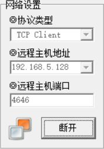
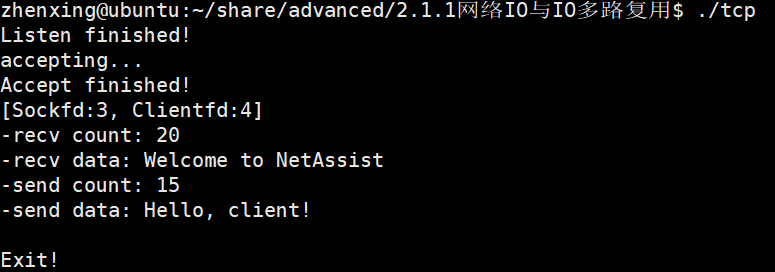

# 0_前言

> ### **课上能不能直接写到简历**
>
> 1. 项目做到上线
>
> 2. 如何写？
>    	a. 名字自行命名。
>    	b. 用课上的技术，解决现实的具体。
>
>    
>
>    按照这个说法就是：
>
>    > 比如的训练集有很多数据图片，我就可以做图床
>    > 我要存一些我的pdf，论文什么的就可以做kv存储
>
>  ==**简单来说就是高一点使用价值出来**==


---


# 2.1 网络编程


## 2.1.1 网络IO与IO多路复用

### 一、引入

> 1. 使用微信的时候，发送文字，发送视频，发送语音，与网络io什么关系
> 2. 抖音的视频资源，如何到达你的ApP。
> 3. github/gitlab，git clone,为什么能够到达本地
> 4. 共享电动车能够开锁。
> 5. 通过手机操作你家的空调，


```cpp
#include <iostream>
int main()
{
    return 0;
}
```

首先思考这个代码是怎么被执行的（编译）

```
gcc -o test main.c
```


==**客户端与服务端进行通信**==


---


### 二、初始化写一个TCP连接

> Linux与windows映射：samba
> 编写代码：代码编辑器（vscode)
> 编译：gcc/g++
> 运行：ubuntu
> 终端工具ssh:xshell，putty，crt


1.  **代码实现**

```c
#include <sys/socket.h>
#include <errno.h>
#include <netinet/in.h>

#include <stdio.h>
#include <string.h>
#include <unistd.h>

int main()
{
    int sockfd = socket(AF_INET, SOCK_STREAM, 0);
    struct sockaddr_in servaddr;
    memset(&servaddr, 0, sizeof(servaddr));
    servaddr.sin_family = AF_INET;
    servaddr.sin_addr.s_addr = htonl(INADDR_ANY); // 监听所有接口——0.0.0.0
    servaddr.sin_port = htons(4646);              // 监听端口4646，0-1023端口为系统保留端口
    if (-1 == bind(sockfd, (struct sockaddr *)&servaddr, sizeof(servaddr)))
    {
        printf("bind error: %s\n", strerror(errno));
        return -1;
    }

    listen(sockfd, 10); // 监听队列长度为10
    getchar(); // 等待用户输入以便查看结果
    
    return 0;
}
```


---


2. **性能查看**

- **正常启动**


```bash
zhenxing@ubuntu:~/share/advanced/2.1.1网络IO与IO多路复用$ netstat -anop | grep 4646
(Not all processes could be identified, non-owned process info
 will not be shown, you would have to be root to see it all.)
tcp        0      0 0.0.0.0:4646            0.0.0.0:*               LISTEN      1699/tcp         off (0.00/0/0)

```


- **同时查看两个的时候：**


会有端口被占用的情况发生。


- **网络调试助手创建连接**

  


连接成功


---


3. **具体的代码解析如下：**

> **1.`socket()` - 创建通信端点**
>
> ```c
> int sockfd = socket(AF_INET, SOCK_STREAM, 0);
> ```
>
> **作用**：创建一个用于网络通信的套接字（类似文件描述符），是后续所有操作的基础。
>
> **参数详解**
>
> - **`AF_INET`**：指定使用IPv4协议族（Address Family）。其他常见值如 `AF_INET6`（IPv6）、`AF_UNIX`（本地通信）。
> - **`SOCK_STREAM`**：指定使用面向连接的TCP协议。特点是有序、可靠、双向字节流。若使用UDP则为 `SOCK_DGRAM`。
> - **`0`**：自动选择协议类型。对于TCP，等价于 `IPPROTO_TCP`；UDP则为 `IPPROTO_UDP`。
>
> **返回值**
>
> - **成功**：返回非负整数，即套接字描述符（类似文件句柄）。
> - **失败**：返回-1，错误码存储在 `errno`中（可通过 `perror`打印）。
>
> **类比**：就像安装了一部电话机，但尚未插线（未绑定地址）或开机（未监听）。
>
> **2. `memset()` - 内存初始化**
>
> ```c
> memset(&serveraddr, 0, sizeof(struct sockaddr_in));
> ```
>
> **作用**：将 `serveraddr`结构体的所有字节置为0，避免残留数据干扰后续操作。
>
> **关键性**：网络编程中结构体可能存在填充字节，未清零可能导致 `bind()`失败。
>
> **参数**
>
> - **目标地址**：`&serveraddr`。
> - **填充值**：`0`（全部字节置0）。
> - **长度**：`sizeof(struct sockaddr_in)`（确保覆盖整个结构体）。
>
> **3. `bind()` - 绑定套接字与地址**
>
> ```c
> bind(sockfd, (struct sockaddr *)&serveraddr, sizeof(struct sockaddr));
> ```
>
> **作用**：将套接字关联到特定的IP地址和端口，使客户端能通过该地址访问服务。
>
> **参数解析**
>
> - **`sockfd`**：由 `socket()`返回的描述符。
> - **`(struct sockaddr *)&serveraddr`**：将 `sockaddr_in`强制转换为通用地址结构体 `sockaddr`（历史原因，需统一接口）。
> - **`sizeof(struct sockaddr)`**：地址结构体的大小。此处有潜在问题（应使用 `sizeof(serveraddr)`）。
>
> **地址结构体字段**
>
> - **`sin_family`**：必须与 `socket()`的地址族一致（此处为 `AF_INET`）。
> - **`sin_addr.s_addr`**：IP地址（`INADDR_ANY`表示监听所有本地网卡）。
> - **`sin_port`**：端口号（需用 `htons()`转换为网络字节序）。
>
> **常见错误**
>
> - **`EADDRINUSE`**：端口被占用。
> - **`EACCES`**：绑定到特权端口（<1024）无root权限。
>
> **类比**：为电话机分配电话号码（IP+端口），允许他人拨打。
>
> **4. `listen()` - 开启监听模式**
>
> ```c
> listen(sockfd, 10);
> ```
>
> **作用**：将套接字设置为被动模式，准备接受客户端的连接请求。
>
> **参数详解**
>
> - **`sockfd`**：已绑定地址的套接字。
> - **`10`**：内核维护的未完成连接队列的最大长度（实际值可能被系统调整，如Linux默认为128）。
>
> **队列类型**
>
> - **未完成队列（SYN队列）**：客户端发送SYN后处于 `SYN_RCVD`状态。
> - **已完成队列（ACCEPT队列）**：已完成三次握手，等待 `accept()`取出。
>
> **返回值**：成功返回0，失败返回-1（需检查错误）。
>
> **类比**：电话机开机并设置为响铃模式，等待来电。
>
> **5. `getchar()` - 阻塞程序退出**
>
> ```c
> getchar(); // 等待用户输入
> ```
>
> **作用**：防止程序立即结束，保持服务器运行以便测试。
>
> **实际应用**：真实服务器应使用事件循环（如 `while(1)` + `accept()`）持续处理请求。
>
> **潜在问题**：此处仅为演示，无实际连接处理逻辑。


---


### 三、添加接收功能

> **前面有一些注意事项**
>
> 1. 端口被绑定以后，不能再次被绑定。
> 2. 执行listen，可以通过netstat看到io的状态。
> 3. 进入listen可以被连接，并且会产生新连接状态。
> 4. io与tcp连接


```c
struct sockaddr_in clientaddr;
    socklen_t len = sizeof(clientaddr);

    // 当我们运行代码的时候首先会阻塞在这个地方，而不是阻塞在下面的getchar();
    printf("accepting...\n");
    int clientfd = accept(sockfd, (struct sockaddr *)&clientaddr, &len);

    printf("Accept finished!\n");
    printf("[Sockfd:%d, Clientfd:%d]\n", sockfd, clientfd);

    char buffer[1024];
    memset(buffer, 0, sizeof(buffer));

    // 接下来会阻塞在recv函数上，等待客户端发送数据
    printf("Recv data...\n");
    int count = recv(clientfd, buffer, 1024, 0);
    printf("-recv count: %d\n", count);
    printf("-recv data: %s\n", buffer);

    count = send(clientfd, "Hello, client!", 15, 0);
    printf("-send count: %d\n", count);
    printf("-send data: Hello, client!\n");

```


---


这部分就是最简单的tcp的连接和发送信息的流程：

> 简单解析一下这部分的话
>
>  **1.`struct sockaddr_in clientaddr`**
>
> - **作用**：定义一个IPv4地址结构体，用于存储**客户端**的连接信息（IP和端口）。
> - 关键字段：
>   - `sin_family`：地址族（自动填充为 `AF_INET`）。
>   - `sin_port`：客户端的端口号（网络字节序）。
>   - `sin_addr`：客户端的IP地址（可通过 `inet_ntoa()`转换为字符串）。
>
> ---
>
> **2. `socklen_t len = sizeof(clientaddr)`**
>
> - **作用**：声明一个变量表示地址结构体的大小，供 `accept()`函数使用。
> - **传递方式**：必须传递指针（`&len`），因为 `accept()`可能修改此值以反映实际写入的地址大小。
>
> ---
>
> **3. `accept()` - 接受客户端连接**
>
> ```c
> int clientfd = accept(sockfd, (struct sockaddr *)&clientaddr, &len);
> ```
>
> - **作用**：从监听队列中取出一个已完成的连接，并返回一个新的套接字描述符（`clientfd`）。
> - 参数详解：
>   - **`sockfd`**：监听套接字（由 `socket()`创建并通过 `bind()`+`listen()`启用）。
>   - **`(struct sockaddr *)&clientaddr`**：存储客户端地址信息的结构体（需强制类型转换）。
>   - **`&len`**：输入时为地址结构体大小，输出时为实际写入的地址大小。
>
> - 返回值：
>   - **成功**：返回一个新的套接字描述符（`clientfd`），用于与客户端通信。
>   - **失败**：返回-1（需检查 `errno`）。
> - **阻塞机制**：若监听队列中没有已完成的连接，`accept()`会阻塞直到有客户端连接。
> - **类比**：电话接线员从等待队列中接听一个来电，并为该通话分配专用线路（`clientfd`）。
>
> ---
>
> **4. `recv` 函数深度解析**
>
> ```c
> int count = recv(clientfd, buffer, 128, 0);
> ```
>
> **函数作用**
>
> - 从已连接的套接字（`clientfd`）接收数据，将数据存入 `buffer`。
> - **类比**：类似于从水管（连接）中读取水流（数据）。
>
> ---
>
> **参数详解**
>
> |    参数    |                             说明                             |
> | :--------: | :----------------------------------------------------------: |
> | `clientfd` |           已连接的套接字描述符（由 `accept` 返回）           |
> |  `buffer`  |                     存储接收数据的缓冲区                     |
> |   `128`    |                  缓冲区最大容量（避免溢出）                  |
> |    `0`     | 标志位（常见选项：`MSG_WAITALL`阻塞收满数据，`MSG_DONTWAIT`非阻塞） |
>
> ---
>
> **返回值意义**
>
> |  返回值  |                   含义                    |
> | :------: | :---------------------------------------: |
> | **`>0`** | 实际接收的字节数（可能小于请求的128字节） |
> | **`0`**  |    对方已关闭连接（需关闭 `clientfd`）    |
> | **`-1`** |          出错（需检查 `errno`）           |


---


这边的连接运行没有问题：




但是就是不支持多客户端的连接


---


### 四、添加循环调用多个客户端

这边用最简单的方式来做

```c
#elif 1
    while(1)
    {
        printf("accepting...\n");
        clientfd = accept(sockfd, (struct sockaddr *)&clientaddr, &len);
        printf("Accept finished!\n");
        printf("[Sockfd:%d, Clientfd:%d]\n", sockfd, clientfd);

        char buffer[1024];
        memset(buffer, 0, sizeof(buffer));

        // 接下来会阻塞在recv函数上，等待客户端发送数据
        printf("Recv data...\n");
        int count = recv(clientfd, buffer, 1024, 0);
        if (count <= 0)
        {
            printf("Client disconnected or error occurred.\n");
            break;
        }
        printf("-recv count: %d\n", count);
        printf("-recv data: %s\n", buffer);

        count = send(clientfd, "Hello, client!", 15, 0);
        printf("-send count: %d\n", count);
        printf("-send data: Hello, client!\n");
    }

#endif
```


> 在TCP连接模型中，客户端连接请求（connect）和服务器的`accept()`是两个独立的过程，你的代码中循环处理连接的方式是关键。让我详细解释流程和概念：
>
> ### 核心概念
>
> 1. **连接队列**：
>    - 当客户端发起连接时（`connect()`），服务器内核会完成三次握手
>    - 完成握手的连接会进入**已完成连接队列**（代码中`listen(sockfd, 10)`设置队列长度为10）
>    - 此时连接已建立，但尚未被应用程序处理
> 2. **`accept()`的作用**：
>    - 从已完成队列中取出一个连接
>    - 返回新的套接字(`clientfd`)用于与客户端通信
>    - **不是**创建新连接，而是"取出"已建立的连接
>
> ### 你的代码流程
>
> ```
> while(1) {
>     // 阻塞点1：等待新连接到来
>     clientfd = accept(...);  // 步骤A：从队列取连接
>     
>     // 阻塞点2：等待该连接发数据
>     recv(clientfd, ...);     // 步骤B：处理具体连接
>     send(clientfd, ...);
> }
> ```
>
> ### 工作场景模拟
>
> 假设有两个客户端（ClientA, ClientB）同时连接：
>
> 1. **时序场景**：
>
>    ```
>    时刻0: ClientA连接 -> 进入队列
>    时刻1: accept()取出ClientA
>    时刻2: 执行到recv()阻塞（等待ClientA发数据）
>    
>    时刻3: ClientB连接 -> 进入队列
>    （此时recv仍在阻塞，但ClientB的连接已在队列中）
>    
>    时刻4: ClientA发送数据 -> recv()返回
>    时刻5: send()响应后循环回到accept()
>    时刻6: accept()立即取出ClientB
>    ```
>
> 2. **关键观察**：
>
>    - **连接成功与accept分离**：ClientB在时刻3已完成连接，即使此时服务器卡在`recv`
>    - **队列的作用**：ClientB的连接被暂存在内核队列中（最长存放10个连接）
>    - **非阻塞处理**：服务器代码在`recv`阻塞时，仍能接收新连接（只是暂不处理）
>
> ### 为什么不会丢失连接
>
> ```mermaid
> graph TD
>     subgraph 内核空间
>         Queue[已完成连接队列 max=10]
>     end
>     
>     subgraph 用户空间
>         accept -->|取出连接| Queue
>         recv -->|操作连接| clientfd
>     end
>     
>     Client1 -->|connect| Queue
>     Client2 -->|connect| Queue
>     Client3 -->|connect| Queue
> ```
>
> - 只要队列未满（<10个连接），新连接都能立即成功
> - `accept()`只是从队列取连接，不参与建立连接的过程
> - 当阻塞在`recv`时，内核仍在独立维护连接队列
>
> ### 关键结论
>
> 1. **连接建立不依赖`accept()`**：客户端`connect()`成功时，连接已在内核中建立
> 2. **`accept()`本质是出队操作**：从内核管理的队列取出已建立连接
> 3. **阻塞位置的影响：**
>    - 阻塞在`accept()`：说明队列空（无新连接）
>    - 阻塞在`recv()`：连接已建立但等待数据（此时队列可继续收新连接）
> 4. **队列满时的行为**：当队列满时（已有10个完成连接），新连接会被拒绝


### 五、多线程方式解决上述难点

```cc
#elif 1
    while(1)
    {
        printf("accepting...\n");
        clientfd = accept(sockfd, (struct sockaddr *)&clientaddr, &len);
        printf("Accept finished!\n");
        printf("[Sockfd:%d, Clientfd:%d]\n", sockfd, clientfd);

        pthread_t thread_id;
        if (pthread_create(&thread_id, NULL, client_thread, &clientfd) != 0)
        {
            printf("Failed to create thread: %s\n", strerror(errno));
            close(clientfd);
            continue; // 如果线程创建失败，继续等待下一个连接
        }
        
    }
```

多线程部分代码

```c
void *client_thread(void *arg)
{
    int clientfd = *(int *)arg; // 从参数中获取客户端文件描述符

    char buffer[1024];
    memset(buffer, 0, sizeof(buffer));

    while (1)
    {
        // 接下来会阻塞在recv函数上，等待客户端发送数据
        printf("[Clientfd:%d]-Recving data...\n", clientfd);
        int count = recv(clientfd, buffer, 1024, 0);
        if (count <= 0)
        {
            printf("Client disconnected or error occurred.\n");
            close(clientfd); // 关闭客户端连接
            printf("[Clientfd:%d]-Connection closed.\n", clientfd);
            pthread_exit(NULL); // 退出线程
        }
        printf("[Clientfd:%d]-recv count: %d\n", clientfd, count);
        printf("[Clientfd:%d]-recv data: %s\n", clientfd, buffer);

        count = send(clientfd, "Hello, client!", 15, 0);
        printf("[Clientfd:%d]-send count: %d\n",clientfd, count);
        printf("[Clientfd:%d]-send data: Hello, client!\n",clientfd);
    }
}
```


---


## 2.1.2 事件驱动reactor的原理与实现

首先明确一下  我们的fd的话，一开始的时候是被占用的：


