# 项目学习记录

## 【项目一】KV存储项目


### 1.1 kv存储的架构设计

#### 一、前情回顾

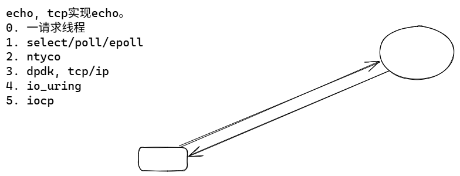

> 前面我们的学习主要还是集中在网络实现部分，所以我们就要来讨论讨论后续的项目了


#### 二、kv存储引入

> 首先，我们需要知道一个事情就是，我们的类似于通讯录，学生管理系统这种简单的小项目进行数据存储的时候，本质上使用到的是**表格**的形式，这种方式的话，每一条数据的每一个参数都存在——ID, 姓名，年龄，性别，手机号码，身份证号码等。
>
> **本质上是一种关系型数据库**


> 而对于我们的kv存储的形式而言的话，数据结构的组成方式如下：
>
> ---
>
> <key> - <value>
> ID, <姓名，年龄，性别，手机号码，身份证号码>
>
> ---
>
> 常见在以下这些：
>
> 


==那我们在什么地方是使用这种kv存储呢！！！==

让我们以图床项目举例：


> 上述流程——简单来说就是要做一个短连接向长连接的转换！！！！
>
> 简单来说就是造轮子，进行基础设施的搭建的项目开发。
>
> 这就是！！！！==中间件团队！！！==
>
> 所以说这部分要好好学！！！


> 问题来了：
>
> #### 既然已经有了Redis了，为什么要有kv存储这个项目呢？
>
> 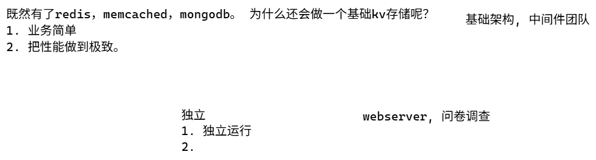


#### 三、kv存储项目拆解

> 我们这样一个架构的话，本质上可以理解为作为中间件，所以他跟我们的业务层之间如果要通信的话——**这边需要有一个网络层**
>
> 1. 简单来说就是跟我们的节点，可以进行tcp通信这样，要预留节点。
> 2. 可以创建多个服务器，都可以跟我们的kv存储进行一个通信。
>
> 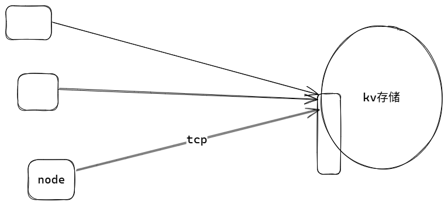
>
> ---
>
> 我们以问卷调查举例的话：
>
> 当我们进行一个网页的问卷调查的打开，可能说我们会半个小时之后才发送我们的问卷调查的结果，怎么样将我们的结果保存到本地的呢。
>
> > 首先就是我们的浏览器会有一个cookie保存下来，我们的服务器也有一个session保存，两者就是key-value的关系，所以说可以保存下来，后面可以查询。


#### 四、架构问题——reactor实现

> ### 针对网络架构问题
>
> 首先是否有线程的网络架构呢，下面这些都是：
>
> 1. libevent
> 2. muduo
> 3. ACE
> 4. Qt
> 5. boost
>
> 但是我们决定根据之前实现的来做：
>
> ```bash
> git clone git@gitlab.0voice.com:2404_vip/2.1.1-network-io.git
> ```
>
> 先将之前的reactor实现网络给git下来：
>
> 1. reactor  来做kvstore的网络框架
> 2. ntyco
>
> 修改几个地方以后
>
> ```bash
> gcc -mcmodel=large kv_reactor.c -o kv_reactor
> ```
>
> 

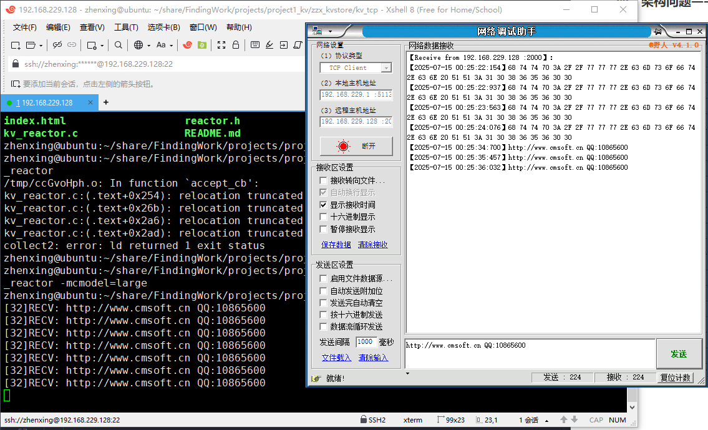

****


> ### 设计模式
>
> 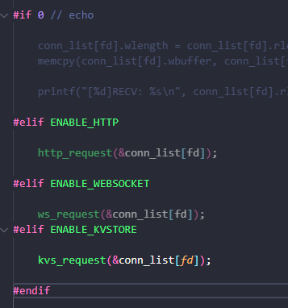
>
> **这边在**reactor中我们可以这样做，本质上我们实现这样的功能有几种方案：
>
> 1. **过滤器方案：**我们根据输入的数据类型，判断他是哪种类的，然后使用哪种方案
> 2. **观察者模式：**观察我们输入的数据类型，然后决定使用哪种


```bash
gcc kvstore.c ./tcp/reactor.c -I ./tcp -o kvstore -mcmodel=large
```

这个就是我们最终的编译代码！！！

​	


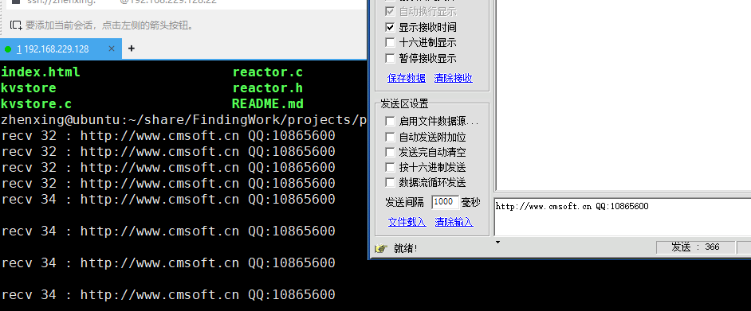

修改完这样之后，本质上我们已经完成了网络部分的搭建，使用reactor.


---


#### 五、架构问题——协程的实现


```bash
zhenxing@ubuntu:~/share/FindingWork/projects/project1_kv/zzx_kvstore$ gcc hook_tcpserver.c -I NtyCo/core/ -L ./NtyCo/ -o hook_tcpserver  -lpthread -ldl -lntyco

zhenxing@ubuntu:~/share/FindingWork/projects/project1_kv/zzx_kvstore$ ls
hook_tcpserver  hook_tcpserver.c  kv_reactor.c  kvstore  kvstore.c  kvstore.h  NtyCo  tcp

zhenxing@ubuntu:~/share/FindingWork/projects/project1_kv/zzx_kvstore$ ./hook_tcpserver
Segmentation fault

zhenxing@ubuntu:~/share/FindingWork/projects/project1_kv/zzx_kvstore$ ./hook_tcpserver 2000
listen port : 2000

```


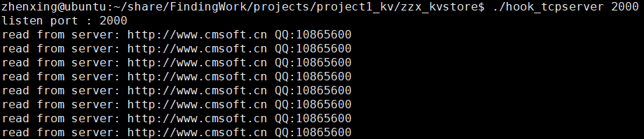


这是启动hook的tcp协程server，我们还可以迁移我们的kvstore过来：

```c
/**
 * @param msg  request message
 * @param length length of the request message
 * @param responese buffer to store the response message
 * @return  length of the response message
 */
int kvs_protocol(char *msg, int length, char *responese)
{
    printf("recv %d : %s\n", length, msg);
}

```


同时要在hook_tcpserver中添加这样的定义：

```c
extern int kvs_protocol(char *msg, int length, char *responese);
```


修改头文件引用，简化我们的编译代码流程：

```c
#include "./tcp/server.h"

#include "./NtyCo/core/nty_coroutine.h"
```


添加完之后进行编译：

```bash
zhenxing@ubuntu:~/share/FindingWork/projects/project1_kv/zzx_kvstore$ gcc hook_tcpserver.c kvstore.c  -L ./NtyCo/ -lntyco -o hook_tcpserver  -lpthread -ldl

zhenxing@ubuntu:~/share/FindingWork/projects/project1_kv/zzx_kvstore$ ./hook_tcpserver 2000

```


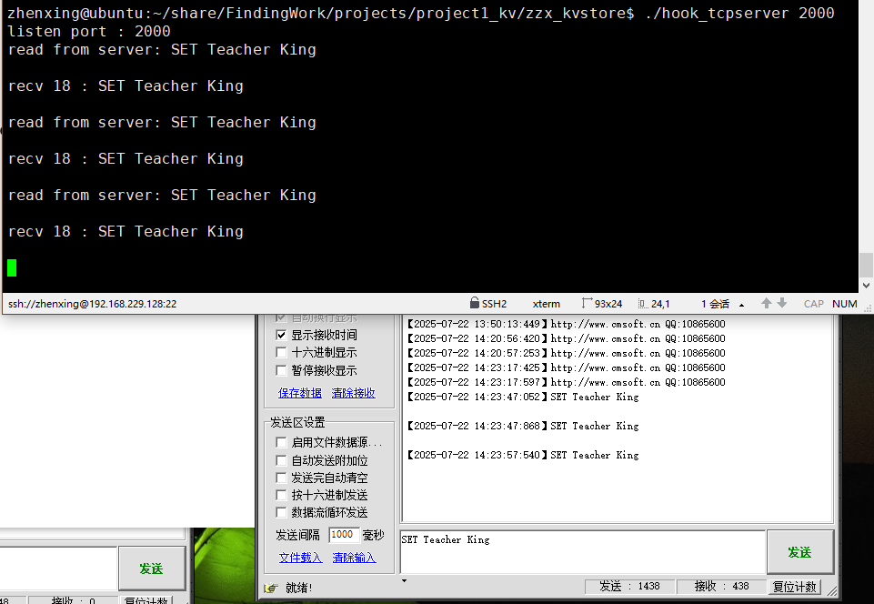


---


#### 六、架构问题——io-uring的实现

==**首先还是io-uring的使用，我们首先需要确保我们虚拟机的内核版本>=5.5, `uname -a`查看**==


之后就编译运行：

```bash
zhenxing@newkernel:~/share/FindingWork/projects/project1_kv/zzx_kvstore/io_uring$ gcc uring_tcp_server.c -o uring_tcp_server -luring -static

zhenxing@newkernel:~/share/FindingWork/projects/project1_kv/zzx_kvstore/io_uring$ ./uring_tcp_server
set_event_recv ret: 32, http://www.cmsoft.cn QQ:10865600
set_event_recv ret: 32, http://www.cmsoft.cn QQ:10865600
set_event_recv ret: 32, http://www.cmsoft.cn QQ:10865600
set_event_recv ret: 32, http://www.cmsoft.cn QQ:10865600

```


这边为了接入kvs协议，我们需要做几个修改：

- 修改iouring

```c
else if (result.event == EVENT_READ)
			{
				int ret = entries->res;
				if (ret == 0)
				{
					close(result.fd);
					// 不打印buffer内容，防止显示旧内容
					printf("set_event_recv ret: 0, <connection closed>\n");
				}
				else if (ret > 0)
				{
					// 先清空buffer，防止短包后残留
					buffer[ret] = '\0'; // 保证字符串结束
					//printf("set_event_recv ret: %d, %s\n", ret, buffer);

					// 调用kvs_protocol处理请求
					ret = kvs_protocol(buffer, ret, response);

					set_event_send(&ring, result.fd, response, ret, 0);
				}
			}
```


将原本不必要的代码挪到reactor中：

```c
#define ENABLE_KVSTORE 1

#if ENABLE_KVSTORE

extern int kvs_protocol(char *msg, int length, char *responese);


int kvs_request(struct conn *c)
{
    printf("recv %d : %s\n", c->rlength, c->rbuffer);
    c->wlength = kvs_protocol(c->rbuffer, c->rlength, c->wbuffer);
}

int kvs_response(struct conn *c)
{
}


#endif
```


在kvstore中添加部分代码：

```c
int kvs_protocol(char *msg, int length, char *responese)
{
    printf("recv %d : %s\n", length, msg);
    memcpy(responese, msg, length);
    return strlen(responese); // return the length of the response message
}


```


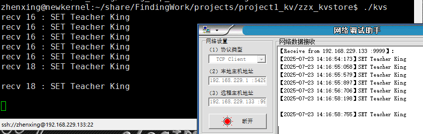


本质上我们就是要实现对于我们的网络层要保证可以实现跨平台了，其他的业务逻辑无所谓。

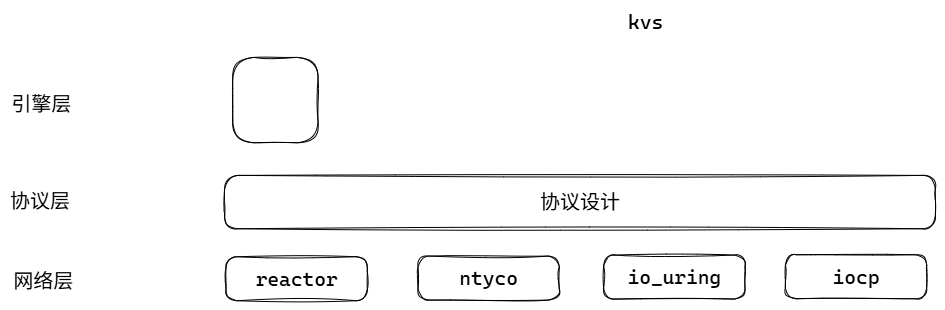


---


#### 七、架构抽象改造

编译方式对比，这几个方法都是做到了百万并发的，他的性能是得到了印证了的。

> gcc kvstore.c kv_reactor.c -I ./tcp -o kvstore_reactor -mcmodel=large

> gcc hook_tcpserver.c kvstore.c  -L ./NtyCo/ -lntyco -o kvstore_Ntyco  -lpthread -ldl

> gcc -o  kvstore_iouring kvstore.c ./io_uring/uring_tcp_server.c -luring -static


> 1. main --> 网络框架
> 2. 协议处理 --> kvstore.c
>
> 我们需要思考一下，我们的main需要放在哪里！！！
>
> ==**必须放在kvstore.c**==
>
> 我们的底层网络需要完全抽象，
>
> main当中只传入协议以及port


##### 1. 修改reactor

> 首先修改reactor，先将main函数修改掉：
>
> ```c
> int reactor_start(unsigned short port, msg_handler handler) {
> 	kvs_handler = handler;
> }
> 
> ```
>
> 之后要修改一些定义，传入一个函数指针，
>
> ```c
> #if ENABLE_KVSTORE
> 
> typedef int(*msg_handler)(char *msg, int length, char *responese);
> 
> static msg_handler kvs_handler;
> 
> int kvs_request(struct conn *c)
> {
>     printf("recv %d : %s\n", c->rlength, c->rbuffer);
>     c->wlength = kvs_handler(c->rbuffer, c->rlength, c->wbuffer);
> }
> 
> int kvs_response(struct conn *c)
> {
> }
> 
> #endif
> ```
>
> 我们还要修改我们的kvstore的代码部分：
>
> ```c
> extern int reactor_start(unsigned short port, msg_handler handler);
> 
> if (argc != 2)
>     {
>         printf("Usage: %s <port>\n", argv[0]);
>         return -1; // Invalid arguments
>     }
>     else
>     {
>     #if ENABLE_REACTOR // Reactor-based server
>         
>     unsigned short port = (unsigned short)atoi(argv[1]);
>     printf("Starting reactor on port %d\n", port);
>     reactor_start(port, kvs_protocol);
> 
>     #elif ENABLE_NTYCO // NtyCo-based server
> 
>     #elif ENABLE_IOURING // io_uring-based server
> 
>     #endif
>     }
> ```
>
> 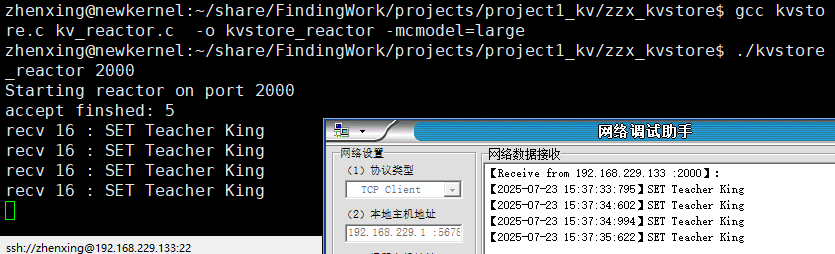


##### 2. 修改ntyco

> ```c
> int ntyco_satrt(unsigned short port,  msg_handler handler) {
> 	// if(argc != 2) {
> 	// 	printf("Usage: %s <port>\n", argv[0]);
> 	// 	return 1;
> 	// }
> 
> 	// int port = atoi(argv[1]);
> 
> 	kvs_handler = handler;
> 	
> 	nty_coroutine *co = NULL;
> 	nty_coroutine_create(&co, server, &port);
> 
> 	nty_schedule_run();
> 
> }
> 
> ```
>
> 修改定义：
>
> ```c
> #if ENABLE_KVSTORE
> 
> 
> typedef int(*msg_handler)(char *msg, int length, char *responese);
> 
> static msg_handler kvs_handler;
> 
> 
> #endif
> ```
>
> 修改句柄引用：
>
> ```c
> int slength = kvs_handler(buf, ret, response);
> ```
>
> 修改kv主函数引用：
>
> ```c
> else
>     {
>     unsigned short port = (unsigned short)atoi(argv[1]);
>     
>     #if ENABLE_REACTOR // Reactor-based server
> 
>     printf("Starting reactor on port %d\n", port);
>     reactor_start(port, kvs_protocol);
> 
>     #elif ENABLE_NTYCO // NtyCo-based server
>     printf ("Starting NtyCo server on port %d\n", port);
>     ntyco_start(port, kvs_protocol);
> 
>     #elif ENABLE_IOURING // io_uring-based server
> 
>     #endif
>     }
> ```
>
> 

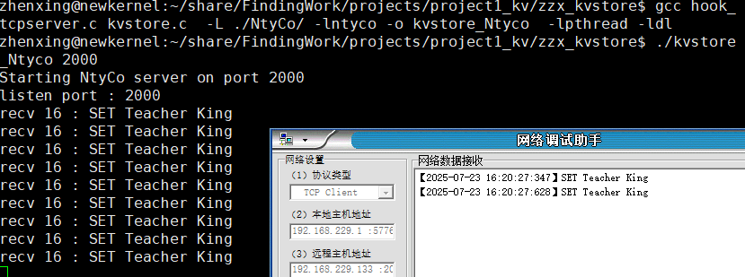


##### 3. 修改iouring

同样类似的做法，

最终效果：

```c
else
    {
    unsigned short port = (unsigned short)atoi(argv[1]);
    
    #if ENABLE_REACTOR // Reactor-based server

    printf("Starting reactor on port %d\n", port);
    reactor_start(port, kvs_protocol);

    #elif ENABLE_NTYCO // NtyCo-based server
    printf ("Starting NtyCo server on port %d\n", port);
    ntyco_start(port, kvs_protocol);

    #elif ENABLE_IOURING // io_uring-based server
    printf("Starting io_uring server on port %d\n", port);
    iouring_start(port, kvs_protocol);
    #endif
    }
```

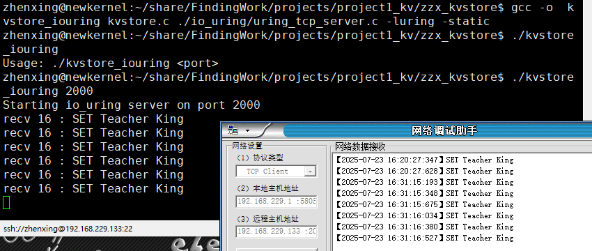


##### 4. 修改整理文件

> `gcc -o kvstore_reactor kvstore.c kv_reactor.c  -mcmodel=large`

> `gcc -o kvstore_ntyco kvstore.c kv_ntyco.c -L ./NtyCo/ -lntyco -lpthread -ldl`

> `gcc -o  kvstore_iouring kvstore.c kv_iouring.c -luring -static`

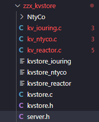

```C
#define ENABLE_REACTOR 0
#define ENABLE_NTYCO 1
#define ENABLE_IOURING 2

#define NETWORK_SELECT ENABLE_NTYCO


else
    {
    unsigned short port = (unsigned short)atoi(argv[1]);
    
    #if (NETWORK_SELECT == ENABLE_REACTOR) // Reactor-based server

    printf("Starting reactor on port %d\n", port);
    reactor_start(port, kvs_protocol);

    #elif (NETWORK_SELECT == ENABLE_NTYCO) // NtyCo-based server
    printf ("Starting NtyCo server on port %d\n", port);
    ntyco_start(port, kvs_protocol);

    #elif (NETWORK_SELECT == ENABLE_IOURING) // io_uring-based server
    printf("Starting io_uring server on port %d\n", port);
    iouring_start(port, kvs_protocol);

    #endif

    }
```


最终编译

```bash
zhenxing@newkernel:~/share/FindingWork/projects/project1_kv/zzx_kvstore$ gcc -o kvstore_all kvstore.c kv_reactor.c kv_ntyco.c kv_iouring.c \
    -L ./NtyCo/ -lntyco -lpthread -ldl -Wl,-Bstatic -luring -Wl,-Bdynamic
```

简单来说  我们的iouring库需要静态编译谢谢

`-Wl,-Bstatic -luring`


> ### **`liburing.so` 是静态链接的（但文件格式是动态库）**
>
> - 你的 `ldd /usr/lib/liburing.so` 显示 `statically linked`，说明这个 `.so` 文件实际上是 **静态编译的动态库**（即内部包含静态链接的代码）。
> - 当你用 `-Wl,-Bstatic -luring -Wl,-Bdynamic` 时，`liburing` 被 **强制静态链接**，避免了动态库加载问题。
> - 但当你用纯动态链接（`-luring`）时，`liburing.so` 可能 **依赖某些静态编译的符号**，导致运行时 `Segmentation Fault`。


---


#### 八、kvstore的协议实现

> 这边就是如果我们通过发送：
>
> ```bash
> SET Teacher King
> ```
>
> 我们后面需要怎么处理这样的kv对呢！！


我们可以仿着Key-Value来自己做一个

> 主要协议指令如下：
>
> > `SET Key Value`
> >
> > `GET Key\\192.168.229.131`
> >
> > `DEL Key`
> >
> > `MOD Key ValueEXIST Key`
> >
> > `EXIST Key`


---


### 1.2 网络同步与事务序列化

#### 一、协议引入

简单来说就是我们要构建一个自己的私有协议

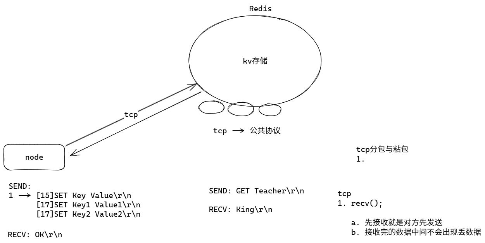


---


> **tcp的分包粘包问题**
>
> 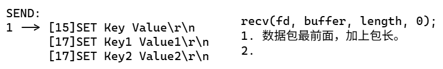
>
> 简单来说，就是我们接收到的数据包，可能不是我们实际的一次发送的数据长度==length==
>
> 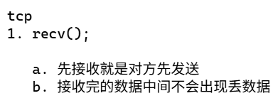
>
> 基于上面的特性来说，我们可以考虑在我们的tcp包的包头通过两个字节
>
> 来表示我们接下来的包的长度！！！具体实现如下：
>
> 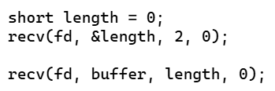
>
> ==ET还是LT？==
>
> 两种方案都能做，但是做法不一样
>
> ---
>
> 当然也可以使用类似于Redis的协议的方法：
>
> 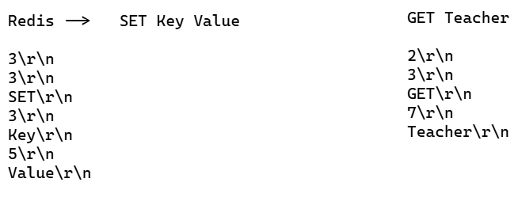
>
> 几个字符  每个字符的长度这种！
>
> 最终就是类似于这样的：
>
> 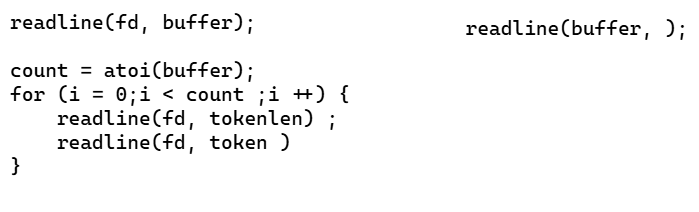
>
> 


---


#### 二、分割实现

```c
/**
 * @brief 将输入字符串按空格分割成多个token（子字符串）
 * 
 * @param msg 待分割的输入字符串（会被修改，内部添加'\0'）
 * @param tokens 用于存储分割结果的指针数组（调用者需保证足够大小）
 * @return int 成功返回找到的token数量，失败返回-1
 * 
 * @note 该函数会修改原始msg内容（用'\0'替换空格）
 * @note 连续多个空格会被视为单个分隔符
 */
int kvs_split_token(char *msg, char *tokens[])
{
    if (msg == NULL || tokens == NULL)
    {
        DEBUG("Invalid arguments to kvs_split_token\n");
        return -1;
    }
    int idx = 0;
    char *token = strtok(msg, " ");
    while (token != NULL)
    {
        DEBUG("idx: %d, %s\n", idx, token);
        tokens[idx++] = token;
        token = strtok(NULL, " ");
    }
    return idx;
}

```


---


#### 三、字符过滤

首先是字符匹配这边；

```c
const char *command[] = {
    "SET", "GET", "DEL", "MOD", "EXIST"}; // command list


enum{
    KVS_CMD_START = 0,
    KVS_CMD_SET = KVS_CMD_START,
    KVS_CMD_GET,
    KVS_CMD_DEL,
    KVS_CMD_MOD,
    KVS_CMD_EXIST,
    KVS_CMD_COUNT,
};

```

感觉简单来说就是构建了一个基于指令和数字遍历之间的对照表：

用枚举的方式给指令赋值！

```c
int kvs_protocol_filter(char **tokens, int count, char *response)
{
    // SET Key Value
    // tokens[0] = "SET"
    // tokens[1] = "Key"
    // tokens[2] = "Value"
    if (tokens == NULL || count < 1 || response == NULL)
    {
        DEBUG("Invalid arguments to kvs_protocol_filter\n");
        return -1;
    }
    int ret = 0;

    int cmd = KVS_CMD_START;
    for (cmd = KVS_CMD_START; cmd < KVS_CMD_COUNT; cmd++)
    {
        if (strcmp(tokens[0], command[cmd]) == 0)
        {
            DEBUG("Command matched: %s\n", command[cmd]);
            break; // 找到匹配的命令
        }
    }
    switch (cmd)
    {
    case KVS_CMD_SET:
        ret = sprintf(response, "cmd: SET\n");
        break;
    case KVS_CMD_GET:
        ret = sprintf(response, "cmd: GET\n");
        break;
    case KVS_CMD_DEL:
        ret = sprintf(response, "cmd: DEL\n");
        break;
    case KVS_CMD_MOD:
        ret = sprintf(response, "cmd: MOD\n");
        break;
    case KVS_CMD_EXIST:
        ret = sprintf(response, "cmd: EXIST\n");
        break;
    default:
        DEBUG("Unknown command: %s\n", tokens[0]);
        break;
    }
}

```


---


#### 四、协议实现（array数组）

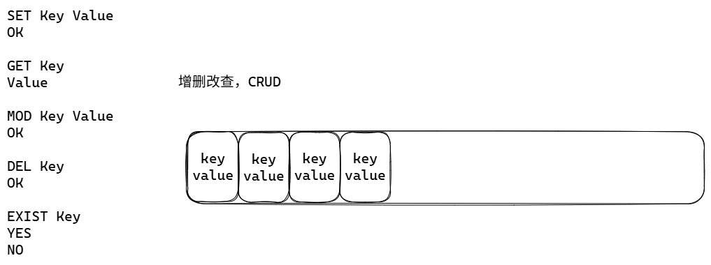

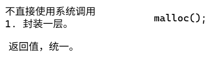

欧克！！！

代码展示：主要分为三个部分吧

1. 构建存储数组！！！

```c


#include "kvstore.h"


//===================================================
// KVS协议相关定义
//===================================================

const char *command[] = {
    "SET", "GET", "DEL", "MOD", "EXIST"}; // command list

const char *response[] = {

}; // response list


/**
 * @brief 分配内存并返回指向分配内存的指针
 * @param size 要分配的内存大小（字节数）
 * @return 返回指向分配内存的指针，如果分配失败则返回NULL
 * @note 使用后请调用kvs_free释放内存
 */
void *kvs_malloc(size_t size) {
	void *ptr = malloc(size);
	if (!ptr) {
		DEBUG("Memory allocation failed\n");
		return NULL;
	}
	return ptr;
}

/**
 * @brief 释放之前分配的内存
 * @param ptr 要释放的内存指针
 * @note 如果ptr为NULL，则不执行任何操作
 */
void kvs_free(void *ptr) {
	if (ptr) {
		free(ptr);
		DEBUG("Memory freed\n");
	}
}

// 使用单例模式

kvs_array_t global_array = {0};

/**
 * @brief 创建KVS数组实例
 * @param inst 指向kvs_array_t实例的指针
 * @return 成功返回0，失败返回负数
 * @note 如果inst或其table成员为NULL，则返回-1
 * @note 如果table已分配内存，则返回-2
 * @note 如果内存分配失败，则返回-3
 */
int kvs_array_create(kvs_array_t *inst) {
	if (!inst){
		DEBUG("Invalid instance\n");
		return -1;
	}
	if (inst->table) {
		DEBUG("Instance already created\n");
		return -2;
	}    
	inst->table = kvs_malloc(KVS_ARRAY_SIZE * sizeof(kvs_array_item_t));
	if (!inst->table) {
		DEBUG("Failed to allocate memory for kvs_array_item_t\n");
		return -3;
	}
	inst->total = 0;
	inst->idx = 0;
	return 0;
}

/**
 * @brief 销毁KVS数组实例
 * @param inst 指向kvs_array_t实例的指针
 * @note 如果inst为NULL，则不执行任何操作
 */
void kvs_array_destory(kvs_array_t *inst) {
	if (!inst) {
		DEBUG("Invalid instance\n");
		return;
	}
	if (inst->table) {
		kvs_free(inst->table);
		DEBUG("kvs_array destroyed\n");
	}
}


/**
 * @brief 设置键值对到KVS数组
 * @param inst 指向kvs_array_t实例的指针
 * @param key 键字符串
 * @param value 值字符串
 * @return 设置成功返回0；键已存在返回正数；失败返回负数
 * @note 如果inst或key/value为NULL，则返回-1
 * @note 如果数组已满，则返回-2
 * @note 如果key内存分配失败，则返回-3
 * @note 如果value内存分配失败，则返回-4
 * @note 如果键不存在，则添加新的键值对并返回0
 * @note 如果键已存在且值相同，则返回1
 * @note 如果键已存在但值不同，则更新值并返回2
 */
int kvs_array_set(kvs_array_t *inst, char *key, char *value) {
	// 参数检查
	if (inst == NULL || key == NULL || value == NULL){
		DEBUG("Invalid arguments to kvs_array_set\n");
		return -1;
	}
	
	// 检查数组是否已满
	if (inst->total == KVS_ARRAY_SIZE) {
		DEBUG("Array is full, cannot add more items\n");
		return -2;
	}
	
	// 检查键是否已存在并比较替换替换值
    int i = 0;
    for (i = 0; i < inst->total; i++) {
        if (inst->table[i].key != NULL && strcmp(inst->table[i].key, key) == 0) {
			DEBUG("Key already exists: %s\n", key);
			if(strcmp(inst->table[i].value, value) == 0) {
				DEBUG("Value is the same, no need to update\n");
				return 1; // 键已存在且值相同
			}
			kvs_free(inst->table[i].value); // 释放旧值
			inst->table[i].value = kvs_malloc(strlen(value) + 1);
			if (inst->table[i].value == NULL) {
				DEBUG("Failed to allocate memory for value copy\n");
				return -4;
			}
			memset(inst->table[i].value, 0, strlen(value) + 1);
			strncpy(inst->table[i].value, value, strlen(value));
			DEBUG("Updated key: %s with new value: %s\n", key, value);
			return 0; // 成功替换
		}
	}

	// 分配内存并复制键和值
	char *kcopy = kvs_malloc(strlen(key) + 1);
	if (kcopy == NULL) {
		DEBUG("Failed to allocate memory for key copy\n");
		return -3;
	}
	memset(kcopy, 0, strlen(key) + 1);
	strncpy(kcopy, key, strlen(key));

	char *kvalue = kvs_malloc(strlen(value) + 1);
	if (kvalue == NULL) {
		DEBUG("Failed to allocate memory for value copy\n");
		kvs_free(kcopy);
		return -4;
	}
	memset(kvalue, 0, strlen(value) + 1);
	strncpy(kvalue, value, strlen(value));
	
	// 查找第一个空闲位置
	for (i = 0; i < inst->total; i++) {
		if (inst->table[i].key == NULL) {
			inst->table[i].key = kcopy;
			inst->table[i].value = kvalue;
			inst->total++;
			DEBUG("Added key: %s, value: %s at index %d\n", key, value, i);
			return 0; // 成功添加
		}
	}

	// 如果没有找到空闲位置且数组未满
	if (i == inst->total && i < KVS_ARRAY_SIZE) {
		inst->table[i].key = kcopy;
		inst->table[i].value = kvalue;
		inst->total++;
		DEBUG("Added key: %s, value: %s at index %d\n", key, value, i);
		return 0; // 成功添加
	}

	// 如果走到这里，说明数组已满或发生了其他错误
	kvs_free(kcopy);
	kvs_free(kvalue);
	DEBUG("Something went wrong, could not add key-value pair\n");
	return -5; 
}


/**
 * @brief 获取KVS数组中指定键的值
 * @param inst 指向kvs_array_t实例的指针
 * @param key 键字符串
 * @return 返回找到的值，如果未找到则返回NULL
 * @note 如果inst或key为NULL，则返回NULL
 * @note 如果键不存在，则返回NULL
 * @note 如果找到键，则返回对应的值指针
 */
char* kvs_array_get(kvs_array_t *inst, char *key) {
	if (inst == NULL || key == NULL) {
		DEBUG("Invalid arguments to kvs_array_get\n");
		return NULL;
	}

	int i = 0;
	for (i = 0; i < inst->total; i++) {
		if (inst->table[i].key != NULL && strcmp(inst->table[i].key, key) == 0) {
			DEBUG("Found key: %s with value: %s at index %d\n", key, inst->table[i].value, i);
			return inst->table[i].value; // 返回找到的值
		}
	}

	DEBUG("Key not found: %s\n", key);
	return NULL; // 未找到键
}

/**
 * @brief 删除KVS数组中指定键的键值对
 * @param inst 指向kvs_array_t实例的指针
 * @param key 键字符串
 * @return 成功删除返回0，未找到键返回1，失败返回负数
 * @note 如果inst或key为NULL，则返回-1
 * @note 如果键不存在，则返回1
 * @note 如果成功删除键值对，则返回0
 */
int kvs_array_del(kvs_array_t *inst, char *key) {
	if(inst == NULL || key == NULL) {
		DEBUG("Invalid arguments to kvs_array_del\n");
		return -1;
	}
	int i = 0;
	for (i = 0; i < inst->total; i++) {
		if (inst->table[i].key != NULL && strcmp(inst->table[i].key, key) == 0) {
			DEBUG("Deleting key: %s at index %d\n", key, i);
			kvs_free(inst->table[i].key);
			inst->table[i].key = NULL;
			kvs_free(inst->table[i].value);
			inst->table[i].value = NULL;

			// 如果删除的是最后一个元素，减少总数
			// 不需要移动，因为添加的时候会检验前面是否有空位
			if(inst->total-1 == i){
				inst->total--;
				DEBUG("Deleted last item, total now: %d\n", inst->total);
			}
			return 0; // 成功删除
		}
	}
	DEBUG("Key not found for deletion: %s\n", key);
	return 1; // 未找到键
}

/**
 * @brief 修改KVS数组中指定键的值
 * @param inst 指向kvs_array_t实例的指针
 * @param key 键字符串
 * @param value 新的值字符串
 * @return 成功返回0，未找到键返回1，失败返回负数
 * @note 如果inst或key/value为NULL，则返回-1
 * @note 如果键不存在，则返回1
 * @note 如果成功修改键值对，则返回0
 */
int kvs_array_mod(kvs_array_t *inst, char *key, char *value) {
	if (inst == NULL || key == NULL || value == NULL) {
		DEBUG("Invalid arguments to kvs_array_mod\n");
		return -1;
	}
	int i = 0;
	for (i = 0; i < inst->total; i++) {
		if(inst->table[i].key != NULL && strcmp(inst->table[i].key, key) == 0) {
			DEBUG("Modifying key: %s at index %d with new value: %s\n", key, i, value);
			kvs_free(inst->table[i].value); // 释放旧值
			inst->table[i].value = kvs_malloc(strlen(value) + 1);
			if (inst->table[i].value == NULL) {
				DEBUG("Failed to allocate memory for new value\n");
				return -2; // 内存分配失败
			}
			memset(inst->table[i].value, 0, strlen(value) + 1);
			strncpy(inst->table[i].value, value, strlen(value));
			DEBUG("Successfully modified key: %s with new value: %s\n", key, value);
			return 0; // 成功修改
		}
	}
	DEBUG("Key not found for modification: %s\n", key);
	return 1; // 未找到键
}

/**
 * @brief 检查KVS数组中是否存在指定键
 * @param inst 指向kvs_array_t实例的指针
 * @param key 键字符串
 * @return 如果键存在返回0，不存在返回1，失败返回-1
 * @note 如果inst或key为NULL，则返回-1
 */
int kvs_array_exist(kvs_array_t *inst, char *key) {
	if (inst == NULL || key == NULL) {
		DEBUG("Invalid arguments to kvs_array_exist\n");
		return -1;
	}

	char *value = kvs_array_get(inst, key);
	if (value != NULL) {
		DEBUG("Key exists: %s with value: %s\n", key, value);
		return 0; // 键存在
	}

	DEBUG("Key does not exist: %s\n", key);
	return 1; // 键不存在
}


```


#### 五、实现协议调用接口

```c
#include <stdio.h>
#include <string.h>
#include <stdlib.h>

#include "kvstore.h"


/**
 * @brief 将输入字符串按空格分割成多个token（子字符串）
 * @param msg 待分割的输入字符串（会被修改，内部添加'\0'）
 * @param tokens 用于存储分割结果的指针数组（调用者需保证足够大小）
 * @return int 成功返回找到的token数量，失败返回-1
 * @note 该函数会修改原始msg内容（用'\0'替换空格）
 * @note 连续多个空格会被视为单个分隔符
 */
int kvs_split_token(char *msg, char *tokens[])
{
    if (msg == NULL || tokens == NULL)
    {
        DEBUG("Invalid arguments to kvs_split_token\n");
        return -1;
    }
    int idx = 0;
    char *token = strtok(msg, " ");
    while (token != NULL)
    {
        DEBUG("idx: %d, %s\n", idx, token);
        tokens[idx++] = token;
        token = strtok(NULL, " ");
    }
    return idx;
}


/**
 * @brief KVS协议过滤器，检查并处理客户端请求
 * @param tokens 分割后的命令token数组
 * @param count token数量
 * @param response 用于存储响应消息的缓冲区
 * @return int 成功返回响应消息长度，失败返回负数
 * @note 如果tokens或response为NULL，或count小于1，则返回-1
 * @note 如果命令格式不匹配，则返回-2
 */
int kvs_protocol_filter(char **tokens, int count, char *response)
{
    if (tokens == NULL || count < 1 || response == NULL)
    {
        DEBUG("Invalid arguments to kvs_protocol_filter\n");
        return -1;
    }

    int ret = 0;
    int length = 0;

    int cmd = KVS_CMD_START;
    for (cmd = KVS_CMD_START; cmd < KVS_CMD_COUNT; cmd++)
    {
        if (strcmp(tokens[0], command[cmd]) == 0)
        {
            DEBUG("Command matched: %s\n", command[cmd]);
            break; // 找到匹配的命令
        }
    }
    switch (cmd)
    {
    case KVS_CMD_SET:
        if (count != 3)
        {
            DEBUG("Invalid SET command format, expected 3 tokens, got %d\n", count);
            return -2; // 错误的命令格式
        }
        ret = kvs_array_set(&global_array, tokens[1], tokens[2]);
        if (ret < 0)
        {
            length = sprintf(response, "ERROR\r\n");
            DEBUG("Failed to set key-value pair: %s\n", tokens[1]);
        }else if (ret == 1)
        {
            length = sprintf(response, "EXIST\r\n");
            DEBUG("Key already exists with same value: %s\n", tokens[1]);
        }
        else if (ret == 2)
        {
            length = sprintf(response, "UPDATED\r\n");
            DEBUG("Key updated with new value: %s\n", tokens[1]);
        }
        else
        {
            length = sprintf(response, "OK\r\n");
            DEBUG("Key-value pair set successfully: %s\n", tokens[1]);
        }
        break;

    case KVS_CMD_GET:
        if (count != 2)
        {
            DEBUG("Invalid GET command format, expected 2 tokens, got %d\n", count);
            return -2; // 错误的命令格式
        }
        char* result = kvs_array_get(&global_array, tokens[1]);
        if (result == NULL)
        {
            length = sprintf(response, "NOT FOUND\r\n");
            DEBUG("Key not found: %s\n", tokens[1]);
        }
        else
        {
            length = sprintf(response, "VALUE: %s\r\n", result);
            DEBUG("Key found: %s with value: %s\n", tokens[1], result);
        }
        break;
    
    case KVS_CMD_DEL:
        if (count != 2)
        {
            DEBUG("Invalid DEL command format, expected 2 tokens, got %d\n", count);
            return -2; // 错误的命令格式
        }
        ret = kvs_array_del(&global_array, tokens[1]);
        if (ret < 0)
        {
            length = sprintf(response, "ERROR\r\n");
            DEBUG("Failed to delete key: %s\n", tokens[1]);
        }
        else if (ret == 1)
        {
            length = sprintf(response, "NOT FOUND\r\n");
            DEBUG("Key not found for deletion: %s\n", tokens[1]);
        }
        else
        {
            length = sprintf(response, "OK\r\n");
            DEBUG("Key deleted successfully: %s\n", tokens[1]);
        }
        break;
    case KVS_CMD_MOD:
        if (count != 3)
        {
            DEBUG("Invalid MOD command format, expected 3 tokens, got %d\n", count);
            return -2; // 错误的命令格式
        }
        ret = kvs_array_mod(&global_array, tokens[1], tokens[2]);
        if (ret < 0)
        {
            length = sprintf(response, "ERROR\r\n");
            DEBUG("Failed to modify key: %s\n", tokens[1]);
        }
        else if (ret == 1)
        {
            length = sprintf(response, "NOT FOUND\r\n");
            DEBUG("Key not found for modification: %s\n", tokens[1]);
        }
        else
        {
            length = sprintf(response, "OK\r\n");
            DEBUG("Key modified successfully: %s\n", tokens[1]);
        }
        break;
    case KVS_CMD_EXIST:
        if (count != 2)
        {
            DEBUG("Invalid EXIST command format, expected 2 tokens, got %d\n", count);
            return -2; // 错误的命令格式
        }
        ret = kvs_array_exist(&global_array, tokens[1]);
        if (ret < 0)
        {
            length = sprintf(response, "ERROR\r\n");
            DEBUG("Failed to check existence of key: %s\n", tokens[1]);
        }
        else if (ret == 0)
        {
            length = sprintf(response, "EXIST\r\n");
            DEBUG("Key exists: %s\n", tokens[1]);
        }
        else
        {
            length = sprintf(response, "NOT EXIST\r\n");
            DEBUG("Key does not exist: %s\n", tokens[1]);
        }
        break;
    default:
        return -8; // 未知命令
        DEBUG("Unknown command: %s\n", tokens[0]);
        break;
    }
    
    DEBUG("Response generated: %s\n", response);
    return length; // 返回响应长度
}


/**
 * @brief KVS协议处理器，解析并执行客户端请求
 * @param msg 客户端请求消息（以空格分隔的字符串）
 * @param length 请求消息长度（字节数）
 * @param responese 用于存储响应消息的缓冲区
 * @return int 成功返回响应消息长度，失败返回负数
 * @note 如果msg或responese为NULL，或length小于等于0，则返回-1
 * @note 如果分割token失败，则返回-2
 * @note 如果过滤协议失败，则返回-3
 * @note 如果成功处理请求，则返回响应长度
 */
int kvs_protocol(char *msg, int length, char *responese)
{
    // SET Key Value
    // GET Key
    // DEL Key
    if (msg == NULL || length <= 0 || responese == NULL)
    {
        DEBUG("Invalid arguments to kvs_protocol\n");
        return -1;
    }

    printf("\nrecv %d : %s\n", length, msg);

    char *tokens[KVS_MAX_TOKENS] = {0};
    int count = kvs_split_token(msg, tokens);
    if (count == -1)
    {
        DEBUG("Failed to split tokens[%d]\n", count);
        return -2;
    }

    int ret = kvs_protocol_filter(tokens, count, responese);
    if (ret < 0)
    {
        DEBUG("Failed to filter protocol [%d]\n", ret);
        return -3;
    }

    return ret; // 返回响应长度
}

/**
 * @brief 初始化KVS引擎
 * @return int 成功返回0，失败返回负数
 * @note 该函数会创建全局KVS数组实例
 */
int init_kvengine(void){
#if ENABLE_ARRAY
    memset(&global_array, 0, sizeof(kvs_array_t));
    if (kvs_array_create(&global_array) < 0) {
        DEBUG("Failed to create global KVS array\n");
        return -1; // 创建失败
    }
    DEBUG("Global KVS array created successfully\n");
#endif
    return 0; // 初始化成功
}


int main(int argc, char *argv[])
{
    
    if (argc != 2)
    {
        printf("Usage: %s <port>\n", argv[0]);
        return -1; // Invalid arguments
    }
    else
    {
        unsigned short port = (unsigned short)atoi(argv[1]);
    
    // 初始化KVS引擎
    if (init_kvengine() < 0) {
        DEBUG("Failed to initialize KVS engine\n");
        return -1; // 初始化失败
    }
    DEBUG("KVS engine initialized successfully\n");
    
    // 启动网络服务
#if (NETWORK_SELECT == ENABLE_REACTOR) // Reactor-based server
        DEBUG("Starting reactor on port %d\n", port);
        reactor_start(port, kvs_protocol);
#elif (NETWORK_SELECT == ENABLE_NTYCO) // NtyCo-based server
        DEBUG("Starting NtyCo server on port %d\n", port);
        ntyco_start(port, kvs_protocol);
#elif (NETWORK_SELECT == ENABLE_IOURING) // io_uring-based server
        DEBUG("Starting io_uring server on port %d\n", port);
        iouring_start(port, kvs_protocol);
#endif
    }
}
```


#### 六、修改bug

```c
//===================================================
// KVS协议相关定义
//===================================================

const char *command[] = {
    "SET", "GET", "DEL", "MOD", "EXIST"}; // command list

const char *response[] = {

}; // response list

```

> **一开始这这部分是放在头文件中的，但是因为头文件被两个c文件引用了，所以会发生重复定义的问题！！！**
>
> **所以头文件只能声明不能定义！！！**

```c


#ifndef __KV_STORE_H__
#define __KV_STORE_H__

#include <stdio.h>
#include <string.h>
#include <stdlib.h>
#include <assert.h>
#include <stddef.h>

//===================================================
// 全局宏定义
//===================================================

#define DEBUG printf
#define ENABLE_ARRAY 1      // 启用数组存储

#define ENABLE_REACTOR 0
#define ENABLE_NTYCO 1
#define ENABLE_IOURING 2

#define NETWORK_SELECT ENABLE_REACTOR

//===================================================
// KVS协议相关定义
//===================================================


enum
{
    KVS_CMD_START = 0,
    KVS_CMD_SET = KVS_CMD_START,
    KVS_CMD_GET,
    KVS_CMD_DEL,
    KVS_CMD_MOD,
    KVS_CMD_EXIST,
    KVS_CMD_COUNT,
};

extern const char *command[]; // command list

extern const char *response[]; // response list


//===================================================
// KVS数组相关定义
//===================================================

#define KVS_ARRAY_SIZE 1024 // 数组大小

#if ENABLE_ARRAY


typedef struct kvs_array_item_s
{
    char *key;
    char *value;
} kvs_array_item_t;

typedef struct kvs_array_s
{
    kvs_array_item_t *table; // 存储键值对的数组
    int total;               // 当前存储的键值对数量
    int idx;                 // 当前使用的索引
} kvs_array_t;

extern kvs_array_t global_array; // 全局KVS数组实例

void *kvs_malloc(size_t size);

void kvs_free(void *ptr);

int kvs_array_create(kvs_array_t *inst);

void kvs_array_destory(kvs_array_t *inst);

int kvs_array_set(kvs_array_t *inst, char *key, char *value);

char *kvs_array_get(kvs_array_t *inst, char *key);

int kvs_array_del(kvs_array_t *inst, char *key);

int kvs_array_mod(kvs_array_t *inst, char *key, char *value);

int kvs_array_exist(kvs_array_t *inst, char *key);

#endif

//===================================================
// Reactor相关函数声明
//===================================================

typedef int (*msg_handler)(char *msg, int length, char *responese);

extern int reactor_start(unsigned short port, msg_handler handler);

extern int ntyco_start(unsigned short port, msg_handler handler);

extern int iouring_start(unsigned short port, msg_handler handler);

//===================================================
// KVS协议相关函数声明
//===================================================

#define KVS_MAX_TOKENS 128

int kvs_split_token(char *msg, char *tokens[]);

int kvs_protocol_filter(char **tokens, int count, char *response);

int kvs_protocol(char *msg, int length, char *responese);

int init_kvengine(void);
#endif
```


#### 七、结果演示

##### 1. 初始化如图：

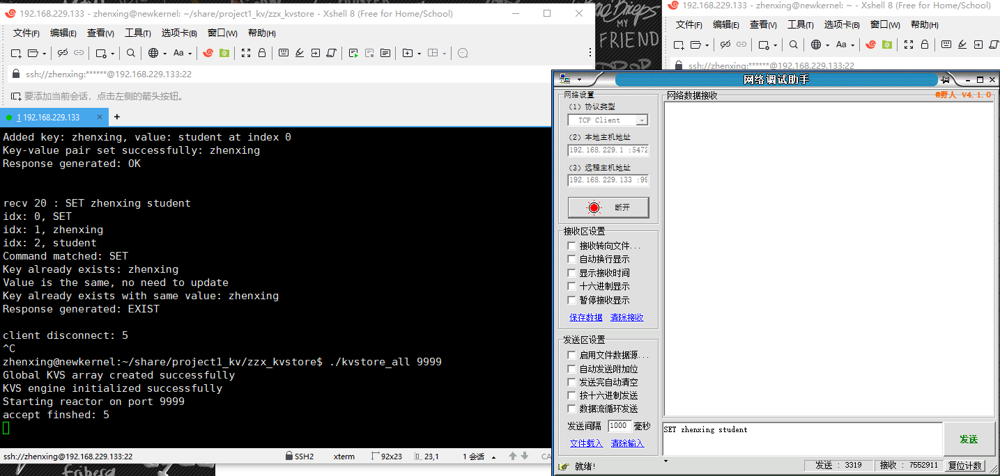

> 初始化正常


##### 2. 发送`SET zhenxing student`以及`SET king teacher`

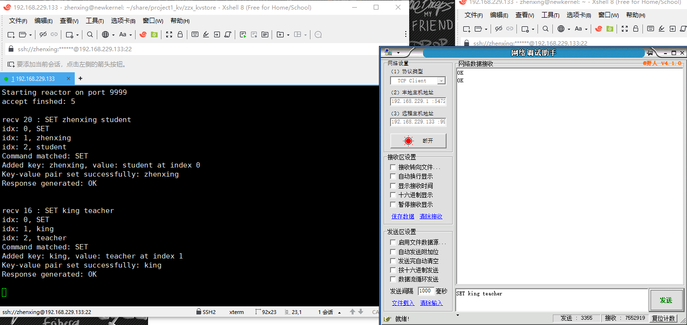

> 两者均运行没有问题


##### 3. 发送 `SET zhenxing teacher`

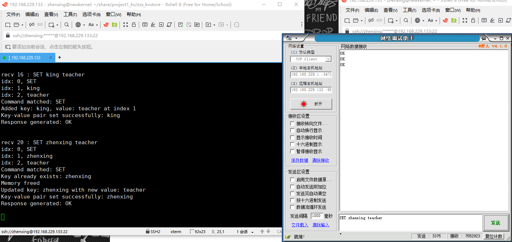

> 更新释放了之前的旧值


##### 4. 再次发送 `SET zhenxing teacher`

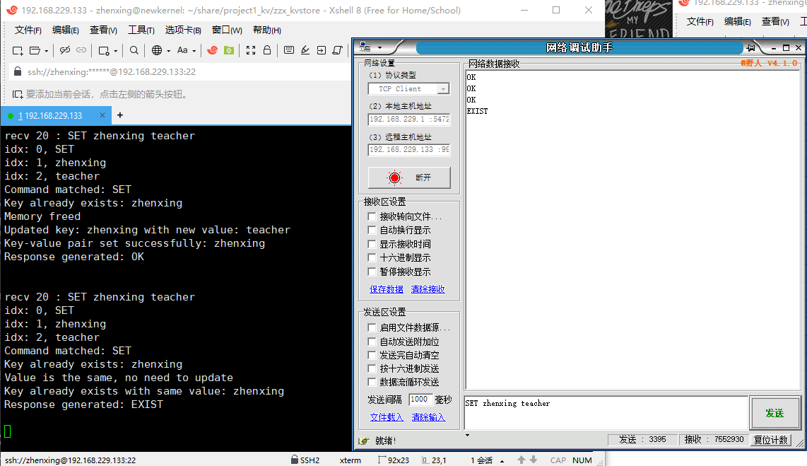

> 同样的SET返回EXIT


##### 5. 发送`GET zhenxing`以及`GET xiaoxiao`

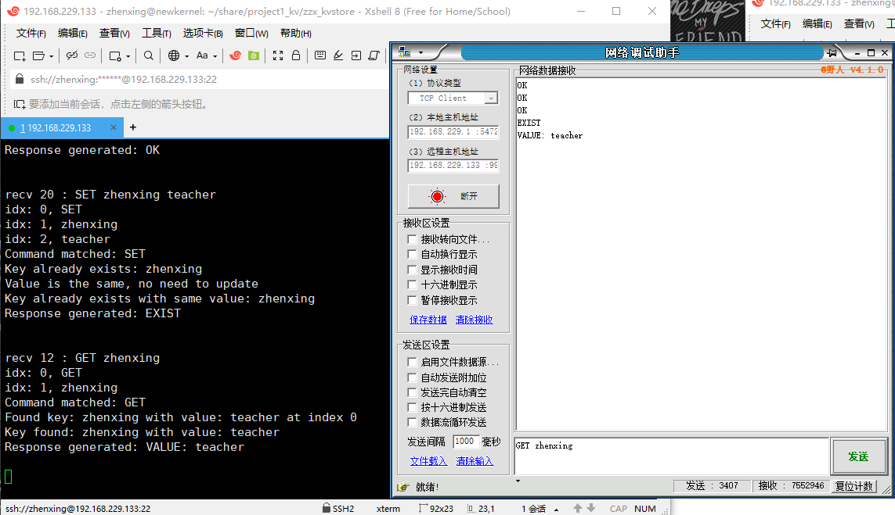

> 成功找到
>
> 以及返回不存在

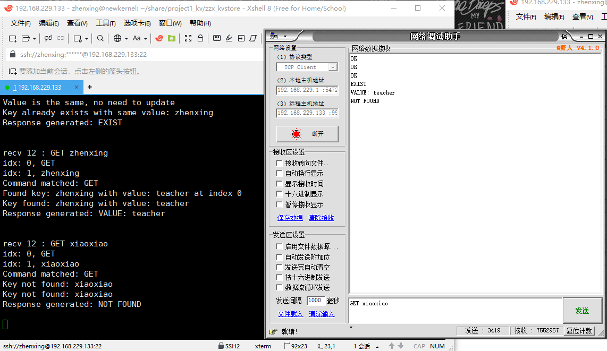


##### 6. 连续两次发送`DEL king`

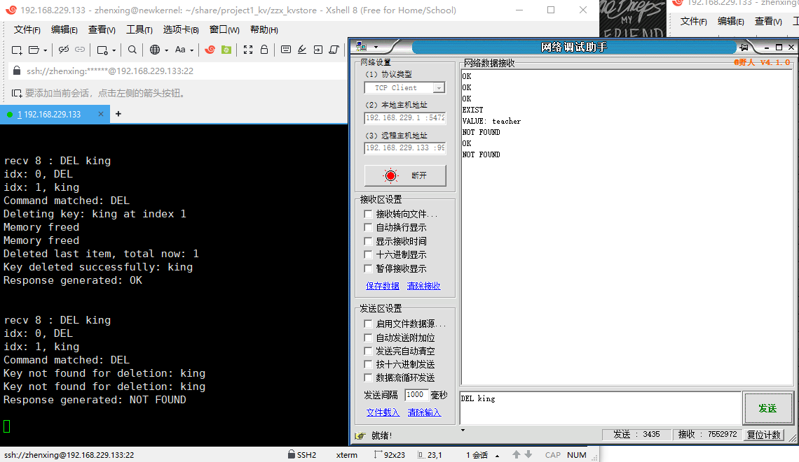

> 第一次删除成功，第二次删除不存在


##### 7. 发送`MOD king student`以及`MOD zhenxing student`

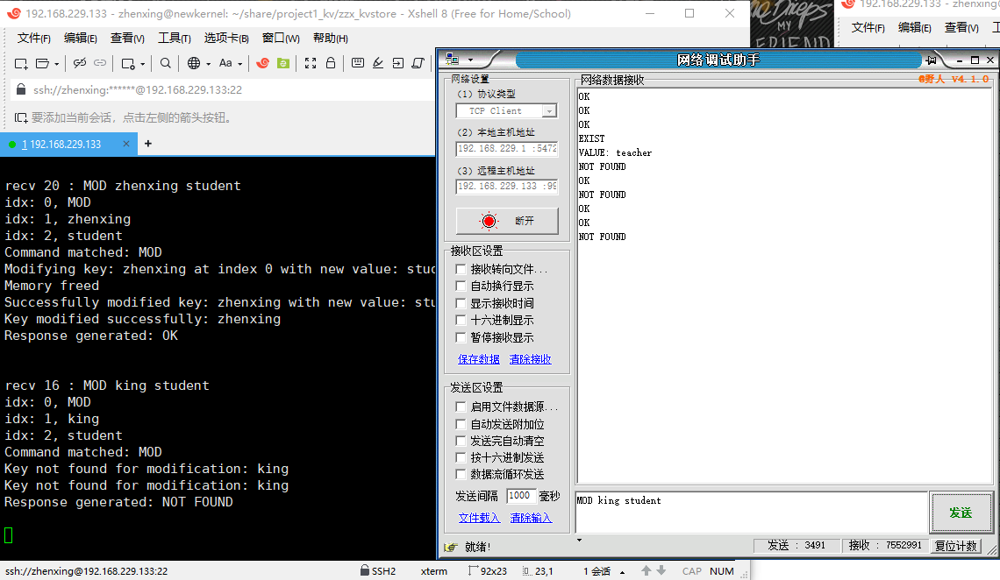


##### 7. 发送`EXIST king`以及`EXIST zhenxing`


### 1.3  内存池的使用与LRU的实现

#### 一、要实现一个自动化的测试用力用例实现

> 1. 首先我们需要构建make文件
>
> ```makefile
> CC = gcc
> TARGET = kvstore
> SRCS = kvstore.c kv_reactor.c kv_ntyco.c kv_iouring.c kvs_array.c
> INCLUDES = 
> LIBS = -L ./NtyCo/ -lntyco -lpthread -ldl -Wl,-Bstatic -luring -Wl,-Bdynamic
> 
> 
> all:
> 	$(CC) -o $(TARGET) $(SRCS) $(INCLUDES) $(LIBS)
> 
> clean:
> 	rm -rf kvstore
> 
> ```
>
> 实现指令：
>
> `make`  和 `make clean`、
>
> 


```c
#include <stdio.h>
#include <string.h>
#include <stdlib.h>
#include <arpa/inet.h>
#include <sys/time.h>
#include <unistd.h>
#include <pthread.h>

#define MAX_MSG_LENGTH		1024
#define TIME_SUB_MS(tv1, tv2)  ((tv1.tv_sec - tv2.tv_sec) * 1000 + (tv1.tv_usec - tv2.tv_usec) / 1000)


int send_msg(int connfd, char *msg, int length) {

	int res = send(connfd, msg, length, 0);
	if (res < 0) {
		perror("send");
		exit(1);
	}
	return res;
}

int recv_msg(int connfd, char *msg, int length) {

	int res = recv(connfd, msg, length, 0);
	if (res < 0) {
		perror("recv");
		exit(1);
	}
	return res;

}


void testcase(int connfd, char *msg, char *pattern, char *casename) {

	if (!msg || !pattern || !casename) return ;

	send_msg(connfd, msg, strlen(msg));

	char result[MAX_MSG_LENGTH] = {0};
	recv_msg(connfd, result, MAX_MSG_LENGTH);

	if (strcmp(result, pattern) == 0) {
		printf("==> PASS ->  %s\n", casename);
	} else {
		printf("==> FAILED -> %s, '%s' != '%s' \n", casename, result, pattern);
		exit(1);
	}

}


// 基本功能测试用例
void array_testcase(int connfd) {
    printf("\n=== 开始基本功能测试 ===\n\n");

    testcase(connfd, "SET Teacher King", "OK\r\n", "SET-Teacher");
    testcase(connfd, "GET Teacher", "King\r\n", "GET-Teacher");
    testcase(connfd, "MOD Teacher Darren", "OK\r\n", "MOD-Teacher");
    testcase(connfd, "GET Teacher", "Darren\r\n", "GET-Teacher");
    testcase(connfd, "EXIST Teacher", "EXIST\r\n", "EXIST-Teacher");
    testcase(connfd, "DEL Teacher", "OK\r\n", "DEL-Teacher");
    testcase(connfd, "GET Teacher", "NOT FOUND\r\n", "GET-Teacher-NotExist");
    
    printf("\n=== 基本功能测试完成 ===\n");
}

int connect_tcpserver(const char *ip, unsigned short port) {

	int connfd = socket(AF_INET, SOCK_STREAM, 0);

	struct sockaddr_in server_addr;
	memset(&server_addr, 0, sizeof(struct sockaddr_in));

	server_addr.sin_family = AF_INET;
	server_addr.sin_addr.s_addr = inet_addr(ip);
	server_addr.sin_port = htons(port);

	if (0 !=  connect(connfd, (struct sockaddr*)&server_addr, sizeof(struct sockaddr_in))) {
		perror("connect");
		return -1;
	}
	
	return connfd;
	
}


// testcase 192.168.229.133  2000
int main(int argc, char *argv[]) {

	if (argc != 4) {
		printf("arg error\n");
		return -1;
	}

	char *ip = argv[1];
	int port = atoi(argv[2]);
	int mode = atoi(argv[3]);

	int connfd = connect_tcpserver(ip, port);

	if (mode == 0) {
		array_testcase(connfd);
	} 
	return 0;
	
}
```


测试代码如上：

更新make：

```makefile
test:
	gcc -o test_kvstore test_kvstore.c 
	./test_kvstore 192.168.229.133 2000 0
```

效果如下：

测试完全通过！！！

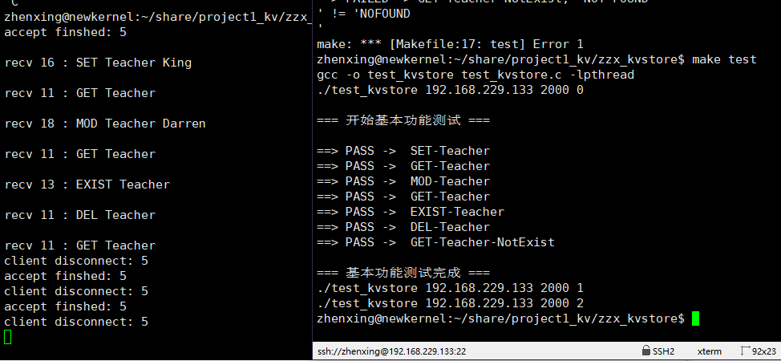

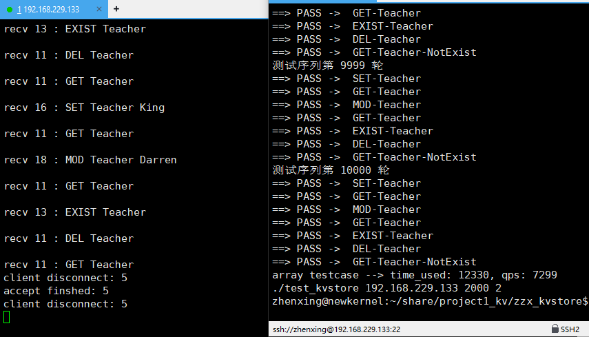

一万组测试同样成功。


---

#### 二、添加kv引擎 rbtree

```c


#include <stdio.h>
#include <stdlib.h>
#include <string.h>

#include "kvstore.h"

rbtree_node *rbtree_mini(rbtree *T, rbtree_node *x)
{
	while (x->left != T->nil)
	{
		x = x->left;
	}
	return x;
}

rbtree_node *rbtree_maxi(rbtree *T, rbtree_node *x)
{
	while (x->right != T->nil)
	{
		x = x->right;
	}
	return x;
}

rbtree_node *rbtree_successor(rbtree *T, rbtree_node *x)
{
	rbtree_node *y = x->parent;

	if (x->right != T->nil)
	{
		return rbtree_mini(T, x->right);
	}

	while ((y != T->nil) && (x == y->right))
	{
		x = y;
		y = y->parent;
	}
	return y;
}

void rbtree_left_rotate(rbtree *T, rbtree_node *x)
{

	rbtree_node *y = x->right; // x  --> y  ,  y --> x,   right --> left,  left --> right

	x->right = y->left; // 1 1
	if (y->left != T->nil)
	{ // 1 2
		y->left->parent = x;
	}

	y->parent = x->parent; // 1 3
	if (x->parent == T->nil)
	{ // 1 4
		T->root = y;
	}
	else if (x == x->parent->left)
	{
		x->parent->left = y;
	}
	else
	{
		x->parent->right = y;
	}

	y->left = x;   // 1 5
	x->parent = y; // 1 6
}

void rbtree_right_rotate(rbtree *T, rbtree_node *y)
{

	rbtree_node *x = y->left;

	y->left = x->right;
	if (x->right != T->nil)
	{
		x->right->parent = y;
	}

	x->parent = y->parent;
	if (y->parent == T->nil)
	{
		T->root = x;
	}
	else if (y == y->parent->right)
	{
		y->parent->right = x;
	}
	else
	{
		y->parent->left = x;
	}

	x->right = y;
	y->parent = x;
}

void rbtree_insert_fixup(rbtree *T, rbtree_node *z)
{

	while (z->parent->color == RED)
	{ // z ---> RED
		if (z->parent == z->parent->parent->left)
		{
			rbtree_node *y = z->parent->parent->right;
			if (y->color == RED)
			{
				z->parent->color = BLACK;
				y->color = BLACK;
				z->parent->parent->color = RED;

				z = z->parent->parent; // z --> RED
			}
			else
			{

				if (z == z->parent->right)
				{
					z = z->parent;
					rbtree_left_rotate(T, z);
				}

				z->parent->color = BLACK;
				z->parent->parent->color = RED;
				rbtree_right_rotate(T, z->parent->parent);
			}
		}
		else
		{
			rbtree_node *y = z->parent->parent->left;
			if (y->color == RED)
			{
				z->parent->color = BLACK;
				y->color = BLACK;
				z->parent->parent->color = RED;

				z = z->parent->parent; // z --> RED
			}
			else
			{
				if (z == z->parent->left)
				{
					z = z->parent;
					rbtree_right_rotate(T, z);
				}

				z->parent->color = BLACK;
				z->parent->parent->color = RED;
				rbtree_left_rotate(T, z->parent->parent);
			}
		}
	}

	T->root->color = BLACK;
}

void rbtree_insert(rbtree *T, rbtree_node *z)
{

	rbtree_node *y = T->nil;
	rbtree_node *x = T->root;

	while (x != T->nil)
	{
		y = x;
#if ENABLE_KEY_CHAR

		if (strcmp(z->key, x->key) < 0)
		{
			x = x->left;
		}
		else if (strcmp(z->key, x->key) > 0)
		{
			x = x->right;
		}
		else
		{
			return;
		}

#else
		if (z->key < x->key)
		{
			x = x->left;
		}
		else if (z->key > x->key)
		{
			x = x->right;
		}
		else
		{ // Exist
			return;
		}
#endif
	}

	z->parent = y;
	if (y == T->nil)
	{
		T->root = z;
#if ENABLE_KEY_CHAR
	}
	else if (strcmp(z->key, y->key) < 0)
	{
#else
	}
	else if (z->key < y->key)
	{
#endif
		y->left = z;
	}
	else
	{
		y->right = z;
	}

	z->left = T->nil;
	z->right = T->nil;
	z->color = RED;

	rbtree_insert_fixup(T, z);
}

void rbtree_delete_fixup(rbtree *T, rbtree_node *x)
{

	while ((x != T->root) && (x->color == BLACK))
	{
		if (x == x->parent->left)
		{

			rbtree_node *w = x->parent->right;
			if (w->color == RED)
			{
				w->color = BLACK;
				x->parent->color = RED;

				rbtree_left_rotate(T, x->parent);
				w = x->parent->right;
			}

			if ((w->left->color == BLACK) && (w->right->color == BLACK))
			{
				w->color = RED;
				x = x->parent;
			}
			else
			{

				if (w->right->color == BLACK)
				{
					w->left->color = BLACK;
					w->color = RED;
					rbtree_right_rotate(T, w);
					w = x->parent->right;
				}

				w->color = x->parent->color;
				x->parent->color = BLACK;
				w->right->color = BLACK;
				rbtree_left_rotate(T, x->parent);

				x = T->root;
			}
		}
		else
		{

			rbtree_node *w = x->parent->left;
			if (w->color == RED)
			{
				w->color = BLACK;
				x->parent->color = RED;
				rbtree_right_rotate(T, x->parent);
				w = x->parent->left;
			}

			if ((w->left->color == BLACK) && (w->right->color == BLACK))
			{
				w->color = RED;
				x = x->parent;
			}
			else
			{

				if (w->left->color == BLACK)
				{
					w->right->color = BLACK;
					w->color = RED;
					rbtree_left_rotate(T, w);
					w = x->parent->left;
				}

				w->color = x->parent->color;
				x->parent->color = BLACK;
				w->left->color = BLACK;
				rbtree_right_rotate(T, x->parent);

				x = T->root;
			}
		}
	}

	x->color = BLACK;
}

rbtree_node *rbtree_delete(rbtree *T, rbtree_node *z)
{

	rbtree_node *y = T->nil;
	rbtree_node *x = T->nil;

	if ((z->left == T->nil) || (z->right == T->nil))
	{
		y = z;
	}
	else
	{
		y = rbtree_successor(T, z);
	}

	if (y->left != T->nil)
	{
		x = y->left;
	}
	else if (y->right != T->nil)
	{
		x = y->right;
	}

	x->parent = y->parent;
	if (y->parent == T->nil)
	{
		T->root = x;
	}
	else if (y == y->parent->left)
	{
		y->parent->left = x;
	}
	else
	{
		y->parent->right = x;
	}

	if (y != z)
	{
#if ENABLE_KEY_CHAR

		void *tmp = z->key;
		z->key = y->key;
		y->key = tmp;

		tmp = z->value;
		z->value = y->value;
		y->value = tmp;

#else
		z->key = y->key;
		z->value = y->value;
#endif
	}

	if (y->color == BLACK)
	{
		rbtree_delete_fixup(T, x);
	}

	return y;
}

rbtree_node *rbtree_search(rbtree *T, KEY_TYPE key)
{

	rbtree_node *node = T->root;
	while (node != T->nil)
	{
#if ENABLE_KEY_CHAR

		if (strcmp(key, node->key) < 0)
		{
			node = node->left;
		}
		else if (strcmp(key, node->key) > 0)
		{
			node = node->right;
		}
		else
		{
			return node;
		}

#else
		if (key < node->key)
		{
			node = node->left;
		}
		else if (key > node->key)
		{
			node = node->right;
		}
		else
		{
			return node;
		}
#endif
	}
	return T->nil;
}

void rbtree_traversal(rbtree *T, rbtree_node *node)
{
	if (node != T->nil)
	{
		rbtree_traversal(T, node->left);
#if ENABLE_KEY_CHAR
		printf("key:%s, value:%s\n", node->key, (char *)node->value);
#else
		printf("key:%d, color:%d\n", node->key, node->color);
#endif
		rbtree_traversal(T, node->right);
	}
}

//===================================================
// KVS红黑树相关定义
//===================================================
typedef struct _rbtree kvs_rbtree_t;

kvs_rbtree_t global_rbtree;

/**
 * @brief 创建KVS红黑树实例
 * @param inst 指向kvs_rbtree_t实例的指针
 * @return int 成功返回0，失败返回负数
 * @note 如果inst为NULL，则返回-1
 * @note 如果实例已经创建，则返回-2
 * @note 如果内存分配失败，则返回-3
 *
 */
int kvs_rbtree_create(kvs_rbtree_t *inst)
{

	if (!inst)
	{
		DEBUG("Invalid instance\n");
		return -1;
	}
	if (inst->root || inst->nil)
	{
		DEBUG("Instance already created\n");
		return -2;
	}
	inst->nil = (rbtree_node *)kvs_malloc(sizeof(rbtree_node));
	if (!inst->nil)
	{
		DEBUG("Failed to allocate memory for nil node\n");
		return -3;
	}
	memset(inst->nil, 0, sizeof(rbtree_node));
	inst->nil->color = BLACK; // nil节点颜色为黑色
	inst->root = inst->nil;	  // 初始化根节点为nil
	DEBUG("KVS rbtree created successfully\n");
	return 0; // 成功创建
}

/**
 * @brief 销毁KVS红黑树实例
 * @param inst 指向kvs_rbtree_t实例的指针
 * @note 如果inst为NULL，则不执行任何操作
 */
void kvs_rbtree_destory(kvs_rbtree_t *inst)
{

	if (!inst)
	{
		DEBUG("Invalid instance\n");
		return;
	}
	rbtree_node *node = NULL;

	while (!(node = inst->root))
	{

		rbtree_node *mini = rbtree_mini(inst, node);

		rbtree_node *cur = rbtree_delete(inst, mini);
		kvs_free(cur);
	}
	kvs_free(inst->nil);
	DEBUG("KVS rbtree destroyed successfully\n");
	return;
}


/**
 * @brief 设置键值对到KVS红黑树
 * @param inst 指向kvs_rbtree_t实例的指针
 * @param key 键字符串
 * @param value 值字符串
 * @return 设置成功返回0；键已存在返回正数；失败返回负数
 * @note 如果inst或key/value为NULL，则返回-1
 * @note 如果节点内存分配失败，则返回-2
 * @note 如果key内存分配失败，则返回-3
 * @note 如果value内存分配失败，则返回-4
 * @note 如果键不存在，则添加新的键值对并返回0
 * @note 如果键已存在且值相同，则返回1
 * @note 如果键已存在但值不同，则更新值并返回2
 */
int kvs_rbtree_set(kvs_rbtree_t *inst, char *key, char *value)
{
    // 参数检查
    if (!inst || !key || !value)
    {
        DEBUG("Invalid arguments to kvs_rbtree_set\n");
        return -1;
    }

    // 检查键是否已存在
    rbtree_node *existing = rbtree_search(inst, key);
    if (existing != inst->nil)
    {
        DEBUG("Key already exists: %s\n", key);
        // 检查值是否相同
        if (strcmp(existing->value, value) == 0)
        {
            DEBUG("Value is the same, no need to update\n");
            return 1; // 键已存在且值相同
        }

        // 更新值
        kvs_free(existing->value);
        existing->value = kvs_malloc(strlen(value) + 1);
        if (!existing->value)
        {
            DEBUG("Failed to allocate memory for value copy\n");
            return -4;
        }
        memset(existing->value, 0, strlen(value) + 1);
        strcpy(existing->value, value);
        DEBUG("Updated key: %s with new value: %s\n", key, value);
        return 0; // 键已存在但值不同，已更新
    }

    // 创建新节点
    rbtree_node *newNode = (rbtree_node *)kvs_malloc(sizeof(rbtree_node));
    if (!newNode)
    {
        DEBUG("Failed to allocate memory for new node\n");
        return -2;
    }

    // 分配并复制键
    newNode->key = kvs_malloc(strlen(key) + 1);
    if (!newNode->key)
    {
        DEBUG("Failed to allocate memory for key copy\n");
        kvs_free(newNode);
        return -3;
    }
    memset(newNode->key, 0, strlen(key) + 1);
    strcpy(newNode->key, key);

    // 分配并复制值
    newNode->value = kvs_malloc(strlen(value) + 1);
    if (!newNode->value)
    {
        DEBUG("Failed to allocate memory for value copy\n");
        kvs_free(newNode->key);
        kvs_free(newNode);
        return -4;
    }
    memset(newNode->value, 0, strlen(value) + 1);
    strcpy(newNode->value, value);

    // 插入新节点到红黑树
    rbtree_insert(inst, newNode);
    DEBUG("Added key: %s, value: %s\n", key, value);
    return 0; // 成功添加新键值对
}

/**
 * @brief 检查KVS红黑树中是否存在指定键
 * @param inst 指向kvs_rbtree_t实例的指针
 * @param key 键字符串
 * @return 返回找到的值，如果未找到则返回NULL
 * @note 如果inst或key为NULL，则返回NULL
 * @note 如果键不存在，则返回NULL
 * @note 如果找到键，则返回对应的值指针
 */
char *kvs_rbtree_get(kvs_rbtree_t *inst, char *key)
{
	if (!inst || !key)
	{
		DEBUG("Invalid arguments to kvs_rbtree_get\n");
		return NULL;
	}

	rbtree_node *node = rbtree_search(inst, key);
	if (!node || node == inst->nil)
	{
		DEBUG("Key not found: %s\n", key);
		return NULL; // no exist
	}
	DEBUG("Found key: %s, value: %s\n", node->key, (char *)node->value);
	return node->value; // 返回找到的值
}

/**
 * @brief 删除KVS红黑树中的指定键
 * @param inst 指向kvs_rbtree_t实例的指针
 * @param key 键字符串
 * @return 成功返回0，未找到键返回1，失败返回负数
 * @note 如果inst或key为NULL，则返回-1
 * @note 如果键不存在，则返回1
 * @note 如果成功删除键值对，则返回0
 */
int kvs_rbtree_del(kvs_rbtree_t *inst, char *key)
{
	if (!inst || !key)
	{
		DEBUG("Invalid arguments to kvs_rbtree_del\n");
		return -1;
	}

	rbtree_node *node = rbtree_search(inst, key);
	if (!node || node == inst->nil)
	{
		DEBUG("Key not found for deletion: %s\n", key);
		return 1; // no exist
	}

	rbtree_node *deletedNode = rbtree_delete(inst, node);
	if (!deletedNode)
	{
		DEBUG("Failed to delete node for key: %s\n", key);
		return -2; // 删除失败
	}

	kvs_free(deletedNode->key);
	kvs_free(deletedNode->value);
	kvs_free(deletedNode);

	DEBUG("Successfully deleted key: %s\n", key);
	return 0; // 成功删除
}

/**
 * @brief 修改KVS红黑树中指定键的值
 * @param inst 指向kvs_rbtree_t实例的指针
 * @param key 键字符串
 * @param value 新的值字符串
 * @return 成功返回0，未找到键返回1，失败返回负数
 * @note 如果inst或key/value为NULL，则返回-1
 * @note 如果键不存在，则返回1
 * @note 如果成功修改键值对，则返回0
 */
int kvs_rbtree_mod(kvs_rbtree_t *inst, char *key, char *value)
{
	if (!inst || !key || !value)
	{
		DEBUG("Invalid arguments to kvs_rbtree_mod\n");
		return -1;
	}

	rbtree_node *node = rbtree_search(inst, key);
	if (!node || node == inst->nil)
	{
		DEBUG("Key not found for modification: %s\n", key);
		return 1; // 未找到键
	}

	DEBUG("Modifying key: %s with new value: %s\n", key, value);
	kvs_free(node->value); // 释放旧值
	node->value = kvs_malloc(strlen(value) + 1);
	if (!node->value)
	{
		DEBUG("Failed to allocate memory for new value\n");
		return -2; // 内存分配失败
	}
	memset(node->value, 0, strlen(value) + 1);
	strcpy(node->value, value);

	DEBUG("Successfully modified key: %s with new value: %s\n", key, value);
	return 0; // 成功修改1
}

/**
 * @brief 检查KVS红黑树中是否存在指定键
 * @param inst 指向kvs_rbtree_t实例的指针
 * @param key 键字符串
 * @return 如果键存在返回0，不存在返回1，失败返回-1
 * @note 如果inst或key为NULL，则返回-1
 * @note 如果键不存在，则返回1
 * @note 如果找到键，则返回0
 */
int kvs_rbtree_exist(kvs_rbtree_t *inst, char *key)
{
	if (!inst || !key)
	{
		DEBUG("Invalid arguments to kvs_rbtree_exist\n");
		return -1;
	}

	rbtree_node *node = rbtree_search(inst, key);
	if (!node || node == inst->nil)
	{
		DEBUG("Key does not exist: %s\n", key);
		return 1; // 键不存在
	}

	DEBUG("Key exists: %s\n", key);
	return 0; // 键存在
}


#if 0

int main() {

#if ENABLE_KEY_CHAR

	char* keyArray[10] = {"King", "Darren", "Mark", "Vico", "Nick", "qiuxiang", "youzi", "taozi", "123", "234"};
	char* valueArray[10] = {"1King", "2Darren", "3Mark", "4Vico", "5Nick", "6qiuxiang", "7youzi", "8taozi", "9123", "10234"};

	rbtree *T = (rbtree *)malloc(sizeof(rbtree));
	if (T == NULL) {
		printf("malloc failed\n");
		return -1;
	}
	
	T->nil = (rbtree_node*)malloc(sizeof(rbtree_node));
	T->nil->color = BLACK;
	T->root = T->nil;

	rbtree_node *node = T->nil;
	int i = 0;
	for (i = 0;i < 10;i ++) {
		node = (rbtree_node*)malloc(sizeof(rbtree_node));
		
		node->key = malloc(strlen(keyArray[i]) + 1);
		memset(node->key, 0, strlen(keyArray[i]) + 1);
		strcpy(node->key, keyArray[i]);
		
		node->value = malloc(strlen(valueArray[i]) + 1);
		memset(node->value, 0, strlen(valueArray[i]) + 1);
		strcpy(node->value, valueArray[i]);

		rbtree_insert(T, node);
		
	}

	rbtree_traversal(T, T->root);
	printf("----------------------------------------\n");

	for (i = 0;i < 10;i ++) {

		rbtree_node *node = rbtree_search(T, keyArray[i]);
		rbtree_node *cur = rbtree_delete(T, node);
		free(cur);

		rbtree_traversal(T, T->root);
		printf("----------------------------------------\n");
	}

#else


	int keyArray[20] = {24,25,13,35,23, 26,67,47,38,98, 20,19,17,49,12, 21,9,18,14,15};

	rbtree *T = (rbtree *)malloc(sizeof(rbtree));
	if (T == NULL) {
		printf("malloc failed\n");
		return -1;
	}
	
	T->nil = (rbtree_node*)malloc(sizeof(rbtree_node));
	T->nil->color = BLACK;
	T->root = T->nil;

	rbtree_node *node = T->nil;
	int i = 0;
	for (i = 0;i < 20;i ++) {
		node = (rbtree_node*)malloc(sizeof(rbtree_node));
		node->key = keyArray[i];
		node->value = NULL;

		rbtree_insert(T, node);
		
	}

	rbtree_traversal(T, T->root);
	printf("----------------------------------------\n");

	for (i = 0;i < 20;i ++) {

		rbtree_node *node = rbtree_search(T, keyArray[i]);
		rbtree_node *cur = rbtree_delete(T, node);
		free(cur);

		rbtree_traversal(T, T->root);
		printf("----------------------------------------\n");
	}
#endif

	
}

#endif
```


头文件中也加入相对应的配置：

```c
//===================================================
// KVS红黑树相关定义
//===================================================
#if ENABLE_RBTREE

// 红黑树节点颜色定义
#define RED 1
#define BLACK 2

// 是否启用键为字符类型
#define ENABLE_KEY_CHAR 1

// 定义键类型
#if ENABLE_KEY_CHAR
typedef char *KEY_TYPE;
#else
typedef int KEY_TYPE; // key
#endif

// 红黑树节点结构体定义
typedef struct _rbtree_node
{
    unsigned char color;
    struct _rbtree_node *right;
    struct _rbtree_node *left;
    struct _rbtree_node *parent;
    KEY_TYPE key;
    void *value; // 值可以是任意类型
} rbtree_node;

// 红黑树结构体定义
typedef struct _rbtree
{
    rbtree_node *root;
    rbtree_node *nil;
} rbtree;

// KVS红黑树实例类型定义
typedef struct _rbtree kvs_rbtree_t;

// 全局KVS红黑树实例
extern kvs_rbtree_t global_rbtree; // 全局KVS红黑树实例

// 函数声明
int kvs_rbtree_create(kvs_rbtree_t *inst);

void kvs_rbtree_destory(kvs_rbtree_t *inst);

int kvs_rbtree_set(kvs_rbtree_t *inst, char *key, char *value);

char *kvs_rbtree_get(kvs_rbtree_t *inst, char *key);

int kvs_rbtree_del(kvs_rbtree_t *inst, char *key);

int kvs_rbtree_mod(kvs_rbtree_t *inst, char *key, char *value);

int kvs_rbtree_exist(kvs_rbtree_t *inst, char *key);

#endif
```


同步修改c文件中：

```c
enum
{
    KVS_CMD_START = 0,
    // array命令
    KVS_CMD_SET = KVS_CMD_START,
    KVS_CMD_GET,
    KVS_CMD_DEL,
    KVS_CMD_MOD,
    KVS_CMD_EXIST,
    // rbtree命令
    KVS_CMD_RSET,
    KVS_CMD_RGET,
    KVS_CMD_RDEL,
    KVS_CMD_RMOD,
    KVS_CMD_REXIST,
    // hash命令
    KVS_CMD_HSET,
    KVS_CMD_HGET,
    KVS_CMD_HDEL,
    KVS_CMD_HMOD,
    KVS_CMD_HEXIST,
    // 命令数量
    KVS_CMD_COUNT,
};

const char *command[] = {
    "SET", "GET", "DEL", "MOD", "EXIST",
    "RSET", "RGET", "RDEL", "RMOD", "REXIST",
    "HSET", "HGET", "HDEL", "HMOD", "HEXIST"
}; // command list


//================================================================
    // rbtree命令
    //================================================================
    case KVS_CMD_RSET:
        if (count != 3)
        {
            DEBUG("Invalid RSET command format, expected 3 tokens, got %d\n", count);
            return -2; // 错误的命令格式
        }
        // ret = kvs_array_set(&global_array, tokens[1], tokens[2]);
        ret = kvs_rbtree_set(&global_rbtree, tokens[1], tokens[2]);
        if (ret < 0)
        {
            length = sprintf(response, "ERROR\r\n");
        }
        else if (ret == 1)
        {
            length = sprintf(response, "EXIST\r\n");
        }
        else if (ret == 2)
        {
            length = sprintf(response, "UPDATED\r\n");
        }
        else
        {
            length = sprintf(response, "OK\r\n");
        }
        break;

    case KVS_CMD_RGET:
    {
        if (count != 2)
        {
            DEBUG("Invalid RGET command format, expected 2 tokens, got %d\n", count);
            return -2; // 错误的命令格式
        }
        char *result = kvs_rbtree_get(&global_rbtree, tokens[1]);
        if (result == NULL)
        {
            length = sprintf(response, "NOT FOUND\r\n");
        }
        else
        {
            length = sprintf(response, "%s\r\n", result);
        }
        break;
    }

    case KVS_CMD_RDEL:
        if (count != 2)
        {
            DEBUG("Invalid RDEL command format, expected 2 tokens, got %d\n", count);
            return -2; // 错误的命令格式
        }
        ret = kvs_rbtree_del(&global_rbtree, tokens[1]);
        if (ret < 0)
        {
            length = sprintf(response, "ERROR\r\n");
        }
        else if (ret == 1)
        {
            length = sprintf(response, "NOT FOUND\r\n");
        }
        else
        {
            length = sprintf(response, "OK\r\n");
        }
        break;

    case KVS_CMD_RMOD:
        if (count != 3)
        {
            DEBUG("Invalid RMOD command format, expected 3 tokens, got %d\n", count);
            return -2; // 错误的命令格式
        }
        ret = kvs_rbtree_mod(&global_rbtree, tokens[1], tokens[2]);
        if (ret < 0)
        {
            length = sprintf(response, "ERROR\r\n");
        }
        else if (ret == 1)
        {
            length = sprintf(response, "NOT FOUND\r\n");
        }
        else
        {
            length = sprintf(response, "OK\r\n");
        }
        break;

    case KVS_CMD_REXIST:
        if (count != 2)
        {
            DEBUG("Invalid REXIST command format, expected 2 tokens, got %d\n", count);
            return -2; // 错误的命令格式
        }
        ret = kvs_rbtree_exist(&global_rbtree, tokens[1]);
        if (ret < 0)
        {
            length = sprintf(response, "ERROR\r\n");
        }
        else if (ret == 0)
        {
            length = sprintf(response, "EXIST\r\n");
        }
        else
        {
            length = sprintf(response, "NOT EXIST\r\n");
        }
        break;

```


#### 三、添加kv引擎Hash表

```c
#include <stdio.h>
#include <string.h>
#include <stdlib.h>
#include <pthread.h>

#include "kvstore.h"

// Connection
//  'C' + 'o' + 'n'
static int _hash(char *key, int size)
{

	if (!key)
		return -1;

	int sum = 0;
	int i = 0;

	while (key[i] != 0)
	{
		sum += key[i];
		i++;
	}

	return sum % size;
}

hashnode_t *_create_node(char *key, char *value)
{

	hashnode_t *node = (hashnode_t *)kvs_malloc(sizeof(hashnode_t));
	if (!node)
		return NULL;

#if ENABLE_KEY_POINTER
	char *kcopy = kvs_malloc(strlen(key) + 1);
	if (kcopy == NULL)
		return NULL;
	memset(kcopy, 0, strlen(key) + 1);
	strncpy(kcopy, key, strlen(key));

	node->key = kcopy;

	char *kvalue = kvs_malloc(strlen(value) + 1);
	if (kvalue == NULL)
	{
		kvs_free(kvalue);
		return NULL;
	}
	memset(kvalue, 0, strlen(value) + 1);
	strncpy(kvalue, value, strlen(value));

	node->value = kvalue;

#else
	strncpy(node->key, key, MAX_KEY_LEN);
	strncpy(node->value, value, MAX_VALUE_LEN);
#endif
	node->next = NULL;

	return node;
}


kvs_hash_t global_hash = {0};

/**
 * @brief 创建KVS哈希表实例
 * @param hash 指向kvs_hash_t实例的指针
 * @return 成功返回0，失败返回负数
 * @note 如果hash为NULL，则返回-1
 * @note 如果成功创建哈希表实例，则返回0
 * @note 如果哈希表实例已存在，则返回-2
 * @note 如果内存分配失败，则返回-3
 */
int kvs_hash_create(kvs_hash_t *hash)
{
	if (!hash)
	{
		DEBUG("Invalid instance\n");
		return -1;
	}
	if (hash->nodes)
	{
		DEBUG("Instance already created\n");
		return -2;
	}
	hash->nodes = (hashnode_t **)kvs_malloc(sizeof(hashnode_t *) * MAX_TABLE_SIZE);
	if (!hash->nodes)
	{
		DEBUG("Failed to allocate memory for hash nodes\n");
		return -3;
	}
	hash->max_slots = MAX_TABLE_SIZE;
	hash->count = 0;
	DEBUG("KVS hash table created with max slots: %d\n", hash->max_slots);
	return 0; // 成功创建哈希表实例
}

/**
 * @brief 销毁KVS哈希表实例
 * @param hash 指向kvs_hash_t实例的指针
 * @note 如果hash为NULL，则不执行任何操作
 */
void kvs_hash_destory(kvs_hash_t *hash)
{
	if (!hash)
	{
		DEBUG("Invalid instance\n");
		return;
	}
	if (!hash->nodes)
	{
		DEBUG("Hash table nodes already freed\n");
		return;
	}
	
	int i = 0;
	for (i = 0; i < hash->max_slots; i++)
	{
		hashnode_t *node = hash->nodes[i];
		while (node != NULL)
		{
			hashnode_t *tmp = node;
			node = node->next;
			hash->nodes[i] = node;
			
			kvs_free(tmp);
		}

	}
	kvs_free(hash->nodes);
	DEBUG("KVS hash table destroyed\n");
}

/**
 * @brief 设置键值对到KVS哈希表
 * @param hash 指向kvs_hash_t实例的指针
 * @param key 键字符串
 * @param value 值字符串
 * @return 成功返回0，键已存在返回1，失败返回负数
 * @note 如果hash或key/value为NULL，则返回-1
 * @note 如果哈希表已满，则返回-2
 * @note 如果key内存分配失败，则返回-3
 * @note 如果value内存分配失败，则返回-4
 * @note 如果键不存在，则添加新的键值对并返回0
 * @note 如果键已存在且值相同，则返回1
 * @note 如果键已存在但值不同，则更新值并返回0
 */
int kvs_hash_set(kvs_hash_t *hash, char *key, char *value)
{
	// 参数检查
	if (!hash || !key || !value)
	{
		DEBUG("Invalid arguments to kvs_hash_set\n");
		return -1;
	}

	// 检查哈希表是否已满
	if (hash->count >= hash->max_slots)
	{
		DEBUG("Hash table is full\n");
		return -2;
	}

	// 计算哈希值
	int idx = _hash(key, hash->max_slots);
	if (idx < 0)
	{
		DEBUG("Hash calculation failed\n");
		return -1;
	}

	// 检查键是否已存在
	hashnode_t *node = hash->nodes[idx];
	while (node != NULL)
	{
		if (strcmp(node->key, key) == 0)
		{
			// 键存在，检查值是否相同
			if (strcmp(node->value, value) == 0)
			{
				DEBUG("Key exists with same value: %s\n", key);
				return 1; // 键已存在且值相同
			}

// 键存在但值不同，更新值
#if ENABLE_KEY_POINTER
			char *kvalue = kvs_malloc(strlen(value) + 1);
			if (kvalue == NULL)
			{
				DEBUG("Failed to allocate memory for value copy\n");
				return -4;
			}
			memset(kvalue, 0, strlen(value) + 1);
			strncpy(kvalue, value, strlen(value));
			kvs_free(node->value);
			node->value = kvalue;
#else
			strncpy(node->value, value, MAX_VALUE_LEN);
#endif
			DEBUG("Updated key: %s with new value: %s\n", key, value);
			return 0;
		}
		node = node->next;
	}

	// 创建新节点
	hashnode_t *new_node = _create_node(key, value);
	if (new_node == NULL)
	{
		DEBUG("Failed to create new node\n");
		return -3;
	}

	// 插入新节点到链表头部
	new_node->next = hash->nodes[idx];
	hash->nodes[idx] = new_node;
	hash->count++;

	DEBUG("Added new key-value pair: %s -> %s\n", key, value);
	return 0;
}

/**
 * @brief 获取KVS哈希表中的值
 * @param hash 指向kvs_hash_t实例的指针
 * @param key 键字符串
 * @return 成功返回值字符串，未找到键返回NULL，失败返回NULL
 * @note 如果hash或key为NULL，则返回NULL
 */
char *kvs_hash_get(kvs_hash_t *hash, char *key)
{
	if (!hash || !key)
	{
		DEBUG("Invalid arguments to kvs_hash_get\n");
		return NULL;
	}

	// 计算哈希值
	int idx = _hash(key, hash->max_slots);
	if (idx < 0)
	{
		DEBUG("Hash calculation failed\n");
		return NULL;
	}

	// 查找键对应的节点
	hashnode_t *node = hash->nodes[idx];
	while (node != NULL)
	{
		if (strcmp(node->key, key) == 0)
		{
			DEBUG("Found key: %s with value: %s\n", key, node->value);
			return node->value; // 返回找到的值
		}
		node = node->next;
	}

	DEBUG("Key not found: %s\n", key);
	return NULL; // 未找到键
}

/**
 * @brief 修改KVS哈希表中指定键的值
 * @param hash 指向kvs_hash_t实例的指针
 * @param key 键字符串
 * @param value 新的值字符串
 * @return 成功返回0，未找到键返回1，失败返回负数
 * @note 如果hash或key/value为NULL，则返回-1
 * @note 如果键不存在，则返回1
 * @note 如果成功修改键值对，则返回0
 */
int kvs_hash_mod(kvs_hash_t *hash, char *key, char *value)
{

	if (!hash || !key || !value)
	{
		DEBUG("Invalid arguments to kvs_hash_mod\n");
		return -1;
	}

	// 计算哈希值
	int idx = _hash(key, hash->max_slots);
	if (idx < 0)
	{
		DEBUG("Hash calculation failed\n");
		return -1;
	}

	// 查找键对应的节点
	hashnode_t *node = hash->nodes[idx];
	while (node != NULL)
	{
		if (strcmp(node->key, key) == 0)
		{
			// 键存在，更新值
#if ENABLE_KEY_POINTER
			char *kvalue = kvs_malloc(strlen(value) + 1);
			if (kvalue == NULL)
			{
				DEBUG("Failed to allocate memory for value copy\n");
				return -4;
			}
			memset(kvalue, 0, strlen(value) + 1);
			strncpy(kvalue, value, strlen(value));
			kvs_free(node->value);
			node->value = kvalue;
#else
			strncpy(node->value, value, MAX_VALUE_LEN);
#endif
			DEBUG("Modified key: %s with new value: %s\n", key, value);
			return 0; // 成功修改
		}
		// 继续查找下一个节点
		node = node->next;
	}
	DEBUG("Key not found for modification: %s\n", key);
	return 1; // 未找到键
}

int kvs_hash_count(kvs_hash_t *hash)
{
	return hash->count;
}

/**
 * @brief 删除KVS哈希表中的键
 * @param hash 指向kvs_hash_t实例的指针
 * @param key 键字符串
 * @return 成功返回0，未找到键返回1，失败返回负数
 * @note 如果hash或key为NULL，则返回-2
 * @note 如果键不存在，则返回1
 * @note 如果成功删除键值对，则返回0
 */
int kvs_hash_del(kvs_hash_t *hash, char *key)
{
	if (!hash || !key)
	{
		DEBUG("Invalid arguments to kvs_hash_del\n");
		return -2;
	}

	int idx = _hash(key, hash->max_slots);

	hashnode_t *head = hash->nodes[idx];
	if (head == NULL)
	{
		DEBUG("Key not found for deletion: %s\n", key);
		return 1; // noexist
	}
	// head node
	if (strcmp(head->key, key) == 0)
	{
		hashnode_t *tmp = head->next;
		hash->nodes[idx] = tmp;

		kvs_free(head);
		hash->count--;
		DEBUG("Deleted key: %s from hash table\n", key);
		return 0;
	}

	hashnode_t *cur = head;
	while (cur->next != NULL)
	{
		if (strcmp(cur->next->key, key) == 0)
			break; // search node
		// 继续查找下一个节点
		cur = cur->next;
	}

	if (cur->next == NULL)
	{
		DEBUG("Key not found for deletion: %s\n", key);
		return 1; // 未找到键
	}

	hashnode_t *tmp = cur->next;
	cur->next = tmp->next;
	DEBUG("Deleted key: %s from hash table\n", key);
#if ENABLE_KEY_POINTER
	kvs_free(tmp->key);
	kvs_free(tmp->value);
#endif
	kvs_free(tmp);
	// 释放节点内存
	// 减少计数
	hash->count--;

	return 0;
}

/**
 * @brief 检查KVS哈希表中是否存在指定键
 * @param hash 指向kvs_hash_t实例的指针
 * @param key 键字符串
 * @return 如果键存在返回0，不存在返回1，失败返回-1
 * @note 如果hash或key为NULL，则返回-1
 */
int kvs_hash_exist(kvs_hash_t *hash, char *key)
{
	if (!hash || !key)
	{
		DEBUG("Invalid arguments to kvs_hash_exist\n");
		return -1;
	}
	char *value = kvs_hash_get(hash, key);
	if (!value)
	{
		DEBUG("Key does not exist: %s\n", key);
		return 1; // 键不存在
	}

	DEBUG("Key exists: %s with value: %s\n", key, value);
	return 0; // 键存在
}

#if 0
int main() {
	hashtable_t hash = {0}; // 初始化哈希表
	kvs_hash_create(&hash);

	kvs_hash_set(&hash, "Teacher1", "King");
	kvs_hash_set(&hash, "Teacher2", "Darren");
	kvs_hash_set(&hash, "Teacher3", "Mark");
	kvs_hash_set(&hash, "Teacher4", "Vico");
	kvs_hash_set(&hash, "Teacher5", "Nick");

	char *value1 = kvs_hash_get(&hash, "Teacher1");
	printf("Teacher1 : %s\n", value1);

	int ret = kvs_hash_mod(&hash, "Teacher1", "King1");
	printf("mode Teacher1 ret : %d\n", ret);
	
	char *value2 = kvs_hash_get(&hash, "Teacher2");
	printf("Teacher2 : %s\n", value2);

	ret = kvs_hash_del(&hash, "Teacher1");
	printf("delete Teacher1 ret : %d\n", ret);

	ret = kvs_hash_exist(&hash, "Teacher1");
	printf("Exist Teacher1 ret : %d\n", ret);

	kvs_hash_destory(&hash);

	return 0;
}

#endif

```

其他改动类似上面：

```c
//===================================================
// KVS哈希表相关定义
//===================================================
#if ENABLE_HASH

// 最大键长度和最大值长度
#define MAX_KEY_LEN 128
#define MAX_VALUE_LEN 512
#define MAX_TABLE_SIZE 102400

// 是否启用键指针
#define ENABLE_KEY_POINTER 1

// 哈希节点结构体定义
typedef struct hashnode_s
{
#if ENABLE_KEY_POINTER
    char *key;
    char *value;
#else
    char key[MAX_KEY_LEN];
    char value[MAX_VALUE_LEN];
#endif
    struct hashnode_s *next;

} hashnode_t;

// 哈希表结构体定义
typedef struct hashtable_s
{

    hashnode_t **nodes; //* change **,

    int max_slots;
    int count;

} hashtable_t;

// KVS哈希表实例类型定义
typedef struct hashtable_s kvs_hash_t;

// 全局KVS哈希表实例
extern kvs_hash_t global_hash; // 全局KVS哈希表实例

int kvs_hash_create(kvs_hash_t *hash);

void kvs_hash_destory(kvs_hash_t *hash);

int kvs_hash_set(hashtable_t *hash, char *key, char *value);

char *kvs_hash_get(kvs_hash_t *hash, char *key);

int kvs_hash_mod(kvs_hash_t *hash, char *key, char *value);

int kvs_hash_del(kvs_hash_t *hash, char *key);

int kvs_hash_exist(kvs_hash_t *hash, char *key);

#endif

```


---


### 1.4 KV存储的性能测试

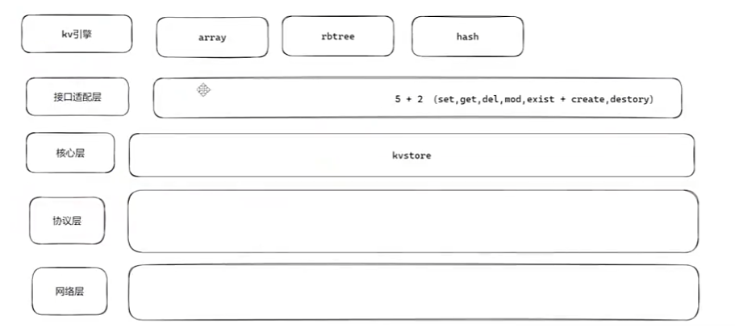

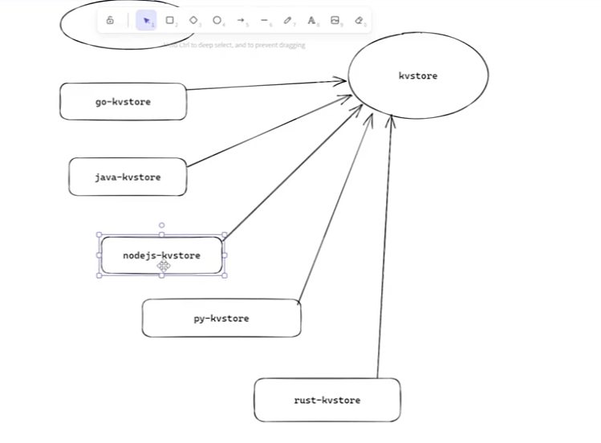

```c
#include <stdio.h>
#include <string.h>
#include <stdlib.h>
#include <arpa/inet.h>
#include <sys/time.h>
#include <unistd.h>
#include <pthread.h>

#define MAX_MSG_LENGTH 1024
#define TIME_SUB_MS(tv1, tv2) ((tv1.tv_sec - tv2.tv_sec) * 1000 + (tv1.tv_usec - tv2.tv_usec) / 1000)

int send_msg(int connfd, char *msg, int length)
{

    int res = send(connfd, msg, length, 0);
    if (res < 0)
    {
        perror("send");
        exit(1);
    }
    return res;
}

int recv_msg(int connfd, char *msg, int length)
{

    int res = recv(connfd, msg, length, 0);
    if (res < 0)
    {
        perror("recv");
        exit(1);
    }
    return res;
}

void testcase(int connfd, char *msg, char *pattern, char *casename)
{

    if (!msg || !pattern || !casename)
        return;

    send_msg(connfd, msg, strlen(msg));

    char result[MAX_MSG_LENGTH] = {0};
    recv_msg(connfd, result, MAX_MSG_LENGTH);

    if (strcmp(result, pattern) == 0)
    {
        printf("==> PASS ->  %s\n", casename);
    }
    else
    {
        printf("==> FAILED -> %s, '%s' != '%s' \n", casename, result, pattern);
        exit(1);
    }
}

// 基本功能测试用例
void array_testcase(int connfd)
{
    printf("\n=== 开始基本功能测试 ===\n\n");

    testcase(connfd, "SET Teacher King", "OK\r\n", "SET-Teacher");
    testcase(connfd, "GET Teacher", "King\r\n", "GET-Teacher");
    testcase(connfd, "MOD Teacher Darren", "OK\r\n", "MOD-Teacher");
    testcase(connfd, "GET Teacher", "Darren\r\n", "GET-Teacher");
    testcase(connfd, "EXIST Teacher", "EXIST\r\n", "EXIST-Teacher");
    testcase(connfd, "DEL Teacher", "OK\r\n", "DEL-Teacher");
    testcase(connfd, "GET Teacher", "NOT FOUND\r\n", "GET-Teacher-NotExist");

    printf("\n=== 基本功能测试完成 ===\n");
}

void array_testcase_1w(int connfd)
{

    int count = 10000;
    int i = 0;

    struct timeval tv_begin;
    gettimeofday(&tv_begin, NULL);
    printf("\n=== 开始压力测试（1万次） ===\n\n");
    for (i = 0; i < count; i++)
    {

        // 定义测试数据

        printf("测试序列第 %d 轮\n", i + 1);
        testcase(connfd, "SET Teacher King", "OK\r\n", "SET-Teacher");
        testcase(connfd, "GET Teacher", "King\r\n", "GET-Teacher");
        testcase(connfd, "MOD Teacher Darren", "OK\r\n", "MOD-Teacher");
        testcase(connfd, "GET Teacher", "Darren\r\n", "GET-Teacher");
        testcase(connfd, "EXIST Teacher", "EXIST\r\n", "EXIST-Teacher");
        testcase(connfd, "DEL Teacher", "OK\r\n", "DEL-Teacher");
        testcase(connfd, "GET Teacher", "NOT FOUND\r\n", "GET-Teacher-NotExist");
    }

    struct timeval tv_end;
    gettimeofday(&tv_end, NULL);

    int time_used = TIME_SUB_MS(tv_end, tv_begin); // ms

    printf("array testcase --> time_used: %d, qps: %d\n", time_used, 90000 * 1000 / time_used);
}

// rbtree测试用例
void rbtree_testcase(int connfd)
{
    printf("\n=== 开始红黑树功能测试 ===\n\n");

    testcase(connfd, "RSET Teacher King", "OK\r\n", "RSET-Teacher");
    testcase(connfd, "RGET Teacher", "King\r\n", "RGET-Teacher");
    testcase(connfd, "RMOD Teacher Darren", "OK\r\n", "RMOD-Teacher");
    testcase(connfd, "RGET Teacher", "Darren\r\n", "RGET-Teacher");
    testcase(connfd, "REXIST Teacher", "EXIST\r\n", "REXIST-Teacher");
    testcase(connfd, "RDEL Teacher", "OK\r\n", "RDEL-Teacher");
    testcase(connfd, "RGET Teacher", "NOT FOUND\r\n", "RGET-Teacher-NotExist");

    printf("\n=== 红黑树功能测试完成 ===\n");
}

void rbtree_testcase_1w(int connfd)
{

    int count = 10000;
    int i = 0;

    struct timeval tv_begin;
    gettimeofday(&tv_begin, NULL);
    printf("\n=== 开始红黑树压力测试（1万次） ===\n\n");
    for (i = 0; i < count; i++)
    {

        // 定义测试数据

        printf("测试序列第 %d 轮\n", i + 1);
        testcase(connfd, "RSET Teacher King", "OK\r\n", "RSET-Teacher");
        testcase(connfd, "RGET Teacher", "King\r\n", "RGET-Teacher");
        testcase(connfd, "RMOD Teacher Darren", "OK\r\n", "RMOD-Teacher");
        testcase(connfd, "RGET Teacher", "Darren\r\n", "RGET-Teacher");
        testcase(connfd, "REXIST Teacher", "EXIST\r\n", "REXIST-Teacher");
        testcase(connfd, "RDEL Teacher", "OK\r\n", "RDEL-Teacher");
        testcase(connfd, "RGET Teacher", "NOT FOUND\r\n", "RGET-Teacher-NotExist");
    }

    struct timeval tv_end;
    gettimeofday(&tv_end, NULL);

    int time_used = TIME_SUB_MS(tv_end, tv_begin); // ms

    printf("rbtree testcase --> time_used: %d, qps: %d\n", time_used, 90000 * 1000 / time_used);
}

/**
 * rbtree测试用例3w
 * @param connfd 连接描述符
 * @return void
 * @note 该函数执行3万次的红黑树测试用例
 */
void rbtree_testcase_3w(int connfd)
{

    int count = 30000;
    int i = 0;

    struct timeval tv_begin;
    gettimeofday(&tv_begin, NULL);

    for (i = 0; i < count; i++)
    {

        char cmd[128] = {0};
        snprintf(cmd, 128, "RSET Teacher%d King%d", i, i);
        testcase(connfd, cmd, "OK\r\n", "RSET-Teacher");
    }

    for (i = 0; i < count; i++)
    {

        char cmd[128] = {0};
        snprintf(cmd, 128, "RGET Teacher%d", i);

        char result[128] = {0};
        snprintf(result, 128, "King%d\r\n", i);

        testcase(connfd, cmd, result, "RGET-King-Teacher");
    }

    for (i = 0; i < count; i++)
    {

        char cmd[128] = {0};
        snprintf(cmd, 128, "RMOD Teacher%d King%d", i, i);
        testcase(connfd, cmd, "OK\r\n", "RGET-King-Teacher");
    }
    //del
	for (i = 0;i < count;i ++) {
		char cmd[128] = {0};
		snprintf(cmd, 128, "RDEL Teacher%d", i);
		testcase(connfd, cmd, "OK\r\n", "RDEL-Teacher");
		
	}


    struct timeval tv_end;
    gettimeofday(&tv_end, NULL);

    int time_used = TIME_SUB_MS(tv_end, tv_begin); // ms

    printf("rbtree testcase --> time_used: %d, qps: %d\n", time_used, 30000 * 1000 / time_used);
}

void hash_testcase(int connfd)
{
    printf("\n=== 开始哈希表功能测试 ===\n\n");

    testcase(connfd, "HSET Teacher King", "OK\r\n", "HSET-Teacher");
    testcase(connfd, "HGET Teacher", "King\r\n", "HGET-Teacher");
    testcase(connfd, "HMOD Teacher Darren", "OK\r\n", "HMOD-Teacher");
    testcase(connfd, "HGET Teacher", "Darren\r\n", "HGET-Teacher");
    testcase(connfd, "HEXIST Teacher", "EXIST\r\n", "HEXIST-Teacher");
    testcase(connfd, "HDEL Teacher", "OK\r\n", "HDEL-Teacher");
    testcase(connfd, "HGET Teacher", "NOT FOUND\r\n", "HGET-Teacher-NotExist");

    printf("\n=== 哈希表功能测试完成 ===\n");
}

void hash_testcase_1w(int connfd)
{

    int count = 10000;
    int i = 0;

    struct timeval tv_begin;
    gettimeofday(&tv_begin, NULL);
    printf("\n=== 开始哈希表压力测试（1万次） ===\n\n");
    for (i = 0; i < count; i++)
    {

        // 定义测试数据

        printf("测试序列第 %d 轮\n", i + 1);
        testcase(connfd, "HSET Teacher King", "OK\r\n", "HSET-Teacher");
        testcase(connfd, "HGET Teacher", "King\r\n", "HGET-Teacher");
        testcase(connfd, "HMOD Teacher Darren", "OK\r\n", "HMOD-Teacher");
        testcase(connfd, "HGET Teacher", "Darren\r\n", "HGET-Teacher");
        testcase(connfd, "HEXIST Teacher", "EXIST\r\n", "HEXIST-Teacher");
        testcase(connfd, "HDEL Teacher", "OK\r\n", "HDEL-Teacher");
        testcase(connfd, "HGET Teacher", "NOT FOUND\r\n", "HGET-Teacher-NotExist");
    }

    struct timeval tv_end;
    gettimeofday(&tv_end, NULL);

    int time_used = TIME_SUB_MS(tv_end, tv_begin); // ms

    printf("hash testcase --> time_used: %d, qps: %d\n", time_used, 90000 * 1000 / time_used);
}

void hash_testcase_3w(int connfd)
{

    int count = 30000;
    int i = 0;

    struct timeval tv_begin;
    gettimeofday(&tv_begin, NULL);

    for (i = 0; i < count; i++)
    {

        char cmd[128] = {0};
        snprintf(cmd, 128, "HSET Teacher%d King%d", i, i);
        testcase(connfd, cmd, "OK\r\n", "HSET-Teacher");
    }

    for (i = 0; i < count; i++)
    {

        char cmd[128] = {0};
        snprintf(cmd, 128, "HGET Teacher%d", i);

        char result[128] = {0};
        snprintf(result, 128, "King%d\r\n", i);

        testcase(connfd, cmd, result, "HGET-King-Teacher");
    }

    for (i = 0; i < count; i++)
    {

        char cmd[128] = {0};
        snprintf(cmd, 128, "HMOD Teacher%d King%d", i, i);
        testcase(connfd, cmd, "OK\r\n", "HMOD-King-Teacher");
    }
    //del
    for (i = 0;i < count;i ++) {
        char cmd[128] = {0};
        snprintf(cmd, 128, "HDEL Teacher%d", i);
        testcase(connfd, cmd, "OK\r\n", "HDEL-Teacher");
        
    }

    struct timeval tv_end;
    gettimeofday(&tv_end, NULL);

    int time_used = TIME_SUB_MS(tv_end, tv_begin); // ms

    printf("hash testcase --> time_used: %d, qps: %d\n", time_used, 30000 * 1000 / time_used);
}


int connect_tcpserver(const char *ip, unsigned short port)
{

    int connfd = socket(AF_INET, SOCK_STREAM, 0);

    struct sockaddr_in server_addr;
    memset(&server_addr, 0, sizeof(struct sockaddr_in));

    server_addr.sin_family = AF_INET;
    server_addr.sin_addr.s_addr = inet_addr(ip);
    server_addr.sin_port = htons(port);

    if (0 != connect(connfd, (struct sockaddr *)&server_addr, sizeof(struct sockaddr_in)))
    {
        perror("connect");
        return -1;
    }

    return connfd;
}

// testcase 192.168.229.133  2000
int main(int argc, char *argv[])
{

    if (argc != 4)
    {
        printf("arg error\n");
        return -1;
    }

    char *ip = argv[1];
    int port = atoi(argv[2]);
    int mode = atoi(argv[3]);

    int connfd = connect_tcpserver(ip, port);

    if (mode == 0)
    {
        array_testcase(connfd);
    }
    else if (mode == 1)
    {
        array_testcase_1w(connfd);
    }
    else if (mode == 2)
    {
        rbtree_testcase(connfd);
    }
    else if (mode == 3)
    {
        rbtree_testcase_1w(connfd);
    }
    else if (mode == 4)
    {
        rbtree_testcase_3w(connfd);
    }
    else if (mode == 5)
    {
        hash_testcase(connfd);
    }
    else if (mode == 6)
    {
        hash_testcase_1w(connfd);
    }
    else if (mode == 7)
    {
        hash_testcase_3w(connfd);
    }
    else
    {
        printf("mode error\n");
        close(connfd);
        return -1;
    }

    return 0;
}
```


> 思考面试题：
>
> 1. kvstore为什么单线程？多线程？
> 2. 如何要实现一个范围查询？实现什么数据结构--kv引擎
> 3. kv存储的内存管理是实现？内存池


---


