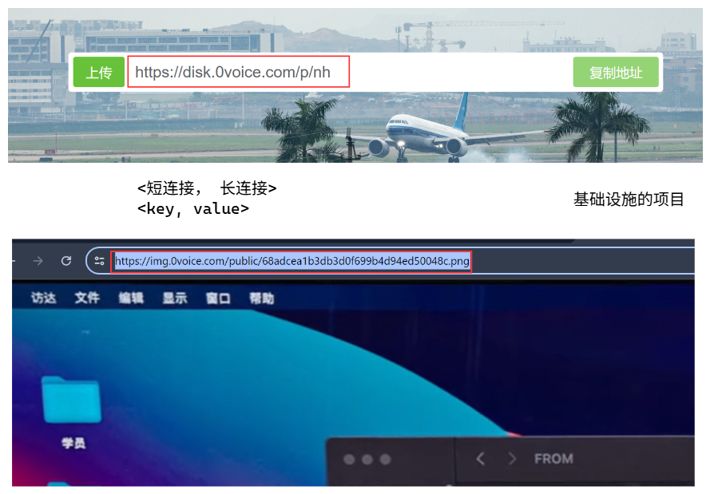

# 项目学习记录

## 【项目一】KV存储项目


### 1.1 kv存储的架构设计

#### 一、前情回顾


> 前面我们的学习主要还是集中在网络实现部分，所以我们就要来讨论讨论后续的项目了


#### 二、kv存储引入

> 首先，我们需要知道一个事情就是，我们的类似于通讯录，学生管理系统这种简单的小项目进行数据存储的时候，本质上使用到的是**表格**的形式，这种方式的话，每一条数据的每一个参数都存在——ID, 姓名，年龄，性别，手机号码，身份证号码等。
>
> **本质上是一种关系型数据库**


> 而对于我们的kv存储的形式而言的话，数据结构的组成方式如下：
>
> ---
>
> <key> - <value>
> ID, <姓名，年龄，性别，手机号码，身份证号码>
>
> ---
>
> 常见在以下这些：
>
> 


==那我们在什么地方是使用这种kv存储呢！！！==

让我们以图床项目举例：



> 上述流程——简单来说就是要做一个短连接向长连接的转换！！！！
>
> 简单来说就是造轮子，进行基础设施的搭建的项目开发。
>
> 这就是！！！！==中间件团队！！！==
>
> 所以说这部分要好好学！！！


> 问题来了：
>
> #### 既然已经有了Redis了，为什么要有kv存储这个项目呢？
>
> 


#### 三、kv存储项目拆解

> 我们这样一个架构的话，本质上可以理解为作为中间件，所以他跟我们的业务层之间如果要通信的话——**这边需要有一个网络层**
>
> 1. 简单来说就是跟我们的节点，可以进行tcp通信这样，要预留节点。
> 2. 可以创建多个服务器，都可以跟我们的kv存储进行一个通信。
>
> 
>
> ---
>
> 我们以问卷调查举例的话：
>
> 当我们进行一个网页的问卷调查的打开，可能说我们会半个小时之后才发送我们的问卷调查的结果，怎么样将我们的结果保存到本地的呢。
>
> > 首先就是我们的浏览器会有一个cookie保存下来，我们的服务器也有一个session保存，两者就是key-value的关系，所以说可以保存下来，后面可以查询。


#### 四、架构问题——reactor实现

> ### 针对网络架构问题
>
> 首先是否有线程的网络架构呢，下面这些都是：
>
> 1. libevent
> 2. muduo
> 3. ACE
> 4. Qt
> 5. boost
>
> 但是我们决定根据之前实现的来做：
>
> ```bash
> git clone git@gitlab.0voice.com:2404_vip/2.1.1-network-io.git
> ```
>
> 先将之前的reactor实现网络给git下来：
>
> 1. reactor  来做kvstore的网络框架
> 2. ntyco
>
> 修改几个地方以后
>
> ```bash
> gcc -mcmodel=large kv_reactor.c -o kv_reactor
> ```
>
> 


****


> ### 设计模式
>
> 
>
> **这边在**reactor中我们可以这样做，本质上我们实现这样的功能有几种方案：
>
> 1. **过滤器方案：**我们根据输入的数据类型，判断他是哪种类的，然后使用哪种方案
> 2. **观察者模式：**观察我们输入的数据类型，然后决定使用哪种


```bash
gcc kvstore.c ./tcp/reactor.c -I ./tcp -o kvstore -mcmodel=large
```

这个就是我们最终的编译代码！！！

​	


修改完这样之后，本质上我们已经完成了网络部分的搭建，使用reactor.


---


#### 五、架构问题——协程的实现


```bash
zhenxing@ubuntu:~/share/FindingWork/projects/project1_kv/zzx_kvstore$ gcc hook_tcpserver.c -I NtyCo/core/ -L ./NtyCo/ -o hook_tcpserver  -lpthread -ldl -lntyco

zhenxing@ubuntu:~/share/FindingWork/projects/project1_kv/zzx_kvstore$ ls
hook_tcpserver  hook_tcpserver.c  kv_reactor.c  kvstore  kvstore.c  kvstore.h  NtyCo  tcp

zhenxing@ubuntu:~/share/FindingWork/projects/project1_kv/zzx_kvstore$ ./hook_tcpserver
Segmentation fault

zhenxing@ubuntu:~/share/FindingWork/projects/project1_kv/zzx_kvstore$ ./hook_tcpserver 2000
listen port : 2000

```


这是启动hook的tcp协程server，我们还可以迁移我们的kvstore过来：

```c
/**
 * @param msg  request message
 * @param length length of the request message
 * @param responese buffer to store the response message
 * @return  length of the response message
 */
int kvs_protocol(char *msg, int length, char *responese)
{
    printf("recv %d : %s\n", length, msg);
}

```


同时要在hook_tcpserver中添加这样的定义：

```c
extern int kvs_protocol(char *msg, int length, char *responese);
```


修改头文件引用，简化我们的编译代码流程：

```c
#include "./tcp/server.h"

#include "./NtyCo/core/nty_coroutine.h"
```


添加完之后进行编译：

```bash
zhenxing@ubuntu:~/share/FindingWork/projects/project1_kv/zzx_kvstore$ gcc hook_tcpserver.c kvstore.c  -L ./NtyCo/ -lntyco -o hook_tcpserver  -lpthread -ldl

zhenxing@ubuntu:~/share/FindingWork/projects/project1_kv/zzx_kvstore$ ./hook_tcpserver 2000

```


---


#### 六、架构问题——io-uring的实现

==**首先还是io-uring的使用，我们首先需要确保我们虚拟机的内核版本>=5.5, `uname -a`查看**==


之后就编译运行：

```bash
zhenxing@newkernel:~/share/FindingWork/projects/project1_kv/zzx_kvstore/io_uring$ gcc uring_tcp_server.c -o uring_tcp_server -luring -static

zhenxing@newkernel:~/share/FindingWork/projects/project1_kv/zzx_kvstore/io_uring$ ./uring_tcp_server
set_event_recv ret: 32, http://www.cmsoft.cn QQ:10865600
set_event_recv ret: 32, http://www.cmsoft.cn QQ:10865600
set_event_recv ret: 32, http://www.cmsoft.cn QQ:10865600
set_event_recv ret: 32, http://www.cmsoft.cn QQ:10865600

```


这边为了接入kvs协议，我们需要做几个修改：

- 修改iouring

```c
else if (result.event == EVENT_READ)
			{
				int ret = entries->res;
				if (ret == 0)
				{
					close(result.fd);
					// 不打印buffer内容，防止显示旧内容
					printf("set_event_recv ret: 0, <connection closed>\n");
				}
				else if (ret > 0)
				{
					// 先清空buffer，防止短包后残留
					buffer[ret] = '\0'; // 保证字符串结束
					//printf("set_event_recv ret: %d, %s\n", ret, buffer);

					// 调用kvs_protocol处理请求
					ret = kvs_protocol(buffer, ret, response);

					set_event_send(&ring, result.fd, response, ret, 0);
				}
			}
```


将原本不必要的代码挪到reactor中：

```c
#define ENABLE_KVSTORE 1

#if ENABLE_KVSTORE

extern int kvs_protocol(char *msg, int length, char *responese);


int kvs_request(struct conn *c)
{
    printf("recv %d : %s\n", c->rlength, c->rbuffer);
    c->wlength = kvs_protocol(c->rbuffer, c->rlength, c->wbuffer);
}

int kvs_response(struct conn *c)
{
}


#endif
```


在kvstore中添加部分代码：

```c
int kvs_protocol(char *msg, int length, char *responese)
{
    printf("recv %d : %s\n", length, msg);
    memcpy(responese, msg, length);
    return strlen(responese); // return the length of the response message
}


```


本质上我们就是要实现对于我们的网络层要保证可以实现跨平台了，其他的业务逻辑无所谓。


---


#### 七、架构抽象改造

编译方式对比，这几个方法都是做到了百万并发的，他的性能是得到了印证了的。

> gcc kvstore.c kv_reactor.c -I ./tcp -o kvstore_reactor -mcmodel=large

> gcc hook_tcpserver.c kvstore.c  -L ./NtyCo/ -lntyco -o kvstore_Ntyco  -lpthread -ldl

> gcc -o  kvstore_iouring kvstore.c ./io_uring/uring_tcp_server.c -luring -static


> 1. main --> 网络框架
> 2. 协议处理 --> kvstore.c
>
> 我们需要思考一下，我们的main需要放在哪里！！！
>
> ==**必须放在kvstore.c**==
>
> 我们的底层网络需要完全抽象，
>
> main当中只传入协议以及port


##### 1. 修改reactor

> 首先修改reactor，先将main函数修改掉：
>
> ```c
> int reactor_start(unsigned short port, msg_handler handler) {
> 	kvs_handler = handler;
> }
> 
> ```
>
> 之后要修改一些定义，传入一个函数指针，
>
> ```c
> #if ENABLE_KVSTORE
> 
> typedef int(*msg_handler)(char *msg, int length, char *responese);
> 
> static msg_handler kvs_handler;
> 
> int kvs_request(struct conn *c)
> {
>     printf("recv %d : %s\n", c->rlength, c->rbuffer);
>     c->wlength = kvs_handler(c->rbuffer, c->rlength, c->wbuffer);
> }
> 
> int kvs_response(struct conn *c)
> {
> }
> 
> #endif
> ```
>
> 我们还要修改我们的kvstore的代码部分：
>
> ```c
> extern int reactor_start(unsigned short port, msg_handler handler);
> 
> if (argc != 2)
>     {
>         printf("Usage: %s <port>\n", argv[0]);
>         return -1; // Invalid arguments
>     }
>     else
>     {
>     #if ENABLE_REACTOR // Reactor-based server
>         
>     unsigned short port = (unsigned short)atoi(argv[1]);
>     printf("Starting reactor on port %d\n", port);
>     reactor_start(port, kvs_protocol);
> 
>     #elif ENABLE_NTYCO // NtyCo-based server
> 
>     #elif ENABLE_IOURING // io_uring-based server
> 
>     #endif
>     }
> ```
>
> 


##### 2. 修改ntyco

> ```c
> int ntyco_satrt(unsigned short port,  msg_handler handler) {
> 	// if(argc != 2) {
> 	// 	printf("Usage: %s <port>\n", argv[0]);
> 	// 	return 1;
> 	// }
> 
> 	// int port = atoi(argv[1]);
> 
> 	kvs_handler = handler;
> 	
> 	nty_coroutine *co = NULL;
> 	nty_coroutine_create(&co, server, &port);
> 
> 	nty_schedule_run();
> 
> }
> 
> ```
>
> 修改定义：
>
> ```c
> #if ENABLE_KVSTORE
> 
> 
> typedef int(*msg_handler)(char *msg, int length, char *responese);
> 
> static msg_handler kvs_handler;
> 
> 
> #endif
> ```
>
> 修改句柄引用：
>
> ```c
> int slength = kvs_handler(buf, ret, response);
> ```
>
> 修改kv主函数引用：
>
> ```c
> else
>     {
>     unsigned short port = (unsigned short)atoi(argv[1]);
>     
>     #if ENABLE_REACTOR // Reactor-based server
> 
>     printf("Starting reactor on port %d\n", port);
>     reactor_start(port, kvs_protocol);
> 
>     #elif ENABLE_NTYCO // NtyCo-based server
>     printf ("Starting NtyCo server on port %d\n", port);
>     ntyco_start(port, kvs_protocol);
> 
>     #elif ENABLE_IOURING // io_uring-based server
> 
>     #endif
>     }
> ```
>
> 


##### 3. 修改iouring

同样类似的做法，

最终效果：

```c
else
    {
    unsigned short port = (unsigned short)atoi(argv[1]);
    
    #if ENABLE_REACTOR // Reactor-based server

    printf("Starting reactor on port %d\n", port);
    reactor_start(port, kvs_protocol);

    #elif ENABLE_NTYCO // NtyCo-based server
    printf ("Starting NtyCo server on port %d\n", port);
    ntyco_start(port, kvs_protocol);

    #elif ENABLE_IOURING // io_uring-based server
    printf("Starting io_uring server on port %d\n", port);
    iouring_start(port, kvs_protocol);
    #endif
    }
```


##### 4. 修改整理文件

> `gcc -o kvstore_reactor kvstore.c kv_reactor.c  -mcmodel=large`

> `gcc -o kvstore_ntyco kvstore.c kv_ntyco.c -L ./NtyCo/ -lntyco -lpthread -ldl`

> `gcc -o  kvstore_iouring kvstore.c kv_iouring.c -luring -static`


```C
#define ENABLE_REACTOR 0
#define ENABLE_NTYCO 1
#define ENABLE_IOURING 2

#define NETWORK_SELECT ENABLE_NTYCO


else
    {
    unsigned short port = (unsigned short)atoi(argv[1]);
    
    #if (NETWORK_SELECT == ENABLE_REACTOR) // Reactor-based server

    printf("Starting reactor on port %d\n", port);
    reactor_start(port, kvs_protocol);

    #elif (NETWORK_SELECT == ENABLE_NTYCO) // NtyCo-based server
    printf ("Starting NtyCo server on port %d\n", port);
    ntyco_start(port, kvs_protocol);

    #elif (NETWORK_SELECT == ENABLE_IOURING) // io_uring-based server
    printf("Starting io_uring server on port %d\n", port);
    iouring_start(port, kvs_protocol);

    #endif

    }
```


最终编译

```bash
zhenxing@newkernel:~/share/FindingWork/projects/project1_kv/zzx_kvstore$ gcc -o kvstore_all kvstore.c kv_reactor.c kv_ntyco.c kv_iouring.c \
    -L ./NtyCo/ -lntyco -lpthread -ldl -Wl,-Bstatic -luring -Wl,-Bdynamic
```

简单来说  我们的iouring库需要静态编译谢谢

`-Wl,-Bstatic -luring`


> ### **`liburing.so` 是静态链接的（但文件格式是动态库）**
>
> - 你的 `ldd /usr/lib/liburing.so` 显示 `statically linked`，说明这个 `.so` 文件实际上是 **静态编译的动态库**（即内部包含静态链接的代码）。
> - 当你用 `-Wl,-Bstatic -luring -Wl,-Bdynamic` 时，`liburing` 被 **强制静态链接**，避免了动态库加载问题。
> - 但当你用纯动态链接（`-luring`）时，`liburing.so` 可能 **依赖某些静态编译的符号**，导致运行时 `Segmentation Fault`。


---


#### 八、kvstore的协议实现

> 这边就是如果我们通过发送：
>
> ```bash
> SET Teacher King
> ```
>
> 我们后面需要怎么处理这样的kv对呢！！


我们可以仿着Key-Value来自己做一个

> 主要协议指令如下：
>
> > `SET Key Value`
> >
> > `GET Key\\192.168.229.131`
> >
> > `DEL Key`
> >
> > `MOD Key ValueEXIST Key`
> >
> > `EXIST Key`


---


### 1.2 网络同步与事务序列化

简单来说就是我们要构建一个自己的私有协议


---


> **tcp的分包粘包问题**
>
> 
>
> 简单来说，就是我们接收到的数据包，可能不是我们实际的一次发送的数据长度==length==
>
> 
>
> 基于上面的特性来说，我们可以考虑在我们的tcp包的包头通过两个字节
>
> 来表示我们接下来的包的长度！！！具体实现如下：
>
> 
>
> ==ET还是LT？==
>
> 两种方案都能做，但是做法不一样
>
> ---
>
> 当然也可以使用类似于Redis的协议的方法：
>
> 
>
> 几个字符  每个字符的长度这种！
>
> 最终就是类似于这样的：
>
> 
>
> 

