# 25年2月28日

## 手写一个简单版的vector

### 一、Vector的核心功能

- 动态数组，自动扩容
- 随机访问（O(1)时间复杂度）
- 部插入/删除（O(1)均摊时间）
- 支持迭代器
- 深拷贝语义

### 二、代码实现

```c++
#include <iostream>
#include <cassert>

// 步骤 2.1：定义模板类
template <typename T>
class Vector {
private:
    T* data_ = nullptr;       // 数据指针
    size_t size_ = 0;         // 当前元素数量
    size_t capacity_ = 0;     // 当前分配的内存容量

public:
    // 默认构造函数
    Vector() = default;

    // 析构函数
    ~Vector() {
        delete[] data_;
    }


    //==========================================================
    // 步骤 2.2：实现push_back和扩容
    void push_back(const T& value) {
        if (size_ >= capacity_) {
            // 扩容策略：容量为0时设为1，否则翻倍
            size_t new_cap = (capacity_ == 0) ? 1 : capacity_ * 2;
            reserve(new_cap);
        }
        data_[size_++] = value; // 在尾部插入元素
    }
  
    void reserve(size_t new_cap) {
        if (new_cap > capacity_) {
            T* new_data = new T[new_cap]; // 分配新内存
            // 复制旧数据到新内存
            for (size_t i = 0; i < size_; ++i) {
                new_data[i] = data_[i];
            }
            delete[] data_;      // 释放旧内存
            data_ = new_data;
            capacity_ = new_cap;
        }
    }
    //==========================================================


    //==========================================================
    // 步骤 3.1：拷贝构造函数
    Vector(const Vector& other) {
        data_ = new T[other.capacity_];
        size_ = other.size_;
        capacity_ = other.capacity_;
        for (size_t i = 0; i < size_; ++i) {
            data_[i] = other.data_[i]; // 深拷贝元素
        }
    }
  
    Vector& operator=(Vector other) { // 传值调用，直接复用拷贝构造
        swap(other);
        return *this;
    }
  
    // 步骤 3.2：拷贝赋值运算符（使用copy-and-swap惯用法）
    void swap(Vector& other) noexcept {
        std::swap(data_, other.data_);
        std::swap(size_, other.size_);
        std::swap(capacity_, other.capacity_);
    }

    Vector& operator=(Vector other) { // 传值调用，直接复用拷贝构造
        swap(other);
        return *this;
    }
  
    void swap(Vector& other) noexcept {
        std::swap(data_, other.data_);
        std::swap(size_, other.size_);
        std::swap(capacity_, other.capacity_);
    }
    //==========================================================


    //==========================================================
    //步骤 3.3：移动构造函数和移动赋值
    // 移动构造函数
    Vector(Vector&& other) noexcept 
    : data_(other.data_), size_(other.size_), capacity_(other.capacity_) {
    other.data_ = nullptr;
    other.size_ = 0;
    other.capacity_ = 0;
    }

    // 移动赋值运算符
    Vector& operator=(Vector&& other) noexcept {
    if (this != &other) {
        delete[] data_;
        data_ = other.data_;
        size_ = other.size_;
        capacity_ = other.capacity_;
        other.data_ = nullptr;
        other.size_ = 0;
        other.capacity_ = 0;
    }
    return *this;
    }
    //==========================================================


    //==========================================================
    //4. 完善元素访问与迭代器
    //步骤 4.1：operator[]和at()
    T& operator[](size_t index) {
        return data_[index];
    }
  
    const T& operator[](size_t index) const {
        return data_[index];
    }
  
    T& at(size_t index) {
        if (index >= size_) {
            throw std::out_of_range("Index out of range");
        }
        return data_[index];
    }
    //==========================================================


    //==========================================================
    //步骤 4.2：迭代器支持
    using iterator = T*;
    using const_iterator = const T*;

    iterator begin() { return data_; }
    iterator end() { return data_ + size_; }
    const_iterator begin() const { return data_; }
    const_iterator end() const { return data_ + size_; }
    //==========================================================

    //==========================================================
    // 5. 高级操作：insert、erase和emplace_back
    // 步骤 5.1：insert实现
    iterator insert(iterator pos, const T& value) {
        size_t offset = pos - begin();
        if (size_ >= capacity_) {
            reserve(capacity_ == 0 ? 1 : capacity_ * 2);
        }
        pos = begin() + offset; // 防止扩容后迭代器失效
        // 将pos后的元素后移
        for (auto it = end(); it > pos; --it) {
            *it = std::move(*(it - 1));
        }
        *pos = value;
        ++size_;
        return pos;
    }

    //步骤 5.2：erase实现
    iterator erase(iterator pos) {
        if (pos < begin() || pos >= end()) {
            throw std::out_of_range("Invalid iterator");
        }
        // 将pos后的元素前移
        std::move(pos + 1, end(), pos);
        --size_;
        return pos;
    }

    //步骤 5.3：emplace_back（完美转发）
    template <typename... Args>
    void emplace_back(Args&&... args) {
        if (size_ >= capacity_) {
            reserve(capacity_ == 0 ? 1 : capacity_ * 2);
        }
        // 在尾部直接构造对象
        new(data_ + size_) T(std::forward<Args>(args)...);
        ++size_;
    }
    //==========================================================
    // 6. 边界处理与优化
    // 步骤 6.1：pop_back和clear
    void pop_back() {
        if (size_ > 0) {
            --size_;
            data_[size_].~T(); // 显式调用析构函数（对非POD类型必要）
        }
    }
  
    void clear() {
        size_ = 0;
    }

    // 步骤 6.2：resize实现
    void resize(size_t new_size, const T& value = T()) {
        if (new_size > size_) {
            reserve(new_size);
            for (size_t i = size_; i < new_size; ++i) {
                data_[i] = value;
            }
        }
        size_ = new_size;
    }
    //==========================================================


    //==========================================================
    // 基础功能占位
    size_t size() const { return size_; }
    size_t capacity() const { return capacity_; }
    bool empty() const { return size_ == 0; }
};


// 步骤 2.3：测试基础功能
void test1_base(){
    Vector<int> v;
    v.push_back(1);
    v.push_back(2);
    assert(v.size() == 2);
    assert(v.capacity() == 2);
}

void test2_up(){
    Vector<int> v;
    v.push_back(1);
    v.emplace_back(2);
    assert(v.size() == 2);

    Vector<int> v2 = v; // 测试拷贝构造
    assert(v2[0] == 1);

    v.insert(v.begin(), 0);
    assert(v[0] == 0);

    v.erase(v.begin());
    assert(v[0] == 1);
}

int main(){
    test1_base();
    // test2_up();
    return 0;
}
```

# 25年2月29日

## 网络IO与IO多路复用

```cpp
#include <iostream>
int main()
{
    return 0;
}
```

首先思考这个代码是怎么被执行的

### 一、网络IO

这边补充说一下不同地址的问题

```
(base) zzx@zzx:~/Finding_work/2.1.1-multi-io$ ifconfig
eno1: flags=4163<UP,BROADCAST,RUNNING,MULTICAST>  mtu 1500
        inet 192.168.1.122  netmask 255.255.255.0  broadcast 192.168.1.255
        inet6 fe80::82e8:2cff:fe29:ef0e  prefixlen 64  scopeid 0x20<link>
        ether 80:e8:2c:29:ef:0e  txqueuelen 1000  (以太网)
        RX packets 90954  bytes 134647431 (134.6 MB)
        RX errors 0  dropped 0  overruns 0  frame 0
        TX packets 43593  bytes 3238996 (3.2 MB)
        TX errors 0  dropped 0 overruns 0  carrier 0  collisions 0

lo: flags=73<UP,LOOPBACK,RUNNING>  mtu 65536
        inet 127.0.0.1  netmask 255.0.0.0
        inet6 ::1  prefixlen 128  scopeid 0x10<host>
        loop  txqueuelen 1000  (本地环回)
        RX packets 263  bytes 25795 (25.7 KB)
        RX errors 0  dropped 0  overruns 0  frame 0
        TX packets 263  bytes 25795 (25.7 KB)
        TX errors 0  dropped 0 overruns 0  carrier 0  collisions 0

wlo1: flags=4163<UP,BROADCAST,RUNNING,MULTICAST>  mtu 1500
        inet 192.168.1.116  netmask 255.255.255.0  broadcast 192.168.1.255
        inet6 fe80::d16d:f3a0:7b8f:6ede  prefixlen 64  scopeid 0x20<link>
        ether d4:d2:52:a8:61:19  txqueuelen 1000  (以太网)
        RX packets 1354  bytes 103934 (103.9 KB)
        RX errors 0  dropped 0  overruns 0  frame 0
        TX packets 330  bytes 33241 (33.2 KB)
        TX errors 0  dropped 0 overruns 0  carrier 0  collisions 0

```

> 这边eno1是我们跟外部设备通信的地址，例如我现在用ssh连接。
>
> lo：回环地址则是内部线程之间通信使用到的地址，
>
> any 0.0.0.0：这个则是我们不知道用什么就写这个

### 二、初始化写一个TCP连接

```c
#include <sys/socket.h>     // 套接套接字操作相关函数和数据结构
#include <errno.h>          // 错误码定义（如errno）
#include <netinet/in.h>     // IPv4地址结构sockaddr_in定义

#include <stdio.h>
#include <string.h>
#include <unistd.h>


// tcp
int main()
{
    int sockfd = socket(AF_INET, SOCK_STREAM, 0);   
    struct sockaddr_in serveraddr;

    // 将serveraddr结构体的所有字节置为0，避免残留数据干扰后续操作。
    // 网络编程中结构体可能存在填充字节，未清零可能导致bind()失败
    memset(&serveraddr, 0, sizeof(struct sockaddr_in));
  
    serveraddr.sin_family = AF_INET;
    serveraddr.sin_addr.s_addr = htonl(INADDR_ANY);
    serveraddr.sin_port = htons(2048);

    // bind()_绑定套接字与地址。将套接字关联到特定的IP地址和端口，使客户端能通过该地址访问服务。
    if (-1 == bind(sockfd, (struct sockaddr *)&serveraddr, sizeof(struct sockaddr)))
    {
        perror("bind");
        return -1;
    }

    // 将套接字设置为被动模式，准备接受客户端的连接请求。
    listen(sockfd, 10);
    getchar();
}

```

具体的代码解析如下：

**1.`socket()` - 创建通信端点**

```c
int sockfd = socket(AF_INET, SOCK_STREAM, 0);
```

**作用**：创建一个用于网络通信的套接字（类似文件描述符），是后续所有操作的基础。

**参数详解**

- **`AF_INET`**：指定使用IPv4协议族（Address Family）。其他常见值如 `AF_INET6`（IPv6）、`AF_UNIX`（本地通信）。
- **`SOCK_STREAM`**：指定使用面向连接的TCP协议。特点是有序、可靠、双向字节流。若使用UDP则为 `SOCK_DGRAM`。
- **`0`**：自动选择协议类型。对于TCP，等价于 `IPPROTO_TCP`；UDP则为 `IPPROTO_UDP`。

**返回值**

- **成功**：返回非负整数，即套接字描述符（类似文件句柄）。
- **失败**：返回-1，错误码存储在 `errno`中（可通过 `perror`打印）。

**类比**：就像安装了一部电话机，但尚未插线（未绑定地址）或开机（未监听）。

**2. `memset()` - 内存初始化**

```c
memset(&serveraddr, 0, sizeof(struct sockaddr_in));
```

**作用**：将 `serveraddr`结构体的所有字节置为0，避免残留数据干扰后续操作。

**关键性**：网络编程中结构体可能存在填充字节，未清零可能导致 `bind()`失败。

**参数**

- **目标地址**：`&serveraddr`。
- **填充值**：`0`（全部字节置0）。
- **长度**：`sizeof(struct sockaddr_in)`（确保覆盖整个结构体）。

**3. `bind()` - 绑定套接字与地址**

```c
bind(sockfd, (struct sockaddr *)&serveraddr, sizeof(struct sockaddr));
```

**作用**：将套接字关联到特定的IP地址和端口，使客户端能通过该地址访问服务。

**参数解析**

- **`sockfd`**：由 `socket()`返回的描述符。
- **`(struct sockaddr *)&serveraddr`**：将 `sockaddr_in`强制转换为通用地址结构体 `sockaddr`（历史原因，需统一接口）。
- **`sizeof(struct sockaddr)`**：地址结构体的大小。此处有潜在问题（应使用 `sizeof(serveraddr)`）。

**地址结构体字段**

- **`sin_family`**：必须与 `socket()`的地址族一致（此处为 `AF_INET`）。
- **`sin_addr.s_addr`**：IP地址（`INADDR_ANY`表示监听所有本地网卡）。
- **`sin_port`**：端口号（需用 `htons()`转换为网络字节序）。

**常见错误**

- **`EADDRINUSE`**：端口被占用。
- **`EACCES`**：绑定到特权端口（<1024）无root权限。

**类比**：为电话机分配电话号码（IP+端口），允许他人拨打。

**4. `listen()` - 开启监听模式**

```c
listen(sockfd, 10);
```

**作用**：将套接字设置为被动模式，准备接受客户端的连接请求。

**参数详解**

- **`sockfd`**：已绑定地址的套接字。
- **`10`**：内核维护的未完成连接队列的最大长度（实际值可能被系统调整，如Linux默认为128）。

**队列类型**

- **未完成队列（SYN队列）**：客户端发送SYN后处于 `SYN_RCVD`状态。
- **已完成队列（ACCEPT队列）**：已完成三次握手，等待 `accept()`取出。

**返回值**：成功返回0，失败返回-1（需检查错误）。

**类比**：电话机开机并设置为响铃模式，等待来电。

**5. `getchar()` - 阻塞程序退出**

```c
getchar(); // 等待用户输入
```

**作用**：防止程序立即结束，保持服务器运行以便测试。

**实际应用**：真实服务器应使用事件循环（如 `while(1)` + `accept()`）持续处理请求。

**潜在问题**：此处仅为演示，无实际连接处理逻辑。

**6. `perror()` - 打印错误信息**

```c
perror("bind"); // 输出错误原因
```

**作用**：根据 `errno`的值，输出描述性错误信息到标准错误流。

**格式**：输出“bind: 具体错误”，例如“bind: Address already in use”。

**依赖**：需包含 `errno.h`，且函数调用失败后立即使用（`errno`可能被后续调用覆盖）。

**7.函数调用关系图**

```plaintext
socket() → bind() → listen() → getchar()
           |           |
           ↓           ↓
        分配地址      开启监听
```

**8. 关键注意事项总结**

**字节序转换**：

- `htons()`：将16位端口号从主机字节序（小端/大端）转为网络字节序（大端）。
- `htonl()`：用于32位IP地址（如 `INADDR_ANY`的转换）。

**结构体类型转换**：

- `sockaddr_in`（IPv4专用）→ `sockaddr`（通用地址结构），保证接口统一。

### 三、补充接受代码

```
	// 补充接受数据部分
    struct sockaddr_in clientaddr;
    socklen_t len = sizeof(clientaddr);
    //当我们运行代码的时候首先会阻塞在这个地方，而不是阻塞在下面的getchar();
    int clientfd = accept(sockfd, (struct sockaddr *)&clientaddr, &len);

    printf("sockfd:%d\nclientfd:%d", sockfd, clientfd);
    close(clientfd);
```

 **1.`struct sockaddr_in clientaddr`**

- **作用**：定义一个IPv4地址结构体，用于存储**客户端**的连接信息（IP和端口）。
- 关键字段：
  - `sin_family`：地址族（自动填充为 `AF_INET`）。
  - `sin_port`：客户端的端口号（网络字节序）。
  - `sin_addr`：客户端的IP地址（可通过 `inet_ntoa()`转换为字符串）。

---

**2. `socklen_t len = sizeof(clientaddr)`**

- **作用**：声明一个变量表示地址结构体的大小，供 `accept()`函数使用。
- **传递方式**：必须传递指针（`&len`），因为 `accept()`可能修改此值以反映实际写入的地址大小。

---

**3. `accept()` - 接受客户端连接**

```c
int clientfd = accept(sockfd, (struct sockaddr *)&clientaddr, &len);
```

- **作用**：从监听队列中取出一个已完成的连接，并返回一个新的套接字描述符（`clientfd`）。
- 

  参数详解：

- **`sockfd`**：监听套接字（由 `socket()`创建并通过 `bind()`+`listen()`启用）。
- **`(struct sockaddr *)&clientaddr`**：存储客户端地址信息的结构体（需强制类型转换）。
- **`&len`**：输入时为地址结构体大小，输出时为实际写入的地址大小。
- 

  返回值：

- **成功**：返回一个新的套接字描述符（`clientfd`），用于与客户端通信。
- **失败**：返回-1（需检查 `errno`）。
- **阻塞机制**：若监听队列中没有已完成的连接，`accept()`会阻塞直到有客户端连接。
- **类比**：电话接线员从等待队列中接听一个来电，并为该通话分配专用线路（`clientfd`）。

---

**4. `printf()` - 打印文件描述符**

```c
printf("sockfd:%d\nclientfd:%d", sockfd, clientfd);
```

- **输出示例**：`sockfd:3` 和 `clientfd:4`。

  原因分析：

  - **文件描述符分配规则**：Linux内核按最小可用原则分配描述符。
  - 标准流占用：程序启动时自动打开三个文件描述符：
    - `0`：标准输入（stdin）
    - `1`：标准输出（stdout）
    - `2`：标准错误（stderr）
  - 套接字顺序：
    1. `socket()`创建监听套接字时，分配下一个可用的最小描述符（即3 → `sockfd=3`）。
    2. `accept()`创建连接套接字时，继续分配下一个可用值（即4 → `clientfd=4`）

### 四、具体来写接受部分代码

```c
  printf("accept\n");

  char buffer[128] = {0};

  int count = recv(clientfd, buffer, 128, 0);
```

**具体实现的时候我们会使用while来进行嵌套循环检测接受信息，但是有没有办法让我们直接写个接口，检测到就拉起处理呢?**

==有！！！！==，这边可以使用sigio，它会调用sig.handler(sigio, handler)然后拉起我们需要的实现的流程，raise起来。

ps：这个技术很老了  现在一般没有人去使用这个技术了。！！

==思考==

==这边为什么会出现我点击创建服务器，创建tcp连接发送后，关闭代码，但是出现timeout的问题，同时报错bind: Address already in use==

**问题分析：TCP服务器开发中的两个关键问题**

**问题一：`bind: Address already in use` 错误**

**问题二：`recv` 函数导致的超时**

---

**1. `recv` 函数深度解析**

```c
int count = recv(clientfd, buffer, 128, 0);
```

**函数作用**

- 从已连接的套接字（`clientfd`）接收数据，将数据存入 `buffer`。
- **类比**：类似于从水管（连接）中读取水流（数据）。

---

**参数详解**

|     参数     |                                  说明                                  |
| :----------: | :---------------------------------------------------------------------: |
| `clientfd` |               已连接的套接字描述符（由 `accept` 返回）               |
|  `buffer`  |                          存储接收数据的缓冲区                          |
|   `128`   |                       缓冲区最大容量（避免溢出）                       |
|    `0`    | 标志位（常见选项：`MSG_WAITALL`阻塞收满数据，`MSG_DONTWAIT`非阻塞） |

---

**返回值意义**

|      返回值      |                   含义                   |
| :--------------: | :---------------------------------------: |
| **`>0`** | 实际接收的字节数（可能小于请求的128字节） |
| **`0`** |   对方已关闭连接（需关闭 `clientfd`）   |
| **`-1`** |         出错（需检查 `errno`）         |

---

**2. 问题一：`bind: Address already in use` 的根源**

**原因分析**

- ==**TCP 四次挥手机制**：服务器关闭后，端口进入 **`TIME_WAIT` 状态**（默认等待2MSL，约60秒）。==
- ==**直接重启服务器**：试图绑定同一端口时，内核拒绝重用处于 `TIME_WAIT`的地址。==

---

**解决方案**

通过设置 `SO_REUSEADDR` 选项允许地址重用：

```c
int opt = 1;
setsockopt(sockfd, SOL_SOCKET, SO_REUSEADDR, &opt, sizeof(opt));
```

**代码位置**：在 `bind()` 之前调用。

---

**3. 问题二：`recv` 超时和代码卡死**

**原因分析**

- **阻塞模式默认行为**：`recv` 会无限等待数据到来。
- **客户端未发送数据**：若客户端连接后不发送数据，`recv` 永久阻塞。
- ==**未处理连接关闭**：客户端意外断开时，服务器可能卡在 `recv`。==

---

**解决方案**

**(1) 设置接收超时**

通过 `setsockopt` 设置超时时间：

```c
struct timeval tv;
tv.tv_sec = 5;  // 5秒超时
tv.tv_usec = 0;
setsockopt(clientfd, SOL_SOCKET, SO_RCVTIMEO, &tv, sizeof(tv));
```

**(2) 正确处理返回值**

```c
int count = recv(clientfd, buffer, 128, 0);
if (count > 0) {
    // 成功接收数据
} else if (count == 0) {
    // 客户端正常关闭连接
    close(clientfd);
} else {
    // 处理错误（如超时、连接重置）
    if (errno == EAGAIN || errno == EWOULDBLOCK) {
        printf("Recv timeout!\n");
    } else {
        perror("Recv error");
    }
    close(clientfd);
}
```

### 五、服务端Socket API核心解析

你的老师提到的“服务端只有这些API”，指的是用C语言开发TCP服务端必须掌握的基础系统调用。这些API构成了服务端网络通信的核心骨架，所有服务端程序都基于这些函数构建。以下是详细解析：

---

**服务端开发必备API清单**

|   API名称   |          作用          | 调用顺序 |
| :----------: | :--------------------: | :------: |
| `socket()` | 创建通信端点（套接字） |    1    |
|  `bind()`  |  绑定IP和端口到套接字  |    2    |
| `listen()` |  将套接字设为监听模式  |    3    |
| `accept()` |     接受客户端连接     |    4    |
|  `recv()`  |        接收数据        |    5    |
|  `send()`  |        发送数据        |    6    |
| `close()` |       关闭套接字       |    7    |

### **六、TCP连接的核心状态**

**TCP协议状态机** 中的关键状态，描述了TCP连接从建立到关闭的全生命周期。理解这些状态对网络编程、服务端调试、性能优化至关重要。以下是深度解析：

#### 1. 状态流转图

用一张图快速理解TCP状态流转：

```
客户端                                      服务端
  |                                          |
  |--------------- SYN -------------------->| 
  |<------------- SYN+ACK ------------------| 
  |--------------- ACK -------------------->| 
  |       (ESTABLISHED)               (ESTABLISHED)
  |                                          |
  |--------------- FIN -------------------->| 
  |<------------- ACK ----------------------| 
  |<------------- FIN ----------------------| 
  |--------------- ACK -------------------->| 
  |      (TIME_WAIT)                   (CLOSED)
```

---

#### **2. 详解每个状态**

**1. `LISTEN`（监听状态）**

- **触发条件**：服务端调用 `listen()` 后进入该状态。
- 技术含义：

  - 服务端准备好接收客户端的 `SYN` 连接请求。
  - 操作系统内核维护一个 **未完成连接队列**（存放收到SYN但未完成三次握手的连接）。
- 代码示例：

  ```c
  int sockfd = socket(AF_INET, SOCK_STREAM, 0);
  bind(sockfd, ...);
  listen(sockfd, 5);  // 进入LISTEN状态，队列最大长度为5
  ```
- 关键问题：

  - **队列溢出**：若客户端大量快速发起连接，可能导致队列满，新连接被丢弃（客户端收到 `ECONNREFUSED`）。

**2. `ESTABLISHED`（已建立连接）**

- **触发条件**：完成三次握手后，客户端和服务端均进入此状态。
- 技术含义：
  - 双方可以自由收发数据。
  - 此状态持续到某一方主动发起关闭（调用 `close()` 或发送 `FIN` 包）。
- **现实类比**：电话接通后，双方可以正常对话。

**3. `CLOSE_WAIT`（等待关闭）**

- **触发条件**：服务端收到客户端的 `FIN` 包（即客户端主动关闭），并回复 `ACK` 后进入此状态。
- 技术含义：

  - 服务端需要处理完剩余数据，再调用 `close()` 发送自己的 `FIN` 包。
  - **危险信号**：大量 `CLOSE_WAIT` 状态连接表明服务端未正确关闭套接字（代码bug）。
- 代码问题示例：

  ```c
  // 错误！收到FIN后没有调用close()
  char buffer[1024];
  recv(sockfd, buffer, sizeof(buffer), 0); // 收到0字节（FIN）
  // 忘记 close(sockfd); → 连接永远处于CLOSE_WAIT
  ```
- 解决方案：

  - 确保在代码逻辑中检测到 `recv()` 返回0时，立即关闭套接字。

**4. `TIME_WAIT`（等待计时）**

- **触发条件**：主动关闭方（先发送 `FIN` 的一方）在发送最后一个 `ACK` 后进入此状态。
- 技术含义：

  - 持续 **2MSL**（Maximum Segment Lifetime，通常为60秒）。
  - 确保网络中残留的旧数据包消失，避免影响新连接。
- 现实意义：

  - 想象挂断电话后等待几秒再离开，防止对方还有话没说完。
- 关键问题：

  - **端口占用**：短时间内大量 `TIME_WAIT` 连接可能导致端口耗尽。
  - 解决方案：

    ```c
    int opt = 1;
    setsockopt(sockfd, SOL_SOCKET, SO_REUSEADDR, &opt, sizeof(opt)); // 允许重用端口
    ```

#### **3. 其他重要状态**

**1. `SYN_SENT`（同步已发送）**

- **触发条件**：客户端调用 `connect()` 发送 `SYN` 后进入此状态。
- **技术含义**：等待服务端的 `SYN+ACK` 响应。

**2. `SYN_RECEIVED`（同步已接收）**

- **触发条件**：服务端收到 `SYN` 并发送 `SYN+ACK` 后进入此状态。
- **技术含义**：等待客户端的 `ACK` 完成三次握手。

**3. `FIN_WAIT_1` 和 `FIN_WAIT_2`**

- **触发条件**：主动关闭方发送 `FIN` 后进入 `FIN_WAIT_1`，收到 `ACK` 后进入 `FIN_WAIT_2`。
- **技术含义**：等待对方的 `FIN` 包。

#### **4. 实战调试技巧**

**1. 查看TCP状态（Linux）**

```bash
netstat -antp | grep -E 'LISTEN|ESTAB|CLOSE_WAIT|TIME_WAIT'
```

输出示例：

```
Proto Recv-Q Send-Q Local Address   Foreign Address  State       PID/Program
tcp   0      0      0.0.0.0:8080    0.0.0.0:*        LISTEN      1234/server
tcp   0      0      192.168.1.5:8080 10.0.0.3:55678   ESTABLISHED 1234/server
tcp   0      0      192.168.1.5:8080 10.0.0.3:55679   CLOSE_WAIT  1234/server
```

**2. 常见问题诊断**

|        状态        |           可能问题           |                       解决方案                       |
| :-----------------: | :---------------------------: | :---------------------------------------------------: |
| 大量 `CLOSE_WAIT` |     服务端未正确关闭连接     | 检查代码逻辑，确保 `recv() == 0` 时调用 `close()` |
| 大量 `TIME_WAIT` |      短连接频繁创建销毁      |            启用 `SO_REUSEADDR` 或连接池            |
|  大量 `SYN_RECV`  | SYN洪水攻击或服务端处理不过来 |      增加 `listen()` 队列长度，启用SYN Cookie      |

---

#### **5. 总结图表**

|       状态       |    角色    |    触发动作    |   生命周期阶段   |
| :--------------: | :--------: | :-------------: | :--------------: |
|    `LISTEN`    |   服务端   |  `listen()`  |     等待连接     |
|   `SYN_SENT`   |   客户端   |  `connect()`  |     发起连接     |
| `SYN_RECEIVED` |   服务端   |     收到SYN     |    半连接队列    |
| `ESTABLISHED` |    双方    |  完成三次握手  |     数据传输     |
|  `CLOSE_WAIT`  | 被动关闭方 |     收到FIN     |  等待应用层关闭  |
|  `TIME_WAIT`  | 主动关闭方 | 发送最后一个ACK | 等待残留数据消失 |

理解这些状态，你就能像“网络医生”一样精准诊断连接问题！

### 七、添加关闭相应

客户端关闭之后，会提示接收到一个长度为0的数据！！


添加一个结束代码

```c
char buffer[128] = {0};
int count = recv(clientfd, buffer, 128, 0);
if(count == 0){
    close(clientfd);
    break;
}
send(clientfd, buffer, count, 0);
printf("sockfd:%d\nclientfd:%d\ncount:%d\nbuffer:%s\n", sockfd, clientfd, count, buffer);
```

这也可以解决问题首先就是一直挑不出循环的问题，一直处于这个循环问题的时候准确来说是因为会有一直给进关闭的要求的问题，接受其实就是一个长度为0的请求，所以会一直循环，如果没有 `close(clientfd);`这样的操作的话，整个连接就会处于close_wait 状态，等待关闭这个嵌套字。


## 处理一个服务端对应多个客户端的问题

### 一、多线程处理这个问题

#### 1. 代码实现

```c
void *client_thread(void *arg){
    int clientfd = *(int *)arg;
    while(1){
        char buffer[128] = {0};
        int count = recv(clientfd, buffer, 128, 0);
        if(count == 0){
            break;
        }
        send(clientfd, buffer, count, 0);
        printf("clientfd:%d\ncount:%d\nbuffer:%s\n", clientfd, count, buffer);
    }
    close(clientfd);
    return NULL;
}


#else
    while(1){
        struct sockaddr_in clientaddr;
        socklen_t len = sizeof(clientaddr);
        int clientfd = accept(sockfd, (struct sockaddr *)&clientaddr, &len);
    
        pthread_t thid;
        pthread_create(&thid, NULL, client_thread, &clientfd);
    }

#endif

    getchar();
    // 不要将关闭交给服务端，否则另一边端口不会释放，会一直报Timeout
    close(sockfd);
```

这是经典的**“一连接一线程”（Thread-per-Connection）模型**，适用于中小规模并发场景。

在您提供的代码中，为每个客户端连接创建线程的操作是通过以下两行实现的：

c

```c
pthread_t thid;
pthread_create(&thid, NULL, client_thread, &clientfd);
```

这里涉及多线程编程的核心操作，但存在几个关键问题需要注意。下面详细解释这一过程及其潜在风险：

---

**1. 线程创建的基本流程**

- **`pthread_t thid`**：声明一个线程标识符变量，用于存储新线程的ID。
- **

  ```
  pthread_create
  ```

  **：实际创建线程的函数，其参数依次为：

  - **`&thid`**：线程ID的地址，创建成功后会将新线程的ID写入此处。
  - **`NULL`**：线程属性（如栈大小、调度策略等），此处使用默认值。
  - **`client_thread`**：线程入口函数，新线程启动后执行此函数。
  - **`&clientfd`**：传递给线程函数的参数，此处传递客户端文件描述符的地址。

---

#### **2. 参数传递的致命问题**

代码中直接传递了栈变量 `clientfd` 的地址（`&clientfd`），这会导致以下问题：

**2.1 数据竞争（Data Race）**

- 场景示例：
  - 主线程在 `while(1)` 循环中不断接受新连接，每次循环会覆盖 `clientfd` 的值。
  - 当线程A刚读取 `clientfd` 的值时，主线程可能已进入下一轮循环，修改了 `clientfd`，导致线程A实际处理的是另一个客户端的文件描述符。

**2.2 生命周期不匹配**

- **栈变量的短暂性**：`clientfd` 是主线程栈上的变量，其内存在循环迭代中会被重复使用。如果新线程在读取 `clientfd` 时主线程已进入下一轮循环，线程可能读取到无效或错误的值。

---

#### **3. 正确做法：动态内存分配**

为避免数据竞争和生命周期问题，应为每个线程分配独立的内存来传递参数：

- **分配内存**

```c
int *clientfd_ptr = malloc(sizeof(int));  // 动态分配内存
*clientfd_ptr = clientfd;                // 复制文件描述符的值
```

- **传递内存地址**

```c
pthread_create(&thid, NULL, client_thread, clientfd_ptr);
```

- **线程内释放内存**

在线程函数中释放内存，避免泄漏：

```c
void *client_thread(void *arg) {
    int clientfd = *(int *)arg;
    free(arg);  // 释放动态分配的内存
    // ...处理逻辑
    return NULL;
}
```

#### **4. 线程资源管理**

**4.1 分离线程（Detach）**

默认情况下，线程结束后会保留状态直到被 `pthread_join` 回收（类似进程的僵尸状态）。为避免资源泄漏，应分离线程：

```c
pthread_create(&thid, NULL, client_thread, clientfd_ptr);
pthread_detach(thid);  // 分离线程
```

**4.2 错误处理**

检查 `pthread_create` 的返回值，处理线程创建失败的情况：

```c
if (pthread_create(&thid, NULL, client_thread, clientfd_ptr) != 0) {
    perror("pthread_create failed");
    free(clientfd_ptr);  // 释放内存
    close(clientfd);     // 关闭文件描述符
}
```

---

#### **5. 完整修复后的代码片段**

```c
while(1) {
    struct sockaddr_in clientaddr;
    socklen_t len = sizeof(clientaddr);
    int clientfd = accept(sockfd, (struct sockaddr *)&clientaddr, &len);
    if (clientfd == -1) {
        perror("accept");
        continue;
    }

    // 动态分配内存传递clientfd
    int *clientfd_ptr = malloc(sizeof(int));
    *clientfd_ptr = clientfd;

    pthread_t thid;
    if (pthread_create(&thid, NULL, client_thread, clientfd_ptr) != 0) {
        perror("pthread_create failed");
        free(clientfd_ptr);
        close(clientfd);
    } else {
        pthread_detach(thid);  // 分离线程
    }
}
```

---

#### **6. 总结**

- **为何动态分配**：确保每个线程拥有独立的参数副本，避免主线程循环覆盖数据。
- **为何分离线程**：防止线程结束后资源无法回收，导致内存泄漏。
- **为何检查返回值**：及时处理系统资源不足等异常情况，增强程序健壮性。

通过以上改进，代码能够安全地处理多客户端并发连接，避免数据竞争和资源泄漏问题。


### 二、使用select、poll、epoll

#### 一、不使用多线程

首先我们要分析为什么不使用多线程的方法。

> 创建多线程的话，假设一个线程消耗8M内存，有1w个客户端同时进行连接，我们消耗的缓冲区就已经是80G了，这显然是不可以接受的!

那我们可以使用一个线程的方式来解决问题吗？

==可以！使用select、poll、epoll！==

#### 二、使用select方法

注意select方法仅适用于兼容性要求高的场景。

> select():
>
> 1. connect, select返回

> select()的缺点是什么：
>
> 1. 参数量五个很多
> 2. 每次都需要把待检测的io集合rset完全拷贝进内核
> 3. 对io的数量是有限制的。

> 性能缺陷分析：
>
> 1. io集合rset完全拷贝
> 2. io需要从头到尾遍历

代码实现：

```c
#else
    // @param maxfd: 设置内部循环的最大fd编号
    // @param rset: fd_set 本质是 1024 位的位图，用来标志这个io是否可读
    // @param wset: fd_set，用来标志这个io是否可写
    // @param eset: fd_set，用来标志这个io是否可读
    // @param timeout: 超时控制
    // *int nready = select(maxfd, rset, wset,eset,timeout)这个函数需要五个参数

    fd_set rfds, rset;
    FD_ZERO(&rfds);
    FD_SET(sockfd, &rfds);

    int maxfd = sockfd;

    printf("loop\n");
    while (1)
    {
        rset = rfds;
        int nready = select(maxfd + 1, &rset, NULL, NULL, NULL);
        if (FD_ISSET(sockfd, &rset))
        {
            struct sockaddr_in clientaddr;
            socklen_t len = sizeof(clientaddr);
            int clientfd = accept(sockfd, (struct sockaddr *)&clientaddr, &len);

            printf("sockfd: %d\n", clientfd);

            FD_SET(clientfd, &rfds);
            maxfd = clientfd;
        }
    }
    int i = 0;
    for (i = sockfd + 1; i <= maxfd; ++i)
    {
        if (FD_ISSET(i, &rset))
        {
            char buffer[128] = {0};
            int count = recv(i, buffer, 128, 0);
            if (count == 0)
            {
                printf("disconnect\n");
                // !不关闭事件会一直循环循环
                // close(i);
                FD_CLR(i, &rfds);
                close(i);

                break;
            }
            send(i, buffer, count, 0);
            printf("clientfd:%d\ncount:%d\nbuffer:%s\n", i, count, buffer);
        }
    }
```

#### 三、使用poll方法

> 其实简单讲讲就是poll和select函数并没有区别，只是两者的接口不一样。

```c
#else
    struct pollfd fds[1024] = {0};

    fds[sockfd].fd = sockfd;
    fds[sockfd].events = POLLIN;
    int maxfd = sockfd;
    while (1)
    {
        int nready = poll(fds, maxfd + 1, -1);
        if (fds[sockfd].revents & POLLIN)
        {
            struct sockaddr_in clientaddr;
            socklen_t len = sizeof(clientaddr);
            int clientfd = accept(sockfd, (struct sockaddr *)&clientaddr, &len);

            printf("sockfd: %d\n", clientfd);
            fds[clientfd].fd = clientfd;
            fds[clientfd].events = POLLIN;

            maxfd = clientfd;
        }
        int i = 0;
        for (i = sockfd + 1; i <= maxfd; ++i)
        {
            if (fds[i].revents & POLLIN)
            {
                char buffer[128] = {0};
                int count = recv(i, buffer, 128, 0);
                if (count == 0)
                {
                    printf("disconnect\n");
                    // !不关闭事件会一直循环循环
                    fds[i].fd = -1;
                    fds[i].events = 0;
                    close(i);

                    continue;
                }
                send(i, buffer, count, 0);
                printf("clientfd:%d\ncount:%d\nbuffer:%s\n", i, count, buffer);
            }
        }
    }

```

#### 四、使用epoll方法

* 首先时epll的组成如下：

  * epoll_create();
  * epoll_ctl();
  * epoll_wait();
* 第二点就是epoll并没有使用到mmap技术！！！

代码实现：

```c
# else
    // create只要参数不为0和负即可
    int epfd = epoll_create(1);
    struct epoll_event ev;
    ev.events = EPOLLIN;
    ev.data.fd = sockfd;
    epoll_ctl(epfd, EPOLL_CTL_ADD, sockfd, &ev);

    struct epoll_event events[1024] = {0};
    while(1){
        int nready = epoll_wait(epfd,events, 102·4,-1);
        int i = 0;
        for(i = 0;i <nready;++i){
            int connfd = events[i].data.fd;
            if(sockfd == connfd){
                struct sockaddr_in clientaddr;
                socklen_t len = sizeof(clientaddr);
            
                int clientfd = accept(sockfd, (struct sockaddr *)&clientaddr, &len);
            
                ev.events = EPOLLIN;
                ev.data.fd = clientfd;
                epoll_ctl(epfd, EPOLL_CTL_ADD, clientfd, &ev);
            
                printf("sockfd: %d\n", clientfd);
            }
            else if(events[i].events & EPOLLIN)
            {
                char buffer[128] = {0};
                int count = recv(connfd, buffer, 128, 0);
                if (count == 0)
                {
                    printf("disconnect\n");
                    // !不关闭事件会一直循环循环
                
                    epoll_ctl(epfd,EPOLL_CTL_DEL,connfd,NULL);
                    close(i);

                    continue;
                }
                send(connfd, buffer, count, 0);
                printf("clientfd:%d\ncount:%d\nbuffer:%s\n", i, count, buffer);
            }
        }
    }

#endif
```

下面是一些关键函数的注解：

1. `epoll_create`

```c
int epfd = epoll_create(1);
```

* **作用** ：创建epoll实例
* **参数** ：
* `size`：历史遗留参数，现代内核忽略该值（>0即可）
* **返回值** ：epoll文件描述符

1. epoll_ctl

```c
epoll_ctl(epfd, EPOLL_CTL_ADD, sockfd, &ev);
```

* **作用** ：管理epoll监控列表
* **参数** ：
* `op`：操作类型（ADD/MOD/DEL）
* `fd`：待监控的文件描述符
* `event`：关联的事件结构体
* **事件类型** ：
* `EPOLLIN`：数据可读
* `EPOLLOUT`：数据可写
* `EPOLLET`：边缘触发模式

3. `epoll_wait`

```c
int nready = epoll_wait(epfd, events, 1024, -1);
```

* **作用** ：等待事件发生
* **参数** ：
* `events`：输出参数，存储就绪事件
* `maxevents`：最大接收事件数（需<=数组长度）
* `timeout`：-1表示阻塞等待，0立即返回，>0超时时间(ms)


==**接下来是个重点！！！**==

**水平触发(LT)**以及**边沿触发(ET)**的区别：

- 水平触发LT：只要IO之中还有数据，他就会一直接收，一直触发，然后分条直到全部输出为止

  - > 输入：01234567890123456789
    >
    > 输出：count: 15
    >
    > ​	    buffer: 012345678901234
    >
    > ​	    count: 5
    >
    > ​	    buffer: 56789

- 边沿触发ET：即使IO中还有数据，他也只会读一次，剩下的数据存着，直到下一次有数据输入进来（==理论上可能越积越多==）

  - > 输入：01234567890123456789
    >
    > 输出：count: 15
    >
    > ​	    buffer: 012345678901234
    >
    > 输入：111012345
    >
    > 输出：count: 14
    >
    > ​	    buffer: 56789111012345

- 具体应用场景来说：

  - **LT触发的话**：在tcp的情况下可以设置接受的长度；甚至可以==分包==——截成不同的段落。

  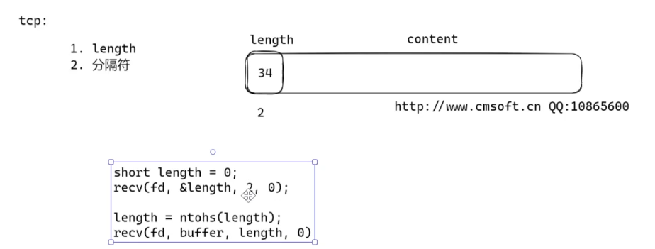

  -  **ET触发的用处**：

  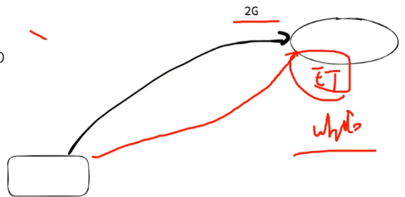

  - 如果要将一个大小为2g的文件一口度进来，就这样用while  全都进来。

    

#### 五、思考

##### 1. **`epoll` 是否使用 `mmap`？**

**答案：是的，`epoll` 内部使用 `mmap` 优化性能。**

具体机制：

- **内核与用户空间的数据传递**：
  `epoll` 通过 `mmap` 在内核和用户空间之间**共享内存**，避免数据从内核态到用户态的拷贝（零拷贝技术）。当调用 `epoll_wait` 时，事件数据直接通过 `mmap` 映射的内存区域返回，无需传统 `read`/`write` 的多次拷贝。
- **性能优势**：
  这种设计使得 `epoll` 在处理大量文件描述符时效率远高于 `select`/`poll`，尤其是高并发场景（如百万级连接）。

验证方法：

- 通过

  ```
  strace
  ```

  跟踪系统调用可以发现，

  ```
  epoll_create
  ```

  时会调用

  ```
  mmap
  ```

  ```bash
  strace -e trace=mmap,epoll_create your_program
  ```

------


##### 2. **`epoll` 是否线程安全？**

**答案：`epoll` 本身是线程安全的，但需要合理使用。**

详细说明：

- **线程安全的操作**：

  - **`epoll_wait`**：
    多个线程可以同时调用 `epoll_wait` 监听同一个 `epoll` 实例，内核会保证事件分发的原子性。
  - **`epoll_ctl`**：
    对同一个 `epoll` 实例的修改操作（如 `EPOLL_CTL_ADD`/`EPOLL_CTL_MOD`/`EPOLL_CTL_DEL`）需要**加锁保护**，否则可能引发竞争条件。

- **非线程安全的场景**：
  如果多个线程同时对同一个文件描述符调用 `epoll_ctl`，可能导致不可预知的行为。例如：

  ```c
  // 线程1：添加事件
  epoll_ctl(epfd, EPOLL_CTL_ADD, fd, &ev);
  
  // 线程2：删除事件
  epoll_ctl(epfd, EPOLL_CTL_DEL, fd, NULL);
  ```

  若不加锁，这两个操作可能在内核中交错执行，导致状态不一致。

正确用法：

- 使用互斥锁保护 `epoll_ctl`：

  ```c
  pthread_mutex_lock(&epoll_mutex);
  epoll_ctl(epfd, EPOLL_CTL_ADD, fd, &ev);
  pthread_mutex_unlock(&epoll_mutex);
  ```

- **每个线程使用独立的 `epoll` 实例**：
  如果不需要共享事件监听，可以为每个线程创建独立的 `epoll` 实例，避免竞争。

------

代码示例：线程安全的 `epoll` 使用

```c
#include <pthread.h>
#include <sys/epoll.h>

#define MAX_EVENTS 10

int epfd;
pthread_mutex_t epoll_mutex = PTHREAD_MUTEX_INITIALIZER;

void* thread_func(void* arg) {
    struct epoll_event events[MAX_EVENTS];
    while (1) {
        // 多个线程可以安全调用 epoll_wait
        int nready = epoll_wait(epfd, events, MAX_EVENTS, -1);
        for (int i = 0; i < nready; i++) {
            // 处理事件
        }
    }
}

void add_fd_to_epoll(int fd) {
    struct epoll_event ev;
    ev.events = EPOLLIN;
    ev.data.fd = fd;
    
    // 加锁保护 epoll_ctl
    pthread_mutex_lock(&epoll_mutex);
    epoll_ctl(epfd, EPOLL_CTL_ADD, fd, &ev);
    pthread_mutex_unlock(&epoll_mutex);
}
```

------

##### 3. **补充：ET 模式下的线程安全问题**

- **边沿触发（ET）模式**：
  在 ET 模式下，必须确保一次性读取所有数据（循环调用 `recv` 直到返回 `EAGAIN`）。如果多个线程处理同一个 socket 的 `EPOLLIN` 事件，可能导致数据被多个线程重复处理。此时需要设计合理的任务分发机制（如 Leader-Follower 模式）。
- **非阻塞 IO 的必要性**：
  ET 模式下必须将 socket 设为非阻塞模式，否则 `recv` 可能阻塞整个线程，影响其他事件处理。

------

4. `epoll`实现方式划分

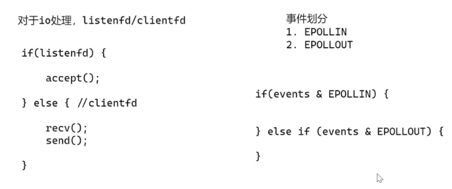

分析：

- 左边明显是**面向IO**的写法
  - 会越来越累赘，越来越复杂
- 右边是**面向事件**的写法
  - 这样的写法本质上就是==reactor==
  - 核心的作用相较于面向IO的写法


### 三、实现reactor方法

本质上是要实现以一个包含这几个东西的连接池，待会还是要细学：

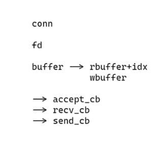

#### 1. 无终止符，数据一直存储

如果没有收到终止符，读到的每句话都会一直存在buffer中，每次打印全都打印出来。

> clientfd:5
> count:4
> buffer:abcd
>
> clientfd:5
> count:4
> buffer:abcdabcd
>
> clientfd:5
> count:4
> buffer:abcdabcdabcd

这显然是有问题的，但是也有应用场景

我们在浏览器里连接服务器

> http://192.168.1.122:2048  输入地址

会在输出框打印：

> sockfd: 5
> sockfd: 6
> clientfd:5
> count:480
> buffer:GET / HTTP/1.1
> Host: 192.168.1.122:2048
> Connection: keep-alive
> Upgrade-Insecure-Requests: 1
> User-Agent: Mozilla/5.0 (Windows NT 10.0; Win64; x64) AppleWebKit/537.36 (KHTML, like Gecko) Chrome/133.0.0.0 Safari/537.36 Edg/133.0.0.0
> Accept: text/html,application/xhtml+xml,application/xml;q=0.9,image/avif,image/webp,image/apng,*/*;q=0.8,application/signed-exchange;v=b3;q=0.7
> Accept-Encoding: gzip, deflate
> Accept-Language: zh-CN,zh;q=0.9,en;q=0.8,en-GB;q=0.7,en-US;q=0.6
>
> disconnect


#### 2. reactor的封装

```c
#include <sys/socket.h> // 套接套接字操作相关函数和数据结构
#include <errno.h>      // 错误码定义（如errno）
#include <netinet/in.h> // IPv4地址结构sockaddr_in定义

#include <stdio.h>
#include <string.h>
#include <unistd.h>

#include <sys/epoll.h>
#include <stdlib.h> // 添加此行，声明 malloc 和 free

#define BUFFER_LENGTH 1024

struct conn_item
{
    int fd;
    char buffer[BUFFER_LENGTH];
    int idx;
};

struct conn_item connlist[1024] = {0};

// tcp
int main()
{
    // AF_INET：IPv4地址族。
    // SOCK_STREAM：面向连接的TCP协议。
    // 0：自动选择协议（对于TCP，实际是IPPROTO_TCP）。
    // sockfd：套接字描述符，失败时返回-1。
    int sockfd = socket(AF_INET, SOCK_STREAM, 0);

    struct sockaddr_in serveraddr;

    // 将serveraddr结构体的所有字节置为0，避免残留数据干扰后续操作。
    // 网络编程中结构体可能存在填充字节，未清零可能导致bind()失败
    memset(&serveraddr, 0, sizeof(struct sockaddr_in));

    serveraddr.sin_family = AF_INET;
    serveraddr.sin_addr.s_addr = htonl(INADDR_ANY);
    serveraddr.sin_port = htons(2048);

    // bind()_绑定套接字与地址。将套接字关联到特定的IP地址和端口，使客户端能通过该地址访问服务。
    if (-1 == bind(sockfd, (struct sockaddr *)&serveraddr, sizeof(struct sockaddr)))
    {
        perror("bind");
        return -1;
    }

    // 将套接字设置为被动模式，准备接受客户端的连接请求。
    listen(sockfd, 10);

    // create只要参数不为0和负即可
    int epfd = epoll_create(1);
    struct epoll_event ev;
    ev.events = EPOLLIN;
    ev.data.fd = sockfd;
    epoll_ctl(epfd, EPOLL_CTL_ADD, sockfd, &ev);

    struct epoll_event events[1024] = {0};
    while (1)
    {
        int nready = epoll_wait(epfd, events, 1024, -1);
        int i = 0;
        for (i = 0; i < nready; ++i)
        {
            int connfd = events[i].data.fd;
            if (sockfd == connfd)
            {
                struct sockaddr_in clientaddr;
                socklen_t len = sizeof(clientaddr);

                int clientfd = accept(sockfd, (struct sockaddr *)&clientaddr, &len);

                ev.events = EPOLLIN; // * 水平触发状态，数据没读完就一直触发触发触发！！！
                // * ev.events = EPOLLIN | EPOLLET;  // * 边沿触发状态，数据只触发一次！
                ev.data.fd = clientfd;
                epoll_ctl(epfd, EPOLL_CTL_ADD, clientfd, &ev);

                // ! 初始化部分
                connlist[clientfd].fd = clientfd;
                memset(connlist[clientfd].buffer, 0, BUFFER_LENGTH);
                connlist[clientfd].idx = 0;

                printf("sockfd: %d\n", clientfd);
            }
            else if (events[i].events & EPOLLIN)
            {
                // ! 实现拼接
                char *buffer = connlist[connfd].buffer;
                int idx = connlist[connfd].idx;
                int count = recv(connfd, buffer + idx, BUFFER_LENGTH - idx, 0);

                if (count == 0)
                {
                    printf("disconnect\n");
                    // !不关闭事件会一直循环循环

                    epoll_ctl(epfd, EPOLL_CTL_DEL, connfd, NULL);
                    close(connfd);

                    continue;
                }
                connlist[connfd].idx += count;

                send(connfd, buffer, count, 0);
                printf("clientfd:%d\ncount:%d\nbuffer:%s\n", connfd, count, buffer);
            }
        }
    }

    getchar();
    close(sockfd);
}

```

**首先分析一下这个代码的不足：**

1. 这个代码虽然是根据事件来设计的了，但本质上还是基于io的。
2. 需要修改——有三个事件（回调函数）
   - accept_cb() ==> 针对listenfd
   - recv_cb()  & senf_cb()==> 针对clinentfd


>**EPOLLOUT状态的意义**
>
>==> 判断当前io是否可写
>
>一次出发不关闭就会一直可写（一直发送）
>
>**主要用途的话**
>
>我们监测我们的发送缓存区是否可写，例如我们发送一个文件的时候，可能会超过我们的发送缓存区


上述步骤实现代码：

```c
#include <sys/socket.h> // 套接套接字操作相关函数和数据结构
#include <errno.h>      // 错误码定义（如errno）
#include <netinet/in.h> // IPv4地址结构sockaddr_in定义

#include <stdio.h>
#include <string.h>
#include <unistd.h>

#include <pthread.h>
#include <sys/select.h>
#include <sys/poll.h>
#include <sys/epoll.h>
#include <stdlib.h> // 添加此行，声明 malloc 和 free

#define BUFFER_LENGTH 1024

int epfd = 0;

// * listenfd
// * listenfd 触发 EPOLLIN(事件)， 执行accept_cb()
int accept_cb(int fd);

// * clientfd
// * clientfd 触发 EPOLLIN(事件)， 执行recv_cb()
// * clientfd 触发 EPOLLIN(事件)， 执行send_cb()
int recv_cb(int fd);
int send_cb(int fd);

struct conn_item
{
    int fd;
    char buffer[BUFFER_LENGTH];
    int idx;
};

struct conn_item connlist[1024] = {0};

int accept_cb(int fd)
{
    struct sockaddr_in clientaddr;
    socklen_t len = sizeof(clientaddr);
    struct epoll_event ev;

    int clientfd = accept(fd, (struct sockaddr *)&clientaddr, &len);

    if (clientfd < 0)
        return clientfd;

    ev.events = EPOLLIN; // * 水平触发状态，数据没读完就一直触发触发触发！！！
    // * ev.events = EPOLLIN | EPOLLET;  // * 边沿触发状态，数据只触发一次！
    ev.data.fd = clientfd;
    epoll_ctl(epfd, EPOLL_CTL_ADD, clientfd, &ev);

    // ! 初始化部分
    connlist[clientfd].fd = clientfd;
    memset(connlist[clientfd].buffer, 0, BUFFER_LENGTH);
    connlist[clientfd].idx = 0;

    return clientfd;
}

int recv_cb(int fd)
{
    char *buffer = connlist[fd].buffer;
    int idx = connlist[fd].idx;
    int count = recv(fd, buffer + idx, BUFFER_LENGTH - idx, 0);

    if (count == 0)
    {
        printf("disconnect\n");
        //* 怎么解决缺少epollfd的问题
        //* 1.定义为全局变量
        //* 2.定义一个reactor结构体
        epoll_ctl(epfd, EPOLL_CTL_DEL, fd, NULL);
        close(fd);
    }
    connlist[fd].idx += count;

    // 设置事件
    struct epoll_event ev;
    ev.events = EPOLLOUT;
    ev.data.fd = fd;
    epoll_ctl(epfd, EPOLL_CTL_MOD, fd, &ev);

    // send(fd, buffer, count, 0);
    return count;
}

int send_cb(int fd)
{
    char *buffer = connlist[fd].buffer;
    int idx = connlist[fd].idx;

    int count = send(fd, buffer, idx, 0);

    struct epoll_event ev;
    ev.events = EPOLLIN;
    ev.data.fd = fd;
    epoll_ctl(epfd, EPOLL_CTL_MOD, fd, &ev);

    return count;
}

// tcp
int main()
{
    int sockfd = socket(AF_INET, SOCK_STREAM, 0);

    struct sockaddr_in serveraddr;

    memset(&serveraddr, 0, sizeof(struct sockaddr_in));

    serveraddr.sin_family = AF_INET;
    serveraddr.sin_addr.s_addr = htonl(INADDR_ANY);
    serveraddr.sin_port = htons(2048);

    // bind()_绑定套接字与地址。将套接字关联到特定的IP地址和端口，使客户端能通过该地址访问服务。
    if (-1 == bind(sockfd, (struct sockaddr *)&serveraddr, sizeof(struct sockaddr)))
    {
        perror("bind");
        return -1;
    }

    // 将套接字设置为被动模式，准备接受客户端的连接请求。
    listen(sockfd, 10);

    // create只要参数不为0和负即可
    epfd = epoll_create(1);
    struct epoll_event ev;
    ev.events = EPOLLIN;
    ev.data.fd = sockfd;
    epoll_ctl(epfd, EPOLL_CTL_ADD, sockfd, &ev);

    struct epoll_event events[1024] = {0};
    while (1)
    {
        int nready = epoll_wait(epfd, events, 1024, -1);
        int i = 0;
        for (i = 0; i < nready; ++i)
        {
            int connfd = events[i].data.fd;
            if (sockfd == connfd)
            {
                int clientfd = accept_cb(sockfd);
                printf("sockfd: %d\n", clientfd);
            }
            else if (events[i].events & EPOLLIN)
            {
                int count = recv_cb(connfd);
                printf("recv <-- buffer:%s\n", connlist[connfd].buffer);
            }
            else if (events[i].events & EPOLLOUT)
            {
                int count = send_cb(connfd);
                printf("send --> buffer:%s\n", connlist[connfd].buffer);
            }
        }
    }

    getchar();
    // 不要将关闭交给服务端，否则另一边端口不会释放，会一直报Timeout
    close(sockfd);
}

```


#### 3. 使用回调函数进行解决问题

这边的话，可以使用回调函数进行更加强的事件模式转变，进一步去除IO模式的影响。

具体的实现代码如下：

```
#include <sys/socket.h> 
#include <errno.h>      
#include <netinet/in.h> 

#include <stdio.h>
#include <string.h>
#include <unistd.h>

#include <pthread.h>
#include <sys/epoll.h>
#include <stdlib.h> 

#define BUFFER_LENGTH 1024

// 定义回调函数类型
typedef int (*RCALLBACK)(int fd);

// 前向声明回调函数
int accept_cb(int fd);
int recv_cb(int fd);
int send_cb(int fd);

/**
 * 连接项结构体，保存每个连接的信息
 * fd: 文件描述符
 * buffer: 数据缓冲区
 * idx: 当前缓冲区中的数据长度
 * recv_t: 接收回调联合体（监听socket用accept，普通socket用recv）
 * send_callback: 发送回调函数
 * @bug accept_callback: Output extra lines
 * TODO: Fix the above bugs
 */
struct conn_item
{
    int fd;
    char buffer[BUFFER_LENGTH];
    int idx;
    union {
        RCALLBACK accept_callback; // 用于监听socket的accept回调
        RCALLBACK recv_callback;   // 用于普通socket的recv回调
    } recv_t;
    RCALLBACK send_callback;       // 发送回调
};

int epfd = 0; // epoll实例的文件描述符
struct conn_item connlist[1024] = {0}; // 连接项数组，索引为文件描述符

/**
 * 设置epoll事件
 * @param fd 需要设置的文件描述符
 * @param event 事件类型（EPOLLIN/EPOLLOUT）
 * @param flag 0表示修改现有事件，非0表示添加新事件
 * @return 始终返回0
 */
int set_event(int fd, int event, int flag)
{
    struct epoll_event ev;
    ev.events = event;
    ev.data.fd = fd;

    if (flag) {
        // 添加新事件
        epoll_ctl(epfd, EPOLL_CTL_ADD, fd, &ev);
    } else {
        // 修改现有事件
        epoll_ctl(epfd, EPOLL_CTL_MOD, fd, &ev);
    }
    return 0;
}

/**
 * 接受连接的回调函数
 * @param fd 监听socket的文件描述符
 * @return 成功返回clientfd，失败返回-1
 */
int accept_cb(int fd)
{
    struct sockaddr_in clientaddr;
    socklen_t len = sizeof(clientaddr);
    // 接受新连接
    int clientfd = accept(fd, (struct sockaddr*)&clientaddr, &len);
    if (clientfd < 0) return clientfd;

    // 将新连接的socket加入epoll监听读事件
    set_event(clientfd, EPOLLIN, 1); // 第三个参数1表示添加新事件

    // 初始化连接信息
    connlist[clientfd].fd = clientfd;
    memset(connlist[clientfd].buffer, 0, BUFFER_LENGTH);
    connlist[clientfd].idx = 0;
    printf("client: %d\n", connlist[clientfd].fd);
    // 设置回调函数
    connlist[clientfd].recv_t.recv_callback = recv_cb;
    connlist[clientfd].send_callback = send_cb;

    return clientfd;
}

/**
 * 接收数据的回调函数
 * @param fd 数据来源的socket文件描述符
 * @return 接收到的字节数，连接关闭返回0
 */
int recv_cb(int fd)
{
    char* buffer = connlist[fd].buffer;
    int idx = connlist[fd].idx;
    // 接收数据
    int count = recv(fd, buffer + idx, BUFFER_LENGTH - idx, 0);

    if (count == 0) { // 连接关闭
        printf("disconnect\n");
        epoll_ctl(epfd, EPOLL_CTL_DEL, fd, NULL);
        close(fd);
    } else if (count > 0) {
        connlist[fd].idx += count; // 更新缓冲区索引
    }
    
    // 修改事件为监听写事件（准备发送数据）
    set_event(fd, EPOLLOUT, 0); // 第三个参数0表示修改事件
    return count;
}

/**
 * 发送数据的回调函数
 * @param fd 目标socket文件描述符
 * @return 发送的字节数
 */
int send_cb(int fd)
{
    char* buffer = connlist[fd].buffer;
    int idx = connlist[fd].idx;
    // 发送数据
    int count = send(fd, buffer, idx, 0);
    // 修改事件为监听读事件（准备接收下一批数据）
    set_event(fd, EPOLLIN, 0);
    return count;
}

// 主函数（TCP服务器）
int main()
{
    // 创建监听socket
    int sockfd = socket(AF_INET, SOCK_STREAM, 0);
    struct sockaddr_in serveraddr;
    memset(&serveraddr, 0, sizeof(serveraddr));
    serveraddr.sin_family = AF_INET;
    serveraddr.sin_addr.s_addr = htonl(INADDR_ANY);
    serveraddr.sin_port = htons(2048);

    // 绑定地址
    if (bind(sockfd, (struct sockaddr*)&serveraddr, sizeof(serveraddr)) == -1) {
        perror("bind");
        return -1;
    }

    // 开始监听
    listen(sockfd, 10);

    // 初始化监听socket的连接项
    connlist[sockfd].fd = sockfd;
    connlist[sockfd].recv_t.accept_callback = accept_cb; // 设置accept回调

    // 创建epoll实例
    epfd = epoll_create(1);
    // 将监听socket加入epoll
    set_event(sockfd, EPOLLIN, 1); // 第三个参数1表示添加新事件

    struct epoll_event events[1024] = {0};
    while (1) {
        // 等待事件发生
        int nready = epoll_wait(epfd, events, 1024, -1);
        for (int i = 0; i < nready; ++i) {
            int connfd = events[i].data.fd;
            // 处理读事件（包括新连接和数据到达）
            if (events[i].events & EPOLLIN) {
                // 调用对应的回调函数
                // ! bug is created by this lines, the recv_t is accept, but the printf function is still running.
                int count = connlist[connfd].recv_t.recv_callback(connfd);
                printf("recv[count: %d] <-- buffer:%s\n", count, connlist[connfd].buffer);
            } 
            // 处理写事件（数据可发送）
            else if (events[i].events & EPOLLOUT) {
                int count = connlist[connfd].send_callback(connfd);
                printf("send[count: %d] --> buffer:%s\n", count, connlist[connfd].buffer);
            }
        }
    }

    close(sockfd);
}
```

这里的话，主要是有个小bug，在我们的状态是accept的时候，我们不应该输出这个句子：

> if (events[i].events & EPOLLIN) {
>
> ​        // 调用对应的回调函数
>
> ​        // ! bug is created by this lines, the recv_t is accept, but the printf function is still running.
>
> ​        int count = connlist[connfd].recv_t.recv_callback(connfd);
>
> ​        printf("recv[count: %d] <-- buffer:%s\n", count, connlist[connfd].buffer);
>
> ​      } 

==这边只能说不输出就是最好的选择==


除此以外，tips：

> `union`是什么呢？
>
> 简单来说就是一个将中间包含的同类的变量绑定到一个同样的内存空间去，你设置union变量是什么，他就会在这个内存空间中将union变量变成什么！


#### ==思考题==

1.  能不能把connfd从主循环中剔除，使得主循环只关注我们的IN和OUT参数。
2. select、poll、epoll将他们封装在一个完整的代码中。


#### 4. connlist[1024]进行数量上的扩展

首先，我们需要明确，reactor是干了一个什么事情：

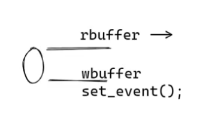

如这张图所示，我们进行reactor的设计之后的话，我们的一个io本质上，我们具体怎么通信，怎么实现都已经不重要了。

我们现在实际上==只需要关注两个点：==`rbuffer` `wbuffer`，当这两个里面有数据的时候就执行，读数据和写数据的操作。如果没数据的话就保持连接这种，接收到为0则终止

了不得我们在添加一个set_event()来进行一个状态的设计！！！


所以现在我们需要隔离开来rbuffer和wbuffer

具体实现代码如下：

```c
#define BUFFER_LENGTH 1024

// 定义回调函数类型
typedef int (*RCALLBACK)(int fd);

// 前向声明回调函数
int accept_cb(int fd);
int recv_cb(int fd);
int send_cb(int fd);

/**
 * 连接项结构体，保存每个连接的信息
 * @fd: 文件描述符
 * @rbuffer: 数据接收缓冲区
 * @rlen: 接收缓冲区中的数据长度
 * @wbuffer: 数据发送缓冲区
 * @wlen: 发送缓冲区中的数据长度
 * @recv_t: 接收回调联合体（监听socket用accept，普通socket用recv）
 * @send_callback: 发送回调函数
 * @bug accept_callback: Output extra lines
 * TODO: Fix the above bugs
 */
struct conn_item
{
    int fd;

    char rbuffer[BUFFER_LENGTH];
    int rlen;

    char wbuffer[BUFFER_LENGTH];
    int wlen;

    union
    {
        RCALLBACK accept_callback; // 用于监听socket的accept回调
        RCALLBACK recv_callback;   // 用于普通socket的recv回调
    } recv_t;
    RCALLBACK send_callback; // 发送回调
};

int epfd = 0;                          // epoll实例的文件描述符
struct conn_item connlist[1024] = {0}; // 连接项数组，索引为文件描述符

/**
 * 设置epoll事件
 * @param fd 需要设置的文件描述符
 * @param event 事件类型（EPOLLIN/EPOLLOUT）
 * @param flag 0表示修改现有事件，非0表示添加新事件
 * @return 始终返回0
 */
int set_event(int fd, int event, int flag)
{
    struct epoll_event ev;
    ev.events = event;
    ev.data.fd = fd;

    if (flag)
    {
        // 添加新事件
        epoll_ctl(epfd, EPOLL_CTL_ADD, fd, &ev);
    }
    else
    {
        // 修改现有事件
        epoll_ctl(epfd, EPOLL_CTL_MOD, fd, &ev);
    }
    return 0;
}

/**
 * 接受连接的回调函数
 * @param fd 监听socket的文件描述符
 * @return 成功返回clientfd，失败返回-1
 */
int accept_cb(int fd)
{
    struct sockaddr_in clientaddr;
    socklen_t len = sizeof(clientaddr);
    // 接受新连接
    int clientfd = accept(fd, (struct sockaddr *)&clientaddr, &len);
    if (clientfd < 0)
        return clientfd;

    // 将新连接的socket加入epoll监听读事件
    set_event(clientfd, EPOLLIN, 1); // 第三个参数1表示添加新事件

    // 初始化连接信息
    connlist[clientfd].fd = clientfd;
    memset(connlist[clientfd].rbuffer, 0, BUFFER_LENGTH);
    connlist[clientfd].rlen = 0;
    memset(connlist[clientfd].wbuffer, 0, BUFFER_LENGTH);
    connlist[clientfd].wlen = 0;
    printf("client: %d\n", connlist[clientfd].fd);
    // 设置回调函数
    connlist[clientfd].recv_t.recv_callback = recv_cb;
    connlist[clientfd].send_callback = send_cb;

    return clientfd;
}

/**
 * 接收数据的回调函数
 * @param fd 数据来源的socket文件描述符
 * @return 接收到的字节数，连接关闭返回0
 */
int recv_cb(int fd)
{
    char *buffer = connlist[fd].rbuffer;
    int idx = connlist[fd].rlen;
    // 接收数据
    int count = recv(fd, buffer + idx, BUFFER_LENGTH - idx, 0);

    if (count == 0)
    { // 连接关r闭
        printf("disconnect\n");
        epoll_ctl(epfd, EPOLL_CTL_DEL, fd, NULL);
        close(fd);
        return -1;
    }
    else if (count > 0)
    {
        connlist[fd].rlen += count; // 更新缓冲区索引
    }


```


这边其实有个重点，就是将我们的rbuffer复制到wbuffer：

```c
#if 1 // echo: need to send
    memcpy(connlist[fd].wbuffer, connlist[fd].rbuffer, connlist[fd].rlen);
    connlist[fd].wlen = connlist[fd].rlen;
#endif
```

这个很重要！！！

## http server的搭建

- 字符
- html
- png

### 一、具体实现

首先我们HTTP连接的时候会接收到一串如下==请求头==：

> GET / HTTP/1.1
> Host: 192.168.1.122:2048
> Connection: keep-alive
> Cache-Control: max-age=0
> Upgrade-Insecure-Requests: 1
> User-Agent: Mozilla/5.0 (Windows NT 10.0; Win64; x64) AppleWebKit/537.36 (KHTML, like Gecko) Chrome/134.0.0.0 Safari/537.36 Edg/134.0.0.0
> Accept: text/html,application/xhtml+xml,application/xml;q=0.9,image/avif,image/webp,image/apng,*/*;q=0.8,application/signed-exchange;v=b3;q=0.7
> Accept-Encoding: gzip, deflate
> Accept-Language: zh-CN,zh;q=0.9,en;q=0.8,en-GB;q=0.7,en-US;q=0.6


我们的回复暂定设置为：

> "HTTP/1.1 200 OK\r\n"
>      "Accept-Ranges: bytes\r\n"
>      "Content-Length: 82\r\n"
>      "Content-Type: text/html\r\n"
>      "Date: Sat, 06 Aug 2023 13:16:46 GMT\r\n\r\n"
>      "<html><head><title>0voice.king</title></head><body><h1>King</h1></body></html>\r\n\r\n");


通过这样设置：

```c
#if ENABLE_HTTP_RESPONSE
typedef struct conn_item connection_t;

int http_response(connection_t *conn){
    conn->wlen = sprintf(conn->wbuffer, 
		"HTTP/1.1 200 OK\r\n"
		"Accept-Ranges: bytes\r\n"
		"Content-Length: 82\r\n"
		"Content-Type: text/html\r\n"
		"Date: Sat, 06 Aug 2023 13:16:46 GMT\r\n\r\n"
		"<html><head><title>0voice.king</title></head><body><h1>King</h1></body></html>\r\n\r\n");
}
#endif
.........................................
int recv_cb(int fd)
{
    char *buffer = connlist[fd].rbuffer;
    int idx = connlist[fd].rlen;
    // 接收数据
    int count = recv(fd, buffer + idx, BUFFER_LENGTH - idx, 0);

    if (count == 0)
    { // 连接关r闭
        printf("disconnect\n");
        epoll_ctl(epfd, EPOLL_CTL_DEL, fd, NULL);
        close(fd);
        return -1;
    }
    else if (count > 0)
    {
        connlist[fd].rlen += count; // 更新缓冲区索引
    }

// 解决发送字符串问题
#if 0 // echo: need to send
    memcpy(connlist[fd].wbuffer, connlist[fd].rbuffer, connlist[fd].rlen);
    connlist[fd].wlen = connlist[fd].rlen;

#else
    // http_request(&connlist[fd]);
    http_response(&connlist[fd]);
#endif

    // 修改事件为监听写事件（准备发送数据）
    set_event(fd, EPOLLOUT, 0); // 第三个参数0表示修改事件
    return count;
}

```


通过上述方式可以在网页中输出一个king。


同样我们可以将我们需要输出的网页保存为html,然后输出：

```c
int http_response(connection_t *conn)
{
#if 0
    conn->wlen = sprintf(conn->wbuffer,
        "HTTP/1.1 200 OK\r\n"
        "Accept-Ranges: bytes\r\n"
        "Content-Length: 82\r\n"
        "Content-Type: text/html\r\n"
        "Date: Sat, 06 Aug 2023 13:16:46 GMT\r\n\r\n"
        "<html><head><title>0voice.king</title></head><body><h1>King</h1></body></html>\r\n\r\n");

#else
    int filefd = open("index.html", O_RDONLY);

    struct stat stat_buf;
    fstat(filefd, &stat_buf);

    conn->wlen = sprintf(conn->wbuffer,
        "HTTP/1.1 200 OK\r\n"
        "Accept-Ranges: bytes\r\n"
        "Content-Length: %ld\r\n"
        "Content-Type: text/html\r\n"
        "Date: Sat, 06 Aug 2023 13:16:46 GMT\r\n\r\n",
        stat_buf.st_size);
    int count = read(filefd, conn->wbuffer+conn->wlen,BUFFER_LENGTH-conn->wlen);
    conn->wlen += count;

#endif
    return conn->wlen;
}

#endif
```


### 二、如何测试http服务器性能

==工具：wrk==

地址：

> htttps://github.com/wg/wrk.git


# 25年3月12日

## 2.2.1 服务器的百万并发实现

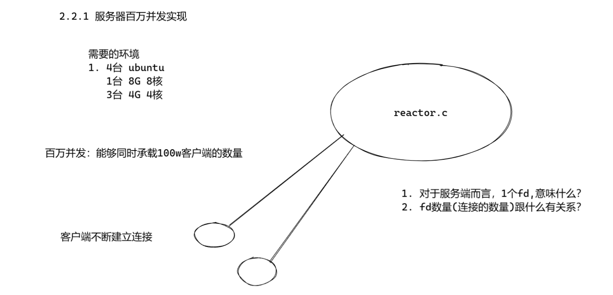

今天的重点！！！**网络部分并发！！！**

### 一、实现代码

首先的话，我们的基础框架还是之前课上讲到的reactor服务器框架，之后我们使用一个测试软件在另一台服务器客户端上对他进行测试。

测试代码如下：（默认最大测试340000）为满足百万并发测试

```c


#include <stdio.h>
#include <string.h>
#include <stdlib.h>

#include <sys/types.h>
#include <sys/socket.h>
#include <sys/epoll.h>
#include <sys/time.h>
#include <errno.h>
#include <netinet/tcp.h>
#include <arpa/inet.h>
#include <netdb.h>
#include <fcntl.h>


#define MAX_BUFFER		128
#define MAX_EPOLLSIZE	(384*1024)
#define MAX_PORT		20

#define TIME_SUB_MS(tv1, tv2)  ((tv1.tv_sec - tv2.tv_sec) * 1000 + (tv1.tv_usec - tv2.tv_usec) / 1000)

int isContinue = 0;

static int ntySetNonblock(int fd) {
	int flags;

	flags = fcntl(fd, F_GETFL, 0);
	if (flags < 0) return flags;
	flags |= O_NONBLOCK;
	if (fcntl(fd, F_SETFL, flags) < 0) return -1;
	return 0;
}

static int ntySetReUseAddr(int fd) {
	int reuse = 1;
	return setsockopt(fd, SOL_SOCKET, SO_REUSEADDR, (char *)&reuse, sizeof(reuse));
}


int main(int argc, char **argv) {
	if (argc <= 2) {
		printf("Usage: %s ip port\n", argv[0]);
		exit(0);
	}

	const char *ip = argv[1];
	int port = atoi(argv[2]);
	int connections = 0;
	char buffer[128] = {0};
	int i = 0, index = 0;

	struct epoll_event events[MAX_EPOLLSIZE];
	
	int epoll_fd = epoll_create(MAX_EPOLLSIZE);
	
	strcpy(buffer, " Data From MulClient\n");
		
	struct sockaddr_in addr;
	memset(&addr, 0, sizeof(struct sockaddr_in));
	
	addr.sin_family = AF_INET;
	addr.sin_addr.s_addr = inet_addr(ip);

	struct timeval tv_begin;
	gettimeofday(&tv_begin, NULL);

	while (1) {
		if (++index >= MAX_PORT) index = 0;
		
		struct epoll_event ev;
		int sockfd = 0;

		if (connections < 340000 && !isContinue) {
			sockfd = socket(AF_INET, SOCK_STREAM, 0);
			if (sockfd == -1) {
				perror("socket");
				goto err;
			}

			//ntySetReUseAddr(sockfd);
			addr.sin_port = htons(port);

			if (connect(sockfd, (struct sockaddr*)&addr, sizeof(struct sockaddr_in)) < 0) {
				perror("connect");
				goto err;
			}
			ntySetNonblock(sockfd);
			ntySetReUseAddr(sockfd);

			sprintf(buffer, "Hello Server: client --> %d\n", connections);
			send(sockfd, buffer, strlen(buffer), 0);

			ev.data.fd = sockfd;
			ev.events = EPOLLIN | EPOLLOUT;
			epoll_ctl(epoll_fd, EPOLL_CTL_ADD, sockfd, &ev);
		
			connections ++;
		}
		//connections ++;
		if (connections % 1000 == 999 || connections >= 340000) {
			struct timeval tv_cur;
			memcpy(&tv_cur, &tv_begin, sizeof(struct timeval));
			
			gettimeofday(&tv_begin, NULL);

			int time_used = TIME_SUB_MS(tv_begin, tv_cur);
			printf("connections: %d, sockfd:%d, time_used:%d\n", connections, sockfd, time_used);

			int nfds = epoll_wait(epoll_fd, events, connections, 100);
			for (i = 0;i < nfds;i ++) {
				int clientfd = events[i].data.fd;

				if (events[i].events & EPOLLOUT) {
					sprintf(buffer, "data from %d\n", clientfd);
					send(sockfd, buffer, strlen(buffer), 0);
				} else if (events[i].events & EPOLLIN) {
					char rBuffer[MAX_BUFFER] = {0};				
					ssize_t length = recv(sockfd, rBuffer, MAX_BUFFER, 0);
					if (length > 0) {
						printf(" RecvBuffer:%s\n", rBuffer);

						if (!strcmp(rBuffer, "quit")) {
							isContinue = 0;
						}
						
					} else if (length == 0) {
						printf(" Disconnect clientfd:%d\n", clientfd);
						connections --;
						close(clientfd);
					} else {
						if (errno == EINTR) continue;

						printf(" Error clientfd:%d, errno:%d\n", clientfd, errno);
						close(clientfd);
					}
				} else {
					printf(" clientfd:%d, errno:%d\n", clientfd, errno);
					close(clientfd);
				}
			}
		}

		usleep(500);
	}

	return 0;

err:
	printf("error : %s\n", strerror(errno));
	return 0;
	
}

```


### 二、问题汇总及分析

#### 1. 客户端测试时卡死不动

这个的话需要在命令行窗口中做出修改，主要是我们的 `ulimit -n` 我们需要修改最大接入文件数，这点的话实际上是在几个客户端和服务端都要进行设置的

>open files                          (-n) 1048576

我是设置成了这么大，方便后续调整吧。


#### 2. reactor（服务端）报错connection refused

> core dumped

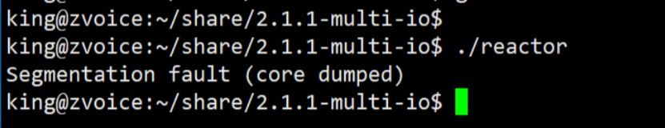

这个首先需要解决我们的服务端代码中有的接收上限设置为1024的问题

这个地方的话，将服务端的代码修改一下接收的上线**（我改为了65535），这个后续还要改到百万**


当然这个时候我们跑到结束的话会存在一个问题就是等到头来还是会有connection refused这样的问题，==但只能说我们的修改是有用的。==

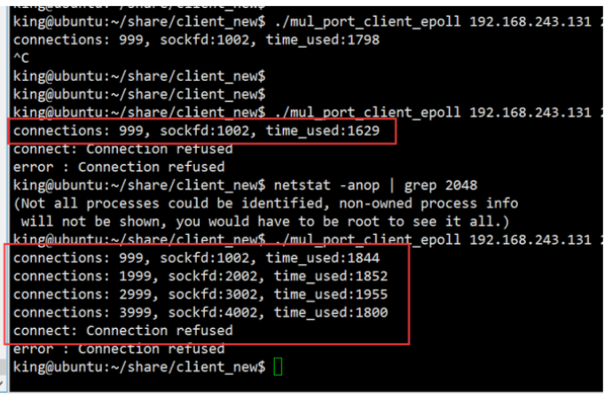


#### 3. 客户端连接  报错cannot assign requested adress

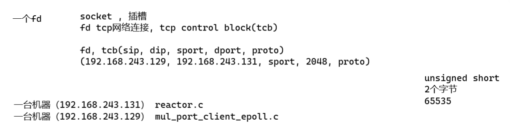

这边的话要讲到！！！==我们一个电脑的话最多只有65535个端口==，这个时候如果超出就会报错，而且0-1024个端口是被系统限死。所以会超出就不行了。（五元不足！！就是源目标这个五个信息！）


同时如果不到65535就报错比如说三万多的话，可能话有个原因就是**系统设置了可用的端口号范围**，这个时候就需要==手动修改==了！！！

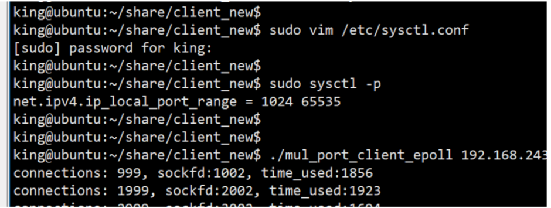


修改以后如图所示：

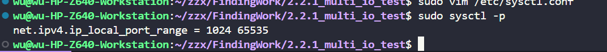

### 三、server监听端口数量增加

简单来说就是用循环的方式，对多个端口进行监听，从2048到2148

#### 1. 代码实现

首先我们就是修改reactor代码，对其中的话，添加循环检测多个端口以及添加一个时间显示的部分内容。

具体修改内容如下：

```c
int accept_cb(int fd)
{
	............
    if ((clientfd % 1000) == 999)
    {
        struct timeval tv_cur;
        gettimeofday(&tv_cur,NULL);
        int time_used  = TIME_SUB_MS(tv_cur, reactor_begin);
        memcpy(&reactor_begin, &tv_cur, sizeof(struct timeval));
        printf("cliendfd: %d, time_used: %d\n", conn->fd, time_used);
    }

    return clientfd;
}

// =============================================

int Init_server(unsigned short port)
{
    // 初始化监听套接字
    int sockfd = socket(AF_INET, SOCK_STREAM, 0);
    struct sockaddr_in serveraddr = {
        .sin_family = AF_INET,
        .sin_addr.s_addr = htonl(INADDR_ANY),
        .sin_port = htons(port)};

    if (bind(sockfd, (struct sockaddr *)&serveraddr, sizeof(serveraddr)) == -1)
    {
        perror("Bind failed");
        return -1;
    }
    listen(sockfd, 100);
    return sockfd;
}

/**
 * @brief 主函数（TCP服务器入口）
 * @return 程序退出状态码
 */
int main()
{
    int port_count = 100;
    unsigned short port = 2048;
    int i = 0;

    // 创建epoll实例
    epfd = epoll_create(1);

    for (i = 0; i < port_count; ++i)
    {
        int sockfd = Init_server(i + port);
        // 初始化监听套接字连接项
        connlist[sockfd].fd = sockfd;
        connlist[sockfd].recv_t.accept_callback = accept_cb;
        set_event(sockfd, EPOLLIN, 1);
    }


```


#### 2. 内存申请bug

不过这个时候就会产生一个很严重的报错问题，实际上还是内存申请的问题

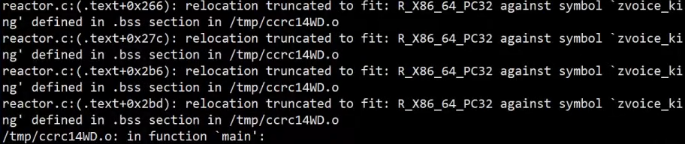

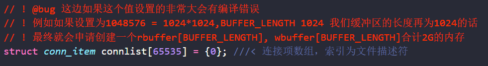

如果想要解决这个问题的话，无非是两种，一个是限制这里的可以创建的端口数量，另一个的话是修改前面的我们设置的接收和发送缓冲区的长度！！！

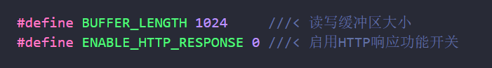

将长度修改为512，将内存大小需求将为1G。


#### 3. 还是会有卡65535的问题（不一定）

同时  就算前面我们有修改了openfiles的最大值为1048576，以及刚刚的端口范围设置

>open files                          (-n) 1048576


我们可能还是需要额外设置一下：

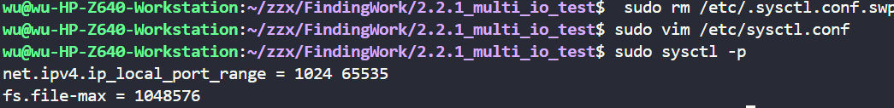


#### 4.退出程序的时候为什么直接结束

就是我们有的时候运行代码，接收到几十万的时候会自动关闭是什么呢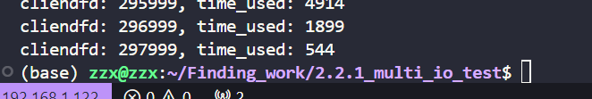

这个时候可能就是因为我们物理层层面需要我们设置一下系统的接收缓冲区内存和发送缓冲区内存，具体修改如下，报错应对如此。

**简单来说就是可能会被系统杀掉**

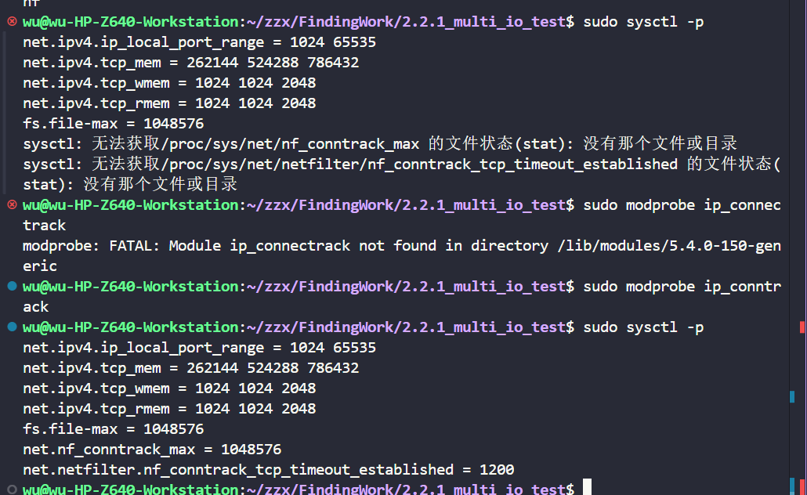


### 四、客户端程序kill发生雪崩


简单来说就是我们的客户端被kill掉的时候，我们的服务端的话，close操作是发生在receive中的，所以当大量的关闭申请发送到服务端的时候，就会导致我们的服务端发生==雪崩现象==，直接崩溃掉


这个时候我们就需要重复上述步骤！！！扩大我们的内存分配！！！！！

这个内存是需要跟内核版本挂钩的。


# 25年3月18日

## 2.2.2 Posix API 与网络协议栈

### 一、posix API

**API的大致种类**

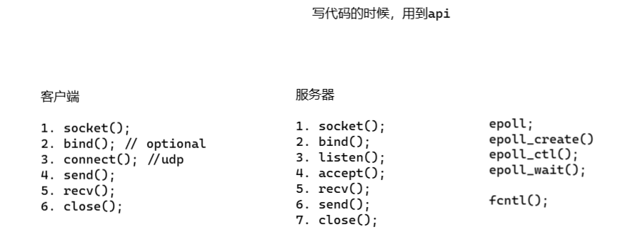

#### **1. 建立连接**

> ==**socket():**==
>
> 1. 插座，插，座
> 2. 网络io，<fd-tcp control block>
>    - 分配fd, int  (使用bitmap的算法，简单来说1，2，3依次检测，置1被用，置0可用)
>    - tcb, alloc()
>
> ---
>
> - 用法：
>
>   ```
>   int socket(int domain, int type, int protocol);
>   ```
>
>   - `domain`: AF_INET(IPv4)/AF_INET6(IPv6)
>   - `type`: SOCK_STREAM(TCP)/SOCK_DGRAM(UDP)
>
> - 原理：
>
>   - 内核创建套接字结构体（包含发送/接收缓冲区、协议族、状态等）
>   - 返回文件描述符映射到内核套接字对象
>
> - 注意事项：
>
>   - 需检查返回值（-1表示失败）
>   - 创建后默认是阻塞模式


> ==**bind(fd , );**==
>   a. ip, port
>
> 简单来说就是把这里的ip端口地址绑定到前面的tcb上面去（其实就是一个set的过程）
>
> ==所以我们的客户端可以不设置，他会自动选择一个端口==
>
> ---
>
> - 用法：
>
>   ```
>   int bind(int sockfd, const struct sockaddr *addr, socklen_t addrlen);
>   ```
>
>   - 服务器必须绑定，客户端通常由系统自动分配端口
>
> - 原理：
>
>   - 将IP+Port与套接字关联
>   - 内核检查端口可用性（避免端口冲突）
>
> - 注意事项：
>
>   - 使用`setsockopt(sockfd, SOL_SOCKET, SO_REUSEADDR)`解决`TIME_WAIT`状态端口占用问题


> ==**listen();**==
> a. tcb->status = TCP_STATUS_LISTEN;
> b. tcb->syn_queue
>   tcb->accept_queue
>
> 这个函数简单来说是要将tcb状态设置为listen状态；
>
> 同时在这里分配一个全连接队列和一个半连接队列
>
> ---
>
> - 用法：
>
>   ```
>   int listen(int sockfd, int backlog);
>   ```
>
>   - backlog：已完成连接队列的最大长度（Linux中实际是未完成+已完成队列）
>   - ==**listen(fd, backlog);**==
>     1. **syn队列**
>     2. **syn + accept队列总长度，未分配fd的tcb的数量**
>     3. **accept队列长度**
>
> - 原理：
>
>   - 将主动套接字转为被动套接字
>   - 创建SYN队列（半连接队列）和ACCEPT队列（全连接队列）
>
> - 注意事项：
>
>   - Linux内核2.2后backlog参数含义变化（实际值由`/proc/sys/net/core/somaxconn`决定）

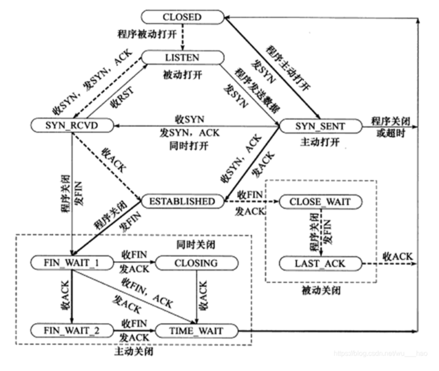

#### ***三次握手**

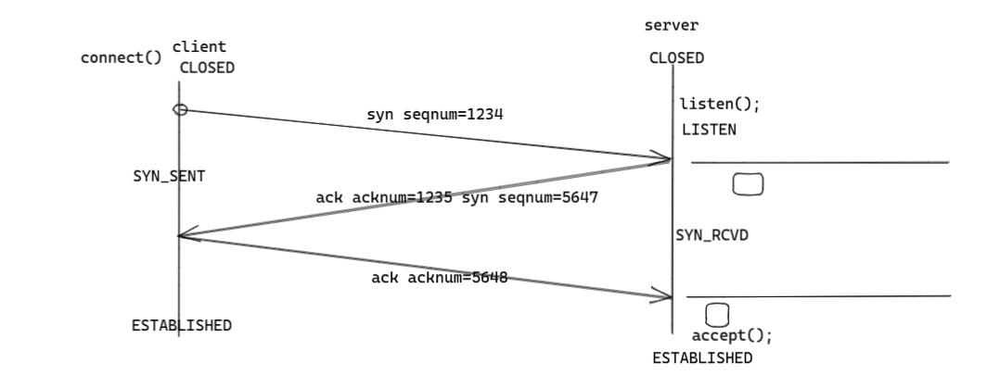

> **具体我们的三次握手是做了什么呢？**
>
> 结合这个tcp包来看，
>
> 1. 当我们解析了以太网、ip头以及tcp头之后的话，如果解析到了我们的syn位被置了1且seqnum这个有值（1234只是举例可以随机）
> 2. 第二次的话就会令ack=1，acknum置为seqnum+1，
>    同时syn置1，seqnum随机
> 3. 第三次就会返回ack = 1，acknum为之前的seqnum+1.
>
> ==不丢失、不重复、不乱序==
>
> 


==**三次握手的函数有那些？**==

1. listen()的backlog本身类似饭店吃饭排队取的号
2. 当我们监听到listen信息的时候就会先产生半连接==syn==
3. 三次握手之后才会使全连接accept()

==**DDOS攻击！！**==

1. 本质上就是靠tcp连接只进行第一步，就是对面服务端linsten到了第一个数据。之后的话，客户端不给他第三次回复
2. 怎么防护：


>部分问题：
>
>**a. tcp连接的生命周期，从什么时候开始？**
>
>​	真实起点：
>
>- **客户端视角**：从调用`connect()`发送SYN包开始（进入`SYN_SENT`状态）
>- **服务端视角**：从收到SYN包并创建半连接条目开始（进入`SYN_RECV`状态）
>
>**生命周期完整流程**
>
>```mermaid
>stateDiagram-v2
>    [*] --> CLOSED
>    CLOSED --> SYN_SENT: connect()
>    SYN_SENT --> ESTABLISHED: 收到SYN+ACK
>    CLOSED --> LISTEN: listen()
>    LISTEN --> SYN_RECV: 收到SYN
>    SYN_RECV --> ESTABLISHED: 收到ACK
>    ESTABLISHED --> FIN_WAIT_1: close()
>    FIN_WAIT_1 --> FIN_WAIT_2: 收到ACK
>    FIN_WAIT_2 --> TIME_WAIT: 收到FIN
>```
>
>##### **关键澄清**
>
>- IP地址绑定发生在`bind()`阶段（早于连接建立）
>- 真正的TCP连接生命周期始于三次握手，终结于四次挥手
>
>
>
>**b. 第三握手数据包，如何从半连接队列查找匹配的节点**
>
>**半连接队列核心机制**
>
>- **数据结构**：内核维护`syn_table`哈希表存储半连接请求
>
>- **条目结构**
>
>  ```c
>  struct inet_request_sock {
>      __be32          ir_rmt_addr;  // 客户端IP
>      __be16          ir_rmt_port;  // 客户端端口
>      __u32           ir_mark;      // 路由标记
>      struct tcp_options_received rx_opt; // 接收的TCP选项
>      u32             snt_isn;      // 服务端初始序列号
>  };
>  ```
>
>##### **ACK包匹配流程**
>
>1. 提取五元组：
>
>   - 源IP、源端口、目的IP、目的端口、协议类型
>
>2. 哈希快速定位：
>
>   ```c
>   hash = inet_ehashfn(saddr, sport, daddr, dport);
>   bucket = hash & (INET_LHTABLE_SIZE - 1);
>   ```
>
>3. 序列号验证：
>
>   - 检查ACK号是否等于`irs->snt_isn + 1`
>
>4. 状态升级：
>
>   - 将条目从`syn_table`迁移到`ehash`（已连接哈希表）
>
>
>
>**c. syn泛洪**
>
>**攻击原理**
>
>```mermaid
>graph LR
>    A[攻击者] -->|发送伪造源IP的SYN包| B(服务端半连接队列)
>    B -->|队列满| C[拒绝新连接]
>```
>
>##### **内核防御机制**
>
>1. **SYN Cookies**
>
>   - **触发条件**：当半连接队列超过`net.ipv4.tcp_max_syn_backlog`
>
>   - 算法流程：
>
>     ```markdown
>     cookie = hash(saddr, daddr, sport, dport) + 序列号计数器
>     将cookie编码到SYN+ACK的初始序列号中
>     ```
>
>   - 验证过程：
>
>     ```c
>     if (ack_seq - 1 == hash(saddr, sport, daddr, dport) + counter)
>         accept connection
>     ```
>
>2. **动态队列调整**
>
>   - 参数控制：
>
>     ```bash
>     sysctl -w net.ipv4.tcp_syncookies=2 # 始终启用
>     sysctl -w net.ipv4.tcp_synack_retries=3 # 减少重试次数
>     ```
>
>**系统监控命令**
>
>```bash
># 查看半连接队列溢出
>netstat -s | grep "SYNs to LISTEN"
># 查看当前SYN_RECV状态连接
>ss -n state syn-recv
>```
>
>------
>
>**进阶思考**
>
>1. SYN Cookies的密码学弱点
>   - 早期使用MD5存在碰撞风险，现代内核采用SHA-256
>2. 硬件加速防御
>   - DPDK实现SYN代理，在用户态过滤恶意包
>3. 云环境特殊处理
>   - AWS的Nitro Cards实现SYN预处理卸载


> ==**accept();**==
>
> 1. 分配fd 
> 2. fd --> tcb 
>
> 回顾一下我们之前学的：
>
> **listenfd**
>    accept();
>
> **clientfd**
>    recv();
>    send();
>
> ---
>
> **用法**：`int accept(int sockfd, struct sockaddr *addr, socklen_t *addrlen);`
>
> **原理**：
>
> - 从ACCEPT队列取出已建立的连接
> - 创建新的文件描述符指向新连接
>
> **注意事项**：
>
> - 返回的新套接字与原监听套接字无关联
> - 必须处理EAGAIN/EWOULDBLOCK错误（非阻塞模式下）


**思考题：如果使用ET（边沿触发）模式的话，如何接收所有信息**

```c
while(1) {
    fd = accept();
    if (fd == -1) {
        break;
    }
}
```


#### **2. 传输数据**

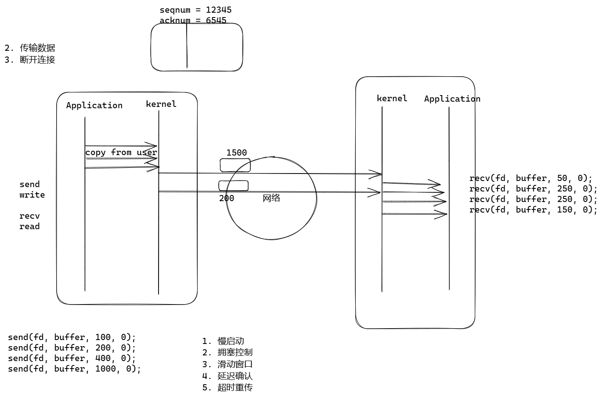

首先理解一下啊，**Application：应用** 以及 **kernel：协议栈**


> **Q: 怎么知道我们有没有发送成功？**
>
> **A:** 有的人会说只要我们的send和write返回-1就代表我们发送成功了，但其实我们的返回-1只代表我们的数据从Application发送到了协议栈上去kernel，存到了我们之前有提到的**wmem**中去。
>
> **很有可能我们从application发送了多次，但是kernel只发送一次**
>
> ---
>
> 这里还会有个概念MTU(最大传输单元)
>
> 这里代表我们的最大传输的大小，例如我们这里可能就是1500


> **Q：这两种写法有区别吗？**
>
> ```c
> recv(fd, buffer, 1000,0);
> 
> for(i = 0;i < 10;i ++) {
>  recv(fd, buffer, 100, 0);
> }
> ```
>
> **A：其实区别不大，正常情况下的话**
>
> 只要我们的缓冲区开辟的够大的话是不影响的


> **Q：传输过程中是怎么保证传输稳定性的**
>
> **A：**通过慢启动和拥塞控制
>
> 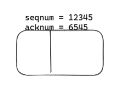
>
> 简单来说是前后都会发送seqnum和acknum，每次通讯的话，两者都是要这样的实现的。
>
> ---
>
> 以下是关于TCP中五个关键机制的详细解释：
>
> 1. **慢启动（Slow Start）**
>
> - **目的**：在连接初始阶段或从拥塞中恢复时，逐步探索可用带宽，避免突然大量数据导致网络拥塞。
> - 机制：
>   - **拥塞窗口（cwnd）**：初始值为1个MSS（最大报文段大小），每收到一个ACK，cwnd指数增长（如翻倍）。
>   - **阈值（ssthresh）**：当cwnd达到阈值时，进入**拥塞避免**阶段，转为线性增长（每RTT增加1个MSS）。
>   - **触发条件**：连接建立时或发生超时重传后启动。
> - **示例**：初始cwnd=1，发送1个报文；收到ACK后cwnd=2，发送2个报文；再收到2个ACK后cwnd=4，依此类推。
>
> ------
>
> 2. **拥塞控制（Congestion Control）**
>
> - **目标**：根据网络拥塞动态调整发送速率，避免网络过载。
> - 核心算法：
>   - **慢启动与拥塞避免**：如上所述，cwnd先指数增长，超过ssthresh后线性增长。
>   - 快速重传与快速恢复（如Reno算法）：
>     - **快速重传**：收到3次重复ACK时立即重传丢失报文，而非等待超时。
>     - **快速恢复**：cwnd减半后进入拥塞避免阶段，避免重置为1。
>   - 处理策略：
>     - **超时重传**：触发慢启动，ssthresh设为当前cwnd的一半，cwnd重置为1。
>     - **重复ACK**：触发快速恢复，cwnd减半后线性增长。
>
> ------
>
> 3. **滑动窗口（Sliding Window）**
>
> - **作用**：实现流量控制，确保发送方不会淹没接收方，同时提高传输效率。
> - 机制：
>   - **接收窗口（rwnd）**：接收方通告剩余缓冲区大小，发送方据此调整发送量。
>   - **实际窗口**：取拥塞窗口（cwnd）和接收窗口（rwnd）的较小值。
>   - **滑动操作**：已确认的数据从窗口中移除，后续数据填入，形成“滑动”效果。
> - **示例**：若窗口大小为4，发送方连续发送4个报文；收到第1个ACK后，窗口滑动，发送第5个报文。
>
> ------
>
> 4. **延迟确认（Delayed Acknowledgment）**
>
> - **目的**：减少ACK报文数量，提升网络效率。
> - 机制：
>   - **延迟策略**：接收方等待最多500ms，或积累两个报文后发送一个ACK。
>   - **捎带确认**：若有数据需发送，ACK可附带在数据包中。
> - **权衡**：可能增加发送方的RTT估计值，导致超时重传延迟，但减少了小包开销。
>
> ------
>
> 5. **超时重传（Retransmission Timeout, RTO）**
>
> - **功能**：确保数据可靠传输，通过重传丢失或损坏的报文。
> - 机制：
>   - **RTT动态计算**：使用加权平均（如EWMA）平滑RTT波动，计算RTO。
>   - **超时处理**：若ACK未在RTO内到达，重传数据并触发拥塞控制（如cwnd重置为1）。
>   - **与快速重传对比**：超时重传反应更强烈（认为严重拥塞），而快速重传基于重复ACK，恢复更快。
>
> ------
>
> **协同工作机制**
>
> - **启动阶段**：慢启动快速提升速率，拥塞控制防止过载。
> - **流量控制**：滑动窗口基于接收方能力调整，拥塞窗口基于网络状况调整。
> - **效率优化**：延迟确认减少ACK数量，滑动窗口允许批量发送；超时重传和快速重传保障可靠性。
> - **拥塞响应**：丢包时，超时重传触发慢启动，重复ACK触发快速恢复，平衡响应速度与网络稳定性。
>
> 通过上述机制，TCP在保证可靠性的同时，最大限度利用网络资源，适应动态变化的网络环境。


#### **3. 断开连接**

> 四次挥手
> 1. 主动方
> 2. 被动方


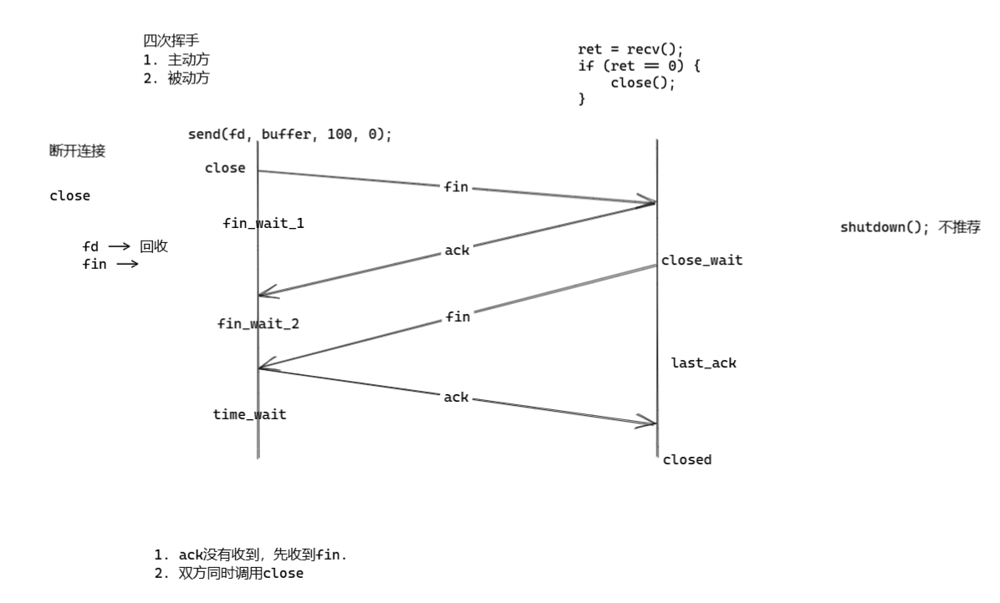

> **四次挥手流程**
>
> 假设客户端主动关闭连接，服务器被动关闭：
> 1. **客户端发送FIN** → 进入`FIN_WAIT_1`状态。  
> 2. **服务器回复ACK** → 进入`CLOSE_WAIT`状态，客户端收到后进入`FIN_WAIT_2`。  
> 3. **服务器发送FIN** → 进入`LAST_ACK`状态。  
> 4. **客户端回复ACK** → 进入`TIME_WAIT`状态，服务器关闭后客户端等待`2MSL`后关闭。
>
> ---
>
> **各状态详解**
>
> 1. **FIN_WAIT_1（客户端）**
>
> - **触发条件**：客户端调用`close()`发送`FIN`报文，请求终止连接。
> - **行为**：  
>   - 等待服务器的`ACK`确认。  
>   - 如果直接收到服务器的`FIN`（极少数情况），说明双方同时关闭，会直接进入`CLOSING`状态。
> - **比喻**：你（客户端）对朋友（服务器）说：“我要挂电话了”（FIN），然后等待对方回应。
>
> ---
>
> 2. **CLOSE_WAIT（服务器）**
>
> - **触发条件**：服务器收到客户端的`FIN`后，回复`ACK`确认。
> - **行为**：  
>   - 服务器进入半关闭状态，仍可向客户端发送未完成的数据。  
>   - 当服务器也准备关闭时，发送自己的`FIN`报文，进入`LAST_ACK`状态。
> - **常见问题**：如果服务器长时间处于`CLOSE_WAIT`，通常是代码未正确调用`close()`，导致资源泄露。  
> - **比喻**：朋友回复：“好的，我知道你要挂了”（ACK），但继续说完自己的话。
>
> ---
>
> 3. **FIN_WAIT_2（客户端）**
>
> - **触发条件**：客户端收到服务器的`ACK`后进入此状态。
> - **行为**：  
>   - 等待服务器发送`FIN`报文。  
>   - 如果长时间未收到`FIN`，可能触发超时（根据系统配置）。
> - **比喻**：你等待朋友说完最后一句话（FIN），然后才能完全挂断。
>
> ---
>
> 4. **LAST_ACK（服务器）**
>
> - **触发条件**：服务器发送自己的`FIN`报文，请求终止连接。
> - **行为**：  
>   - 等待客户端的最后一个`ACK`确认。  
>   - 收到`ACK`后，服务器立即关闭连接。
> - **比喻**：朋友说：“我也说完了，挂了吧”（FIN），等待你的最终确认。
>
> ---
>
> 5. **TIME_WAIT（客户端）**
>
> - **触发条件**：客户端发送最后一个`ACK`后进入此状态。
> - **行为**：  
>   - 等待`2MSL`（Maximum Segment Lifetime，报文最大生存时间，通常30秒~2分钟）。  
>   - **两个作用**：  
>     - 确保最后一个`ACK`能到达服务器（若丢失，服务器会重发`FIN`，客户端可重发`ACK`）。  
>     - 让旧连接的报文在网络中消失，避免与新连接冲突。
> - **常见问题**：高并发服务器可能出现大量`TIME_WAIT`，可通过调整内核参数（如`net.ipv4.tcp_tw_reuse`）优化。  
> - **比喻**：你挂断电话后等2分钟再离开，防止朋友没听到你的“再见”（ACK），需要重说一遍。
>
> ---
>
> 6. **CLOSED（双方）**
>
> - **最终状态**：客户端等待`2MSL`超时后关闭，服务器收到最后一个`ACK`后关闭。
>
> ---
>
> **状态转换图**
>
> ```
> 客户端流程：
> ESTABLISHED → FIN_WAIT_1 → FIN_WAIT_2 → TIME_WAIT → CLOSED
> 
> 服务器流程：
> ESTABLISHED → CLOSE_WAIT → LAST_ACK → CLOSED
> ```
>
> ---
>
> **关键问题解答**
>
> **1. 为什么是四次挥手？**  
>
> - **两次挥手不够**：一方发送`FIN`后，另一方可能还有数据要发送（半关闭状态）。  
> - **三次挥手不够**：双方`FIN`的发送和确认需要独立处理，确保双向数据流完全关闭。
>
> **2. TIME_WAIT为什么需要等待2MSL？**  
>
> - **确保最后一个ACK到达**：若服务器未收到`ACK`，会重发`FIN`，客户端在`2MSL`内可处理。  
> - **清除旧连接报文**：防止相同四元组（源IP、源端口、目标IP、目标端口）的新连接收到旧数据。
>
> **3. 如果最后一次ACK丢失怎么办？**  
>
> - 服务器会重传`FIN`，客户端在`TIME_WAIT`状态下收到后，会**重发ACK**并重置`2MSL`计时器。
>
> ---
>
> **实际场景案例**
>
> #### **场景1：服务器出现大量CLOSE_WAIT**
> - **原因**：服务器未正确调用`close()`关闭连接。  
> - **解决**：检查代码逻辑，确保`FIN`被正确发送（如Java中`socket.close()`）。
>
> #### **场景2：客户端TIME_WAIT过多**
> - **影响**：占用端口资源，可能导致新连接无法建立。  
> - **优化**：  
>   - 开启`tcp_tw_reuse`（允许复用TIME_WAIT连接）。  
>   - 调整`MSL`时间（需谨慎）。
>
> ---
>
> **总结**
>
> 四次挥手通过四个步骤和状态转换，确保了TCP连接的可靠关闭：
> 1. **双向确认**：双方各自发送`FIN`和`ACK`，确认数据完整。  
> 2. **半关闭设计**：允许一方在收到`FIN`后继续发送剩余数据。  
> 3. **容错机制**：`TIME_WAIT`状态防止最后一个`ACK`丢失或旧数据干扰。
>
> 这个过程就像一场礼貌的道别，双方确认彼此都说完话后，才真正挂断电话 📞！


> ==**close**==
>
> fd --> 回收
> fin --> 
>
> ---
>
> - **用法**：`int close(int sockfd);`
> - 原理：
>   - 发送FIN包（TCP四次挥手）
>   - 释放内核资源（缓冲区、套接字结构体）
> - 注意事项：
>   - 可能产生`TIME_WAIT`状态（服务端需处理地址重用）
>   - shutdown()可半关闭连接


> **Q1: ack没有收到，先收到fin**
>
> 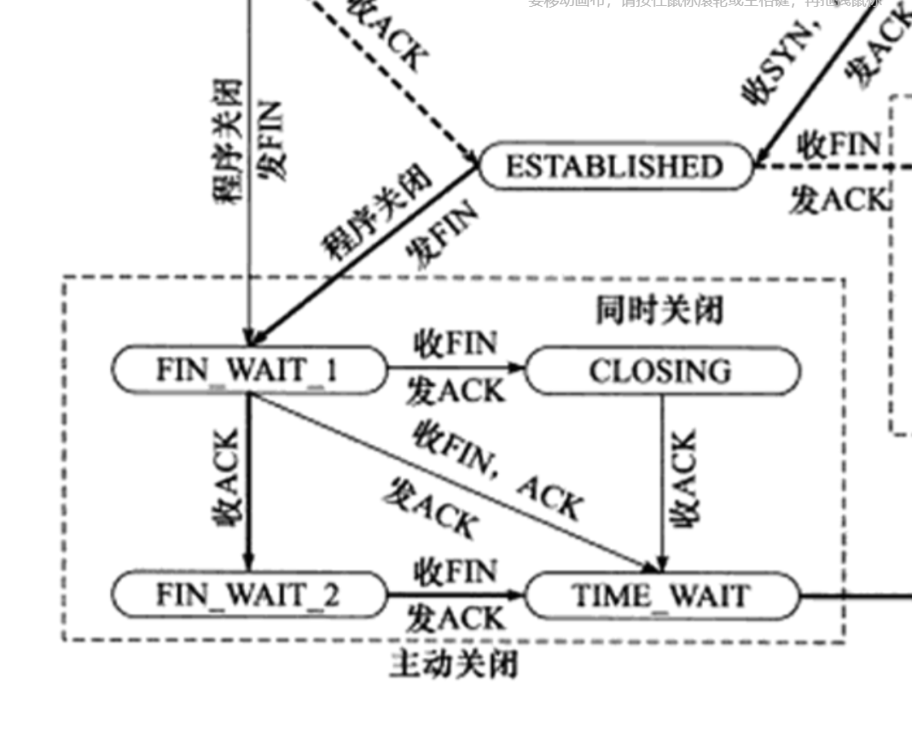
>
> 这种情况的话会走上面的链路，最终的结果是一样的
>
> 
>
> **Q2: 双方同时调用close**
>
> 也就是双方一起发送FIN
>
> 
>
> 这个地方其实可以解释==服务端无缘无故出现大量的time_wait==，但却没有进入关闭。主要可能就是双方一起调用了close的问题


> **Q3: 如果我们不区分客户服务段，如果我们同时发送三次握手会怎么样？什么时候会发生？**
>
> **A:** 用TCP实现P2P
>
> ```c
> fd = socket();
> localaddr, remoteaddr;
> bind( 8000); // optional
> connect();
> ```
>
> 
>
> 
>
> 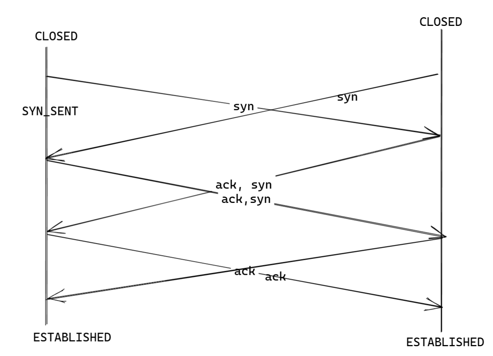


```c
#include <stdio.h>
#include <stdlib.h>
#include <string.h>
#include <unistd.h>
#include <sys/socket.h>
#include <netinet/in.h>
#include <arpa/inet.h>

#define MAX_ATTEMPTS 3
#define TIMEOUT_SEC 5

// 非阻塞连接辅助函数
int async_connect(int sockfd, const struct sockaddr *addr, socklen_t addrlen) {
    int flags = fcntl(sockfd, F_GETFL, 0);
    fcntl(sockfd, F_SETFL, flags | O_NONBLOCK);

    int ret = connect(sockfd, addr, addrlen);
    if (ret == 0) {
        fcntl(sockfd, F_SETFL, flags); // 恢复阻塞模式
        return 1; // 立即连接成功
    }

    if (errno != EINPROGRESS) {
        perror("connect failed");
        return -1;
    }

    // 等待连接完成
    fd_set wfds;
    struct timeval tv = {TIMEOUT_SEC, 0};
    FD_ZERO(&wfds);
    FD_SET(sockfd, &wfds);

    ret = select(sockfd+1, NULL, &wfds, NULL, &tv);
    if (ret <= 0) {
        printf("Connection timeout\n");
        return 0;
    }

    // 检查socket错误
    int error = 0;
    socklen_t len = sizeof(error);
    getsockopt(sockfd, SOL_SOCKET, SO_ERROR, &error, &len);
    if (error != 0) {
        errno = error;
        perror("async connect failed");
        return -1;
    }

    fcntl(sockfd, F_SETFL, flags); // 恢复阻塞模式
    return 1;
}

int main(int argc, char *argv[]) {
    if (argc != 4) {
        printf("Usage: %s <local_ip> <local_port> <remote_ip:remote_port>\n", argv[0]);
        return 1;
    }

    // 解析参数
    char *local_ip = argv[1];
    int local_port = atoi(argv[2]);
    
    char remote_ip[INET_ADDRSTRLEN];
    int remote_port;
    sscanf(argv[3], "%[^:]:%d", remote_ip, &remote_port);

    // 创建TCP socket
    int sockfd = socket(AF_INET, SOCK_STREAM, IPPROTO_TCP);
    if (sockfd < 0) {
        perror("socket creation failed");
        exit(EXIT_FAILURE);
    }

    // 可选绑定本地地址
    struct sockaddr_in local_addr = {
        .sin_family = AF_INET,
        .sin_port = htons(local_port),
        .sin_addr.s_addr = inet_addr(local_ip)
    };
    
    if (bind(sockfd, (struct sockaddr*)&local_addr, sizeof(local_addr)) < 0) {
        perror("bind failed");
        close(sockfd);
        exit(EXIT_FAILURE);
    }

    // 设置目标地址
    struct sockaddr_in remote_addr = {
        .sin_family = AF_INET,
        .sin_port = htons(remote_port),
        .sin_addr.s_addr = inet_addr(remote_ip)
    };

    // 尝试多次连接（应对同时打开）
    for (int attempt = 0; attempt < MAX_ATTEMPTS; attempt++) {
        int result = async_connect(sockfd, (struct sockaddr*)&remote_addr, sizeof(remote_addr));
        
        if (result == 1) {
            printf("Connection established!\n");
            // 进入数据传输阶段...
            break;
        }
        else if (result == -1) {
            close(sockfd);
            exit(EXIT_FAILURE);
        }

        // 等待期间可能收到对方的SYN
        printf("Retrying... (%d/%d)\n", attempt+1, MAX_ATTEMPTS);
        sleep(1);
    }

    close(sockfd);
    return 0;
}
```

**键实现原理说明**

1. **非阻塞连接机制**：
   - 使用`fcntl()`设置非阻塞模式
   - 通过`select()`实现超时控制
   - 检查`SO_ERROR`获取真实错误状态
2. **同时打开处理**：
   - 多次重试连接（模拟双方主动连接）
   - 在等待期间可能接收到对方的SYN包
   - 内核自动完成TCP状态转换（SYN_SENT → SYN_RECV → ESTABLISHED）
3. **端口绑定策略**：
   - 显式绑定固定端口（方便NAT穿透）
   - 使用`SO_REUSEADDR`选项（未展示，需添加）允许端口重用

------

**使用示例**

**终端1**：

bash

```bash
$ ./p2p_tcp 0.0.0.0 12345 192.168.1.100:54321
Retrying... (1/3)
Connection established!
```

**终端2**：

bash

```bash
$ ./p2p_tcp 0.0.0.0 54321 192.168.1.100:12345 
Retrying... (1/3)
Connection established!
```

------

**网络抓包分析（Wireshark示例）**

text

```text
No. Time        Source          Destination     Protocol Info
1   0.000000    192.168.1.100   192.168.1.100   TCP     12345 → 54321 [SYN] 
2   0.000123    192.168.1.100   192.168.1.100   TCP     54321 → 12345 [SYN] 
3   0.000256    192.168.1.100   192.168.1.100   TCP     12345 → 54321 [SYN, ACK] 
4   0.000379    192.168.1.100   192.168.1.100   TCP     54321 → 12345 [SYN, ACK] 
```

> 注意：实际场景中双方IP地址可能不同（这里演示同一主机的环回通信）
