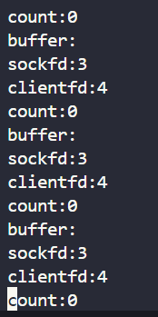

# 25年2月28日
## 手写一个简单版的vector
### 一、Vector的核心功能

- 动态数组，自动扩容
- 随机访问（O(1)时间复杂度）
- 部插入/删除（O(1)均摊时间）
- 支持迭代器
- 深拷贝语义

### 二、代码实现
```c++
#include <iostream>
#include <cassert>

// 步骤 2.1：定义模板类
template <typename T>
class Vector {
private:
    T* data_ = nullptr;       // 数据指针
    size_t size_ = 0;         // 当前元素数量
    size_t capacity_ = 0;     // 当前分配的内存容量

public:
    // 默认构造函数
    Vector() = default;

    // 析构函数
    ~Vector() {
        delete[] data_;
    }


    //==========================================================
    // 步骤 2.2：实现push_back和扩容
    void push_back(const T& value) {
        if (size_ >= capacity_) {
            // 扩容策略：容量为0时设为1，否则翻倍
            size_t new_cap = (capacity_ == 0) ? 1 : capacity_ * 2;
            reserve(new_cap);
        }
        data_[size_++] = value; // 在尾部插入元素
    }
    
    void reserve(size_t new_cap) {
        if (new_cap > capacity_) {
            T* new_data = new T[new_cap]; // 分配新内存
            // 复制旧数据到新内存
            for (size_t i = 0; i < size_; ++i) {
                new_data[i] = data_[i];
            }
            delete[] data_;      // 释放旧内存
            data_ = new_data;
            capacity_ = new_cap;
        }
    }
    //==========================================================


    //==========================================================
    // 步骤 3.1：拷贝构造函数
    Vector(const Vector& other) {
        data_ = new T[other.capacity_];
        size_ = other.size_;
        capacity_ = other.capacity_;
        for (size_t i = 0; i < size_; ++i) {
            data_[i] = other.data_[i]; // 深拷贝元素
        }
    }
    
    Vector& operator=(Vector other) { // 传值调用，直接复用拷贝构造
        swap(other);
        return *this;
    }
    
    // 步骤 3.2：拷贝赋值运算符（使用copy-and-swap惯用法）​
    void swap(Vector& other) noexcept {
        std::swap(data_, other.data_);
        std::swap(size_, other.size_);
        std::swap(capacity_, other.capacity_);
    }

    Vector& operator=(Vector other) { // 传值调用，直接复用拷贝构造
        swap(other);
        return *this;
    }
    
    void swap(Vector& other) noexcept {
        std::swap(data_, other.data_);
        std::swap(size_, other.size_);
        std::swap(capacity_, other.capacity_);
    }
    //==========================================================


    //==========================================================
    //步骤 3.3：移动构造函数和移动赋值
    // 移动构造函数
    Vector(Vector&& other) noexcept 
    : data_(other.data_), size_(other.size_), capacity_(other.capacity_) {
    other.data_ = nullptr;
    other.size_ = 0;
    other.capacity_ = 0;
    }

    // 移动赋值运算符
    Vector& operator=(Vector&& other) noexcept {
    if (this != &other) {
        delete[] data_;
        data_ = other.data_;
        size_ = other.size_;
        capacity_ = other.capacity_;
        other.data_ = nullptr;
        other.size_ = 0;
        other.capacity_ = 0;
    }
    return *this;
    }
    //==========================================================


    //==========================================================
    //4. 完善元素访问与迭代器
    //​步骤 4.1：operator[]和at()
    T& operator[](size_t index) {
        return data_[index];
    }
    
    const T& operator[](size_t index) const {
        return data_[index];
    }
    
    T& at(size_t index) {
        if (index >= size_) {
            throw std::out_of_range("Index out of range");
        }
        return data_[index];
    }
    //==========================================================


    //==========================================================
    //步骤 4.2：迭代器支持
    using iterator = T*;
    using const_iterator = const T*;

    iterator begin() { return data_; }
    iterator end() { return data_ + size_; }
    const_iterator begin() const { return data_; }
    const_iterator end() const { return data_ + size_; }
    //==========================================================

    //==========================================================
    // 5. 高级操作：insert、erase和emplace_back
    // ​步骤 5.1：insert实现
    iterator insert(iterator pos, const T& value) {
        size_t offset = pos - begin();
        if (size_ >= capacity_) {
            reserve(capacity_ == 0 ? 1 : capacity_ * 2);
        }
        pos = begin() + offset; // 防止扩容后迭代器失效
        // 将pos后的元素后移
        for (auto it = end(); it > pos; --it) {
            *it = std::move(*(it - 1));
        }
        *pos = value;
        ++size_;
        return pos;
    }

    //步骤 5.2：erase实现
    iterator erase(iterator pos) {
        if (pos < begin() || pos >= end()) {
            throw std::out_of_range("Invalid iterator");
        }
        // 将pos后的元素前移
        std::move(pos + 1, end(), pos);
        --size_;
        return pos;
    }

    //步骤 5.3：emplace_back（完美转发）​
    template <typename... Args>
    void emplace_back(Args&&... args) {
        if (size_ >= capacity_) {
            reserve(capacity_ == 0 ? 1 : capacity_ * 2);
        }
        // 在尾部直接构造对象
        new(data_ + size_) T(std::forward<Args>(args)...);
        ++size_;
    }
    //==========================================================
    // 6. 边界处理与优化
    // ​步骤 6.1：pop_back和clear
    void pop_back() {
        if (size_ > 0) {
            --size_;
            data_[size_].~T(); // 显式调用析构函数（对非POD类型必要）
        }
    }
    
    void clear() {
        size_ = 0;
    }

    // 步骤 6.2：resize实现
    void resize(size_t new_size, const T& value = T()) {
        if (new_size > size_) {
            reserve(new_size);
            for (size_t i = size_; i < new_size; ++i) {
                data_[i] = value;
            }
        }
        size_ = new_size;
    }
    //==========================================================


    //==========================================================
    // 基础功能占位
    size_t size() const { return size_; }
    size_t capacity() const { return capacity_; }
    bool empty() const { return size_ == 0; }
};


// 步骤 2.3：测试基础功能
void test1_base(){
    Vector<int> v;
    v.push_back(1);
    v.push_back(2);
    assert(v.size() == 2);
    assert(v.capacity() == 2);
}

void test2_up(){
    Vector<int> v;
    v.push_back(1);
    v.emplace_back(2);
    assert(v.size() == 2);

    Vector<int> v2 = v; // 测试拷贝构造
    assert(v2[0] == 1);

    v.insert(v.begin(), 0);
    assert(v[0] == 0);

    v.erase(v.begin());
    assert(v[0] == 1);
}

int main(){
    test1_base();
    // test2_up();
    return 0;
}
```


# 25年2月29日

## 网络IO与IO多路复用

```cpp
#include <iostream>
int main()
{
    return 0;
}
```

首先思考这个代码是怎么被执行的


### 一、网络IO

这边补充说一下不同地址的问题

```
(base) zzx@zzx:~/Finding_work/2.1.1-multi-io$ ifconfig
eno1: flags=4163<UP,BROADCAST,RUNNING,MULTICAST>  mtu 1500
        inet 192.168.1.122  netmask 255.255.255.0  broadcast 192.168.1.255
        inet6 fe80::82e8:2cff:fe29:ef0e  prefixlen 64  scopeid 0x20<link>
        ether 80:e8:2c:29:ef:0e  txqueuelen 1000  (以太网)
        RX packets 90954  bytes 134647431 (134.6 MB)
        RX errors 0  dropped 0  overruns 0  frame 0
        TX packets 43593  bytes 3238996 (3.2 MB)
        TX errors 0  dropped 0 overruns 0  carrier 0  collisions 0

lo: flags=73<UP,LOOPBACK,RUNNING>  mtu 65536
        inet 127.0.0.1  netmask 255.0.0.0
        inet6 ::1  prefixlen 128  scopeid 0x10<host>
        loop  txqueuelen 1000  (本地环回)
        RX packets 263  bytes 25795 (25.7 KB)
        RX errors 0  dropped 0  overruns 0  frame 0
        TX packets 263  bytes 25795 (25.7 KB)
        TX errors 0  dropped 0 overruns 0  carrier 0  collisions 0

wlo1: flags=4163<UP,BROADCAST,RUNNING,MULTICAST>  mtu 1500
        inet 192.168.1.116  netmask 255.255.255.0  broadcast 192.168.1.255
        inet6 fe80::d16d:f3a0:7b8f:6ede  prefixlen 64  scopeid 0x20<link>
        ether d4:d2:52:a8:61:19  txqueuelen 1000  (以太网)
        RX packets 1354  bytes 103934 (103.9 KB)
        RX errors 0  dropped 0  overruns 0  frame 0
        TX packets 330  bytes 33241 (33.2 KB)
        TX errors 0  dropped 0 overruns 0  carrier 0  collisions 0

```


> 这边eno1是我们跟外部设备通信的地址，例如我现在用ssh连接。
>
> lo：回环地址则是内部线程之间通信使用到的地址，
>
> any 0.0.0.0：这个则是我们不知道用什么就写这个


### 二、初始化写一个TCP连接

```c
#include <sys/socket.h>     // 套接套接字操作相关函数和数据结构
#include <errno.h>          // 错误码定义（如errno）
#include <netinet/in.h>     // IPv4地址结构sockaddr_in定义

#include <stdio.h>
#include <string.h>
#include <unistd.h>


// tcp
int main()
{
    int sockfd = socket(AF_INET, SOCK_STREAM, 0);   
    struct sockaddr_in serveraddr;

    // 将serveraddr结构体的所有字节置为0，避免残留数据干扰后续操作。
    // 网络编程中结构体可能存在填充字节，未清零可能导致bind()失败
    memset(&serveraddr, 0, sizeof(struct sockaddr_in));
    
    serveraddr.sin_family = AF_INET;
    serveraddr.sin_addr.s_addr = htonl(INADDR_ANY);
    serveraddr.sin_port = htons(2048);

    // bind()_绑定套接字与地址。将套接字关联到特定的IP地址和端口，使客户端能通过该地址访问服务。
    if (-1 == bind(sockfd, (struct sockaddr *)&serveraddr, sizeof(struct sockaddr)))
    {
        perror("bind");
        return -1;
    }

    // 将套接字设置为被动模式，准备接受客户端的连接请求。
    listen(sockfd, 10);
    getchar();
}

```

具体的代码解析如下：

**1.`socket()` - 创建通信端点**

```c
int sockfd = socket(AF_INET, SOCK_STREAM, 0);
```

**作用**：创建一个用于网络通信的套接字（类似文件描述符），是后续所有操作的基础。

**参数详解**

- **`AF_INET`**：指定使用IPv4协议族（Address Family）。其他常见值如`AF_INET6`（IPv6）、`AF_UNIX`（本地通信）。
- **`SOCK_STREAM`**：指定使用面向连接的TCP协议。特点是有序、可靠、双向字节流。若使用UDP则为`SOCK_DGRAM`。
- **`0`**：自动选择协议类型。对于TCP，等价于`IPPROTO_TCP`；UDP则为`IPPROTO_UDP`。

**返回值**

- **成功**：返回非负整数，即套接字描述符（类似文件句柄）。
- **失败**：返回-1，错误码存储在`errno`中（可通过`perror`打印）。

**类比**：就像安装了一部电话机，但尚未插线（未绑定地址）或开机（未监听）。


**2. `memset()` - 内存初始化**

```c
memset(&serveraddr, 0, sizeof(struct sockaddr_in));
```

**作用**：将`serveraddr`结构体的所有字节置为0，避免残留数据干扰后续操作。

**关键性**：网络编程中结构体可能存在填充字节，未清零可能导致`bind()`失败。

**参数**

- **目标地址**：`&serveraddr`。
- **填充值**：`0`（全部字节置0）。
- **长度**：`sizeof(struct sockaddr_in)`（确保覆盖整个结构体）。


**3. `bind()` - 绑定套接字与地址**

```c
bind(sockfd, (struct sockaddr *)&serveraddr, sizeof(struct sockaddr));
```

**作用**：将套接字关联到特定的IP地址和端口，使客户端能通过该地址访问服务。

**参数解析**

- **`sockfd`**：由`socket()`返回的描述符。
- **`(struct sockaddr *)&serveraddr`**：将`sockaddr_in`强制转换为通用地址结构体`sockaddr`（历史原因，需统一接口）。
- **`sizeof(struct sockaddr)`**：地址结构体的大小。此处有潜在问题（应使用`sizeof(serveraddr)`）。

**地址结构体字段**

- **`sin_family`**：必须与`socket()`的地址族一致（此处为`AF_INET`）。
- **`sin_addr.s_addr`**：IP地址（`INADDR_ANY`表示监听所有本地网卡）。
- **`sin_port`**：端口号（需用`htons()`转换为网络字节序）。


**常见错误**

- **`EADDRINUSE`**：端口被占用。
- **`EACCES`**：绑定到特权端口（<1024）无root权限。

**类比**：为电话机分配电话号码（IP+端口），允许他人拨打。


**4. `listen()` - 开启监听模式**

```c
listen(sockfd, 10);
```

**作用**：将套接字设置为被动模式，准备接受客户端的连接请求。

**参数详解**

- **`sockfd`**：已绑定地址的套接字。
- **`10`**：内核维护的未完成连接队列的最大长度（实际值可能被系统调整，如Linux默认为128）。

**队列类型**

- **未完成队列（SYN队列）**：客户端发送SYN后处于`SYN_RCVD`状态。
- **已完成队列（ACCEPT队列）**：已完成三次握手，等待`accept()`取出。

**返回值**：成功返回0，失败返回-1（需检查错误）。

**类比**：电话机开机并设置为响铃模式，等待来电。


**5. `getchar()` - 阻塞程序退出**

```c
getchar(); // 等待用户输入
```

**作用**：防止程序立即结束，保持服务器运行以便测试。

**实际应用**：真实服务器应使用事件循环（如`while(1)` + `accept()`）持续处理请求。

**潜在问题**：此处仅为演示，无实际连接处理逻辑。


**6. `perror()` - 打印错误信息**

```c
perror("bind"); // 输出错误原因
```

**作用**：根据`errno`的值，输出描述性错误信息到标准错误流。

**格式**：输出“bind: 具体错误”，例如“bind: Address already in use”。

**依赖**：需包含`errno.h`，且函数调用失败后立即使用（`errno`可能被后续调用覆盖）。


**7.函数调用关系图**

```plaintext
socket() → bind() → listen() → getchar()
           |           |
           ↓           ↓
        分配地址      开启监听
```


**8. 关键注意事项总结**

**字节序转换**：

- `htons()`：将16位端口号从主机字节序（小端/大端）转为网络字节序（大端）。
- `htonl()`：用于32位IP地址（如`INADDR_ANY`的转换）。

**结构体类型转换**：

- `sockaddr_in`（IPv4专用）→ `sockaddr`（通用地址结构），保证接口统一。


### 三、补充接受代码

```
	// 补充接受数据部分
    struct sockaddr_in clientaddr;
    socklen_t len = sizeof(clientaddr);
    //当我们运行代码的时候首先会阻塞在这个地方，而不是阻塞在下面的getchar();
    int clientfd = accept(sockfd, (struct sockaddr *)&clientaddr, &len);

    printf("sockfd:%d\nclientfd:%d", sockfd, clientfd);
    close(clientfd);
```

 **1.`struct sockaddr_in clientaddr`**

- **作用**：定义一个IPv4地址结构体，用于存储**客户端**的连接信息（IP和端口）。
- 关键字段：
  - `sin_family`：地址族（自动填充为`AF_INET`）。
  - `sin_port`：客户端的端口号（网络字节序）。
  - `sin_addr`：客户端的IP地址（可通过`inet_ntoa()`转换为字符串）。

------

**2. `socklen_t len = sizeof(clientaddr)`**

- **作用**：声明一个变量表示地址结构体的大小，供`accept()`函数使用。
- **传递方式**：必须传递指针（`&len`），因为`accept()`可能修改此值以反映实际写入的地址大小。

------

**3. `accept()` - 接受客户端连接**

```c
int clientfd = accept(sockfd, (struct sockaddr *)&clientaddr, &len);
```

- **作用**：从监听队列中取出一个已完成的连接，并返回一个新的套接字描述符（`clientfd`）。

- 

  参数详解：

  - **`sockfd`**：监听套接字（由`socket()`创建并通过`bind()`+`listen()`启用）。
  - **`(struct sockaddr *)&clientaddr`**：存储客户端地址信息的结构体（需强制类型转换）。
  - **`&len`**：输入时为地址结构体大小，输出时为实际写入的地址大小。

- 

  返回值：

  - **成功**：返回一个新的套接字描述符（`clientfd`），用于与客户端通信。
  - **失败**：返回-1（需检查`errno`）。

- **阻塞机制**：若监听队列中没有已完成的连接，`accept()`会阻塞直到有客户端连接。

- **类比**：电话接线员从等待队列中接听一个来电，并为该通话分配专用线路（`clientfd`）。

------

**4. `printf()` - 打印文件描述符**

```c
printf("sockfd:%d\nclientfd:%d", sockfd, clientfd);
```

- **输出示例**：`sockfd:3` 和 `clientfd:4`。

  原因分析：

  - **文件描述符分配规则**：Linux内核按最小可用原则分配描述符。
  - 标准流占用：程序启动时自动打开三个文件描述符：
    - `0`：标准输入（stdin）
    - `1`：标准输出（stdout）
    - `2`：标准错误（stderr）
  - 套接字顺序：
    1. `socket()`创建监听套接字时，分配下一个可用的最小描述符（即3 → `sockfd=3`）。
    2. `accept()`创建连接套接字时，继续分配下一个可用值（即4 → `clientfd=4`）


### 四、具体来写接受部分代码

```c
  printf("accept\n");

  char buffer[128] = {0};

  int count = recv(clientfd, buffer, 128, 0);
```

**具体实现的时候我们会使用while来进行嵌套循环检测接受信息，但是有没有办法让我们直接写个接口，检测到就拉起处理呢?**

==有！！！！==，这边可以使用sigio，它会调用sig.handler(sigio, handler)然后拉起我们需要的实现的流程，raise起来。

ps：这个技术很老了  现在一般没有人去使用这个技术了。！！


==思考==

==这边为什么会出现我点击创建服务器，创建tcp连接发送后，关闭代码，但是出现timeout的问题，同时报错bind: Address already in use==

**问题分析：TCP服务器开发中的两个关键问题**

**问题一：`bind: Address already in use` 错误**

**问题二：`recv` 函数导致的超时**

------

**1. `recv` 函数深度解析**

```c
int count = recv(clientfd, buffer, 128, 0);
```

**函数作用**

- 从已连接的套接字（`clientfd`）接收数据，将数据存入 `buffer`。
- **类比**：类似于从水管（连接）中读取水流（数据）。

------

**参数详解**

|    参数    |                             说明                             |
| :--------: | :----------------------------------------------------------: |
| `clientfd` |           已连接的套接字描述符（由 `accept` 返回）           |
|  `buffer`  |                     存储接收数据的缓冲区                     |
|   `128`    |                  缓冲区最大容量（避免溢出）                  |
|    `0`     | 标志位（常见选项：`MSG_WAITALL`阻塞收满数据，`MSG_DONTWAIT`非阻塞） |

------

**返回值意义**

|  返回值  |                   含义                    |
| :------: | :---------------------------------------: |
| **`>0`** | 实际接收的字节数（可能小于请求的128字节） |
| **`0`**  |    对方已关闭连接（需关闭`clientfd`）     |
| **`-1`** |           出错（需检查`errno`）           |

------

**2. 问题一：`bind: Address already in use` 的根源**

**原因分析**

- ==**TCP 四次挥手机制**：服务器关闭后，端口进入 **`TIME_WAIT` 状态**（默认等待2MSL，约60秒）。==
- ==**直接重启服务器**：试图绑定同一端口时，内核拒绝重用处于`TIME_WAIT`的地址。==

------

**解决方案**

通过设置 `SO_REUSEADDR` 选项允许地址重用：

```c
int opt = 1;
setsockopt(sockfd, SOL_SOCKET, SO_REUSEADDR, &opt, sizeof(opt));
```

**代码位置**：在 `bind()` 之前调用。

------

**3. 问题二：`recv` 超时和代码卡死**

**原因分析**

- **阻塞模式默认行为**：`recv` 会无限等待数据到来。
- **客户端未发送数据**：若客户端连接后不发送数据，`recv` 永久阻塞。
- ==**未处理连接关闭**：客户端意外断开时，服务器可能卡在 `recv`。==

------

**解决方案**

**(1) 设置接收超时**

通过 `setsockopt` 设置超时时间：

```c
struct timeval tv;
tv.tv_sec = 5;  // 5秒超时
tv.tv_usec = 0;
setsockopt(clientfd, SOL_SOCKET, SO_RCVTIMEO, &tv, sizeof(tv));
```

**(2) 正确处理返回值**

```c
int count = recv(clientfd, buffer, 128, 0);
if (count > 0) {
    // 成功接收数据
} else if (count == 0) {
    // 客户端正常关闭连接
    close(clientfd);
} else {
    // 处理错误（如超时、连接重置）
    if (errno == EAGAIN || errno == EWOULDBLOCK) {
        printf("Recv timeout!\n");
    } else {
        perror("Recv error");
    }
    close(clientfd);
}
```

### 五、服务端Socket API核心解析

你的老师提到的“服务端只有这些API”，指的是用C语言开发TCP服务端必须掌握的基础系统调用。这些API构成了服务端网络通信的核心骨架，所有服务端程序都基于这些函数构建。以下是详细解析：

------

**服务端开发必备API清单**

|  API名称   |          作用          | 调用顺序 |
| :--------: | :--------------------: | :------: |
| `socket()` | 创建通信端点（套接字） |    1     |
|  `bind()`  |  绑定IP和端口到套接字  |    2     |
| `listen()` |  将套接字设为监听模式  |    3     |
| `accept()` |     接受客户端连接     |    4     |
|  `recv()`  |        接收数据        |    5     |
|  `send()`  |        发送数据        |    6     |
| `close()`  |       关闭套接字       |    7     |


### **六、TCP连接的核心状态**

**TCP协议状态机** 中的关键状态，描述了TCP连接从建立到关闭的全生命周期。理解这些状态对网络编程、服务端调试、性能优化至关重要。以下是深度解析：

#### 1. 状态流转图

用一张图快速理解TCP状态流转：

```
客户端                                      服务端
  |                                          |
  |--------------- SYN -------------------->| 
  |<------------- SYN+ACK ------------------| 
  |--------------- ACK -------------------->| 
  |       (ESTABLISHED)               (ESTABLISHED)
  |                                          |
  |--------------- FIN -------------------->| 
  |<------------- ACK ----------------------| 
  |<------------- FIN ----------------------| 
  |--------------- ACK -------------------->| 
  |      (TIME_WAIT)                   (CLOSED)
```

------

#### **2. 详解每个状态**

**1. `LISTEN`（监听状态）**

- **触发条件**：服务端调用 `listen()` 后进入该状态。

- 技术含义：

  - 服务端准备好接收客户端的 `SYN` 连接请求。
  - 操作系统内核维护一个 **未完成连接队列**（存放收到SYN但未完成三次握手的连接）。

- 代码示例：

  ```c
  int sockfd = socket(AF_INET, SOCK_STREAM, 0);
  bind(sockfd, ...);
  listen(sockfd, 5);  // 进入LISTEN状态，队列最大长度为5
  ```

- 关键问题：

  - **队列溢出**：若客户端大量快速发起连接，可能导致队列满，新连接被丢弃（客户端收到 `ECONNREFUSED`）。


**2. `ESTABLISHED`（已建立连接）**

- **触发条件**：完成三次握手后，客户端和服务端均进入此状态。
- 技术含义：
  - 双方可以自由收发数据。
  - 此状态持续到某一方主动发起关闭（调用 `close()` 或发送 `FIN` 包）。
- **现实类比**：电话接通后，双方可以正常对话。


**3. `CLOSE_WAIT`（等待关闭）**

- **触发条件**：服务端收到客户端的 `FIN` 包（即客户端主动关闭），并回复 `ACK` 后进入此状态。

- 技术含义：

  - 服务端需要处理完剩余数据，再调用 `close()` 发送自己的 `FIN` 包。
  - **危险信号**：大量 `CLOSE_WAIT` 状态连接表明服务端未正确关闭套接字（代码bug）。

- 代码问题示例：

  ```c
  // 错误！收到FIN后没有调用close()
  char buffer[1024];
  recv(sockfd, buffer, sizeof(buffer), 0); // 收到0字节（FIN）
  // 忘记 close(sockfd); → 连接永远处于CLOSE_WAIT
  ```

- 解决方案：

  - 确保在代码逻辑中检测到 `recv()` 返回0时，立即关闭套接字。


**4. `TIME_WAIT`（等待计时）**

- **触发条件**：主动关闭方（先发送 `FIN` 的一方）在发送最后一个 `ACK` 后进入此状态。

- 技术含义：

  - 持续 **2MSL**（Maximum Segment Lifetime，通常为60秒）。
  - 确保网络中残留的旧数据包消失，避免影响新连接。

- 现实意义：

  - 想象挂断电话后等待几秒再离开，防止对方还有话没说完。

- 关键问题：

  - **端口占用**：短时间内大量 `TIME_WAIT` 连接可能导致端口耗尽。

  - 解决方案：

    ```c
    int opt = 1;
    setsockopt(sockfd, SOL_SOCKET, SO_REUSEADDR, &opt, sizeof(opt)); // 允许重用端口
    ```


#### **3. 其他重要状态**

**1. `SYN_SENT`（同步已发送）**

- **触发条件**：客户端调用 `connect()` 发送 `SYN` 后进入此状态。
- **技术含义**：等待服务端的 `SYN+ACK` 响应。

**2. `SYN_RECEIVED`（同步已接收）**

- **触发条件**：服务端收到 `SYN` 并发送 `SYN+ACK` 后进入此状态。
- **技术含义**：等待客户端的 `ACK` 完成三次握手。

**3. `FIN_WAIT_1` 和 `FIN_WAIT_2`**

- **触发条件**：主动关闭方发送 `FIN` 后进入 `FIN_WAIT_1`，收到 `ACK` 后进入 `FIN_WAIT_2`。
- **技术含义**：等待对方的 `FIN` 包。


#### **4. 实战调试技巧**

**1. 查看TCP状态（Linux）**

```bash
netstat -antp | grep -E 'LISTEN|ESTAB|CLOSE_WAIT|TIME_WAIT'
```

输出示例：

```
Proto Recv-Q Send-Q Local Address   Foreign Address  State       PID/Program
tcp   0      0      0.0.0.0:8080    0.0.0.0:*        LISTEN      1234/server
tcp   0      0      192.168.1.5:8080 10.0.0.3:55678   ESTABLISHED 1234/server
tcp   0      0      192.168.1.5:8080 10.0.0.3:55679   CLOSE_WAIT  1234/server
```

**2. 常见问题诊断**

|       状态        |           可能问题            |                     解决方案                      |
| :---------------: | :---------------------------: | :-----------------------------------------------: |
| 大量 `CLOSE_WAIT` |     服务端未正确关闭连接      | 检查代码逻辑，确保 `recv() == 0` 时调用 `close()` |
| 大量 `TIME_WAIT`  |      短连接频繁创建销毁       |           启用 `SO_REUSEADDR` 或连接池            |
|  大量 `SYN_RECV`  | SYN洪水攻击或服务端处理不过来 |     增加 `listen()` 队列长度，启用SYN Cookie      |

------

#### **5. 总结图表**

|      状态      |    角色    |    触发动作     |   生命周期阶段   |
| :------------: | :--------: | :-------------: | :--------------: |
|    `LISTEN`    |   服务端   |   `listen()`    |     等待连接     |
|   `SYN_SENT`   |   客户端   |   `connect()`   |     发起连接     |
| `SYN_RECEIVED` |   服务端   |     收到SYN     |    半连接队列    |
| `ESTABLISHED`  |    双方    |  完成三次握手   |     数据传输     |
|  `CLOSE_WAIT`  | 被动关闭方 |     收到FIN     |  等待应用层关闭  |
|  `TIME_WAIT`   | 主动关闭方 | 发送最后一个ACK | 等待残留数据消失 |

理解这些状态，你就能像“网络医生”一样精准诊断连接问题！


### 七、添加关闭相应

客户端关闭之后，会提示接收到一个长度为0的数据！！



添加一个结束代码

```c
char buffer[128] = {0};
int count = recv(clientfd, buffer, 128, 0);
if(count == 0){
    close(clientfd);
    break;
}
send(clientfd, buffer, count, 0);
printf("sockfd:%d\nclientfd:%d\ncount:%d\nbuffer:%s\n", sockfd, clientfd, count, buffer);
```

这也可以解决问题首先就是一直挑不出循环的问题，一直处于这个循环问题的时候准确来说是因为会有一直给进关闭的要求的问题，接受其实就是一个长度为0的请求，所以会一直循环，如果没有`close(clientfd);`这样的操作的话，整个连接就会处于close_wait 状态，等待关闭这个嵌套字。


### 八、处理一个服务端对应多个客户端的问题

#### 1. 多线程处理这个问题

```c
void *client_thread(void *arg){
    int clientfd = *(int *)arg;
    while(1){
        char buffer[128] = {0};
        int count = recv(clientfd, buffer, 128, 0);
        if(count == 0){
            break;
        }
        send(clientfd, buffer, count, 0);
        printf("clientfd:%d\ncount:%d\nbuffer:%s\n", clientfd, count, buffer);
    }
    close(clientfd);
    return NULL;
}


#else
    while(1){
        struct sockaddr_in clientaddr;
        socklen_t len = sizeof(clientaddr);
        int clientfd = accept(sockfd, (struct sockaddr *)&clientaddr, &len);
        
        pthread_t thid;
        pthread_create(&thid, NULL, client_thread, &clientfd);
    }

#endif

    getchar();
    // 不要将关闭交给服务端，否则另一边端口不会释放，会一直报Timeout
    close(sockfd);
```

这是经典的**“一连接一线程”（Thread-per-Connection）模型**，适用于中小规模并发场景。


在您提供的代码中，为每个客户端连接创建线程的操作是通过以下两行实现的：

c

```c
pthread_t thid;
pthread_create(&thid, NULL, client_thread, &clientfd);
```

这里涉及多线程编程的核心操作，但存在几个关键问题需要注意。下面详细解释这一过程及其潜在风险：

------

**1. 线程创建的基本流程**

- **`pthread_t thid`**：声明一个线程标识符变量，用于存储新线程的ID。

- **

  ```
  pthread_create
  ```

  **：实际创建线程的函数，其参数依次为：

  - **`&thid`**：线程ID的地址，创建成功后会将新线程的ID写入此处。
  - **`NULL`**：线程属性（如栈大小、调度策略等），此处使用默认值。
  - **`client_thread`**：线程入口函数，新线程启动后执行此函数。
  - **`&clientfd`**：传递给线程函数的参数，此处传递客户端文件描述符的地址。

------

#### **2. 参数传递的致命问题**

代码中直接传递了栈变量 `clientfd` 的地址（`&clientfd`），这会导致以下问题：

**2.1 数据竞争（Data Race）**

- 场景示例：
  - 主线程在 `while(1)` 循环中不断接受新连接，每次循环会覆盖 `clientfd` 的值。
  - 当线程A刚读取 `clientfd` 的值时，主线程可能已进入下一轮循环，修改了 `clientfd`，导致线程A实际处理的是另一个客户端的文件描述符。

**2.2 生命周期不匹配**

- **栈变量的短暂性**：`clientfd` 是主线程栈上的变量，其内存在循环迭代中会被重复使用。如果新线程在读取 `clientfd` 时主线程已进入下一轮循环，线程可能读取到无效或错误的值。

------

#### **3. 正确做法：动态内存分配**

为避免数据竞争和生命周期问题，应为每个线程分配独立的内存来传递参数：	

- **分配内存**

```c
int *clientfd_ptr = malloc(sizeof(int));  // 动态分配内存
*clientfd_ptr = clientfd;                // 复制文件描述符的值
```

- **传递内存地址**

```c
pthread_create(&thid, NULL, client_thread, clientfd_ptr);
```

- **线程内释放内存**

在线程函数中释放内存，避免泄漏：

```c
void *client_thread(void *arg) {
    int clientfd = *(int *)arg;
    free(arg);  // 释放动态分配的内存
    // ...处理逻辑
    return NULL;
}
```

#### **4. 线程资源管理**

**4.1 分离线程（Detach）**

默认情况下，线程结束后会保留状态直到被 `pthread_join` 回收（类似进程的僵尸状态）。为避免资源泄漏，应分离线程：

```c
pthread_create(&thid, NULL, client_thread, clientfd_ptr);
pthread_detach(thid);  // 分离线程
```

**4.2 错误处理**

检查 `pthread_create` 的返回值，处理线程创建失败的情况：

```c
if (pthread_create(&thid, NULL, client_thread, clientfd_ptr) != 0) {
    perror("pthread_create failed");
    free(clientfd_ptr);  // 释放内存
    close(clientfd);     // 关闭文件描述符
}
```

------

#### **5. 完整修复后的代码片段**

```c
while(1) {
    struct sockaddr_in clientaddr;
    socklen_t len = sizeof(clientaddr);
    int clientfd = accept(sockfd, (struct sockaddr *)&clientaddr, &len);
    if (clientfd == -1) {
        perror("accept");
        continue;
    }

    // 动态分配内存传递clientfd
    int *clientfd_ptr = malloc(sizeof(int));
    *clientfd_ptr = clientfd;

    pthread_t thid;
    if (pthread_create(&thid, NULL, client_thread, clientfd_ptr) != 0) {
        perror("pthread_create failed");
        free(clientfd_ptr);
        close(clientfd);
    } else {
        pthread_detach(thid);  // 分离线程
    }
}
```

------

#### **6. 总结**

- **为何动态分配**：确保每个线程拥有独立的参数副本，避免主线程循环覆盖数据。
- **为何分离线程**：防止线程结束后资源无法回收，导致内存泄漏。
- **为何检查返回值**：及时处理系统资源不足等异常情况，增强程序健壮性。

通过以上改进，代码能够安全地处理多客户端并发连接，避免数据竞争和资源泄漏问题。
