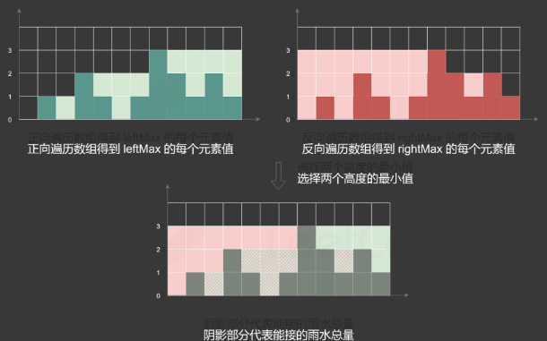
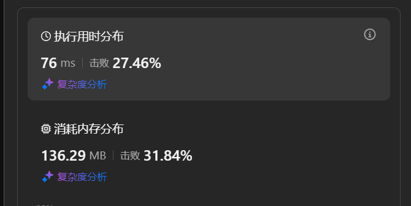
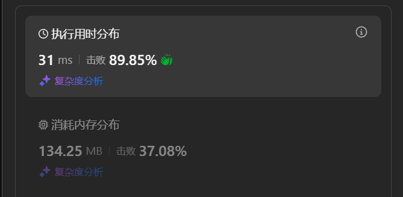
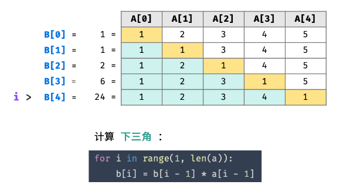
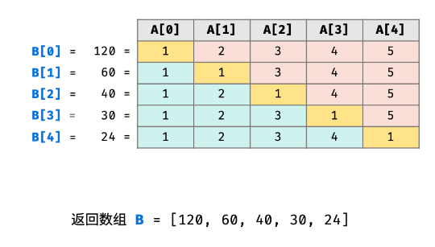
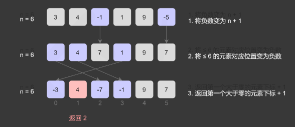
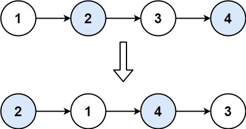
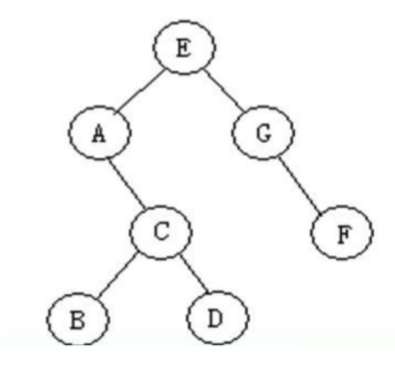

# 2024年

## 24年10月日报

### 24/10/24

#### 【今日计划】

- [x] 【hot100】1. 两数之和
- [x] 【hot100】2. 字母异位词分组
- [x] 【hot100】3. 最长连续序列
- [ ] 【项目】安装Opencv
- [x] 【C++学习】2  STL初识


#### 【学习记录】

**一、两数之和**

> 给定一个整数数组 `nums` 和一个整数目标值 `target`，请你在该数组中找出 **和为目标值** *`target`* 的那 **两个** 整数，并返回它们的数组下标。
> 你可以假设每种输入只会对应一个答案，并且你不能使用两次相同的元素。
> 你可以按任意顺序返回答案。

首先可以看到今天的这几道题的分类是==哈希==，所以需要往这个方向考虑，除此以外==暴力枚举==也需要实现。

1. 暴力枚举方式

```c++
#include <iostream>
#include <string>
#include <vector>

using namespace std;

class Solution 
{
public:
    vector<int> twoSum(vector<int>& nums, int target) 
   {
        int len = nums.size();
        for (int i = 0; i < len - 1; i++)
        {
            for (int j = i + 1; j < len; j++)
            {
                if (nums[i] + nums[j] == target)
                {
                    return {i, j};
                }
            }
        }
        return  {0};
    }
};
```


2. 使用哈希表

```c++
#include <iostream>
#include <string>
#include <vector>
#include <unordered_map>

using namespace std;

class Solution 
{
public:
    vector<int> twoSum(vector<int>& nums, int target) 
    {
        unordered_map<int, int> hashtable;
        int len = nums.size();
        for (int i = 0; i < len; i++) 
        {
            auto it = hashtable.find(target - nums[i]);
            //unordered_map<int, int>::iterator
            if (it != hashtable.end())
            {
                return { i,it->second };
            }
            hashtable[nums[i]] = i;
        }
        return{};
    }
};
```

简单来说，这题目主要是学习一下怎么编写哈希表和哈希表的一些常用函数，下面稍作总结：

- 最简单的就是调用哈希表的库 `#include <unordered_map>`
- 其次对于`hashtable.find(target - nums[i]);`
  `find(key)`会返回一个迭代器，利用`auto`可以自动设置一个迭代器形式`unordered_map<int, int>::iterator`
- 对于上一步的迭代器而言有两个成员变量：first—key，second—value，所以可以调用
- `hashtable.end()`这个函数同样会返回一个迭代器，不过返回的是最后一个元素之后的下一个迭代器（其实就代表着 结束了没找到。


**二、字母异位词分组**

> 给你一个字符串数组，请你将 **字母异位词** 组合在一起。可以按任意顺序返回结果列表。
>
> **字母异位词** 是由重新排列源单词的所有字母得到的一个新单词。

1. 哈希表

```cpp
#include <iostream>
#include <string>
#include <vector>
#include <unordered_map>
#include <algorithm>

using namespace std;

class Solution {
public:
    vector<vector<string>> groupAnagrams(vector<string>& strs) 
    {
        vector<vector<string>> result;
        unordered_map <string, vector<string>> hashmap;

        for (const auto& str : strs) {
            // 将字符串排序，作为键
            string sorted_str = str;
            sort(sorted_str.begin(), sorted_str.end());
            hashmap[sorted_str].push_back(str); // 将原始字符串放入对应的组
        }

        for (auto it = hashmap.begin(); it != hashmap.end(); it++) {
            result.push_back(it->second);
        }
        return result;
    }
};
```


这边有几个注意点需要总结一下：

- 对于哈希表而言`unordered_map`他不能够进行嵌套定义。就是key值不可以为哈希表。
- 换句话来说哈希表的key值必须使用==可哈希的参数。==例如这里使用的是string。
- sort()这个函数可以进行可迭代对象的排序


**三、字母异位词分组**

> 给定一个未排序的整数数组 `nums` ，找出数字连续的最长序列（不要求序列元素在原数组中连续）的长度。
>
> 请你设计并实现时间复杂度为 `O(n)` 的算法解决此问题。

1. 自己哈希表解决

```cpp
#include <iostream>
#include <string>
#include <vector>
#include <unordered_map>
#include <algorithm>

using namespace std;

class Solution {
public:
    int longestConsecutive(vector<int>& nums) {
        unordered_map<int, int> hashmap;
        for (int& num : nums){
            if (hashmap.find(num) == hashmap.end()){
                if (hashmap.find(num - 1) != hashmap.end()){
                    hashmap[num] = hashmap[num - 1] + 1;
                }
                else {
                    hashmap[num] = 1;
                }
            }
            else{
                continue;
            }
            int num2 = num + 1;
            while (hashmap.find(num2) != hashmap.end()){
                num2++;
            }
            hashmap[num2 - 1] = hashmap[num] + num2 - 1 - num;
        }
        int max = 0;
        for (auto it = hashmap.begin(); it != hashmap.end(); it++){
            if (it->second > max){
                max = it->second;
            }
        }
        return max;
    }
};
```

总结一下吧：

- 对是对了但是冗长，最后几个例子超时了

- 重复的查找与遍历：

  - 每当找到一个新的数字（`num`），你都会通过 `while (hashmap.find(num2) != hashmap.end())` 来遍历后续的连续数字序列，直到遇到一个不存在的数字。

  - 然而，对于每一个数字，你都可能会重新从头查找接下来的数字序列。例如，假设你有一组连续的数字 `1, 2, 3, 4, 5`，在处理 `num = 1` 时，你会逐个查找 `2, 3, 4, 5`，然后当处理 `num = 2` 时，你会重新查找这些数字，导致大量重复工作。

- 哈希表的使用效率不高
  - 你在哈希表中保存的是每个数字对应的序列长度。但是每次更新的方式并没有充分利用哈希表高效的查找性能。尤其是连续序列部分的更新，效率较低。


2. 哈希简化版本

```cpp
#include <iostream>
#include <unordered_set>
#include <vector>

using namespace std;

class Solution {
public:
    int longestConsecutive(vector<int>& nums) {
        if (nums.empty()) return 0;

        unordered_set<int> num_set(nums.begin(), nums.end());
        int longestStreak = 0;

        for (int num : num_set) {
            // 只有当 num-1 不存在时，num 才是序列的开始
            if (num_set.find(num - 1) == num_set.end()) {
                int currentNum = num;
                int currentStreak = 1;

                // 向后寻找序列中的连续数字
                while (num_set.find(currentNum + 1) != num_set.end()) {
                    currentNum += 1;
                    currentStreak += 1;
                }

                // 更新最长序列长度
                longestStreak = max(longestStreak, currentStreak);
            }
        }

        return longestStreak;
    }
};
```


==用集合的方式来处理，同时只对序列头进行处理，其实同样的思想也可以运用到简化我的算法上去。==


#### 【今日总结】

**完成：**

今天整体完成了三个力扣题，主要是学了一些容器的使用，哈希的思想还要深化一下，进行一些复杂度的优化。

也稍微了解了一下STL库是什么，后面就是熟悉一些常用函数就行。


**未完成：**

今天主要是第一次用c++进行刷题，收悉了不少东西，明天开始应该会快一点。

---


### 24/10/25

#### 【今日计划】

- [x] 【hot100】4. 移动零
- [x] 【hot100】5. 盛最多水的容器
- [x] 【hot100】6. 三数之和


#### 【学习记录】

**一、移动零**

> 给定一个数组 `nums`，编写一个函数将所有 `0` 移动到数组的末尾，同时保持非零元素的相对顺序。
>
> **请注意** ，必须在不复制数组的情况下原地对数组进行操作。

```cpp
#include <iostream>
#include <string>
#include <vector>
#include <unordered_map>
#include <algorithm>

using namespace std;

class Solution {
public:
    void moveZeroes(vector<int>& nums) {
        int len = nums.size();
        if (len == 1) return;
        int fastLabel =1 , slowLabel = 0;
        int temp;
        while (fastLabel != len && slowLabel != len){
            if (!nums[slowLabel]) {
                if (fastLabel < slowLabel) fastLabel = slowLabel + 1;
                while (fastLabel != len && nums[fastLabel] == 0) {
                    fastLabel++;
                }
                if (fastLabel != len) {
                    temp = nums[fastLabel];
                    nums[fastLabel] = nums[slowLabel];
                    nums[slowLabel] = temp;
                }
                else return;
            }
            slowLabel++;
        }
    }
};
```

感觉这题整体而言并没有什么难度，很简单就是一个快慢指针前后移动，找寻交换位置的做法。

唯一算是小点的话，就是快指针可以从慢指针下一位直接开始。


可以用swap函数进行简化：

```cpp
class Solution {
public:
    void moveZeroes(vector<int>& nums) {
        int len = nums.size();
        if (len == 1) return;
        int fastLabel =1 , slowLabel = 0;
        while (fastLabel != len && slowLabel != len){
            if (!nums[slowLabel]) {
                if (fastLabel < slowLabel) fastLabel = slowLabel + 1;
                while (fastLabel != len && nums[fastLabel] == 0) {
                    fastLabel++;
                }
                if (fastLabel != len) {
                    swap(nums[fastLabel], nums[slowLabel]);
                }
                else return;
            }
            slowLabel++;
        }
    }
};

```


案例写的很简洁，跟我的思路其实是一样的，我需要学习一下写法。当然他也有一些冗余只能说。

```cpp
class Solution {
public:
    void moveZeroes(vector<int>& nums) {
        int n = nums.size(), left = 0, right = 0;
        while (right < n) {
            if (nums[right]) {
                swap(nums[left], nums[right]);
                left++;
            }
            right++;
        }
    }
};
```


**二、盛最多水的容器**

> 给定一个长度为 `n` 的整数数组 `height` 。有 `n` 条垂线，第 `i` 条线的两个端点是 `(i, 0)` 和 `(i, height[i])` 。
>
> 找出其中的两条线，使得它们与 `x` 轴共同构成的容器可以容纳最多的水。
>
> 返回容器可以储存的最大水量。
>
> **说明：**你不能倾斜容器。


1. 模拟方法解决

```cpp
class Solution {
public:
    int maxArea(vector<int>& height) {
        int len = height.size(), maxRes = 0;
        for (int i = 0; i < len - 1; i++) {
            for (int j = i + 1; j < len; j++) {
                maxRes = max((j - i) * min(height[j], height[i]), maxRes);
            }
        }
        return maxRes;
    }
};
```


最简单的就是模拟来解决这个问题，不过很显然会==超时==。


2. 还是要使用双指针

```cpp
class Solution {
public:
    int maxArea(vector<int>& height) {
        int left = 0, right = height.size()-1, maxRes = 0;
        while (left != right) {
            if (height[left] > height[right]) {
                maxRes = max((right - left) * height[right], maxRes);
                right--;
            }
            else {
                maxRes = max((right - left) * height[left], maxRes);
                left++;
            }
        }
        return maxRes;
    }
};
```


说到底这个装水的面积而言，跟较低的边和宽度有关，如果我们要选出最大的，那至少我们要控制其中一个变量==往一个固定的方向变化==：

例如，本题中对于左右指针而言他们都是往中间靠拢的，那对于我们的宽度这一个指标而言，他就是一直变小的，那除非我们的最小边变大，否则面积一定是变小的，由此我们就可以得到最终最大的面积结果。


**三、三数之和**

>给你一个整数数组 `nums` ，判断是否存在三元组 `[nums[i], nums[j], nums[k]]` 满足 `i != j`、`i != k` 且 `j != k` ，同时还满足 `nums[i] + nums[j] + nums[k] == 0` 。请你返回所有和为 `0` 且不重复的三元组。
>
>**注意：**答案中不可以包含重复的三元组。

```cpp
class Solution {
public:
    vector<vector<int>> threeSum(vector<int>& nums) {
        int k = 0, i, j;
        int len = nums.size();
        vector<vector<int>> result;
        sort(nums.begin(),nums.end());
        while (k < len - 2) {
            if (nums[k] > 0) break;
            i = k + 1;
            j = len - 1;
            while (i < j) {
                if (nums[i] + nums[j] + nums[k] == 0) {
                    result.push_back({ nums[i], nums[j], nums[k] });
                    do j--; while (nums[j + 1] == nums[j] && i < j)
                }else if(nums[i] + nums[j] + nums[k] > 0) {
                    do j--; while (nums[j + 1] == nums[j] && i < j);
                }
                else {
                    do i++; while (nums[i - 1] == nums[i] && i < j);
                }
            }
            do k++; while (nums[k - 1] == nums[k] && k < len - 2);
        }
        return result;
    }
};

```


简单来说其实这是类似三指针，首先定下来第一个指针k，这之后指针始终右移，至少这一个数字是一直变大的，对于另外两个指针而言一直向中间夹逼即可，主要需要处理一些重复的状况的优化即可。

简单记录一下遇到的一些小bug吧：

1. `do j--; while (nums[j + 1] == nums[j] && i < j)`这边如果没有设置溢出值限制的话，就会有溢出的风险，需要设置限制，但是也带来了时间的增长。
2. `do k++; while (nums[k - 1] == nums[k] && k < len - 2);`这边其实跟之前一样的问题，首先会存在溢出的问题，除此以外，需要验证是否重复对于我们的`nums[k]`而言。
   如果重复的话需要跳过，否则会存在给出重复三数的问题。


```cpp
class Solution {
public:
    vector<vector<int>> threeSum(vector<int>& nums) {
        sort(nums.begin(), nums.end());
        vector<vector<int>> ans;
        int n = nums.size();
        for (int i = 0; i < n - 2; i++) {
            int x = nums[i];
            if (i && x == nums[i - 1]) continue; // 跳过重复数字
            if (x + nums[i + 1] + nums[i + 2] > 0) break; // 优化一
            if (x + nums[n - 2] + nums[n - 1] < 0) continue; // 优化二
            int j = i + 1, k = n - 1;
            while (j < k) {
                int s = x + nums[j] + nums[k];
                if (s > 0) {
                    k--;
                }
                else if (s < 0) {
                    j++;
                }
                else {
                    ans.push_back({ x, nums[j], nums[k] });
                    for (j++; j < k && nums[j] == nums[j - 1]; j++); // 跳过重复数字
                    for (k--; k > j && nums[k] == nums[k + 1]; k--); // 跳过重复数字
                }
            }
        }
        return ans;
    }
};
```

接下来进行一点优化分析吧：

1. 用for的方式来写可以避免很多自己需要定义k++的问题，以后可以注意尽量这样。
2. `if (i && x == nums[i - 1]) continue; // 跳过重复数字`  这个可以参考一下  比我写的跳过重复要好。
3. `if (x + nums[i + 1] + nums[i + 2] > 0) break; // 优化一
   if (x + nums[n - 2] + nums[n - 1] < 0) continue; // 优化二`  这两行写的很好，比我的跳过思路考虑的更周到。==不仅仅第一个数为正需要被跳过，前三个合起来比0大就可以跳过了其实。==同时末尾小也可以跳过这个循环了。
4. `int x = nums[i];`感觉这也是个小细节，==常用的值不变的，给定义成常量==可以避免多次调用下标查询。


#### 【今日总结】

**完成：**

今天完成了三个双指针的题目，感觉这里面很容易写的冗余，需要好好斟酌一下怎么写，蛮复杂的。


### 24/10/28

#### 【今日计划】

- [x] 【hot100】1.接雨水
- [ ] 【hot100】2.无重复字符的最长子串


#### 【学习记录】

**一、接雨水**

> 给定 `n` 个非负整数表示每个宽度为 `1` 的柱子的高度图，计算按此排列的柱子，下雨之后能接多少雨水。

只能说这道题不愧是苦难题，我一开始的思路烦的要死啊。

1. 动态规划

```cpp
class Solution {
public:
    int trap(vector<int>& height) {
        int len = height.size(), temp = 0;
        vector<int> left_max = vector<int>(len, 0) ;
        vector<int> right_max = vector<int>(len, 0);
        for (int i = 0; i < len; i++) {
            if (height[i] > temp) temp = height[i];
            left_max[i] = temp;
        }
        temp = 0;
        for (int i = len-1; i >=0; i--) {
            if (height[i] > temp) temp = height[i];
            right_max[i] = temp;
        }
        temp = 0;
        for (int i = 0; i < len; i++) {
            temp += min(left_max[i], right_max[i]) - height[i];
        }
        return temp;
    }
};

```

这是第一个方法，按道理来说应该是第一个想到的，==主要是对于任何一个位置而言都应该是两侧最大值中较小的一个减去当前值就是该位置的出水量。==

这样做很显然就可以简单的写出来我这样的做法，就是单纯的比较消耗内存空间。




2. 单调栈

> 除了计算并存储每个位置两边的最大高度以外，也可以用单调栈计算能接的雨水总量。
>
> 维护一个单调栈，单调栈存储的是下标，满足从栈底到栈顶的下标对应的数组 *height* 中的元素递减。
>
> 从左到右遍历数组，遍历到下标 *i* 时，如果栈内至少有两个元素，记栈顶元素为 *top*，*top* 的下面一个元素是 *left*，则一定有 *height*[*left*]≥*height*[*top*]。如果 *height*[*i*]>*height*[*top*]，则得到一个可以接雨水的区域，该区域的宽度是 *i*−*left*−1，高度是 min(*height*[*left*],*height*[*i*])−*height*[*top*]，根据宽度和高度即可计算得到该区域能接的雨水量。
>
> 为了得到 *left*，需要将 *top* 出栈。在对 *top* 计算能接的雨水量之后，*left* 变成新的 *top*，重复上述操作，直到栈变为空，或者栈顶下标对应的 *height* 中的元素大于或等于 *height*[*i*]。
>
> 在对下标 *i* 处计算能接的雨水量之后，将 *i* 入栈，继续遍历后面的下标，计算能接的雨水量。遍历结束之后即可得到能接的雨水总量。

这个是官方题解里面的内容，我只能说看懂就行，不求会的太多。

```cpp
class Solution {
public:
    int trap(vector<int>& height) {
        int ans = 0;
        stack<int> stk;
        int n = height.size();
        for (int i = 0; i < n; ++i) {
            while (!stk.empty() && height[i] > height[stk.top()]) {
                int top = stk.top();
                stk.pop();
                if (stk.empty()) {
                    break;
                }
                int left = stk.top();
                int currWidth = i - left - 1;
                int currHeight = min(height[left], height[i]) - height[top];
                ans += currWidth * currHeight;
            }
            stk.push(i);
        }
        return ans;
    }
};
```


3. 双指针

这个方法里面用到双指针来解决，优化第一种方法的流程。就是说有的时候没有必要知道所有的左右最大值就可以得到最后的结果。

简单来说就是，如果现有的`局部left_max>right_max`,则对与右侧而言一定有`全局left_max>right_max`。则右侧值可以定下来并加之最终结果上。同理对于左侧值同样如此，这样在空间利用率上高了很多。

```cpp
class Solution {
public:
    int trap(vector<int>& height) {
        int ans = 0;
        int left = 0, right = height.size() - 1;
        int leftMax = 0, rightMax = 0;
        while (left < right) {
            leftMax = max(leftMax, height[left]);
            rightMax = max(rightMax, height[right]);
            if (height[left] < height[right]) {
                ans += leftMax - height[left];
                ++left;
            }
            else {
                ans += rightMax - height[right];
                --right;
            }
        }
        return ans;
    }
};
```


#### 【今日总结】

**完成：**

今天虽然只看了一道题目，但这一道题给我的收获应该比之前的要高，主要感觉做这种力扣题，除去模拟，我们就应该发现一些规律化的解题方式。

不够今天==单调栈==的方法还需要后面好好看看。


### 24/10/29

#### 【今日计划】

- [x] 【hot100】1.无重复字符的最长子串

- [x] 【hot100】2. 找到字符串中所有字母异位词


#### 【学习记录】

**一、无重复字符的最长字串**

> 给定一个字符串 `s` ，请你找出其中不含有重复字符的 **最长子串**的长度。
>
> 
>
> **示例 1:**
>
> ```
> 输入: s = "abcabcbb"
> 输出: 3 
> 解释: 因为无重复字符的最长子串是 "abc"，所以其长度为 3。
> ```


1. 滑动窗口方法

首先这是我自己写的一个滑动窗口实现，选择了一个哈希表作为现有无重复字串的每个字符位置存放，然后==进入一个新的字符之后进行长度更新（找到重复位置），不重复则直接长度＋1即可==。这既是我的算法的一个简单思路，这题不难，就这样吧。

```cpp
class Solution {
public:
    int lengthOfLongestSubstring(string s) {
        unordered_map<char, int> hashmap;
        int len = s.size(), temp_len = 0,result = 0;
        for (int i = 0; i < len;++i) {
            char temp_c = s[i];
            auto it = hashmap.find(temp_c);
            if (it != hashmap.end()&& hashmap[temp_c]>=i-temp_len) temp_len = i - hashmap[temp_c];
            else {
                temp_len += 1;
                result = max(temp_len, result);
            }
            hashmap[temp_c] = i;
        }
        return result;
    }
};
```


2. 官方题解

官方题解其实跟我的思路差不多，唯一的区别是它使用的是哈希集合，但是他这样更新新的长度的时候，需要将原有序列进行一次遍历，而我则是直接调用一次原有位置然后相减，不用管子序列中其他字符的问题，明显优于官方题解。

```cpp
class Solution {
public:
    int lengthOfLongestSubstring(string s) {
        // 哈希集合，记录每个字符是否出现过
        unordered_set<char> occ;
        int n = s.size();
        // 右指针，初始值为 -1，相当于我们在字符串的左边界的左侧，还没有开始移动
        int rk = -1, ans = 0;
        // 枚举左指针的位置，初始值隐性地表示为 -1
        for (int i = 0; i < n; ++i) {
            if (i != 0) {
                // 左指针向右移动一格，移除一个字符
                occ.erase(s[i - 1]);
            }
            while (rk + 1 < n && !occ.count(s[rk + 1])) {
                // 不断地移动右指针
                occ.insert(s[rk + 1]);
                ++rk;
            }
            // 第 i 到 rk 个字符是一个极长的无重复字符子串
            ans = max(ans, rk - i + 1);
        }
        return ans;
    }
};

```


**二、 找到字符串中所有字母异位词**

> 给定两个字符串 `s` 和 `p`，找到 `s` 中所有 `p` 的**异位词**的子串，返回这些子串的起始索引。不考虑答案输出的顺序。
>
>  
>
> **示例 1:**
>
> ```
> 输入: s = "cbaebabacd", p = "abc"
> 输出: [0,6]
> 解释:
> 起始索引等于 0 的子串是 "cba", 它是 "abc" 的异位词。
> 起始索引等于 6 的子串是 "bac", 它是 "abc" 的异位词。
> ```


1. 简单滑动窗口

我这里用到的就是对s中每一个长度与p相同的子字符串进行判断，是否是p的一个异位词，但是这样时间会超时。所以需要对算法进行改进。

```cpp
class Solution {
public:
    vector<int> findAnagrams(string s, string p) {
        unordered_map<char, int > p_save;
        vector<int> result;
        for (char c : p) {
            p_save[c] += 1;
        }
        int j = 0;
        int len_p = p.size(), len_s = s.size();
        for (int i = 0; i < len_s - len_p; ++i) {
            unordered_map<char, int > temp_save = p_save;
            for (j = 0; j < len_p; j++) {
                char temp_char = s[i + j];
                auto it = temp_save.find(temp_char);
                if (it == temp_save.end() || temp_save[temp_char] == 0) break;
                else temp_save[temp_char]--;
            }
            if (j == len_p) result.push_back(i);
        }
        return result;
    }
};
```


3. 改进的自己的写的滑动窗口的方法

感觉对一中的方法而言，遍历所有的字符显然是不对的，当存在有问题的局部字符的时候应该直接跳过而不是继续遍历。

```cpp
class Solution {
public:
    vector<int> findAnagrams(string s, string p) {
        unordered_map<char, int > p_save;
        vector<int> result;
        for (char c : p) {
            p_save[c] += 1;
        }
        int j = 0;
        int len_p = p.size(), len_s = s.size();
        for (int i = 0; i < len_s - len_p+1; i++) {
            unordered_map<char, int > temp_save = p_save;
            for (j = 0; j < len_p; j++) {
                char temp_char = s[i + j];
                auto it = temp_save.find(temp_char);
                if (it == temp_save.end() || temp_save[temp_char] == 0) break;
                else temp_save[temp_char]--;
            }
            if (j == len_p) {
                result.push_back(i);
                while (s[i + j] == s[i] && i + j < len_s){
                    i++;
                    result.push_back(i);
                } 
                if (p_save.find(s[i + j]) == p_save.end()) {
                    i = i + j;
                }
            }
            
        }
        return result;
    }
};
```

改写了一下逻辑，进行了首位相同直接输出结果以及遇到不存在集合的问题，但是冗余问题还是没有解决，需要看看滑动窗口怎么理解，用滑动窗口的方法来写。


3.滑动窗口解析

这是题解里面的滑动窗口解法，接下来来分析一下：

```cpp 
class Solution {
public:
    vector<int> findAnagrams(string s, string p) {
        int sLen = s.size(), pLen = p.size();

        if (sLen < pLen) {
            return vector<int>();
        }

        vector<int> ans;
        vector<int> count(26);
        for (int i = 0; i < pLen; ++i) {
            ++count[s[i] - 'a'];
            --count[p[i] - 'a'];
        }

        int differ = 0;
        for (int j = 0; j < 26; ++j) {
            if (count[j] != 0) {
                ++differ;
            }
        }

        if (differ == 0) {
            ans.emplace_back(0);
        }

        for (int i = 0; i < sLen - pLen; ++i) {
            if (count[s[i] - 'a'] == 1) {  // 窗口中字母 s[i] 的数量与字符串 p 中的数量从不同变得相同
                --differ;
            } else if (count[s[i] - 'a'] == 0) {  // 窗口中字母 s[i] 的数量与字符串 p 中的数量从相同变得不同
                ++differ;
            }
            --count[s[i] - 'a'];

            if (count[s[i + pLen] - 'a'] == -1) {  // 窗口中字母 s[i+pLen] 的数量与字符串 p 中的数量从不同变得相同
                --differ;
            } else if (count[s[i + pLen] - 'a'] == 0) {  // 窗口中字母 s[i+pLen] 的数量与字符串 p 中的数量从相同变得不同
                ++differ;
            }
            ++count[s[i + pLen] - 'a'];
            
            if (differ == 0) {
                ans.emplace_back(i + 1);
            }
        }

        return ans;
    }
};
```


他的窗口管理比我的优秀很多，它不需要每组都进行所有字母数量的审核。而是通过一开始一次的审核记录下最终结果，==每次只需要考虑开头结尾两个数字。这在长数组上效率显得尤其的高。==


#### 【今日总结】

今天主要是写了两道滑动窗口的题目，这两道题主要体现了对于窗口管理的重要性，我觉得我这方面是欠缺的，需要==后面对滑动窗口部分的内容进行后续的拓展学习==，不能就这样算了，一定要掌握一定的模板写法。


### 24/10/30

#### 【今日计划】

- [x] 【hot100】1. 和为 K 的子数组
- [x] 【hot100】2. 滑动窗口最大值
- [x] 【hot100】3. 最小覆盖子串
- [x] 【基础学习】前缀和


#### 【学习记录】

**一、和为K的子数组**

> 给你一个整数数组 `nums` 和一个整数 `k` ，请你统计并返回 *该数组中和为 `k` 的子数组的个数* 。
>
> 子数组是数组中元素的连续非空序列。
>
>  
>
> **示例 1：**
>
> ```
> 输入：nums = [1,1,1], k = 2
> 输出：2
> ```

1. 暴力求解

```cpp
class Solution {
public:
    int subarraySum(vector<int>& nums, int k) {
        int len = nums.size();
        int count = 0;
        for (int i = 0; i < len; i++) {
            int sum = 0;
            for (int end = i; end < len; end++) {
                sum += nums[end];
                if (sum == k) count++;
            }
        }
        return count;
    }
};
```


这样的遍历所有的子串固然没有问题，但是显然这种模拟是有问题的。时间复杂度上太差了，需要考虑其他方法。


2. 前缀和

```cpp
class Solution {
public:
    int subarraySum(vector<int>& nums, int k) {
        int len = nums.size();
        int count = 0;
        unordered_map<int, int> hashmap;
        int sum_temp=0;
        for (int i = 0; i < len; i++) {
            sum_temp += nums[i];
            int num = sum_temp - k;
            
            auto it = hashmap.find(num);
            if (it != hashmap.end()) count += hashmap[num];
            
            hashmap[sum_temp] += 1;
        }
        return count+ hashmap[k];
    }
};

```


这是改写的前缀和方法，通过对于后面的==和sum_latter而言，如果要求差值为k，则前面的sum_early需要为b-sum_latter==，所以我们可以就可以统计每一个前缀和的值和对应的数量。

最后==还要加上一个等于k==的情况，那就是从头到尾，不用减。


**二、滑动窗口最大值**

> 给你一个整数数组 `nums`，有一个大小为 `k` 的滑动窗口从数组的最左侧移动到数组的最右侧。你只可以看到在滑动窗口内的 `k` 个数字。滑动窗口每次只向右移动一位。
>
> 返回 *滑动窗口中的最大值* 。
>
>  
>
> **示例 1：**
>
> ```
> 输入：nums = [1,3,-1,-3,5,3,6,7], k = 3
> 输出：[3,3,5,5,6,7]
> 解释：
> 滑动窗口的位置                最大值
> ---------------               -----
> [1  3  -1] -3  5  3  6  7       3
>  1 [3  -1  -3] 5  3  6  7       3
>  1  3 [-1  -3  5] 3  6  7       5
>  1  3  -1 [-3  5  3] 6  7       5
>  1  3  -1  -3 [5  3  6] 7       6
>  1  3  -1  -3  5 [3  6  7]      7
> ```


1. 使用优先队列

```cpp
class Solution {
public:
    vector<int> maxSlidingWindow(vector<int>& nums, int k) {
        vector<int> ans;
        priority_queue<pair<int,int>> max_q;
        int len = nums.size();
        for (int i = 0; i < k; i++) max_q.emplace(nums[i], i);
        ans.push_back(max_q.top().first);
        for (int i = k; i < len; i++) {
            max_q.emplace(nums[i], i);
            while(max_q.top().second <= i - k) max_q.pop();
            ans.push_back(max_q.top().first);
        }
        return ans;
    }
};
```


简单来说这边用了一个容器`priority_queue<>`简单来说这个容器的作用跟他的名字一样，对容器内的数据进行自动的优先级排列。

一般默认的是根据第一个值来判断，例如在这边用到的就是`对组pair<>`这样一个容器，默认的就是跟据pair.first来进行优先级排列。当然这种默认将输入的每一个数据都进行排序的方法自然是会产生问题的，==时间很冗余==

不过还是可以有进行深入研究的地方的，例如这边的优先队列好像是根据堆来实现的，可以后面深入研究一下，同时复习一下堆。


这边还有几个小点可以注意一下：

- `emplace()`感觉可以在绝大多数地方替代`push()`这样的操作，它可以自动进行构造，传入构造函数需要的参数就行了。同样可以跟push一样输入的是一个我们需要的数据类型，因为那样会默认调用拷贝构造函数。
- 对于==优先队列而言是没有队尾的概念==的，所以这个容器而言只有`.pop()`和`.top()`这两个可以使用，而不存在`.front() `、`.back()` `.begin()`、`.end()` 和 `.find()` 需要注意一下
  对于==双向队列而言这些都是存在的==。


2. 双向队列

首先这个双向队列的解法，有一个点是需要我们首先掌握的：就是==下标小且值最小的数字注定不会出现在后续的子串的最大值上==。举例：

1, 3, -1, -3, 5, 3, 6, 7

以这个最简单的例子，对于1而言，除非子串的长度为1，否则包含1的子串注定一定是包含3的，所以这个1可以直接去除掉，不需要纳入我们的考虑范围。

同时，对于已经输入队列的数据还可以==进行一次范围检测，是否在当前子串范围内==，然后进行一次剔除。

```cpp
class Solution {
public:
    vector<int> maxSlidingWindow(vector<int>& nums, int k) {
        deque<pair<int, int>> q;
        int len = nums.size();
        for (int i = 0; i < k; ++i) {
            while (!q.empty() && nums[i] > q.back().first) {
                q.pop_back();
            }
            q.emplace_back(nums[i], i);
        }
        vector<int> ans;
        ans.push_back(q.front().first);
        for (int i = k; i < len; i++) {
            while (!q.empty() && nums[i] > q.back().first) {
                q.pop_back();
            }
            q.emplace_back(nums[i], i);
            while (q.front().second <= i - k) {
                q.pop_front();
            }
            ans.push_back(q.front().first);
        }
        return ans;
    }
};
```

这是我第一遍写的，整体逻辑没有问题，唯一跟题解不同的就是我依旧延续方法1中的使用pair作为存储对象，但这显然消耗了过多内存和运行时间，可能还是要按题解的方法只存储下标。



改进后的做法：

```cpp
class Solution {
public:
    vector<int> maxSlidingWindow(vector<int>& nums, int k) {
        deque<int> q;
        int len = nums.size();
        for (int i = 0; i < k; ++i) {
            while (!q.empty() && nums[i] > nums[q.back()]) {
                q.pop_back();
            }
            q.push_back(i);
        }
        vector<int> ans;
        ans.push_back(nums[q.front()]);
        for (int i = k; i < len; i++) {
            while (!q.empty() && nums[i] > nums[q.back()]) {
                q.pop_back();
            }
            q.push_back(i);
            while (q.front() <= i - k) {
                q.pop_front();
            }
            ans.push_back(nums[q.front()]);
        }
        return ans;
    }
};

```


这边主要是将`emplace_back`替换回了`push_back`，同时将pair改为int，确实有所优化。



不过老实说我感觉这个结果纯纯看运气。


3. 分块 + 预处理

这个应该是解法里面复杂度最低的了，看看了解一下。

```cpp
class Solution {
public:
    vector<int> maxSlidingWindow(vector<int>& nums, int k) {
        int n = nums.size();
        vector<int> prefixMax(n), suffixMax(n);
        for (int i = 0; i < n; ++i) {
            if (i % k == 0) {
                prefixMax[i] = nums[i];
            }
            else {
                prefixMax[i] = max(prefixMax[i - 1], nums[i]);
            }
        }
        for (int i = n - 1; i >= 0; --i) {
            if (i == n - 1 || (i + 1) % k == 0) {
                suffixMax[i] = nums[i];
            }
            else {
                suffixMax[i] = max(suffixMax[i + 1], nums[i]);
            }
        }

        vector<int> ans;
        for (int i = 0; i <= n - k; ++i) {
            ans.push_back(max(suffixMax[i], prefixMax[i + k - 1]));
        }
        return ans;
    }
};
```


这是一个类似稀疏表的方法，稀疏表的相关方法，后续也需要了解一下。


**三、最小覆盖子串**

> 给你一个字符串 `s` 、一个字符串 `t` 。返回 `s` 中涵盖 `t` 所有字符的最小子串。如果 `s` 中不存在涵盖 `t` 所有字符的子串，则返回空字符串 `""` 。
>
>  
>
> **注意：**
>
> - 对于 `t` 中重复字符，我们寻找的子字符串中该字符数量必须不少于 `t` 中该字符数量。
> - 如果 `s` 中存在这样的子串，我们保证它是唯一的答案。
>
>  
>
> **示例 1：**
>
> ```
> 输入：s = "ADOBECODEBANC", t = "ABC"
> 输出："BANC"
> 解释：最小覆盖子串 "BANC" 包含来自字符串 t 的 'A'、'B' 和 'C'。
> ```


1. 滑动窗口的方法

```cpp
class Solution {
public:
    unordered_map <char, int> ori, cnt;

    bool check() {
        for (const auto& p : ori) {
            if (cnt[p.first] < p.second) {
                return false;
            }
        }
        return true;
    }

    string minWindow(string s, string t) {
        for (const auto& c : t) {
            ++ori[c];
        }

        int l = 0, r = -1;
        int len = INT_MAX, ansL = -1, ansR = -1;

        while (r < int(s.size())) {
            if (ori.find(s[++r]) != ori.end()) {
                ++cnt[s[r]];
            }
            while (check() && l <= r) {
                if (r - l + 1 < len) {
                    len = r - l + 1;
                    ansL = l;
                }
                if (ori.find(s[l]) != ori.end()) {
                    --cnt[s[l]];
                }
                ++l;
            }
        }

        return ansL == -1 ? string() : s.substr(ansL, len);
    }
};
```


这个方法其实不复杂，先找到包含，然后压缩即可。然后再扩展再压缩。

 


#### 【每日总结】

主要是处理一些跟子串相关的问题，不过这里有很多需要后面去学习的内容。

==滑动窗口、优先队列、双向队列、稀疏表==的内容都可以去了解一下。


## 24年11月日报

### 24/11/4

#### 【今日计划】

- [x] 【hot100】1. 最大子数组和
- [x] 【hot100】2. 合并区间
- [x] 【hot100】3. 轮转数组


#### 【学习记录】

**一、最大子数组和**

> 给你一个整数数组 `nums` ，请你找出一个具有最大和的连续子数组（子数组最少包含一个元素），返回其最大和。
>
> **子数组**是数组中的一个连续部分。
>
> 
>
> **示例 1：**
>
> ```
> 输入：nums = [-2,1,-3,4,-1,2,1,-5,4]
> 输出：6
> 解释：连续子数组 [4,-1,2,1] 的和最大，为 6 。
> ```


1. 前缀和

这题感觉无脑前缀和，根本不需要思索我只能说。

```cpp
class Solution {
public:
    int maxSubArray(vector<int>& nums) {
        int len = nums.size();
        int minNum = min(0, nums[0]), res = nums[0];
        for (int i = 1; i < len; i++) {
            nums[i] = nums[i - 1] + nums[i];
            res = max(nums[i] - minNum, res);
            minNum = min(minNum, nums[i]);
        }
        return res;
    }
};
```


结束结束，基本上看到什么子数组和的问题，直接前缀和就行了。


**二、合并区间**

> 以数组 `intervals` 表示若干个区间的集合，其中单个区间为 `intervals[i] = [starti, endi]` 。请你合并所有重叠的区间，并返回 *一个不重叠的区间数组，该数组需恰好覆盖输入中的所有区间* 。
>
>  
>
> **示例 1：**
>
> ```
> 输入：intervals = [[1,3],[2,6],[8,10],[15,18]]
> 输出：[[1,6],[8,10],[15,18]]
> 解释：区间 [1,3] 和 [2,6] 重叠, 将它们合并为 [1,6].
> ```


1. 简单模拟方法

```cpp
class Solution {
public:
    vector<vector<int>> merge(vector<vector<int>>& intervals) {
        vector<vector<int>> tempList, ans;
        int len = intervals.size();
        for (auto list2 : intervals) {
            tempList = ans;
            ans = {};
            for (auto list1 : tempList) {
                if ((list2[0] >= list1[0] && list2[0] <= list1[1]) || (list2[1] >= list1[0] && list2[1] <= list1[1]) || (list2[0] <= list1[0] && list2[1] >= list1[1])){
                    list2 = { min(list1[0],list2[0]),max(list1[1],list2[1]) };
                }
                else {
                    ans.push_back(list1);
                }
            }
            ans.push_back(list2);
        }
        return ans;
    }
};

```


简单来看这个方法，就是强力遍历每个区间之间的关系，将合适的合并，而且没有分而治之。所有的方法都是`min`和`max`方法。所以超时的问题也就很好理解了，感觉需要优化不少。可以先排序说实话，然后只要跟相邻的比较就行了。

而且就这个方法我也写烦了，看看逻辑吧。

```cpp
class Solution {
public:
    vector<vector<int>> merge(vector<vector<int>>& intervals) {
        vector<vector<int>> tempList, ans;
        int len = intervals.size();
        for (auto list2 : intervals) {
            tempList = ans;
            ans = {};
            for (auto list1 : tempList) {
                if(list2[0] > list1[1] || list2[1] < list1[0]) {
                    ans.push_back(list1);
                }
                else {
                    list2 = { min(list1[0],list2[0]),max(list1[1],list2[1]) };
                }
            }
            ans.push_back(list2);
        }
        return ans;
    }
};
```


2. 优化比较流程

```cpp
class Solution {
public:
    vector<vector<int>> merge(vector<vector<int>>& intervals) {
        sort(intervals.begin(), intervals.end());
        vector<vector<int>> res;
        int len = intervals.size();
        for (int i = 0; i < len; ++i) {
            int max_right = intervals[i][1], left = intervals[i][0];
            while (i + 1 < len && intervals[i+1][0] <= max_right  ) {
                ++i;
                max_right = max(max_right, intervals[i][1]);
            }
            res.push_back({ left,max_right });
        }
        return res;
    }
};


```

这边先进行排序之后，实际上就是一个逐步合并的过程了，这样的话，不需要元素跟每一个区间都进行比较，大大节省了时间。==整体的合并复杂度是O(n)，复杂度的问题就主要看排序的复杂度了。==


**三、轮转数组**

> 给定一个整数数组 `nums`，将数组中的元素向右轮转 `k` 个位置，其中 `k` 是非负数。
>
>  
>
> **示例 1:**
>
> ```
> 输入: nums = [1,2,3,4,5,6,7], k = 3
> 输出: [5,6,7,1,2,3,4]
> 解释:
> 向右轮转 1 步: [7,1,2,3,4,5,6]
> 向右轮转 2 步: [6,7,1,2,3,4,5]
> 向右轮转 3 步: [5,6,7,1,2,3,4]
> ```


1. 借助辅助数组

最简单的方法，直接模拟就行。

```cpp
class Solution {
public:
    void rotate(vector<int>& nums, int k) {
        vector<int> temp;
        int len = nums.size();
        for (int i = 0; i < len; ++i) {
            temp.push_back(nums[(i + len - k % len) % len]);
        }
        nums = temp;
    }
};

```

怎么说呢  实现了吧。


2. 翻转实现

>  我感觉这个方法很好的啊。
>
> 该方法基于如下的事实：当我们将数组的元素向右移动 k 次后，尾部 kmodn 个元素会移动至数组头部，其余元素向后移动 kmodn 个位置。
>
> 该方法为数组的翻转：我们可以先将所有元素翻转，这样尾部的 kmodn 个元素就被移至数组头部，然后我们再翻转 [0,kmodn−1] 区间的元素和 [kmodn,n−1] 区间的元素即能得到最后的答案。
>
> 我们以 n=7，k=3 为例进行如下展示：
> | 操作                        | 结果          |
> | --------------------------- | ------------- |
> | 原始数组                    | 1 2 3 4 5 6 7 |
> | 翻转所有元素                | 7 6 5 4 3 2 1 |
> | 翻转 [0,kmodn−1] 区间的元素 | 5 6 7 4 3 2 1 |
> | 翻转 [kmodn,n−1] 区间的元素 | 5 6 7 1 2 3 4 |


```cpp
class Solution {
public:
    void reverse(vector<int>& nums, int start, int end) {
        while (start < end) {
            swap(nums[start], nums[end]);
            start += 1;
            end -= 1;
        }
    }

    void rotate(vector<int>& nums, int k) {
        k %= nums.size();
        reverse(nums, 0, nums.size() - 1);
        reverse(nums, 0, k - 1);
        reverse(nums, k, nums.size() - 1);
    }
};

```


#### 【每日总结】

这三道数列题目其实都不难，也不知道是不是自己的做题水平上去了，感觉做着挺好玩的。继续加油咯，还要好好总结。


### 24/11/6

#### 【今日计划】

- [ ] 【hot100】1. 除自身以外数组的乘积
- [ ] 【hot100】2. 缺失的第一个正数
- [x] 【科研】训练[YOLOv8]+[VisDrone]
- [x] 【科研】分析MAFYOLO结构


#### 【学习记录】

**一、除自身以外数组的乘积**

> 给你一个整数数组 `nums`，返回 数组 `answer` ，其中 `answer[i]` 等于 `nums` 中除 `nums[i]` 之外其余各元素的乘积 。
>
> 题目数据 **保证** 数组 `nums`之中任意元素的全部前缀元素和后缀的乘积都在 **32 位** 整数范围内。
>
> 请 **不要使用除法，**且在 `O(n)` 时间复杂度内完成此题。
>
>  
>
> **示例 1:**
>
> ```
> 输入: nums = [1,2,3,4]
> 输出: [24,12,8,6]
> ```

乘积表，感觉这题就是想到方法了就会很简单。简单给个图就可以理解这个方法了。同时我也通过改进得到了空间复杂度为`O(1)`的解法。

```cpp
class Solution {
public:
    vector<int> productExceptSelf(vector<int>& nums) {
        int len = nums.size();
        vector<int> left(len, 1), right(len, 1);
        for (int i = 1; i < len; i++) {
                left[i] = left[i - 1] * nums[i - 1];
                right[len - i - 1] = right[len - i] * nums[len - i];
        }
        for (int i = 0; i < len; ++i) nums[i] = left[i] * right[i];
        return nums;
    }
};
```


解法理解图为：






**二、缺失的第一个正数**

> 给你一个未排序的整数数组 `nums` ，请你找出其中没有出现的最小的正整数。
>
> 请你实现时间复杂度为 `O(n)` 并且只使用常数级别额外空间的解决方案。
>
> **示例 1：**
>
> ```
> 输入：nums = [1,2,0]
> 输出：3
> 解释：范围 [1,2] 中的数字都在数组中。
> ```


1. 不考虑空间

最简单的方法，定义一个集合，然后遍历[1, N]即可，因为长度为N，最大值不过N+1即为结果。但是难在怎么样搞定常熟级别的额外空间。

```cpp
class Solution {
public:
    int firstMissingPositive(vector<int>& nums) {
        int len = nums.size();
        unordered_set<int> tempset;
        for (int num : nums) {
            if (num > 0) tempset.emplace(num);
        }
        for (int i = 1; i <= len; ++i) {
            if (tempset.find(i) == tempset.end()) return i;
        }
        return len+1;
    }
};
```


2. 题解方法

> 实际上，对于一个长度为 N 的数组，其中没有出现的最小正整数只能在 [1,N+1] 中。这是因为如果 [1,N] 都出现了，那么答案是 N+1，否则答案是 [1,N] 中没有出现的最小正整数。这样一来，我们将所有在 [1,N] 范围内的数放入哈希表，也可以得到最终的答案。而给定的数组恰好长度为 N，这让我们有了一种将数组设计成哈希表的思路：
>
> 我们对数组进行遍历，对于遍历到的数 x，如果它在 [1,N] 的范围内，那么就将数组中的第 x−1 个位置（注意：数组下标从 0 开始）打上「标记」。在遍历结束之后，如果所有的位置都被打上了标记，那么答案是 N+1，否则答案是最小的没有打上标记的位置加 1。



这个方法真的不好想，但是学会了就好了

```cpp
class Solution {
public:
    int firstMissingPositive(vector<int>& nums) {
        int len = nums.size();
        unordered_set<int> tempset;
        for (int num : nums) {
            if (num > 0) tempset.emplace(num);
        }
        for (int i = 1; i <= len; ++i) {
            if (tempset.find(i) == tempset.end()) return i;
        }
        return len+1;
    }
};
```


我觉得这个方法最精彩的地方就是，==通过将负数置为N+1，将正数置为负数的方法下，同时将我们的哈希操作和原来位置上的值都给保留下来了。==这个方法非常精彩。


#### 【每日总结】

今天做的两道题不难，还可以，主要是第二个方法通过绝对值进行处理的方法，真的可以记一下！！！！！！！

==【原地哈希方法】==就是绝对值加对应位置取负数操作。


### 24/11/7

#### 【今日计划】

- [x] 【hot100】1. 矩阵置零
- [x] 【hot100】2. 螺旋矩阵
- [x] 【hot100】3. 旋转图像
- [x] 【hot100】4. 搜索二维举证II
- [ ] 【科研】实现并训练[YOLO11]+[分析MAFYOLO结构]
- [x] 【看课】Unit 1
- [x] 【看课】视频1+2


#### 【学习记录】

**一、矩阵置零**

> 给定一个 `*m* x *n*` 的矩阵，如果一个元素为 **0** ，则将其所在行和列的所有元素都设为 **0** 。请使用 **[原地](http://baike.baidu.com/item/原地算法)** 算法**。**
>
>  
>
> **示例 1：**
>
> 
>
> ```
> 输入：matrix = [[1,1,1],[1,0,1],[1,1,1]]
> 输出：[[1,0,1],[0,0,0],[1,0,1]]
> ```


这道题就是遍历一个解法吗？？？

提交了就过了，也没有办法优化。

```cpp
class Solution {
public:
    void setZeroes(vector<vector<int>>& matrix) {
        int m = matrix.size(), n = matrix[0].size();
        vector<int> length(n, 1),width(m,1);
        for (int i = 0; i < m; ++i) {
            for (int j = 0; j < n; ++j) {
                if (matrix[i][j] == 0) {
                    width[i] = 0;
                    length[j] = 0;
                }
            }
        }
        for (int i = 0; i < m; ++i) {
            if (width[i] == 0) matrix[i] = vector<int>(n, 0);
            for (int j = 0; j < n; ++j) {
                if (!length[j]) matrix[i][j] = 0;
            }
        }
    }
};

```


**二、螺旋矩阵**

> 给你一个 `m` 行 `n` 列的矩阵 `matrix` ，请按照 **顺时针螺旋顺序** ，返回矩阵中的所有元素。
>
> 
>
> **示例 1：**
> 
>
> 
>
> ```
> 输入：matrix = [[1,2,3],[4,5,6],[7,8,9]]
> 输出：[1,2,3,6,9,8,7,4,5]
> ```


感觉这道题也不算难，我的解法是暴力模拟咯，走向反正就是四种，右->下->左->上，然后一直循环，把握到这个点就可以写出最终的结果了。

```cpp
class Solution {
public:
    vector<int> spiralOrder(vector<vector<int>>& matrix) {
        int left = 0, right = matrix[0].size() - 1;
        int up = 0, down = matrix.size() - 1;
        vector<int> res = {};
        while (left <= right && up <= down) {
            for (int i = left; i <= right; ++i) {
                res.push_back(matrix[up][i]);
            }
            ++up;
            if (left > right || up > down) break;
            for (int i = up; i <= down; ++i) {
                res.push_back(matrix[i][right]);
            }
            --right;
            if (left > right || up > down) break;
            for (int i = right; i >= left; --i) {
                res.push_back(matrix[down][i]);
            }
            --down;
            if (left > right || up > down) break;
            for (int i = down; i >= up; --i) {
                res.push_back(matrix[i][left]);
            }
            ++left;
        }
        return res;
    }
};

```


**三、旋转图像**

> 给定一个 *n* × *n* 的二维矩阵 `matrix` 表示一个图像。请你将图像顺时针旋转 90 度。
>
> 你必须在**原地** 旋转图像，这意味着你需要直接修改输入的二维矩阵。**请不要** 使用另一个矩阵来旋转图像。
>
>  
>
> **示例 1：**
>
> 
>
> ```
> 输入：matrix = [[1,2,3],[4,5,6],[7,8,9]]
> 输出：[[7,4,1],[8,5,2],[9,6,3]]
> ```


这道题目我的想法就是将这个旋转分为两步：==上下对称交换+对角线交换==。实现即可。


```cpp
class Solution {
public:
    void rotate(vector<vector<int>>& matrix) {
        int n = matrix.size();
        for (int i = 0; i < n / 2; ++i) {
            swap(matrix[i], matrix[n - i - 1]);
        }
        for (int i = 1; i < n; ++i) {
            for (int j = 0; j < i; ++j) {
                swap(matrix[i][j], matrix[j][i]);
            }
        }
    }
};
```


**四、搜索二维矩阵 II**

> 编写一个高效的算法来搜索 `*m* x *n*` 矩阵 `matrix` 中的一个目标值 `target` 。该矩阵具有以下特性：
>
> - 每行的元素从左到右升序排列。
> - 每列的元素从上到下升序排列。
>
>  
>
> **示例 1：**
>
> 
>
> ```
> 输入：matrix = [[1,4,7,11,15],[2,5,8,12,19],[3,6,9,16,22],[10,13,14,17,24],[18,21,23,26,30]], target = 5
> 输出：true
> ```


1. 螺旋缩小

这个方法跟上面那个旋转差不多;

```cpp
class Solution {
public:
    bool searchMatrix(vector<vector<int>>& matrix, int target) {
        int left = 0, right = matrix[0].size() - 1;
        int up = 0, down = matrix.size() - 1;
        while (left <= right && up <= down) {
            for (int i = left; i <= right; ++i) {
                if (matrix[up][i] == target) return true;
                else if (matrix[up][i] > target) right = i - 1;
                else if (i == right) ++up;
            }
            if (left > right || up > down) return false;
            for (int i = down; i >=up; --i) {
                if (matrix[i][right] == target) return true;
                else if (matrix[i][right] < target) up = i + 1;
                else if (i == up) --right;
            }
            if (left > right || up > down) return false;
            for (int i = right; i >= left; --i) {
                if (matrix[down][i] == target) return true;
                else if (matrix[down][i] < target) left = i + 1;
                else if (i == left) --down;
            }
            if (left > right || up > down) return false;
            for (int i = up; i <= down; ++i) {
                if (matrix[i][left] == target) return true;
                else if (matrix[i][left] > target) down = i - 1;
                else if (i == down) ++left;
            }
        }
        return false;
    }
};

```


2. 确定区间后遍历

这个其实是上面方法的简化版本：

```cpp
#include <vector>
using namespace std;

class Solution {
public:
    bool searchMatrix(vector<vector<int>>& matrix, int target) {
        int m = matrix.size(), n = matrix[0].size();
        int a = 0, b = n - 1;

        // 找到可能包含目标值的行范围
        for (int i = 0; i < m; ++i) {
            if (matrix[i][n - 1] >= target) {
                a = i;
                break;
            }
        }

        // 找到可能包含目标值的列范围
        for (int j = 0; j < n; ++j) {
            if (matrix[0][j] > target) {
                b = j - 1;
                break;
            }
        }

        // 在限制的行和列范围中寻找目标值
        for (int i = a; i < m; ++i) {
            for (int j = 0; j <= b; ++j) {
                if (matrix[i][j] == target) {
                    return true;
                }
            }
        }

        return false;
    }
};

```


【分析】

**Python风格代码**：

- 时间复杂度约为 O(m+n+(m−a)×b)O(m + n + (m - a) \times b)O(m+n+(m−a)×b)，依赖于找到的 `a` 和 `b` 值，但可能会遍历大量无效元素。

**螺旋缩小法的C++代码**：

- 理论上，最差情况下会遍历每一个元素，时间复杂度接近 O(m×n)O(m \times n)O(m×n)。但是因为每次遍历后都缩小了行或列范围，这种算法在大部分情况下会更高效，尤其是大矩阵的情况。


3. Z字型查找

```cpp
class Solution {
public:
    bool searchMatrix(vector<vector<int>>& matrix, int target) {
        int m = matrix.size(), n = matrix[0].size();
        int x = 0, y = n - 1;
        while (x < m && y >= 0) {
            if (matrix[x][y] == target) {
                return true;
            }
            if (matrix[x][y] > target) {
                --y;
            }
            else {
                ++x;
            }
        }
        return false;
    }
};

```


我们可以从矩阵 matrix 的右上角 (0,n−1) 进行搜索。在每一步的搜索过程中，如果我们位于位置 (x,y)，那么我们希望在以 matrix 的左下角为左下角、以 (x,y) 为右上角的矩阵中进行搜索，即行的范围为 [x,m−1]，列的范围为 [0,y]：

- 如果 matrix[x,y]=target，说明搜索完成；

- 如果 matrix[x,y]>target，由于每一列的元素都是升序排列的，那么在当前的搜索矩阵中，所有位于第 y 列的元素都是严格大于 target 的，因此我们可以将它们全部忽略，即将 y 减少 1；

- 如果 matrix[x,y]<target，由于每一行的元素都是升序排列的，那么在当前的搜索矩阵中，所有位于第 x 行的元素都是严格小于 target 的，因此我们可以将它们全部忽略，即将 x 增加 1。

在搜索的过程中，如果我们超出了矩阵的边界，那么说明矩阵中不存在 target。


#### 【每日总结】

矩阵这边都是些小题目，感觉没有多少要讲的，继续加油咯。


### 24/11/8

#### 【今日计划】

- [x] 【hot100】1. 相交链表
- [x] 【hot100】2. 反转链表
- [x] 【hot100】3. 回文链表
- [x] 【hot100】4. 环形链表
- [x] 【hot100】5. 环形链表II


#### 【学习记录】

**一、相交链表**

> 给你两个单链表的头节点 `headA` 和 `headB` ，请你找出并返回两个单链表相交的起始节点。如果两个链表不存在相交节点，返回 `null` 。
>
> 图示两个链表在节点 `c1` 开始相交**：**
>
> 
>
> 题目数据 **保证** 整个链式结构中不存在环。
>
> **注意**，函数返回结果后，链表必须 **保持其原始结构** 。
>
> 
>
> 
>
> **示例 1：**
>
> 
>
> ```
> 输入：intersectVal = 8, listA = [4,1,8,4,5], listB = [5,6,1,8,4,5], skipA = 2, skipB = 3
> 输出：Intersected at '8'
> 解释：相交节点的值为 8 （注意，如果两个链表相交则不能为 0）。
> 从各自的表头开始算起，链表 A 为 [4,1,8,4,5]，链表 B 为 [5,6,1,8,4,5]。
> 在 A 中，相交节点前有 2 个节点；在 B 中，相交节点前有 3 个节点。
> — 请注意相交节点的值不为 1，因为在链表 A 和链表 B 之中值为 1 的节点 (A 中第二个节点和 B 中第三个节点) 是不同的节点。换句话说，它们在内存中指向两个不同的位置，而链表 A 和链表 B 中值为 8 的节点 (A 中第三个节点，B 中第四个节点) 在内存中指向相同的位置。
> ```


1. 简单的哈希表方法

这个比较好想到，就是一边数组中找相同元素的方法。

```cpp
class Solution {
public:
    ListNode* getIntersectionNode(ListNode* headA, ListNode* headB) {
        ListNode* node = headA;
        unordered_set<ListNode*> hash_set;
        while (node != NULL) {
            hash_set.insert(node);
            node = node->next;
        }
        node = headB;
        while (node != NULL)
        {
            if (hash_set.find(node) != hash_set.end()) {
                return node;
            }
            node = node->next;
        }
        return NULL;
    }
};
```


2. ==双指针==

这个方法好强！！！！！！

==只有当链表 headA 和 headB 都不为空时，两个链表才可能相交。因此首先判断链表 headA 和 headB 是否为空，如果其中至少有一个链表为空，则两个链表一定不相交，返回 null。==

当链表 headA 和 headB 都不为空时，==创建两个指针 pA 和 pB，初始时分别指向两个链表的头节点 headA 和 headB，然后将两个指针依次遍历两个链表的每个节点==。具体做法如下：

每步操作需要同时更新指针 pA 和 pB。

如果指针 pA 不为空，则将指针 pA 移到下一个节点；如果指针 pB 不为空，则将指针 pB 移到下一个节点。

如果指针 pA 为空，则将指针 pA 移到链表 headB 的头节点；如果指针 pB 为空，则将指针 pB 移到链表 headA 的头节点。

==当指针 pA 和 pB 指向同一个节点或者都为空时，返回它们指向的节点或者 null。==


> 情况一：两个链表相交
>
> 链表 headA 和 headB 的长度分别是 m 和 n。假设链表 headA 的不相交部分有 a 个节点，链表 headB 的不相交部分有 b 个节点，两个链表相交的部分有 c 个节点，则有 a+c=m，b+c=n。
>
> 如果 a=b，则两个指针会同时到达两个链表相交的节点，此时返回相交的节点；
>
> 如果 a!=b，则指针 pA 会遍历完链表 headA，指针 pB 会遍历完链表 headB，两个指针不会同时到达链表的尾节点，然后指针 pA 移到链表 headB 的头节点，指针 pB 移到链表 headA 的头节点，然后两个指针继续移动，在指针 pA 移动了 a+c+b 次、指针 pB 移动了 b+c+a 次之后，两个指针会同时到达两个链表相交的节点，该节点也是两个指针第一次同时指向的节点，此时返回相交的节点.


```cpp
class Solution {
public:
    ListNode *getIntersectionNode(ListNode *headA, ListNode *headB) {
        if (headA == nullptr || headB == nullptr) {
            return nullptr;
        }
        ListNode *pA = headA, *pB = headB;
        while (pA != pB) {
            pA = pA == nullptr ? headB : pA->next;
            pB = pB == nullptr ? headA : pB->next;
        }
        return pA;
    }
};

```


==这个方法很强！！！！！==


**二、反转链表**

> 给你单链表的头节点 `head` ，请你反转链表，并返回反转后的链表。
>
> **示例 1：**
>
> 
>
> ```
> 输入：head = [1,2,3,4,5]
> 输出：[5,4,3,2,1]
> ```


反转链表感觉还是比较好想的。

```cpp
class Solution {
public:
    ListNode* reverseList(ListNode* head) {
        ListNode* currentNode = head, * preNode = NULL;
        if (currentNode == nullptr) return NULL;
        ListNode * nextNode = currentNode->next;
        if (nextNode == nullptr) return currentNode;
        while (nextNode != nullptr) {
            currentNode->next = preNode;
            preNode = currentNode;
            currentNode = nextNode;
            nextNode = currentNode->next;
        }
        currentNode->next = preNode;
        return currentNode;
    }
};
```


因为本质上翻转链表就是==将指向后端的链表转为指向前端，一共只涉及到到三个结点，所以设置三个就好了。==


**三、回文链表**

> 给你一个单链表的头节点 `head` ，请你判断该链表是否为回文链表。如果是，返回 `true` ；否则，返回 `false` 。
>
>  
>
> **示例 1：**
>
> 
>
> ```
> 输入：head = [1,2,2,1]
> 输出：true
> ```


1. 简单方法

这个是我自己的想法，将这些全部存储到数组中，然后遍历一下就ok了

```cpp
class Solution {
public:
    bool isPalindrome(ListNode* head) {
        ListNode* current = head;
        vector<int> nums;
        while (current != nullptr) {
            nums.push_back(current->val);
            current = current->next;
        }
        for (int i = 0; i < nums.size() / 2; ++i) {
            if (nums[i] != nums[nums.size() - i - 1]) return false;
        }
        return true;
    }
};
```


2. 翻转加快慢指针

这个方法是将后面一般进行翻转，然后加快慢指针进来。

```cpp
class Solution {
public:
    bool isPalindrome(ListNode* head) {
        if (head == nullptr) {
            return true;
        }

        // 找到前半部分链表的尾节点并反转后半部分链表
        ListNode* firstHalfEnd = endOfFirstHalf(head);
        ListNode* secondHalfStart = reverseList(firstHalfEnd->next);

        // 判断是否回文
        ListNode* p1 = head;
        ListNode* p2 = secondHalfStart;
        bool result = true;
        while (result && p2 != nullptr) {
            if (p1->val != p2->val) {
                result = false;
            }
            p1 = p1->next;
            p2 = p2->next;
        }        

        // 还原链表并返回结果
        firstHalfEnd->next = reverseList(secondHalfStart);
        return result;
    }

    ListNode* reverseList(ListNode* head) {
        ListNode* prev = nullptr;
        ListNode* curr = head;
        while (curr != nullptr) {
            ListNode* nextTemp = curr->next;
            curr->next = prev;
            prev = curr;
            curr = nextTemp;
        }
        return prev;
    }

    ListNode* endOfFirstHalf(ListNode* head) {
        ListNode* fast = head;
        ListNode* slow = head;
        while (fast->next != nullptr && fast->next->next != nullptr) {
            fast = fast->next->next;
            slow = slow->next;
        }
        return slow;
    }
};

作者：力扣官方题解
链接：https://leetcode.cn/problems/palindrome-linked-list/solutions/457059/hui-wen-lian-biao-by-leetcode-solution/
来源：力扣（LeetCode）
著作权归作者所有。商业转载请联系作者获得授权，非商业转载请注明出处。
```


这个方法唯一的好处就是可以==节省空间==，但是说实话也差不了多少。


**四、环形链表**

> 给你一个链表的头节点 `head` ，判断链表中是否有环。
>
> 如果链表中有某个节点，可以通过连续跟踪 `next` 指针再次到达，则链表中存在环。 为了表示给定链表中的环，评测系统内部使用整数 `pos` 来表示链表尾连接到链表中的位置（索引从 0 开始）。**注意：`pos` 不作为参数进行传递** 。仅仅是为了标识链表的实际情况。
>
> *如果链表中存在环* ，则返回 `true` 。 否则，返回 `false` 。


这道题没什么可说的，快慢指针，直接解决问题！

```cpp
class Solution {
public:
    bool hasCycle(ListNode* head) {
        if (head == nullptr) return false;
        ListNode* fast, * slow;
        fast = head;
        slow = head;
        while (true) {
            fast = fast->next;
            if (fast == nullptr) return false;
            fast = fast->next;
            if (fast == nullptr) return false;
            slow = slow->next;
            if (fast == slow) return true;
        }
    }
};
```


**五、环形链表II**

这个地方实际上要有一共环形的思想在里面。

> 给定一个链表的头节点  `head` ，返回链表开始入环的第一个节点。 *如果链表无环，则返回 `null`。*
>
> 如果链表中有某个节点，可以通过连续跟踪 `next` 指针再次到达，则链表中存在环。 为了表示给定链表中的环，评测系统内部使用整数 `pos` 来表示链表尾连接到链表中的位置（**索引从 0 开始**）。如果 `pos` 是 `-1`，则在该链表中没有环。**注意：`pos` 不作为参数进行传递**，仅仅是为了标识链表的实际情况。
>
> **不允许修改** 链表。
>
>  
>
> **示例 1：**
>
> 
>
> ```
> 输入：head = [3,2,0,-4], pos = 1
> 输出：返回索引为 1 的链表节点
> 解释：链表中有一个环，其尾部连接到第二个节点。
> ```


先给出最终的代码吧：

```cpp
class Solution {
public:
    ListNode *detectCycle(ListNode *head) {
        ListNode *slow = head, *fast = head;
        while (fast != nullptr) {
            slow = slow->next;
            if (fast->next == nullptr) {
                return nullptr;
            }
            fast = fast->next->next;
            if (fast == slow) {
                ListNode *ptr = head;
                while (ptr != slow) {
                    ptr = ptr->next;
                    slow = slow->next;
                }
                return ptr;
            }
        }
        return nullptr;
    }
};
```

简单来说就是，前面的判断是跟前一题一样，就是用快慢指针来判断是否有环形存在。但是后面这一部分的判断就需要好好理解了。

> 如下图所示，设链表中环外部分的长度为 a。slow 指针进入环后，又走了 b 的距离与 fast 相遇。此时，fast 指针已经走完了环的 n 圈，因此它走过的总距离为 a+n(b+c)+b=a+(n+1)b+nc。
>
> 
>
> 根据题意，任意时刻，fast 指针走过的距离都为 slow 指针的 2 倍。因此，我们有
>
> a+(n+1)b+nc=2(a+b)⟹a=c+(n−1)(b+c)
> 有了 a=c+(n−1)(b+c) 的等量关系，我们会发现：从相遇点到入环点的距离加上 n−1 圈的环长，恰好等于从链表头部到入环点的距离。


#### 【今日总结】

感觉快慢指针的思路在这部分显得尤为重要，一定要多多复习一下这个环形链表2


### 24/11/9

#### 【今日计划】

- [x] 【科研】组会PPT
- [x] 【老胡】中俄关系PPT
- [x] 【生活】奖学金申请
- [x] 【学习】视频课


#### 【每日总结】

今日就是完成一些生活上的事情咯


### 24/11/11

#### 【今日计划】

- [x] 【hot100】两数相加
- [x] 【hot100】删除链表的倒数第 N 个结点
- [x] 【hot100】两两交换链表中的节点
- [x] 【hot100】 K 个一组翻转链表


#### 【学习记录】

**一、两数相加**

> 给你两个 **非空** 的链表，表示两个非负的整数。它们每位数字都是按照 **逆序** 的方式存储的，并且每个节点只能存储 **一位** 数字。
>
> 请你将两个数相加，并以相同形式返回一个表示和的链表。
>
> 你可以假设除了数字 0 之外，这两个数都不会以 0 开头。
>
>  
>
> **示例 1：**
>
> 
>
> ```
> 输入：l1 = [2,4,3], l2 = [5,6,4]
> 输出：[7,0,8]
> 解释：342 + 465 = 807.
> ```


1. 简单实现

```cpp
class Solution {
public:
    ListNode* addTwoNumbers(ListNode* l1, ListNode* l2) {
        ListNode* dummy = new ListNode(0);
        ListNode* current = dummy;
        int carry = 0;

        while (l1 != nullptr || l2 != nullptr || carry != 0) {
            int sum = carry;
            if (l1 != nullptr) {
                sum += l1->val;
                l1 = l1->next;
            }
            if (l2 != nullptr) {
                sum += l2->val;
                l2 = l2->next;
            }

            // 设置进位并创建新节点保存该位的值
            carry = sum / 10;
            current->next = new ListNode(sum % 10);
            current = current->next;
        }

        ListNode* result = dummy->next;
        delete dummy;  // 释放虚拟头节点内存
        return result;
    }
};

```


这道题感觉没什么可说的，就模拟就ok了，无非就是最后有可能要增加一个结点。


**二、删除链表的倒数第 N 个结点**

> 给你一个链表，删除链表的倒数第 `n` 个结点，并且返回链表的头结点。
>
>  
>
> **示例 1：**
>
> 
>
> ```
> 输入：head = [1,2,3,4,5], n = 2
> 输出：[1,2,3,5]
> ```


1. 双指针方法

```cpp
class Solution {
public:
    ListNode* removeNthFromEnd(ListNode* head, int n) {
        ListNode* nodefast = head, *nodeslow = head;
        for (int i = 0; i < n; ++i) {
            nodefast = nodefast->next;
        }
        if (nodefast == nullptr) return nodeslow->next;
        ListNode* prenode;
        while (nodefast != nullptr) {
            nodefast = nodefast->next;
            prenode = nodeslow;
            nodeslow = nodeslow->next;
        }
        prenode->next = nodeslow->next;
        return head;
    }
};

```


这一道题就是简单的快慢指针的思想，简单来说就是因为是倒数第n个，就让快指针前行n个，如果已经到nullptr了说明直接返回头指针的下一个即可。

如果不是空指针，则启动慢指针，最终快指针走到空指针位置的时候就是慢指针需要删除的地方。

然后执行删除即可。


2. 双指针优化版

```cpp
class Solution {
public:
    ListNode* removeNthFromEnd(ListNode* head, int n) {
        ListNode* nodefast = head, *nodeslow = head;
        for (int i = 0; i < n; ++i) {
            nodefast = nodefast->next;
        }
        if (nodefast == nullptr) return nodeslow->next;
        nodefast = nodefast->next;
        while (nodefast != nullptr) {
            nodefast = nodefast->next;
            nodeslow = nodeslow->next;
        }
        nodeslow->next = nodeslow->next->next;
        return head;
    }
};

```


这边简单来说就是把之前的删除操作优化了，这边跟翻转链表不一样，不需要保留下前中后三个节点。


**三、两两交换链表中的节点**

> 给你一个链表，两两交换其中相邻的节点，并返回交换后链表的头节点。你必须在不修改节点内部的值的情况下完成本题（即，只能进行节点交换）。
>
>  
>
> **示例 1：**
>
> 
>
> ```
> 输入：head = [1,2,3,4]
> 输出：[2,1,4,3]
> ```


也许写的有点冗余了，但是至少是对的，复杂度上也没有问题的。

```cpp
class Solution {
public:
    ListNode* swapPairs(ListNode* head) {
        if (head == nullptr || head->next == nullptr) return head;
        ListNode* firstNode = head, * secondNode = head->next, * resNode = secondNode;
        while (1) {
            firstNode->next = secondNode->next;
            secondNode->next = firstNode;
            if (firstNode->next == nullptr || firstNode->next->next == nullptr) return resNode;
            secondNode = firstNode->next;
            firstNode->next = secondNode->next;
            firstNode = secondNode;
            secondNode = secondNode->next;
        }
    }
};
```


**四、**

> 给你链表的头节点 `head` ，每 `k` 个节点一组进行翻转，请你返回修改后的链表。
>
> `k` 是一个正整数，它的值小于或等于链表的长度。如果节点总数不是 `k` 的整数倍，那么请将最后剩余的节点保持原有顺序。
>
> 你不能只是单纯的改变节点内部的值，而是需要实际进行节点交换。
>
>  
>
> **示例 1：**
>
> 
>
> ```
> 输入：head = [1,2,3,4,5], k = 2
> 输出：[2,1,4,3,5]
> ```


这道题我觉的就是上面那题跟反转链表的组合体。

我一开始甚至想复杂了，没有注意到这里提到的最后多出的部分不用进行调换，写烦了。

```cpp
class Solution {
public:
    ListNode* reverseKGroup(ListNode* head, int k) {
        if (!head || !head->next || k == 1) return head;
        ListNode* currentNode = head, * preNode = nullptr;
        ListNode* nextNode = currentNode->next;
        ListNode* startNode = nullptr, * endNode = nullptr;
        int len = 0;
        while (head != nullptr) { 
            len++;
            head = head->next;
        }
        for (int j = 0; j < len / k; ++j) {
            ListNode* tempNode = currentNode;
            for (int i = 0; i < k; ++i) {
                currentNode->next = preNode;
                preNode = currentNode;
                currentNode = nextNode;
                if (nextNode == nullptr) break;
                nextNode = currentNode->next;
            }
            if (not startNode) startNode = preNode;
            if (endNode) endNode->next = preNode;
            endNode = tempNode;
        }
        endNode->next = currentNode;
        return startNode;
    }
};

```


最后的解法就是两者的结合，没有问题。


#### 【每日总结】

可以可以 今天搞得很好

 


### 24/11/15

#### 【今日计划】

- [x] 【学习】单词（13：00-14：30）
- [x] 【干活】审稿（15：00-15：30）
- [x] 【干活】整理审稿意见
- [x] 【学习】背新的单词（22：00-24：00）


#### 【今日总结】

整体来说就是干干活。


### 11.18-11.24计划

- [ ] 完成审稿
- [ ] 完成论文修改
- [ ] 单词背完unit4和unit5
- [ ] 链表和二叉树


### 24/11/19

#### 【今日计划】

- [x] 【学习】视频10
- [x] 【学习】视频11
- [x] 【学习】视频12
- [x] 【hot100】1. 随机链表的复制
- [x] 【hot100】2. 排序链表
- [x] 【hot100】3. 合并k个升序链表
- [x] 【老胡】完成审稿
- [ ] 【论文修改】修改第一个审稿人意见


#### 【学习记录】

**一、随机链表的复制**

> 给你一个长度为 `n` 的链表，每个节点包含一个额外增加的随机指针 `random` ，该指针可以指向链表中的任何节点或空节点。
>
> 构造这个链表的 **[深拷贝](https://baike.baidu.com/item/深拷贝/22785317?fr=aladdin)**。 深拷贝应该正好由 `n` 个 **全新** 节点组成，其中每个新节点的值都设为其对应的原节点的值。新节点的 `next` 指针和 `random` 指针也都应指向复制链表中的新节点，并使原链表和复制链表中的这些指针能够表示相同的链表状态。**复制链表中的指针都不应指向原链表中的节点** 。
>
> 例如，如果原链表中有 `X` 和 `Y` 两个节点，其中 `X.random --> Y` 。那么在复制链表中对应的两个节点 `x` 和 `y` ，同样有 `x.random --> y` 。
>
> 返回复制链表的头节点。
>
> 用一个由 `n` 个节点组成的链表来表示输入/输出中的链表。每个节点用一个 `[val, random_index]` 表示：
>
> - `val`：一个表示 `Node.val` 的整数。
> - `random_index`：随机指针指向的节点索引（范围从 `0` 到 `n-1`）；如果不指向任何节点，则为 `null` 。
>
> 你的代码 **只** 接受原链表的头节点 `head` 作为传入参数。
>
>  
>
> **示例 1：**
>
> 
>
> ```
> 输入：head = [[7,null],[13,0],[11,4],[10,2],[1,0]]
> 输出：[[7,null],[13,0],[11,4],[10,2],[1,0]]
> ```


1. **简单遍历方法**

这道题自己的想法就是创建一个哈希表存放创建的新链表的结点，同时通过哈希表的方式对我创建的链表进行结点元素的补充。整体就是两次遍历咯。


```cpp
class Solution {
public:
    unordered_map<Node*, Node*>hmap;
    Node* copyRandomList(Node* head) {
        Node* p = head;
        while (p) {
            hmap.insert({ p,new Node(p->val) });
            p = p->next;
        }
        p = head;
        while (p) {
            hmap[p]->next = hmap[p->next];
            hmap[p]->random = hmap[p->random];
            p = p->next;
        }
        return hmap[head];
    }
};

```


**2. 回溯法**

其实看不懂，后面要好好学一下，感觉跟递归差不多但又不一样的感觉

```cpp
class Solution {
public:
    unordered_map<Node*, Node*> cachedNode;

    Node* copyRandomList(Node* head) {
        if (head == nullptr) {
            return nullptr;
        }
        if (!cachedNode.count(head)) {
            Node* headNew = new Node(head->val);
            cachedNode[head] = headNew;
            headNew->next = copyRandomList(head->next);
            headNew->random = copyRandomList(head->random);
        }
        return cachedNode[head];
    }
};

```

这两种主要的问题就是需要一个`O(n)`的额外空间进行操作，这个需要被优化一下。


**3. 迭代 + 节点拆分**

==！！！！！！！！！！！这个方法一定要学！！！！！！！！！==

> 思路及算法
>
> 注意到方法一需要使用哈希表记录每一个节点对应新节点的创建情况，而我们可以使用一个小技巧来省去哈希表的空间。
>
> 我们首先将该链表中每一个节点拆分为两个相连的节点，==例如对于链表 A→B→C，我们可以将其拆分为 A→A ′ →B→B ′→C→C ′ 。对于任意一个原节点 S，其拷贝节点 S ′即为其后继节点。==这样，我们可以直接找到每一个拷贝节点 S ′的随机指针应当指向的节点，即为其原节点 S 的随机指针指向的节点 T 的后继节点 T ′
> 。需要注意原节点的随机指针可能为空，我们需要特别判断这种情况。
>
> 当我们完成了拷贝节点的随机指针的赋值，我们只需要将这个链表按照原节点与拷贝节点的种类进行拆分即可，只需要遍历一次。同样需要注意最后一个拷贝节点的后继节点为空，我们需要特别判断这种情况。
>

```cpp
class Solution {
public:
    Node* copyRandomList(Node* head) {
        if (head == nullptr) {
            return nullptr;
        }
        for (Node* node = head; node != nullptr; node = node->next->next) {
            Node* nodeNew = new Node(node->val);
            nodeNew->next = node->next;
            node->next = nodeNew;
        }
        for (Node* node = head; node != nullptr; node = node->next->next) {
            Node* nodeNew = node->next;
            nodeNew->random = (node->random != nullptr) ? node->random->next : nullptr;
        }
        Node* headNew = head->next;
        for (Node* node = head; node != nullptr; node = node->next) {
            Node* nodeNew = node->next;
            node->next = node->next->next;
            nodeNew->next = (nodeNew->next != nullptr) ? nodeNew->next->next : nullptr;
        }
        return headNew;
    }
};

```


**二、排序链表**

> 给你链表的头结点 `head` ，请将其按 **升序** 排列并返回 **排序后的链表** 。
>
>  
>
> **示例 1：**
>
> 
>
> ```
> 输入：head = [4,2,1,3]
> 输出：[1,2,3,4]
> ```


**归并排序（自底而上）**

``` cpp
class Solution {
public:
    ListNode* sortList(ListNode* head) {
        if (!head || !head->next) {
            return head; // 空链表或只有一个节点，直接返回
        }

        // 计算链表长度
        int length = 0;
        ListNode* node = head;
        while (node) {
            ++length;
            node = node->next;
        }

        ListNode dummy(0, head); // 哨兵节点
        ListNode* prev; // 当前链表的起点

        // deal_len 表示当前归并子链表的长度
        for (int deal_len = 1; deal_len < length; deal_len *= 2) {
            prev = &dummy;
            ListNode* curr = dummy.next;

            while (curr) {
                // 分离 node1 和 node2
                ListNode* node1 = curr;
                int len1 = deal_len;
                while (len1 > 0 && curr) {
                    curr = curr->next;
                    --len1;
                }

                if (!curr) break;

                ListNode* node2 = curr;
                int len2 = deal_len;
                while (len2 > 0 && curr) {
                    curr = curr->next;
                    --len2;
                }

                // 归并两个链表
                int remain1 = deal_len - len1;
                int remain2 = deal_len - len2;
                while (remain1 > 0 && remain2 > 0) {
                    if (node1->val < node2->val) {
                        prev->next = node1;
                        node1 = node1->next;
                        --remain1;
                    } else {
                        prev->next = node2;
                        node2 = node2->next;
                        --remain2;
                    }
                    prev = prev->next;
                }

                // 连接剩余节点
                prev->next = (remain1 > 0) ? node1 : node2;
                while (remain1 > 0 || remain2 > 0) {
                    prev = prev->next;
                    --remain1;
                    --remain2;
                }

                // 将 prev 的 next 指向 curr
                prev->next = curr;
            }
        }
        return dummy.next;
    }
};
```


**归并排序（自顶而下）**

```cpp
class Solution {
public:
    ListNode* sortList(ListNode* head) {
        // Base case: if the list is empty or has only one node, it's already sorted
        if (!head || !head->next) return head;

        // Step 1: Split the list into two halves
        ListNode* mid = findMiddle(head);
        ListNode* rightHalf = mid->next;
        mid->next = nullptr; // Break the list into two parts

        // Step 2: Recursively sort each half
        ListNode* left = sortList(head);
        ListNode* right = sortList(rightHalf);

        // Step 3: Merge the sorted halves
        return mergeTwoLists(left, right);
    }

private:
    ListNode* findMiddle(ListNode* head) {
        ListNode* slow = head;
        ListNode* fast = head->next; // Start fast one step ahead to find middle properly
        while (fast && fast->next) {
            slow = slow->next;
            fast = fast->next->next;
        }
        return slow; // Return the middle node
    }

    ListNode* mergeTwoLists(ListNode* l1, ListNode* l2) {
        ListNode dummy(0); // Dummy node to simplify the merge process
        ListNode* current = &dummy;

        while (l1 && l2) {
            if (l1->val < l2->val) {
                current->next = l1;
                l1 = l1->next;
            } else {
                current->next = l2;
                l2 = l2->next;
            }
            current = current->next;
        }

        // Append the remaining nodes of l1 or l2
        current->next = l1 ? l1 : l2;

        return dummy.next; // Return the merged list
    }
};

```


==缺点咯：==

**时间复杂度**

- **分割**链表需要 `O(log⁡n) `次递归。
- 每次归并链表需`要 O(n)` 时间。
- 总时间复杂度为` O(nlog⁡n)`。

------

**空间复杂度**

- 使用了递归栈，空间复杂度为`O(log⁡n)`。


**三、合并 K 个升序链表**

> 给你一个链表数组，每个链表都已经按升序排列。
>
> 请你将所有链表合并到一个升序链表中，返回合并后的链表。
>
>  
>
> **示例 1：**
>
> ```
> 输入：lists = [[1,4,5],[1,3,4],[2,6]]
> 输出：[1,1,2,3,4,4,5,6]
> 解释：链表数组如下：
> [
>   1->4->5,
>   1->3->4,
>   2->6
> ]
> 将它们合并到一个有序链表中得到。
> 1->1->2->3->4->4->5->6
> ```

很奇怪，感觉这个题目就是上一个题目的简化版啊。先谢了试试吧。

1. 简单的遍历所有链表的实现方法

```cpp
class Solution {
public:
    ListNode* mergeKLists(vector<ListNode*>& lists) {
        // 创建哑节点和当前节点指针
        ListNode* dummy = new ListNode(0);
        ListNode* cur = dummy;

        // 遍历每个链表
        for (ListNode* temphead : lists) {
            // 合并当前链表 `temphead` 到结果链表
            while (temphead != nullptr) {
                if (cur->next == nullptr || cur->next->val > temphead->val) {
                    ListNode* nextTemp = temphead->next;
                    temphead->next = cur->next;
                    cur->next = temphead;
                    temphead = nextTemp;
                } else {
                    cur = cur->next;
                }
            }
            cur = dummy; // 重置 `cur` 为 `dummy`
        }

        return dummy->next;
    }
};
```

这个方法最简单，不过说实话确实复杂度有待考究。


2. 这是用优先队列+lambda表达式的版本

```cpp
class Solution {
public:
    ListNode* mergeKLists(vector<ListNode*>& lists) {
        auto cmp = [](ListNode* a, ListNode* b) { return a->val > b->val; };
        priority_queue<ListNode*, vector<ListNode*>, decltype(cmp)> pq(cmp);

        // 将所有链表头节点加入优先队列
        for (auto list : lists) {
            if (list) pq.push(list);
        }

        ListNode* dummy = new ListNode(0);
        ListNode* cur = dummy;

        while (!pq.empty()) {
            ListNode* node = pq.top();
            pq.pop();
            cur->next = node;
            cur = cur->next;
            if (node->next) pq.push(node->next);
        }

        return dummy->next;
    }
};
```

确实效率很高，但是难想到哦。


#### 【今日总结】

整体而言完成还行，但是明天效率要高点，论文要改起来了


### 24/11/20

#### 【今日计划】

- [x] 【学习】视频10
- [x] 【学习】视频11
- [x] 【学习】视频12
- [x] 【hot100】1. LRU缓存
- [x] 【hot100】2. 二叉树的中序遍历
- [x] 【hot100】3. 二叉树的最大深度
- [x] 【hot100】4. 翻转二叉树
- [x] 【hot100】5. 对称二叉树


#### 【学习记录】

**一、LRU缓存**

> 请你设计并实现一个满足 [LRU (最近最少使用) 缓存](https://baike.baidu.com/item/LRU) 约束的数据结构。
>
> 实现 `LRUCache` 类：
>
> - `LRUCache(int capacity)` 以 **正整数** 作为容量 `capacity` 初始化 LRU 缓存
> - `int get(int key)` 如果关键字 `key` 存在于缓存中，则返回关键字的值，否则返回 `-1` 。
> - `void put(int key, int value)` 如果关键字 `key` 已经存在，则变更其数据值 `value` ；如果不存在，则向缓存中插入该组 `key-value` 。如果插入操作导致关键字数量超过 `capacity` ，则应该 **逐出** 最久未使用的关键字。
>
> 函数 `get` 和 `put` 必须以 `O(1)` 的平均时间复杂度运行。
>
>  
>
> **示例：**
>
> ```
> 输入
> ["LRUCache", "put", "put", "get", "put", "get", "put", "get", "get", "get"]
> [[2], [1, 1], [2, 2], [1], [3, 3], [2], [4, 4], [1], [3], [4]]
> 输出
> [null, null, null, 1, null, -1, null, -1, 3, 4]
> 
> 解释
> LRUCache lRUCache = new LRUCache(2);
> lRUCache.put(1, 1); // 缓存是 {1=1}
> lRUCache.put(2, 2); // 缓存是 {1=1, 2=2}
> lRUCache.get(1);    // 返回 1
> lRUCache.put(3, 3); // 该操作会使得关键字 2 作废，缓存是 {1=1, 3=3}
> lRUCache.get(2);    // 返回 -1 (未找到)
> lRUCache.put(4, 4); // 该操作会使得关键字 1 作废，缓存是 {4=4, 3=3}
> lRUCache.get(1);    // 返回 -1 (未找到)
> lRUCache.get(3);    // 返回 3
> lRUCache.get(4);    // 返回 4
> ```


==双向链表+哈希表==

这道题还是挺复杂的，但是只要好好学了还是挺简单的，看看咯，敲一遍。


```c++
struct DLinkedNode {
    int key, value;
    DLinkedNode* prev;
    DLinkedNode* next;
    DLinkedNode() : key(0), value(0), prev(nullptr), next(nullptr) {}
    DLinkedNode(int _key, int _value) : key(_key), value(_value), prev(nullptr), next(nullptr) {}
};

class LRUCache {
private:
    unordered_map<int, DLinkedNode*> cache;
    DLinkedNode* head;
    DLinkedNode* tail;
    int size;
    int capacity;

public:
    LRUCache(int _capacity) : capacity(_capacity), size(0) {
        // 使用伪头部和伪尾部节点
        head = new DLinkedNode();
        tail = new DLinkedNode();
        head->next = tail;
        tail->prev = head;
    }

    int get(int key) {
        if (!cache.count(key)) {
            return -1;
        }
        // 如果 key 存在，先通过哈希表定位，再移到头部
        DLinkedNode* node = cache[key];
        moveToHead(node);
        return node->value;
    }

    void put(int key, int value) {
        if (!cache.count(key)) {
            // 如果 key 不存在，创建一个新的节点
            DLinkedNode* node = new DLinkedNode(key, value);
            // 添加进哈希表
            cache[key] = node;
            // 添加至双向链表的头部
            addToHead(node);
            ++size;
            if (size > capacity) {
                // 如果超出容量，删除双向链表的尾部节点
                DLinkedNode* removed = removeTail();
                // 删除哈希表中对应的项
                cache.erase(removed->key);
                // 防止内存泄漏
                delete removed;
                --size;
            }
        }
        else {
            // 如果 key 存在，先通过哈希表定位，再修改 value，并移到头部
            DLinkedNode* node = cache[key];
            node->value = value;
            moveToHead(node);
        }
    }

    void addToHead(DLinkedNode* node) {
        node->prev = head;
        node->next = head->next;
        head->next->prev = node;
        head->next = node;
    }

    void removeNode(DLinkedNode* node) {
        node->prev->next = node->next;
        node->next->prev = node->prev;
    }

    void moveToHead(DLinkedNode* node) {
        removeNode(node);
        addToHead(node);
    }

    DLinkedNode* removeTail() {
        DLinkedNode* node = tail->prev;
        removeNode(node);
        return node;
    }
};
```


**二、二叉树的中序遍历**

> 给定一个二叉树的根节点 `root` ，返回 *它的 **中序** 遍历* 。
>
>  
>
> **示例 1：**
>
> 
>
> 
>
> 
>
> ```
> 输入：root = [1,null,2,3]
> 输出：[1,3,2]
> ```


==二叉树的中序遍历==

终于到了二叉树了，这里考察的其实都是二叉树的一些基础定义，感觉并不是和很难，简单来说第一题就是简单的根据定义来进行中序遍历，这边我是参考的我的python学习的里面的二叉树的内容，也可以拿来看看。


> #### 9.1 二叉树的介绍
>
> - **二叉树的链式存储：**将二叉树的节点定义为一个对象，节点之间通过类似链表的链接方式来连接。
> - **节点定义：**
>
> ```python
> class BiTreeNode:
>     def __init__(self, data):
>         self.data = data
>         self.lchild = None  # 左子节点
>         self.rchild = None  # 右子节点
> ```
>
> 
>
> 
>
> 
>
> #### 9.2 二叉树的遍历
>
> - 二叉树的遍历方式：
>   - 前序遍历：EACBDGF
>   - 中序遍历：ABCDEGF
>   - 后序遍历：BDCAFGE
>   - 层次遍历：EAGCFBD
>
> 
>
> **代码实现几种遍历方式：**
>
> ```python
> from collections import deque
> 
> class BiTreeNode:
>     def __init__(self, data):
>         self.data = data
>         self.lchild = None  # 左子节点
>         self.rchild = None  # 右子节点
> 
> 
> def pre_order(root):
>     if root:
>         print(root.data, end='')
>         pre_order(root.lchild)
>         pre_order(root.rchild)
> 
> 
> def in_order(root):
>     if root:
>         in_order(root.lchild)
>         print(root.data, end='')
>         in_order(root.rchild)
> 
> 
> def post_order(root):
>     if root:
>         post_order(root.lchild)
>         post_order(root.rchild)
>         print(root.data, end='')
> 
> 
> def level_order(root):
>     if root:
>         queue = deque([root])
>         while queue:
>             node = queue.popleft()
>             print(node.data, end='')
>             if node.lchild:
>                 queue.append(node.lchild)
>             if node.rchild:
>                 queue.append(node.rchild)
> 
> ```
>


最后就是将这段代码实现为C++代码，最终结果为：

```cpp
struct TreeNode {
    int val;
    TreeNode *left;
    TreeNode *right;
    TreeNode() : val(0), left(nullptr), right(nullptr) {}
    TreeNode(int x) : val(x), left(nullptr), right(nullptr) {}
    TreeNode(int x, TreeNode *left, TreeNode *right) : val(x), left(left), right(right) {}
};

class Solution {
public:
    void inorder(TreeNode* root, vector<int>& res) {
        if (root) {
            inorder(root->left,res);
            res.emplace_back(root->val);
            inorder(root->right,res);
        }
    }
    vector<int> inorderTraversal(TreeNode* root) {
        vector<int> res = {};
        inorder(root, res);
        return res;
    }
};

```


**三、二叉树的最大深度**

> 给定一个二叉树 `root` ，返回其最大深度。
>
> 二叉树的 **最大深度** 是指从根节点到最远叶子节点的最长路径上的节点数。
>
>  
>
> **示例 1：**
>
> 
>
>  
>
> ```
> 输入：root = [3,9,20,null,null,15,7]
> 输出：3
> ```


怎么说呢 ，这道题难到不是很难，用==层级遍历==的方法来做就好了，一层层遍历找到最后的深度即可，不过我的第一次写法，额外空间的利用太大了，感觉需要思考优化。

```cpp
class Solution {
public:
    int maxDepth(TreeNode* root) {
        if(root == nullptr) return 0;
        vector<TreeNode*> saveList = { root }, tempList;
        int depth = 0;
        while (!saveList.empty())
        {
            ++depth;
            tempList = {};
            for (TreeNode* node : saveList) {
                if (node->right) tempList.push_back(node->right);
                if (node->left) tempList.push_back(node->left);
            }
            saveList = tempList;
        }
        return depth;
    }
};

```


经过长度控制就可以优化掉存储的list

```cpp
class Solution {
public:
    int maxDepth(TreeNode* root) {
        if (root == nullptr) return 0;
        
        int depth = 0;
        vector<TreeNode*> queue = { root };
        
        while (!queue.empty()) {
            ++depth;
            int size = queue.size(); // 记录当前层的节点数
            for (int i = 0; i < size; ++i) {
                // 出队
                TreeNode* node = queue.front();
                queue.erase(queue.begin());
                // 入队左右子节点
                if (node->left) queue.push_back(node->left);
                if (node->right) queue.push_back(node->right);
            }
        }
        return depth;
    }
};
```

这样就ok了。


**四、翻转二叉树**


> 给你一棵二叉树的根节点 `root` ，翻转这棵二叉树，并返回其根节点。
>
>  
>
> **示例 1：**
>
> 
>
> ```
> 输入：root = [4,2,7,1,3,6,9]
> 输出：[4,7,2,9,6,3,1]
> ```


==简单的递归写法==

```cpp
class Solution {
public:
    
    TreeNode* invertTree(TreeNode* root) {
        if (root) {
            invertTree(root->left);
            invertTree(root->right);
            swap(root->left, root->right);
        }
        return root;
    }
};
```


整体而言时间复杂度虽然不高，但是需要考虑到因为使用了递归，这边就会用到栈，空间复杂度上面就上去了。所以需要再这方面进行修改。


```cpp
class Solution {
public:
    TreeNode* invertTree(TreeNode* root) {
        if (!root) return nullptr;

        std::stack<TreeNode*> stack;
        stack.push(root);

        while (!stack.empty()) {
            TreeNode* node = stack.top();
            stack.pop();

            // 先右后左，反转子树
            std::swap(node->left, node->right);

            if (node->left) stack.push(node->left);
            if (node->right) stack.push(node->right);
        }

        return root;
    }
};
```


这个是通过迭代的方法对递归进行模拟，虽然空间复杂度是一样的，但是更为可控好理解。


**五、对称二叉树**

> 给你一个二叉树的根节点 `root` ， 检查它是否轴对称。
>
>  
>
> **示例 1：**
>
> 
>
> ```
> 输入：root = [1,2,2,3,4,4,3]
> 输出：true
> ```


这道题实际上不难的，也可以使用递归和迭代的方式来写，我写的是递归的方法：

```cpp
class Solution {
public:
    bool isSymmetric(TreeNode* root) {
        if (!root) return true;
        queue<TreeNode*> leftList, rightList;
        leftList.push(root->left);
        rightList.push(root->right);

        while (!leftList.empty() && !rightList.empty()) {
            TreeNode* leftNode = leftList.front();
            leftList.pop();
            TreeNode* rightNode = rightList.front();
            rightList.pop();

            // 如果左右节点都为空，则继续比较下一对节点
            if (!leftNode && !rightNode) continue;

            // 如果一个为空而另一个不为空，或者它们的值不相等，则树不是对称的
            if (!leftNode || !rightNode || leftNode->val != rightNode->val) return false;

            // 将下一对需要比较的节点推入队列
            leftList.push(leftNode->left);
            rightList.push(rightNode->right);
            leftList.push(leftNode->right);
            rightList.push(rightNode->left);
        }
        return leftList.empty() && rightList.empty();
    }
};

```


题解中也给出了递归的方法。

```cpp
class Solution {
public:
    bool check(TreeNode *p, TreeNode *q) {
        if (!p && !q) return true;
        if (!p || !q) return false;
        return p->val == q->val && check(p->left, q->right) && check(p->right, q->left);
    }

    bool isSymmetric(TreeNode* root) {
        return check(root->left, root->right);
    }
};
```

这个需要好好理解以下，复杂很多。


### 24/11/21

#### 【今日计划】

- [x] 【hot100】1. 二叉树的直径
- [x] 【hot100】2. 二叉树的层序遍历
- [x] 【hot100】3. 将有序数组转换为二叉搜索树
- [x] 【hot100】4. 验证二叉搜索树


#### 【学习记录】

**一、二叉树的直径**

> 给你一棵二叉树的根节点，返回该树的 **直径** 。
>
> 二叉树的 **直径** 是指树中任意两个节点之间最长路径的 **长度** 。这条路径可能经过也可能不经过根节点 `root` 。
>
> 两节点之间路径的 **长度** 由它们之间边数表示。
>
>  
>
> **示例 1：**
>
> 
>
> ```
> 输入：root = [1,2,3,4,5]
> 输出：3
> 解释：3 ，取路径 [4,2,1,3] 或 [5,2,1,3] 的长度。
> ```


简单来说需要了解的就是这距离的定义，就是从一个结点出发，==他的最小左子树深度和右子树深度之和加一==。知道这个点之后就很好写了。用迭代的方法来写。

```cpp
class Solution {
    int ans;
    int depth(TreeNode* rt) {
        if (rt == NULL) {
            return 0;
        }
        int L = depth(rt->left);
        int R = depth(rt->right);
        ans = max(ans, L + R + 1);
        return max(L, R) + 1;
    }
public:
    int diameterOfBinaryTree(TreeNode* root) {
        ans = 1;
        depth(root);
        return ans - 1;
    }
};
```

这道题没什么可说的。


**二、二叉树的层序遍历**

> 给你二叉树的根节点 `root` ，返回其节点值的 **层序遍历** 。 （即逐层地，从左到右访问所有节点）。
>
>  
>
> **示例 1：**
>
> 
>
> ```
> 输入：root = [3,9,20,null,null,15,7]
> 输出：[[3],[9,20],[15,7]]
> ```


其实感觉这道题目不是很难，简单来说。一是之前学python的时候就会写了，二是之前再写hot100的时候写到了层序遍历的题目。


```cpp
class Solution {
public:
    vector<vector<int>> levelOrder(TreeNode* root) {
        if (!root) return {};
        vector<vector<int>> res;
        queue<TreeNode*> templist;
        templist.push(root);
        while (!templist.empty()) {
            vector<int> tempval;
            int size = templist.size();
            for (int i = 0; i < size; ++i) {
                tempval.push_back(templist.front()->val);
                if(templist.front()->left) templist.push(templist.front()->left);
                if (templist.front()->right) templist.push(templist.front()->right);
                templist.pop();
            }
            res.push_back(tempval);
        }
        return res;
    }
};
```


这边应该有个小细节可以优化，就是这个tempval可以不使用，改一下吧。

```cpp
class Solution {
public:
    vector<vector<int>> levelOrder(TreeNode* root) {
        if (!root) return {};
        vector<vector<int>> res;
        queue<TreeNode*> templist;
        templist.push(root);
        int label = 0;
        while (!templist.empty()) {
            res.push_back({});
            int size = templist.size();
            for (int i = 0; i < size; ++i) {
                res[label].push_back(templist.front()->val);
                if(templist.front()->left) templist.push(templist.front()->left);
                if (templist.front()->right) templist.push(templist.front()->right);
                templist.pop();
            }
            ++label;
        }
        return res;
    }
};

```


这样空间也节省下来了。


**三、将有序数组转换为二叉搜索树**

> 给你一个整数数组 `nums` ，其中元素已经按 **升序** 排列，请你将其转换为一棵 
>
> 平衡
>
>  二叉搜索树。
>
> 
>
>  
>
> **示例 1：**
>
> 
>
> ```
> 输入：nums = [-10,-3,0,5,9]
> 输出：[0,-3,9,-10,null,5]
> 解释：[0,-10,5,null,-3,null,9] 也将被视为正确答案：
> ```


这导体感觉不是很难啊，还是简单递归就可以实现了。


```cpp
class Solution {
public:
    TreeNode* createNode(vector<int>& nums, int start, int end) {
        int mid = (start + end) / 2;
        if (start > end) return nullptr;
        else return new TreeNode(nums[mid], createNode(nums, start, mid - 1), createNode(nums, mid + 1, end));

    }

    TreeNode* sortedArrayToBST(vector<int>& nums) {
        return createNode(nums, 0, nums.size() - 1);
    }
};

```


**四、验证二叉搜索树**

> 给你一个二叉树的根节点 `root` ，判断其是否是一个有效的二叉搜索树。
>
> **有效** 二叉搜索树定义如下：
>
> - 节点的左
>
>   子树
>
>   只包含
>
>    小于 
>
>   当前节点的数。
>
> - 节点的右子树只包含 **大于** 当前节点的数。
>
> - 所有左子树和右子树自身必须也是二叉搜索树。
>
>  
>
> **示例 1：**
>
> 
>
> ```
> 输入：root = [2,1,3]
> 输出：true
> ```


1. 中序遍历方法

这个方法很简单，简单来说就是因为二叉搜索树有个性质就是，他的中序遍历必定是递增的，同理可以通过这个方法来验证二叉搜索树。

```cpp
class Solution {
public:
    void inorder(TreeNode* root, vector<int>& res) {
        if (root) {
            inorder(root->left, res);
            res.emplace_back(root->val);
            inorder(root->right, res);
        }
    }

    bool isValidBST(TreeNode* root) {
        vector<int> res = {};
        inorder(root, res);
        int size = res.size();
        for (int i = 0; i < size - 1; ++i) {
            if (res[i] >= res[i + 1]) return false;
        }
        return true;
    }
};

```


2. 递归的方法

这个是题解里面给出来的方法。

```cpp
class Solution {
public:
    bool helper(TreeNode* root, long long lower, long long upper) {
        if (root == nullptr) {
            return true;
        }
        if (root -> val <= lower || root -> val >= upper) {
            return false;
        }
        return helper(root -> left, lower, root -> val) && helper(root -> right, root -> val, upper);
    }
    bool isValidBST(TreeNode* root) {
        return helper(root, LONG_MIN, LONG_MAX);
    }
};
```

可以看看理解一下。


**五、二叉搜索树中第k小的元素**

> 给定一个二叉搜索树的根节点 `root` ，和一个整数 `k` ，请你设计一个算法查找其中第 `k` 小的元素（从 1 开始计数）。
>
>  
>
> **示例 1：**
>
> 
>
> ```
> 输入：root = [3,1,4,null,2], k = 1
> 输出：1
> ```


1. 中序遍历（递归）

这个题目我第一眼看到的想法就是使用递归，然后直接输出就行了，最终结果表现是可以的。

```cpp
class Solution {
public:
    void inorder(TreeNode* root, vector<int>& res) {
        if (root) {
            inorder(root->left, res);
            res.emplace_back(root->val);
            inorder(root->right, res);
        }
    }

    int kthSmallest(TreeNode* root, int k) {
        vector<int> res = {};
        inorder(root, res);
        return res[k - 1];
    }
};
```


不过这个是有问题的，只是用了递归我的几种写法。感觉需要重新掌握一种迭代的写法，所以有了解法二。


2. 中序遍历（迭代）

```cpp
class Solution {
public:
    int kthSmallest(TreeNode* root, int k) {
        stack<TreeNode *> stack;
        while (root != nullptr || stack.size() > 0) {
            while (root != nullptr) {
                stack.push(root);
                root = root->left;
            }
            root = stack.top();
            stack.pop();
            --k;
            if (k == 0) {
                break;
            }
            root = root->right;
        }
        return root->val;
    }
};
```


 


### 24/11/22

#### 【今日计划】

- [x] 【hot100】1. 二叉树的右视图
- [x] 【hot100】2. 二叉树展开为链表
- [x] 【hot100】3. 从前序与中序遍历构造二叉树
- [x] 【论文】科研


#### 【学习记录】

**一、二叉树的右视图**

> 给定一个二叉树的 **根节点** `root`，想象自己站在它的右侧，按照从顶部到底部的顺序，返回从右侧所能看到的节点值。
>
>  
>
> **示例 1:**
>
> 
>
> ```
> 输入: [1,2,3,null,5,null,4]
> 输出: [1,3,4]
> ```


==层序遍历 + 右结点记录==

```cpp
class Solution {
public:
    vector<int> rightSideView(TreeNode* root) {
        if (!root) return {};
        queue<TreeNode*> saveList;
        saveList.push(root);
        vector<int> ans;
        while (!saveList.empty()) {
            int size = saveList.size();
            for (int i = 0; i < size - 1; ++i) {
                if (saveList.front()->left) saveList.push(saveList.front()->left);
                if (saveList.front()->right) saveList.push(saveList.front()->right);
                saveList.pop();
            }
            ans.push_back(saveList.front()->val);
            if (saveList.front()->left) saveList.push(saveList.front()->left);
            if (saveList.front()->right) saveList.push(saveList.front()->right);
            saveList.pop();
        }
        return ans;
    }
};
```


**二、二叉树展开为链表**

> 给你二叉树的根结点 `root` ，请你将它展开为一个单链表：
>
> - 展开后的单链表应该同样使用 `TreeNode` ，其中 `right` 子指针指向链表中下一个结点，而左子指针始终为 `null` 。
> - 展开后的单链表应该与二叉树 [**先序遍历**](https://baike.baidu.com/item/先序遍历/6442839?fr=aladdin) 顺序相同。
>
>  
>
> **示例 1：**
>
> 
>
> ```
> 输入：root = [1,2,5,3,4,null,6]
> 输出：[1,null,2,null,3,null,4,null,5,null,6]
> ```


1. 递归方法

这个还是很好想的，就是如果左右结点都分别进行了链表化了之后我们应该怎么处理的流程。

```cpp
class Solution {
public:
    void flatten(TreeNode* root) {
        if (!root) return;
        if (root->right) flatten(root->right);
        if (root->left) {
            flatten(root->left);
            TreeNode* tempnode = root->left;
            while (tempnode->right) tempnode = tempnode->right;
            tempnode->right = root->right;
            root->right = root->left;
            root->left = nullptr;
        }
    }
};
```


不过还是应该改写成迭代优化一下结果。


2. 迭代方法


```cpp
class Solution {
public:
    void flatten(TreeNode* root) {
        if (!root) return;

        TreeNode* cur = root;
        while (cur) {
            if (cur->left) {
                // 找到当前节点左子树的最右节点
                TreeNode* pre = cur->left;
                while (pre->right) pre = pre->right;
                // 将当前节点的右子树接到左子树的最右节点的右边
                pre->right = cur->right;
                // 将当前节点的左子树设置为原来的右子树
                cur->right = cur->left;
                // 将左子树设置为 nullptr
                cur->left = nullptr;
            }
            // 移动到下一个节点，即当前节点的右子树
            cur = cur->right;
        }
    }
};
```


这个流程写的还挺好的，可以好好看看！！！


**三、从前序与中序遍历序列构造二叉树**

> 给定两个整数数组 `preorder` 和 `inorder` ，其中 `preorder` 是二叉树的**先序遍历**， `inorder` 是同一棵树的**中序遍历**，请构造二叉树并返回其根节点。
>
>  
>
> **示例 1:**
>
> 
>
> ```
> 输入: preorder = [3,9,20,15,7], inorder = [9,3,15,20,7]
> 输出: [3,9,20,null,null,15,7]
> ```


这个题目感觉之前在剑指offer上看过了，我这就是递归的方法，复杂度好像不够简单`O(N)`,需要进一步优化。

```cpp
class Solution {
public:
    TreeNode* build(vector<int>& preorder, int prel, int prer, vector<int>& inorder, int inl, int inr) {
        if (prel > prer) return nullptr;
        int nums = inl;
        while (inorder[nums] != preorder[prel]) ++nums;
        return new TreeNode(preorder[prel],
            build(preorder, prel + 1, prel + nums - inl, inorder, inl, nums - 1),
            build(preorder, prel + nums - inl + 1 , prer, inorder, nums + 1, inr));
    }

    TreeNode* buildTree(vector<int>& preorder, vector<int>& inorder) {
        return(build(preorder, 0, preorder.size() - 1, inorder, 0, inorder.size() - 1));
    }
};
```


2. 优化版本我的方法

这个方法简单来说就是简化了我的搜索步骤的流程，对于中序遍历中==根结点的位置的查找流程进行了简化，降低时间复杂度。优化完毕时间复杂度降下去了！！！！。

```cpp
class Solution {
public:
    unordered_map<int, int> inorderIndex;

    TreeNode* build(vector<int>& preorder, int prel, int prer, vector<int>& inorder, int inl, int inr) {
        if (prel > prer) return nullptr;
        int nums = inorderIndex[preorder[prel]];
        return new TreeNode(preorder[prel],
            build(preorder, prel + 1, prel + nums - inl, inorder, inl, nums - 1),
            build(preorder, prel + nums - inl + 1 , prer, inorder, nums + 1, inr));
    }

    TreeNode* buildTree(vector<int>& preorder, vector<int>& inorder) {
        for (int i = 0; i < inorder.size(); ++i) {
            inorderIndex[inorder[i]] = i;
        }
        return(build(preorder, 0, preorder.size() - 1, inorder, 0, inorder.size() - 1));
    }
};

```


#### 【每日总结】

整体还行了，感觉现在做题渐入佳境。


### 24/11/23or24

#### 【今日计划】

- [x] 【hot100】1. 路径总和III
- [x] 【hot100】2. 二叉树的最近公共祖先
- [x] 【hot100】3. 二叉树中的最大路径和


#### 【学习记录】

**一、路径总和III**

> 给定一个二叉树的根节点 `root` ，和一个整数 `targetSum` ，求该二叉树里节点值之和等于 `targetSum` 的 **路径** 的数目。
>
> **路径** 不需要从根节点开始，也不需要在叶子节点结束，但是路径方向必须是向下的（只能从父节点到子节点）。
>
>  
>
> **示例 1：**
>
> 
>
> ```
> 输入：root = [10,5,-3,3,2,null,11,3,-2,null,1], targetSum = 8
> 输出：3
> 解释：和等于 8 的路径有 3 条，如图所示。
> ```


==1. 前缀和+广度优先（层序遍历）==

我个人看到这个题目的第一想法就是前缀和和深度搜索相结合的方法。简单来说呢，就是通过广度优先算法，将所有的全路径得出来，然后对每个路径进行前缀和，最终得到结果。

我觉得存储这个全路径的话应该使用`queue<unordered_map<int,int>>`使用哈希表记录已经走过的路径中前缀和的每个值的数量。应该没有问题开始写。

```cpp
class Solution {
public:
    int pathSum(TreeNode* root, int targetSum) {
        // 空结点检测
        if (!root) return 0;
        // 变量初始化
        queue<TreeNode*> rootList;
        queue<unordered_map<int, int>> sumList;
        int res = 0;
        // 结点队列初始化
        rootList.push(root);
        // 前缀和队列初始化
        unordered_map<int, int> tempHash;
        tempHash[root->val] = 1;
        sumList.push(tempHash);
        // 根结点判断
        if (root->val == targetSum) ++res;
        
        while (!rootList.empty()){
            TreeNode* tempNode = rootList.front();
            if (tempNode->left) {
                tempHash = sumList.front();
                tempNode->left->val += tempNode->val;
                rootList.push(tempNode->left);
                
                int tempnum = tempNode->left->val - targetSum;
                if (tempHash.find(tempnum) != tempHash.end()) {
                    if (!tempnum) res += tempHash[0] + 1;
                    else res += tempHash[tempnum];
                }
                else if (!tempnum) res += 1;
                if (tempHash.find(tempNode->left->val) != tempHash.end()) 
                    tempHash[tempNode->left->val] += 1;
                else tempHash[tempNode->left->val] = 1;
                sumList.push(tempHash);
            }
            if (tempNode->right) {
                tempHash = sumList.front();
                tempNode->right->val += tempNode->val;
                rootList.push(tempNode->right);

                int tempnum = tempNode->right->val - targetSum;
                if (tempHash.find(tempnum) != tempHash.end()) {
                    if (!tempnum) res += tempHash[0] + 1;
                    else res += tempHash[tempnum];
                }
                else if (!tempnum) res += 1;
                if (tempHash.find(tempNode->right->val) != tempHash.end()) 
                    tempHash[tempNode->right->val] += 1;
                else tempHash[tempNode->right->val] = 1;
                sumList.push(tempHash);
            }
            rootList.pop();
            sumList.pop();
        }
        return res;
    }
};
```


！！！！！！！！！

我不知道是我写的不好还是就是这么复杂，他妈的写的==又臭又长==，简直就是垃圾，我只能说，不过也还好了！！！！！

但是最恶心的是，居然过不了检测，有的案例会超时！！！！！


2. 前缀和+深度优先算法

所以算则深度优先算法，==递归实现==。

效率确实高了

```cpp
class Solution {
public:
    unordered_map<long long, int> prefix;

    int dfs(TreeNode *root, long long curr, int targetSum) {
        if (!root) {
            return 0;
        }

        int ret = 0;
        curr += root->val;
        if (prefix.count(curr - targetSum)) {
            ret = prefix[curr - targetSum];
        }

        prefix[curr]++;
        ret += dfs(root->left, curr, targetSum);
        ret += dfs(root->right, curr, targetSum);
        prefix[curr]--;

        return ret;
    }

    int pathSum(TreeNode* root, int targetSum) {
        prefix[0] = 1;
        return dfs(root, 0, targetSum);
    }
};

```


**二、二叉树的最近公共祖先**

> 给定一个二叉树, 找到该树中两个指定节点的最近公共祖先。
>
> [百度百科](https://baike.baidu.com/item/最近公共祖先/8918834?fr=aladdin)中最近公共祖先的定义为：“对于有根树 T 的两个节点 p、q，最近公共祖先表示为一个节点 x，满足 x 是 p、q 的祖先且 x 的深度尽可能大（**一个节点也可以是它自己的祖先**）。”
>
>  
>
> **示例 1：**
>
> 
>
> ```
> 输入：root = [3,5,1,6,2,0,8,null,null,7,4], p = 5, q = 1
> 输出：3
> 解释：节点 5 和节点 1 的最近公共祖先是节点 3 。
> ```


1. ==BFS+队列维护遍历二叉树==

这里简单来说我就是希望记录从根节点到我寻找的目标结点的路径，但因为我用队列来保持，广度优选算法的情况下， 后面的队列就会变得非常大，超过题目的内存要求，所以要采取更为简单的方法来进行节点路径回溯。不过还是把我写的代码记录下来吧。

```cpp
class Solution {
public:
    TreeNode* lowestCommonAncestor(TreeNode* root, TreeNode* p, TreeNode* q) {
        queue<vector<TreeNode*>> nodeList;
        vector<TreeNode*> p_list, q_list;
        nodeList.push({ root });
        while (1) {
            int tail = nodeList.front().size() - 1;

            if (nodeList.front()[tail]->left) {
                auto tempnodeList = nodeList.front();
                tempnodeList.push_back(tempnodeList[tail]->left);
                nodeList.push(tempnodeList);
            }
            if (nodeList.front()[tail]->right) {
                auto tempnodeList = nodeList.front();
                tempnodeList.push_back(tempnodeList[tail]->right);
                nodeList.push(tempnodeList);
            }

            if (nodeList.front()[tail] == p) {
                p_list = nodeList.front();
                if (!q_list.empty()) break;
                nodeList.pop();  // 清理队列
                continue;
            }else if (nodeList.front()[tail] == q) {
                q_list = nodeList.front();
                if (!p_list.empty()) break;
                nodeList.pop();  // 清理队列
                continue;
            }
            nodeList.pop();
        }
        int len = min(p_list.size(), q_list.size());
        int i;
        for (i = 0; i < len; ++i) {
            if (p_list[i] != q_list[i]) break;
        }
        return (i > 0) ? p_list[i - 1] : root;
    }
};

```


==接下来记录几种优化方法==


2. ==使用递归而非路径存储==

我们不需要存储从根到目标节点的路径，可以直接通过递归回溯树，同时在递归过程中判断是否找到 `p` 和 `q`。返回的值本身可以携带路径信息，避免了路径存储的开销。

```cpp
class Solution {
public:
    TreeNode* lowestCommonAncestor(TreeNode* root, TreeNode* p, TreeNode* q) {
        // 如果 root 为空，或者 root 是 p 或 q，直接返回 root
        if (!root || root == p || root == q) {
            return root;
        }

        // 在左子树中寻找
        TreeNode* left = lowestCommonAncestor(root->left, p, q);
        // 在右子树中寻找
        TreeNode* right = lowestCommonAncestor(root->right, p, q);

        // 如果左右子树都找到，说明当前节点 root 是最近公共祖先
        if (left && right) {
            return root;
        }

        // 否则返回非空的那个子树
        return left ? left : right;
    }
};
```


这个方法我只能说一如既往的递归的缺点，可读性不好。


3. **使用迭代法**

   **核心思想**

   通过迭代来模拟递归，同时在迭代过程中维护父子节点关系，从而无需显式存储路径。

   **实现**

   1. 用一个哈希表记录每个节点的父节点。
   2. 从目标节点 `p` 和 `q` 向上追溯祖先路径，找到第一个公共祖先。

   **实现代码**

   ```cpp
   class Solution {
   public:
       TreeNode* lowestCommonAncestor(TreeNode* root, TreeNode* p, TreeNode* q) {
           // 用哈希表记录每个节点的父节点
           unordered_map<TreeNode*, TreeNode*> parent;
           parent[root] = nullptr;
   
           // 用栈进行 DFS，初始化时将根节点入栈
           stack<TreeNode*> stack;
           stack.push(root);
   
           // 遍历树，记录所有节点的父节点
           while (!parent.count(p) || !parent.count(q)) {
               TreeNode* node = stack.top();
               stack.pop();
   
               if (node->left) {
                   parent[node->left] = node;
                   stack.push(node->left);
               }
               if (node->right) {
                   parent[node->right] = node;
                   stack.push(node->right);
               }
           }
   
           // 用一个集合记录从 p 到根节点的路径
           unordered_set<TreeNode*> ancestors;
           while (p) {
               ancestors.insert(p);
               p = parent[p];
           }
   
           // 从 q 开始向上查找第一个公共祖先
           while (!ancestors.count(q)) {
               q = parent[q];
           }
           return q;
       }
   };
   ```


4. 双指针追溯法（更少内存）

**核心思想**

在父节点关系已知的情况下，可以使用两个指针追溯 `p` 和 `q` 的路径直到相交，而不需要额外的集合存储路径。

**实现**

```cpp
class Solution {
public:
    TreeNode* lowestCommonAncestor(TreeNode* root, TreeNode* p, TreeNode* q) {
        // 用哈希表记录每个节点的父节点
        unordered_map<TreeNode*, TreeNode*> parent;
        parent[root] = nullptr;

        // DFS 遍历树，记录所有节点的父节点
        stack<TreeNode*> stack;
        stack.push(root);

        while (!parent.count(p) || !parent.count(q)) {
            TreeNode* node = stack.top();
            stack.pop();

            if (node->left) {
                parent[node->left] = node;
                stack.push(node->left);
            }
            if (node->right) {
                parent[node->right] = node;
                stack.push(node->right);
            }
        }

        // 通过双指针追溯路径
        TreeNode* a = p;
        TreeNode* b = q;
        while (a != b) {
            a = a ? parent[a] : q;
            b = b ? parent[b] : p;
        }
        return a;
    }
};
```


**==最终总结==**

| 方法                    | 时间复杂度 | 空间复杂度 | 优点                           | 缺点               |
| ----------------------- | :--------- | ---------- | ------------------------------ | ------------------ |
| **递归法**              | O(n)       | O(h)       | 实现简单，递归逻辑清晰         | 深度过大可能栈溢出 |
| **迭代 + 父节点哈希表** | O(n)       | O(n)       | 适用于深度大的树，无栈溢出风险 | 需要额外哈希表存储 |
| **双指针追溯法**        | O(n)       | O(n)       | 无需显式存储路径，节省内存     | 仍需父节点关系表   |


**三、二叉树中的最大路径和**

> 二叉树中的 **路径** 被定义为一条节点序列，序列中每对相邻节点之间都存在一条边。同一个节点在一条路径序列中 **至多出现一次** 。该路径 **至少包含一个** 节点，且不一定经过根节点。
>
> **路径和** 是路径中各节点值的总和。
>
> 给你一个二叉树的根节点 `root` ，返回其 **最大路径和** 。
>
>  
>
> **示例 1：**
>
> 
>
> ```
> 输入：root = [1,2,3]
> 输出：6
> 解释：最优路径是 2 -> 1 -> 3 ，路径和为 2 + 1 + 3 = 6
> ```


### 24/11/26

#### 【今日计划】

- [x] 【hot100】1. 岛屿数量
- [x] 【hot100】2. 腐烂的橘子
- [x] 【hot100】3. 课程表


#### 【学习记录】


**一、岛屿数量**

> 给你一个由 `'1'`（陆地）和 `'0'`（水）组成的的二维网格，请你计算网格中岛屿的数量。
>
> 岛屿总是被水包围，并且每座岛屿只能由水平方向和/或竖直方向上相邻的陆地连接形成。
>
> 此外，你可以假设该网格的四条边均被水包围。
>
>  
>
> **示例 1：**
>
> ```
> 输入：grid = [
>   ["1","1","1","1","0"],
>   ["1","1","0","1","0"],
>   ["1","1","0","0","0"],
>   ["0","0","0","0","0"]
> ]
> 输出：1
> ```


1. 简单的广搜

```cpp
class Solution {
public:
    int numIslands(vector<vector<char>>& grid) {
        int ans = 0;
        for (int i = 0; i < grid.size(); ++i) {
            for (int j = 0; j < grid[0].size(); ++j) {
                if (grid[i][j] == '1') {
                    stack<pair<int, int>> nodeList;
                    nodeList.push(pair<int, int>(i, j));
                    while (!nodeList.empty()) {
                        pair<int, int> tempnode = nodeList.top();
                        grid[tempnode.first][tempnode.second] = '2';
                        nodeList.pop();
                        if (tempnode.first > 0 && grid[tempnode.first - 1][tempnode.second] == '1')
                            nodeList.push(pair<int, int>(tempnode.first - 1, tempnode.second));
                        if (tempnode.second < grid[0].size() - 1 && grid[tempnode.first][tempnode.second + 1] == '1')
                            nodeList.push(pair<int, int>(tempnode.first, tempnode.second + 1));
                        if (tempnode.first < grid.size() - 1 && grid[tempnode.first + 1][tempnode.second] == '1')
                            nodeList.push(pair<int, int>(tempnode.first + 1, tempnode.second));
                        if (tempnode.second > 0 && grid[tempnode.first][tempnode.second - 1] == '1')
                            nodeList.push(pair<int, int>(tempnode.first, tempnode.second - 1));
                    }
                    ++ans;
                }
            }
        }
        return ans;
    }
};
```


感觉我写题目主要第一想法都是BFS，但有的时候说实话用深搜可能效果更好一点，不过两者都一样了，这里有一些小细节需要优化。


2. 优化细节

```
#include <vector>
#include <stack>

class Solution {
public:
    int numIslands(std::vector<std::vector<char>>& grid) {
        if (grid.empty()) return 0;
        
        int ans = 0;
        std::stack<std::pair<int, int>> nodeList;
        
        for (int i = 0; i < grid.size(); ++i) {
            for (int j = 0; j < grid[0].size(); ++j) {
                if (grid[i][j] == '1') {
                    ++ans;
                    nodeList.push({i, j});
                    while (!nodeList.empty()) {
                        auto [x, y] = nodeList.top(); nodeList.pop();
                        grid[x][y] = '2'; // Mark as visited
                        
                        if (x > 0 && grid[x - 1][y] == '1') nodeList.push({x - 1, y});
                        if (y > 0 && grid[x][y - 1] == '1') nodeList.push({x, y - 1});
                        if (x < grid.size() - 1 && grid[x + 1][y] == '1') nodeList.push({x + 1, y});
                        if (y < grid[0].size() - 1 && grid[x][y + 1] == '1') nodeList.push({x, y + 1});
                    }
                }
            }
        }
        return ans;
    }
};
```


改进后的代码与原始代码的主要区别在于：

1. **==结构化绑定==**：改进后的代码使用了C++17的结构化绑定特性，这使得代码更加简洁。原始代码中使用`pair<int, int> tempnode = nodeList.top();`和`nodeList.pop();`来获取和移除栈顶元素，而改进后的代码使用`auto [x, y] = nodeList.top();`来同时获取x和y坐标，并在获取后直接使用`nodeList.pop();`移除栈顶元素。
2. ==**代码可读性**==：改进后的代码通过结构化绑定提高了代码的可读性，使得代码更加清晰。
3. ==**性能**==：两种代码在性能上没有显著差异，因为结构化绑定并不影响算法的时间复杂度或空间复杂度。它们都是O(N)的时间复杂度，其中N是网格中单元格的总数，因为每个单元格最多被访问一次。其实内存占用上还是下降了的。


**二、腐烂的橘子**

> 在给定的 `m x n` 网格 `grid` 中，每个单元格可以有以下三个值之一：
>
> - 值 `0` 代表空单元格；
> - 值 `1` 代表新鲜橘子；
> - 值 `2` 代表腐烂的橘子。
>
> 每分钟，腐烂的橘子 **周围 4 个方向上相邻** 的新鲜橘子都会腐烂。
>
> 返回 *直到单元格中没有新鲜橘子为止所必须经过的最小分钟数。如果不可能，返回 `-1`* 。
>
>  
>
> **示例 1：**
>
> ****
>
> ```
> 输入：grid = [[2,1,1],[1,1,0],[0,1,1]]
> 输出：4
> ```


1. BFS结合哈希表

```cpp
class Solution {
public:
    int orangesRotting(vector<vector<int>>& grid) {
        queue<pair<int, int >> badList;
        set<pair<int, int >> goodList;
        int day = 0;
        for (int i = 0; i < grid.size(); ++i) {
            for (int j = 0; j < grid[0].size(); ++j) {
                switch (grid[i][j])
                {
                case 1:
                    goodList.emplace(i, j);
                    break;

                case 2:
                    badList.emplace(i, j);
                    break;

                default:
                    break;
                }
            }
        }
        if (goodList.empty()) return 0;

        while(!badList.empty()) {
            if (goodList.empty()) return day;
            int size = badList.size();
            for (int i = 0; i < size; ++i) {
                auto [x, y] = badList.front();
                if (goodList.find({ x - 1, y }) != goodList.end()) {
                    badList.emplace(x-1, y);
                    goodList.erase({ x - 1, y });
                }
                if (goodList.find({ x + 1, y }) != goodList.end()) {
                    badList.emplace(x + 1, y);
                    goodList.erase({ x + 1, y });
                }
                if (goodList.find({ x, y-1 }) != goodList.end()) {
                    badList.emplace(x, y - 1);
                    goodList.erase({ x, y - 1 });
                }
                if (goodList.find({ x, y + 1 }) != goodList.end()) {
                    badList.emplace(x, y + 1);
                    goodList.erase({ x, y + 1 });
                }
                badList.pop();
            }
            ++day;
        }
        if (!goodList.empty()) return -1;
        return 0;
    }
};
```


2. 改进算法

```cpp

```

> 与之前讨论的代码相比，这段代码在处理“腐烂的橘子”问题时采用了不同的方法和优化。以下是两个代码版本的主要区别：
>
> 1. 数据结构和存储信息
>
> - **之前的代码**：
>   - 使用了`queue`来存储腐烂的橘子位置，使用`set`来存储新鲜橘子位置。
>   - 没有记录每个橘子腐烂的具体时间。
> - **这段代码**：
>   - 使用了二维数组`badTime`来记录每个橘子腐烂的具体时间。
>   - 使用`queue`来存储腐烂的橘子位置，没有使用额外的集合来存储新鲜橘子位置，而是直接在遍历时计数。
>
> 2. BFS算法的实现
>
> - **之前的代码**：
>   - 在BFS过程中，对于每个腐烂的橘子，都单独检查其四个相邻单元格。
>   - 没有使用时间记录，而是在每次BFS迭代后统一增加天数。
> - **这段代码**：
>   - 在BFS过程中，同样检查每个腐烂橘子的四个相邻单元格，但同时记录了腐烂时间。
>   - 使用`badTime`数组来记录和更新橘子腐烂的时间，这样可以更精确地控制和返回最终的腐烂时间。
>
> 3. 边界和条件检查
>
> - **之前的代码**：
>   - 在检查相邻单元格时，没有明确的边界检查，可能会导致数组越界访问。
> - **这段代码**：
>   - 明确检查了边界条件，避免了数组越界访问。
>
> 4. 代码效率和简洁性
>
> - **之前的代码**：
>   - 在处理相邻橘子时，对于每个腐烂的橘子，都进行了四次独立的查找和插入操作，这可能会导致不必要的性能开销。
> - **这段代码**：
>   - 在处理相邻橘子时，一次性检查所有可能的相邻橘子，然后统一更新队列和时间，这样提高了代码的效率。
>
> 5. 返回值的处理
>
> - **之前的代码**：
>   - 如果所有橘子都腐烂了，返回天数`day`；如果还有新鲜橘子剩余，返回`-1`。
> - **这段代码**：
>   - 返回所有橘子腐烂所需的最短时间，如果所有橘子都腐烂了，返回最大的腐烂时间`ans`；如果还有新鲜橘子剩余，返回`-1`。
>
> 总结
>
> 这段代码在处理“腐烂的橘子”问题时，通过记录每个橘子腐烂的具体时间，提供了更精确的控制和返回值。它使用BFS算法和时间记录来确保按照腐烂的顺序处理橘子，并且能够正确地计算出所有橘子腐烂所需的最短时间。此外，这段代码在边界检查和代码效率方面也进行了优化，使得代码更加健壮和高效。


==算法开销对比==

> 1. **数据结构的使用**：
>    - 第一段代码使用了`set`来存储新鲜橘子的位置，这可能会导致额外的内存消耗和查找时间，因为`set`通常基于红黑树实现，其查找和插入操作的时间复杂度为O(log n)。而第二段代码直接使用二维数组`badTime`来记录所有橘子的状态，避免了额外的数据结构，可能会更节省内存，并且访问速度更快，因为数组的访问时间复杂度为O(1)。
> 2. **重复操作**：
>    - 第一段代码在处理每个腐烂橘子时，对于四个方向的检查和队列操作是分开进行的，这可能会导致更多的函数调用和操作。第二段代码则在一次循环中处理所有相邻橘子，减少了函数调用的次数。
> 3. **边界检查**：
>    - 第二段代码在检查相邻橘子时进行了明确的边界检查，这可以避免越界访问，但也可能增加了一些额外的比较操作。第一段代码没有显示边界检查，这可能会导致越界或者在数组越界时抛出异常。
> 4. **时间记录**：
>    - 第二段代码记录了每个橘子腐烂的具体时间，这需要额外的内存和时间来更新和存储这些时间信息。如果只需要知道是否所有橘子都腐烂了，这可能是不必要的。
> 5. **循环和条件判断**：
>    - 第二段代码在循环中包含了更多的条件判断，这可能会增加一些额外的计算开销。


**三、课程表**

> 你这个学期必须选修 `numCourses` 门课程，记为 `0` 到 `numCourses - 1` 。
>
> 在选修某些课程之前需要一些先修课程。 先修课程按数组 `prerequisites` 给出，其中 `prerequisites[i] = [ai, bi]` ，表示如果要学习课程 `ai` 则 **必须** 先学习课程 `bi` 。
>
> - 例如，先修课程对 `[0, 1]` 表示：想要学习课程 `0` ，你需要先完成课程 `1` 。
>
> 请你判断是否可能完成所有课程的学习？如果可以，返回 `true` ；否则，返回 `false` 。
>
>  
>
> **示例 1：**
>
> ```
> 输入：numCourses = 2, prerequisites = [[1,0]]
> 输出：true
> 解释：总共有 2 门课程。学习课程 1 之前，你需要完成课程 0 。这是可能的。
> ```
>
> **示例 2：**
>
> ```
> 输入：numCourses = 2, prerequisites = [[1,0],[0,1]]
> 输出：false
> 解释：总共有 2 门课程。学习课程 1 之前，你需要先完成课程 0 ；并且学习课程 0 之前，你还应先完成课程 1 。这是不可能的。
> ```


## 24年11月日报


### 24/12/09

#### 【今日计划】

- [x] 【hot100】1. 课程表


#### 【学习记录】

**一、课程表**

> 你这个学期必须选修 `numCourses` 门课程，记为 `0` 到 `numCourses - 1` 。
>
> 在选修某些课程之前需要一些先修课程。 先修课程按数组 `prerequisites` 给出，其中 `prerequisites[i] = [ai, bi]` ，表示如果要学习课程 `ai` 则 **必须** 先学习课程 `bi` 。
>
> - 例如，先修课程对 `[0, 1]` 表示：想要学习课程 `0` ，你需要先完成课程 `1` 。
>
> 请你判断是否可能完成所有课程的学习？如果可以，返回 `true` ；否则，返回 `false` 。
>
>  
>
> **示例 1：**
>
> ```
> 输入：numCourses = 2, prerequisites = [[1,0]]
> 输出：true
> 解释：总共有 2 门课程。学习课程 1 之前，你需要完成课程 0 。这是可能的。
> ```


1. 深度优先搜索

```cpp
class Solution {
private:
    vector<vector<int>> edges;
    vector<int> visited;
    bool valid = true;

public:
    void dfs(int u) {
        visited[u] = 1;
        for (int v: edges[u]) {
            if (visited[v] == 0) {
                dfs(v);
                if (!valid) {
                    return;
                }
            }
            else if (visited[v] == 1) {
                valid = false;
                return;
            }
        }
        visited[u] = 2;
    }

    bool canFinish(int numCourses, vector<vector<int>>& prerequisites) {
        edges.resize(numCourses);
        visited.resize(numCourses);
        for (const auto& info: prerequisites) {
            edges[info[1]].push_back(info[0]);
        }
        for (int i = 0; i < numCourses && valid; ++i) {
            if (!visited[i]) {
                dfs(i);
            }
        }
        return valid;
    }
};

```


### 24/12/26

#### 【今日计划】

- [x] 【hot100】1. 前缀树
- [x] 【hot100】2. 全排列


#### 【学习记录】

**一、前缀树**

> **[Trie](https://baike.baidu.com/item/字典树/9825209?fr=aladdin)**（发音类似 "try"）或者说 **前缀树** 是一种树形数据结构，用于高效地存储和检索字符串数据集中的键。这一数据结构有相当多的应用情景，例如自动补全和拼写检查。
>
> 请你实现 Trie 类：
>
> - `Trie()` 初始化前缀树对象。
> - `void insert(String word)` 向前缀树中插入字符串 `word` 。
> - `boolean search(String word)` 如果字符串 `word` 在前缀树中，返回 `true`（即，在检索之前已经插入）；否则，返回 `false` 。
> - `boolean startsWith(String prefix)` 如果之前已经插入的字符串 `word` 的前缀之一为 `prefix` ，返回 `true` ；否则，返回 `false` 。
>
>  
>
> **示例：**
>
> ```
> 输入
> ["Trie", "insert", "search", "search", "startsWith", "insert", "search"]
> [[], ["apple"], ["apple"], ["app"], ["app"], ["app"], ["app"]]
> 输出
> [null, null, true, false, true, null, true]
> 
> 解释
> Trie trie = new Trie();
> trie.insert("apple");
> trie.search("apple");   // 返回 True
> trie.search("app");     // 返回 False
> trie.startsWith("app"); // 返回 True
> trie.insert("app");
> trie.search("app");     // 返回 True
> ```


1. 自己写的方法

这个方法也是构建树，但是我自己定义了结点。

```cpp
#include <vector>
#include <string>

using namespace std;

class Trie_node {
public:
    Trie_node() : is_word(false) {
        next_list.resize(26, nullptr); // 假设只处理小写字母
    }

    bool is_word;
    vector<Trie_node*> next_list;
};

class Trie {
private:
    Trie_node* root;

    Trie_node* get_node(Trie_node* node, char c) {
        int index = c - 'a';
        if (node->next_list[index] == nullptr) {
            node->next_list[index] = new Trie_node();
        }
        return node->next_list[index];
    }

public:
    Trie() {
        root = new Trie_node();
    }

    ~Trie() {
        delete root;
    }

    void insert(const string& word) {
        Trie_node* node = root;
        for (char c : word) {
            node = get_node(node, c);
        }
        node->is_word = true; // 标记单词结束
    }

    bool search(const string& word) {
        Trie_node* node = root;
        for (char c : word) {
            Trie_node* next_node = node->next_list[c - 'a'];
            if (next_node == nullptr) {
                return false;
            }
            node = next_node;
        }
        return node->is_word; // 检查是否为完整的单词
    }

    bool startsWith(const string& prefix) {
        Trie_node* node = root;
        for (char c : prefix) {
            Trie_node* next_node = node->next_list[c - 'a'];
            if (next_node == nullptr) {
                return false;
            }
            node = next_node;
        }
        return true; // 只要前缀存在于 Trie 中，就返回 true
    }
};
```


2. 字典树

```cpp
class Trie {
private:
    vector<Trie*> children;
    bool isEnd;

    Trie* searchPrefix(string prefix) {
        Trie* node = this;
        for (char ch : prefix) {
            ch -= 'a';
            if (node->children[ch] == nullptr) {
                return nullptr;
            }
            node = node->children[ch];
        }
        return node;
    }

public:
    Trie() : children(26), isEnd(false) {}

    void insert(string word) {
        Trie* node = this;
        for (char ch : word) {
            ch -= 'a';
            if (node->children[ch] == nullptr) {
                node->children[ch] = new Trie();
            }
            node = node->children[ch];
        }
        node->isEnd = true;
    }

    bool search(string word) {
        Trie* node = this->searchPrefix(word);
        return node != nullptr && node->isEnd;
    }

    bool startsWith(string prefix) {
        return this->searchPrefix(prefix) != nullptr;
    }
};

```


**二、全排列**

> 给定一个不含重复数字的数组 `nums` ，返回其 *所有可能的全排列* 。你可以 **按任意顺序** 返回答案。
>
> **示例 1：**
>
> ```
> 输入：nums = [1,2,3]
> 输出：[[1,2,3],[1,3,2],[2,1,3],[2,3,1],[3,1,2],[3,2,1]]
> ```
>
> **示例 2：**
>
> ```
> 输入：nums = [0,1]
> 输出：[[0,1],[1,0]]
> ```

1. 回溯法

我个人理解来说回溯其实就是用栈来实现深度优先搜索。

```cpp
class Solution {
public:
    vector<vector<int>> permute(vector<int>& nums) {
        int size = nums.size();
        if (size == 1) return { nums };
        stack<pair<vector<int>, int>> save;
        vector<vector<int>> res;
        
        save.emplace(nums, 0);
        while (save.size() > 0) {
            auto pre = save.top();
            save.pop();
            if (pre.second == size - 2) {
                res.push_back(pre.first);
                swap(pre.first[size - 2], pre.first[size - 1]);
                res.push_back(pre.first);
            }
            else {
                pre.second += 1;
                save.push(pre);
                for (int i = pre.second; i < size; ++i) {
                    swap(pre.first[i], pre.first[pre.second - 1]);
                    save.push(pre);
                }
            }
        }
        return res;
    }
};
```


2. 递归实现回溯

```cpp
class Solution {
public:
    void backtrack(vector<int>& nums, vector<vector<int>>& res, vector<int>& path, int start) {
        // 如果路径的长度等于nums的长度，说明找到了一个完整的排列
        if (start == nums.size()) {
            res.push_back(path);
            return;
        }
        
        // 遍历所有数字，从start开始
        for (int i = start; i < nums.size(); ++i) {
            // 跳过重复的数字
            if (i != start && nums[i] == nums[start]) continue;
            
            // 交换当前数字到start位置
            swap(nums[start], nums[i]);
            // 添加当前数字到路径
            path.push_back(nums[start]);
            // 递归填充下一个数字
            backtrack(nums, res, path, start + 1);
            // 回溯，移除路径中的最后一个数字
            path.pop_back();
            // 回溯，将当前数字交换回来
            swap(nums[start], nums[i]);
        }
    }
    
    vector<vector<int>> permute(vector<int>& nums) {
        vector<vector<int>> res;
        vector<int> path; // 存储当前路径
        backtrack(nums, res, path, 0);
        return res;
    }
};
```


**不同之处**

1. **实现方式**：
   - **递归回溯法**：使用递归函数来模拟回溯过程，不需要显式的栈。
   - **非递归回溯法**：使用显式的栈来模拟递归调用栈，需要手动管理栈的压入和弹出操作。
2. **代码复杂度**：
   - **递归回溯法**：代码更简洁，易于理解和实现。
   - **非递归回溯法**：代码更复杂，需要手动处理栈的操作。
3. **性能**：
   - **递归回溯法**：可能会受到递归深度限制的影响，特别是在深度较大的问题中。
   - **非递归回溯法**：不受递归深度限制，但需要额外的内存来存储栈。
4. **可读性**：
   - **递归回溯法**：代码更直观，易于理解回溯的过程。
   - **非递归回溯法**：代码更难以理解，尤其是对于初学者。
5. **适用场景**：
   - **递归回溯法**：适用于大多数回溯问题，尤其是深度不是特别大的问题。
   - **非递归回溯法**：适用于需要避免递归深度限制的场景。

总结来说，递归回溯法和非递归回溯法在实现全排列问题时有不同的实现方式和特点。递归回溯法更简洁、直观，而非递归回溯法需要手动管理栈，但不受递归深度限制。在实际应用中，可以根据具体问题和需求选择合适的方法。


### 24/12/27

#### 【今日计划】

- [x] 【hot100】1. 子集
- [ ] 【hot100】2. 电话号码的字母组合


#### 【学习记录】

**一、子集**

> 给你一个整数数组 `nums` ，数组中的元素 **互不相同** 。返回该数组所有可能的
>
> 子集（幂集）。
>
> 解集 **不能** 包含重复的子集。你可以按 **任意顺序** 返回解集。
>
> 
>
> **示例 1：**
>
> ```
> 输入：nums = [1,2,3]
> 输出：[[],[1],[2],[1,2],[3],[1,3],[2,3],[1,2,3]]
> ```


1. 直接遍历（迭代法）

这个感觉就是直接遍历就好了，一次遍历整个数组的每一个元素，然后加到已经产生的结果中去。

```cpp
class Solution {
public:
    vector<vector<int>> subsets(vector<int>& nums) {
        vector<vector<int>> res = { {} };
        for (int i = 0; i < nums.size(); ++i) {
            int res_size = res.size();
            for (int j = 0; j < res_size; ++j){
                vector<int> temp = res[j];
                temp.push_back(nums[i]);
                res.push_back(temp);
            }
        }
        return res;
    }
};

```


2. 回溯法

```cpp
class Solution {
public:
    vector<vector<int>> ans;
    void backtrack(vector<int>& nums, vector<int>& cur, int index) {
        ans.push_back(cur);
        for (int i = index; i < nums.size(); i++) {
            cur.push_back(nums[i]);
            backtrack(nums, cur, i + 1);
            cur.pop_back();
        }
    }
    vector<vector<int>> subsets(vector<int>& nums) {
        vector<int> cur;
        backtrack(nums, cur, 0);
        return ans;
    }
};
```

> 第二个 `Solution` 类中的 `subsets` 函数使用了回溯法来生成所有子集。这种方法的核心思想是：
>
> 1. 定义一个辅助函数 `backtrack`，它接收当前子集 `cur` 和一个索引 `index`。
> 2. 在 `backtrack` 函数中，首先将当前子集 `cur` 添加到答案数组 `ans` 中。
> 3. 然后，从当前索引 `index` 开始，遍历数组 `nums` 的剩余部分，将每个元素添加到 `cur` 中，递归调用 `backtrack` 函数，然后从 `cur` 中移除最后一个元素（回溯）。
>
> 这种方法的优点是它能够更有效地生成所有子集，因为它避免了不必要的复制，并且直接构建每个子集。回溯法是一种常见的解决组合问题的方法，它通过递归和回溯来探索所有可能的解。


**总结**

- **迭代法**：通过迭代和复制结果集来生成子集，实现简单，但可能在性能上不是最优的。
- **回溯法**：通过递归和回溯来生成子集，通常更高效，因为它避免了不必要的复制，并且直接构建每个子集。


**二、电话号码的字母组合**

> 给定一个仅包含数字 `2-9` 的字符串，返回所有它能表示的字母组合。答案可以按 **任意顺序** 返回。
>
> 给出数字到字母的映射如下（与电话按键相同）。注意 1 不对应任何字母。
>
> 
>
>  
>
> **示例 1：**
>
> ```
> 输入：digits = "23"
> 输出：["ad","ae","af","bd","be","bf","cd","ce","cf"]
> ```


1. 自己写的回溯

```cpp
unordered_map<char, string> letter_list = {
    {'2',"abc"},{'3',"def"},{'4',"ghi"},{'5',"jkl"},
    {'6',"mno"},{'7',"pqrs"},{'8',"tuv"},{'9',"wxyz"}
};

class Solution {
public:
    vector<string> res;
    void backtrack(string digits, string& s, int idx) {
        int len = digits.length();
        for (int j = 0; j < letter_list[digits[idx]].length(); ++j) {
            s.push_back(letter_list[digits[idx]][j]);
            if (idx == len - 1) res.push_back(s);
            else backtrack(digits, s, idx + 1);
            s.pop_back();
        }
    }

    vector<string> letterCombinations(string digits) {
        string s;
        backtrack(digits, s, 0);
        return res;
    }
};
```


2. 标准题解回溯

```cpp
// 定义数字到字母的映射
std::unordered_map<char, std::string> letter_list = {
    {'2', "abc"}, {'3', "def"}, {'4', "ghi"}, {'5', "jkl"},
    {'6', "mno"}, {'7', "pqrs"}, {'8', "tuv"}, {'9', "wxyz"}
};

class Solution {
public:
    std::vector<std::string> letterCombinations(std::string digits) {
        std::vector<std::string> res;
        if (digits.empty()) return res; // 如果输入为空，返回空结果
        std::string s; // 用于构建当前的字母组合
        backtrack(digits, 0, s, res); // 从第一个数字开始回溯
        return res;
    }

private:
    void backtrack(const std::string& digits, int idx, std::string& s, std::vector<std::string>& res) {
        if (idx == digits.size()) { // 如果已经处理完所有数字
            res.push_back(s); // 将当前的字母组合添加到结果中
            return;
        }
        
        char digit = digits[idx]; // 当前处理的数字
        const std::string& letters = letter_list[digit]; // 当前数字对应的所有可能字母
        
        for (char letter : letters) { // 遍历所有可能的字母
            s.push_back(letter); // 选择一个字母
            backtrack(digits, idx + 1, s, res); // 递归处理下一个数字
            s.pop_back(); // 回溯，移除最后一个字母
        }
    }
};

```


==感觉两者写的差不多，回溯算是入门了！！！！==


# 2025年

## 2025年2月日报

### 25/2/26

#### 【今日计划】

- [x] 六级词汇90个  
- [x] 力扣Hot100题：组合总和
- [x] 复习力扣Hot100题：两数之和
- [x] C++Auto学习
- [x] C++智能指针学习
- [x] C++移动语义学习


#### 【学习记录】

**一、组合总和**

> 给你一个 **无重复元素** 的整数数组 `candidates` 和一个目标整数 `target` ，找出 `candidates` 中可以使数字和为目标数 `target` 的 所有 **不同组合** ，并以列表形式返回。你可以按 **任意顺序** 返回这些组合。
>
> `candidates` 中的 **同一个** 数字可以 **无限制重复被选取** 。如果至少一个数字的被选数量不同，则两种组合是不同的。 
>
> 对于给定的输入，保证和为 `target` 的不同组合数少于 `150` 个。
>
> 
>
> **示例 1：**
>
> ```
> 输入：candidates = [2,3,6,7], target = 7
> 输出：[[2,2,3],[7]]
> 解释：
> 2 和 3 可以形成一组候选，2 + 2 + 3 = 7 。注意 2 可以使用多次。
> 7 也是一个候选， 7 = 7 。
> 仅有这两种组合。
> ```


```cpp
class Solution {
public:
    void dfs(vector<int>& candidates, int target, vector<vector<int>>& ans, vector<int>& combine, int idx) {
        if (idx == candidates.size()) {
            return;
        }
        if (target == 0) {
            ans.emplace_back(combine);
            return;
        }
        // 直接跳过
        dfs(candidates, target, ans, combine, idx + 1);
        // 选择当前数
        if (target - candidates[idx] >= 0) {
            combine.emplace_back(candidates[idx]);
            dfs(candidates, target - candidates[idx], ans, combine, idx);
            combine.pop_back();
        }
    }

    vector<vector<int>> combinationSum(vector<int>& candidates, int target) {
        vector<vector<int>> ans;
        vector<int> combine;
        dfs(candidates, target, ans, combine, 0);
        return ans;
    }
};

```


**二、C++Auto学习**

这边主要是举出几个auto不能使用的场景：

```cpp
int i = 10;
auto a = i, &b = i, *c = &i; // a是int，b是i的引用，c是i的指针，auto就相当于int
auto d = 0, f = 1.0; // error，0和1.0类型不同，对于编译器有二义性，没法推导
auto e; // error，使用auto必须马上初始化，否则无法推导类型


void func(auto value) {} // error，auto不能用作函数参数

class A {
    auto a = 1; // error，在类中auto不能用作非静态成员变量
    static auto b = 1; // error，这里与auto无关，正常static int b = 1也不可以
    static const auto int c = 1; // ok
};

void func2() {
    int a[10] = {0};
    auto b = a; // ok
    auto c[10] = a; // error，auto不能定义数组，可以定义指针
    vector<int> d;
    vector<auto> f = d; // error，auto无法推导出模板参数
}
```


这里我们强调一个对于静态成员变量、常量成员变量的问题;

1. **静态成员 `static int count = 0;` ❌**

```cpp
class A { 
private: 
    static int count = 0; // 错误：非 const 的静态成员不能在类内初始化
};
```

- **规则**：
  静态成员（`static`）属于类本身，而不是类的对象。
  ​**非 `const` 的静态成员**必须在类外单独定义并初始化（在 `.cpp` 文件中），以分配存储空间。

  ```cpp
  // 类内声明
  class A { 
  private: 
      static int count; 
  };
  
  // 类外定义并初始化
  int A::count = 0;
  ```


**2. 非静态常量成员 `const int count = 0;` ❓**

cpp

```cpp
class A { 
private: 
    const int count = 0; // C++11 起合法，但需要区分标准版本
};
```

- **C++11 前**：
  非静态常量成员（`const`）​**不能在类内初始化**，必须在构造函数的初始化列表中初始化。

  cpp

  ```cpp
  class A { 
  private: 
      const int count; 
  public:
      A() : count(0) {} // 在构造函数初始化列表中初始化
  };
  ```

- **C++11 起**：
  允许非静态成员（包括 `const` 成员）在声明时直接初始化（称为 *in-class member initializer*）。

  ```cpp
  class A { 
  private: 
      const int count = 0; // C++11 起合法
  };
  ```


3. **静态整型常量成员 `static const int count = 0;` ✅**

```cpp
class A { 
private: 
    static const int count = 0; // 合法：静态整型常量成员可以在类内初始化
};
```

- **规则**：
  `static const` 整型（`int`、`char`、`short`、`long` 等）或枚举类型成员可以在类内用常量表达式初始化。这是为了支持编译时常量的常见用例（例如数组大小）。

  特例：

  ```
  static const float
  ```

  或其他非整型类型不能在类内初始化（C++11 前）。

  ```cpp
  class A { 
  private: 
      static const float pi = 3.14; // C++11 前非法，C++11 起可用 constexpr 替代
  };
  ```


整理表格如下：

| 成员类型             | 类内初始化合法性 | 说明                                 |
| -------------------- | :--------------- | :----------------------------------- |
| `static int`         | ❌                | 需在类外定义并初始化                 |
| `const int` (非静态) | ✅ (C++11 起)     | C++11 前需在构造函数初始化列表初始化 |
| `static const int`   | ✅                | 仅限整型或枚举类型                   |
| `static const float` | ❌ (C++11 前)     | C++11 起可用 `constexpr` 替代        |

**C++11 后的改进**

- `constexpr`：

  允许在类内初始化静态浮点常量：

  ```cpp
  class A { 
  private: 
      static constexpr float pi = 3.14f; // C++11 起合法
  };
  ```

- 非静态成员初始化：

  允许直接初始化非静态 `const`成员：

  ```cpp
  class A { 
  private: 
      const int count = 0; // C++11 起合法
  };
  ```


**三、C++智能指针学习**

c++11引入了三种智能指针：

- std::shared_ptr
- std::weak_ptr

- std::unique_ptr

**shared_ptr**

shared_ptr使用了引用计数，每一个shared_ptr的拷贝都指向相同的内存，每次拷贝都会触发引用计数+1，每次生命周期结束析构的时候引用计数-1，在最后一个shared_ptr析构的时候，内存才会释放。

使用方法如下：

```c++
struct ClassWrapper {
    ClassWrapper() {
        cout << "construct" << endl;
        data = new int[10];
    }
    ~ClassWrapper() {
        cout << "deconstruct" << endl;
        if (data != nullptr) {
            delete[] data;
        }
    }
    void Print() {
        cout << "print" << endl;
    }
    int* data;
};

void Func(std::shared_ptr<ClassWrapper> ptr) {
    ptr->Print();
}

int main() {
    auto smart_ptr = std::make_shared<ClassWrapper>();
    auto ptr2 = smart_ptr; // 引用计数+1
    ptr2->Print();
    Func(smart_ptr); // 引用计数+1
    smart_ptr->Print();
    ClassWrapper *p = smart_ptr.get(); // 可以通过get获取裸指针
    p->Print();
    return 0;
}
```

智能指针还可以自定义删除器，在引用计数为0的时候自动调用删除器来释放对象的内存，代码如下：

```c++
std::shared_ptr<int> ptr(new int, [](int *p){ delete p; });
```

关于shared_ptr有几点需要注意：

• 不要用一个裸指针初始化多个shared_ptr，会出现double_free导致程序崩溃

• 通过shared_from_this()返回this指针，不要把this指针作为shared_ptr返回出来，因为this指针本质就是裸指针，通过this返回可能 会导致重复析构，不能把this指针交给智能指针管理。

```c++
class A {
    shared_ptr<A> GetSelf() {
        return shared_from_this();
        // return shared_ptr<A>(this); 错误，会导致double free
    }  
};
```

- 尽量使用make_shared，少用new。
- 不要delete get()返回来的裸指针。

- 不是new出来的空间要自定义删除器。
- 要避免循环引用，循环引用导致内存永远不会被释放，造成内存泄漏。

```c++
using namespace std;
struct A;
struct B;

struct A {
    std::shared_ptr<B> bptr;
    ~A() {
        cout << "A delete" << endl;
    }
};

struct B {
    std::shared_ptr<A> aptr;
    ~B() {
        cout << "B delete" << endl;
    }
};

int main() {
    auto aaptr = std::make_shared<A>();
    auto bbptr = std::make_shared<B>();
    aaptr->bptr = bbptr;
    bbptr->aptr = aaptr;
    return 0;
}
```

上面代码，产生了循环引用，导致aptr和bptr的引用计数为2，离开作用域后aptr和bptr的引用计数-1，但是永远不会为0，导致指针永远不会析构，产生了内存泄漏，如何解决这种问题呢，答案是使用weak_ptr。

**weak_ptr**

weak_ptr是用来监视shared_ptr的生命周期，它不管理shared_ptr内部的指针，它的拷贝的析构都不会影响引用计数，纯粹是作为一个旁观者监视shared_ptr中管理的资源是否存在，可以用来返回this指针和解决循环引用问题。

- 作用1：返回this指针，上面介绍的shared_from_this()其实就是通过weak_ptr返回的this指针。
- 作用2：解决循环引用问题。

```c++
struct A;
struct B;

struct A {
    std::shared_ptr<B> bptr;
    ~A() {
        cout << "A delete" << endl;
    }
    void Print() {
        cout << "A" << endl;
    }
};

struct B {
    std::weak_ptr<A> aptr; // 这里改成weak_ptr
    ~B() {
        cout << "B delete" << endl;
    }
    void PrintA() {
        if (!aptr.expired()) { // 监视shared_ptr的生命周期
            auto ptr = aptr.lock();
            ptr->Print();
        }
    }
};

int main() {
    auto aaptr = std::make_shared<A>();
    auto bbptr = std::make_shared<B>();
    aaptr->bptr = bbptr;
    bbptr->aptr = aaptr;
    bbptr->PrintA();
    return 0;
}
```

输出：

```c++
A
A delete
B delete
```

**unique_ptr**

std::unique_ptr是一个独占型的智能指针，它不允许其它智能指针共享其内部指针，也不允许unique_ptr的拷贝和赋值。使用方法和shared_ptr类似，区别是不可以拷贝：

```c++
using namespace std;

struct A {
    ~A() {
        cout << "A delete" << endl;
    }
    void Print() {
        cout << "A" << endl;
    }
};


int main() {
    auto ptr = std::unique_ptr<A>(new A);
    auto tptr = std::make_unique<A>(); // error, c++11还不行，需要c++14
    std::unique_ptr<A> tem = ptr; // error, unique_ptr不允许移动
    ptr->Print();
    return 0;
}
```


**四、C++11新特性之左值引用、右值引用、移动语义、完美转发**

1. **左值、右值**

>概念1：
>左值：可以放到等号左边的东西叫左值。
>右值：不可以放到等号左边的东西就叫右值。
>概念2：
>左值：可以取地址并且有名字的东西就是左值。
>右值：不能取地址的没有名字的东西就是右值。


举例：

```c++
int a = b + c;
```

a是左值，有变量名，可以取地址，也可以放到等号左边, 表达式b+c的返回值是右值，没有名字且不能取地址，&(b+c)不能通过编译，而且也不能放到等号左边。

```c++
int a = 4; // a是左值，4作为普通字面量是右值
```

左值一般有：

- 函数名和变量名
- 返回左值引用的函数调用

- 前置自增自减表达式++i、--i
- 由赋值表达式或赋值运算符连接的表达式(a=b, a += b等)

- 解引用表达式*p
- 字符串字面值"abcd"

2. **纯右值、将亡值**

> 纯右值和将亡值都属于右值。

> 纯右
>
> 运算表达式产生的临时变量、不和对象关联的原始字面量、非引用返回的临时变量、lambda表达式等都是纯右值。

举例：

- 除字符串字面值外的字面值
- 返回非引用类型的函数调用

- 后置自增自减表达式i++、i--
- 算术表达式(a+b, a*b, a&&b, a==b等)

- 取地址表达式等(&a)


3. **将亡值**

> 将亡值是指C++11新增的和右值引用相关的表达式，通常指将要被移动的对象、T&&函数的返回值、std::move函数的返回值、转换为T&&类型转换函数的返回值，将亡值可以理解为即将要销毁的值，通过“盗取”其它变量内存空间方式获取的值，在确保其它变量不再被使用或者即将被销毁时，可以避免内存空间的释放和分配，延长变量值的生命周期，常用来完成移动构造或者移动赋值的特殊任务。

举例：

```c++
class A {
    xxx;
};
A a;
auto c = std::move(a); // c是将亡值
auto d = static_cast<A&&>(a); // d是将亡值
```

4. **左值引用、右值引用**

> 根据名字大概就可以猜到意思，左值引用就是对左值进行引用的类型，右值引用就是对右值进行引用的类型，他们都是引用，都是对象的一个别名，并不拥有所绑定对象的堆存，所以都必须立即初始化。

```c++
type &name = exp; // 左值引用
type &&name = exp; // 右值引用
```

左值引用

看代码：

```c++
int a = 5;
int &b = a; // b是左值引用
b = 4;
int &c = 10; // error，10无法取地址，无法进行引用
const int &d = 10; // ok，因为是常引用，引用常量数字，这个常量数字会存储在内存中，可以取地址
```

可以得出结论：对于左值引用，等号右边的值必须可以取地址，如果不能取地址，则会编译失败，或者可以使用const引用形式，但这样就只能通过引用来读取输出，不能修改数组，因为是常量引用。

右值引用

如果使用右值引用，那表达式等号右边的值需要时右值，可以使用std::move函数强制把左值转换为右值。

```c++
int a = 4;
int &&b = a; // error, a是左值
int &&c = std::move(a); // ok
```


5. **移动语义**

谈移动语义前，首先需要了解深拷贝与浅拷贝的概念


直接拿代码举例:

```c++
class A {
public:
    A(int size) : size_(size) {
        data_ = new int[size];
    }
    A(){}
    A(const A& a) {
        size_ = a.size_;
        data_ = a.data_;
        cout << "copy " << endl;
    }
    ~A() {
        delete[] data_;
    }
    int *data_;
    int size_;
};
int main() {
    A a(10);
    A b = a;
    cout << "b " << b.data_ << endl;
    cout << "a " << a.data_ << endl;
    return 0;
}
```

上面代码中，两个输出的是相同的地址，a和b的data_指针指向了同一块内存，这就是浅拷贝，只是数据的简单赋值，那再析构时data_内存会被释放两次，导致程序出问题，这里正常会出现double free导致程序崩溃的，这样的程序肯定是有隐患的，如何消除这种隐患呢，可以使用如下深拷贝：

```c++
class A {
public:
    A(int size) : size_(size) {
        data_ = new int[size];
    }
    A(){}
    A(const A& a) {
        size_ = a.size_;
        data_ = new int[size_];
        cout << "copy " << endl;
    }
    ~A() {
        delete[] data_;
    }
    int *data_;
    int size_;
};
int main() {
    A a(10);
    A b = a;
    cout << "b " << b.data_ << endl;
    cout << "a " << a.data_ << endl;
    return 0;
}
```

> 深拷贝就是再拷贝对象时，如果被拷贝对象内部还有指针引用指向其它资源，自己需要重新开辟一块新内存存储资源，而不是简单的赋值。


> ==移动语义==可以理解为转移所有权，之前的拷贝是对于别人的资源，自己重新分配一块内存存储复制过来的资源，而对于移动语义，类似于转让或者资源窃取的意思，对于那块资源，转为自己所拥有，别人不再拥有也不会再使用，通过C++11新增的移动语义可以省去很多拷贝负担，怎么利用移动语义呢，是通过移动构造函数。

```c++
class A {
public:
    A(int size) : size_(size) {
        data_ = new int[size];
    }
    A(){}
    A(const A& a) {
        size_ = a.size_;
        data_ = new int[size_];
        cout << "copy " << endl;
    }
    A(A&& a) {
        this->data_ = a.data_;
        a.data_ = nullptr;
        cout << "move " << endl;
    }
    ~A() {
        if (data_ != nullptr) {
         delete[] data_;
        }
    }
    int *data_;
    int size_;
};
int main() {
    A a(10);
    A b = a;
    A c = std::move(a); // 调用移动构造函数
    return 0;
}
```

如果不使用std::move()，会有很大的拷贝代价，使用移动语义可以避免很多无用的拷贝，提供程序性能，C++所有的STL都实现了移动语义，方便使用。例如：

```c++
std::vector<string> vecs;
...
std::vector<string> vecm = std::move(vecs); // 免去很多拷贝
```

==注意：移动语义仅针对于那些实现了移动构造函数的类的对象，对于那种基本类型int、float等没有任何优化作用，还是会拷贝，因为它们实现没有对应的移动构造函数。==


**完美转发**

> 完美转发指可以写一个接受任意实参的函数模板，并转发到其它函数，目标函数会收到与转发函数完全相同的实参，转发函数实参是左值那目标函数实参也是左值，转发函数实参是右值那目标函数实参也是右值。那如何实现完美转发呢，答案是使用std::forward()。

```c++
void PrintV(int &t) {
    cout << "lvalue" << endl;
}

void PrintV(int &&t) {
    cout << "rvalue" << endl;
}

template<typename T>
void Test(T &&t) {
    PrintV(t);
    PrintV(std::forward<T>(t));

    PrintV(std::move(t));
}

int main() {
    Test(1); // lvalue rvalue rvalue
    int a = 1;
    Test(a); // lvalue lvalue rvalue
    Test(std::forward<int>(a)); // lvalue rvalue rvalue
    Test(std::forward<int&>(a)); // lvalue lvalue rvalue
    Test(std::forward<int&&>(a)); // lvalue rvalue rvalue
    return 0;
}
```

分析

- Test(1)：1是右值，模板中T &&t这种为万能引用，右值1传到Test函数中变成了右值引用，但是调用PrintV()时候，t变成了左值，因为它变成了一个拥有名字的变量，所以打印lvalue，而PrintV(std::forward<T>(t))时候，会进行完美转发，按照原来的类型转发，所以打印rvalue，PrintV(std::move(t))毫无疑问会打印rvalue。
- Test(a)：a是左值，模板中T &&这种为万能引用，左值a传到Test函数中变成了左值引用，所以有代码中打印。

- Test(std::forward<T>(a))：转发为左值还是右值，依赖于T，T是左值那就转发为左值，T是右值那就转发为右值。


**返回值优化**

> 返回值优化(RVO)是一种C++编译优化技术，当函数需要返回一个对象实例时候，就会创建一个临时对象并通过复制构造函数将目标对象复制到临时对象，这里有复制构造函数和析构函数会被多余的调用到，有代价，而通过返回值优化，C++标准允许省略调用这些复制构造函数。

那什么时候编译器会进行返回值优化呢?

- return的值类型与函数的返回值类型相同
- return的是一个局部对象

看几个例子:

示例1：

```c++
std::vector<int> return_vector(void) {
    std::vector<int> tmp {1,2,3,4,5};
    return tmp;
}
std::vector<int> &&rval_ref = return_vector();
```

不会触发RVO，拷贝构造了一个临时的对象，临时对象的生命周期和rval_ref绑定，等价于下面这段代码：

```c++
const std::vector<int>& rval_ref = return_vector();
```

示例2：

```c++
std::vector<int>&& return_vector(void) {
    std::vector<int> tmp {1,2,3,4,5};
    return std::move(tmp);
}

std::vector<int> &&rval_ref = return_vector();
```

这段代码会造成运行时错误，因为rval_ref引用了被析构的tmp。讲道理来说这段代码是错的，自己运行过程中却成功了，继续向下看什么时候会触发RVO。

示例3：

```c++
std::vector<int> return_vector(void) {
    std::vector<int> tmp {1,2,3,4,5};
    return std::move(tmp);
}

std::vector<int> &&rval_ref = return_vector();
```

和示例1类似，std::move一个临时对象是没有必要的，也会忽略掉返回值优化。

最好的代码：

```c++
std::vector<int> return_vector(void) {
    std::vector<int> tmp {1,2,3,4,5};
    return tmp;
}

std::vector<int> rval_ref = return_vector();
```

这段代码会触发RVO，不拷贝也不移动，不生成临时对象。


### 25/2/27

#### 【今日计划】

- [x] 六级词汇90个  
- [x] 力扣Hot100题：59. 括号生成
- [x] C++STL库学习
- [x] 手写vector
- [x] 完成github仓库的建立，并在公司和学校两台电脑上使用git与其建立连接


#### 【学习记录】
**一、力扣hot59**
>数字 n 代表生成括号的对数，请你设计一个函数，用于能够生成所有可能的并且 有效的 括号组合。
>```
>示例 1：
>
>输入：n = 3
>
>输出：["((()))","(()())","(())()","()(())","()()()"]
>```

1. 首先是我个人写的一个报错版本  也可以保存下来吧当个教训，其实简单来说就是学会了一件事情，不要过分的追求使用索引index，有的时候按照想法来写就对了，当然这版本逻辑也有些问题。
```c++
class Solution
{
public:
    vector<string> generateParenthesis(int n)
    {
        vector<string> res = {};
        if (n == 0)
            return res;
        backtrack("", 0, n, 0, res);
        return res;
    }
    void backtrack(string s, int left, int n, int index, vector<string> &res)
    {
        if (index == 2 * n)
        {
            res.push_back(s);
            return;
        }

        ++index;
        if (left > index / 2)
        {
            backtrack(s + ")", left, n, index, res);
        }
        if (left < n)
        {
            backtrack(s + "(", left + 1, n, index, res);
        }
    }
};
```

2. 第二版就是修改后的正确版本，
- 引用传递结果​

    res使用 vector<string>& 确保递归修改能被保留。

- 合理递归参数​

    使用 left 和 right 分别跟踪当前左右括号数量，代替index简化逻辑。

- 正确条件判断
  
    左括号：当 left < n 时可添加，确保不超过对数限制。右括号：当 right < left 时可添加，确保有效性。

- 终止条件明确​

    当字符串长度达到 2n 时保存结果，保证组合完整。

```c++
class Solution {
public:
    vector<string> generateParenthesis(int n) {
        vector<string> res;
        backtrack("", 0, 0, n, res);
        return res;
    }
    
    void backtrack(string current, int left, int right, int n, vector<string>& res) {
        if (current.length() == 2 * n) {
            res.push_back(current);
            return;
        }
        // 添加左括号的条件：左括号数量未达n
        if (left < n) {
            backtrack(current + "(", left + 1, right, n, res);
        }
        // 添加右括号的条件：右括号数量少于左括号
        if (right < left) {
            backtrack(current + ")", left, right + 1, n, res);
        }
    }
```

**二、手写一个简单版的vector**
1. 理解STL Vector的核心功能

- 动态数组，自动扩容
- 随机访问（O(1)时间复杂度）
- 部插入/删除（O(1)均摊时间）
- 支持迭代器
- 深拷贝语义

2. 代码实现
```c++
#include <iostream>
#include <cassert>

// 步骤 2.1：定义模板类
template <typename T>
class Vector {
private:
    T* data_ = nullptr;       // 数据指针
    size_t size_ = 0;         // 当前元素数量
    size_t capacity_ = 0;     // 当前分配的内存容量

public:
    // 默认构造函数
    Vector() = default;

    // 析构函数
    ~Vector() {
        delete[] data_;
    }


    //==========================================================
    // 步骤 2.2：实现push_back和扩容
    void push_back(const T& value) {
        if (size_ >= capacity_) {
            // 扩容策略：容量为0时设为1，否则翻倍
            size_t new_cap = (capacity_ == 0) ? 1 : capacity_ * 2;
            reserve(new_cap);
        }
        data_[size_++] = value; // 在尾部插入元素
    }
    
    void reserve(size_t new_cap) {
        if (new_cap > capacity_) {
            T* new_data = new T[new_cap]; // 分配新内存
            // 复制旧数据到新内存
            for (size_t i = 0; i < size_; ++i) {
                new_data[i] = data_[i];
            }
            delete[] data_;      // 释放旧内存
            data_ = new_data;
            capacity_ = new_cap;
        }
    }
    //==========================================================


    //==========================================================
    // 步骤 3.1：拷贝构造函数
    Vector(const Vector& other) {
        data_ = new T[other.capacity_];
        size_ = other.size_;
        capacity_ = other.capacity_;
        for (size_t i = 0; i < size_; ++i) {
            data_[i] = other.data_[i]; // 深拷贝元素
        }
    }
    
    Vector& operator=(Vector other) { // 传值调用，直接复用拷贝构造
        swap(other);
        return *this;
    }
    
    // 步骤 3.2：拷贝赋值运算符（使用copy-and-swap惯用法）​
    void swap(Vector& other) noexcept {
        std::swap(data_, other.data_);
        std::swap(size_, other.size_);
        std::swap(capacity_, other.capacity_);
    }

    Vector& operator=(Vector other) { // 传值调用，直接复用拷贝构造
        swap(other);
        return *this;
    }
    
    void swap(Vector& other) noexcept {
        std::swap(data_, other.data_);
        std::swap(size_, other.size_);
        std::swap(capacity_, other.capacity_);
    }
    //==========================================================


    //==========================================================
    //步骤 3.3：移动构造函数和移动赋值
    // 移动构造函数
    Vector(Vector&& other) noexcept 
    : data_(other.data_), size_(other.size_), capacity_(other.capacity_) {
    other.data_ = nullptr;
    other.size_ = 0;
    other.capacity_ = 0;
    }

    // 移动赋值运算符
    Vector& operator=(Vector&& other) noexcept {
    if (this != &other) {
        delete[] data_;
        data_ = other.data_;
        size_ = other.size_;
        capacity_ = other.capacity_;
        other.data_ = nullptr;
        other.size_ = 0;
        other.capacity_ = 0;
    }
    return *this;
    }
    //==========================================================


    //==========================================================
    //4. 完善元素访问与迭代器
    //​步骤 4.1：operator[]和at()
    T& operator[](size_t index) {
        return data_[index];
    }
    
    const T& operator[](size_t index) const {
        return data_[index];
    }
    
    T& at(size_t index) {
        if (index >= size_) {
            throw std::out_of_range("Index out of range");
        }
        return data_[index];
    }
    //==========================================================


    //==========================================================
    //步骤 4.2：迭代器支持
    using iterator = T*;
    using const_iterator = const T*;

    iterator begin() { return data_; }
    iterator end() { return data_ + size_; }
    const_iterator begin() const { return data_; }
    const_iterator end() const { return data_ + size_; }
    //==========================================================

    //==========================================================
    // 5. 高级操作：insert、erase和emplace_back
    // ​步骤 5.1：insert实现
    iterator insert(iterator pos, const T& value) {
        size_t offset = pos - begin();
        if (size_ >= capacity_) {
            reserve(capacity_ == 0 ? 1 : capacity_ * 2);
        }
        pos = begin() + offset; // 防止扩容后迭代器失效
        // 将pos后的元素后移
        for (auto it = end(); it > pos; --it) {
            *it = std::move(*(it - 1));
        }
        *pos = value;
        ++size_;
        return pos;
    }

    //步骤 5.2：erase实现
    iterator erase(iterator pos) {
        if (pos < begin() || pos >= end()) {
            throw std::out_of_range("Invalid iterator");
        }
        // 将pos后的元素前移
        std::move(pos + 1, end(), pos);
        --size_;
        return pos;
    }

    //步骤 5.3：emplace_back（完美转发）​
    template <typename... Args>
    void emplace_back(Args&&... args) {
        if (size_ >= capacity_) {
            reserve(capacity_ == 0 ? 1 : capacity_ * 2);
        }
        // 在尾部直接构造对象
        new(data_ + size_) T(std::forward<Args>(args)...);
        ++size_;
    }
    //==========================================================
    // 6. 边界处理与优化
    // ​步骤 6.1：pop_back和clear
    void pop_back() {
        if (size_ > 0) {
            --size_;
            data_[size_].~T(); // 显式调用析构函数（对非POD类型必要）
        }
    }
    
    void clear() {
        size_ = 0;
    }

    // 步骤 6.2：resize实现
    void resize(size_t new_size, const T& value = T()) {
        if (new_size > size_) {
            reserve(new_size);
            for (size_t i = size_; i < new_size; ++i) {
                data_[i] = value;
            }
        }
        size_ = new_size;
    }
    //==========================================================


    //==========================================================
    // 基础功能占位
    size_t size() const { return size_; }
    size_t capacity() const { return capacity_; }
    bool empty() const { return size_ == 0; }
};


// 步骤 2.3：测试基础功能
void test1_base(){
    Vector<int> v;
    v.push_back(1);
    v.push_back(2);
    assert(v.size() == 2);
    assert(v.capacity() == 2);
}

void test2_up(){
    Vector<int> v;
    v.push_back(1);
    v.emplace_back(2);
    assert(v.size() == 2);

    Vector<int> v2 = v; // 测试拷贝构造
    assert(v2[0] == 1);

    v.insert(v.begin(), 0);
    assert(v[0] == 0);

    v.erase(v.begin());
    assert(v[0] == 1);
}

int main(){
    test1_base();
    // test2_up();
    return 0;
}
```


### 25/2/28

#### 【今日计划】

- [x] 六级词汇90个  
- [x] 力扣Hot100题：60、单词搜索
- [x] 复习力扣Hot100题：二叉树层序遍历
- [x] 开始网络部分学习
- [ ] 14 2.1.1 网络io与io多路复用selectpollepoll   .mp4


#### 【学习记录】

**一、单词搜索**

> 给定一个 `m x n` 二维字符网格 `board` 和一个字符串单词 `word` 。如果 `word` 存在于网格中，返回 `true` ；否则，返回 `false` 。
>
> 单词必须按照字母顺序，通过相邻的单元格内的字母构成，其中“相邻”单元格是那些水平相邻或垂直相邻的单元格。同一个单元格内的字母不允许被重复使用。
>
>  
>
> **示例 1：**
>
> 
>
> ```
> 输入：board = [["A","B","C","E"],["S","F","C","S"],["A","D","E","E"]], word = "ABCCED"
> 输出：true
> ```
>
> **示例 2：**
>
> 
>
> ```
> 输入：board = [["A","B","C","E"],["S","F","C","S"],["A","D","E","E"]], word = "SEE"
> 输出：true
> ```


首先先写一个自己的烦的发昏的思路，一开始还超时了：

```cpp

class Solution
{
public:
    bool exist(vector<vector<char>> &board, string word)
    {
        //=====================================================
        // 这部分代码如果不写很多例子都会超时！！！！
        int m = board.size();
        int n = board[0].size();
        for (char c : word)
        {
            int i = 0;
            int j = 0;
            for (i = 0; i < m; i++)
            {
                for (j = 0; j < n; j++)
                {
                    if (board[i][j] == c)
                        break;
                }
                if (j <n && board[i][j] == c)
                    break;
            }
            if (i == m && j == n)
                return false;
        }
		//=====================================================
        int len = word.size();
        bool res = false;
        for (int i = 0; i < m; i++)
        {
            for (int j = 0; j < n; j++)
            {
                if (board[i][j] == word[0])
                {
                    backtrack(i, j, 0, m, n, len, res, word, board);
                    if (res)
                        return true;
                }
            }
        }
        return false;
    }
    void backtrack(int x, int y, int index, int m, int n, int len, bool &res, string word, vector<vector<char>> board)
    {
        if (index == len - 1)
        {
            res = true;
            return;
        }
        board[x][y] = ' ';
        ++index;
        if (!res && (x - 1) >= 0 && board[x - 1][y] == word[index])
            backtrack(x - 1, y, index, m, n, len, res, word, board);
        if (!res && (x + 1) < m && board[x + 1][y] == word[index])
            backtrack(x + 1, y, index, m, n, len, res, word, board);
        if (!res && (y - 1) >= 0 && board[x][y - 1] == word[index])
            backtrack(x, y - 1, index, m, n, len, res, word, board);
        if (!res && (y + 1) < n && board[x][y + 1] == word[index])
            backtrack(x, y + 1, index, m, n, len, res, word, board);
    }
};

```


下面来看看一个改进的题解方法：

```cpp
class Solution {
public:
    bool exist(vector<vector<char>>& board, string word) {
        int m = board.size();
        if (m == 0) return false;
        int n = board[0].size();
        if (n == 0) return false;

        for (int i = 0; i < m; ++i) {
            for (int j = 0; j < n; ++j) {
                if (board[i][j] == word[0]) {
                    if (backtrack(i, j, 0, word, board)) {
                        return true;
                    }
                }
            }
        }
        return false;
    }

private:
    bool backtrack(int x, int y, int index, const string& word, vector<vector<char>>& board) {
        if (index == word.size() - 1) {
            return true;
        }

        char original = board[x][y];
        board[x][y] = ' '; // 标记为已访问

        int dx[] = {-1, 1, 0, 0};
        int dy[] = {0, 0, -1, 1};
        bool found = false;

        for (int i = 0; i < 4; ++i) {
            int newx = x + dx[i];
            int newy = y + dy[i];
            if (newx >= 0 && newx < board.size() && newy >= 0 && newy < board[0].size() 
                && board[newx][newy] == word[index + 1]) {
                if (backtrack(newx, newy, index + 1, word, board)) {
                    found = true;
                    break;
                }
            }
        }

        board[x][y] = original; // 恢复
        return found;
    }
};
```


**修改说明：**

1. **删除初步检查：**
   - 原代码中的初步检查存在数组越界问题，且效率低下。直接移除该检查，避免错误并提高代码可读性。
2. **传递引用而非副本：**
   - 将 `board` 的传递方式改为引用 (`vector<vector<char>>&`)，避免每次递归复制整个二维数组，大幅提升性能。
3. **回溯时标记与恢复：**
   - 在访问单元格时，临时标记为空格（或其他非字母字符），递归结束后恢复原值。这确保不同路径间的探索不会互相干扰，同时无需复制数组。
4. **方向数组简化代码：**
   - 使用方向数组简化四个方向的遍历，使代码更简洁、易于维护。
5. **逻辑优化：**
   - 直接在 `backtrack` 函数中返回结果，避免使用 `bool& res` 参数，使逻辑更清晰。


**二、网络部分学习**

**==14 2.1.1 网络io与io多路复用selectpollepoll   .mp4==**


### 25/3/3

#### 【今日计划】

- [x] 六级词汇90个  
- [x] 力扣Hot100题：61、
- [x] 力扣Hot100题：62、


#### 【学习记录】


